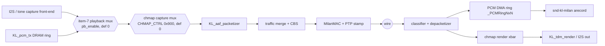

# FPGA design reference - every module in `hdl/`, and how they compose

The complete map of the gateware: what each RTL module does, its interfaces
and clock domain, which harness verifies it, and where its detailed doc
lives. Companion pages: [../integration/INTEGRATION_GUIDE.md](../integration/INTEGRATION_GUIDE.md)
(the outside of the boundary), [../reference/REGISTER_MAP.md](../reference/REGISTER_MAP.md)
(the CSR ABI), [PIPELINE_STAGES.md](PIPELINE_STAGES.md) (stage-by-stage
datapath prose), [pipeline-telemetry.md](pipeline-telemetry.md) (the
in-fabric observability block).

## 0. Global conventions

* **AXIS:** 64-bit `tdata`, 8-bit `tkeep`, `tlast`, 2-bit `tdest` where
  routed (`hdl/common/parameters.svh`); big-endian byte order (wire order ==
  memory order, so the CPU never swaps).
* **CSR:** AXI4-Lite, 16-bit offset (64 KB window), 32-bit data, decoded in
  `milan_csr` in 0x100 groups.
* **Style:** SystemVerilog, `` `default_nettype none ``, TerosHDL `//!`
  comments on every generic/port/signal, named `always_*` processes.
* **No vendor primitives** - see
  [../integration/PORTING_GUIDE.md](../integration/PORTING_GUIDE.md) §2 for
  the audited inventory of the few vendor-*attributes* that remain.

## 1. Top level - two wrappers, one datapath

| Wrapper | File | Host | Contains |
|---|---|---|---|
| `milan_datapath` | `hdl/milan/milan_datapath.sv` | LiteX RISC-V SoC (and the Verilator/Yosys flows) | everything below, MAC-less and PS-less - **the integration boundary** |
| `milan_top` | `hdl/milan/milan_top.sv` | Zynq-7020 PS (`bd/milan-dma.tcl`, `milan_dma_wrapper.v`) | same datapath + the verilog-ethernet `eth_mac_1g_rgmii_fifo` MAC (external source) + PS wiring |

Pipeline (identical in both wrappers):

```
TX: DMA ──► traffic_controller_802_1q ──► ptp_ts_top(TX stamp) ──► adp_tx_arbiter ──► MAC
            (classify ► queues ► CBS)                                  ▲
                                                          adp_advertiser┘
RX: MAC ──► ptp_ts_top(RX stamp) ──► rx_mac_filter(TCAM) ──► DMA
TS: ptp_ts_top ──► m_axis_ts (timestamp metadata records) ──► DMA
```


### 1.1 TX audio chain as composed on main (2026-07-25 merge round)



Both new stages default to bypass: with `pb_enable=0` and `chmap_enable=0`
the packetizer input is bit-identical to the pre-merge datapath.

## 2. Module inventory — COMPLETE (auto-generated from the RTL banners, 2026-07-25)

Every `module` in `hdl/` (77 total, one row each; descriptions are the
modules' own banner lines). Regenerate with the snippet in the commit that
added this section whenever `hdl/` changes shape.

### `hdl/common/`

| module | description |
|---|---|
| `KL_link_guard` |  |
| `axis_mux_rr_2in_1out` | Slave 0 axis interface |
| `cdc_handshake` | File        : cdc_handshake.sv |
| `cdc_pair_fifo` | Gray-pointer dual-clock FIFO, WIDTH x 2^LOG2D. Flags are conservative |
| `cdc_pulse` | File        : cdc_pulse.sv |

### `hdl/common/csr/`

| module | description |
|---|---|
| `milan_csr` |  |

### `hdl/common/eth_event_counter/`

| module | description |
|---|---|
| `ethernet_events` | This module instantiates multiple `event_counter` modules, one for each |
| `event_counter` | This module implements a simple synchronous event counter. |

### `hdl/common/`

| module | description |
|---|---|
| `tx_ifg_gasket` | File        : tx_ifg_gasket.sv |

### `hdl/ieee1722/aaf/`

| module | description |
|---|---|
| `KL_aaf_capture_i2s` | Audio capture front-end (NXN §2.1 / P4): the I2S/CDC half of the old |
| `KL_aaf_latency_chain` |  |
| `KL_aaf_packetizer` |  |
| `KL_aaf_rx_depacketizer` |  |
| `KL_chan_map_capture` |  |
| `KL_chan_map_render` |  |
| `KL_i2s_playback` | I2S DAC serializer, clean-clocked: PCM tap (wire-order S32BE interleave, |
| `KL_lat_history_ring` |  |
| `KL_media_adv` | Fractional-N advance strobe: adv_o duty = TICK_HZ / CLK_FREQ_HZ exactly |
| `KL_pcm_lpf` |  |
| `KL_pcm_ring_bram` |  |
| `KL_pcm_route` |  |
| `KL_pcm_tx` |  |
| `KL_tdm_capture` |  |
| `KL_tdm_render` |  |
| `KL_tone_gen` | 1 kHz / 0 dBFS pilot tone: 48-sample exact-period 24-bit sine table |
| `aaf_talker_i2s` | File        : aaf_talker_i2s.sv |

### `hdl/ieee1722/avtp/`

| module | description |
|---|---|
| `KL_avtp_common_parser` |  |
| `KL_avtp_rx_monitor` |  |
| `KL_avtp_rx_monitor_ctx` |  |
| `KL_stream_table` |  |
| `avtp_stream_parser` |  |

### `hdl/ieee1722/crf/`

| module | description |
|---|---|
| `KL_crf_rx` |  |
| `KL_crf_tx` |  |
| `KL_mmcm_drp_servo` |  |

### `hdl/ieee1722/maap/`

| module | description |
|---|---|
| `KL_maap` |  |

### `hdl/ieee17221/acmp/`

| module | description |
|---|---|
| `KL_acmp_listener` | File        : KL_acmp_listener.sv |
| `KL_acmp_lstn_ctx` | File        : KL_acmp_lstn_ctx.sv |
| `KL_acmp_responder` | File        : KL_acmp_responder.sv |
| `KL_acmp_tlkr_ctx` | File        : KL_acmp_tlkr_ctx.sv |

### `hdl/ieee17221/adp/`

| module | description |
|---|---|
| `KL_adp_parser` |  |
| `adp_advertiser` | File        : adp_advertiser.sv |
| `adp_tx_arbiter` | File        : adp_tx_arbiter.sv |

### `hdl/ieee17221/aecp/`

| module | description |
|---|---|
| `KL_aecp_accessor` |  |
| `KL_aecp_aem_dyn_mux` |  |
| `KL_aecp_aem_store` |  |
| `KL_aecp_common_parser` |  |
| `KL_aecp_ingress` |  |
| `KL_aecp_l0_state` |  |
| `KL_aecp_packet_validator` |  |
| `KL_aecp_response_builder` |  |
| `KL_aecp_timers` |  |
| `KL_aecp_top` |  |

### `hdl/ieee8021as/ptp_timestamp/`

| module | description |
|---|---|
| `ptp_csr_sync` |  |
| `ptp_ts_core` |  |
| `ptp_ts_top` | MAC-side convention - adp_advertiser.sv, |
| `timestamp_counter` |  |

### `hdl/ieee8021q/filtering/`

| module | description |
|---|---|
| `rx_mac_filter` | File        : rx_mac_filter.sv |
| `tcam` | File        : tcam.sv |

### `hdl/ieee8021q/srp/`

| module | description |
|---|---|
| `KL_lwsrp_bw_gate` | File        : KL_lwsrp_bw_gate.sv |
| `KL_lwsrp_ctx` | File        : KL_lwsrp_ctx.sv |
| `KL_lwsrp_ctx_tx` | File        : KL_lwsrp_ctx_tx.sv |
| `KL_lwsrp_ingress` | File        : KL_lwsrp_ingress.sv |
| `KL_lwsrp_registrar` | File        : KL_lwsrp_registrar.sv |
| `KL_lwsrp_rx` | File        : KL_lwsrp_rx.sv |
| `KL_lwsrp_ta_registrar` | File        : KL_lwsrp_ta_registrar.sv |
| `KL_lwsrp_timers` | File        : KL_lwsrp_timers.sv |
| `KL_lwsrp_top` | File        : KL_lwsrp_top.sv |
| `KL_lwsrp_tx` | File        : KL_lwsrp_tx.sv |
| `KL_lwsrp_walker` | File        : KL_lwsrp_walker.sv |

### `hdl/ieee8021q/ts/`

| module | description |
|---|---|
| `credit_based_shaper` |  |
| `traffic_class_map` |  |
| `traffic_classifier` | This module implements an Ethernet packet classifier that parses incoming AXIS frames and |
| `traffic_controller_802_1q` |  |
| `traffic_queues` | One-hot: indicates granted queue |
| `traffic_shaping_core` |  |

### `hdl/milan/`

| module | description |
|---|---|
| `milan_datapath` | This is the single clean HW/gateware boundary the LiteX SoC (sw/litex/milan_soc.py) |
| `milan_top` |  |

<!-- 77 modules -->


Each module's authoritative documentation is its own header banner (house
style: `//!` port docs); this table is the index, not the spec.

## 3. Clock domains & CDC (complete inventory)

| Domain | Contents |
|---|---|
| `axis_clk` (100 MHz `cd_milan` in the deployed LiteX build; ~50 MHz only when split via `--milan-clk-freq`) | all of §2 except the PHC |
| `gtx_clk` (125 MHz) | `timestamp_counter` (PHC), MAC-side timestamp capture |
| MAC RX recovered clock | inside the external MAC only |
| host clocks (PS7 / LiteX `sys`, `sys4x`, `idelay`) | outside the datapath |

Crossings - all in-fabric, all `(* ASYNC_REG *)` plain-FF or handshake based
(no vendor macros): `ptp_csr_sync` (CSR commands → PHC, snapshot return),
`cdc_pulse` + `cdc_handshake` inside `ptp_ts_core` (SOP pulse, timestamp
value), the 2-FF `i_mac_speed` sync in the wrappers. Timestamp metadata
FIFOs are same-clock (`axis_clk`) on purpose - the crossing happens in
`ptp_ts_core`/`ptp_csr_sync`, not in the FIFOs. Constraint requirements per
toolchain: [../integration/PORTING_GUIDE.md](../integration/PORTING_GUIDE.md) §4.5.

## 4. What is *not* in `hdl/` (and where it lives instead)

* **The ring-DMA engines** (`RingDMAReader`/`RingDMAWriter`, BD formats,
  header-split, RSC/GRO) are **Migen**, inside `sw/litex/milan_soc.py` -
  design docs: [CPPI_DMA_REDESIGN.md](CPPI_DMA_REDESIGN.md),
  [HW_GRO_RSC.md](HW_GRO_RSC.md), [HEADER_SPLIT_DESIGN.md](HEADER_SPLIT_DESIGN.md),
  [HSPLIT14_DESIGN.md](HSPLIT14_DESIGN.md); running system view:
  [PIPELINE_STAGES.md](PIPELINE_STAGES.md).
* **The MAC** - external by design (LiteEth on LiteX, verilog-ethernet on
  Zynq).
* **The telemetry block** `milan_tlm` - [pipeline-telemetry.md](pipeline-telemetry.md).
* **The CPU/SoC** - [../litex/LITEX_SOC.md](../litex/LITEX_SOC.md).

## 5. Per-module doc regeneration

The `hdl/**/doc/*.md` pages are TerosHDL-generated from the in-code `//!`
comments (plus a few hand-written ones: `tcam.md`, `adp_advertiser.md`,
`milan_csr.md`). Regenerate after RTL changes by running the TerosHDL
documenter on the `.sv` - and treat the RTL as the source of truth if a
generated page lags. Modules currently missing a doc page:
`milan_datapath`/`milan_top` (rich header comments serve instead),
`rx_mac_filter`, `cdc_pulse`/`cdc_handshake`, `ptp_csr_sync`,
`avtp_stream_parser`, `adp_tx_arbiter`, `axis_mux_rr_2in_1out`,
`traffic_class_map`.
