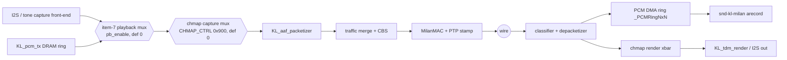

# FPGA design reference - every module in `hdl/`, and how they compose

The complete map of the gateware: what each RTL module does, its interfaces
and clock domain, which harness verifies it, and where its detailed doc
lives. Companion pages: [../integration/INTEGRATION_GUIDE.md](../integration/INTEGRATION_GUIDE.md)
(the outside of the boundary), [../reference/REGISTER_MAP.md](../reference/REGISTER_MAP.md)
(the CSR ABI), [PIPELINE_STAGES.md](PIPELINE_STAGES.md) (stage-by-stage
datapath prose), [pipeline-telemetry.md](pipeline-telemetry.md) (the
in-fabric observability block).

**Where the control plane went (2026-08-13).** The IEEE 1722.1 / SRP control
plane of this device is [`hdl/milan/KL_pp_shadow.sv`](../../hdl/milan/KL_pp_shadow.sv),
which wraps the pinned `protocol-processor` submodule and is instantiated
**unconditionally** by [`hdl/milan/milan_datapath.sv`](../../hdl/milan/milan_datapath.sv) —
no parameter, no fallback, no shadow arm. It owns ADP, ACMP (talker and
listener) and SRP, and publishes a class-D wire face the fabric consumes every
clock (bind record, talker declaration, SRP reservation/slope/domain). MAAP
stays in `hdl/` (`KL_maap` + [`hdl/milan/KL_pp_maap_shim.sv`](../../hdl/milan/KL_pp_maap_shim.sv))
because the processor implements none by design. This repository's own ADP
advertiser and parser, the whole AECP/AEM engine, both ACMP engines and the
lwSRP applicant are **deleted** — the *ieee17221/aecp*, *ieee17221/acmp* and
*ieee8021q/srp* directories no longer exist. `adp_tx_arbiter.sv` survives: it is a
generic 2-in/1-out AXIS packet merge the data lane uses too.

**The AECP surface that comes with it serves the processor's declared command
inventory, including READ_DESCRIPTOR and GET_COUNTERS.** The
responder is the processor's AECP uCPU, inside the submodule and reached through
the same wrapper. `READ_DESCRIPTOR` (0x0004) returns `SUCCESS` with
`configuration_index`, the reserved field and the descriptor, `NO_SUCH_DESCRIPTOR`
on a locate miss and `BAD_ARGUMENTS` on a bad configuration index — both error
paths carrying the IEEE 1722.1 §7.4.5 4-byte `{descriptor_type,
descriptor_index}` stub. Implemented operations use their command-specific
behavior; unsupported opcodes and message types get the conformant fallback.
`IDENTIFY_NOTIFICATION` as a *command* is
`BAD_ARGUMENTS`; a command for another `target_entity_id`, and any AECP response
arriving as input, are freed, counted and left unanswered. The exact implemented
inventory and remaining mandatory gaps are recorded in the current Milan v1.2
audit.

**An echo is not an implementation**, and this tree carries the consequences in
RTL. Commands outside the processor's implemented inventory still use the
fallback. The Milan Table 5.22 unsolicited counter-change scheduler, audio-map
mutation, dynamic information, name access, stream-format and stream-info
setters, and saved-state persistence remain absent. A
stated capability boundary from an informed decision, not a regression and not a
temporary blip. §1.2 names what it costs module by module.

**Where the descriptors come from.** `milan_datapath` exposes a read-only
descriptor-memory master (`o_desc_mem_*` / `i_desc_mem_*`) that the SoC bridges
to DRAM at the compile-time `PP_DESC_BASE_P` — no base register, no runtime
relocation. The end-station builder generates `aem_desc.bin`, `aem_desc.json`,
and `aem_desc.map` from the selected configuration. The board-side `aemi-load`
utility verifies and loads the paired image before entity enable. A missing or
invalid image still answers `BAD_ARGUMENTS`; `NO_SUCH_DESCRIPTOR` means a valid
image lacks the requested descriptor. The store never hangs on a failed read: a
4096-cycle watchdog abandons a stalled burst and covers the request handshake.

## Contents

- **[0. Global conventions](#0-global-conventions)** — The four rules every module obeys: 64-bit big-endian AXIS (wire order *is* memory order, so the CPU never byte-swaps), AXI4-Lite CSR decoded in 0x100 groups, house style, no vendor primitives. Also flags one relic — the `AXIS_TDEST_WIDTH 2` define is dead outside the legacy xsim TBs.
- **[1. Top level - two wrappers, one datapath](#1-top-level---two-wrappers-one-datapath)** — What each wrapper adds around the same datapath, and the TX/RX/TS pipeline drawn out. The sentence that changes how you read every other page: only CPU-originated frames traverse the classifier, the queues and the CBS — the fabric engines inject *after* the shaper and the RX media path taps *before* the dest-MAC filter. §1.1 adds the audio chain as composed on main, both new stages defaulting to bypass; §1.2 is the four-mux TX arbiter cascade and the three functional losses the AECP boundary costs.
- **[2. Module inventory (from the RTL banners; refreshed 2026-08-13)](#2-module-inventory-from-the-rtl-banners-refreshed-2026-08-13)** — Every module in `hdl/`, one row each, grouped by directory, with descriptions lifted from the RTL banners. It states no total on purpose: the live count belongs to the generated matrix, and `ls hdl/` is the authority.
- **[3. Clock domains & CDC (complete inventory)](#3-clock-domains--cdc-complete-inventory)** — Which of the four domains each block lives in, and the complete crossing list — all plain-FF or handshake, no vendor macros. Explains why the timestamp metadata FIFOs are deliberately same-clock: the crossing already happened upstream in `ptp_ts_core`.
- **[4. What is \*not\* in hdl/ (and where it lives instead)](#4-what-is-not-in-hdl-and-where-it-lives-instead)** — Four things you will hunt for in the RTL tree and not find. Mainly the ring-DMA engines, which are Migen inside `milan_soc.py` rather than SystemVerilog, and the MAC, which is external by design.
- **[5. Per-module doc regeneration](#5-per-module-doc-regeneration)** — How the `hdl/**/doc/*.md` pages are produced, which three are hand-written exceptions, and the current list of modules with no page at all. Tie-break rule if a page lags: the RTL wins.

## 0. Global conventions

* **AXIS:** 64-bit `tdata`, 8-bit `tkeep`, `tlast`, and `$clog2(NUMBER_OF_QUEUES)`
  = **3**-bit `tdest` where routed (`traffic_controller_802_1q`, since the queue
  count went to 6); big-endian byte order (wire order == memory order, so the CPU
  never swaps). The `` `AXIS_TDEST_WIDTH 2 `` define in
  [`hdl/common/parameters.svh`](../../hdl/common/parameters.svh) is a relic referenced only by the legacy xsim TBs
  — the live path derives the width from the queue count.
* **CSR:** AXI4-Lite, 16-bit offset (64 KB window), 32-bit data, decoded in
  `milan_csr` in 0x100 groups.
* **Style:** SystemVerilog, `` `default_nettype none ``, TerosHDL `//!`
  comments on every generic/port/signal, named `always_*` processes.
* **No vendor primitives** - see
  [../integration/PORTING_GUIDE.md](../integration/PORTING_GUIDE.md) §2 for
  the audited inventory of the few vendor-*attributes* that remain.

## 1. Top level - two wrappers, one datapath

| Wrapper | File | Host | Contains |
|---|---|---|---|
| `milan_datapath` | [`hdl/milan/milan_datapath.sv`](../../hdl/milan/milan_datapath.sv) | LiteX RISC-V SoC (and the Verilator/Yosys flows) | everything below, MAC-less and PS-less - **the integration boundary** |
| `milan_top` | [`hdl/milan/milan_top.sv`](../../hdl/milan/milan_top.sv) | Zynq-7020 PS (`bd/milan-dma.tcl`, `milan_dma_wrapper.v`) | same datapath + the verilog-ethernet `eth_mac_1g_rgmii_fifo` MAC (external source) + PS wiring |

Pipeline (identical in both wrappers):

```
TX: DMA ──► traffic_controller_802_1q ──► ptp_ts_top(TX stamp) ──► arb cascade ──► MAC
            (classify ► 5 queues ► CBS)                               ▲
                          fabric sources (AAF talkers, CRF talker,    │
                          KL_pp_shadow + KL_maap) inject HERE ────────┘
RX: MAC ──► ptp_ts_top(RX stamp) ─┬─► rx_mac_filter(TCAM) ─┬─► DMA    (host copy)
                                  │                        └─► KL_pp_shadow (a pure
                                  │      monitor of the post-filter stream: classify
                                  │      first, control frames only, then 1 B/clk into
                                  │      the protocol processor)
                                  └─► avtp_stream_parser ► stream table ► RX monitor
                                      ► depacketizer ► PCM route ► ring / DAC
TS: ptp_ts_top ──► m_axis_ts (timestamp metadata records) ──► DMA
```

**Only CPU-originated frames traverse the classifier, the queues and the CBS.**
The fabric engines merge in *after* the shaper, and the RX media path taps
*before* the dest-MAC filter. Hop-by-hop, with the CSR to read at each stage:
[DATAPLANE_WALKTHROUGH.md](DATAPLANE_WALKTHROUGH.md).


### 1.1 TX audio chain as composed on main (2026-07-25 merge round)



Both new stages default to bypass: with `pb_enable=0` and `chmap_enable=0`
the packetizer input is bit-identical to the pre-merge datapath.

### 1.2 The TX arbiter cascade, and what the AECP boundary costs

The trunk used to be **eight** `adp_tx_arbiter` muxes, because five independent
control sources (AECP responses, ACMP talker answers, ADP advertisements, lwSRP
MRPDUs, ACMP listener probes) each needed a merge step. The protocol processor
emits ONE byte stream for every protocol it owns and arbitrates internally, so
four of those merges lost their second source and went with the planes that fed
them. `A_TXARB_DIAG` (`0x784`) now supervises **four**, LSB first:

| lane | mux | merges | watchdog |
|---|---|---|---|
| 0 | `ctl_tx` | `KL_pp_shadow`'s packed TX + `KL_maap` → the control lane | 2^15 |
| 1 | `aaf_final` | shaped CPU traffic + the AAF talkers | 2^16 |
| 2 | `crf_dp` | that + `KL_crf_tx` (data lane — gasket-free, where a class-A stream belongs) | 2^16 |
| 3 | `adp_tx` | the MAC boundary: data lane + the gasketed control lane | 2^17 |

Bits 7:4 read a **structural zero** — there is no fifth-to-eighth arbiter, as
opposed to four that happen never to have locked. The old numbering was 0
`aecp_acmp`, 1 `ctl_tx`, 2 `srp_ctl`, 3 `lstn_ctl`, 4 `maap_ctl`, 5
`aaf_final`, 6 `crf_dp`, 7 `adp_tx`; **anything decoding `0x784` by those
numbers reads the wrong mux.** The stagger is deliberate: an abandoned source
starves every downstream mux on the same cycle, so equal windows would each
inject their own close beat and put a runt on the wire per level.

Three losses are functional rather than cosmetic — they sit behind the
`NOT_IMPLEMENTED` echo, so the command is answered and nothing moves — and each
has a module in the inventory below that is present but idle:

1. **The CRF media clock can never be SELECTED.** AECP `SET_CLOCK_SOURCE` was
   the only writer of the live CLOCK_DOMAIN `clock_source_index`; it is pinned
   at 0, the INTERNAL media clock, for the life of the build. So
   `KL_mmcm_drp_servo` and the `KL_media_nco` packet-grid servo are
   **structurally off** and `A_MCSRV_STAT` (`0x8F8`) reads its idle.
   `KL_crf_rx` still parses, counts and reports — it cannot steer.
2. **Presentation-time offset is pinned at the Milan 2 ms DEFAULT** for every
   Stream Output (`SET_MAX_TRANSIT_TIME` is gone). A default, not a zero: 0 ns
   would be a presentation time in the past and every listener would drop every
   frame as late.
3. **Milan Table 5.4 per-STREAM_OUTPUT counters are live.**
   `KL_talker_diag_ctx` is instantiated for every declared AAF output and the
   CRF output. GET_COUNTERS serves the compact five-counter layout. The
   Table 5.22 unsolicited change producer remains open. The **STREAM_INPUT**
   counters at the `0x6B8` `A_STRMW_CNT` window are unaffected and still live.

One structural note for anyone wiring a board script: the entity enable is now
**either** `PP_CTRL[0]` (`0x920`) **or** the historic `ADP_CTRL.en` (`0x600`
bit 0) — the two are ORed — and `milan_csr`'s `PP_PLANE_P` parameter is gone,
so the `0x920` window is always decoded and `PP_STAT` always carries its `0x5B`
tag. Whichever bit that script uses, the descriptor image belongs in DRAM
*first*: the enable that arrives before the image gives a discoverable,
connectable entity whose every `READ_DESCRIPTOR` misses. The AECP engine's own
counters (commands, responses, drops, locate misses, last status and length,
image-valid, image-fault) are not at `0x648` — that word stays a structural zero
because `aecp_locked` and `current_config` are tied off — but in the processor's
side-port snapshot window behind `PP_SPADDR`/`PP_SPDATA`.

## 2. Module inventory (from the RTL banners; refreshed 2026-08-13)

Every `module` in `hdl/`, one row each; descriptions are the modules' own banner
lines. **No count is stated here on purpose** — counts in prose go stale.
[`../traceability/MODULE_MATRIX.md`](../traceability/MODULE_MATRIX.md) is
*generated* from the tree, prints the live total, and is gated for drift by
`gen_module_matrix.py --check`; `ls hdl/` is the ultimate authority. Regenerate
this table whenever `hdl/` changes shape.

### `hdl/common/`

| module | description |
|---|---|
| `KL_link_guard` | L1/L2 link-bounce supervisor over the eth_tx/eth_rx clocks |
| `axis_mux_rr_2in_1out` | round-robin 2-in/1-out AXIS mux |
| `cdc_handshake` | open, FPGA-independent multi-bit value clock-domain crossing |
| `cdc_pair_fifo` | gray-pointer dual-clock FIFO, WIDTH × 2^LOG2D; flags are conservative |
| `cdc_pulse` | open, FPGA-independent single-bit pulse clock-domain crossing |
| `tx_ifg_gasket` | minimum inter-frame-gap enforcer on the MAC-facing TX AXIS (control lane only) |

### `hdl/common/csr/`

| module | description |
|---|---|
| `milan_csr` | the AXI4-Lite CSR block. `PP_PLANE_P` is **gone** — the `0x920` protocol-processor window is unconditional |

### `hdl/common/eth_event_counter/`

| module | description |
|---|---|
| `KL_mac_rmon_events` | Derives the `ethernet_events` pulse vector from a soft MAC's boundary signals (AXIS handshakes, bad-frame flag, FCS/preamble counts) — the block that revived RMON at VERSION `0x0013`. |
| `ethernet_events` | This module instantiates multiple `event_counter` modules, one for each |
| `event_counter` | This module implements a simple synchronous event counter. |

### `hdl/common/eth_event_counter/`

| module | description |
|---|---|
| `KL_mac_rmon_events` | RMON event-pulse synthesiser for the MAC boundary — the block that revived RMON at VERSION `0x0013` |
| `ethernet_events` | top-level event-counter aggregator, one `event_counter` per lane |
| `event_counter` | simple synchronous counter incrementing on an `incr` pulse |

### `hdl/ieee1722/aaf/`

| module | description |
|---|---|
| `KL_aaf_capture_i2s` | physical-interface audio capture front-end (NXN §2.1 / P4): the I2S/CDC half |
| `KL_aaf_latency_chain` / `KL_aaf_latency_taps` | per-stage TX/RX latency tap chains (item-11) feeding the `LTAP` CSR group at `0x870` |
| `KL_aaf_packetizer` | shared NxN AAF talker packetizer |
| `KL_aaf_rx_depacketizer` | AAF RX payload extractor for the bound listener sink |
| `KL_aes3_rx` / `KL_aes3_tx` | AES3 / S-PDIF biphase-mark receiver and transmitter (item-4 front-end family) |
| `KL_chan_map_capture` | per-pair-slot TX source multiplexer (NxN capture mux) |
| `KL_chan_map_render` | 64 stream-channel → physical render crossbar |
| `KL_i2s_feed_mux` | DAC feed selector: the legacy listener render tap, or the render crossbar paced by the 48 kHz media tick |
| `KL_i2s_playback` | I2S DAC serializer, clean-clocked (wire-order S32BE interleave) |
| `KL_lat_history_ring` | per-stage AAF latency HISTORY ring (item-11, DDR3 arm) |
| `KL_media_adv` | fractional-N advance strobe: `adv_o` duty = TICK_HZ / CLK_FREQ_HZ exactly |
| `KL_pair_blend` | two-source capture pair-stream blend (the Arty I2S-beside-TDM shape) |
| `KL_pair_zero_fill` | silence filler for unfed capture pair slots |
| `KL_pcm_lpf` | 2nd-order IIR low-pass (Butterworth fc 20 kHz @ fs 48 kHz) |
| `KL_pcm_ring_bram` | on-chip dual-port BRAM PCM ring for the listener media path |
| `KL_pcm_route` | NxN PCM routing policy (RENDER-lowest-wins, per-stream DMA rings) |
| `KL_pcm_tx` | host PCM ring → AAF pair-stream source (the ALSA playback arm) |
| `KL_tdm_capture` / `KL_tdm_capture_master` | TDM slave and TDM master audio-capture front-ends (item-4 family) |
| `KL_tdm_render` | TDM slave audio-render front-end |
| `KL_tone_gen` | 1 kHz / 0 dBFS pilot tone: 48-sample exact-period 24-bit sine table |
| `aaf_talker_i2s` | the original single-stream fabric talker |

### `hdl/ieee1722/avtp/`

| module | description |
|---|---|
| `KL_avtp_common_parser` | AVTP common header extractor (big-endian wire order) |
| `KL_avtp_rx_monitor` | single-sink STREAM_INPUT diagnostic-counter engine |
| `KL_avtp_rx_monitor_ctx` | shared NxN STREAM_INPUT diagnostic-counter engine — **live**, feeding the `0x6B8` `A_STRMW_CNT` window |
| `KL_media_clock_restart` | the AVTP `mr` (media clock restart) level this end station transmits |
| `KL_stream_table` | NxN stream-table authority (classification, §1.1 of the NxN doc) |
| `KL_talker_diag_ctx` | Milan v1.2 Table 5.4 per-Stream-Output counters, instantiated once per declared AAF output plus CRF when present. Solicited GET_COUNTERS serves its compact five-counter layout; the Table 5.22 notification scheduler remains open. Its own suite is `tb/verilator/tkdiag` |
| `avtp_stream_parser` | AVTP stream-id + presentation-time extractor; carries the N-entry match table |

### `hdl/ieee1722/crf/`

| module | description |
|---|---|
| `KL_crf_rx` | Milan CRF Media Clock Input engine (measurement half) — still parses, counts and reports; it just cannot steer anything (§1.2) |
| `KL_crf_tx` | Milan CRF Media Clock Output engine (talker half), on the data lane |
| `KL_media_nco` | the steerable media-clock sample grid — **structurally off**: its packet-grid servo had no source but a selected CRF clock |
| `KL_mmcm_drp_servo` | the audio-MMCM recovery ACTUATOR — **structurally off** for the same reason; `A_MCSRV_STAT` (`0x8F8`) reads its idle |

### `hdl/ieee1722/maap/`

| module | description |
|---|---|
| `KL_maap` | MAAP (IEEE 1722 Annex B) block claim: probe / defend / announce. Still this fabric's allocator — the processor implements no MAAP by design |

### `hdl/ieee17221/adp/`

| module | description |
|---|---|
| `adp_tx_arbiter` | two-input AXIS **packet** arbiter. The name is historical: it is generic, and the four-mux TX cascade of §1.2 is four instances of it |

> The former *ieee17221/aecp*, *ieee17221/acmp* and *ieee8021q/srp* directories
> no longer exist. The AECP/AEM engine, both ACMP engines, the ADP advertiser
> and parser, and the eleven-module lwSRP applicant were deleted on 2026-08-13;
> git history keeps them. ADP, ACMP, SRP **and AECP** are now the protocol
> processor's, reached through
> [`hdl/milan/KL_pp_shadow.sv`](../../hdl/milan/KL_pp_shadow.sv) — the AECP
> responder that answers today is its uCPU, not anything in this tree.

### `hdl/ieee8021as/ptp_timestamp/`

| module | description |
|---|---|
| `KL_ptp_clock_validity` | the one place that decides whether this end station is a valid clock source |
| `ptp_csr_sync` | CDC between the `milan_csr` register plane and the PHC |
| `ptp_ts_core` | gPTP frame timestamping core (TX or RX tap) |
| `ptp_ts_top` | the timestamping top level |
| `timestamp_counter` | register-controlled nanosecond timestamp counter (the PHC) |

### `hdl/ieee8021q/filtering/`

| module | description |
|---|---|
| `rx_mac_filter` | cut-through RX AXIS filter driven by the ternary CAM |
| `tcam` | small register-based ternary CAM |

### `hdl/ieee8021q/ts/`

| module | description |
|---|---|
| `credit_based_shaper` | IEEE 802.1Qav credit-based shaper; its idleSlope comes from the processor's granted SRP slope |
| `traffic_class_map` | 802.1Q priority-to-queue mapping (pure combinational) + the control-DMAC table |
| `traffic_classifier` | AXIS frame classifier extracting PCP / control-DMAC information |
| `traffic_controller_802_1q` | classify → queues → shaper top level |
| `traffic_queues` | per-queue packet buffering + one-hot grant |
| `traffic_shaping_core` | the 802.1Qav shaping core |

### `hdl/milan/`

| module | description |
|---|---|
| `KL_pp_maap_shim` | adapter between this fabric's BLOCK allocator (`KL_maap`) and the processor's per-source ALLOC/RELEASE face — the same block+uid law on both sides |
| `KL_pp_shadow` | **this device's entire IEEE 1722.1 / SRP control plane**: the consumer-side wrapper around the pinned `protocol-processor` submodule (ADP, ACMP talker + listener, SRP, and the AECP uCPU that answers `READ_DESCRIPTOR` and echoes `NOT_IMPLEMENTED` at the rest), its classify-first control-frame tap, its blank-flash NVM responder, the side-port host bridge the AECP counters are read through, and the class-D face republished 1:1 |
| `milan_datapath` | the single clean HW/gateware boundary the LiteX SoC ([sw/litex/milan_soc.py](../../sw/litex/milan_soc.py)) instantiates — including the read-only descriptor-memory master (`o_desc_mem_*`) the AECP store fetches the entity model over |
| `milan_top` | the Zynq variant (PS + MAC in line) |

<!-- Count deliberately not stated here: docs/traceability/MODULE_MATRIX.md is
     GENERATED from the tree and prints the live total; `ls hdl/` is authoritative. -->


Each module's authoritative documentation is its own header banner (house
style: `//!` port docs); this table is the index, not the spec.

## 3. Clock domains & CDC (complete inventory)

| Domain | Contents |
|---|---|
| `axis_clk` (100 MHz `cd_milan` in the deployed LiteX build; ~50 MHz only when split via `--milan-clk-freq`) | all of §2 except the PHC |
| `gtx_clk` (125 MHz) | `timestamp_counter` (PHC), MAC-side timestamp capture |
| MAC RX recovered clock | inside the external MAC only |
| host clocks (PS7 / LiteX `sys`, `sys4x`, `idelay`) | outside the datapath |

Crossings - all in-fabric, all `(* ASYNC_REG *)` plain-FF or handshake based
(no vendor macros): `ptp_csr_sync` (CSR commands → PHC, snapshot return),
`cdc_pulse` + `cdc_handshake` inside `ptp_ts_core` (SOP pulse, timestamp
value), the 2-FF `i_mac_speed` sync in the wrappers. Timestamp metadata
FIFOs are same-clock (`axis_clk`) on purpose - the crossing happens in
`ptp_ts_core`/`ptp_csr_sync`, not in the FIFOs. Constraint requirements per
toolchain: [../integration/PORTING_GUIDE.md](../integration/PORTING_GUIDE.md) §4.5.

## 4. What is *not* in `hdl/` (and where it lives instead)

* **The ring-DMA engines** (`RingDMAReader`/`RingDMAWriter`, BD formats,
  header-split, RSC/GRO) are **Migen**, inside [`sw/litex/milan_soc.py`](../../sw/litex/milan_soc.py) -
  design docs: [CPPI_DMA_REDESIGN.md (archived)](../../historical_now_obsolete/fpga/CPPI_DMA_REDESIGN.md),
  [HW_GRO_RSC.md (archived)](../../historical_now_obsolete/fpga/HW_GRO_RSC.md),
  [HEADER_SPLIT_DESIGN.md](HEADER_SPLIT_DESIGN.md) (includes the hsq12 cut-through chapter); running system view:
  [PIPELINE_STAGES.md](PIPELINE_STAGES.md).
* **The MAC** - external by design (LiteEth on LiteX, verilog-ethernet on
  Zynq).
* **The AECP responder and the entity model it serves.** The uCPU is in the
  pinned `protocol-processor` submodule, behind `KL_pp_shadow`; the descriptors
  are not RTL at all but a flat image in DRAM at `PP_DESC_BASE_P`, fetched over
  `milan_datapath`'s read-only descriptor-memory master. Nothing in `hdl/`,
  `sw/` or `scripts/` builds or loads that image today — it is the one piece of
  the AECP path this repository still owes.
* **The telemetry block** `milan_tlm` - [pipeline-telemetry.md](pipeline-telemetry.md).
* **The CPU/SoC** - [../litex/LITEX_SOC.md](../litex/LITEX_SOC.md).

## 5. Per-module doc regeneration

The `hdl/**/doc/*.md` pages are TerosHDL-generated from the in-code `//!`
comments (plus a couple of hand-written ones:
[`tcam.md`](../../hdl/ieee8021q/filtering/doc/tcam.md),
[`milan_csr.md`](../../hdl/common/csr/doc/milan_csr.md); the hand-written
`adp_advertiser.md` went with its module). `find hdl -name doc -type d` is the
authority on which directories still carry pages — `hdl/ieee17221/adp/` no
longer does. Regenerate after RTL changes by running the TerosHDL documenter on
the `.sv`, and treat the RTL as the source of truth if a generated page lags.
Modules with no doc page: `milan_datapath` / `milan_top` / `KL_pp_shadow` /
`KL_pp_maap_shim` (rich header comments serve instead — for the last two the
banner *is* the contract, since the wrapper is deliberately a port list),
`rx_mac_filter`, `cdc_pulse` / `cdc_handshake`, `ptp_csr_sync`,
`avtp_stream_parser`, `adp_tx_arbiter`, `axis_mux_rr_2in_1out`,
`traffic_class_map`.
