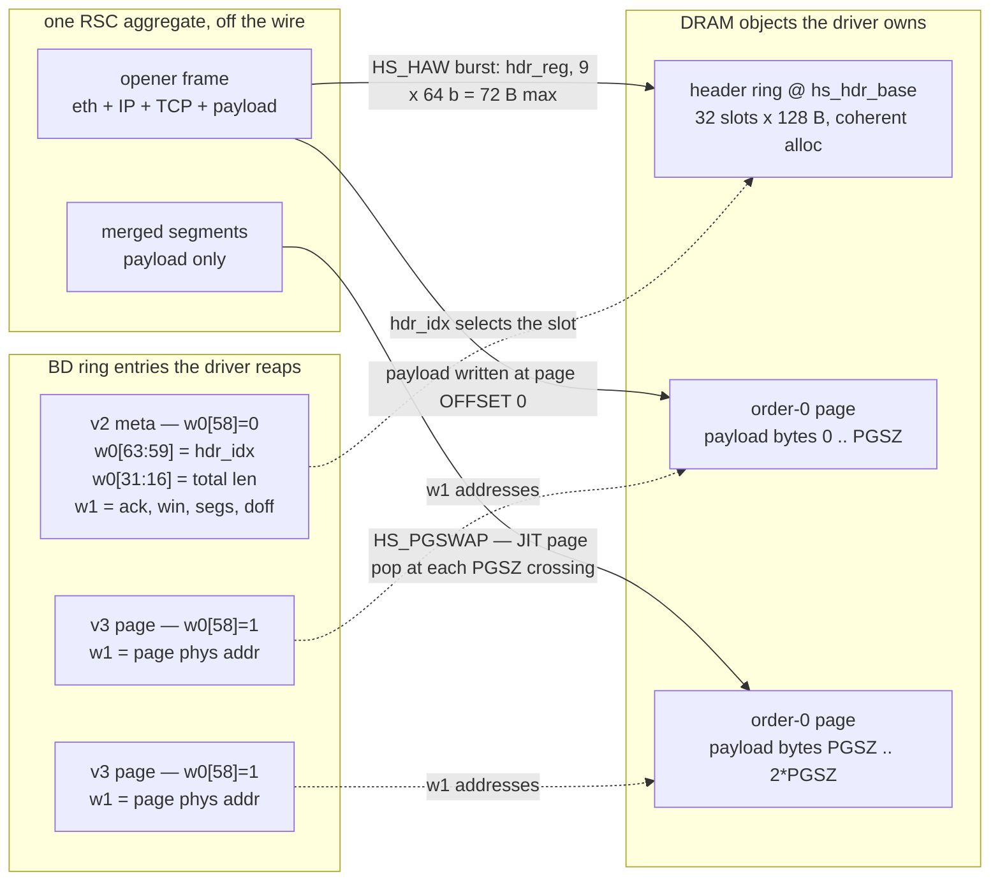
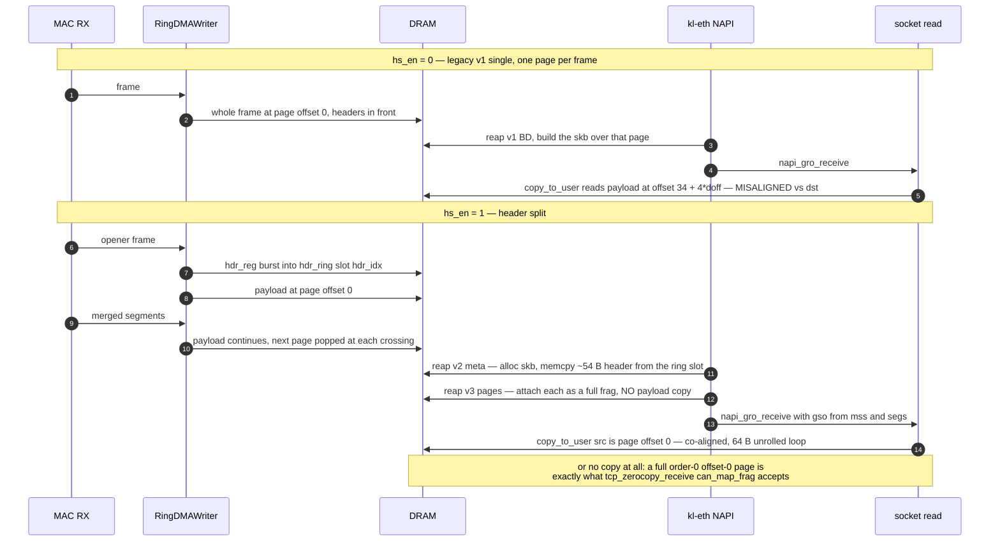
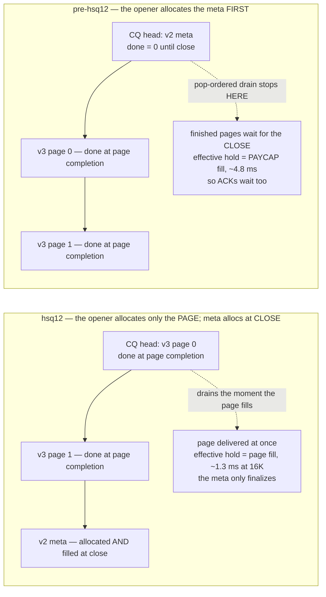

# Header-split zero-copy RX  -  design + silicon history (2026-07-10/11)

**Goal** (headroom lever R-3, now in [`PERFORMANCE_GOAL.md`](../findings/PERFORMANCE_GOAL.md)
Section "Gigabit headroom"): payload lands at **offset 0 of order-0 4 KB
pages** so `tcp_zerocopy_receive`'s `can_map_frag()` accepts every full frag  - 
measured enabler: batched PTE moves 1.22 µs/page vs 26.3 µs copy (21.5×). Target
~700–870 Mbit socket TCP at 100 MHz.

## Contents

- **[Layout](#layout)** — The whole idea in one change: what a descriptor points at. An aggregate becomes three objects — a 32-slot header ring, order-0 pages holding payload at offset 0, and a meta BD carrying an index instead of the header — with pages popped just-in-time at each page crossing.
- **[BD encodings (hs mode only; hs_en=0 ⇒ bit-exact legacy)](#bd-encodings-hs-mode-only-hs_en0--bit-exact-legacy)** — The normative bit table. `w0[58]` discriminates meta from page, `w0[63:59]` carries `hdr_idx`, and a v3's `w1` is a raw page physical address. This is what to decode a captured BD stream against.
- **[Ordering (CQ, extends R2's pop-order invariant)](#ordering-cq-extends-r2s-pop-order-invariant)** — Where each CQ entry is allocated and marked done, and the exact sequence the driver sees. The diagram names the two payoffs the campaign then had to choose between — the aligned copy and the `tcp_zerocopy_receive` page flip — and both later lost to the other on this core.
- **[Driver (kl-eth hsplit mode, module param; legacy default intact)](#driver-kl-eth-hsplit-mode-module-param-legacy-default-intact)** — Four lines: order-0 `page_pool`, the coherent header-ring alloc, four per-tag assembly slots, v1 path untouched.
- **[CSRs (appended after rsc_agemax  -  all existing offsets preserved)](#csrs-appended-after-rsc_agemax-----all-existing-offsets-preserved)** — Only two registers exist for the whole feature: `hs_en` and `hs_hdr_base`. Everything else was kept at its old offset on purpose.
- **[Implementation record (2026-07-10, sim-green)](#implementation-record-2026-07-10-sim-green)** — The as-built version of the design above: final bit layout, the RTL states that do the work (`HS_HAW`, `HS_PGSWAP`), the CSR map shift, and the three sim tests that passed before any silicon.
- **[Silicon status (2026-07-10 night  -  partial, measurement peer lost mid-campaign)](#silicon-status-2026-07-10-night-----partial-measurement-peer-lost-mid-campaign)** — Read for the invalidation, not the numbers: the measurement peer was silently a ghost, so every throughput figure here is void. What survives is the byte-exact BD-stream decode, the proof that page-flips really occur, and a 1.7 % zero-copy drift model that the next section refutes.
- **[Silicon session 2 (2026-07-10 morning, REAL peer = the peer test host)  -  storms were DRIVER bugs; zc model CORRECTED](#silicon-session-2-2026-07-10-morning-real-peer--the-peer-test-host-----storms-were-driver-bugs-zc-model-corrected)** — The pairing storms were two C bugs, not RTL: a label fall-through that rerouted every legacy frame, and a refill over-post that leaked pages. Zero-copy measured 86.5 %, killing the drift model, and the corrected formula is here. Ends with the verdict that still holds — flip 44.9 µs/page vs copy 25 µs, so zerocopy is not the fast path on this core.
- **[build_hsq4 (2026-07-10 evening)  -  the CQ-depth fix VALIDATED; hs takes the single-flow record](#build_hsq4-2026-07-10-evening-----the-cq-depth-fix-validated-hs-takes-the-single-flow-record)** — CQ depth 8→32 plus a 4-bit index relic that had been stamping `done` on `entry & 0xF`. Result: 333–348 Mbit steady, the best single-flow number the SoC had seen. Multi-flow still collapsed, but with a new fingerprint that narrowed the hunt to an orphaned CQ entry.
- **[build_hsq5 (2026-07-10 late)  -  THE MULTI-FLOW LIVELOCK: ROOT-CAUSED, FIXED, SILICON-DEAD](#build_hsq5-2026-07-10-late-----the-multi-flow-livelock-root-caused-fixed-silicon-dead)** — One global "entry allocated by the last pop" register: under multi-flow interleave a page's v3 lands in *another slot's* CQ entry and the drain jams forever. Single-flow never interleaves, which is why it was immune. Also a good record of the hunt itself, false repro included.
- **[build_hsq6 (2026-07-10)  -  MULTI-FLOW NEGATIVE SCALING ROOT-CAUSED: the un-gated BD ring](#build_hsq6-2026-07-10-----multi-flow-negative-scaling-root-caused-the-un-gated-bd-ring)** — The drain never compared against the driver's `rd_ptr`, so the hardware lapped the 64-entry ring and overwrote unread BDs. Includes the corollary that the earlier BD-ring-256 attempt was the same bug made *silent* (seq skew 0 mod 256), and the standing rule: never run a 256-entry driver on un-gated gateware.
- **[build_hsq8/9/10 (2026-07-10 overnight)  -  2-QUEUE HS ON SILICON; 16K PAGES BREAK THE FAMINE](#build_hsq8910-2026-07-10-overnight-----2-queue-hs-on-silicon-16k-pages-break-the-famine)** — 16 KB pages break the famine and turn scaling positive: 381 steady, 374 over a 120 s soak. Carries the drop law that explains every earlier cell (loss every ~60 ms pins cubic, so aggregate ≈ nflows × 60–65 Mbit regardless of queues) and the finding that both harts sit ~40 % idle at 381 — so 500 is CPU-feasible. The hsq6 A/B table and perf profile sit at the end of this section rather than under hsq6.
- **[build_hsq7 / hsq7t (2026-07-10)  -  CQ LUTRAM diet; the 2-queue slice wall FALLS](#build_hsq7--hsq7t-2026-07-10-----cq-lutram-diet-the-2-queue-slice-wall-falls)** — One `Array(Signal)` → `Memory` swap bought −4866 LUTs and made the 2-queue shape fit (99.40 % slices), with the equivalence argument for why the async-read LUTRAM is cycle-exact. It fits, but leaves no room for `rx1 hs_capable`.
- **[hsplit14 / hsq12  -  per-page (cut-through) hs delivery (2026-07-11; folded from HSPLIT14_DESIGN.md, 2026-07-25)](#hsplit14--hsq12-----per-page-cut-through-hs-delivery-2026-07-11-folded-from-hsplit14_designmd-2026-07-25)** — Move the meta from the head of the CQ to its tail and pages drain as they fill: hold drops from ~4.8 ms to ~1.3 ms, because a pop-ordered drain queues everything behind an entry that only completes at close. Took the single-flow record at 329 and lost multi-flow back to hsq10.
- **[The ladder in one grid](#the-ladder-in-one-grid)** — Every build's cells in one table, quoted from the section that measured it. The takeaway is the shape: single-flow peaked at hsq4/hsq12, multi-flow at hsq10, and no build ever held both.

## Layout

The whole design is one change of *what a descriptor points at*. In legacy mode
a BD points at one page holding a whole frame, headers in front of payload. In
hs mode an aggregate becomes **three kinds of object**, and the meta BD carries
an index into the header ring instead of the header itself:

`PGSZ` is the elaborated `hs_page_bytes`: 4096 as originally designed, 16384 in
the records keeper (Section build_hsq10). The bit positions above are the same ones the
BD table below states normatively.

- **Payload**: driver posts order-0 4 KB pages (same RING_POST FIFO). An aggregate
  concatenates TCP payload tightly across pages: page k holds payload bytes
  [4096k, 4096(k+1)). Pages pop **just-in-time at each 4 KB crossing**  -  the AW/W
  burst splitter already never crosses 4 KB (`to_4k`), so a burst never spans pages;
  crossing = swap `s_buf[slot]` to the next popped page. Per-slot state stays
  {current page, payload offset}  -  no page lists in HW.
- **Headers**: opener's captured beats (`hdr_reg`, ≤ 72 B) burst-written at aggregate
  open to `hs_hdr_base + hdr_idx*128` (32-slot ring, `hdr_idx` free-running 5-bit;
  safe: outstanding v2 BDs < BD-ring bound 64/(1v2+Nv3) < 32).
- **v1 singles** (non-TCP/ineligible/ACK-flush): UNCHANGED  -  whole frame at offset 0
  of one page (4 KB ≥ max frame), w1 = addr, realign guard intact.

## BD encodings (hs mode only; hs_en=0 ⇒ bit-exact legacy)

| word | v2 meta (aggregate) | v3 page |
|---|---|---|
| w0[7:0] | 0xBD | 0xBD |
| w0[15:8] | seq | seq |
| w0[31:16] | total len (hdr+payload, as legacy) | 0 (driver derives per-page bytes from v2.len) |
| w0[47:32] | mss | 0 |
| w0[53:48] | drops (6-bit saturating) | drops6 |
| w0[55:54] | **slot tag** | slot tag |
| w0[56] | 1 | 1 |
| w0[57] | psh | 0 |
| w0[58] | 0 = meta | **1 = page** |
| w0[63:59] | **hdr_idx** (5 b) | 0 |
| w1 | {ack, win, segs, doff} (legacy) | **page phys addr** |

## Ordering (CQ, extends R2's pop-order invariant)

- v2 meta CQ entry allocs at **open** (no buffer pop  -  new alloc site), done at close.
- Page entries alloc at their pops; **fill+done at page-complete** (next crossing or
  close)  -  pages of an open aggregate drain AFTER its v2 (pop order) but need no wait
  on close.
- Driver sees: v2(tag) first → alloc skb, copy header (~54 B) from
  `hdr_ring[hdr_idx]`, set gso from {mss, segs}; then N = ceil((len−hdrlen)/4096)
  v3(tag) BDs (interleaved with other tags) → attach full-4K frags (tail partial);
  countdown → `napi_gro_receive`. hdrlen = 34 + 4*doff (ihl=5 enforced by parser).
- Famine mid-aggregate (no page at crossing): close with what's written (psh=0).

End to end, **which copy disappeared?** Not the driver's header copy  -  that one
is new (~54 B out of the ring slot). What goes away is the *payload* ever being
touched by the split, and what changes is where the socket-read copy starts
reading from:

The last two lines are the two payoffs the campaign then had to choose between:
the **aligned copy** (measured 2–3× the misaligned baseline, and the faster of
the two on this core) and the **page flip** (measured 86.5 % zero-copied, but
44.9 µs/page vs 25 µs to copy). Both sections below revisit that trade with
silicon numbers.

## Driver (kl-eth `hsplit` mode, module param; legacy default intact)

order-0 `page_pool`; header ring 32×128 B coherent alloc + `hs_hdr_base` write +
`hs_en=1`; per-tag assembly slots (4); v1 path untouched. Validation:
`tools_recv_zc.c` (TCP_ZEROCOPY_RECEIVE)  -  expect zero-copied% > 0 for the first
time, then steady −P8 time-series.

## CSRs (appended after rsc_agemax  -  all existing offsets preserved)

`hs_en` (1 b, reset 0), `hs_hdr_base` (64 b). Verify via csr.csv diff.

## Implementation record (2026-07-10, sim-green)

- RTL: milan_soc.py RingDMAWriter  -  `hs_en`/`hs_hdr_base` CSRs (rx: +0x5c/+0x60
  rel.), HS_HAW/HS_HW (header burst from hdr_reg), opener payload@0 through the
  existing append rotator (s_lane -> r_lane=0), HS_PGSWAP (JIT page pop at
  off_r==4096 or the lazy boundary flag; famine = close-with-written + tail
  discard with regfile-aware disc math), dual CQ alloc at open (meta drains first),
  CQ_FILL two-pass (v3 then meta), per-entry cq_hs selects the drops6 drain patch.
  v3 carries tag but NO per-page length  -  the driver derives it from v2.len.
- Bit layout final: v2 w0 {BD,seq,len,mss,drops6@53:48,tag@55:54,1@56,psh@57,0@58,
  hdr_idx@63:59}; v3 w0 {BD,seq,0,0,drops6,tag,1@56,0@57,1@58}; w1 v2 legacy /
  v3 page addr. v1 untouched (incl. its 8-bit drops).
- Driver kl-eth `hsplit1`: order-0 pool, 32x128 B header ring, per-tag assembly
  (meta consumes NO page  -  consume_nopage; v3 realigns by address like v1),
  RING_RSC_BUFSZ=57344 payload cap. Map shift: steer 0x308c/90, hash 0x3094,
  rx1 0xf0003098 (window 0x80).
- Sim: test_hs_basic_split / test_hs_page_crossing / test_hs_tag_interleave PASS
  (header slot content, payload@0 byte-exact, cross-page reassembly, tag routing);
  legacy suite green at hs_en=0.

## Silicon status (2026-07-10 night  -  partial, measurement peer lost mid-campaign)

**What is proven on silicon:**
- The BD stream is well-formed under live traffic: raw dump (hsplit5 first-800
  logger) shows strict `[v3 page]* [v2 meta]` per aggregate, sequential pool
  page addresses, tags routing, seq increments  -  decoded byte-exact against the
  bit layout above.
- `tcp_zerocopy_receive` page-flips DO occur (`len=4096` grants): the v3 pages
  are order-0, offset-0, 4096-length  -  the mmap contract the kernel demands.
  The R-3 enabler is real end-to-end at least once per alignment window.
- The module-reload pairing mismatch ("want X have 0 ci=0" right after insmod)
  is **benign**: stale pre-reload BDs parsed by the fresh instance; the hsplit5
  resync self-heals it (60 buffers reposted, traffic then flows). Root-caused,
  no RTL implication.

**What is structurally capped  -  zerocopy fraction (analysis, believed solid):**
pages are per-aggregate (a close flushes the partial tail page; the next
aggregate opens a fresh page at offset 0), but aggregate payloads are n×1448,
so the TCP *stream* offset drifts off 4096-alignment after the first aggregate
and only re-aligns by luck (~a few % of aggregates). Measured zero-copied
fraction: 1.7 %  -  matches the drift model, not a bug. Fixes, in order of value:
1. **Per-flow page continuation** (RTL): keep a slot's partial tail page open
   across same-flow closes (seq-contiguity already checked); emit its v3 when
   the page fills or the flow is evicted. Page boundaries then track the
   stream → ~100 % mappable. Nontrivial: a page's v3 spans closes, so emission
   ordering vs the CQ needs a design pass.
2. MSS 1024 (sender-side `TCP_MAXSEG`): 4 segs/page exactly → 25 % of
   aggregates align. Cheap but partial.
3. Accept the copy path: header-split still delivers the **aligned** copy
   (payload at page offset 0 ⇒ dst/src co-aligned ⇒ the fast 64 B-unrolled
   loop, 2–3× the misaligned baseline). This is the near-term win; the
   [PERF_ON_MILAN.md](../findings/PERF_ON_MILAN.md) Section 6.4 falsifiable prediction (hs-mode profile shows the
   fast loop) is still PENDING a valid-peer re-run.

**Open on silicon  -  multi-page pairing storm (UNDER SUSPICION, DATA TAINTED):**
at TCP ramp (first multi-seg/multi-page aggregates), pairing-lost warns fired
in bursts and re-fired within 4–5 pages of every resync; after the storms even
legacy mslot mode crawled until a full FPGA reload (a `page_pool_release_retry`
275-page leak pinned the old pool). Two suspicions:

- (a) a pop-vs-BD-emission leak in the JIT-crossing or famine-disc path;
- (b) ring-disable only clears slot/CQ state from the FSM IDLE state  -  a
  non-IDLE wedge (e.g. PGSWAP waiting on a famine-drained posted FIFO)
  survives `RING_EN=0` and poisons the next session, which would ALSO defeat
  the driver's resync (storm).

**However**: the entire storm dataset was captured while the measurement peer
was silently a ghost (see below)  -  the traffic was a 1.4 Mbit trickle with
>tout gaps, i.e. the pathological regime. Re-test against a real peer before
touching RTL; if it reproduces, sim the exact regime (tout-degenerate → ramp
transition, 60-page famine, PSH-legacy interleave) with the strict pairing
checker.

**Measurement-validity note:** overnight the dev VM lost the Intel NIC
passthrough (enp6s0 → gone; the new enp7s0 is an isolated segment). The board's
ARP for the peer IP resolved to the OUTER machine (an Intel-OUI MAC, not the real peer NIC), where a
previous session's http server and tcp_blast listeners still answered  -  a ghost
peer over a degraded bridge.

Every throughput number from this night's silicon
session (zc 1.4 Mbit, mslot 0.2–1.6 Mbit "collapse") is **invalid as a
performance measurement**; only the BD-stream decodes, the reload-resync
root-cause, and the zc-alignment fraction analysis survive.

## Silicon session 2 (2026-07-10 morning, REAL peer = the peer test host)  -  storms were DRIVER bugs; zc model CORRECTED

**The pairing storm reproduced against a healthy peer and was root-caused to TWO driver
bugs** (forensics: a last-48 BD ledger tagged {slot,seq,comp_i,exit} dumped at mismatch,
kl-eth hsplit7):
1. **Label fall-through (hsplit1 regression):** the v1 delivery tail relied on falling
   through into `consume:`; inserting `consume_nopage:` between them silently rerouted
   every legacy frame (ARP, handshakes) to the no-advance exit AFTER `page[i]` was NULLed
    -  ledger desync on the first ARP, resync re-broken by the next ARP = the storm.
2. **Refill over-post:** `kl_poll` reposted one page per *BD processed*; hs metas consume
   no page, so each meta over-posted by one, wrapping `post_i` over unconsumed slots
   (leaking their pages  -  the `page_pool_release_retry` inflight leaks) and desyncing the
   HW FIFO. Fix: exact `pages_out` accounting (consume + realign credit; famine debt
   carries across polls).
Both fixed in **kl-eth hsplit9** (fc4ca00). Validated: hs single-flow **138 Mbit, 0
pairing-lost**; legacy mode via the same driver 280 Mbit clean. Sim never caught either
because DriverModel *reimplements* the contract  -  the bugs lived in the C control flow.

**Zero-copy measured on the working path: 86.5 % zero-copied** (recv_zc, 12 s). This
REFUTES Section silicon-1's drift analysis (kept above as a record): `tcp_zerocopy_receive`
maps ANY full order-0/offset-0/4096 frag  -  the *stream* offset needs no page alignment
(partial tails + headers arrive via `recv_skip_hint` copies). The ghost-era 1.7 % was the
degenerate 1-seg regime (1448 B never fills a page), not drift.

Corrected model:
**zc% ≈ 1 − (tail partial + header) / aggregate payload**  -  it rises with aggregate size
(~86 % at ~20 KB aggregates, →93 %+ at PAYCAP). Consequences:

- per-flow page continuation targets the *tail-partial* term (worth ~10 %,
  much less than previously claimed);
- MSS games (1024/2048/4096) are ~irrelevant to zc%;
- jumbo frames help per-packet CPU cost, not zc%.

**However zc throughput (90 Mbit) < aligned-copy (138) at 100 MHz**  -  mapbench's
flip(44.9 µs/page) > copy(25 µs) verdict holds; zerocopy is not the fast path on this core.

**Aligned-copy prediction CONFIRMED on silicon** (PERF_ON_MILAN Section 6.4): the hs-mode profile
shows the copy at `fallback_scalar_usercopy+0x3c/+0x40` (the 64 B-unrolled aligned loop)
at only ~4 % of the hart; the misaligned +0xa8..+0xcc cluster is gone. At 130–138 Mbit
both harts are ~63 % in `default_idle_call`  -  **hs single-flow is latency/serialization-
bound, not CPU-bound** (headroom exists; find the stall).

**OPEN RTL BUG  -  multi-flow hs livelock:** 4 parallel flows collapse (2–4 Mbit) with NO
pairing loss, NO famine (55 buffers posted), NO rx errors; CSR forensics: frames counter
climbs, drops climb (3309), BD `wr` frozen, RING_EN=1  -  every frame takes a drop path
while nothing closes = CQ jam / slots-stuck-open livelock. A driver reload (ring-disable
toggle) RECOVERS it, so the FSM does reach IDLE  -  it is a livelock, not a stuck state.
Next: sim repro at the silicon geometry (4 flows, appends at line rate, CQ pressure,
header bursts, PSH interleave) with a close-reason/CQ-occupancy checker.

## build_hsq4 (2026-07-10 evening)  -  the CQ-depth fix VALIDATED; hs takes the single-flow record

- **build_hsq4** = hsq3 + q0 `cq_depth` 8→32 (536ba68) + `s_cq` width relic fix
  (`Signal(4)`→`Signal(max=cq_depth)`, 9e67657  -  at CQD=32 the 4-bit index stamped
  done on entry&0xF: first spin delivered 24 KB then went silent) + `--rx-queues 1`
  (CQD=32 overflowed slices with rx1+steer aboard; hs is q0-only anyway). WNS **+0.224**
  (best hs margin), LUTs 81 %, suite 37/37.
- **Silicon: single-flow hs = 312.8 Mbit cell / 333–348 Mbit STEADY** (peer tx_bytes 5 s
  series ×5)  -  vs 138 at CQD=8, 279 at the BUFSZ probe, and ~300 mslot single. The
  aligned-copy advantage is real: **best single-flow number ever on this SoC** (previous
  records 259–277). Residual drops ~42/s (was 250/s)  -  next refinement, not a clamp.
- **Multi-flow hs still collapses (RTL, OPEN)**  -  but the fingerprint CHANGED at CQD=32:
  only 130 drops, zero pairing loss, BDs flowing mid-run, RX dead at the end. With the
  deeper CQ the pressure-close valve (level ≥ CQD−2) effectively never fires, so an
  ORPHANED CQ entry  -  allocated at open, never marked done (aborted-open path?)  -  blocks
  the head permanently once it surfaces. This narrows task #13's sim hunt: find the
  alloc-without-done path (famine/discard between `cq_alloc()` and close staging), then
  either stamp done on abort or add a head-orphan timeout close.
- Driver unchanged (CQ invisible to the ABI); detects 1 queue via the rx1 probe-readback.
  hsq4 CSR map = hsq3 minus steer/hash/rx1 (hs_en still 0xf0003080; NO hash_sel poke).
- Board parked on **hsq3** (2-queue keeper) + hsplit9 legacy; **hsq4 = the hs bitstream**.

## build_hsq5 (2026-07-10 late)  -  THE MULTI-FLOW LIVELOCK: ROOT-CAUSED, FIXED, SILICON-DEAD

**Root cause** (task #13, cycle-exact sim forensics): `HS_PGSWAP` emitted each
completed page's v3 into **`cur_cq`  -  a single global "entry allocated by the last
pop" register**. Under multi-flow interleave another slot's open/crossing pops in
between, so the v3 lands in the WRONG CQ entry and the slot's real page entry
(`s_cq[slot]`) stays done=0 forever  -  the in-order drain jams behind it. Single-flow
never interleaves pops = immune (hence hsq4's 340 single vs -P4 death).

The hunt:
false-repro (pool dry-up) → driver-in-loop repro → 1-cycle-pulse aliasing → full-rate
watcher generator → FSM-state tags → `fsm=DISCARD` on the orphan meta = the
PGSWAP-famine close → the `cur_cq` read. Fix (f2b80ec): v3 targets `cq_of_sel`.
Suite 39/39 incl. the new PASS-asserting livelock regression.

**Silicon (build_hsq5, WNS +0.132):** single-flow 308 (=hsq4 ✓), and **-P4 survives
storm + stays alive**: 4/4 flows complete (217 Mbit aggregate), zero pairing warns  - 
previously 2 dead flows + wedged RX. -P8 steady 181–216.

**Multi-flow now WORKS but
scales negatively** (308→277→217→~190): drops ~240/s under interleave, UNCHANGED by
BUFSZ 57K→24K (famine refuted)  -  the residual is a new investigation (CQ
pressure-close dynamics / sender interaction), not a correctness bug. hs scoreboard:
**single 340 steady (SoC record), multi-flow functional; mslot keeper still wins
aggregate (368-407 -P8).**

## build_hsq6 (2026-07-10)  -  MULTI-FLOW NEGATIVE SCALING ROOT-CAUSED: the un-gated BD ring

**The investigation** (close-reason counters per cell + peer `ss -ti` + live-CSR
sampler, per the handoff protocol): the P1→P8 ladder showed drops ≈58/flow/s
CONSTANT while the close mix stayed healthy (psh ~90%, cap=0, park *falls* with N,
avgsegs 17–29)  -  CQ pressure-close refuted immediately.

Peer `ss -ti` showed all
flows congestion-limited (cwnd 6–80 sawtooth, retrans ≈ board drop counter, board
advertising 0.8–1.9 MB windows) = real HW losses driving synchronized TCP loss
cycles.

The live sampler then caught the smoking gun: **frames/irqs/occ_hi CSRs
resetting mid-cell** (= ring re-enables) + dmesg full of **"RX BD desync  - 
self-healed"**  -  a resync storm, 12+/cell at -P4, 35 at -P8. Each resync is a
ring-down blackout that kills all in-flight aggregates and synchronizes every
flow's retransmit.

**Root cause** (RTL read): `cq_drain = (cq_level != 0) & cq_done[head]`  -  the BD
drain **never compared against the driver's `rd_ptr`**. Under a reap gap the HW
laps the 64-entry DRAM BD ring and overwrites unread BDs (seq skew = exactly 64 ⇒
the driver's seq check trips ⇒ desync ⇒ resync). Production is NOT page-bounded:
hs **meta BDs consume no posted page** (worst case ≈ 2×KL_BD_POST+4 ≈ 124
outstanding vs 64 slots).

The sim stormhunt had actually FOUND this lap earlier
("first hunt finding: >entries outstanding silently overwrites unreaped BDs") and
papered over it with a ≤13-outstanding harness contract  -  hs metas broke the
contract on silicon.

Corollary: the reverted BD-ring-256 attempt (e251a0c
"zero-byte transfers, creeping delivery") was the SAME bug  -  at 256 entries the
lap shifts the 8-bit seq by 0 mod 256, so the detector goes blind and the
corruption is silent. At 64 it was at least detected and self-healed.

**Silicon proof before any RTL** (measure-don't-assume): KL_BD_POST=28 probe  - 
2×28+4 ≤ 63 makes the lap arithmetically impossible. Desyncs 12+/cell → **0**,
frames/irqs monotonic, occ_hi ≤ 40 entries. (Steady drops ~200/s persist = the
separate second-order famine/CQ-block effect; posted pool never emptied at
post=60, so those are reap-gap open-blocks, not page famine.)

**Fix**: `bd_room`/`bd_room2` gate the drain  -  WB stalls at wr+16==rd (wr+32 for
the WB_B drain-chain hop, where wr advances in the same cycle). Overload backs
into the CQ ⇒ counted ingress drops, never corruption; a dead driver degrades to
the same drop mode as legacy ring-full. Reload-safe: kl-eth writes RING_RD=0 in
both init and resync. Pairs with **kl-eth hsplit10**: KL_BD_ENTRIES 64→256 (4×
reap slack, now safe  -  laps impossible) + KL_BD_POST back to 60. NEVER run
hsplit10 (256) on un-gated ≤hsq5 gateware  -  silent lap by construction.

**Sim**: new `test_bd_ring_full_gate` (jam at wr+16==rd with rd frozen; slots
not lapped; CQ-full newcomer drops counted; rd advance resumes in order  -  FAILS
on pre-gate RTL). All driver-in-loop models (DriverModel/StormModel/livelock/
famine reap_once) now mirror the other half of the driver contract: RING_RD
write after reap, RING_RD=0 after heal (`BDHarness.rd_sync`). Suite 38/38 ALL
PASS + the standalone livelock probe green (39 total).

## build_hsq8/9/10 (2026-07-10 overnight)  -  2-QUEUE HS ON SILICON; 16K PAGES BREAK THE FAMINE

**hsq8** (2q + strip-probes + rx1-hs CQD=32, spr WNS+0.139) + **hsplit11 hsplit=2**:
dual-queue hs LIVE (both queues 60 posted/256 BDs), 0 desyncs all night. Ladder:
P1 285 / P2-1:1 306 / P4-2:2 ~265 / P8 244  -  inverse scaling, drops 28-213/s.
The steering itself verified per-cport (parity hash maps exactly; the steer_q*
counters misreport under dual-active load = telemetry bug, deltas only trustable
single-active).

**hsq9** (+ the META-at-head pressure fix, spr +0.141): ladder
IDENTICAL  -  pressure-close correct in sim but INERT at real loads (internal CQ
never nears depth-2).

The drop law that unified every cell: **per-flow loss every
~60 ms pins cubic at ~35-50 segs ⇒ aggregate ≈ nflows × 60-65 Mbit regardless of
queues**; queues only multiply the ceiling once drops ≈ 0 (legacy 16K-buffer runs:
0 drops @375 single-queue = the existence proof).

**hsq10 = hs_page_bytes 16384** (1ba2b91; 60 pages: 240KB→960KB/queue absorbency)
+ **hsplit12 hs_pgsz=16384** (f7695f4): **THE FAMINE BREAKS**  -  P2-1:1 drops 28→5/s,
**P4-2:2 = 381 steady / 374 over a 120 s soak** (flows even, 15 drops/s), P6 353,
P8 330-352 (drops creep back ≥3 flows/queue). Positive scaling at last (P4 > P2).

**Both harts ~40% IDLE at 381 ⇒ latency/protocol-bound, NOT CPU-bound  -  500 is
CPU-feasible.**

TX gate on every gateware: hsq8 646, hsq10 582-637 (✓ no
degradation; the 400-500 "regressions" mid-night were a 2-proc scheduler/qdisc
fairness lottery on the single netif queue  -  one process starves at ~82 Mbit;
ACK steering measured constant-on-q0 across cport geometries; threaded NAPI
equalizes; fq qdisc absent from the kernel = follow-up).

Scoreboard after the night: **RX 381/374-soak (was 295), TX 582-646 ✓, goal
RX>500 at 76%.** Ranked next levers: rx-usecs sweep on the 16K regime; PAYCAP
RTL widening (RING_RSC_BUFSZ truncates at 16 bits  -  0x1C000 wrote as 0xC000);
per-flow residual drops (15/s at the P4 soak); hs delivery-latency shaving;
CONFIG_NET_SCH_FQ for TX fairness; 32K pages. Driver fix shipped on the way:
hsplit12 also kicks EVERY queue's fast poll (was rxq[0]-only  -  q1 flows starved
via poll-latency before threaded NAPI masked it).

**Silicon (build_hsq6, WNS +0.243, CSR map identical to hsq5; driver hsplit10)**
 -  same-day A/B, 40 s cells, peer tx_bytes 5 s deltas (first+last interval
excluded), reconstructed peer (absolute numbers ~5-8% below the pre-reboot peer;
compare within the day only):

| cell | hsq5+hsplit9 (baseline)        | hsq6+hsplit10 (fix)        | Δ steady |
|------|--------------------------------|----------------------------|----------|
| -P1  | 308 / 52 drops/s               | 312 / 51, 0 desyncs        | unregr ✓ |
| -P4  | 231 / 260, resync storms       | **295** / 194, **0 desyncs** | **+28%** |
| -P8  | 183 / 438, **35 desyncs**      | **240** / 319, **0 desyncs** | **+31%** |

occ_hi high-water hit 81 BD entries at -P4  -  beyond the old 64-ring's capacity,
i.e. the 4× reap slack is actually being used; frames/irqs stayed monotonic
(zero ring re-enables) in every cell. Negative scaling flattened
(312→295→240 vs 308→231→183).

The residual 194–319 drops/s (≈58/flow/s
constant, unchanged shape) is the second-order reap-gap effect  -  opens blocked
during µs-scale windows (CQ backs up while bursts outrun the poll)  -  now a
clean-loss problem, not corruption.

Next levers, in handoff order: 2-queue hs
(mslot keeper's 368-407 is 2-queue; hs is 1-queue), then drop-window shaving
(pressure-close covering the open-slot-PAGE-at-head case, poll cadence).

**Post-fix perf profile @ -P4 295 (PERF_ON_MILAN method, timer 250 Hz, 12 s,
symbolized host-side; /proc/stat ground truth over the window):**
- **cpu1 (app hart): 0 idle ticks  -  saturated; 66.4% = the recv payload copy**
  (`fallback_scalar_usercopy_sum_enabled`, cold-DRAM reads). The copy hart is
  the aggregate ceiling, as in the R1-era analysis.
- **cpu0 (NAPI hart): ~84% busy / 15.9% idle.** Composition (65% sample
  coverage; top of the flat tail): locks/irq 12.1% (11.5% =
  `_raw_spin_unlock_irqrestore`  -  long irq-off/socket-lock sections), skb/mm
  8.5%, tcp 4.9%, gro/napi 3.5%, **kl_eth driver code ≈5%  -  the reap itself is
  CHEAP**; rest = flat TCP/skb tail.
- Implications: (1) optimizing the driver reap buys nothing; (2) cpu0 has idle
  headroom, so residual drops are BURST-latency (irq-off windows + delivery
  latency) not poll-throughput; (3) with occ_hi=81 ≪ 256 the BD ring no longer
  fills  -  the binding buffers are now the **60-page posted pool (~2 ms at line
  rate) and the internal CQ-32 head-of-line case**, which is where the
  pressure-close gap (close_prs blind to PAGE-at-head) matters.

## build_hsq7 / hsq7t (2026-07-10)  -  CQ LUTRAM diet; the 2-queue slice wall FALLS

The 2-queue-hs prerequisite was area: hsq6 placed at **96.8% slices**, and the
2-queue+CQD32 config had died at placement in the hsq5 era. The diet (222e9f1):
`cq_w0/w1` Array(Signal(64))×CQD → one **128-bit Memory, sync-write +
async-read port (RAM32M distributed LUTRAM)**.

Cycle-exact equivalent (writes
land on the edge like NextValue; a filling entry has done=0 so the drain never
reads a same-cycle-written address; the four fill sites are FSM-exclusive so a
single write port suffices). Kills the CQD-way write demux at every fill site
plus the drain read mux. Suite 38/38 + livelock probe green.

| build | queues | LUTs          | slices     | WNS    | verdict |
|-------|--------|---------------|------------|--------|---------|
| hsq6  | 1      | 51908 (81.9%) | 96.83%     | +0.243 | prior keeper |
| hsq7  | 1      | 47042 (74.2%) | 94.97%     | +0.028 | **new keeper, silicon-clean** |
| hsq7t | 2      | 54057 (85.3%) | **99.40%** | +0.028 | **FITS + CLOSES** (q0-hs CQD32 + q1-legacy CQD8) |

−4866 LUTs from one Array→Memory swap. Both diet builds land at WNS +0.028
(same critical path family; the async LUTRAM read is the suspected new
violator  -  if a future build misses, the fallback is a sync-read port
prefetched during WB_AW).

**hsq7 silicon unregression: P1 312 = exact match,
P4 277/289 vs 293–295 (TCP variance band, repeat confirmed), 0 desyncs.**

hsq7t proves the 2-queue shape fits, but at 99.4% there is NO room for
rx1 hs_capable  -  the strip-probes diet (area-70 catalog) gates the full
2-queue-hs build. Next: strip-probes flag → rebuild 2-queue with rx1-hs →
kl-eth hsplit11 (per-queue hs) → the 368-407 mslot aggregate assault.

## hsplit14 / hsq12  -  per-page (cut-through) hs delivery (2026-07-11; folded from [HSPLIT14_DESIGN.md](../../historical_now_obsolete/fpga/HSPLIT14_DESIGN.md), 2026-07-25)

*2026-07-11. Kills the RSC hold latency (the per-flow ~95 Mbit plateau closed-form:
rate = PAYCAP/fill-cycle, because ACKs wait for aggregate close). Pages become visible
as they complete; the meta arrives LAST and only finalizes. Effective hold:
PAYCAP-fill (~4.8 ms) → page-fill (~1.3 ms @16K). Pairs STRICTLY: hsq12 gateware ↔
kl-eth hsplit14.*

### Why the pre-hsq12 RTL holds everything to close

The hs opener allocates TWO CQ entries: meta FIRST (drains first), page second.
The meta's `done` only sets at close (stage_close fills it)  -  and the CQ drain
is pop-ordered, so the undone meta at the head **blocks every completed page
v3 behind it** until close. The driver (hsplit9..13) builds the header skb from
the meta then attaches v3 frags: meta-then-pages is the ABI today.

**Why the meta had to move from the head of the CQ to its tail** — the drain is
pop-ordered, so whichever entry is allocated first is the one everything else
queues behind, and an entry that only becomes `done` at close is a hold on the
entire aggregate:

### hsq12 RTL changes (RingDMAWriter)

1. **Opener allocates ONE entry** (the first page). Delete `cur_cqm` staging and
   the second `cq_tail+2` bump (gate can relax to `cq_level < CQD-1`; keep -2
   for margin). Delete the `s_cqm` array, the `mcl_of_*` hops, and the hsq9
   META-at-head term in `head_open_hit` (dead  -  there is no undone meta at the
   head anymore; pages are done-at-completion, the close-meta is done-at-fill).
2. **stage_close(k, cqi, …) allocates the meta at CLOSE**: replace
   `NextValue(meta_cqi, mcqi)` with a tail alloc
   (`meta_cqi←cq_tail; cq_done[tail]←0; tail+1`)  -  CQ order becomes
   v3…v3, meta (meta LAST). The pv3 (last page) still fills `cqi` =
   `cq_of_sel`/the slot's registered page entry (LIVELOCK INVARIANT: the page
   v3 always targets the slot's own entry  -  unchanged).
3. **Every stage_close caller gains `& cq_room`** (alloc needs a free entry).
   Deferral semantics per site:
   - exp (tout/age) + pressure closes: simply retry next cycle (conditions
     persist).
   - same-flow-gap / victim park-closes: the existing `.Else` drop path
     already handles no-room (frame drops counted; BD-gate makes full-CQ safe).
   - psh-close-after-append: defer = aggregate stays open with s_psh[k] held;
     exp/pressure close it later. VERIFY s_psh persists (slot reg  -  it does).
   - ACK-flush-vs-open ordering (test_bd_ack_flush…): re-run, order semantics
     unchanged (v1 ACks unaffected).
4. **v3 w0 gains two fields** (both zero today):
   - `[63:59] hdr_idx`  -  same position as the meta's (uniform decode). Sites:
     HS_PGSWAP writes `s_hidx[slot_sel]`; the pv3 path stages `pv3_hidx` in
     stage_close (`s_hidx[k]`).
   - `[31:16] fill_len`  -  bytes in THIS page. HS_PGSWAP writes
     `hs_page_bytes`; the pv3 writes the partial fill
     `(s_off[k] & (hs_page_bytes-1))`, with the ==0 case fixed up to
     `hs_page_bytes` (one Mux). This lets the driver deliver every v3
     immediately (no deferral waiting for the meta to learn the last page's
     length).
   Layout after: [7:0]=0xBD, [15:8]=seq(drain-patched), [31:16]=fill_len,
   [47:32]=0, [53:48]=drops6(drain-patched), [55:54]=tag, [56]=1, [57]=0,
   [58]=1, [63:59]=hdr_idx.

### kl-eth hsplit14 changes

v3 handler (pages now arrive FIRST):
- `tag`, `hdr_idx=(w0>>59)&0x1F`, `fill=(w0>>16)&0xFFFF`, page from FIFO
  pairing (w1 addr verify unchanged).
- If `!asm[tag].active`: bind headers  -  parse the hs_hdr slot directly
  (hdrlen = 34+4*doff from slot byte 46>>4; seq from bytes 38-41); record
  `{hdr_idx, seq_base, delivered=0}`.
- **Deliver PER PAGE**: alloc skb (hdrlen), memcpy headers from the slot,
  patch: ip tot_len = hdrlen-14+fill, tcp seq = seq_base+delivered, recompute
  IP csum (as today's meta path), attach the page frag (len=fill, truesize=
  hs_pgsz), gso_size=1448 when fill>1448, CHECKSUM_UNNECESSARY,
  napi_gro_receive. `delivered += fill`.
- META handler shrinks: stats (rx_packets += segs), psh/ack/win are NOT
  retro-patched (already-delivered units carried the open header's ack/win  - 
  acceptable; psh only affects app-wake latency), clear asm[tag]. The stale-asm
  guard flips: a META with no active asm = normal for 0-payload closes.
- Teardown/resync: clear asm (exists).

### Sim updates (test_ring_bd.py)

- ALL hs tests flip expected BD order to pages…meta (basic_split, crossing,
  tag_interleave, famine, pressure) + assert v3 hdr_idx/fill_len.
- New: interleaved two-flow early-binding test (v3s of A and B interleave
  before either meta  -  driver-model binds per-tag headers correctly).
- Livelock probe: reap model's page/meta accounting is order-agnostic (verify).

### Expected effect + follow-ups (as planned, 07-11)

rtt ≈ page-fill + delivery (~1.5 ms) ⇒ per-flow headroom ≈ cwnd·MSS/rtt ≫ 125;
P4 should push toward the CPU ceiling (~550-600 aggregate at the measured
cy/B). Pairs best with 16K pages (early delivery recycles pages sooner  - 
famine pressure drops, so 32K's absorbency matters less; re-measure). Keep
`hs_pgsz`/`hs_page_bytes` STRICT pairing. TX gate after every swap.

### Measured outcome (2026-07-11)

Cut-through took the **single-flow record: 329 (hsq12 + hsplit14)** but lost multi-flow
to the hsq10 keeper (staircase granularity + per-unit cost); the parked follow-ups are
8 K pages or chunk batching in the v3 handler. Delivery generations + records table:
[`PIPELINE_STAGES.md`](PIPELINE_STAGES.md) (stages R7/R8).

## The ladder in one grid

Each section above reports its own cells; this collects them so the shape of the
campaign is visible at a glance. Every figure is quoted from the section that
measured it — blanks are values that section never took, not zeros. (What each
`hsqN`/`hsplitN` *means*, and the strict gateware↔driver pairings, are the
lineage table in [`PIPELINE_STAGES.md`](PIPELINE_STAGES.md); this grid is the
throughput ladder that table does not carry.)

| build | q | page | WNS | single / −P1 | −P2 | −P4 | −P8 | the change that moved it |
|---|:--:|:--:|---|---|---|---|---|---|
| hsq4 | 1 | 4K | +0.224 | 312.8 cell, 333–348 steady | – | collapse | – | q0 `cq_depth` 8→32 + the `s_cq` width relic |
| hsq5 | 1 | 4K | +0.132 | 308 | – | 217 (4/4 flows live) | 181–216 | v3 targets `cq_of_sel`: the multi-flow livelock |
| hsq6 | 1 | 4K | +0.243 | 312 | – | **295** | **240** | `bd_room` gates the drain — desyncs 12+/cell → **0** |
| hsq7 | 1 | 4K | +0.028 | 312 | – | 277 / 289 | – | CQ array → 128-bit LUTRAM memory, −4866 LUTs |
| hsq7t | 2 | 4K | +0.028 | – | – | – | – | area proof only: the 2-queue shape **fits** at 99.40 % slices |
| hsq8 | 2 | 4K | +0.139 | 285 | 306 | ~265 | 244 | dual-queue hs live, 0 desyncs all night; inverse scaling |
| hsq9 | 2 | 4K | +0.141 | 285 | 306 | ~265 | 244 | META-at-head pressure fix — correct in sim, **inert** on silicon |
| hsq10 | 2 | **16K** | – | – | drops 28→5/s | **381 steady, 374 over a 120 s soak** | 330–352 | page size 4K→16K: the famine breaks, scaling turns positive (P6 353) |
| hsq12 | – | 16K | – | **329 — single-flow record** | – | – | – | cut-through CQ ordering; loses multi-flow back to hsq10 |

Read the column, not the row: single-flow peaked at hsq4/hsq12 and multi-flow at
hsq10, and no build has ever held both.
