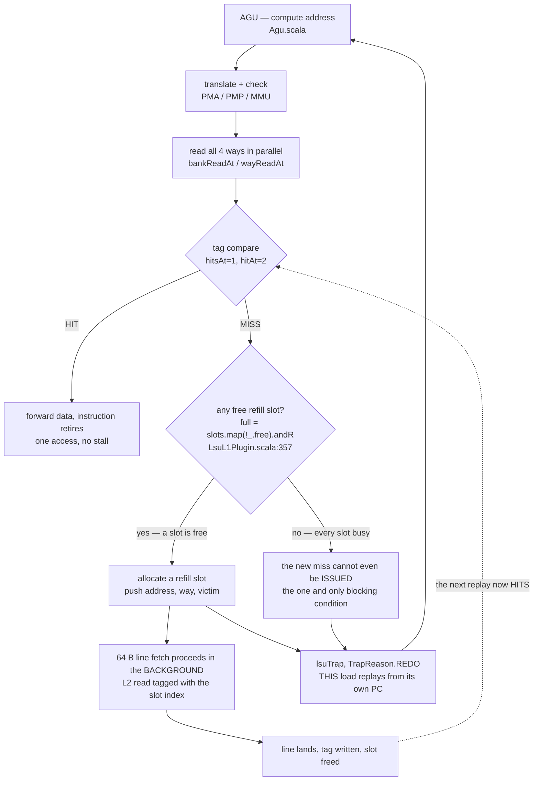
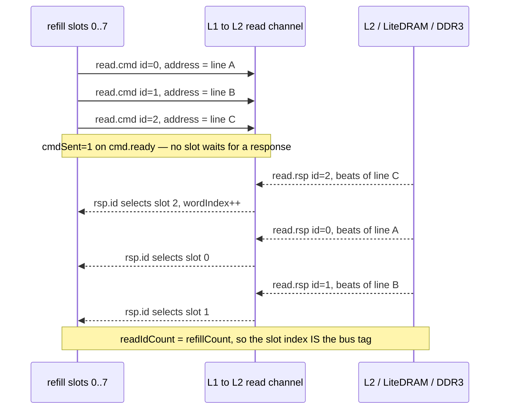

# VexiiRiscv LSU & the non-blocking D-cache: how the 8 refill slots work

*Written 2026-07-08 as the mechanism reference behind the `build_mlp1` lever
(`--lsu-l1-refill-count=8`). Sub-doc of [`RX_MEMORY_HIERARCHY_PLAN.md` (archived)](../../historical_now_obsolete/findings/RX_MEMORY_HIERARCHY_PLAN.md)
and [`CAMPAIGN_500_PLAN.md` (archived)](../../historical_now_obsolete/findings/CAMPAIGN_500_PLAN.md). Everything here is read from the VexiiRiscv
source we actually build  -  `pythondata-cpu-vexiiriscv/.../ext/VexiiRiscv/src/main/scala/vexiiriscv/`
 -  and cross-checked against the generated netlist, not from a textbook. Source citations are
`File.scala:line` against commit `235753e2` (pinned in `core.py:287`).*

---

## Contents

- **[0. Why this exists](#0-why-this-exists)** — The one-paragraph framing: the RX wall is serial cold-miss latency at ~1424 ns each, and the question is whether those can overlap. Names the culprit — LiteX's "linux" variant ships `lsuL1RefillCount = 1`, which makes a cache its own author calls non-blocking behave as a blocking one.
- **[1. The LSU and its L1 D-cache at a glance](#1-the-lsu-and-its-l1-d-cache-at-a-glance)** — The geometry table with a source citation per row (4 ways × 64 sets × 64 B = 16 KB). The fact that makes the whole lever attractive: refill slots are flip-flop state machines, not RAM, so 1 → 8 costs **0 BRAM**.
- **[2. The load pipeline and what "miss" means](#2-the-load-pipeline-and-what-miss-means)** — What a miss actually does here, which is not stall: it allocates a slot and raises a REDO so the load replays from its own PC until the line lands. The flowchart isolates the single genuinely blocking condition — every slot busy — which at `refillCount=1` is reached by the *second* miss.
- **[3. The refill engine  -  the "8 refills"](#3-the-refill-engine-----the-8-refills)** — Slot fields and the five-stage lifecycle, line-cited. Then the one Scala line that decides blocking vs non-blocking, and the four hazards the engine has to cover — including the `ackTimer` that stops two harts live-locking on the same line.
- **[4. The L1↔L2 bus: where the parallelism is spent](#4-the-l1l2-bus-where-the-parallelism-is-spent)** — Why the slot index *is* the bus tag, with a sequence diagram of three responses returning out of order and finding their slots. The consequence: at `refillCount=1` a split-transaction bus is being used as a blocking one.
- **[5. The honest part: how MLP actually arises on an \*in-order\* core](#5-the-honest-part-how-mlp-actually-arises-on-an-in-order-core)** — The section that predicts the result before it was measured. Because a demand miss replays in program order, a dependent load chain keeps ~1 miss in flight no matter how many slots exist — the slots are capacity, and only three things actually fill them.
- **[6. Timeline picture](#6-timeline-picture)** — The two cases side by side as ASCII: `N × 1424 ns` serialized against one latency plus bus throughput. The fastest way to see what the prefetcher is buying.
- **[7. What we built and MEASURED on silicon (2026-07-08)](#7-what-we-built-and-measured-on-silicon-2026-07-08)** — Five builds, then the single-variable comparisons that make them mean something. Headline: refill=8 *alone* does nothing (238→229, within noise) exactly as §5 predicted; the prefetcher is the single-flow lever (+34 %); L2 size is the aggregate one; combined they break the ~280 ceiling at 298. Read the ship-shape note — this peak config is not what production ships. Ends with `perf` showing RX is CPU-bound, 51 % of it the payload copy, and a `MSG_TRUNC` ceiling test at 481.
- **[8. Reproduce / re-tune](#8-reproduce--re-tune)** — The full build command plus the ground-truth check that the knob actually landed in the netlist — grep `refill_slots_N_` in the generated Verilog, not the argument echo. Also the `--scala-args=--flag=value` single-token form argparse forces on you.

## 0. Why this exists

The RX −P2 wall is **serial cold-miss latency**: HW DMAs each frame to DRAM, the CPU's first
touch always misses, and each miss pays ~1424 ns (≈50 % TLB + 50 % DRAM,
[`LATENCY_INVESTIGATION.md`](../findings/LATENCY_INVESTIGATION.md)). The question was whether we can *overlap* those misses instead of
paying them one-at-a-time. The answer lives in the load/store unit's **refill engine**, whose
depth is the config knob `lsuL1RefillCount`  -  **1 by default in LiteX's "linux" variant, which
makes the D-cache blocking.** This doc explains the machinery that knob controls.

---

## 1. The LSU and its L1 D-cache at a glance

The core is **VexiiRiscv "linux"  -  a single-issue, in-order RV64GC-minus core**
(`core.py:257`, no C/F/D). Its data L1 is described by its own author as
(`LsuL1Plugin.scala:64`):

> *"It is non-blocking, can support multiple outstanding refill/writeback and is tightly
> coupled to the CPU pipeline to save area."*

Geometry we build (`core.py:262` + `Param.scala` defaults, line size `LsuL1Plugin.scala:86`):

| parameter | value | source |
|---|---|---|
| ways | 4 | `--lsu-l1-ways=4` |
| sets | 64 | `lsuL1Sets` default |
| line size | 64 B | `lineSize=64` |
| **total L1 D$** | **16 KB** | 4 × 64 × 64 B |
| refill slots | **8** (was 1) | `--lsu-l1-refill-count=8` |
| writeback slots | 1 (default) | `lsuL1WritebackCount` |
| store-to-load | bypass | `--with-lsu-bypass` |
| coherency | on | SMP + `--with-dma` |

The refill and writeback slots are **flip-flop/LUT state machines, not RAM**  -  this is why
growing refill 1→8 costs **0 BRAM** (§7). That is the entire point: it buys memory-level
parallelism out of the FF/LUT budget (32 %/77 % used) while leaving BRAM for the AVDECC logic.

---

## 2. The load pipeline and what "miss" means

A load flows through fixed pipeline stages (`LsuL1Plugin.scala:87-93`, `ctrlAt=2`):

```
   AGU            PMA/PMP + MMU         L1 tag+data read         hit/miss decide (ctrlAt=2)
 address   ->   translate & check  ->  read 4 ways in parallel -> compare tags -> HIT: forward data
 (Agu.scala)     (onPma / pmpPort)      (bankReadAt/wayReadAt)     (hitsAt=1,hitAt=2)  MISS: see below
```

On a **hit**, data is forwarded and the instruction retires  -  one access, no stall.

On a **miss**, the LSU does **not** stall the whole machine waiting for DRAM. Instead
(`LsuPlugin.scala:775-779`):

```scala
val l1Failed = l1.SEL && (... (l1.MISS || l1.MISS_UNIQUE) && (l1.LOAD || l1.STORE))
when(... l1Failed ...) {
  lsuTrap := True
  trapPort.code := TrapReason.REDO   // <-- the missing instruction is REPLAYED, not frozen
}
```

The miss (a) **allocates a refill slot** to fetch the 64 B line in the background, and (b)
raises a lightweight **REDO**  -  the load is re-executed from its own PC a few cycles later.
It keeps REDO-ing (cheaply) until the line has landed, then hits. **In-order order is
preserved**  -  a later instruction never commits ahead of the missing load. Hold this fact; it
governs §5.

The whole "blocking vs non-blocking" question is one branch in this picture  - 
**on a miss, what is it that stalls: the machine, or just this load?**



At `refillCount = 1` the `BLOCK` branch is reached by the *second* miss to a
different line; at `refillCount = 8` it takes eight.

---

## 3. The refill engine  -  the "8 refills"

The heart is an array of `refillCount` **refill slots** (`LsuL1Plugin.scala:315-354`). Each
slot is an independent little state machine tracking one in-flight 64 B line fetch:

```
refill.slots[0..7]  each = {
   valid       : this slot is tracking a live refill                 (:319)
   address     : the physical line being fetched                     (:320)
   way         : which of the 4 ways this line will fill             (:321)
   cmdSent     : the read request has been accepted by the L2 bus    (:322)
   priority    : ordering vs the other slots (fairness/lock)         (:323)
   loaded      : data has fully arrived & tag written                (:343)
   loadedCounter: retry-coordination timer (see hazard below)        (:345)
   victim      : wait for this dirty eviction's writeback first      (:353)
   c.{unique,data,ackId,ackValid,ackTimer} : coherency permissions   (:324-338)
}
```

### Lifecycle of one refill

```
  ┌ 1. ALLOCATE ──────────────────────────────────────────────────────────┐
  │ miss (or prefetch) issues push{address, way, victim}   (:366)          │
  │ first FREE slot captures it:  valid=1, loaded=0, cmdSent=0  (:356,382) │
  └───────────────────────────────────────────────────────────────────────┘
           │
  ┌ 2. ARBITRATE + SEND READ ─────────────────────────────────────────────┐
  │ PriorityArea picks a slot that is valid && !cmdSent && victim==0 (:402)│
  │ drive L2 read:  bus.read.cmd.id = slotIndex, .address = line   (:410)  │
  │ on cmd.ready -> cmdSent=1.  Up to 8 reads outstanding on the bus       │
  │ (readIdCount = refillCount, :113)  -  the slot index IS the bus tag      │
  └───────────────────────────────────────────────────────────────────────┘
           │
  ┌ 3. RECEIVE RESPONSE (may come back out of order, keyed by rsp.id) ─────┐
  │ each beat -> write one word into the data bank, wordIndex++  (:430-465)│
  │ responses for DIFFERENT slots may interleave  -  that is the parallelism │
  └───────────────────────────────────────────────────────────────────────┘
           │
  ┌ 4. COMPLETE (last word) ──────────────────────────────────────────────┐
  │ write the tag: tag.loaded=1, tag.address  (:466-475)                   │
  │ refillCompletions(id)=1 ; slot.loadedSet=1  (:469,480)                 │
  └───────────────────────────────────────────────────────────────────────┘
           │
  ┌ 5. RETIRE ────────────────────────────────────────────────────────────┐
  │ loadedSet -> loaded=1 ; loadedCounter guards in-flight overlappers     │
  │ fire = valid && loadedDone -> valid=0  -> slot FREE again  (:350-351)  │
  └───────────────────────────────────────────────────────────────────────┘
```

### The one line that defines "blocking" vs "non-blocking"

```scala
val full = slots.map(!_.free).andR          // LsuL1Plugin.scala:357
```

The cache can only refuse to start a **new** miss when **every** slot is busy.

- **`refillCount = 1` (the default we had):** there is exactly one slot. The *second* miss to a
  different line cannot even be *issued* until the first fully completes. Misses are **fully
  serialized**  -  N cold misses cost N × ~1424 ns back-to-back. This is the blocking D$ we
  verified in every stock netlist (`refill_slot_idxs=[0]`).
- **`refillCount = 8` (build_mlp1):** up to **8 distinct lines** can be refilling at once, their
  L2 reads pipelined on the bus and their responses returning out of order. The wall becomes
  `max(latency)` amortized across the stream instead of `sum(latency)`.

### Hazards the engine must handle (`LsuL1Plugin.scala:66-77`)

- **In-flight-line hit** (`REFILL_HITS`, :197-198): an access whose line matches a slot still
  refilling must **REDO**  -  it may not read a half-filled line. Resolves when that slot completes.
- **victim / writeback ordering** (:353): if the line to fetch evicts a dirty line, the slot
  waits (`victim`) until the writeback has progressed, so we never read stale-then-overwrite.
- **loadedCounter** (:340-347): a load that started before a refill finished but lands after it
  must notice the refill happened and retry  -  a small counter keeps that window correct.
- **Coherency** (:324-338, :490-502): with SMP + coherent DMA a refill also *acquires
  permissions* (shared/unique) and sends an **ack** to the L2; an `ackTimer` guarantees the
  hart makes "a minimal amount of forward progress after acquiring a cache line" before it can
  be probed away  -  prevents two harts live-locking on the same line. This path is active in our
  build (`--cpu-count 2 --coherent-dma`).

---

## 4. The L1↔L2 bus: where the parallelism is spent

`memParameter.readIdCount = refillCount` (`LsuL1Plugin.scala:113`). The L1↔L2 read channel is a
**tagged, split-transaction bus**: the L1 can issue up to 8 read commands (tag = slot index)
without waiting, and the L2/DRAM returns responses tagged with the same id, in any order
(`read.rsp.id` routes each response back to its slot, :421,461). So the 8 slots turn the L1 into
an 8-deep outstanding-request generator against the shared L2 → LiteDRAM → DDR3 path. **That is
the mechanism by which multiple 1424 ns latencies overlap.**

The tag is what makes out-of-order return safe  -  **how does a response that
comes back second find the slot that asked for it first?**



With `refillCount = 1` there is only ever one legal tag, so the channel degrades
to one command, one response, repeat  -  a split-transaction bus used as a
blocking one.

---

## 5. The honest part: how MLP actually arises on an *in-order* core

Because a demand miss **REDO-replays in program order** (§2), a *single* stream of dependent
demand loads keeps only **~1 miss in flight per hart**  -  the missing load spins on REDO until
its line lands; later loads cannot overtake it. So `refillCount=8` does **not**, by itself,
magically parallelize a dependent load chain. The 8 slots are *capacity for parallelism*; three
things actually **fill** them:

1. **The hardware prefetcher** (`Prefetcher.scala`, enabled by `--lsu-hardware-prefetch=rpt`).
   It watches the committed access stream, learns strides, and issues **prefetch pushes ahead of
   demand** into free refill slots. While the demand load on line A is resolving, lines A+1,
   A+2… are already fetching in slots 1-7; when demand reaches them they **hit**. This is the
   primary MLP engine, and it is *useless with only one slot*  -  which is exactly why VexiiRiscv's
   own performance preset bundles `lsuL1RefillCount=8` **with** `lsuHardwarePrefetch="rpt"`
   (`Param.scala:303-312`).
2. **The store buffer** (`LsuPlugin.scala:281-282`): a store that misses is retired into the
   store buffer and drained asynchronously into a refill slot, so **subsequent loads don't wait
   behind store misses**. Load-heavy RX benefits modestly here.
3. **Independent hit-under-miss + two harts**: hits proceed while a miss refills, and each hart
   has its *own* L1 with its own 8 slots, so the shared L2 already sees 2 concurrent demand
   streams under −P2.

**Consequence for the campaign.** `build_mlp1` enables `refillCount=8` **alone** (no prefetcher)
 -  a clean isolation of "slots without a filler." Expect a *modest* RX gain from it (store-buffer
decoupling + hit-under-miss). The **large** win is expected from `refill=8 + rpt` together (a
follow-on `mlp2` build); this doc's §3-4 machinery is the prerequisite that makes the prefetcher
effective. Either way we **measure**, not assume  -  the point of building mlp1 first is to know
how much each half contributes.

---

## 6. Timeline picture

```
 lsuL1RefillCount = 1  (blocking  -  what we had)
 demand : [miss A]======wait ~1424ns======[A][miss B]======wait======[B][miss C]===...
 L2 bus : [--- read A ---]                 [--- read B ---]           [--- read C ---]
          one outstanding; cost = N × 1424 ns   (serialized)

 lsuL1RefillCount = 8  + hardware prefetch  (the target)
 demand : [miss A]==wait==[A][B hit][C hit][D hit][E hit]...
 prefch :        [push B][push C][push D][push E]  (issued ahead into slots 1..7)
 L2 bus : [read A][read B][read C][read D][read E]  (pipelined, ≤8 in flight)
          cost ≈ 1424 ns + (N-1) × (bus throughput)   (latency amortized)
```

---

## 7. What we built and MEASURED on silicon (2026-07-08)

All numbers this-session, deterministic split harness (a pinned iperf `--cport 40000` forces the
two −P2 streams onto different rx queues → a guaranteed 2-hart split every round; without it the
4-tuple hash lotteries ~1/3 of rounds into single-queue collisions). Guarded driver verified each
boot (`rsc/rsc_clk_mhz=100/hwtso/hwcs`); every gateware confirmed distinct (BIOS CRC) and by the
pointer-chase L2 cliff. Splits verified by steer counters.

| build | L2 | refill | rpt | BRAM | setup WNS | **single RX** | **−P2 (2-hart split)** |
|---|---|---|:--:|---|---|:--:|:--:|
| m1   | 32 KB | 1 | – | 102.5 (76 %) | – | 206 | 238 |
| l2x2 | 64 KB | 1 | – | 110.5 (82 %) | +0.140 | 207 | **280** |
| mlp1 | 32 KB | 8 | – | 102.5 (76 %) | +0.118 | 198 | 229 |
| **mlp2** | 32 KB | 8 | **rpt** | 104.5 (77 %) | +0.031 | **276** | 246 |
| **mlp3** | **64 KB** | 8 | **rpt** | 112.5 (83 %) | +0.102 | 259 | **298** |

**Read the levers by the clean single-variable comparisons:**

- **refill=8 *alone* does nothing** (mlp1 vs m1, same 32 KB L2): single 206→198, −P2 238→229  -  no
  gain, within noise. **Exactly as §5 predicted:** on an in-order core the demand miss REDO-replays
  one-at-a-time, so 8 empty slots with no filler = the blocking case. The slots cost **0 BRAM**
  (mlp1 == m1 at 102.5 tiles) and close timing (+0.118)  -  but capacity for MLP isn't MLP.
- **Adding the RPT prefetcher is a large single-flow win** (mlp2 vs mlp1, same 32 KB L2): **single
  198→276 (+39 % here; mlp1's 198 was an anomalous dip  -  vs the 207 baseline the canonical RPT gain
  is +34 %)**, −P2 229→246 (+7 %). The prefetcher *fills* the slots  -  it learns the stride of
  the sequential payload copy (the dominant RX DRAM traffic) and prefetches ahead, hiding the cold
  miss. It helps single hugely (bandwidth spare) and −P2 modestly (2-hart is more shared-resource
  bound). Cost: **+2 BRAM tiles** for the RPT table (104.5), still **6 below l2x2**. Timing closes
  but tight (+0.031  -  the predictor ate ~0.087 ns).
- **The L2 size is the *aggregate* lever** (l2x2 vs m1): −P2 238→280 (+18 %), single ~flat. A bigger
  shared L2 cuts the 2-hart capacity misses (fewer DRAM round-trips), which is what the −P2 case is
  bound by.

**So RPT and L2 are complementary  -  RPT = single-flow/latency, L2 = aggregate/capacity.** (The
naïve mlp2-vs-l2x2 −P2 compare, 246 < 280, is *confounded*: it changes L2 size **and** adds rpt.
Isolated, rpt helps −P2 too.) **`build_mlp3` (refill+rpt+64 KB L2) MEASURED the combination and it
is the best config**: −P2 **298** (mean of 281–310, split-verified `steer0=71523 steer1=79149`,
**§V canary=0**)  -  the **first break above the ~280 ceiling**, +6 % over l2x2, +21 % over mlp2 at
32 KB. Also best-yet **TX−P4 431**. So the two levers *do* compound: the 64 KB L2 gives both harts
the capacity to prefetch without evicting each other. Cost: 112.5 tiles (83 %, +8 vs mlp2). Single
dipped to 259 (the 64 KB L2's slightly higher hit latency); −P2 still shows **drops (3.6k/6.4k)**
under 2-hart load  -  the prefetcher's speculative traffic still stresses the rings, so a gentler
`--lsu-rpt-block-ahead-max` is the next tuning knob to cut drops and push −P2 higher.

**Ship-shape note:** the mlp3 config profiled here (2-hart + 64 KB L2) is the
*performance-campaign peak*, not the shipped SoC - production ships **1-hart
VexiiRiscv + `--l2-bytes 32768`** (32 KB L2, the `m1`/`mlp2` L2 size); the measured
numbers above are retained as the campaign ceiling for that peak config.

**What actually caps RX (measured after this study, `perf` 2026-07-09).** mlp3's 298 is not an
interconnect or "shared-resource" ceiling  -  `perf` shows RX −P2 is **CPU-bound** (harts 98 % busy)
and **51 % of that is the recv payload copy** (`copy_to_user`), which stalls on **cold DRAM reads**
of the DMA'd payload. The `recv(MSG_TRUNC)` ceiling test (drains without the copy) reaches −P2 **481**
= 96 % of the 500 goal. So the RPT prefetcher here is *exactly* the right kind of lever (it hides
that same cold read for single-flow); the −P2 case just needs the read to be a **hit**, which is
what **DDIO / allocate-on-DMA-write** does (task #15). The earlier "depth-2 interconnect / more
parallelism / fewer touches" framing is superseded  -  see [`PERFORMANCE_GOAL.md`](../findings/PERFORMANCE_GOAL.md).

**One lever per row, each with the comparison that isolates it** (the build table above is
per-build, so no single row of it answers "what did this knob buy"; a naïve build-to-build
diff changes two variables at once):

| lever | isolated by | single RX | −P2 | BRAM | what it actually buys |
|---|---|---|---|---|---|
| refill 1 → 8, no filler | `mlp1` vs `m1`, both 32 KB L2 | 206 → 198 | 238 → 229 | **0 tiles** (102.5 either way) | nothing measurable — capacity without a filler is the blocking case |
| + RPT prefetcher | `mlp2` vs `mlp1`, both 32 KB L2 | 198 → **276** | 229 → 246 | +2 tiles (104.5) | single-flow / latency: it fills the slots by learning the payload-copy stride |
| L2 32 → 64 KB | `l2x2` vs `m1`, both refill = 1 | ~flat (206 → 207) | 238 → **280** | +8 tiles (110.5) | aggregate / capacity: fewer 2-hart capacity misses |
| all three | `mlp3`, the measured combination | 259 | **298** | 112.5 tiles (83 %) | the levers compound — first break above the ~280 ceiling, plus best TX −P4 431 |

**Bottom line for the "keep BRAM for logic" question:** the frugal lever (refill alone, 0 BRAM) does
not work; the working single-flow lever (RPT, +2 tiles) is cheap and real (+34 % single); the
capacity lever (64 KB L2, +8 tiles) buys the −P2 headroom. The next RX gain is not more cache  -  it
is landing the DMA payload warm (DDIO) so the copy stops reading DRAM cold.

---

## 8. Reproduce / re-tune

```bash
# regenerate the netlist + bitstream with a deeper (or shallower) D$:
python3 milan_soc.py --cpu vexiiriscv --cpu-count 2 --all-blocks --coherent-dma \
  --milan-clk-freq 100e6 --with-spiflash --flashboot full --gtx-tx-invert \
  --timing-opt --floorplan --l2-bytes 32768 \
  --scala-args=--lsu-l1-refill-count=8 \        # the knob; add: --scala-args=--lsu-hardware-prefetch=rpt
  --uart-baudrate 115200 --rx-queues 2 --vivado-max-threads 32 --build --output-dir work/build_mlp1

# verify the lever landed in the RTL (ground truth, not the arg echo):
NN=$(grep -oE "netlist-name=VexiiRiscvLitex_[0-9a-f]+" work/build_mlp1.log | head -1 | cut -d= -f2)
grep -oE "refill_slots_[0-9]+_" pythondata-cpu-vexiiriscv/.../verilog/$NN.v \
  | grep -oE "[0-9]+" | sort -nu    # expect 0..7
```

The `--scala-args=--flag=value` single-token form is required  -  argparse rejects a value that
starts with `--` in the space-separated form.
