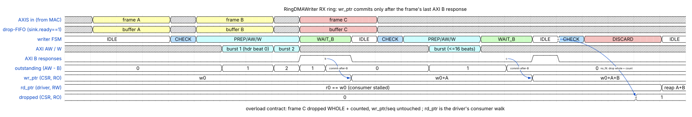
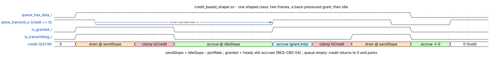

# The Milan NIC data pipeline, stage by stage

*2026-07-11. The canonical prose reference for developers (what each stage does
and where its code lives) and maintainers (which knob changes which behavior,
what was measured, what breaks if you get it wrong). The older
[historical tuning map](../history/v1/findings/RX_PERF_TUNING_MAP.md) remains evidence.*

*Silicon history lives in [`HEADER_SPLIT_DESIGN.md`](HEADER_SPLIT_DESIGN.md),
the live state in [`../findings/BENCH_TOPOLOGY.md`](../findings/BENCH_TOPOLOGY.md) and
[`../findings/PERFORMANCE_GOAL.md`](../findings/PERFORMANCE_GOAL.md). Referenced from the source headers of
[`sw/litex/milan_soc.py`](../../sw/litex/milan_soc.py) (gateware) and `the-private-test-repo fpga/kl-eth/kl-eth.c`
(driver).*

Editable diagram: [`milan_tx_rx_datapath.drawio`](../milan_tx_rx_datapath.drawio)
- the one-page TX/RX + control-path block map (draw.io master, no committed
render yet; open in draw.io/diagrams.net; see
[`../diagrams/README.md`](../diagrams/README.md) for the render rules).

Conventions used below.

- "CSR" means a register you can poke live with devmem.
- "Elab param" means a Python elaboration parameter: changing it requires a
  Vivado rebuild (about one hour; always launch 2 or 3 place-directive
  variants in parallel, staggered by 90 seconds because the elaborations
  share one pythondata git checkout).
- "Module param" means an insmod argument.
- Per-queue CSR blocks have identical layouts: queue 0 base 0xf0003024,
  queue 1 base 0xf0003098.

## Contents

- **[RX stages](#rx-stages)** — The receive path in eight stages, wire to application. Each names its code, its live CSRs, what was measured, and what breaks if you get it wrong.
  - [Stage R1: wire, RGMII PHY, MAC](#stage-r1-wire-rgmii-phy-mac) — Bits to AXIS beats, and the only stage that has never been a bottleneck. Carries the M-A3 trap: LiteEth `last_be` is one-hot, AXIS `tkeep` is a mask, and confusing them put nothing on the wire at all. (The heading's "RGMII" predates the GMII strap correction.)
  - [Stage R2: gPTP steering (RxSteer, 2-queue builds)](#stage-r2-gptp-steering-rxsteer-2-queue-builds) — gPTP gets its own queue, matched by reserved DMAC *and* EtherType — the same test the egress classifier applies. The boxed note is the important part: this replaced a TCP flow hash, so the parallel-ACK split is gone and bulk RX reverts to the one-hart ceiling. Advice about engineering a split by picking client ports no longer applies.
  - [Stage R3: RSC aggregation (RingDMAWriter slots)](#stage-r3-rsc-aggregation-ringdmawriter-slots) — The eight ways an aggregate closes, three tunable CSRs with their measured effects (`rsc_segcap` 10 was harmful), and the ACK-hold law: any store-and-forward hold enters the peer's RTT, which is what produced the ~375 Mbit plateau at every flow count.
  - [Stage R4: page placement (header split)](#stage-r4-page-placement-header-split) — Page-size effects measured per variant (16K broke the drop famine, 4K qualifies pages for the kernel's zero-copy flip) and the LETHAL PAIRING: a driver `hs_pgsz` that disagrees with the gateware DMAs into kernel memory. Since hsq14 a capability CSR lets the driver refuse to load.
  - [Stage R5: completion queue and BD publication](#stage-r5-completion-queue-and-bd-publication) — The BD encodings and four invariants in the order they were earned: LUTRAM CQ storage (−4866 LUTs), the full gate that turned ring laps from silent corruption into counted drops, and hsq12's cut-through allocation that removed the ACK-hold law's mechanical cause. Includes the commit-after-B pointer chronogram.
  - [Stage R6: driver reap and repost](#stage-r6-driver-reap-and-repost) — What a maintainer must not break, chiefly: never skip-recycle a mismatched page, because skipped pages may still be DMA targets of open aggregates. Also the NAPI topology verdict — pipeline beats symmetric fanout 281-381 vs 206-220 — on the 2-hart perf SoC, not the 1-hart ship shape.
  - [Stage R7: delivery to the stack](#stage-r7-delivery-to-the-stack) — The two skb generations and their STRICT gateware pairing. Cut-through synthesizes a TCP segment run per page and is correct only because RSC aggregates in sequence, so every early unit is a valid in-order prefix. It holds the single-flow record and loses multi-flow.
  - [Stage R8: the consumer](#stage-r8-the-consumer) — Four consumer lanes measured against each other: copy 363-381, MSG_TRUNC 585-594 (the stack ceiling, and the proof a copy-free consumer reaches the goal), AF_PACKET 124 refuted, TCP zero-copy receive closed at 110-113 on equilibrium economics.
- **[TX stages, briefly](#tx-stages-briefly)** — Three stages plus the CBS credit chronogram, and two operational facts: TX is scheduler-fairness bound rather than NIC bound, and it depends on its ACK stream — so always gate TX after any RX change.
- **[Obsolete and staged-for-removal code](#obsolete-and-staged-for-removal-code)** — The 2026-07-11 cleanup, notable for its method: the byte-ring was folded out at elaboration rather than deleted, so it survives for forensics builds, and an old `bd=0` driver on folded gateware parks with counted drops instead of DMA-writing through address 0.
- **[Build and driver lineage (what "hsqN" and "hsplitN" mean)](#build-and-driver-lineage-what-hsqn-and-hsplitn-mean)** — The decoder ring for the build names quoted everywhere else, one row per gateware with its change and its required driver. Ends with the record scoreboard and the measurement method behind every number.

## RX stages

### Stage R1: wire, RGMII PHY, MAC

Purpose: bits to AXIS beats. Code: `MilanMAC` in [`sw/litex/milan_soc.py`](../../sw/litex/milan_soc.py), the
RGMII PHY wrappers, LiteEth core underneath. The datapath runs at 100 MHz
(`--milan-clk-freq 100e6`) and exceeds 1 GbE line rate; this stage has never
been a bottleneck. Trap fixed long ago: LiteEth `last_be` is one-hot, AXIS
`tkeep` is a mask; the M-A3 bug (no frames on the wire at all) came from that
mismatch.

### Stage R2: gPTP steering (RxSteer, 2-queue builds)

Purpose: give **gPTP its own RX queue** so PTP event messages never sit behind
bulk traffic in a shared ring. Code: `class RxSteer` in `milan_soc.py`.

- **q1** — frames whose DMAC is the 802.1AS reserved multicast
  `01-80-C2-00-00-0E` **and** whose (inner) EtherType is `0x88F7`. That is
  exactly the test `traffic_class_map.sv` applies on egress under `REQ-CLS-07`:
  one detector, one rule, both directions.
- **q0** — everything else.

Each queue is its own ring writer, interrupt and NAPI.

> **What this replaced, and what it cost (2026-07-26).** `RxSteer` used to be a
> TCP 4-tuple XOR-parity flow hash built for *throughput* — it split one
> MTU-1500 RX stream into two flow-consistent queues so two flows' ACK/receive
> processing ran on two harts (measured RX 223 Mbit, see
> [performance evidence](../findings/PERFORMANCE_GOAL.md)).
> **That parallel ACK split is gone**: bulk RX is single-NAPI again and the RX
> throughput ceiling reverts to the one-hart number. What is bought instead is
> RX-side PTP latency, which is what once held `asCapable` false
> (the retired RX-pad root-cause finding (#259, in git history)).
> Advice about engineering a split by picking client ports no longer applies.

Knobs and traps:
- `hash_sel` CSR at 0xf0003094 (**name kept on purpose**, it is the third
  register of the block): 1 forces everything to queue 0 (bypass).
- The steer counters at 0xf000308c / 0xf0003090 misreport under dual-active
  load. Trust them only as single-active deltas.
- Both shipped configs carry `rx_queues: 2` (the 8x8 since 2026-07-28), and
  changing the count is reflash-gated -- see
  [../reference/EGRESS_QUEUE_MAP.md](../reference/EGRESS_QUEUE_MAP.md).

### Stage R3: RSC aggregation (RingDMAWriter slots)

Purpose: coalesce an in-order TCP flow into large aggregates so per-unit CPU
costs amortize (the RX twin of TSO). Code: the slot machinery inside
`class RingDMAWriter` (`milan_soc.py`), four slots per queue (`n_slots=4`).
An aggregate closes on: PSH flag, segment cap, byte cap, idle timeout,
lifetime cap, a same-flow sequence gap, slot pressure (park), or CQ pressure.

Knobs (per queue, offsets from the queue base):
- `rsc_bufsz` (PAYCAP) at +0x44, currently 57344. Warning: the CSR field is
  16 bits wide; writing 0x1C000 silently stores 0xC000. Widening it is the
  documented RTL lever for aggregates larger than 64 KB.
- `rsc_tout` at +0x48, idle close in 100 MHz ticks. `ethtool -C rx-usecs`
  writes this AND the driver poll cadence together; poke the CSR afterwards
  if you need them decoupled (measured: flat either way at P4 with 16K pages).
- `rsc_segcap` at +0x54, currently 60. Setting 10 was measured harmful
  (256 Mbit at P4, chaotic flows).

Measured law (the ACK-hold law): any store-and-forward hold enters the peer's
round-trip measurement, so throughput self-limits at HOLD_BYTES divided by the
fill cycle. This produced the famous ~375 Mbit plateau at every flow count
until the cut-through ordering (stage R5) removed the hold.

### Stage R4: page placement (header split)

Purpose: split headers from payload so the payload lands page-aligned and the
consumer can use it without repacking. Headers go to a per-queue header ring
(32 slots of 128 bytes, `hs_hdr_base` CSR at +0x60); payload streams into
posted pages at offset zero.

Knobs:
- `hs_page_bytes`, elab param `--hs-page-bytes`: the page size the crossing
  arithmetic assumes (one compare plus two modulo-page bit slices in the RTL).
  Built variants: 4096 (hsq13), 16384 (hsq10, hsq12, hsq14), 32768 (hsq11).
  Effects measured: 16K broke the drop famine (28 to 5 drops/s at P2); 32K
  cleaned P8 (122 to 15 drops/s); 4K qualifies pages for the kernel's
  zero-copy page flip.
- LETHAL PAIRING: the driver's `hs_pgsz` module param must equal the gateware
  value. A mismatch makes the writer DMA gateware-page strides into smaller
  driver pages, overwriting kernel memory (Bad page map panic, 2026-07-11).
  Since hsq14 the gateware exposes the value in the `milan_dma_hs_pgsz_cap`
  CSR at 0xf000311c and the hsplit16+ driver refuses to load on a mismatch.
  On older gateware the CSR reads zero and the driver warns and trusts you.

### Stage R5: completion queue and BD publication

Purpose: tell the driver what landed, in a corruption-proof order. Code: the
CQ block inside `RingDMAWriter` plus the WB (writeback) FSM states.

Structure and invariants, in the order they were earned:
- The internal CQ is `cq_depth=32` entries per queue, stored in one 128-bit
  LUTRAM `Memory` (sync write, async read). It was previously an Array of
  flops whose mux trees were the single largest slice consumer (converting it
  saved 4866 LUTs, build hsq7).
- Completion BDs are 16 bytes, written to a DRAM ring of `KL_BD_ENTRIES=256`.
  BD kinds: v1 single (w1 carries the buffer address), v2 meta (length, mss,
  segment count, ack, window, PSH, header index in w0 bits 63:59), v3 page
  (w1 carries the page address; since hsq12 w0 also carries the fill length
  in bits 31:16 and the header index in bits 63:59).
- The drain OR-patches the live sequence number (bits 15:8) and drop count
  (bits 53:48) at write time.
- THE FULL GATE (hsq6): the drain stalls when wr+16 equals the driver's
  rd_ptr. Before this gate the hardware lapped the ring under reap gaps;
  at 64 entries that tripped the 8-bit sequence check and caused the "RX BD
  desync" self-heal storms, and at 256 entries the lap aliased to zero and
  corrupted silently (the original reverted BD-256 attempt). Overload now
  becomes counted drops, never corruption.
- CUT-THROUGH ORDERING (hsq12): the opener allocates only the page entry;
  the meta entry is allocated at close, so completed pages drain immediately
  and the meta arrives last. Before hsq12 the meta was allocated first and
  blocked every page behind it until close (the mechanical cause of the
  ACK-hold law). All six close paths gained a `cq_room` gate because closing
  now allocates.

The writer's pointer contract as a chronogram (drawn on the byte-ring view;
in BD mode `wr_ptr` is the BD write offset and the same commit rule holds):

> Generated chronogram (master
> [wd_ring_pointers.json](../diagrams/wd_ring_pointers.json); regenerate with
> `~/litex-milan/venv/bin/python3 scripts/gen_wavedrom.py
> docs/diagrams/wd_ring_pointers.json`). The contract, per the
> `RingDMAWriter` docstring in [`sw/litex/milan_soc.py`](../../sw/litex/milan_soc.py) and the
> Commit-after-B / Whole-frame drop entries in
> [`../GLOSSARY.md`](../GLOSSARY.md): the ingress FIFO is always ready
> (`sink.ready` constant 1) with the drop decision taken at a frame's first
> beat; `wr_ptr`/`seq` advance only in WAIT_B once `outstanding` (AW issued
> minus B received) reaches 0, so software never sees a partial frame; an
> overload frame is dropped whole and counted (`dropped` CSR ==
> `rx_missed_errors`), pointers untouched.

### Stage R6: driver reap and repost

Purpose: consume BDs, pair pages, keep the hardware fed. Code:
`kl_rx_one_bd()` and `kl_poll()` in `kl-eth.c`.

Behavior a maintainer must not break:
- Pages pop from the posted FIFO strictly in order; v1 and v3 BDs carry the
  buffer address and the driver verifies it. In hs mode a mismatch means lost
  sync and triggers a full resync (never skip-recycle: skipped pages may
  still be DMA targets of open aggregates; that was a real panic).
- The desync detector tolerates empty polls and interrogates the hardware
  every 64th bad poll (BD_BASE lost, or WR moved past an unparseable slot).
- Reposting draws fresh pool pages and carries unfulfilled debt to the next
  poll. The reap itself measured about 5 percent of the NAPI hart: the driver
  is not the CPU cost.
- Poll cadence: 20 microsecond kick timers on activity (all queues since
  hsplit12), self-rearm at `coalesce_us` while active. Topology verdict on
  this 2-hart part (the perf-campaign peak SoC - the ship shape is 1-hart +
  32 KB L2, so this NAPI fanout applies only to the 2-hart build; the throughput
  figures here are that peak's ceiling): the winning arrangement is the pipeline (all NAPI in
  softirq on cpu0, receivers on cpu1, `threaded=0`). Symmetric fanout
  measured strictly worse (281-381 pipeline vs 220 threaded-unpinned vs 206
  threaded-pinned). Queue-1 drop excess is the pipeline's tail latency, not
  a bug. The hsplit15 kthread binding code remains for parts with more harts.

### Stage R7: delivery to the stack

Purpose: turn BDs into skbs. Two generations exist, selected by driver
version (STRICT gateware pairing):
- hsplit12/13 on hsq10/hsq11: assemble page frags per tag, build one skb at
  the meta, deliver. Simple, but the delivery waits for the aggregate close.
- hsplit14+ on hsq12+: cut-through. Every v3 page is delivered immediately
  as a synthesized TCP segment run: header bytes copied from the header ring
  slot named by the v3's header index, IP total length patched, TCP sequence
  advanced by the bytes already delivered, PSH stripped except on the final
  unit, GSO metadata set per chunk, CHECKSUM_UNNECESSARY. The meta then only
  updates statistics and clears the per-tag state. Binding is lost-meta safe
  because a header-index change on a tag means a new aggregate. Correctness
  rests on RSC only ever aggregating in-sequence segments, so every early
  unit is a valid in-order prefix.
- Measured: cut-through holds the single-flow record (329) but currently
  loses multi-flow to the hsq10 keeper (staircase granularity plus per-unit
  cost); the parked follow-ups are 8K pages or chunk batching in the v3
  handler.

### Stage R8: the consumer

The consumer choice decides the record.

All records use the two-hart, 64 KB campaign peak.

The product uses `1` hart and `0` L2 bytes.

These records are ceilings, not deployed results.

All four lanes measured on the keeper:
- Socket read with copy (recv_spin, iperf3): 363-381 Mbit sustained at P4.
  The copy costs one cold DRAM read per cache line (about 18 cycles per 8
  bytes at 100 MHz); it is two thirds of the application hart.
- MSG_TRUNC (recv_trunc, ACKs but never copies): 585-594 sustained. This is
  the stack ceiling and the proof the goal is reachable by a copy-free
  consumer.
- AF_PACKET TPACKET_V3 mmap ring (tools_recv_ring.c): 124. Refuted: the
  kernel memcpys every unit into the ring on the NAPI hart; the zero-copy is
  consumer-side only.
- TCP_ZEROCOPY_RECEIVE page flip (tools_recv_zc.c on hsq13 at 4K pages):
  110-113 at 87 percent flipped. The mechanism works and the kernel path is
  already batched (vm_insert_pages, batch size 32); the cost is equilibrium
  economics: shallow queues make the per-call overhead land per-page, and
  forcing queue depth with paced consumption hits the receive-window wall
  instead (2.7 and 19.5 Mbit in the paced variants). Closed on this core and
  kernel.
- The remaining above-500 lane is AF_XDP with driver zero-copy support,
  which is campaign-scale work. The AVTP product plane does not need it.

## TX stages, briefly

TX is documented here for completeness; it holds 582-646 Mbit with two
processes and is scheduler-fairness bound, not NIC bound.
- T1: the driver builds descriptors in a cached BD ring (256 entries), one
  MMIO doorbell per batch, HW-TSO segments 64 KB GSO frames in gateware.
- T2: the reader DMAs payload straight from DRAM (cache state irrelevant),
  so TX pays almost no per-byte CPU on the send side.
- T3: the datapath (classifier, optional CBS shaper which resets DISABLED
  since the CBS_EN_RST bug, MAC) runs at 100 MHz. The shaper's credit
  contract, as a chronogram:

> Generated chronogram (master
> [wd_cbs_credit.json](../diagrams/wd_cbs_credit.json); regenerate with
> `~/litex-milan/venv/bin/python3 scripts/gen_wavedrom.py
> docs/diagrams/wd_cbs_credit.json`). Semantics per the
> `credit_based_shaper.sv` header (802.1Qav, one traffic class): credit
> accrues at idleSlope while the queue waits with data, drains at sendSlope
> (= idleSlope - portRate) while transmitting, is clamped to
> [loCredit, hiCredit], and transmission is allowed only when credit >= 0;
> a granted-but-backpressured queue keeps accruing (REQ-CBS-04), and an
> empty queue's credit returns to 0. Verified by the dual-model TB of row
> Q-8 in [`../traceability/ieee8021q.md`](../traceability/ieee8021q.md).
- The hidden dependency: TX throughput requires its ACK stream (an RX flow)
  to be processed promptly; TX collapses if RX delivery stalls. Always gate
  TX after any RX change.
- Known follow-up: the kernel lacks CONFIG_NET_SCH_FQ, so two competing
  senders on the single netif queue are a fairness lottery (one can starve
  at about 82 Mbit).

## Obsolete and staged-for-removal code

Removed in the 2026-07-11 cleanup:
- Driver `rxzc` module param (`kl_rxzc_param`): declared and exported but
  never branched on; the build_skb path it once selected was deleted eras ago.

EXECUTED 2026-07-11 as an ELABORATION FOLD (better than deletion: the legacy
path stays in the source for forensics builds, ships folded out):
- Gateware: `RingDMAWriter`/`RingDMAReader` gained `legacy_ring` (SoC/CLI
  default FOLDED; `--legacy-ring` opts the fallback back in). Mechanics:
  `bd_shape` (a constant 1 when folded) hardwires every datapath SHAPE mux to
  the BD arm so the ring cones die at synthesis; `bd_mode` (bd_base != 0)
  remains the runtime ARMING gate at every dispatch site, so an old `bd=0`
  driver on folded gateware PARKS (frames overflow the drop-FIFO, counted
  ingress drops) instead of DMA-writing through `base`/address 0 - the
  hs_pgsz lethal-pairing lesson applied. Python-conditional arms (not
  generated when folded): the IDLE byte-ring dispatch + CHECK state and the
  WAIT_B ring commit (writer); the reader is read-only, its ring arms
  constant-fold and a bd_base==0 doorbell lands in the existing bad-BD
  resync.
- Verification: the ENTIRE BD test set was run against BOTH shapes (defaults
  temporarily flipped): test_ring_bd.py 40+2 and test_tx_bd.py all green
  folded; plus two permanent regressions - test_bd_folded_equivalence
  (bit-identical BD delivery) and test_bd_folded_unarmed_quiesce (bd_base=0:
  zero DMA writes, drops counted). test_ring_dma.py / test_ring_tx.py /
  test_ring_writeback.py exercise the byte-ring path and run on the legacy
  class default (True) - they cover `--legacy-ring` builds.
- Driver: `kl_rx_one()`/`kl_rx_ring_init()` (the bd=0 A/B lever) still exist
  and now require a `--legacy-ring` gateware; on folded gateware bd=0 simply
  never brings the interface up (probe path returns -ENODEV as before, and
  the HW parks even if forced).

## Build and driver lineage (what "hsqN" and "hsplitN" mean)

| Gateware | Change | Driver pairing |
|---|---|---|
| hsq3 | 2-queue keeper era, hs on q0 only | hsplit9/mslot60d |
| hsq4/hsq5 | CQD=32 single queue; livelock fix | hsplit9 |
| hsq6 | BD-ring full gate (the lap fix) | hsplit10 (BD 256) |
| hsq7 | CQ storage to LUTRAM (slice diet) | hsplit10 |
| hsq8 | 2-queue with rx1 hs-capable, strip-probes | hsplit11 (per-queue hs scoping) |
| hsq9 | META-at-head pressure fix (silicon-inert) | hsplit11 |
| hsq10 | 16K pages. THE RECORDS KEEPER | hsplit12 (hs_pgsz) |
| hsq11 | 32K pages | hsplit13 (napi_w) |
| hsq12 | Cut-through CQ ordering | hsplit14 (per-page delivery) |
| hsq13 | Cut-through at 4K pages (zc qualifier) | hsplit14 |
| hsq14 | hs_pgsz capability CSR (pairing hardening) | hsplit16 (probe-check; hsplit15 = the kthread-binding negative) |
| cbse | CBS sequential slope engine (AREA-70: -6.7K LUTs, multicycle XDC gone) | hsplit16 (TX-side change only) |
| cbsf | + byte-ring fold (legacy_ring, FOLDED default; --legacy-ring restores) | hsplit16 bd=1; the bd=0 A/B lever needs a --legacy-ring build |

Records as of 2026-07-11: TCP RX P4 381 steady / 374 over 120 s (hsq10 +
hsplit12), single-flow 329 (hsq12 + hsplit14), MSG_TRUNC ceiling 585-594,
TX 582-646, UDP TX 24 / RX 65 goodput. Every number's method: peer tx_bytes
5-second deltas, first and last intervals excluded, fresh client ports per
cell, TX gate after every RX change.
