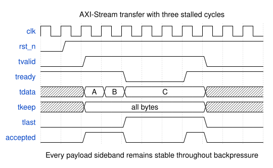
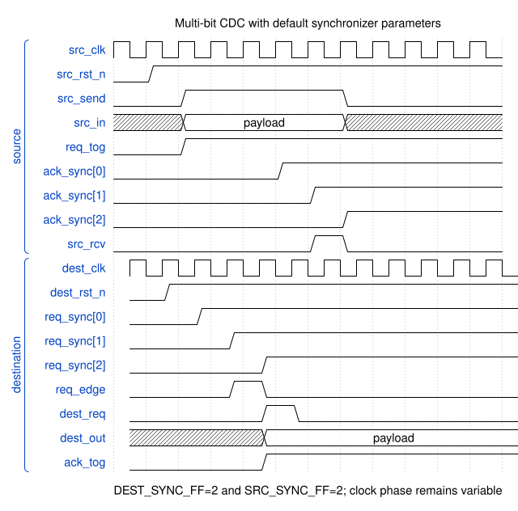

# Implementation developer guide

Use this path when changing product code.

## Contents

- **[Start correctly](#start-correctly)** — Establish scope and ownership first.
- **[Find the owner](#find-the-owner)** — Follow each concern into code.
- **[Change HDL safely](#change-hdl-safely)** — Preserve interfaces and timing contracts.
- **[Read timing](#read-timing)** — Use verified WaveDrom diagrams.
- **[Finish completely](#finish-completely)** — Produce reproducible review evidence.

## Start correctly

- Read the active Issue first.
- Open every linked requirement.
- Confirm one branch owns the change.
- Identify the independent reviewer.
- Record assumptions publicly.
- Stop when specifications conflict.

## Find the owner

| Concern | Primary owner | First verification stop |
|---|---|---|
| SoC composition | `sw/litex/milan_soc.py` | `sw/litex/test_*.py` |
| Integration boundary | `hdl/milan/milan_datapath.sv` | `tb/verilator/milan_dp/` |
| Register interface | `hdl/common/csr/milan_csr.sv` | `tb/verilator/csr/` |
| Traffic handling | `hdl/ieee8021q/` | `tb/verilator/cls/`, `datapath/` |
| Fabric gPTP engine | `gptp-processor/` | `make -C gptp-processor` |
| gPTP integration | `hdl/ieee8021as/gptp_plane/KL_gptp_shadow.sv` | `tb/verilator/gptp_shadow/` |
| PTP timestamping | `hdl/ieee8021as/` | `tb/verilator/ptp*/` |
| Audio transport | `hdl/ieee1722/` | matching Verilator suites |
| Control protocols | `protocol-processor/` | `protocol-processor/scripts/run_suites.sh` |
| Control integration | `hdl/milan/KL_pp_shadow.sv` | `tb/verilator/pp_shadow/` |
| Bare-metal ownership | `sw/firmware/milan_baremetal/` | build and integration gates |
| Submodule boundaries | [Submodule map](../reference/SUBMODULES.md) | donor and root suites |

- Use [`MODULE_MATRIX.md`](../traceability/MODULE_MATRIX.md) for traceability.
- Use [`FPGA_DESIGN.md`](../fpga/FPGA_DESIGN.md) for module discovery.
- Use [`REGISTER_MAP.md`](../reference/REGISTER_MAP.md) for ABI behavior.

## Change HDL safely

- Use SystemVerilog for new RTL.
- Keep ports explicit and documented.
- Preserve clock-domain ownership.
- Use approved CDC primitives.
- Reset every state register appropriately.
- Hold payload stable during backpressure.
- Test reset during active traffic.
- Test invalid ordering and timeouts.
- Never weaken an oracle.

Use the smallest failing harness first.

Then run every required repository gate.

## Read timing

These diagrams show reusable HDL contracts.

Always confirm module-specific behavior.

### AXI-Stream backpressure

- Transfers require simultaneous valid and ready.
- Every payload sideband stays stable during backpressure.
- Last only qualifies an accepted beat.

### Multi-bit clock crossing

- Source data remains stable during transfer.
- Request synchronization precedes destination capture.
- Acknowledgement returns completion upstream.
- Both resets belong to separate clock domains.
- Shown latency uses default synchronizer parameters.
- Clock phase changes total latency.

More diagrams live in the [diagram catalog](../diagrams/README.md).

## Finish completely

- Update self-checking tests.
- Update changed interface documentation.
- Regenerate derived documentation.
- Run focused negative controls.
- Run the complete local gates.
- Record exact commands and results.
- Push one coherent commit.
- Request cleared-context review.

Start focused.

Finish with required repository gates.
