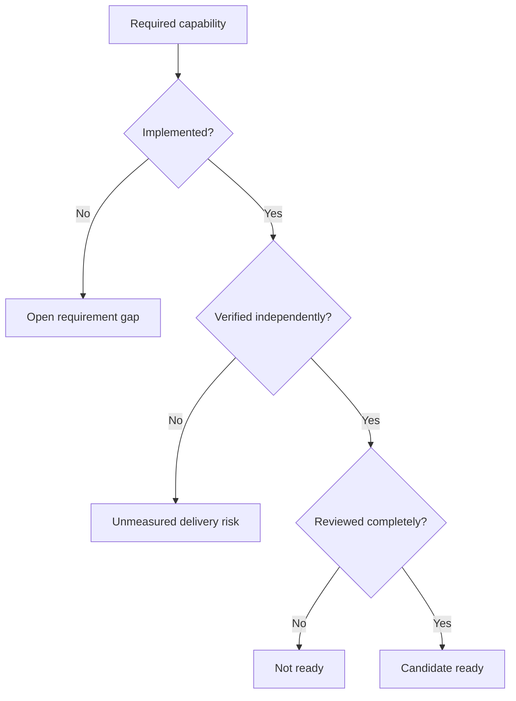

# Project manager guide

Use this path for delivery decisions.

## Contents

- **[Read trustworthy status](#read-trustworthy-status)** — Prefer current executable evidence.
- **[Ask four questions](#ask-four-questions)** — Separate capability, coverage, risk, and readiness.
- **[Interpret risk](#interpret-risk)** — Keep missing evidence visible.
- **[Approve readiness](#approve-readiness)** — Require complete review coverage.

## Read trustworthy status

| Question | Authority |
|---|---|
| What must exist? | [`REQUIREMENTS.md`](../../REQUIREMENTS.md) |
| What currently exists? | [Feature-status ledger](../reference/MILAN_FEATURE_STATUS.md) |
| What remains incomplete? | [Feature-status ledger](../reference/MILAN_FEATURE_STATUS.md) and open Issues |
| What is scheduled? | [GitHub Project](https://github.com/orgs/kebag-logic/projects/10) |
| What is actively changing? | Open Issues and pull requests |
| What passed locally? | Exact command evidence |
| What passed remotely? | Exact-head required checks |
| What shipped historically? | [`docs/history/v1/`](../history/v1) |

Status prose can drift.

Prefer machine-checked status rows.

## Ask four questions

- Is the required behavior implemented?
- Can relevant tests detect its failure?
- Are integration boundaries exercised?
- Did independent reviewers cover every lens?

Never convert missing evidence into progress.

## Interpret risk

| Signal | Meaning | Manager response |
|---|---|---|
| Missing requirement | Product capability remains absent | Keep delivery open |
| Green unit test | One boundary behaves correctly | Request integration evidence |
| Green CI | Automated gates passed | Still require independent review |
| Hardware-only claim | Bench evidence lacks portability | Request reproducible artifacts |
| Open major finding | Candidate remains unsafe | Block readiness |
| Historical success | Earlier revision passed | Demand current-head evidence |
| Submodule pin change | Imported behavior changed | Require donor and root gates |

## Approve readiness

- Confirm every acceptance criterion.
- Confirm exact-head local evidence.
- Confirm required hosted checks.
- Confirm two positive reviews.
- Confirm one external review.
- Confirm every review lens.
- Use the reviewer-owned lens ledger.
- Confirm every ledger head remains valid.
- Confirm no blocker, major, or minor remains.
- Confirm candidate-merge validation.
- Leave merging to authorized maintainers.

Done means evidence survived integration.
