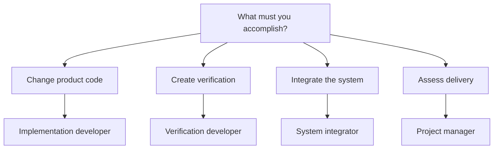

# Choose your documentation path

Choose one path before opening detailed references.

Each path starts with verified repository evidence.

## Choose a role

| Role | Start here | Expected outcome |
|---|---|---|
| Implementation developer | [Implementation developer](IMPLEMENTATION_DEVELOPER.md) | A reviewed product change |
| Verification developer | [Verification developer](VERIFICATION_DEVELOPER.md) | Reproducible defect evidence |
| System integrator | [System integrator](SYSTEM_INTEGRATOR.md) | A correctly wired deployment |
| Project manager | [Project manager](PROJECT_MANAGER.md) | An evidence-based status decision |

## Shared foundations

- [`AGENTS.md`](../../AGENTS.md) governs public workflow.
- [`CONTRIBUTING.md`](../../CONTRIBUTING.md) governs implementation and verification.
- [`REQUIREMENTS.md`](../../REQUIREMENTS.md) defines normative behavior.
- [`docs/README.md`](../README.md) indexes current authorities.
- Git and executable evidence outrank summaries.
- Historical pages never define current behavior.
- Open Issues own unresolved work.

| Focus | Implementation | Verification | Integration | Management |
|---|---|---|---|---|
| Fabric gPTP | [HDL](gptp/HDL_DEVELOPER.md) | [Tests](gptp/TEST_DEVELOPER.md) | [System](gptp/SYSTEM_INTEGRATOR.md) | [Status](gptp/MANAGER.md) |

Stop when authorities disagree.

Publish the conflict before continuing.
