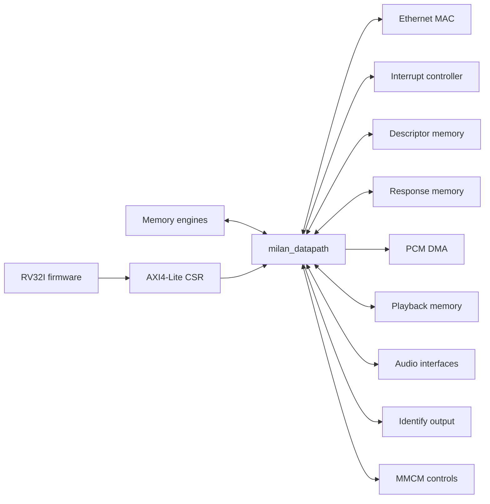
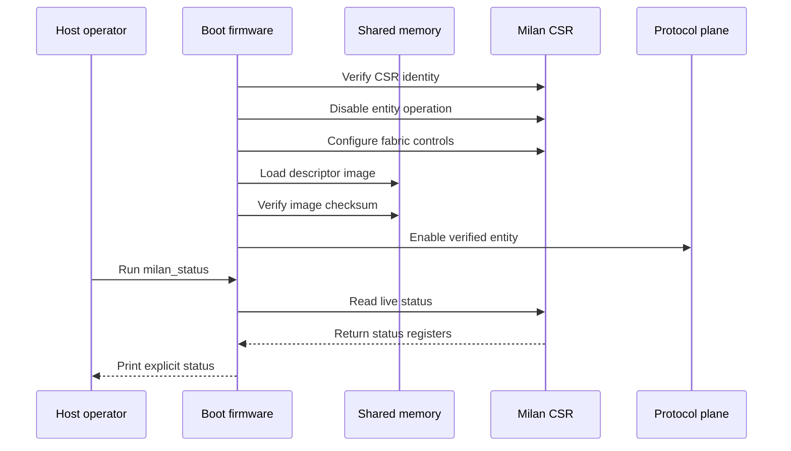

# System integrator guide

Use this path when embedding the datapath.

## Contents

- **[Understand the boundary](#understand-the-boundary)** — Identify every required interface.
- **[Connect clocks and reset](#connect-clocks-and-reset)** — Preserve documented domain assumptions.
- **[Follow boot order](#follow-boot-order)** — Load state before enabling protocols.
- **[Verify integration](#verify-integration)** — Prove real wiring and failures.

## Understand the boundary

`milan_datapath` is the primary integration boundary.



<!-- solution-interface-groups:start -->
| Group | RTL names | Integration duty | Safe inactive start |
|---|---|---|---|
| Clocks and resets | `axis_clk`, `axis_resetn`, `gtx_*`, `clk_audio_i`, `clk_tdm_i` | Drive selected domains and reset sequencing | Drive required clocks; assert resets |
| AXI4-Lite CSR | `s_axi_*` | Map the complete 64 KiB window | Connect fully; never tie handshakes |
| TX DMA stream | `s_axis_tx_*` | Supply complete transmit frames | Set `s_axis_tx_tvalid=0` |
| RX DMA stream | `m_axis_rx_*` | Accept complete receive frames | Set `m_axis_rx_tready=0` |
| Timestamp stream | `m_axis_ts_*` | Drain timestamp records | Set `m_axis_ts_tready=0` |
| PCM DMA stream | `m_axis_pcm_*` | Drain framed PCM records | Set `m_axis_pcm_tready=0` |
| MAC streams | `m_axis_mac_tx_*`, `s_axis_mac_rx_*` | Preserve final-boundary backpressure | Set `s_axis_mac_rx_tvalid=0`; set `m_axis_mac_tx_tready=0` |
| Descriptor memory | `o_desc_mem_*`, `i_desc_mem_*` | Serve the generated entity image | Set `i_desc_mem_req_ready=0`; clear every response input |
| Response memory | `o_resp_mem_*`, `i_resp_mem_*` | Complete every accepted response operation | Set `i_resp_mem_req_ready=0`, `i_resp_mem_wr_ready=0`; clear response and completion inputs |
| Playback memory | `pb_*` | Serve configured PCM rings | Set every `pb_*_i=0` |
| MAC control and status | `o_mac_*`, `i_mac_*`, link, PHY, Ethernet guards | Report honest capabilities and status | Set `i_mac_speed=2'b10`, `i_link_up=1`, `i_full_duplex=1`; clear events, capabilities, toggles |
| Interrupt | `o_irq_csr` | Route the aggregate CSR interrupt | Leave the output open during smoke tests |
| Identify output | `o_identify` | Route the requested visual indication | Leave the output open during smoke tests |
| MMCM controls | `o_mmcm_*`, `i_mmcm_*`, `i_ps_clk` | Bridge DRP and phase handshakes | Set `i_ps_clk=axis_clk`, DRP inputs zero, `i_mmcm_locked=1`, `i_mmcm_ps_done=0` |
| Audio pins | `i2s_*`, `tdm_*`, `media_lrclk_o` | Match the selected audio geometry | Set `i2s_sdout_i=0`, every `tdm_*_i=0`; leave outputs open |
<!-- solution-interface-groups:end -->

Read the complete [integration contract](../integration/INTEGRATION_GUIDE.md).

Read the stable [register map](../reference/REGISTER_MAP.md).

## Connect clocks and reset

- Identify every clock source.
- Keep domain names explicit.
- Use approved crossing primitives.
- Constrain asynchronous paths deliberately.
- Sequence reset release correctly.
- Preserve resetless liveness observers.
- Never add direct cross-domain assignments.

Use the generated [CDC census](../diagrams/cdc_census.svg).

Use the [CDC handshake timing](../diagrams/wd_cdc_handshake.svg).

## Follow boot order



- Verify CSR identity first.
- Disable entity operation before configuration.
- Configure generated fabric values.
- Load the descriptor image afterward.
- Verify its checksum before advertising.
- Enable only the verified entity.
- Confirm live status afterward.
- gPTP remains independent from entity enablement.

Missing memory bridges cause misleading protocol failures.

Never tie response interfaces silently.

## Verify integration

- Read the identification register.
- Confirm the reported version.
- Exercise one CSR write.
- Read that value back.
- Send one frame each direction.
- Apply downstream backpressure.
- Reset during active traffic.
- Stall descriptor memory.
- Stall response memory.
- Verify timeout behavior.
- Confirm interrupt clearing.
- Run the integrated Verilator suite.

```sh
make -C tb/verilator/milan_dp
```

Activate the documented [LiteX environment](../litex/LITEX_SOC.md#7-reproducibility---versions).

```sh
python3 sw/litex/test_pp_mem_bridge.py
python3 sw/litex/test_pp_boot_bus_freeze.py
```

The raw harness cannot prove SoC bridge wiring.

Run SoC evidence after every bridge change.

Read the complete [simulation procedure](../testing/SIMULATION.md#section-33-the-scripted-path-used-to-capture-the-evidence).

Build the softcore simulator once.

```sh
python3 sw/litex/milan_sim.py --xlen 32 --non-interactive \
  --output-dir build_milan_sim
```

Press Ctrl-C after the first `litex>` prompt.

Run the cached simulator with scripted input.

```sh
cd build_milan_sim/gateware
{ sleep 4; printf 'mem_read 0x90000000 16\n'; sleep 5; } \
  | ./obj_dir/Vsim | tee /tmp/milan-id.log
grep -F '4e 4c 49 4d' /tmp/milan-id.log
```

The byte sequence proves the `MILN` identification word.

Then run the required complete gates.
