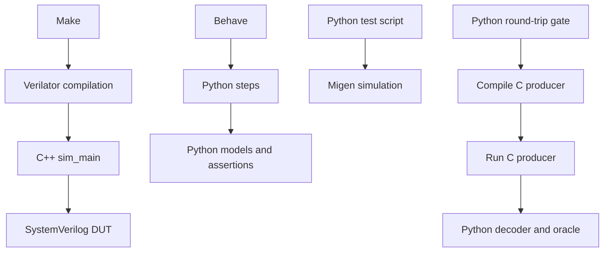
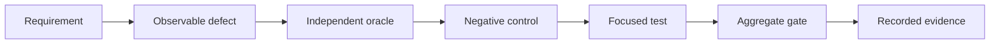

# Verification developer guide

Use this path when tests are deliverables.

## Contents

- **[Choose a layer](#choose-a-layer)** — Match evidence with failure scope.
- **[Understand language ownership](#understand-language-ownership)** — Separate orchestration, stimulus, and target code.
- **[Trace the frameworks](#trace-the-frameworks)** — Follow each executable path.
- **[Build one useful test](#build-one-useful-test)** — Prove the oracle can fail.
- **[Run focused evidence](#run-focused-evidence)** — Start small before aggregating.
- **[Debug failures](#debug-failures)** — Localize failures without hiding them.
- **[Publish evidence](#publish-evidence)** — Make results reproducible.

## Choose a layer

Choose the smallest layer proving the requirement.

| Layer | Best use | Entry point |
|---|---|---|
| Python gate | Structure, generation, policy | `python3 scripts/<gate>.py` |
| Behave | Specification-facing offline contracts | `cd tests && behave -f plain` |
| Migen simulation | LiteX module behavior | `scripts/run_litex_sims.sh <logs>` |
| C++ Verilator | Cycle-accurate RTL behavior | `make -C tb/verilator/<suite>` |
| C with Python | Shipping trace producer | `python3 sw/trace/test_trace_roundtrip.py` |
| Protocol donor | Donor RTL behavior | `protocol-processor/scripts/run_suites.sh` |
| gPTP donor | Donor engine behavior | `make -C gptp-processor` |
| Root sweep | Integrated RTL regression | `scripts/run_all_suites.sh <logs>` |

- Root sweeps discover suites dynamically.
- Donor suites remain separate.
- Migen scripts lack one aggregate runner.
- CI ownership differs between layers.

Read [`CI_WORKFLOWS.md`](../testing/CI_WORKFLOWS.md) before claiming coverage.

## Understand language ownership

| Language | Primary responsibility | Avoid |
|---|---|---|
| Python | Models, orchestration, builders, gates, decoding | Mirroring RTL assumptions blindly |
| C++ | Verilator stimulus, clocks, assertions, reference models | Silent failures or uncounted checks |
| C | Firmware and trace-producing target code | Treating target code as its oracle |
| SystemVerilog | DUT wrappers and observable signals | Reimplementing expected behavior |
| Shell and Make | Reproducible build entry points | Parsing logs as sole verdicts |

Python drives several independent layers.

C has no general harness framework.

C++ owns most cycle-accurate RTL checking.

## Trace the frameworks



- `tb/verilator/*/sim_main.cpp` owns cycle-level checking.
- `tests/steps/` owns Behave steps and models.
- `sw/litex/test_*.py` owns standalone Migen simulations.
- `sw/trace/test_trace_roundtrip.py` owns trace verification.
- C produces target-format trace data.
- Python independently decodes that data.
- C never judges its own correctness.

## Build one useful test



- Name the exact defect.
- Identify an observable output.
- Build expectations independently.
- Add boundary and reset cases.
- Add malformed inputs.
- Add backpressure when applicable.
- Add timeout and recovery cases.
- Plant one deliberate mutation.
- Confirm the mutation fails.
- Remove the mutation.

Never count an unobserved behavior.

## Run focused evidence

### One Verilator suite

```sh
make -C tb/verilator/cdc
```

### Every root Verilator suite

```sh
suite_logs=$(mktemp -d)
scripts/run_all_suites.sh "$suite_logs"
```

### Behave contracts

```sh
cd tests
behave -f plain
```

### One LiteX simulation

Activate the documented [LiteX environment](../litex/LITEX_SOC.md#7-reproducibility---versions).

```sh
python3 sw/litex/test_ring_dma.py
```

### Donor repositories

```sh
protocol-processor/scripts/run_suites.sh
make -C gptp-processor
```

### C trace round-trip

```sh
python3 sw/trace/test_trace_roundtrip.py
```

Directory listings remain authoritative.

Avoid copying volatile suite counts into prose.

Use the [gPTP test guide](gptp/TEST_DEVELOPER.md) for time evidence.

## Debug failures

- Preserve the first failing log.
- Confirm the candidate commit.
- Re-run only the failing suite.
- Reduce stimulus without weakening coverage.
- Compare accepted transfers only.
- Check reset and clock sequencing.
- Inspect valid-ready stability.
- Check timeout classification.
- Distinguish failure from infrastructure timeout.
- Never convert unknown results into passes.

Use timing diagrams while debugging interfaces.

- [AXI-Stream backpressure](../diagrams/wd_axis_backpressure.svg)
- [CDC handshake](../diagrams/wd_cdc_handshake.svg)
- [Link-guard reset](../diagrams/wd_linkguard_reset.svg)
- [CBS credit behavior](../diagrams/wd_cbs_credit.svg)

## Publish evidence

- Record the full commit SHA.
- Record every exact command.
- Record each exit status.
- Preserve relevant logs.
- State skipped dependencies loudly.
- Separate modeled evidence from hardware evidence.
- State uncovered seams.
- Link every finding to an artifact.

Green output alone never proves correctness.
