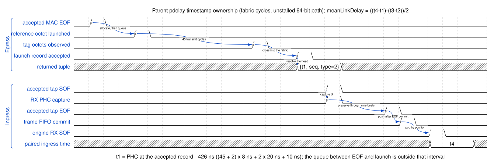

<!-- SPDX-FileCopyrightText: 2026 Kebag Logic -->
<!-- SPDX-License-Identifier: CERN-OHL-W-2.0 -->

# Fabric gPTP HDL-developer guide

Use this page for parent RTL changes.

## Contents

- **[Find ownership](#find-ownership)** — Change the correct repository and module.
- **[Preserve timing](#preserve-timing)** — Maintain transfer and commit ordering.
- **[Handle failures](#handle-failures)** — Keep refusal paths observable and bounded.
- **[Finish changes](#finish-changes)** — Update tests, diagrams, and evidence.

## Find ownership

| Concern | Owner |
|---|---|
| Protocol state | `gptp-processor/` |
| Parent transport | `KL_gptp_shadow` |
| Egress capture | `KL_gptp_txstamp` |
| PHC arithmetic | `timestamp_counter` |
| PHC clock domain | `milan_soc.py` ties `gtx_clk` to `axis_clk` at the `milan_datapath` instantiation |
| Time validity | `KL_ptp_clock_validity` |
| Public ABI | `milan_csr` and processor wrapper |

Never patch imported behavior inside the parent lane.

Land donor changes before advancing its pin.

Read the [engine HDL guide](https://github.com/Mister-M-alt/FPGA-gPTP/blob/bacf812178ea0e0ca843b5c332dd62414f701fad/docs/HDL_DEVELOPER.md).

## Preserve timing

The parent chronogram proves three orderings:

- Accepted beat 5 registers the tuple.
- It is visible one cycle later, before EOF.
- Ingress commit follows nine accepted beats.
- Engine SOF follows the commit by three cycles.

Clock-domain precondition:

- The PHC counts on `gtx_clk`.
- The shadow samples `phc_ns_i` on `axis_clk`.
- Every real instantiation ties `gtx_clk` to `axis_clk`.
- `ptp_csr_sync` crosses CSR commands only.

Timing rules:

- RX acceptance requires a real parent transfer.
- RX timestamps remain paired through frame commit.
- TX payload stays stable during every stall.
- TX state advances only after acceptance.
- Publication fields stage before commit.
- Discontinuity reaches validity before registered publication.

The [parent architecture](../../design/GPTP_PLANE.md) explains each seam.

## Handle failures

- Drop complete RX frames after storage exhaustion.
- Count every confirmed gPTP tap refusal.
- Reject malformed frames inside the parser.
- Preserve event snapshots through queueing.
- Match egress timestamps using both tags.
- Keep option-off outputs structurally safe.
- Test reset during every outstanding transaction.

Never convert a refused frame into partial data.

## Finish changes

- Add a failing focused regression first.
- Exercise negative and boundary paths.
- Update WaveDrom after timing changes.
- Update Draw.io after structural changes.
- Run donor and parent suites.
- Run lint and portability gates.
- Record exact-head evidence publicly.

Start with the [source ledger](https://github.com/Mister-M-alt/FPGA-gPTP/blob/bacf812178ea0e0ca843b5c332dd62414f701fad/docs/SOURCE_EVIDENCE.md).
