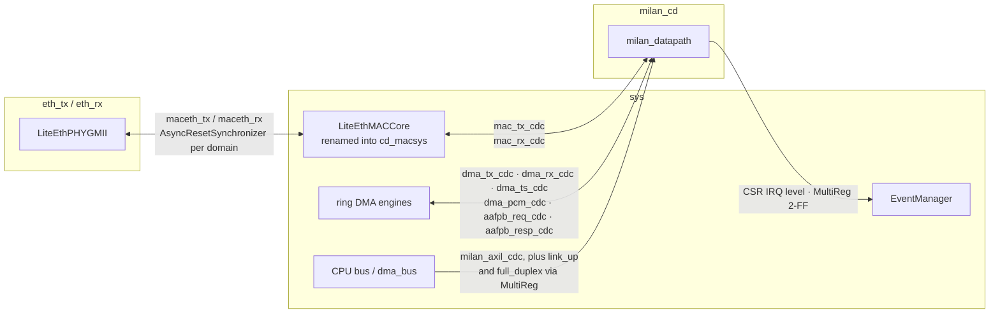
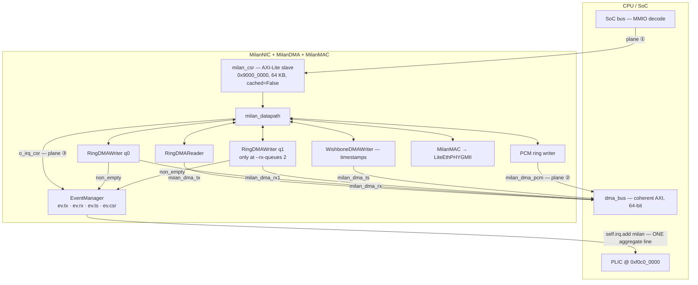

# Attaching AXI-Stream FPGA cores to the NaxRiscv SoC

> **The filename says NaxRiscv; the content is CPU-agnostic and current
> (re-framed 2026-07-27).** NaxRiscv is the **historical** soft core
> ([`GLOSSARY.md`](../GLOSSARY.md)); the shipping builds run **VexiiRiscv**
> ([`sw/litex/sweep.sh`](../../sw/litex/sweep.sh) passes `--cpu vexiiriscv`, and [`sw/builder`](../../sw/builder) defaults to it —
> `milan_soc.py --cpu` still *defaults* to `naxriscv`, which is its own trap. **The
> three-plane method below does not change with the core**, and neither do the
> `milan_soc.py` call sites or the §6.1 CDC table — both are read off the current
> tree. The only core-specific material is §2's bus table, which now covers both.
> **The page is deliberately not renamed**: inbound links and section anchors
> across the corpus point here.

How to connect an **AXI4-Stream** FPGA core (a MAC, a DSP block, a crypto engine,
the Milan TSN datapath …) to a LiteX RISC-V softcore SoC so that software running
on the core can configure it, move data to/from it, and get interrupts from it.

The concrete, working reference for everything below is
[`sw/litex/milan_soc.py`](../../sw/litex/milan_soc.py) (class `MilanNIC`): the Milan
NIC *is* an AXI-Stream core cluster, and it is attached with exactly these three
planes.

---

## Contents

- **[1. The mental model: AXI-Stream is not memory-mapped](#1-the-mental-model-axi-stream-is-not-memory-mapped)** — Why "attach AXIS to the CPU bus" is not a thing you can do — the bus has no address — and the three-plane decomposition (control, data, events) that every following section builds on.
- **[2. What NaxRiscv exposes in LiteX](#2-what-naxriscv-exposes-in-litex)** — The four buses you have to work with — the same four under the same names on both NaxRiscv and the shipping VexiiRiscv, which is what makes the rest of the page core-agnostic — and the two constraints that will bite at elaboration: MMIO must land at or above `0x8000_0000` or you get *"Region not in IO region"*, and the coherent DMA path is 64-bit in the `--xlen 64` build.
- **[3. Plane ①  -  control (AXI-Lite / CSR slave)](#3-plane-①-----control-axi-lite--csr-slave)** — Copy-ready Python: the AXI-Lite interface, the `SoCRegion` that maps it uncached, and the full channel-by-channel `Instance()` wiring. Plus what to do instead if your core has no AXI-Lite port.
- **[4. Plane ②  -  data (AXI-Stream ↔ memory via DMA)](#4-plane-②-----data-axi-stream--memory-via-dma)** — The coherent-versus-not decision and what each costs the driver (plain `dma_map_*`, or manual cache maintenance forever). Ends with the AXIS wiring, where the load-bearing detail is that the DMA treats `tlast` as the descriptor boundary.
- **[5. Plane ③  -  events (IRQ → PLIC)](#5-plane-③-----events-irq--plic)** — `EventManager` → `self.irq.add` → PLIC in a dozen lines, and how the allocated source numbers become the `interrupts` property the driver binds to.
- **[6. Clock-domain crossing](#6-clock-domain-crossing)** — The general rule, then §6.1's table of every crossing this SoC actually has. Two things to internalise: `buffered=True` re-registers in the *read* domain and without it the BRAM clock-to-Q cone becomes your timing violator; and when the datapath shares `sys`, every crossing collapses to a plain wire — the CDC is a build-time choice, not a permanent cost.
- **[7. Adding the RTL and constraints](#7-adding-the-rtl-and-constraints)** — Three `add_source` lines, plus a historical note: the datapath used to be a black box and no longer is.
- **[8. Checklist / gotchas](#8-checklist--gotchas)** — The pre-flight list, and §8.1 — *"the single most expensive mistake this SoC glue has made"*. Three status inputs whose temporary constants outlived their excuse and turned tested RTL into dead silicon, including the subtle form: a Python per-board select is just as constant in the bitstream and *looks* like wiring in review.
- **[9. Worked example  -  the Milan NIC](#9-worked-example-----the-milan-nic)** — All three planes at once with the real master and slave names. Read the last table before trusting any IRQ name: of the four event sources only one is raised by the datapath, one quietly reuses the free line for RX queue 1, and one is tied to `0` purely to keep the four-line driver shape.

## 1. The mental model: AXI-Stream is not memory-mapped

A CPU talks to peripherals through **addresses**. AXI-Stream has **no address**  - 
it is a one-way, back-pressured data-flow bus (`tdata`/`tkeep`/`tvalid`/`tready`/
`tlast`). You therefore never "attach AXIS to the CPU bus" directly. You attach it
on **three separate planes**:

```
                          ┌───────────────────────────────────────────────┐
                          │          LiteX RISC-V softcore SoC             │
   register  ┌────────────┤  pbus (AXI-Lite)  ── CSR / control ───────────►│  ① CONTROL
   reads/    │            │                                                │
   writes    │   AXIS     │  dma_bus (AXI, coherent) ◄─ DMA ─► DRAM/L2 ────│  ② DATA
  ───────────┼──►┌──────┐ │                                                │
   your      │   │ AXIS │─┼──tvalid/tdata──►┌─────┐  AXI  ┌──────────────┐ │
   AXIS  ────┼──►│ CORE │ │◄─tready─────────│ DMA │──────►│ interconnect │ │
   core      │   └──────┘ │                 └─────┘       └──────────────┘ │
             │      │irq  │  irq line ──► EventManager ──► PLIC ───────────│  ③ EVENTS
             └──────┼─────┘                                                │
                    └──────────────────────────────────────────────────────┘
```

- **① Control**  -  the core's config/status registers, exposed as an **AXI-Lite
  (or CSR) slave** in the CPU's MMIO map. This is how the driver programs it.
- **② Data**  -  the AXIS `tdata` flow is bridged to/from **memory by a DMA
  engine**. The CPU touches *buffers in DRAM*, never the stream itself.
- **③ Events**  -  a completion/error line raised into the **PLIC** so the driver
  can use interrupts (NAPI, PTP, …) instead of polling.

The rest of this document is one section per plane, plus clock-domain crossing and
a checklist.

---

## 2. What NaxRiscv exposes in LiteX

Both cores this SoC has been built on present the **same four buses** under the
same attribute names — which is why the rest of this page needs no per-core
variant. `litex/soc/cores/cpu/naxriscv/core.py` and
`litex/soc/cores/cpu/vexiiriscv/core.py`:

| Bus | Type | Purpose |
|-----|------|---------|
| `ibus` / `dbus` | AXI-Lite → wishbone/axi | instruction fetch + load/store to memory |
| `pbus` | `AXILiteInterface` (32-bit data, 32-bit address on both) | **peripheral bus**  -  where MMIO slaves (your control plane) land |
| `dma_bus` | `AXIInterface`, `addr=32`, `id=4`. Nax **hardwires** `data_width=64`; Vexii takes `dma_data_width or internal_bus_width` | **coherent DMA** into L2/DRAM  -  only when built with coherent DMA (`--with-coherent-dma` on Nax, `--with-dma` on Vexii; `milan_soc.py` drives both off its own `--coherent-dma`) |
| `interrupt` | `Signal(32)` | external interrupt lines, driven by the **PLIC** (`0xf0c0_0000`) + CLINT (`0xf001_0000`) |

VexiiRiscv adds one thing Nax does not: `memory_buses` /
`add_memory_buses()`, an AXI port straight to LiteDRAM. It is not part of the
three-plane pattern — your core never touches it — but it is why a Vexii SoC's
`main_ram` can bypass the interconnect.

Two consequences you must respect:

1. **MMIO must be in the IO region.** Both cores declare
   `io_regions = {0x8000_0000: 0x8000_0000}`, i.e. `0x8000_0000–0xFFFF_FFFF` is
   the uncached IO region. A control-plane slave placed below that (e.g. the Zynq
   address `0x43C0_0000`) fails with *"Region not in IO region, it must be
   cached."* `milan_soc.py` maps the Milan CSR window at `0x9000_0000` for this
   reason (the register **offsets** are unchanged; only the base differs per host).
2. **The DMA data path is 64-bit** on the coherent `dma_bus` in the shipping
   `--xlen 64` configuration. Size your AXIS↔AXI bridge and buffers accordingly.
   On Vexii this follows the core's internal bus width rather than being fixed, so
   read it off the elaborated interface instead of assuming it.

---

## 3. Plane ①  -  control (AXI-Lite / CSR slave)

Give the core an AXI-Lite slave and drop it into the peripheral bus. This is a
verbatim reduction of `MilanNIC` in `milan_soc.py`:

```python
from litex.soc.interconnect import axi
from litex.soc.integration.soc import SoCRegion

# 1. An AXI-Lite interface the core will terminate.
axil = axi.AXILiteInterface(data_width=32, address_width=32)

# 2. Map it into the CPU IO region (uncached MMIO). MUST be >= 0x8000_0000.
self.bus.add_slave("mycore_csr", axil,
    region=SoCRegion(origin=0x9000_0000, size=0x1_0000, cached=False))

# 3. Wire the AXI-Lite channels to your Verilog core (black box or real RTL).
self.specials += Instance("mycore",
    i_s_axi_awaddr = axil.aw.addr[:16], i_s_axi_awvalid = axil.aw.valid,
    o_s_axi_awready= axil.aw.ready,
    i_s_axi_wdata  = axil.w.data,  i_s_axi_wstrb = axil.w.strb,
    i_s_axi_wvalid = axil.w.valid, o_s_axi_wready = axil.w.ready,
    o_s_axi_bresp  = axil.b.resp,  o_s_axi_bvalid = axil.b.valid,
    i_s_axi_bready = axil.b.ready,
    i_s_axi_araddr = axil.ar.addr[:16], i_s_axi_arvalid = axil.ar.valid,
    o_s_axi_arready= axil.ar.ready,
    o_s_axi_rdata  = axil.r.data,  o_s_axi_rresp = axil.r.resp,
    o_s_axi_rvalid = axil.r.valid, i_s_axi_rready = axil.r.ready,
    # ... AXIS + irq ports below ...
)
```

The driver then `ioremap`s `0x9000_0000` (the DT `reg` base) and reads/writes the
core's registers. If your core has no AXI-Lite port, expose registers with a LiteX
`CSRStorage`/`CSRStatus` bank instead  -  same idea, LiteX generates the decode.

---

## 4. Plane ②  -  data (AXI-Stream ↔ memory via DMA)

The CPU cannot read `tdata` directly; a **DMA engine** copies between the stream
and DRAM descriptors. Pick one of these bridges:

### 4a. Coherent DMA (recommended)  -  no cache flushes in the driver
Build the CPU with coherent DMA and give your AXIS→AXI bridge a master on the
coherent `dma_bus`:

```python
# milan_soc.py: enable it via the CPU's own args (see §2 table). The flag name
# differs per core - Nax `with_coherent_dma`, Vexii `with_dma` - and milan_soc.py
# drives whichever applies from its single `--coherent-dma`. Either way the CPU
# then exposes self.cpu.dma_bus.
_nax_args.with_coherent_dma = True     # NaxRiscv;  _vex_args.with_dma = True on VexiiRiscv

# Declare the stream your core drives (RX) / consumes (TX), 64-bit to match dma_bus.
rx_axis = axi.AXIStreamInterface(data_width=64, clock_domain="sys")
tx_axis = axi.AXIStreamInterface(data_width=64, clock_domain="sys")

# A stream<->memory DMA (Forencich axi_dma, or LiteX's own DMA  -  see 4b).
# Its AXI master goes onto the CPU's coherent DMA bus:
self.dma_bus.add_master("mycore_dma", master=dma.axi_mm)   # coherent -> L2/DRAM
```

Because accesses are coherent, the CPU's caches stay in sync with DMA'd buffers  - 
the Linux driver uses plain `dma_map_*` without manual invalidation.

### 4b. Non-coherent DMA  -  simpler fabric, driver must flush
Attach the DMA master to the ordinary system bus instead:

```python
self.bus.add_master("mycore_dma", master=dma.axi_mm)   # into the main interconnect
```

LiteX also ships memory-mover primitives if you don't want an external DMA IP:
`litex.soc.interconnect.wishbone.WishboneDMAReader/Writer` and the LiteDRAM
`LiteDRAMDMAReader/Writer` port DMAs convert a LiteX `stream.Endpoint` to/from
memory; put an adapter between the AXIS core and the LiteX stream endpoint.

### Connecting the AXIS wires to the core
```python
self.specials += Instance("mycore",
    # RX: core -> SoC
    o_m_axis_tdata = rx_axis.data, o_m_axis_tkeep = rx_axis.keep,
    o_m_axis_tvalid= rx_axis.valid, i_m_axis_tready= rx_axis.ready,
    o_m_axis_tlast = rx_axis.last,
    # TX: SoC -> core
    i_s_axis_tdata = tx_axis.data, i_s_axis_tkeep = tx_axis.keep,
    i_s_axis_tvalid= tx_axis.valid, o_s_axis_tready= tx_axis.ready,
    i_s_axis_tlast = tx_axis.last,
)
```

Honour `tready` back-pressure end-to-end and terminate frames with `tlast`; the
DMA uses `tlast` as the packet/descriptor boundary.

---

## 5. Plane ③  -  events (IRQ → PLIC)

Surface each interrupt line through a LiteX `EventManager`; `self.irq.add` routes
it to the PLIC the CPU already instantiates (both cores do). Straight from
`MilanNIC`:

```python
from litex.soc.interconnect.csr_eventmanager import EventManager, EventSourceLevel

self.submodules.ev = ev = EventManager()
ev.rx  = EventSourceLevel()      # one source per line
ev.tx  = EventSourceLevel()
ev.finalize()

self.specials += Instance("mycore",
    o_irq_rx = ev.rx.trigger,
    o_irq_tx = ev.tx.trigger,
    # ...
)

# In the SoC, after adding the module:
self.irq.add("mycore", use_loc_if_exists=True)   # -> allocates a PLIC source
```

The allocated PLIC source numbers are what the driver's device-tree `interrupts`
property references (`interrupt-parent = <&plic>`), exactly as in the overlay
generated by [`sw/builder/endstation_builder.py`](../../sw/builder/endstation_builder.py)
from `configs/endstation_*.yaml`. ([`sw/dts/milan-nic.litex.dtsi`](../../sw/dts/milan-nic.litex.dtsi) and `milan.dtsi`
are historical artifacts - the [`sw/dts`](../../sw/dts) generator was retired 2026-07-26; what
survives there is the binding and `milan_dt.py validate`.)

---

## 6. Clock-domain crossing

AXIS cores frequently run in a **different clock domain** than the SoC  -  e.g. the
Milan datapath's RGMII side is 125 MHz while `sys` is 100 MHz. Cross the stream
*before* it reaches the DMA/bus:

- Use an async stream FIFO in the fabric  -  [`third_party/verilog-axis`](../../third_party/verilog-axis)'s
  `axis_async_fifo` (already vendored) is the drop-in for this, or LiteX's
  `stream.ClockDomainCrossing`.
- Declare the interface's domain with `AXIStreamInterface(..., clock_domain="eth_rx")`
  and rename core submodules with `ClockDomainsRenamer("eth_rx")`.
- Add the extra clock to the platform and constrain it:
  `platform.add_period_constraint(cd.clk, 1e9/125e6)` and
  `platform.add_false_path_constraints(sys_clk, eth_clk)` for the CDC.

Never let a raw AXIS bus cross clock domains without a CDC FIFO  -  `tvalid`/`tready`
handshakes will corrupt.

### 6.1 The crossings this SoC actually has

Every boundary below is a real call site in [`sw/litex/milan_soc.py`](../../sw/litex/milan_soc.py), so the
picture answers the practical question directly: **which signal crosses which
boundary, in which direction, by what mechanism?**



| crossing | direction | mechanism | where |
|---|---|---|---|
| CSR bus | `sys` → `milan_cd` | `axi.AXILiteClockDomainCrossing` (`milan_axil_cdc`) | `add_milan_datapath()` |
| aggregate CSR IRQ | `milan_cd` → `sys` | `MultiReg` (2-FF) into the `sys`-domain `EventManager` | `add_milan_datapath()` |
| `link_up` / `full_duplex` | `sys` → `milan_cd` | `MultiReg` per bit | `MilanMAC.link_status` |
| MAC TX / MAC RX AXIS | `milan_cd` ↔ `sys` | `stream.ClockDomainCrossing`, `buffered=True`, depth 16 | `MilanMAC` |
| DMA TX / RX / TS AXIS | `sys` ↔ `milan_cd` | same, depth 16 | `MilanDMA` |
| PCM AXIS | `milan_cd` → `sys` | same, **depth 128** (payload burstiness) | `MilanDMA` |
| AAF playback req / resp | both ways | same, one per direction | `MilanDMA` |
| MAC core ↔ PHY | `sys` ↔ `eth_tx`/`eth_rx` | LiteEth's own path, plus `AsyncResetSynchronizer` on the mirrored `maceth_*` domains | `MilanMAC` |

Two properties worth internalising. `buffered=True` (`AsyncFIFOBuffered`)
re-registers the FIFO output *in the read domain* — without it the BRAM
clock-to-Q cone fans straight into the datapath consumers and becomes the
timing violator; one extra cycle on a handshaked stream is transparent. And when
the datapath is *not* given its own clock (`milan_cd == "sys"`, the default and
what the Verilator SoC sim uses), `_axis_dp_cdc` returns the same endpoint for
both sides — every crossing above collapses to a direct wire, so the CDC is a
build-time choice, not a permanent cost.

---

## 7. Adding the RTL and constraints

```python
platform.add_source_dir("../../hdl")                       # your core + wrappers
platform.add_source_dir("../../third_party/verilog-axis/rtl")
platform.add_source("mycore.v")
```

**Historical note:** early bring-up kept `milan_datapath` a black box. Since the
PS-less wrapper landed, `milan_soc.py` instantiates the **real RTL** from the
curated `_MILAN_DATAPATH_SOURCES` list (see `add_milan_datapath()`) — nothing is
left as a black box in the current build.

---

## 8. Checklist / gotchas

- [ ] Control-plane MMIO base **≥ `0x8000_0000`** (IO region), `cached=False`.
- [ ] DMA data width matches the CPU (**64-bit** for RV64 `dma_bus`).
- [ ] Prefer `--with-coherent-dma` so the driver skips manual cache maintenance.
- [ ] Every AXIS hop honours `tready`; frames end on `tlast`.
- [ ] CDC FIFO on any AXIS bus that changes clock domain; constrain the crossing.
- [ ] One `EventSourceLevel` per IRQ line; `self.irq.add(...)` → PLIC → DT `interrupts`.
- [ ] Byte order: LiteX/AXIS is little-endian lane 0 first; match your core (the
      Milan RTL documents its big-endian-on-the-wire convention in the harnesses).
- [ ] **No status input left on a constant.** See below - this is the single
      most expensive mistake this SoC glue has made.

### 8.1 The tie-off trap (status inputs)

A core's *status* inputs are the ones SoC glue is tempted to hardwire "until
the real source lands". Three times now that constant outlived the excuse and
turned a fully-tested RTL feature into dead silicon, while every testbench
stayed green - the testbench drives the port, the bitstream does not:

| Port | What the tie cost |
|---|---|
| `i_mac_events = 0` | RMON counters had a port-level TB and counted zero on hardware for months (2026-07-22) |
| `i_link_up = 1`, `i_full_duplex = 1` | `MAC_STATUS[0]`/`[3]` could never report link-down or half-duplex |
| `i_mac_speed = (0b01 if mii else 0b10)` | a **build-time** guess reported as the negotiated speed - and `o_mac_is_1g` (REQ-MAC-03) derived the lwSRP 750 Mb/s admission limit from it |

Note the third one: a Python-level per-board select is just as constant in
silicon as `= 1`, and it *looks* like wiring in review. [`scripts/check_tied_inputs.sh`](../../scripts/check_tied_inputs.sh)
now flags that form too; run it (it is also a trailing report in
[`syn/yosys/run.sh`](../../syn/yosys/run.sh)) and treat every `[WARNING]` as "this cone is dead no matter
what a TB says".

When the honest source genuinely does not exist in fabric, say so and give
software a write port rather than inventing a constant. That is what
`MilanMAC.link_status` is: LiteEth's GMII/MII PHY wrappers expose **no** link,
speed or duplex output - only a bit-bang MDIO CSR - so the negotiated state
only exists in software, and the CSR (reset = the old constants, so the build
is bit-identical until something writes it) is where software publishes it.

---

## 9. Worked example  -  the Milan NIC

The Milan NIC exercises all three planes at once, and `MilanNIC` in
[`sw/litex/milan_soc.py`](../../sw/litex/milan_soc.py) is the literal implementation:

| Plane | Milan realisation |
|-------|-------------------|
| ① control | `milan_csr` AXI-Lite slave @ `0x9000_0000` (register map: [`docs/reference/REGISTER_MAP.md`](../reference/REGISTER_MAP.md)) |
| ② data | `milan_datapath` AXIS TX/RX ↔ the ring-DMA engines (`RingDMAReader`/`RingDMAWriter`/`WishboneDMAWriter`) ↔ `dma_bus` (TX/RX/timestamp rings) |
| ③ events | `o_irq_tx/rx/ts/csr` → `EventManager` → `self.irq.add("milan")` → PLIC → one aggregate DT interrupt (see the generated `milan-nic.litex.dtsi`) |

Drawn out, with the actual master/slave names the SoC registers  -  **what hangs
off which bus, and how many masters the coherent port really carries:**



The four event sources are named after the driver's four `interrupt-names`, but
only one of them is raised by the datapath and one is not raised at all  -  read
the wiring, not the names:

| source | actually driven by | note |
|---|---|---|
| `ev.csr` | `o_irq_csr` out of `milan_datapath` | the only line the datapath itself raises |
| `ev.rx` | `RingDMAWriter.non_empty`, queue 0 | level-high while the RX ring is non-empty  -  this is what makes NAPI interrupt-driven instead of hrtimer-polled |
| `ev.tx` | **RX queue 1's** `non_empty`, else `0` | the TX reader has no completion IRQ (the driver reaps in NAPI), so the RX fan-out reuses the free line |
| `ev.ts` | tied to `0` | the line exists to keep the four-line driver/DT shape |

The internal AXIS pipeline (classifier → per-queue FIFOs → CBS shaper → MAC, plus
the RX MAC filter) is all AXI-Stream and is verified stand-alone in
[`tb/verilator/`](../../tb/verilator)  -  attaching it to the softcore is purely the three-plane wiring
above, and that wiring did not change when the CPU did.
