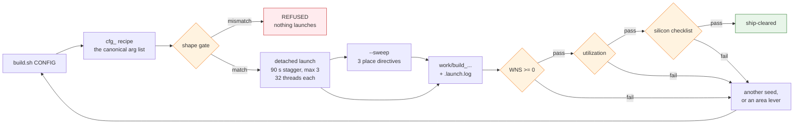

# Building bitstreams  -  the two-board build flow

*2026-07-25. Canonical entry point: **[`sw/litex/build.sh`](../../sw/litex/build.sh)**. This page is the
maintainer reference for it: what the named configurations are, the parallel
launch discipline the script encodes (and why each rule exists), how to add a
configuration, and the per-board load/console facts you need after a build
lands. Test layers around a build: [../testing/RUNNING_TESTS.md](../testing/RUNNING_TESTS.md). Live lab
state: [../findings/BENCH_TOPOLOGY.md](../findings/BENCH_TOPOLOGY.md).*

The shipping software-profile claims are checked against the
[Milan feature status ledger](../reference/MILAN_FEATURE_STATUS.md):

<!-- milan-feature-status:start -->
| Feature ID | Status | Canonical value |
|---|---|---|
| `soc.baremetal-profile` | `implemented` | - |
| `host.sound-card-option` | `implemented` | - |
<!-- milan-feature-status:end -->

## Contents

- **[0. The pipeline, and where it can refuse you](#0-the-pipeline-and-where-it-can-refuse-you)** -- What runs between `build.sh` and a shippable bitstream, and the asymmetry that is the whole point: **only the shape gate is automatic**. Timing, area and the silicon checklist are all read by hand, so a build can pass timing and area and still not be ship-cleared.
- **[1. Usage](#1-usage)** -- The invocation table -- both boards in parallel, the place sweep, `TAG=`, argument passthrough, `--dry-run`, and the `flash` verb. Plus where outputs land and the one-liner that tells you which Vivado phase a detached build is in.
- **[2. The named configurations](#2-the-named-configurations)** -- What each `cfg_*` recipe actually pins: part and speedgrade, DRAM, flash, and why `ax8x8` drops to one RX queue and 16 KB L2 to close. Read the `--eth-port` sub-section before flashing an AX -- a bitstream is built for **one** port, a mismatch leaves the board with no network, and the recipe is verified by grepping the port back out of the build log rather than trusted.
- **[3. The launch discipline (why the script is not just a for-loop)](#3-the-launch-discipline-why-the-script-is-not-just-a-for-loop)** -- Five rules, each paid for: Vivado *errors* above 32 threads, three concurrent builds maximum, a 90 s stagger because concurrent elaborations race on `.git/index.lock`, and detached process groups because a bulk task-kill once reaped four running builds mid-route. Section 3.1 adds the shape gate and the three separate times this class of drift reached silicon.
- **[4. After the build: load + console, per board](#4-after-the-build-load--console-per-board)** -- Per-board JTAG and console invocations (select by serial -- `ttyUSB` numbers renumber on any replug), the v3 flash layout with the bitstream at offset 0, and the retired warning about the old kernel-at-offset-0 map. `hostplane_smoke.sh` is mandatory after every flash.
- **[5. Gates before a build is "good"](#5-gates-before-a-build-is-good)** -- The three gates with their thresholds, including two hard-won caveats: keep AX margin above +0.03 because QSPI flashboot corrupted below it, and OOC-synth a module before believing its hierarchical utilization line.

## 0. The pipeline, and where it can refuse you

*I typed `./build.sh ax8x8` — what actually runs, what can stop it, and what do
I have to check by hand at the end?*



| step | what it checks | automatic? |
|---|---|---|
| **shape gate** ([`scripts/check_sweep_shape.py`](../../scripts/check_sweep_shape.py)) | the composed command line equals `configs/endstation_<shape>.yaml` — `--num-streams`, `--rx-queues`, `--l2-bytes`, and `build.sh`'s `cfg_*` recipes | **yes** — refuses *before* anything launches |
| **WNS ≥ 0** | Design Timing Summary row of `<outdir>/gateware/*_timing.rpt`. On the AX7101 keep margin: QSPI flashboot corrupted below +0.03 at 112.5 MHz | no — read it |
| **utilization** | `*_utilization_place.rpt` Slice LUTs / Slice / Block RAM Tile vs the area scoreboard. OOC-synth a module before believing its hierarchical line | no — read it |
| **silicon checklist** | boot, `ID=MILN`, driver pairing probe, ghost-peer ARP, TX gate, RX cells | no — run it on the board |

**Only the first one is automatic**, and that asymmetry is the point: a build
that passes timing and area but regresses the TX gate is **not** ship-cleared,
and nothing in the pipeline will tell you so. Section 5 has the exact rows.
With `--sweep`, placement is noise-dominated — keep the best WNS/slices build
of the three, do not average them.

## 1. Usage

```sh
cd sw/litex
./build.sh <config> [<config> ...] [--sweep] [--dry-run] [-- <milan_soc.py args>]
```

| Invocation | Effect |
|---|---|
| `./build.sh ax7101` | one build of the AX7101 ship shape |
| `./build.sh arty` | one build of the Arty A7-100 bring-up shape |
| `./build.sh ax7101 arty` | BOTH boards in parallel (90 s stagger) |
| `./build.sh ax7101 --sweep` | 3 builds: the config x the place-directive sweep |
| `TAG=fold2 ./build.sh arty` | output dir `work/build_arty_fold2` (default TAG = mmddHHMM) |
| `./build.sh arty -- --sys-clk-freq 90e6` | append/override milan_soc.py arguments |
| `./build.sh ... --dry-run` | print the exact launch commands, start nothing |
| `./build.sh flash <config>[:<builddir>]` | flash the newest matching build (or the named one) to QSPI: bitstream @0, then that build's manifest images - see section 4 |

Outputs land in `~/litex-milan/work/build_<config>[_<directive>]_<TAG>/`
with a `*.launch.log` next to each. Builds run detached; check progress with
`grep -oE "Phase [0-9.]+ .*" <outdir>/gateware/vivado.log | tail -1` and gate on
the timing/utilization reports (see section 5).

## 2. The named configurations

A configuration is a bash function `cfg_<name>()` in `build.sh` that echoes the
full `milan_soc.py` argument list. One place to edit a board's canonical shape;
call-time deviations go through `-- <args>` (appended last, so argparse lets
them override).

### `ax7101`  -  Alinx AX7101, the perf/ship platform

xc7a100t**fgg484-2**, 1 GbE (RTL8211E strapped GMII), 512 MB DDR3
(MT41J256M16), 16 MB N25Q128 QSPI. This is the shipping 1x1 TDM8 profile:
one RV32I VexiiRiscv hart at 100 MHz in machine mode, no MMU, Linux, L1/L2 or
LiteX SDRAM cache, and no Linux sound-card rings. The physical/fabric audio
datapath, NIC DMA and protocol processor remain. The configuration explicitly
enables the #114 fabric gPTP plane with `--fabric-gptp`; the builder creates its
ROM from the same YAML station MAC, priority1 and 100 MHz fabric clock. It uses
two RX queues, header-split 16K pages, `--strip-probes`, the raw-AEM bare-metal
flash manifest, `--gtx-tx-invert`, `--timing-opt --floorplan`, and a
three-directive placement sweep. See
[BAREMETAL_FIRMWARE.md](BAREMETAL_FIRMWARE.md).

### `ax8x8`  -  AX7101 Linux bring-up, 8-stream (64-channel) shape

Same board, but deliberately retains the Linux bring-up flow, cached Vexii
CPU, ALSA sound-card rings and full Linux flash manifest. It uses
`--num-streams 8`,
`--rx-queues 1` (drops the RX1 DMA RSC/TCP-coalescing engine  -  pure
Linux-throughput logic the audio path never touches  -  which removed the
sys_clk critical path AND freed ~3 pct LUT), `--l2-bytes 16384`, place
directive AltSpreadLogic_high. Closed 2026-07-24: WNS +0.080, LUT 85.15 pct,
TNS 0, all seeds close (measured record in the `cfg_ax8x8` comment in
`build.sh`).

#### Choosing the Ethernet port (`--eth-port`)

The AX7101 has **two** Ethernet ports, `e1` and `e2`, and a bitstream is built
for **one** of them. **The build must match the physical cable** — get it wrong
and the board comes up with no network, recoverable only by re-flashing the
other variant over JTAG.

| | |
|---|---|
| default | **`e1`** (`milan_soc.py --eth-port`, `choices=[e1, e2]`) |
| `build.sh cfg_ax8x8` / `cfg_ax7101` | inherit the default → **e1** |
| `sweep.sh ax7101` | pins it explicitly in that board's `OPTS` line |
| bench cable (2026-07-27) | **e1** |

To change it:

```sh
# one-off build
sw/litex/build.sh cfg_ax8x8 -- --eth-port e2

# the 3-seed sweep: edit the ax7101 OPTS line in sw/litex/sweep.sh
#   ... --floorplan --eth-port e1     <- keep in step with the cable
```

**Verify before flashing**, rather than trusting the recipe — the invocation is
recorded in the build itself:

```sh
grep -m1 -oE 'milan_soc\.py.*' <build>/litex.log | grep -o '\-\-eth-port [a-z0-9]*'
# no match  =>  built with the e1 default
```

`e2` exists as the fallback for the 2026-07-22 **e1 GMII-RX hardware fault**
(cold-soak-proven). If that fault resurfaces, **move the cable first, then
change the build** — the two must be changed together, and the cable is the
side that decides.

### `arty`  -  Digilent Arty A7-100, the second Milan node

xc7a100t**csg324-1** (SAME die, SLOWER speedgrade  -  expect tighter WNS at
100 MHz), 10/100 Ethernet (DP83848, **MII**; the SoC drives its 25 MHz
`eth_ref_clk`), 256 MB DDR3 (MT41K128M16), QSPI flashboot (`--with-spiflash
--flashboot full`; the S25FL128S flashboot increment has landed) and
`--strip-probes`. Role: AVDECC/Milan interop peer and the 100 Mbit CBS
test point (`is_1g=0` slope branch); not a throughput peer.

### Adding a configuration

1. Add `cfg_<name>() { echo "--board ... --cpu ..."; }` next to the others.
2. If it is a new BOARD (not just a shape), first port `milan_soc.py`:
   `--board` choice, platform import, `_CRG` clocking arm, DRAM module,
   `MilanMAC` phy_model, and the speed wiring  -  the arty arm (commit e32feaf)
   is the template. Elaborate WITHOUT `--build` before burning P&R time
   (RUNNING_TESTS layer 1).
3. Keep the pairing notes in the function comment: hs page size, flashboot,
   probe policy. A configuration IS the pairing contract for its board.

## 3. The launch discipline (why the script is not just a for-loop)

Every rule below was paid for on silicon or in lost build hours; the script
exists so they cannot be forgotten:

* **`--vivado-max-threads 32` always.** Vivado hard-caps at 32 threads and
  ERRORS above it (96 aborts P&R). Saturating the 96-core box = 3 parallel
  builds of 32, never one build of 96.
* **At most 3 concurrent builds.** The script refuses more; split the call.
* **90 s stagger between launches.** Two LiteX elaborations share the
  pythondata git checkout; concurrent first-touches race on `.git/index.lock`
  and one elaboration dies with CalledProcessError. The stagger serializes the
  checkout window only  -  P&R still overlaps fully.
* **`setsid nohup` + a launch log per build.** A harness/session bulk
  task-kill once reaped 4 running Vivado instances mid-route. Detached
  process groups survive anything short of a reboot.
* **`--sweep` = the 3-directive place sweep** (ExtraPostPlacementOpt,
  AltSpreadLogic_high, ExtraTimingOpt): placement is noise-dominated, so
  single important configs are built as sweeps and the best WNS/slices build
  is kept (the standing 96-core rule).

### 3.1 The shape gate (`scripts/check_sweep_shape.py`)

[`sw/litex/sweep.sh`](../../sw/litex/sweep.sh) refuses to launch unless the command line it composed
equals the end-station config it claims to build. It checks `--num-streams`,
`--rx-queues` and `--l2-bytes` against `configs/endstation_<shape>.yaml`, and
`build.sh`'s `cfg_*` recipes against the same configs. Exit non-zero = no
Vivado runs.

Why it exists: this class of bug is only visible on silicon and has now bitten
three times.

| Date | Knob | Symptom |
|---|---|---|
| 2026-07-22 | `i_mac_events` | RMON counters fully tested, permanently zero on hardware (tied off in SoC glue) |
| 2026-07-24 | `--rx-queues` | `sweep.sh` passed `1` for both boards; the deployed Arty gateware has 2. A queue-count change moves every DMA window by `0x74` under an unchanged DTB |
| 2026-07-26 | `--num-streams` | `sweep.sh` passed **nothing**, so `sweep.sh ax7101` built the default 1x1 datapath while the config, the docs and the build directories all called it 8x8 |

Per board, `sweep.sh` sets the design defaults first and *then* sources
`configs/generated/sweep_opts_<board>.sh`, so a fragment that predates a knob
can never silently drop it, and a fragment that pins one wins. The stream count
rides as `NS=` (or, for the historical `sweep_opts_arty_4x4.sh`, inline in
`OPTS` - `sweep.sh` lifts it out so the flag is emitted exactly once).

```sh
python3 scripts/check_sweep_shape.py              # static check, no shell/Vivado
python3 scripts/check_sweep_shape.py --self-test  # + prove a wrong NS is rejected
SWEEP_CFG=configs/endstation_arty_4x4.yaml sw/litex/sweep.sh arty 4x4   # non-default shape
```

## 4. After the build: load + console, per board

ttyUSB numbers RENUMBER whenever a USB device is replugged. Always select
cables by serial and consoles by `/dev/serial/by-id/` path:

| Board | JTAG load | Console |
|---|---|---|
| AX7101 | `openFPGALoader --ftdi-serial <ax-ftdi-serial> -c ft232 <bit>` | CP2102N adapter (by-id path appears when attached to the VM), 115200; tmux session `milan_qspi_boot` |
| Arty A7-100 | `openFPGALoader --ftdi-serial <arty-ftdi-serial> -c digilent <bit>` | same FT2232, channel B: `/dev/serial/by-id/<board-usb-serial>` (`-if01-port0`), 115200; tmux session `arty_console` |

Every profile keeps the bitstream at QSPI offset 0 in a dedicated 4 MiB slot.
The Linux `full` manifest then carries kernel/OpenSBI/DTB/rootfs. The shipping
AX bare-metal manifest instead carries only raw `aem_desc.bin` at 4 MiB in a
64 KiB slot; firmware itself is linked into ROM. Always read the build's
`flashboot_layout.json`; details are in
[QSPI_FLASHBOOT.md](QSPI_FLASHBOOT.md). Flash with
`./build.sh flash <config>[:<builddir>]`  -  bitstream write is verified,
then the image set goes through `deploy.sh flash-images` (per-image slot
budget checks + `--verify`). JTAG load still runs a build from SRAM without
touching flash.

After a Linux flash, run [`scripts/hostplane_smoke.sh`](../../scripts/hostplane_smoke.sh)
on the board shell. A Linux build with sound-card surfaces intentionally off
uses `SOUND_CARD=0`. After a bare-metal flash, run from the UART host:

```console
MILAN_PROFILE=baremetal MILAN_UART=/dev/serial/by-id/<adapter> \
  scripts/hostplane_smoke.sh
```

## 5. Gates before a build is "good"

1. **WNS >= 0** in `<outdir>/gateware/*_timing.rpt` (Design Timing Summary
   row). On the AX7101 keep comfortable margin  -  QSPI flashboot corrupted
   below +0.03 at 112.5 MHz; the -1 arty die will run tighter at 100 MHz.
2. **Utilization** vs the AREA-70 scoreboard (`*_utilization_place.rpt`:
   Slice LUTs / Slice / Block RAM Tile rows; hierarchical variants for
   attribution  -  but OOC-synth a module before believing its hierarchical
   line, see TROUBLESHOOTING (../limitations/) section 15).
3. **Silicon section V checklist** (RUNNING_TESTS): boot, ID=MILN, driver
   pairing probe, ghost-peer ARP check, TX gate, RX cells. A build that
   passes 1-2 but regresses the TX gate is NOT ship-cleared (see the
   cbsf_epo TX "regression", now RESOLVED as a phantom baseline — a gate
   number is only valid with its full cell recipe -- the timing-claims rule in
   [CONTRIBUTING.md](../../CONTRIBUTING.md)).
