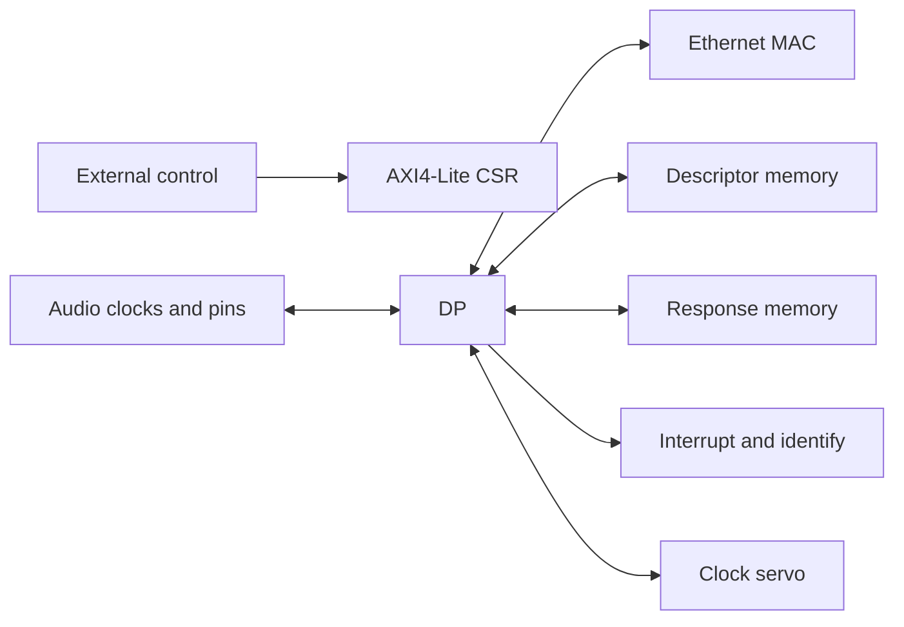
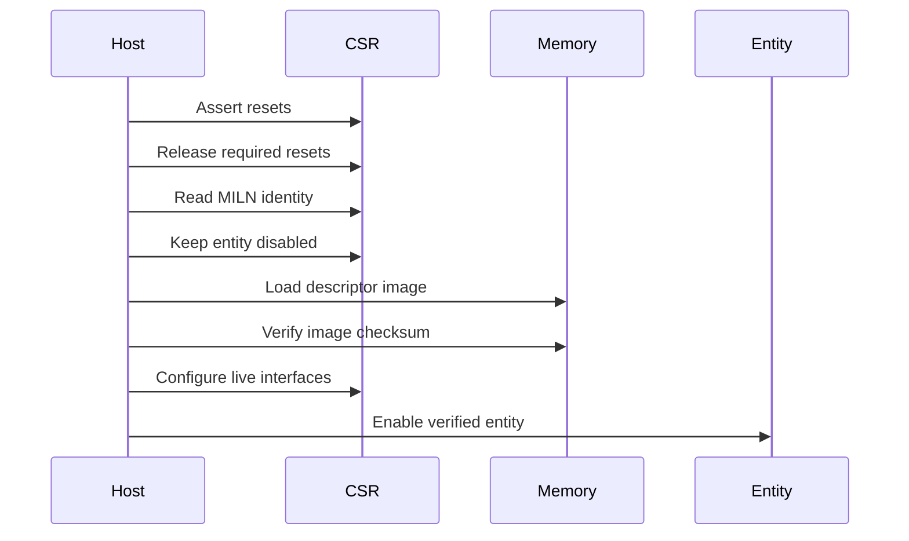

# Datapath integration contract

Use this contract when wiring `milan_datapath`.

- RTL remains the final interface authority.
- The documentation gate classifies every wrapper port.
- Unused features still need explicit safe wiring.

## Contents

- **[See the boundary](#see-the-boundary)** — Locate every interface group.
- **[Check protocol status](#check-protocol-status)** — Read current capability boundaries.
- **[Wire every group](#wire-every-group)** — Apply complete boundary rules.
- **[Handle memory safely](#handle-memory-safely)** — Preserve ordering and errors.
- **[Connect clocks](#connect-clocks)** — Preserve every domain assumption.
- **[Start safely](#start-safely)** — Prove control before protocols.
- **[Include required sources](#include-required-sources)** — Build the complete wrapper.
- **[Verify integration](#verify-integration)** — Exercise wiring and failure paths.

## See the boundary



- The wrapper owns packet and protocol processing.
- The integrator owns clocks, memory, MAC, and board wiring.
- Optional parameters change live interface behavior.
- Every compiled feature needs truthful external wiring.

## Check protocol status

These claims mirror the canonical feature ledger.

<!-- milan-feature-status:start -->
| Feature ID | Status | Canonical value |
|---|---|---|
| `aem.served-command-set` | `implemented` | - |
| `aem.mandatory-missing-set` | `implemented` | - |
| `state.nonvolatile-persistence` | `missing` | - |
| `notifications.change-events` | `implemented` | - |
<!-- milan-feature-status:end -->

Read the [feature ledger](../reference/MILAN_FEATURE_STATUS.md).

## Wire every group

<!-- solution-interface-groups:start -->
| Group | RTL names | Integration duty | Safe inactive start |
|---|---|---|---|
| Clocks and resets | `axis_clk`, `axis_resetn`, `gtx_*`, `clk_audio_i`, `clk_tdm_i` | Drive selected domains and reset sequencing | Drive required clocks; assert resets |
| AXI4-Lite CSR | `s_axi_*` | Map the complete 64 KiB window | Connect fully; never tie handshakes |
| MAC streams | `m_axis_mac_tx_*`, `s_axis_mac_rx_*` | Preserve final-boundary backpressure | Set `s_axis_mac_rx_tvalid=0`; set `m_axis_mac_tx_tready=0` |
| Descriptor memory | `o_desc_mem_*`, `i_desc_mem_*` | Serve the generated entity image | Set `i_desc_mem_req_ready=0`; clear every response input |
| Response memory | `o_resp_mem_*`, `i_resp_mem_*` | Complete every accepted response operation | Set `i_resp_mem_req_ready=0`, `i_resp_mem_wr_ready=0`; clear response and completion inputs |
| Record image memory | `o_nvm_mem_*`, `i_nvm_mem_*` | Complete every accepted saved-state record operation | Set `i_nvm_mem_req_ready=0`, `i_nvm_mem_wr_ready=0`; clear response and completion inputs |
| MAC control and status | `o_mac_*`, `i_mac_*`, link, PHY, Ethernet guards | Report honest capabilities and status | Set `i_mac_speed=2'b10`, `i_link_up=1`, `i_full_duplex=1`; clear events, capabilities, toggles |
| Interrupt | `o_irq_csr` | Route the aggregate CSR interrupt | Leave the output open during smoke tests |
| Identify output | `o_identify` | Route the requested visual indication | Leave the output open during smoke tests |
| MMCM controls | `o_mmcm_*`, `i_mmcm_*`, `i_ps_clk` | Bridge DRP and phase handshakes | Set `i_ps_clk=axis_clk`, DRP inputs zero, `i_mmcm_locked=1`, `i_mmcm_ps_done=0` |
| Audio pins | `i2s_*`, `tdm_*`, `media_lrclk_o` | Match the selected audio geometry | Set `i2s_sdout_i=0`, every `tdm_*_i=0`; leave outputs open |
<!-- solution-interface-groups:end -->

- These rows cover every declared wrapper port.
- The checker rejects unclassified future ports.
- Safe starts support control-path smoke testing.
- They do not provide working media protocols.

## Handle memory safely

| Face | Required behavior | Error behavior |
|---|---|---|
| Descriptor | One request; ordered 64-bit beats; final `rsp_last` | Propagate `i_desc_mem_rsp_err` |
| Response read | One request; ordered beats; real response backpressure | Propagate `i_resp_mem_rsp_err` |
| Response write | One aligned beat; honor every byte strobe | Pulse `wr_done`; propagate `wr_err` |

- Reserve both protocol memory regions.
- Keep their bases aligned and disjoint.
- Load descriptors before enabling the entity.
- Propagate every memory error.
- Never fabricate completion pulses.
- Backpressure response reads correctly.
- Honor byte strobes during response writes.

## Connect clocks

| Signal | Contract |
|---|---|
| `axis_clk` | Runs datapath logic and CSR handling |
| `axis_resetn` | Synchronous, active-low axis reset |
| `gtx_clk` | Runs MAC timestamp logic |
| `gtx_resetn` | Synchronous, active-low GTX reset |
| `clk_audio_i` | Drives selected audio functions |
| `clk_tdm_i` | Drives selected TDM-master geometry |

- Shipping deployment selects 50 MHz for `axis_clk`.
- System clocks retain their configured rates.
- Never infer one clock from another.
- Declare asynchronous clock relationships.
- Use only approved crossing structures.

Read the generated [CDC census](../diagrams/cdc_census.svg).

Read the [CDC timing diagram](../diagrams/wd_cdc_handshake.svg).

## Start safely



- Apply every inactive start from the inventory.
- Release resets only with stable clocks.
- Read `MILN` from offset zero.
- Exercise one writable CSR afterward.
- Load and verify descriptor memory.
- Connect response memory before entity enablement.
- Enable only fully wired protocol features.

## Include required sources

- Use `_MILAN_DATAPATH_SOURCES` unchanged.
- Initialize every pinned submodule.
- Generate both protocol ROM files.
- Pass generated ROM paths absolutely.
- Provide aligned descriptor and response bases.
- Exclude board-specific legacy wrappers.

Read the [submodule reference](../reference/SUBMODULES.md).

Read the [stable register map](../reference/REGISTER_MAP.md).

## Verify integration

- Read and write the CSR window.
- Send one frame each direction.
- Apply downstream backpressure.
- Reset during active traffic.
- Stall every memory request channel.
- Inject every memory error input.
- Confirm timeout recovery.
- Confirm interrupt clearing.

```sh
make -C tb/verilator/milan_dp
python3 sw/litex/test_pp_mem_bridge.py
python3 sw/litex/test_pp_boot_bus_freeze.py
```

- The RTL harness proves wrapper behavior.
- SoC tests prove bridge wiring.
- Run complete repository gates before delivery.

Read the [verification guide](../guides/VERIFICATION_DEVELOPER.md).
