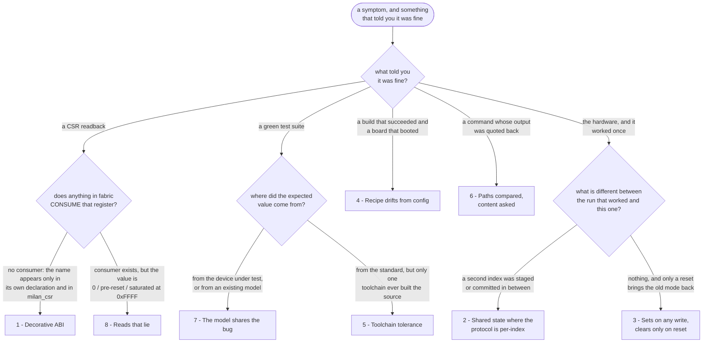

# Recurring defect patterns — how this project's bugs actually look

Every entry here was a **real defect in this repo**, most of them found more than
once. They are collected because the individual fixes are already recorded in
commits and in [`TROUBLESHOOTING.md`](TROUBLESHOOTING.md) — what is *not*
recorded anywhere else is the **shape**, which is what makes the next one
findable.

Read this before an RTL review, before a flash, and before believing a green
test run.

Each pattern gives: what it looked like, **why it survived** (the interesting
part), and a check that would have caught it earlier.

## Contents

- **[Which pattern is this?](#which-pattern-is-this)** — Start here with a symptom. A flowchart that sorts by *what told you it was fine*, plus a one-row-per-pattern table of the tell, the confirming check, and where each one bit us.
- **[1. Decorative ABI — a register the hardware does not consume](#1-decorative-abi--a-register-the-hardware-does-not-consume)** — A CSR holds what you wrote and drives nothing, so software concludes the feature exists. Includes the second half of the fix most people skip: letting software tell "fine" from "not implemented".
- **[2. Shared state where the protocol is per-index](#2-shared-state-where-the-protocol-is-per-index)** — One global staging register behind an indexed ABI. This was the fabric-listener blocker, and it is invisible to any test that provisions a single index.
- **[3. A latch that sets on any write and clears only on reset](#3-a-latch-that-sets-on-any-write-and-clears-only-on-reset)** — A mode you can enter and never leave. The review question that finds it: for every `_r <= 1'b1` in a write path, name what clears it.
- **[4. The build recipe drifts from the declarative config](#4-the-build-recipe-drifts-from-the-declarative-config)** — The build succeeds, the board boots, and the shape is wrong. Twice, including a sweep that would silently rebuild the 8×8 board as 1×1.
- **[5. Toolchain tolerance masking malformed source](#5-toolchain-tolerance-masking-malformed-source)** — Green on your desk, unbuildable everywhere else, because one tool version forgave malformed source that others reject.
- **[6. Comparing paths when the question is about content](#6-comparing-paths-when-the-question-is-about-content)** — A real command, really run, answering a subtly different question than the one asked — and quoted back as if it answered yours.
- **[7. A model that shares the implementation's bug](#7-a-model-that-shares-the-implementations-bug)** — When the testbench's expected values come from the device or from an existing model, the suite agrees with the defect and passes.
- **[8. Reads that lie: snapshots, shadows and saturated counters](#8-reads-that-lie-snapshots-shadows-and-saturated-counters)** — Zero looks idle, a stale shadow looks like configuration, and a saturated maximum looks like a measurement. How to tell a real reading from a plausible one.
- **[The two habits behind most of these](#the-two-habits-behind-most-of-these)** — The short version, if you only remember two things from this page.

## Which pattern is this?

*You arrive with a symptom and with something that told you everything was
fine. The second half is the discriminator — every pattern below is a different
way of being told "fine" by a thing that was not looking.*



| # | Pattern | The tell | The check that confirms it | Where it bit us |
|---|---|---|---|---|
| [1](#1-decorative-abi--a-register-the-hardware-does-not-consume) | Decorative ABI | the register holds what you wrote; the behaviour it names never happens | `scripts/check_tied_inputs.sh` (a gate since 2026-07-26), then `grep -rn "o_<field>" hdl/` for a consumer | `MAC_ADDR` / `MC_HASH` / promisc / allmulti, `PTP_INGRESS_LAT`, `CLS_CTRL[1]`, `is_granted_i`, RMON with `i_mac_events` tied to `0` |
| [2](#2-shared-state-where-the-protocol-is-per-index) | Shared state, per-index protocol | one index works; two indices interleaved do not | stage index *A*, commit index *B*, assert *B* is untouched | the `0x800` window's stream-id staging in `win_commit_glue` — the fabric-listener blocker |
| [3](#3-a-latch-that-sets-on-any-write-and-clears-only-on-reset) | Set-on-write, clear-on-reset latch | a mode can be entered and never left; only a reset restores the old behaviour | for every `_r <= 1'b1` in a write path, name what clears it; test set → observe → clear → observe | `KL_stream_table.sv` `ovr_armed_r` — one stray write detached entry 0's ACMP alias permanently |
| [4](#4-the-build-recipe-drifts-from-the-declarative-config) | Recipe drifts from the declarative config | the build succeeds, the board boots, and the shape is wrong | read the parameter out of the **artifact**: `grep -o '\.N_STREAMS *([0-9]*.d[0-9]*)' <build>/gateware/*.v` | `rx-queues` set globally in `sweep.sh`; `--num-streams` never passed at all, so sweep-and-flash rebuilds 8×8 as 1×1 |
| [5](#5-toolchain-tolerance-masking-malformed-source) | Toolchain tolerance masking malformed source | green on the desk, unbuildable everywhere else | CI on a **different** toolchain than the one on the desk — [`.github/workflows/rtl.yml`](../../.github/workflows/rtl.yml) | a trailing `//` comment after a Verilator waiver code: fine on 5.050, four suites unbuildable on 5.020 |
| [6](#6-comparing-paths-when-the-question-is-about-content) | Paths compared, content asked | the measurement is real, the command ran, and it answered a different question | compare by **basename and function**; `git diff --name-status <branch> origin/main` before anything destructive | a branch audit read "0 `.sv` files absent from trunk"; by basename, 13 modules were exclusive to that lineage |
| [7](#7-a-model-that-shares-the-implementations-bug) | The model shares the implementation's bug | the suite agrees with the defect and passes | derive expected values from the **standard**; mutation-prove every check — revert the fix, confirm it fails, restore | the I2S sign-square defect: a doubled Philips-format delay in the RTL *and* in the testbench chip models |
| [8](#8-reads-that-lie-snapshots-shadows-and-saturated-counters) | Reads that lie | the value is plausible: zero looks idle, a stale shadow looks like configuration, a saturated max looks like a measurement | follow the snapshot discipline (write, poll busy, read) and **read until a value repeats**; liveness is that it *ticks*, not that it is non-zero | `0x800` reads of `0` before the snapshot is fresh; CSR shadows after a MAC reset; latency-tap `max` pinned at `0xFFFF` |

---

## 1. Decorative ABI — a register the hardware does not consume

**Seen as (2026-07-27, the newest instance).** Every talker in the fabric
stamped the AVTP `tu` (timestamp uncertain) bit as a literal `8'h00`, and the
listener-side `TIMESTAMP_UNCERTAIN` counter — which *is* fully wired — read 0
because nothing on the link ever set the bit it counts. This is the pattern's
nastier half: the counter was not decorative, the **producer** was. So a
Milan-validated reference device received 31 M frames from a talker whose PHC
was 216,446 s off the domain, counted 99.4 % of them LATE or EARLY, and its
`TIMESTAMP_UNCERTAIN` stayed at 0 the whole time
([`../findings/REF_LISTENER_TIMESTAMP_SWEEP_0727.md`](../findings/REF_LISTENER_TIMESTAMP_SWEEP_0727.md)).
Closed at VERSION `0x0015` by `KL_ptp_clock_validity` — and note the *other*
half of the fix, the one this section keeps insisting on: `CLKV_STAT` `0x77C`
bit 2 says **"no live lease"**, so software can tell "the clock is fine" from
"nobody has ever told this gateware anything about the clock". A zero
`CLKV_TUCNT` means different things in those two worlds.

**Seen as.** `milan_csr` exported `MAC_ADDR`, `MC_HASH`, promisc and allmulti;
nothing in fabric read them, so non-matching unicast was never dropped in
hardware. Same for `PTP_INGRESS_LAT` / `PTP_EGRESS_LAT`, which stopped at a wire
declaration. Same for `CLS_CTRL[1]`, tied off while the gPTP fast path granted
priority on EtherType alone. Same for `credit_based_shaper.is_granted_i`, a port
with no job. The 2026-07-22 RMON root cause was the same thing one level up:
`i_mac_events` tied to `0` in SoC glue.

**Closed 2026-07-26**, and the way it closed is the reusable part. Reviving the
counters was only half of it (`KL_mac_rmon_events` now synthesises the pulse
vector from what the MAC really exposes). The other half is that four lanes
genuinely have no source at that boundary — and a lane that is *structurally*
zero must not read like a lane that is zero because nothing went wrong. So the
build publishes a per-lane capability mask (`STATS_CAP`, `0x204`) beside the
counters: bit set = real counter, bit clear = no source, do not render this as
"0 errors". **Any decorative-ABI fix should ask the same question — after the
feature works, can software still tell "fine" from "not implemented"?**

**Why it survived.** Software reads the register, gets a plausible value, and
concludes the feature exists. That is *worse than an admitted gap*: an unwired
register is an actively misleading contract. Nothing fails — there is no test
for "this output reaches something", and the CSR's own unit test passes because
the register does hold what was written.

**Catch it with.** For every CSR output port, prove a consumer exists:

```sh
scripts/check_tied_inputs.sh                     # tied-off / undriven GATE
grep -rn "o_<field>" hdl/ | grep -v milan_csr.sv  # who reads it?
```

`check_tied_inputs.sh` became a **gate** on 2026-07-26 (it exits non-zero on a
never-overridden tie). It had been printing four warnings for months, three of
them expected — and a report whose warnings are mostly expected is a report
nobody reads, which is how the fourth survived. Expected ties now need a
justified-tie entry naming the reason *and where the reason is recorded*;
everything else fails the run.

A port that only appears in its own declaration and the CSR file is decorative.
Treat a new CSR field as unfinished until a testbench observes its *effect*, not
its readback.

---

## 2. Shared state where the protocol is per-index

**Seen as.** The `0x800` window's stream-id staging (`milan_datapath.sv`,
`win_commit_glue`) used **one global register pair for every index**, and its
commit guard asked *"is some id staged?"* rather than *"was an id staged for
**this** index?"*. Staging for one listener then committing another armed the
second with the first's stream id. This was the fabric-listener blocker: the
listener reported bound and never matched a frame.

**Why it survived.** The comment above the guard described the intent correctly,
and a single-writer daemon writing one index at a time never exercises the bug.
It only appears when two indices interleave — which is exactly what a real
provisioning sequence does and what a single-stream test never does.

**Catch it with.** Any staging register written through an **indexed** ABI must
carry the index it was staged for, and the commit must compare. In a testbench,
never provision one index in isolation: stage index *A*, then commit index *B*,
and assert *B* is untouched.

---

## 3. A latch that sets on any write and clears only on reset

**Seen as.** `KL_stream_table.sv` set `ovr_armed_r[idx]` on **any** table write
and cleared it **only** at reset. Since entry 0 aliases the bound record only
while unarmed, one stray write detached that alias permanently — there was no
runtime path back to alias mode at all.

**Why it survived.** Every test that armed an override then checked the override
passed. Nobody tested *un*-arming, because the ABI had no word for it.

**Catch it with.** For every `_r <= 1'b1` inside a write path, ask what clears it
besides reset. If the answer is "nothing", either that is a deliberate
write-once fuse (say so in the banner) or it is this bug. Give every mode a
documented inverse and test the round trip: set → observe → clear → observe.

---

## 4. The build recipe drifts from the declarative config

**Seen as.** Twice. `rx-queues` was set globally in `sweep.sh` while the boards
need different values, so the built gateware's DMA window map disagreed with the
shipping `csr.csv`. Then, worse: `sw/litex/sweep.sh` contains **no occurrence of
the string "stream"** — it never passes `--num-streams`, which
`sw/litex/milan_soc.py` defaults to `1`. The shipping 8×8 bitstream was built by
a **hand-edited invocation**; sweep-and-flash would silently rebuild the board as
1×1 and destroy the NxN dataplane.

**Why it survived.** The build succeeds. The board boots. The directory is even
named for the shape it does not have. Nothing anywhere compares *what the config
asked for* with *what the gateware contains* — and the documented flash recipe
is the thing that carries the defect, so following instructions is what breaks
it.

**Catch it with.** Before any flash, read the parameter out of the artifact
rather than trusting the recipe:

```sh
grep -o '\.N_STREAMS *([0-9]*.d[0-9]*)' <build>/gateware/*.v
grep -m1 -oE 'milan_soc\.py.*' <build>/litex.log     # the real invocation
```

Structurally: every shape-defining parameter must ride the generated per-board
fragment alongside `OPTS`/`L2`/`RXQ`, and a gate must fail on
config-vs-gateware mismatch — the pattern `sw/builder/test_builder.py` gates
9/19a already use for the window map.

---

## 5. Toolchain tolerance masking malformed source

**Seen as.** Two files carried
`// verilator lint_off SELRANGE  // <prose>`. Verilator 5.050 strips a trailing
`//` comment from a metacomment; **5.020 does not**, and reads the whole string
as the message code. Result: four suites — including every datapath harness —
were **unbuildable** on the Verilator that Debian and Ubuntu ship, while every
local run stayed green.

**Why it survived.** One developer, one distro, one toolchain version. The source
was malformed the whole time; the newer tool was simply forgiving. Nothing in
the repo ever compiled it any other way.

**Catch it with.** CI on a *different* toolchain than the one on the desk —
[`.github/workflows/rtl.yml`](../../.github/workflows/rtl.yml) exists for exactly
this and found it on its first run. Keep waiver codes as the **last token** on
their line, and put the reason on the line above.

---

## 6. Comparing paths when the question is about content

**Seen as.** A branch audit concluded "0 `.sv` files are absent from trunk" and
nearly licensed deleting 34 branches. The check compared **file paths** — but the
module tree had been reorganised, so files that genuinely existed nowhere else
hid among the renames. By basename, 13 modules were exclusive to that lineage,
one of which serves an open roadmap item.

**Why it survived.** The measurement was real, the command ran, the output was
quoted. It answered a different question than the one being asked.

**Catch it with.** When a tree has been reorganised, compare by **basename and
function**, never by path. Before any destructive step, list what would be lost
and check each item against the target by content:

```sh
git diff --name-status <branch> origin/main | awk '$1=="D"'
```

Related: `git branch --contains` is meaningless across a history rewrite — it
reports "not on main" for work that *is* on main under a new hash.

---

## 7. A model that shares the implementation's bug

**Seen as.** An I2S sign-square defect came from a doubled Philips-format delay —
and the testbench chip models were doubled the same way, so the suite agreed with
the bug and passed.

**Why it survived.** The model was written by reading the implementation instead
of the standard. A test that encodes the same misunderstanding proves only
self-consistency.

**Catch it with.** Derive expected values from the **specification**, not from the
device under test or an existing model. And **mutation-prove** every new check:
revert the fix, confirm the check fails, restore. A check that never fails is
decoration — the same disease as pattern 1, in test form.

**Corollary — characterisation tests.** A test written to pin *current, known
wrong* behaviour is valuable, but it is a landmine if it is not labelled: the
person who fixes the RTL sees a passing suite go red and may "fix" the test. Say
in the test body that it characterises a defect, and flip it to assert the fix in
the same commit that fixes it (see the `TRAP-1` section in
`tb/verilator/milan_dp`).

---

## 8. Reads that lie: snapshots, shadows and saturated counters

**Seen as.** `0x800` window reads return literal `0` until the snapshot is fresh.
CSR shadow registers keep reporting the pre-reset value after a MAC reset. Latency
tap `max` fields and sample counters saturate at `0xFFFF` and stay there, so a
number read after a long fault period describes the fault, not the system.

**Why it survived.** Every one of these returns a *plausible* value. Zero looks
like idle; a stale shadow looks like configuration; a saturated max looks like a
measurement.

**Catch it with.** Follow the documented snapshot discipline (write, poll busy,
read) and **read until a value repeats**. The truth test for "is this counter
live" is that it *ticks*, not that it is non-zero. When quoting measurements,
quote `min`/`last` and say plainly when `max` is contaminated, rather than
quoting a number you cannot defend.

---

## The two habits behind most of these

1. **Verify the artifact, not the intention.** Patterns 1, 4 and 6 are all the
   same mistake: trusting that a declaration, a recipe or a command *means* what
   it says. Read what was actually produced.
2. **Green is a claim, not a proof.** Patterns 5 and 7 passed every test that
   existed. Ask what a test would have to do to fail, and if there is no such
   thing, the test is not evidence.

Both reduce to the standing rule: **measure, do not assume — and measure the
thing you are actually claiming.**
