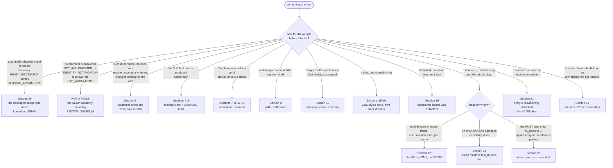

# Troubleshooting  -  every problem hit bringing up the full-FPGA solution, and its fix

This is the field log of every real problem encountered building and simulating the
fully-FPGA Milan softcore solution, with the **symptom**, the **cause**, and the
**fix**. It is meant to save the next developer the debugging time.

Grouped as:

- toolchain/environment ([Sections 1–2](#section-1-import-litex-resolves-to-a-namespace-package)),
- LiteX/SoC build ([Sections 3–6](#section-3-identifier-string-must-not-contain-commas)),
- Verilator simulation ([Sections 7–8](#section-7-verilator-cannot-find-include-file)),
- shell/process ([Section 9](#section-9-pkill--f-self-matches-the-running-shell)),
- synthesis ([Section 10](#section-10-yosys--sv2v-cannot-find-axis_mux_rr_2in_1out)),
- RTL/testbench ([Sections 11–14](#section-11-milan_dp-axi-write-bfm-did-not-commit-writes)),
- P&R timing closure ([Sections 15–16](#section-15---full-fails-100-mhz-timing-in-the-cbs-credit-shaper):
  CBS pipelining + running the dense datapath in its own CDC clock domain for a clean 100 MHz),
- on-hardware NIC bring-up ([Section 17](#section-17-on-hardware-nic-bring-up-----dma-works-but-no-packet-on-the-wire-its-gmii-not-rgmii):
  the AX7101 PHY is GMII, not RGMII; [Section 18](#section-18-tx-frames-egress-truncated--not-at-all-----axis-tkeep-vs-liteeth-last_be):
  AXIS `tkeep` is not LiteEth's `last_be`),
- boot / flash ([Section 19](#section-19-kernel-hangs-after-opensbi-no-linux-version-----a-stale-litex_term-served-the-wrong-boot-manifest):
  the kernel that was never uploaded),
- host plane vs device tree ([Section 20](#section-20-host-plane-dead-csr-readbacks-perfect-----a-stale-device-tree-maps-every-dma-window-onto-the-wrong-registers):
  `reg` windows are mapped by index, so a stale dtb writes DMA into the wrong CSRs),
- and streaming, listener and talker ([Section 21](#section-21-acmp-says-success-the-listener-declares-itself-bound---and-not-one-frame-is-accepted-root-caused-and-fixed-version-0x000f-mechanism-confirmed-on-silicon-2026-07-26):
  a bound listener that accepts nothing; [Section 22](#section-22-arming-a-second-talker-takes-the-peer-board-off-the-network-and-the-arm-that-never-happened):
  the bandwidth gate *is* the pacer, and the arm that never happened),
- and the control-plane substitution ([Section 24](#section-24-the-counter-reads-0-and-nothing-is-wrong---structural-zeros-after-the-control-plane-substitution):
  a whole class of CSR words whose source is deleted; [Section 25](#section-25-a_txarb_diag-0x784-decodes-to-the-wrong-mux---the-lanes-were-renumbered):
  the TX-arbiter lane renumbering; [Section 26](#section-26-the-controller-finds-the-entity-and-enumerates-nothing---the-descriptor-image-was-never-loaded-into-dram):
  the entity model now lives in DRAM and somebody has to put it there).

Companion: [`SIMULATION.md`](../testing/SIMULATION.md) (how the sim works) and
[`FULL_FPGA_SOLUTION.md`](../overview/FULL_FPGA_SOLUTION.md) (the architecture).

> **Before you debug anything on the control plane (2026-08-13).** This
> repository's IEEE 1722.1 / SRP engines were deleted; the
> `protocol-processor` submodule wrapped by
> [`hdl/milan/KL_pp_shadow.sv`](../../hdl/milan/KL_pp_shadow.sv) is the control
> plane. The device discovers over ADP, connects over ACMP and reserves over
> SRP, and on AECP it serves the inventory recorded in the current Milan audit.
> Unsupported commands receive a conformant fallback response. Three things follow that
> decide whether you have a fault at all:
>
> * **Enumeration requires the descriptor image in DRAM.** The entity model
>   lives in main memory at a **compile-time** base with no base register, and
>   software must write it there. The builder generates the flat image,
>   manifest, and map, and the tracked board flow runs `aemi-load` before entity
>   enable. If a custom integration skips that step, every `READ_DESCRIPTOR`
>   answers `BAD_ARGUMENTS`; the
>   argument check (`configuration_index` against `configurations_count`) runs
>   *before* the locate, and an invalid image reports a count of zero, so no
>   configuration index passes. A clean refusal, never a hang. That status is
>   also the discriminator: `BAD_ARGUMENTS` everywhere means the image was never
>   loaded or is corrupt, while `NO_SUCH_DESCRIPTOR` means the image **is**
>   loaded and that one descriptor is genuinely absent from the model. Expect
>   the former when image provisioning fails and read
>   [Section 26](#section-26-the-controller-finds-the-entity-and-enumerates-nothing---the-descriptor-image-was-never-loaded-into-dram)
>   before concluding the control plane is broken.
> * **`NOT_IMPLEMENTED` is an answer, not a fault** — and so is `BAD_ARGUMENTS`
>   to an `IDENTIFY_NOTIFICATION` sent as a command. "GET_COUNTERS came back
>   NOT_IMPLEMENTED", "the name will not set", "IDENTIFY does nothing", "the
>   binding did not survive the power cycle": that is the stated capability
>   boundary, written up in
>   [the current Milan audit](../testing/MILAN_V12_AUDIT_2026-08-16.md), not
>   something to diagnose.
> * **Silence has exactly two legal causes**, both by design: the command's
>   `target_entity_id` is not ours, or an AECP *response* was sent as input.
>   Those are freed and counted with no reply. Any other silence on AECP is
>   worth investigating.
>
> Sections 24, 25 and 26 below are the three field traps the substitution
> introduced.

## Contents

- **[Start here: which section is your problem in?](#start-here-which-section-is-your-problem-in)** -- The router. One question -- how far did you get before it broke? -- narrows 26 field reports to one or two, with a sub-branch for the three different ways the wire goes dead. Ends on the observation that Sections 20, 21 and 22 are all the same lesson: a readback that agreed with you.
- **[Section index](#section-index)** -- The searchable table: the exact error string or symptom you would grep for, against the one-line root cause. Scan this before reading any section body.
- **[Section 1: import litex resolves to a namespace package](#section-1-import-litex-resolves-to-a-namespace-package)** -- `litex.__file__` is `None` because the repo-root directory named `litex/` shadows the installed package. Fix is a `cd`; the one-line check that confirms it is here.
- **[Section 2: NaxRiscv generation needs JAVA_HOME](#section-2-naxriscv-generation-needs-java_home)** -- The build dies in "netlist generation" because the core is generated from SpinalHDL and wants a JDK. Exact packages to install, and the note that first generation needs network.
- **[Section 3: Identifier string must not contain commas](#section-3-identifier-string-must-not-contain-commas)** -- `SoCCore(ident=…)` becomes a hardware string ROM, which forbids commas. Thirty-second fix.
- **[Section 4: SoCError at _finalize_cpu_reset_address (no ROM)](#section-4-socerror-at-_finalize_cpu_reset_address-no-rom)** -- A bare `SoCError` with no message: the CPU reset vector points at an integrated ROM nobody added. Tell is that the bus slave list has no `rom`.
- **[Section 5: NaxRiscv has no attribute no_netlist_cache](#section-5-naxriscv-has-no-attribute-no_netlist_cache)** -- Hand-setting a couple of CPU class attributes leaves the rest unset. The fix is the general pattern for LiteX CPUs: drive the core's own `args_fill`/`args_read` pipeline instead of assigning attributes.
- **[Section 6: Region not in IO region, it must be cached](#section-6-region-not-in-io-region-it-must-be-cached)** -- Why the CSR window is at `0x9000_0000` and not the Zynq's `0x43C0_0000`: uncached MMIO must sit above `0x8000_0000` on this address map. Register offsets are unchanged -- only the base is host-specific, and the device tree must agree.
- **[Section 7: Verilator cannot find include file](#section-7-verilator-cannot-find-include-file)** -- A bare `` `include`` that Vivado resolves and Verilator does not, because Vivado searches the directories of added sources and Verilator only searches `+incdir`. The board build kept working, which is what hid it.
- **[Section 8: The interactive and non-interactive sim both block](#section-8-the-interactive-and-non-interactive-sim-both-block)** -- Three tangled causes behind a "flaky" sim driver: LiteX couples build and run, `--non-interactive` still runs, and the `OSError` was just the SIGKILL. Fix is to build once and pipe commands into the cached `Vsim` binary, with `BIOS_NO_DELAYS` so the prompt appears before the command does.
- **[Section 9: pkill -f self-matches the running shell](#section-9-pkill--f-self-matches-the-running-shell)** -- Cleanup exits 143/144 and takes your shell with it, because `pkill -f` matches its own parent's argv. Use `pkill -x <binary>`.
- **[Section 10: Yosys / sv2v cannot find axis_mux_rr_2in_1out](#section-10-yosys--sv2v-cannot-find-axis_mux_rr_2in_1out)** -- Verilator auto-resolves undefined modules from the source directories; sv2v and Yosys compile only what you list. The standing rule that comes out of it: list every source explicitly so the flows agree.
- **[Section 11: milan_dp AXI-write BFM did not commit writes](#section-11-milan_dp-axi-write-bfm-did-not-commit-writes)** -- A CSR reads back `0` while reset values read fine, because the BFM sampled `awready`/`wready` after the edge and `milan_csr` takes AW and W together. Carries the transferable heuristic: when a write "silently does nothing", check the clock phase first.
- **[Section 12: Benign Verilator warnings (PINMISSING and SELRANGE)](#section-12-benign-verilator-warnings-pinmissing-and-selrange)** -- The two warnings that are noise here and why -- optional interface pins, and out-of-range selects inside provably dead branches -- plus the `VFLAGS` line that silences exactly those two.
- **[Section 13: traffic_queues silently dropped a frame](#section-13-traffic_queues-silently-dropped-a-frame)** -- Only the arbiter's `tvalid` was grant-gated, so the prefetching mux drained a FIFO it had no grant to forward from. The rule: gate **both** sides -- `tvalid` and the FIFO's `tready`.
- **[Section 14: datapath harness "≥2 queues" assertion failed](#section-14-datapath-harness-2-queues-assertion-failed)** -- Not a bug: the classifier's *reset* PCP→queue map is not an identity, so a harness that wants distinct queues has to program one. Gives the exact identity constants, and the caveat that the identity only holds for `p < 5`.
- **[Section 15: --full fails 100 MHz timing in the CBS credit-shaper](#section-15---full-fails-100-mhz-timing-in-the-cbs-credit-shaper)** -- `WNS = -19.25 ns` with every worst path in the credit shaper: a wide constant-divide and its multiply sharing one clock period, 36 logic levels. Read past the original multicycle fix (superseded, along with both of its `dont_touch`/XDC gotchas) to the sequential slope engine that deleted ~9.3 k LUTs of divide cone -- and to the area-report trap it exposed, where the cones were attributed to `milan_csr`.
- **[Section 16: clean 100 MHz  -  run the dense datapath in its own clock domain](#section-16-clean-100-mhz-----run-the-dense-datapath-in-its-own-clock-domain)** -- The residual `WNS ≈ -1 to -2 ns` is routing congestion, not logic depth -- a CSR read-mux pipeline made it *worse*. The structural answer: `--milan-clk-freq 50e6` puts the datapath in its own domain behind an AXI-Lite CDC, leaving `sys` for CPU and DDR3. Also records the DDR3 ceiling and why the PLL rejects intermediate frequencies.
- **[Section 17: on-hardware NIC bring-up  -  DMA works, but no packet on the wire (it's GMII, not RGMII)](#section-17-on-hardware-nic-bring-up-----dma-works-but-no-packet-on-the-wire-its-gmii-not-rgmii)** -- 20,000 frames in, `preamble_errors` +20,000, `crc` +0, zero captured. **Exactly one error per frame is the tell**: a 100 %-deterministic data error is structural, so stop tuning timing. Four IDELAY/clock-inversion rebuilds were burned before the real answer -- the board's PHY is strapped for 8-bit SDR GMII, which the vendor's own working example says plainly.
- **[Section 18: TX frames egress truncated / not at all  -  AXIS tkeep vs LiteEth last_be](#section-18-tx-frames-egress-truncated--not-at-all-----axis-tkeep-vs-liteeth-last_be)** -- `tkeep` is a contiguous mask, LiteEth's `last_be` is a one-hot pointer to the last valid byte, and wiring one onto the other truncates an 8-byte word to one byte. Both conversion expressions are here. Note the coverage gap it exposes: the datapath harness checks `m_tdata` but not `m_tkeep`, so this class of bug in the LiteX glue is caught by no RTL harness.
- **[Section 19: kernel hangs after OpenSBI (no Linux version)  -  a STALE litex_term served the wrong boot manifest](#section-19-kernel-hangs-after-opensbi-no-linux-version-----a-stale-litex_term-served-the-wrong-boot-manifest)** -- Hours spent on the FPU, the kernel config, and timing -- and the kernel had simply never been uploaded. The diagnostic is to read the *upload* lines rather than the hang point and notice `Image` missing. `tmux send-keys C-c` does not free a serial port; kill the PID.
- **[Section 20: host plane dead, CSR readbacks perfect  -  a stale device tree maps every DMA window onto the wrong registers](#section-20-host-plane-dead-csr-readbacks-perfect-----a-stale-device-tree-maps-every-dma-window-onto-the-wrong-registers)** -- The driver maps `reg` windows **by index**, so an obsolete dtb sent every DMA write to a wrong-but-writable CSR that stored it happily. Four false leads costed, then the experiment that cracked it in one shot: ping out while capturing at the tap. The twist is that flashing a corrected dtb fixes nothing -- this boot path only reads the FDT embedded in the OpenSBI image, which is why `check_dtb_csr.py` now validates both.
- **[Section 21: ACMP says SUCCESS, the listener declares itself bound - and not one frame is accepted (ROOT-CAUSED and FIXED, VERSION 0x000F; mechanism confirmed on silicon 2026-07-26)](#section-21-acmp-says-success-the-listener-declares-itself-bound---and-not-one-frame-is-accepted-root-caused-and-fixed-version-0x000f-mechanism-confirmed-on-silicon-2026-07-26)** -- The fabric-listener blocker, start to finish. A shared sid staging register plus a `ovr_armed_r` latch that cleared only on reset meant one stray `CTRL` write pinned entry 0 disabled forever -- so every later `CONNECT_RX` bound cleanly and changed nothing. Read the top block for the fix and the **four-`devmem` workaround** for pre-`0x000F` gateware, plus the measured RX latency chain (~105–126 µs, ring-fill dominated). The refuted-suspect list below it is kept as method, not guidance, and the `0x800`-window trap at the end -- a snapshot read returns literal `0` until the re-poll lands -- briefly looked like the root cause itself.
- **[Section 22: arming a second talker takes the peer board off the network (and the arm that never happened)](#section-22-arming-a-second-talker-takes-the-peer-board-off-the-network-and-the-arm-that-never-happened)** -- With the lwSRP engine off, an armed `t > 0` context sends ~56,000 frames/s and drowns the peer, because **the bandwidth gate is the pacer** -- there is no free-running timer behind it. The companion trap is worse: with the engine off, `TCTX` word-0 writes are dropped while the bus write completes, so "disable → arm → enable" produces an unarmed context whose readback agrees with you. Take arm truth from the `0x804` snapshot instead.
- **[Section 23: ADD_AUDIO_MAPPINGS answers BAD_ARGUMENTS - which of the four rules did the record break?](#section-23-add_audio_mappings-answers-bad_arguments---which-of-the-four-rules-did-the-record-break)** -- The live writer's validity rules, their physical reasons, the practical 8x8 cluster-offset map, and the two probe-tool caveats that cost an hour. Accepted commands commit atomically; persistence remains open under issue #70.
- **[Section 24: "the counter reads 0" and nothing is wrong - structural zeros after the control-plane substitution](#section-24-the-counter-reads-0-and-nothing-is-wrong---structural-zeros-after-the-control-plane-substitution)** -- The first thing to check before debugging a dead-looking register: a whole class of CSR words now reads a structural zero because the RTL behind it was deleted, and another class reads back what software wrote while reaching nothing. How to tell those two from a real fault, and where the per-word verdicts live.
- **[Section 25: A_TXARB_DIAG 0x784 decodes to the wrong mux - the lanes were renumbered](#section-25-a_txarb_diag-0x784-decodes-to-the-wrong-mux---the-lanes-were-renumbered)** -- The TX arbiter cascade collapsed from eight muxes to four, so every old decode of `0x784` now reads a different mux than it names. Old and new orders side by side.
- **[Section 26: the controller finds the entity and enumerates nothing - the descriptor image was never loaded into DRAM](#section-26-the-controller-finds-the-entity-and-enumerates-nothing---the-descriptor-image-was-never-loaded-into-dram)** -- A provisioning failure: discovery and ACMP work, but every `READ_DESCRIPTOR` answers `BAD_ARGUMENTS` immediately because the generated image was not loaded or failed verification. The section explains the status split, derived base, `aemi-load` checks, watchdog, and late-load recovery.

## Start here: which section is your problem in?

*One question — how far did you get before it broke? — routes 26 field reports
down to one or two.*



Several of these branches are the same lesson in different clothes: **Sections
20, 21, 22 and now 24 all begin with a readback that agreed with you.** If your
evidence is a register echo rather than an engine ticking, read
[`RECURRING_DEFECT_PATTERNS.md`](RECURRING_DEFECT_PATTERNS.md) before spending a
build cycle — and note that Section 24 is the case where the echo agreeing with
you is the *documented, correct* behaviour of the word, which is a harder thing
to argue with than a bug.

## Section index

| § | The symptom you would search for | Root cause |
|---|---|---|
| [1](#section-1-import-litex-resolves-to-a-namespace-package) | `cannot import name 'get_data_mod' from 'litex'`, `litex.__file__` is `None` | the working directory is the litex-repos parent, whose `litex/` **subdirectory** shadows the installed package |
| [2](#section-2-naxriscv-generation-needs-java_home) | the build dies in "NaxRiscv netlist generation" / `sbt` will not launch | the core is generated from SpinalHDL (Scala) and needs a JDK on `PATH`/`JAVA_HOME` |
| [3](#section-3-identifier-string-must-not-contain-commas) | `ValueError: Identifier string must not contain commas` | `SoCCore(ident=…)` writes a hardware string ROM that forbids commas |
| [4](#section-4-socerror-at-_finalize_cpu_reset_address-no-rom) | bare `SoCError` from `_finalize_cpu_reset_address`; no `rom` bus slave | the CPU reset vector points at an integrated ROM that was never added |
| [5](#section-5-naxriscv-has-no-attribute-no_netlist_cache) | `AttributeError: … no attribute 'no_netlist_cache'` | NaxRiscv keeps its config in class attributes filled by its **own** argparse flow, which was bypassed |
| [6](#section-6-region-not-in-io-region-it-must-be-cached) | `milan_csr Region not in IO region, it must be cached` | uncached MMIO must live inside `0x8000_0000`–`0xFFFF_FFFF`; the CSR window was at `0x43C0_0000` |
| [7](#section-7-verilator-cannot-find-include-file) | `Cannot find include file` although the file is an added source | Vivado searches the directories of added sources; Verilator only searches `-I`/`+incdir` |
| [8](#section-8-the-interactive-and-non-interactive-sim-both-block) | the sim driver is flaky; `--non-interactive` never returns | LiteX **couples build and run**, so the piped command lands during the multi-minute compile |
| [9](#section-9-pkill--f-self-matches-the-running-shell) | cleanup exits `143`/`144` and the shell dies mid-command | `pkill -f` matches full command lines — including its own parent shell's argv |
| [10](#section-10-yosys--sv2v-cannot-find-axis_mux_rr_2in_1out) | Yosys: module "is not part of the design"; Verilator built the same top | Verilator auto-resolves undefined modules from the source directories; sv2v/Yosys compile only what you list |
| [11](#section-11-milan_dp-axi-write-bfm-did-not-commit-writes) | a CSR written over AXI-Lite reads back `0`, while reset values read fine | the BFM sampled `awready`/`wready` **after** the edge; `milan_csr` is single-outstanding and takes AW+W together |
| [12](#section-12-benign-verilator-warnings-pinmissing-and-selrange) | `%Warning-PINMISSING` / `%Warning-SELRANGE` during a harness build | optional interface pins left unconnected, and out-of-range selects inside provably dead ternary branches — noise, not defects |
| [13](#section-13-traffic_queues-silently-dropped-a-frame) | a frame routed into a queue simply disappears | only the arbiter's `tvalid` was grant-gated; the prefetching mux drained the FIFO it had no grant to forward |
| [14](#section-14-datapath-harness-2-queues-assertion-failed) | the "two or more distinct queues" check fails — everything clusters into one | the classifier's **reset** PCP→TC→queue map is not an identity; the harness must program one |
| [15](#section-15---full-fails-100-mhz-timing-in-the-cbs-credit-shaper) | `--full` routes but misses timing badly, `WNS = -19.25 ns`, every worst path in the CBS | a wide constant-divide **and** its multiply in one clock period; now a sequential slope engine (~9.3K LUTs of divide cone deleted) |
| [16](#section-16-clean-100-mhz-----run-the-dense-datapath-in-its-own-clock-domain) | still `WNS ≈ -1` to `-2 ns` after the CBS is fixed | routing **congestion**, not logic depth, in a datapath too dense to route at 100 MHz — give it its own slower clock across an AXI-Lite CDC |
| [17](#section-17-on-hardware-nic-bring-up-----dma-works-but-no-packet-on-the-wire-its-gmii-not-rgmii) | link is 1000/Full, the internal path is proven on silicon, and **no frame crosses either way** | the board's PHY is strapped for **GMII** (8-bit SDR), not RGMII — exactly one preamble error per frame is the tell |
| [18](#section-18-tx-frames-egress-truncated--not-at-all-----axis-tkeep-vs-liteeth-last_be) | TX egresses one byte of an 8-byte word, or a full frame never egresses | AXIS `tkeep` (a contiguous mask) was wired straight onto LiteEth `last_be` (a one-hot last-byte pointer) |
| [19](#section-19-kernel-hangs-after-opensbi-no-linux-version-----a-stale-litex_term-served-the-wrong-boot-manifest) | OpenSBI's full banner, then silence — no `Linux version`, no panic | a stale `litex_term` still held the port and served the kernel-from-QSPI manifest, so `Image` was never uploaded (and the QSPI had been erased) |
| [20](#section-20-host-plane-dead-csr-readbacks-perfect-----a-stale-device-tree-maps-every-dma-window-onto-the-wrong-registers) | `rx_packets=0`, `ptp4l` times out, every driver readback is perfect, fabric streaming is fine | a stale device tree with an obsolete `reg` list; the driver maps windows **by index**, so every DMA register write landed on a wrong-but-writable CSR |
| [21](#section-21-acmp-says-success-the-listener-declares-itself-bound---and-not-one-frame-is-accepted-root-caused-and-fixed-version-0x000f-mechanism-confirmed-on-silicon-2026-07-26) | ACMP returns SUCCESS, the listener reports bound, and `AVTPRX_FRX` stays `0` | a shared staging register plus a set-on-any-write `ovr_armed_r` detached entry 0 from the ACMP bound record, with no runtime path back (fixed, `VERSION 0x000F`) |
| [22](#section-22-arming-a-second-talker-takes-the-peer-board-off-the-network-and-the-arm-that-never-happened) | arming a `t > 0` talker takes the peer board off the network; and an arm that a readback confirms but that never happened | class-A pacing comes from the SRP **reservation gate**, not a timer; and with the engine off, `TCTX` word-0 writes are dropped while the bus write completes |
| [24](#section-24-the-counter-reads-0-and-nothing-is-wrong---structural-zeros-after-the-control-plane-substitution) | a diagnostic counter reads `0` forever; a control register accepts a write, reads it back, and changes nothing on the wire | its source RTL was **deleted** on 2026-08-13 — the word is a **structural zero** or a **write-only scratch**, not a measurement and not a control |
| [25](#section-25-a_txarb_diag-0x784-decodes-to-the-wrong-mux---the-lanes-were-renumbered) | `A_TXARB_DIAG 0x784` reports activity on the "wrong" lane, or bits 7:4 are always 0 | the TX arbiter cascade collapsed from **eight muxes to four** and the lanes were renumbered; an old decoder reads a different mux than it names |
| [26](#section-26-the-controller-finds-the-entity-and-enumerates-nothing---the-descriptor-image-was-never-loaded-into-dram) | the controller discovers the entity, ACMP works, and **every `READ_DESCRIPTOR` answers `BAD_ARGUMENTS`** | the generated image was omitted, failed pairing or verification, or was written to the wrong derived base; an invalid image reports zero configurations and the store refuses cleanly rather than hanging |

---

## Section 1: import litex resolves to a namespace package

**Symptom.** All CPU imports fail with
`ImportError: cannot import name 'get_data_mod' from 'litex'`, and
`litex.__file__` is `None`.

**Cause.** The LiteX repos are installed *editable* into the venv, but they live under
`~/litex-milan/`, and that directory *also* contains a subdir literally named
`litex/`. When Python is started with `~/litex-milan` as the working directory (or on
`sys.path`), `import litex` resolves to that **repo-root directory**  -  a namespace
package with no `__init__.py`  -  instead of the editable-installed inner package that
defines `get_data_mod`. Hence `__file__ is None` and the symbol is missing.

**Fix.** Run every build/sim command from a directory that is **not** the litex-repos
parent  -  e.g. `~/litex-milan/work/`:
```sh
cd ~/litex-milan/work         # anywhere except ~/litex-milan itself
python .../milan_soc.py ...
```
Verify: `python -c "import litex; print(litex.__file__)"` must print a real path
ending `…/litex/litex/__init__.py`, not `None`.

## Section 2: NaxRiscv generation needs JAVA_HOME

**Symptom.** The SoC build dies during "NaxRiscv netlist generation", or `sbt` fails
to launch, or the AMD/Xilinx installer's bundled JRE is reported missing.

**Cause.** The NaxRiscv core is generated on demand from **SpinalHDL (Scala)**: LiteX
clones `SpinalHDL/NaxRiscv` and runs `sbt "runMain naxriscv.platform.litex.NaxGen …"`.
That needs a JDK on `PATH`/`JAVA_HOME`. It is not installed by default.

**Fix.** Install JDK 17 + sbt and export `JAVA_HOME`:
```sh
sudo pacman -S --needed jdk17-openjdk sbt
export JAVA_HOME=/usr/lib/jvm/java-17-openjdk
export PATH="$JAVA_HOME/bin:$PATH"
```
First generation also downloads Scala/SpinalHDL (network needed once); subsequent
builds reuse the cached netlist (`NaxRiscvLitex_<hash>.v`).

## Section 3: Identifier string must not contain commas

**Symptom.** `ValueError: Identifier string must not contain commas` from
`litex/soc/cores/identifier.py` during SoC construction.

**Cause.** `SoCCore(ident=…)` writes the identifier into a hardware string ROM and
forbids commas. The first draft used `ident=f"Milan TSN SoC (NaxRiscv RV{xlen}, …)"`.

**Fix.** Remove commas from the ident string:
```python
ident=f"Milan TSN SoC - NaxRiscv RV{xlen} {cpu_count}-core"
```

## Section 4: SoCError at _finalize_cpu_reset_address (no ROM)

**Symptom.** The build reaches `builder.build(...)` then raises a bare
`litex.soc.integration.soc.SoCError` from `_finalize_cpu_reset_address`. The bus
slave list shows only `sram`, `main_ram`, `csr`  -  no `rom`.

**Cause.** The CPU's reset vector points at the integrated ROM, but no integrated ROM
was added, so LiteX cannot place the reset address.

**Fix.** Give the SoC an integrated ROM (the BIOS lives there and holds the reset
vector):
```python
kwargs.setdefault("integrated_rom_size", 0x20000)
```

## Section 5: NaxRiscv has no attribute no_netlist_cache

**Symptom.** `AttributeError: type object 'NaxRiscv' has no attribute
'no_netlist_cache'` in `naxriscv/core.py:add_sources`.

**Cause.** NaxRiscv keeps its configuration in **class attributes** that are normally
populated by its own argparse flow (`args_fill()` + `args_read(args)`). The first
draft hand-set only `xlen`/`data_width`, so other required attributes
(`no_netlist_cache`, `update_repo`, `with_fpu`, `l2_bytes`, …) were never set.

**Fix.** Drive the CPU's own arg pipeline  -  fill a parser with its args, take the
defaults, override just xlen/cpu-count, then `args_read`:
```python
_p = argparse.ArgumentParser(); NaxRiscv.args_fill(_p)
_na, _ = _p.parse_known_args([]); _na.xlen = xlen; _na.cpu_count = cpu_count
NaxRiscv.args_read(_na)
```

## Section 6: Region not in IO region, it must be cached

**Symptom.**
`ERROR:SoCBusHandler:milan_csr Region not in IO region, it must be cached: Origin:
0x43c00000 … Cached: False` and the build aborts with `SoCError`.

**Cause.** On NaxRiscv the address map marks `0x8000_0000–0xFFFF_FFFF` as the uncached
**IO region**; any uncached MMIO slave must live there. The Zynq build put `milan_csr`
at `0x43C0_0000`, which is below the IO region, so it is rejected as uncached.

**Fix.** Map the CSR window inside the IO region  -  the design uses **`0x9000_0000`**.
The register *offsets* are unchanged; only the base is host-specific (documented in
[`REGISTER_MAP.md`](../reference/REGISTER_MAP.md)). The device-tree `reg` base must match the host.

## Section 7: Verilator cannot find include file

**Symptom.** The softcore sim build fails with
`%Error: … Cannot find include file: 'ethernet_packet_pkg.sv'` (and `ethernet_events.svh`),
even though those files are added as sources.

**Cause.** ``include "ethernet_packet_pkg.sv"`` is a bare include with no path.
**Vivado auto-searches the directories of all added source files; Verilator does
not**  -  it only searches `-I`/`+incdir` paths. The RTL sources were added, but their
directories were never added as include paths, so the sim (Verilator backend)
couldn't resolve the includes. (The board Vivado build worked, masking the problem.)

**Fix.** Add the include directories explicitly. In the shared datapath helper:
```python
for inc in ("hdl/common", "hdl/ieee8021q/ts", "hdl/ieee8021as/ptp_timestamp",
            "hdl/ieee17221/adp", "hdl/common/csr", "hdl/common/eth_event_counter"):
    platform.add_verilog_include_path(os.path.join(base, inc))
```
The RTL harness Makefiles do the same with `+incdir+<dir>`.

## Section 8: The interactive and non-interactive sim both block

**Symptom.** Driving the softcore sim to run a `mem_read` was flaky: a pty driver got
`OSError: Subprocess failed` from `_run_sim`; fixed sleep-then-command timing sent the
command *during* the multi-minute Verilator compile; and `milan_sim.py
--non-interactive` never returned so a chained piped run never started.

**Cause (three-part).**
1. LiteX **couples build and run**  -  `builder.build(sim_config, interactive=…)` builds
   the `Vsim` binary *and* runs it in the same call.
2. `--non-interactive` still **runs** the sim; with no stdin it just sits at the
   `litex>` prompt forever, so any command chained after it never executes.
3. The `OSError` from `_run_sim` was simply the sim exiting non-zero because the
   driver **SIGKILL'd** it  -  expected, not the real failure. The real failure was the
   command being consumed before the prompt existed (compile still running).

**Fix.** Separate build from run: build once, then run the **cached `Vsim` binary
directly** with the command on a plain stdin pipe (`serial2console` bridges the sim
UART to stdio). Verilator caches the compile, so the direct run boots in seconds:
```sh
# build once (Ctrl-C at the first "litex>"), then:
cd build_milan_sim/gateware
{ sleep 4; printf 'mem_read 0x90000000 16\n'; sleep 5; } | ./obj_dir/Vsim
```
Also set `BIOS_NO_DELAYS` + `BIOS_NO_MEMTEST` so the prompt appears in seconds (the
memtest/memspeed are very slow at the simulated 1 MHz), guaranteeing the piped command
lands *after* the prompt. See
[Section 3.3](../testing/SIMULATION.md#section-33-the-scripted-path-used-to-capture-the-evidence)
of [`SIMULATION.md`](../testing/SIMULATION.md).

## Section 9: pkill -f self-matches the running shell

**Symptom.** Commands that tried to clean up the sim exited with `144`/`143` and no
output; the shell appeared to be killed mid-command.

**Cause.** `pkill -f "milan_sim.py …"` matches against **full command lines**  -  and the
very shell running the `pkill` has that pattern in *its own* argv, so `pkill` kills its
own parent shell.

**Fix.** Kill by the exact process name, never the pattern:
```sh
pkill -x Vsim           # exact binary name  -  cannot match the shell
```

## Section 10: Yosys / sv2v cannot find axis_mux_rr_2in_1out

**Symptom.** The Yosys device-portability check passes the other tops then fails
`milan_datapath` with
`ERROR: Module '\axis_mux_rr_2in_1out' referenced in module '\ptp_ts_top' … is not
part of the design`. The Verilator build of the same module had *not* complained.

**Cause.** `ptp_ts_top` instantiates `axis_mux_rr_2in_1out` (in [`hdl/common/`](../../hdl/common)), which
was missing from the explicit source list. **Verilator auto-resolves undefined modules
from the directories of the input files** (so it silently found it), but **sv2v/Yosys
only compile the files you list**  -  so the module was undefined there.

**Fix.** Add the file explicitly to both flows ([`syn/yosys/run.sh`](../../syn/yosys/run.sh) top entry and the
[`tb/verilator/milan_dp`](../../tb/verilator/milan_dp) Makefile source list):
```
hdl/common/axis_mux_rr_2in_1out.sv
```
General rule: never rely on Verilator's directory auto-resolution  -  list every source
explicitly so sv2v/Yosys and Verilator agree.

## Section 11: milan_dp AXI-write BFM did not commit writes

**Symptom.** In the `milan_dp` harness, a CSR written over AXI-Lite read back as `0`
(`CLS_REGEN` read `0x0` instead of the written `0x00FAC688`), while reads of reset
values worked.

**Cause.** The first AXI-write BFM sampled `awready`/`wready` *after* the rising clock
edge and deasserted `awvalid`/`wvalid` independently. `milan_csr` is a
**single-outstanding** slave that accepts AW and W together; that timing let the write
address/data desynchronize so the write never committed.

**Fix.** Copy the proven pattern from the `csr` harness: sample `*ready` while the
clock is **low** (combinationally), then pulse the rising edge to commit, holding AW
and W valid together until both readys assert:
```cpp
for (int g = 0; g < 64; g++) { lo(); bool acc = awready && wready; hi(); if (acc) break; }
```
All 11 `milan_dp` checks pass after this. (This same class of bug  -  sampling on the
wrong clock phase  -  is worth checking first whenever a write "silently does nothing".)

## Section 12: Benign Verilator warnings (PINMISSING and SELRANGE)

**Symptom.** Verilator prints `%Warning-PINMISSING` and `%Warning-SELRANGE` during
harness builds.

**Cause / why safe.**
- `PINMISSING` on `axi_stream_if`: the interface declares optional `clk`/`rst_n` pins
  that the datapath instances legitimately leave unconnected (unused in those blocks).
- `SELRANGE` inside Forencich `axis_fifo.v`: `m_axis[ID_OFFSET +: ID_WIDTH]` and the
  DEST/USER equivalents select out-of-range bits, but only inside ternary branches
  that are **dead** because `ID_ENABLE`/`DEST_ENABLE`/`USER_ENABLE` are 0.

**Fix.** Suppress them in the harness `VFLAGS` (they are noise, not defects):
```
-Wno-PINMISSING -Wno-SELRANGE
```

## Section 13: traffic_queues silently dropped a frame

**Symptom.** (Earlier, `queues` harness.) A frame routed into a queue was lost  -  the
`queue_has_data`/output collapsed as if the frame were discarded.

**Cause.** Only the arbiter's `tvalid` was gated by the per-queue grant, while the FIFO
read (`m_axis_tready`) was left ungated. The `axis_arb_mux` prefetches
(`s_axis_tready = ~s_axis_tvalid_reg | …`), so it *drained and dropped* the frame from
the FIFO even when it had no grant to forward it.

**Fix.** Gate **both** sides by the grant  -  the arbiter `tvalid` **and** the FIFO
`m_axis_tready`  -  so a queue without a grant neither presents nor drains data. Caught
directly by the `queues` harness (`has_data` collapsing to one queue).

## Section 14: datapath harness "≥2 queues" assertion failed

**Symptom.** (Earlier, `datapath` harness.) A check expecting frames to land in ≥2
distinct queues failed  -  everything clustered into one queue.

**Cause.** The classifier's *reset* PCP→TC→queue map did not fan distinct PCPs out to
distinct queues. (With the four-queue map of the day it clustered PCP 0–3 into one class;
the five-queue reset map `0x004898C0` spreads PCP 0…7 over q0/q0/q3/q4/q1/q1/q2/q2, so it
still is not an identity — the harness fix below is unchanged in kind.)

**Fix.** Program an **identity** classifier config in the harness so PCP `p` → prio
`p` → TC `p` → queue `p` (`cls_prio_regen=0x00FAC688`, `cls_pcp_tc_map=0x00FAC688`,
`cls_tc_queue_map=0x00004688` — 3 bits per entry at `NUMBER_OF_QUEUES = 5`, which is
what [`tb/verilator/datapath/sim_main.cpp`](../../tb/verilator/datapath/sim_main.cpp) computes), then assert `tdest == pcp`. The
identity only holds for `p < 5`: TC5…TC7 name queues ≥ N and `traffic_class_map` clamps
them to q0. This is also why the `milan_dp` harness programs the identity map over the
CSR before the TX test.

## Section 15: `--full` fails 100 MHz timing in the CBS credit-shaper

**Symptom.** The first `--full` Artix-7 bitstream (100 MHz `sys`) synthesised and
routed but missed timing badly  -  `WNS = -19.25 ns`, `TNS = -78626 ns` on the
`main_clkout0` (sys) group. Every worst path was in the 802.1Qav credit-based shaper:
`…/gen_cbs[N].u_cbs/send_delta…`, `send_slope_per_byte`, `credit…`. Lowering `sys` was
not an option  -  DDR3 needs `sys4x ≈ 400 MHz`, i.e. `sys = 100 MHz`.

**Cause.** `credit_based_shaper.sv` computed the Q16 per-byte slope with a wide
**constant-divide** (`(send_slope << 16) / port_rate`) and then multiplied it by
`bytes_sent` **in the same clock period**  -  `report_timing` showed a single 21 ns cone
of **36 logic levels / 22 CARRY4** from `is_1g` (`mac_ctrl_reg[4]`) to the `send_delta`
DSP. The divide is the killer, but the slope terms are **quasi-static** (they change
only when `tc cbs` reprograms idleSlope or the link rate flips  -  held for millions of
cycles), so the divide never needs a single-cycle result.

**Fix (two parts).**
1. **Pipeline + multicycle the divide.** Register the divide outputs
   (`idle_slope_per_cycle_r` / `send_slope_per_byte_r`, stage-0 `slope_pipe`) so the
   multiply no longer shares the period, and declare `config → slope_r` a **multicycle
   path** in the SoC XDC (`milan_soc.py add_milan_datapath`, `set_multicycle_path 4
   -setup / 3 -hold`). Two gotchas: (a) synthesis **absorbs** the slope register into
   the credit/`send_delta` DSP unless it is marked `(* dont_touch = "true" *)`  -  without
   it the multicycle target cell does not exist (`[Vivado 12-180] No cells matched`);
   (b) synthesis pulls the CBS slope cone toward the `csr` module (where its config
   sources live), so the constraint must match by **leaf** register name
   (`*send_slope_per_byte_r_reg*`), not a `*u_cbs*` hierarchy path. The Verilator CBS
   ref model mirrors the one extra stage in both `FixedPointRef` and `IdealRef`, so the
   `cbs` harness stays **bit-exact** (87233 checks, 0 mismatches). This alone took the
   CBS off the critical path: `WNS -19.25 → -2.18 ns`.
2. **`sys = 80 MHz` for the residual.** With the CBS fixed, the worst path becomes the
   dense **`milan_csr` read-data mux** (`rx_filter/mac_cam` + DMA base regs → the
   `r_data` register, ~15 levels), marginally failing 100 MHz (`WNS ≈ -1.06 ns` even
   with aggressive `--timing-opt` directives). Running `sys` at **80 MHz** closes it
   with margin while keeping DDR3 valid: `sys4x = 320 MHz` is still above the DDR3 DLL
   lock floor (~303 MHz). 80 MHz is a valid Linux-capable bring-up clock, but the clean
   fix is Section 16 (run the datapath in its own clock). `--timing-opt` (aggressive
   place/route/phys-opt directives) is the no-RTL lever for the last ns of setup slack.

**Superseded (2026-07-11, AREA-70 campaign).** Fix part 1 is history: the divide
cones are GONE, not multicycle-hidden. The slope terms are now produced by a
**sequential slope engine** in `credit_based_shaper.sv` (`slope_engine`): one
31-bit serial restoring divider per queue on a fixed 100-cycle cadence, results
committed atomically into `idle_slope_per_cycle_r`/`send_slope_per_byte_r`.

Steady-state values are bit-identical to the old `/` operator; a config write
takes effect at most 200 cycles later (2 us at 100 MHz, irrelevant vs `tc cbs`
reprogramming rates). This deleted ~9.3K LUTs of combinational divide cones
(~2.3K per queue, measured: the per-queue OOC synth went 1265+leaked to 362
LUTs) and with them BOTH gotchas: the `dont_touch` attributes and the
`set_multicycle_path` XDC in `milan_soc.py` are removed  -  there is no wide
config->slope cone left to constrain.

The Verilator `cbs` harness now mirrors the engine cadence state-for-state
(`SlopeEngineRef` in `cbs_ref_model.h`) and compares the slope registers every
cycle including warm-up and reconfiguration (87233 checks, 0 mismatches). Do
not change the engine timing without updating that model.

Background: the cross-boundary attribution trap this exposed (the cones showed
up as `milan_csr` LUTs in hierarchical utilization because the `cbs_idle`
source registers live there) is a standing area-report trap — OOC-synth a
module standalone before believing its hierarchical LUT count (the same rule
carried as build gate 2 in [`../integration/BUILDING.md`](../integration/BUILDING.md) §5).

## Section 16: clean 100 MHz  -  run the dense datapath in its own clock domain

**Symptom.** Even after the CBS fix (Section 15), the full DDR3 SoC would not close a
clean **100 MHz** `sys`: the worst path kept landing in the dense TSN datapath
(`rx_filter/mac_cam` TCAM readback, CSR read mux), `WNS ≈ -1 to -2 ns`.

**Cause.** `report_timing` showed the offenders were **routing-dominated** (~72% route,
high-fanout nets from a BRAM in `rx_filter`), not logic depth  -  a *congestion* problem
in a datapath that is simply too dense to route at 100 MHz on this Artix-7 (-2). A
`milan_csr` read-mux pipeline made it **worse** (added 256 registers of congestion,
`WNS -1.06 → -1.92`)  -  the wrong lever, reverted.

**Fix.** The datapath does not need 100 MHz  -  it only has to service 1 GbE (a 64-bit
datapath at 50 MHz is 3.2 Gb/s). And `milan_datapath` was built with a **separate
`axis_clk`/`gtx_clk`** for exactly this. So run the whole datapath in its own slower
clock domain and cross the CPU boundary with a FIFO:
- `milan_soc.py --milan-clk-freq 50e6` adds `cd_milan` (50 MHz) in `_CRG`, drives the
  datapath's `i_axis_clk`/`i_gtx_clk` from it (`add_milan_datapath(..., milan_cd)`), and
  crosses the CPU's AXI-Lite CSR bus with **`axi.AXILiteClockDomainCrossing`** (async
  FIFOs per channel) + a **`MultiReg`** for the level IRQ into the sys EventManager.
- `sys` (100 MHz) now carries only CPU + DDR3 + bus + the CSR async-FIFO  -  the dense
  logic is off its budget. Result: **"All user specified timing constraints are met"** at
  100 MHz; on the AX7101, NaxRiscv @100 MHz + **DDR3-800** (up from 640 @80 MHz), memtest
  OK, `MILN` reads correctly across the CDC (`evidence/hw_ddr3_800_cdc_100mhz.log`).
- `milan_cd="sys"` (the default) keeps the single-clock direct wiring for the sim. The
  DMA/MAC AXIS boundary needs its own stream CDC before `--milan-clk-freq` combines with
  `--with-dma/--with-mac` (guarded with `NotImplementedError`).

**DDR3 ceiling.** DDR3 rate = `8×sys`, and the CPU shares `sys`; the **NaxRiscv** core
capped `sys` at **~102 MHz** (register-file path), so DDR3-800 was the max with a shared
clock  -  the MT41J256M16 part is rated 1600, i.e. the CPU was the limit, not the DRAM.

(**Update, current VexiiRiscv core:** the ~102 MHz cap was NaxRiscv-specific  -  a VexiiRiscv
build closed and ran **112.5 MHz / DDR3-900** on silicon, memtest OK. It was nonetheless
reverted to 100 MHz / DDR3-800 because the higher clock *worsened* memory latency and the
UDP-flood pps ceiling  -  see [`LATENCY_INVESTIGATION.md`](../findings/LATENCY_INVESTIGATION.md) §8.)

The S7PLL also rejects intermediate frequencies (115 MHz → `No PLL config found`,
since `sys4x=4·sys` plus the 50/200 MHz clocks force no valid VCO between 100 and 125).
Faster DDR3 (DDR3-1000 @ a 125 MHz `dram` domain) would need the controller+PHY
decoupled onto their own clock with a memory-bus FIFO
(LiteDRAM `crossbar.get_port(clock_domain=…)`), a bigger change for a mostly-latency
gain  -  not pursued (3.2 GB/s already exceeds a 100 MHz core's bandwidth demand).

## Section 17: on-hardware NIC bring-up  -  DMA works, but no packet on the wire (it's GMII, not RGMII)

**Symptom.** With the live rig (ProfiTap ProfiShark 1G+ taps between the FPGA eth ports and
Intel i210 traffic generators), the copper link comes up at **1000/Full**, and the FPGA's
whole internal path is verified on silicon (DDR3 → DMA → AXIS-CDC → datapath, `done=1`).
But **no frame crosses the wire either direction**: the i210 receives nothing from an FPGA
DMA-TX, and an FPGA RX-DMA captures nothing from i210 broadcasts.

**Diagnosis (the useful part).** The LiteEth MAC exposes RX error counters (`milan_mac` @
`0xf0003800`: `rx_datapath_preamble_errors` @ `0xf0003808`, `rx_datapath_crc_errors` @
`0xf000380c`). Blasting a known count of frames from the i210 and reading these gives a
precise signal. (At the time the milan RMON at `0x90000200` was useless here — `MilanMAC`
tied `i_mac_events=0`. Since VERSION `0x0013` those very counters feed it: `preamble_errors`
drives `STAT_RX_ERROR_BAD_FRAME` `0x220` and `crc_errors` drives `STAT_RX_ERROR_BAD_FCS`
`0x224`, so this diagnosis is now available from the datapath CSR window too — check
`STATS_CAP` `0x204` first to confirm the build has them.)

The result: a **20000-frame blast → `preamble_errors` +20000, `crc` +0,
0 captured**. *Exactly one preamble error per frame* ⇒ every frame reaches the MAC (RX_DV
sampled fine) but the **data is structurally corrupted**  -  not a timing margin (that would
give a *fraction* of errors), and not the datapath (frames never get past the preamble).

**False trails (all the wrong interface).** Assuming RGMII, we chased: the s7rgmii IDELAY
value (0 vs 2 ns), inverting the RX clock (the Alinx `util_gmii_to_rgmii` does
`BUFG(~rgmii_rxc)`), removing the IDELAY entirely, swapping the IDDR nibbles. Each was a
~25-min rebuild; none moved the 100% error rate. Lesson: a **100%-deterministic** data
error is structural  -  stop tuning timing and question the interface/pinout.

**Root cause.** The AX7101's RTL8211E is strapped for **GMII (8-bit SDR)**, *not* RGMII
(4-bit DDR). The Alinx vendor top (`SRC/15_ethernet_test/.../ethernet_test.v`) makes it
explicit: `input [7:0] e_rxd`, **separate** `e_rxdv`/`e_rxer`, and `assign e_gtxc=e_rxc`.
A 4-bit-DDR RGMII read of an 8-bit-SDR bus corrupts every byte (and RX_DV, a level, still
reads fine → the tell-tale one-preamble-error-per-frame).

**Fix.** Platform `eth0` → 8-bit GMII pinout (`rx_data[0:7]`, separate `rx_dv`/`rx_er`,
`gtx`/`rx`/`tx` clocks  -  all from the Alinx `top.xdc`), and `MilanMAC` → **`LiteEthPHYGMII`**
(the RGMII `milan_rgmii.py` path is retired for this board). See
`evidence/hw_ma3_dma_datapath_100mhz.md` for the full sequence and the exact `mem_write`/
`mem_read` console recipe used to drive DMA-TX/RX and read the MAC counters over the BIOS
console (no toolchain needed).

**Meta-lesson.** Confirm the PHY interface (GMII vs RGMII) from the board vendor's *working*
example before writing the PHY  -  the LiteEth default for a "1G Artix + RTL8211" is RGMII,
which was simply wrong for this board.

## Section 18: TX frames egress truncated / not at all  -  AXIS `tkeep` vs LiteEth `last_be`

**Symptom.** With the GMII bitstream, GMII RX proven, and the TX-DMA reading memory
correctly (`milan_dma_tx_done=1`, `_offset`=word-count for both ROM and DRAM), driving
DMA-TX still put **no correct frame on the wire**: a single-word (8-byte) transfer egressed
as `ff:00:00:00:00:00` (only byte 0 survived, rest zero), and a full 64-byte frame
**never egressed at all** (i210 `rx_packets` delta = 0 over 300 frames).

**Not the cause (each eliminated).** DMA read (proven via `done`/`offset` on ROM+DRAM and an
isolated Migen sim of the 64→32 converter); the datapath TX (byte-exact in
[`tb/verilator/datapath`](../../tb/verilator/datapath), tkeep-preserving `traffic_queues.sv`); CBS (`CBS_CTRL[0]=0` is
*unshaped*, not starved); DMA `length` units (a separate bug  -  it's **bytes**, see
[`REGISTER_MAP.md`](../reference/REGISTER_MAP.md), so `length=8` sent one word).

**Root cause.** `MilanMAC` mapped AXIS `tkeep` straight onto LiteEth `core.sink.last_be`.
LiteEth's `last_be` is a **one-hot pointer to the last valid byte** (`liteeth/mac/padding.py`
Case: `0x01`→1 B, `0x02`→2 … `0x80`→8 B), *not* a keep mask. The 64→8 TX `StrideConverter`
reads `0xFF`'s **lowest** set bit → 1 valid byte, truncating a full word to one byte and
breaking multi-beat frame termination. RX had the mirror defect (one-hot fed where the
datapath expects a mask).

**Fix.** Convert in both directions in `MilanMAC` (`milan_soc.py`):
`last_be = keep & ~(keep>>1)` (mask→one-hot of the highest byte), and
`keep = last ? (last_be<<1)-1 : 0xFF` (one-hot→mask). `keep=0xFF ↔ last_be=0x80`.

**Meta-lesson.** AXIS `tkeep` (contiguous mask) and LiteEth `last_be` (one-hot last-byte
pointer) are different encodings  -  never wire one onto the other. And the Verilator datapath
harness checks egress `m_tdata` but **not `m_tkeep`**; a keep/last_be bug in the LiteX glue
(`milan_soc.py`) is covered by no RTL harness. See `evidence/hw_ma3_dma_datapath_100mhz.md`.

## Section 19: kernel hangs after OpenSBI (no `Linux version`)  -  a STALE `litex_term` served the wrong boot manifest

**Symptom (2026-07-05, FPU bring-up).** After loading a bitstream, the console showed the
LiteX BIOS, then OpenSBI's full banner ending at `Boot HART MEDELEG …`, and then **nothing**  - 
no `Linux version`, no panic, a silent hang at the OpenSBI→kernel handoff. It reproduced
across *every* combination tried: FPU kernel and no-FPU kernel, FPU gateware and the known-good
`ring10` gateware, corrected `riscv,isa` strings, both `--with-fpu` netlists. Hours were spent
suspecting the FPU (timing at +0.004 ns), then the kernel `CONFIG_FPU`, then a rebuild config
regression  -  **all red herrings.**

**Root cause  -  the kernel was never loaded to `0x40000000`.** The boot console showed
serialboot uploading only `milan.dtb`, `rootfs.cpio.gz`, `opensbi.bin`  -  **the `Image` was
never uploaded.** That file set is exactly `boot_flashkernel.json` (kernel-from-QSPI), *not*
`boot.json` (kernel-over-serial).

A **stale `litex_term` process from earlier QSPI-boot work
was still holding the serial port and serving `boot_flashkernel.json`**; `tmux send-keys C-c`
plus a fresh `litex_term …–images boot.json` command did **not** replace it (the C-c reached
the tmux pane but the old process kept the port, and the new command couldn't open the busy
device). Every board reset  -  triggered by each `openFPGALoader` reload  -  was answered by the
old process.

And because the QSPI had been `--bulk-erase`d for the FPU work, linux_flashboot
printed `Error: invalid image length 0xffffffff` and fell through, so **no kernel came from
QSPI either.** OpenSBI dutifully jumped to `0x40000000`, which held only memtest patterns →
silent hang.

**Diagnosis method that finally worked.** Read the *upload lines* in the boot log, not just
the hang point: `Uploading …/milan.dtb`, `…/rootfs.cpio.gz`, `…/opensbi.bin`  -  and the
conspicuous **absence of `Uploading …/Image to 0x40000000`**. Then `pgrep -af litex_term`
revealed the live process still pointed at `boot_flashkernel.json`.

**Fix.** Kill the stale term by its exact PID (`pgrep -af litex_term` → `kill <pid>`; confirm
`sudo fuser <by-id-dev>` shows the port free), start a fresh `litex_term … --images boot.json`,
then reload the bitstream. The log now shows `Uploading …/Image to 0x40000000 (11900984
bytes)…` and the kernel boots.

**Lessons.**
- When a Linux boot hangs right after OpenSBI, **first confirm the kernel was actually loaded**
  (look for the `Image` upload line, or `Copying …to 0x40000000` for the QSPI path) *before*
  suspecting the CPU/kernel. OpenSBI running proves the CPU executes; a jump into an unloaded
  address hangs identically to a broken CPU.
- `tmux send-keys C-c` is **not** a reliable way to replace a serial-holding process  -  verify
  with `pgrep -af litex_term` that the *intended* manifest is being served. Prefer killing the
  old PID and starting fresh.
- Don't `--bulk-erase` the QSPI and then boot expecting the resident kernel  -  pair an erase with
  either a re-flash *or* a full-serial `boot.json` (kernel included), and make sure the term
  actually serves that manifest. (See also the QSPI pre-erase rule in the milan-fpga-nic skill.)
- This masqueraded perfectly as an FPU/timing bug. The FPU hardware was fine the whole time
  (misa `rv64imafd`, fits at 58 % BRAM / 77 % LUT, timing met)  -  see the FPU notes in
  `board-session-state`.

## Section 20: host plane dead, CSR readbacks perfect  -  a stale device tree maps every DMA window onto the wrong registers

**Symptom (2026-07-25, chmap bring-up).** After a boot-image reflash, the kernel counts
`rx_packets=0` absolute, yet the driver's `bd probe` line shows the RX ring base written *and
read back correctly*. `ptp4l` times out polling for TX timestamps. The driver counts outgoing
ARP requests as sent, but **zero of them appear at the inline capture tap** - while the fabric
plane (AAF talker, CRF, MSRP) streams flawlessly out of the same connector.

It reproduced identically across three bitstreams (two fresh seeds *and* the previous
known-good build) and survived a full board power-cycle.

**Root cause.** The flashed `.dtb` was a three-week-old prebuilt artifact with an obsolete
5-window `reg` list (no ts window, no pcm node). The `kl-eth` driver maps its `kl,dma-ether`
`reg` windows **by index**, so every host-DMA register access landed on a
*wrong-but-writable* CSR. A `CSRStorage` stores whatever it is given, so every readback
matched perfectly - while the real ring engine sat unprogrammed and the host lane stayed dead
in both directions at the wire.

**False leads burned** (hours each):

- *Placement lottery* - a second seed was identically dead: the fault was deterministic.
- *PHY RX wedge* - a power-cycle changed nothing, and the PHY honestly reported
  1000 Mb/s full-duplex over MDIO the whole time.
- *Inline-tap egress wedge* - a USB bus reset never touches the tap's line side (the board
  logged no link bounce), so that test was void, not negative.
- *"Fabric RX is dead too"* - the STREAM_INPUT counters only count a **bound** stream's
  frames; reading 0 while unbound means nothing.

**Diagnosis that cracked it.**

1. **Ping out from the board while capturing at the tap.** The driver counted 54 TX frames;
   zero reached the wire. One experiment, and the "TX works" claim collapsed - every earlier
   TX proof had been *fabric* TX, which shares nothing with the host lane above the MAC mux.
2. **`devmem` the real ring-base CSR** (address from the build's `csr.csv`) - it read 0 while
   the driver believed the ring was armed. The writes were landing somewhere else.
3. **Diff the dtb `reg` windows against `csr.csv`** - mis-split from window 1 onward, ts
   window absent. Case closed.

**Fix - and the twist that made round one of the fix a no-op.** Compiling the device tree
fresh from the committed dts source and flashing it is **not enough**: on this boot path the
LiteX BIOS jumps to OpenSBI with `a1 = 0`, so the kernel only ever sees the fdt **embedded in
the opensbi image** (`FW_FDT_PATH`). Flashing a corrected `.dtb` into its slot changed nothing;
the fix is to **rebuild opensbi around the corrected tree** (`build_opensbi.sh` in the private
test repo) and flash *that*.

[`deploy.sh`](../../sw/litex/deploy.sh) `flash-images` now refuses the mismatch outright:
[`check_dtb_csr.py`](../../sw/litex/check_dtb_csr.py) validates the `kl,dma-ether` windows
against the build's `csr.csv` for **both** `$DTB` and `$OPENSBI` - it carves the embedded FDT
out of any binary, so the image that actually boots is the image that gets checked.

**Lessons.**

- A matching readback proves only that *something* stored the write. Verify the **engine**
  (live counters ticking, pointers advancing), never the register echo - the same class as
  the CSR-shadow-lies trap in [recurring defect patterns](RECURRING_DEFECT_PATTERNS.md).
- "TX works" must name the lane. Fabric TX flowing proves nothing about host TX.
- A capture tap proves frames reached the *tap*; it never proves they exited toward the DUT.
- Boot artifacts are part of the ABI. dtb ↔ `csr.csv` drift is the same failure class as
  driver ↔ gateware pairing - gate it mechanically, don't trust discipline.

## Section 21: ACMP says SUCCESS, the listener declares itself bound - and not one frame is accepted (ROOT-CAUSED and FIXED, `VERSION 0x000F`; mechanism confirmed on silicon 2026-07-26)

> **ROOT CAUSE FOUND 2026-07-26 — reproduced in simulation, fixed in RTL, and
> the mechanism then confirmed on silicon by causation** (see the confirmation
> block below and [`../findings/STRESS_0726.md`](../findings/STRESS_0726.md) §D).
> The verdict does not die in the *parse*; it dies in the
> stream **table** that tells the parser what to match. Two RTL layers combined:
>
> 1. [`hdl/milan/milan_datapath.sv`](../../hdl/milan/milan_datapath.sv) `win_commit_glue` staged the window's
>    `SID_LO`/`SID_HI` in **one global register pair shared by every index**. Its
>    commit guard asked *"is some sid staged?"*, never *"was a sid staged for THIS
>    index?"* — so a route-flags-only `CTRL` write at idx 0 armed entry 0 with
>    **whatever other listener staged a sid earlier**. A second term
>    (`| ~csr_lctx_wr_data_w[0]`) let an `en=0` write through unconditionally.
> 2. [`hdl/ieee1722/avtp/KL_stream_table.sv`](../../hdl/ieee1722/avtp/KL_stream_table.sv) set `ovr_armed_r[idx]` on **any** write
>    and cleared it **only on reset**. Once idx 0 was armed, entry 0 permanently
>    stopped aliasing the ACMP bound record — **there was no runtime path back**.
>
> Net effect: one stray window `CTRL` write at index 0 detaches the ACMP alias for
> good, so every later `CONNECT_RX` binds cleanly and changes nothing — exactly the
> **PARSED climbs / MATCHED static / listener reports bound** signature below. It
> also explains why reaching `RSV_OK` changed nothing, and it supplies the missing
> *reason* behind the 2026-07-23 operational rule "stage SID before CTRL".
>
> **Fix (`VERSION 0x0001_000F`):** staging is tagged with the index it was staged
> for, and `{en=0, sid=0}` became **RELEASE-TO-ALIAS**, disarming the override so
> entry 0 returns to the ACMP record at runtime. Regression guards:
> [`tb/verilator/milan_dp/sim_nxn.cpp`](../../tb/verilator/milan_dp/sim_nxn.cpp) TRAP-1 (N=4 and N=8, through the real CSR
> window) and [`tb/verilator/avtp_parser/sim_tbl.cpp`](../../tb/verilator/avtp_parser/sim_tbl.cpp) T6 (table level, from reset),
> both including negative legs.
>
> **CONFIRMED ON SILICON 2026-07-26**, on the AX 8x8 board still running the
> pre-fix `VERSION 0x0001_000B`, with the peer talker live
> (`AAF_STAT 0x694 = 0x37E`, `AAF_FRAMES` advancing ~12.9 k/s).
>
> *The defect, read off the board.* A SNAP'd read of the window at idx 0 showed
> the **correct** stream_id staged — `SID_LO 0x00020000` / `SID_HI 0x02000000` =
> `0x0200000000020000`, the sid both ends agree on — but `A_STRMW_CTRL 0x810`
> read **`0x00000000`**, i.e. `en = 0`. Since
> `tbl_en_o[0] = ovr_armed_r[0] ? ovr_en_r[0] : bound0_i`, an earlier `en=0` CTRL
> write had armed the entry-0 override with en=0 and pinned entry 0 **disabled**,
> regardless of what ACMP reported. `ACMPL_STATE 0x6A4 = 0x0002E07F` (bound,
> stream active, Listener declared, TalkerAdvertise registered) with
> `AVTPRX_FRX = 0`. That is the mechanism, observed directly rather than inferred.
>
> *The workaround, and the proof.* Re-staging the sid at idx 0 and committing
> `CTRL = 0x3` (en + DMA route):
>
> ```sh
> devmem 0x90000800 32 0x000        # SEL: dir=0 idx=0
> devmem 0x90000814 32 0x00020000   # SID_LO
> devmem 0x90000818 32 0x02000000   # SID_HI
> devmem 0x90000810 32 0x3          # CTRL: en + DMA
> ```
>
> | | before | +2 s | +4 s | sustained 5 s |
> |---|---|---|---|---|
> | `AVTPRX_FRX 0x6BC` | **0** | 24 971 | 58 222 | 223 673 → 271 646 |
> | `AVTPRX_STAT 0x6B8` | 0 | 0x101 | 0x101 | 0x101 |
> | `AVTPRX_ERR 0x6C0` | — | — | — | **0** |
>
> ~9.6 k frames/s sustained, zero format rejects. **The listener accepts.**
>
> *RX latency chain, finally readable* (AX datapath = 100 MHz, 1 cyc = 10 ns):
> `MAC_RX→ACCEPT` min 49 cyc / last 50 = **~0.49 µs**; `ACCEPT→DEPKT` min 29 /
> last 30 = **~0.30 µs**; `DEPKT→PCM_RING` min 10 378 / last 12 541 =
> **~104-125 µs**. Total ≈ **105-126 µs**, dominated by the ring-fill stage
> sitting at the 125 µs class-A interval — the expected shape.
> **Caveat:** the `max` fields and `LTAP_RX_INFO 0x898` are saturated
> (`0xFFFF`), polluted by the long blocked period when every frame timed out at
> the tap. Only `min`/`last` are trustworthy above; a clean set needs a counter
> reset, and the `0x000F` flash for the fixed provisioning path.
>
> On any board still carrying pre-`0x000F` gateware, the four `devmem` writes
> above are the standing workaround.

**Symptom (2026-07-26, 8x8 AX gateware `VERSION 0x0001_000B`).** A controller binds the
board's listener 0 to the peer board's talker 0. Every control-plane indication is healthy:

```
ACMP CONNECT_RX_RESPONSE   status = SUCCESS
ACMPL_STATE  0x6A4 = 0x0002E07E
             -> [2:0]=6 SETTLED_NO_RSV | [3] bound | [4] stream active
                [5] Listener declared | [6] TalkerAdvertise registered
                [14:13]=3 probing completed | [12:8]=0 status SUCCESS | VLAN 2
talker board: AAF_STAT 0x694 = 0x37E   (reservation ACTIVE, paced, frames leaving)
```

And the media plane is dead: `AVTPRX_STAT` / `AVTPRX_FRX` / `AVTPRX_ERR` all **0**, the PCM ring
never advances, and the RX latency-tap chain reports `samples = 0` with `timeouts` saturated
(`LTAP_RX_INFO 0x898`).

**What that combination already proves.** The `MAC_RX` tap sits on the datapath's RX input
port (`s_axis_mac_rx_*`), *upstream* of the PTP stamper and the parser tap - so the chain
arming on every frame is hard evidence that **AVTP frames do enter the datapath**. The chain
then aborts at its first hop, which means `avtprx_accept_p` never fires. The failure is
inside the window **parser match → monitor accept**, not on the wire, not in the bridge, and
not in ACMP.

**Narrowed further, from two facts that cost nothing to check.**

- *The monitor is innocent.* `KL_avtp_rx_monitor` acts only under
  `match_valid_i && bound_i`, and a matched PDU with a wrong format increments
  UNSUPPORTED_FORMAT instead of accepting. `AVTPRX_ERR` reads **0**, so no PDU ever
  arrived at the monitor with a match - the verdict is being made (or not made) in the
  **parser**.
- *The parser's input bus is alive.* The parser tap (`rx_axis_ptp_to_filt`) is a passive
  fan-out of the same stream that feeds the host RX filter, and the board's own host network
  lane is working normally over that path. Frames reach the parser; the parser does not
  match them.

**What is ruled out.**

- *The RTL accept path.* [`tb/verilator/milan_dp`](../../tb/verilator/milan_dp) builds the N=8 shape and proves streams 3..7
  provisioned simultaneously, each landing on the PCM ring with byte-exact payload and
  isolated counters. Sim accepts; silicon does not.
- *A source regression.* No RX-path source change separates the built commit from the current
  trunk.
- *The missing reservation.* `SETTLED_NO_RSV` is suspicious but it is **not** the gate: the
  stream table is written from the ACMP listener context (`bound0_i`/`sid0_i` on
  `KL_stream_table`), and the parser's match is gated by that table alone - no lwSRP
  reservation term stands between a matched frame and the monitor. Confirmed on the bench
  the same day: the SM later reached **`SETTLED_RSV_OK`** (`ACMPL_STATE = 0x0002E07F`) on
  its own and **nothing changed** - `AVTPRX_FRX` still 0. Reservation state is not the cause.
- *The bind record itself, checked against the talker.* Read through the `0x800` window at
  listener index 0, the context holds `SID = 0x0200_0000_0002_0000` with `DMAC` = the peer
  talker's MAAP-claimed group address. Read on the **peer board's own talker window**
  (6 consecutive SEL-bracketed samples, all identical) its stream_id is
  `0x0200_0000_0002_0000` — **the same 64-bit value**. Listener and talker agree on what
  the stream is called; the compare still fails.

> **SUPERSEDED — all three suspects below were REFUTED.** They are kept as the
> record of how the fault was worked, not as live guidance. The fault was not in
> the parser and not in the placement: it was **entry-0 provisioning**, two
> layers up, in `win_commit_glue` + `KL_stream_table.ovr_armed_r` — see the
> root-cause block at the top of this section. Do **not** spend a build cycle on
> suspect 1's "re-test on a fresh netlist"; the mechanism is reproduced in
> simulation and was then triggered deliberately on silicon.

**Suspect list (refuted), in the order it was tested.** All three lived in the parser or in
what the parser is told to compare against:

1. ~~**Stream-ID compare in this placement.**~~ **REFUTED.** The parser compares each
   frame's 64-bit stream_id against `strtbl_sid_w` at width N=8. This bitstream placed at
   **99.93 % slice occupancy**, the same build generation whose placer overflowed on
   `crf_rx` - "correct in sim, wrong in this placement" was the live hypothesis at the time.
   The defect reproduces in simulation, so placement was never the cause.
2. **The path from the bind record to the compare.** The record is right (above), so what
   is left on this axis is the wiring between them: the flat `acmpl_sid`/`acmpl_bound` pair
   that `KL_stream_table` entry 0 is built from, versus the per-context RAM the window
   reads. At N=8 those are two different readers of the same bind - a divergence there
   would present exactly as "record correct, nothing matches".
3. **What the parser extracts from a tagged frame.** Both endpoints agree on the stream_id
   *as a register value*; the compare happens against the value the parser lifts **off the
   wire**. A C-TAG offset - or a byte order - handled differently than in the harness
   stimulus lands a different 64 bits in the comparator and produces exactly this
   signature. The harness generates its own stimulus with the same convention it checks,
   so it cannot catch this class; only a parser-level counter or a wire capture can.

**The instrument this needs — now built (`VERSION 0x0001_000D`).** Every counter that
existed when this was written is *downstream* of the match (`AVTPRX_*` only counts accepted
frames), which is exactly why the fault was invisible from software. The parser's own
frame/match counters turned out to exist in RTL and be left **unconnected** in
`milan_datapath`; they are now wired out, with the wire-side stream_id beside them, as the
**`0x8B4` parser-probe group** ([register map](../reference/REGISTER_MAP.md) §0x8B4):

```sh
# on the board, after binding the listener
for a in 8B4 8B8 8BC 8C0 8C4; do
  printf '0x%s = %s\n' $a "$(devmem 0x90000$a 32)"; done
#   0x8B4 PARSED   0x8B8 MATCHED   0x8BC/0x8C0 last wire stream_id   0x8C4 INFO
```

- `PARSED` static → frames never reach the parser (look upstream: MAC, filter, classify).
- `PARSED` climbing, `MATCHED` static → **the compare is the fault**; diff `0x8BC`/`0x8C0`
  (the stream_id lifted off the wire) against the bind record at `0x814`/`0x818`, and check
  `INFO[23:16]` — a table with zero armed entries matches nothing.
- both climbing → the match is fine and the loss is downstream (format, depacketizer, ring).

That read settles suspects 1 and 3 in one shot, and it is only readable on silicon: it
needs the next flash.

**Trap that will bite you while investigating this: a `0x800` window read of 0 does not mean
"empty".** The listener `SID`/`DMAC` words are served from a snapshot that a `SEL` write
**invalidates** - until the re-poll lands, `milan_csr` returns literal `0` for them
(`acmp_fresh_r` guards the read mux). On a running board a persistence daemon is also
selecting contexts in its own loop, so a bench `devmem` sequence "write SEL, then read"
races with it and can return zeros, half-updated pairs (`SID_HI` right, `SID_LO` 0), or
another context's record entirely. During this investigation that artifact briefly looked
like the root cause. Read it three times and believe the value that repeats - or stop the
daemon for the duration.

**Re-test recipe (do this on the next flash, before anything else).**

1. Bind the board listener to the peer talker (one controller `CONNECT_RX`, §6 of the
   [PipeWire peer guide](../integration/PIPEWIRE_AVB_PEER.md)).
2. Read `AVTPRX_FRX` twice, a second apart. Non-zero and climbing = blocker gone.
3. If still 0, read the `0x8B4` probe group above - that is what it is for, and its three
   readings map 1:1 onto the suspect list. Record the numbers here either way: a *negative*
   ("`PARSED` climbing, `MATCHED` climbing, still no accept") is as informative as a hit.

## Section 22: arming a second talker takes the peer board off the network (and the arm that never happened)

**Symptom (2026-07-26).** With the lwSRP engine disabled (`LWSRP_CTRL 0x680[0] = 0`) an extra
talker context (`t > 0`) is armed for a per-stream experiment. The peer board immediately
stops answering pings and its console floods; the talker sends **~56 000 frames/s** from one
context - roughly 5x the paced class-A rate - and 626 807 frames landed in a single
observation window. Disarming the context restores the peer instantly.

**Root cause - the pacer is the reservation.** Class-A pacing on the extra-talker path comes
from the SRP **reservation gate**, not from a free-running timer. `~LWSRP_CTRL[0]` is a
deliberate escape hatch (it lets a stream run with no reservation), and with it engaged the
context transmits as fast as the packetizer can build frames. A 50 MHz peer core cannot
survive that interrupt load.

> **Still true after the 2026-08-13 control-plane substitution**, with one
> substitution of its own: `LWSRP_CTRL[0]` (`cfg_lwsrp_enable`) is unchanged and
> still the escape hatch, but the gate it bypasses is now the protocol
> processor's class-D admitted vector rather than the deleted
> `KL_lwsrp_bw_gate`. The hazard, the measured rate and the rule below are
> unaffected.

**Rule.** Never leave the engine off with an armed `t > 0` context. Arm extras **only** with
`LWSRP_CTRL[0] = 1`; the escape hatch is for deliberate, watched experiments on a link whose
other end can take it.

**The companion trap - the arm that silently did not happen.** With the engine **off**, `TCTX`
window writes to word 0 (`CTRL`) are **dropped**: the provisioning-commit coupling holds
`wr_rdy` low, and the CSR write completes on the bus with nothing stored. So the sequence
"disable engine → arm context → enable engine" produces a context that was never armed, and a
readback of the window can agree with you. Two rules follow:

- Do the `t > 0` arm/disarm **with the engine on**.
- Take the arm truth from a snapshot, not from the write: `A_STRM_SNAP 0x804[0] = 1`, poll
  busy, then read `A_STRMW_STATE 0x82C[3]` (composed admission). The
  [register map](../reference/REGISTER_MAP.md) `0x800` window rows carry the field layout.

**Related bench fact worth knowing before blaming the board.** An unregistered VLAN-2 stream
DMAC is **flooded** by the bridge - a stream nobody registered still reaches every port at
full rate, while a *registered but listener-less* stream is pruned. A peer board drowning in
frames it never asked for is a switch-forwarding behaviour, not a fabric fault.

## Section 23: `ADD_AUDIO_MAPPINGS` answers `BAD_ARGUMENTS` - which of the four rules did the record break?

> **CURRENT SINCE 2026-08-17.** `ADD_AUDIO_MAPPINGS` and
> `REMOVE_AUDIO_MAPPINGS` run an atomic validate-then-commit transaction. A
> `BAD_ARGUMENTS` response means no row was applied. The cluster-offset map
> below describes the live fabric geometry used by that validation.

**Symptom.** A controller (Hive / la_avdecc: *"One or more of the values in
the fields of the frame were deemed to be bad by the AVDECC Entity"*) edits
the channel mapping of a `STREAM_PORT_OUTPUT` (or `STREAM_PORT_INPUT`) and
the entity refuses the whole command. Nothing changes — 7.4.45.1 is
all-or-nothing, one bad record voids the command's every record.

**This is the entity applying its vendor validity rules** (which 7.4.45.1
delegates: "the validity of the mapping as defined by the vendor"), not a
parser fault. All four were reproduced side by side on the flashed 8×8
(2026-08-05, raw-socket probe, port 1): the identity mapping answered
`SUCCESS`, each rule below answered `BAD_ARGUMENTS`.

| # | rule (output ports) | the physical reason |
|---|---|---|
| 1 | `mapping_stream_index` must be the addressed port's OWN stream | the capture fabric routes port *j*'s clusters into stream *j* — there is no cross-stream path |
| 2 | ~~half/parity match~~ **RETIRED 2026-08-06** (USER: half-swap mux ordered and landed) | the capture slot word grew per-channel half-select bits; any cluster half now routes onto any channel parity, the commit derives the swap, and only builds BEFORE the 0x0025-era RTL still refuse a crossed route |
| 3 | the cluster's source must be **fabric-backed** (`valid` in `AEM_ODMAP_CSRC_C`) | the 8×8 build's 8 loopback clusters per output port declare sources nothing drives — accepting one would have `GET_AUDIO_MAP` report a route that carries silence |
| 4 | `mapping_cluster_channel` must be 0 | every cluster this model emits is MONO — the L and R of a pair are two adjacent clusters, not two channels of one |

Input-port (`STREAM_PORT_INPUT`) commands run the render-side twin of
rules 1/3/4 (global-key range + physically-renderable + `cc = 0`).

**Practical map, 8×8 output port:** cluster offsets 0–7 = host-ring pairs
(L at even offsets → even channels, R at odd → odd channels), 8 = the mono
pilot (either parity), 9–16 = loopback (refused on this build). A
parity-preserving re-route (`FL→ch4`) is accepted; since the half-swap
mux an L↔R crossing (`FL→ch1`) is accepted too — the only remaining
refusals are rules 1/3/4 (own stream, one source pair per slot, mono
clusters).

**Probe tool caveats** (both cost this diagnosis an hour): descriptor types
are `STREAM_PORT_INPUT = 0x000E`, `STREAM_PORT_OUTPUT = 0x000F` — `0x0014` /
`0x0015` are AUDIO_CLUSTER / VIDEO_CLUSTER, and reading "port" descriptors
through them serves clusters (200 of them) with the echoed index rewritten,
which looks exactly like a corrupt directory. And the entity enforces
1722.1's `control_data_length` = octets **after** `target_entity_id`; a
frame whose cdl includes those 8 bytes is dropped without a response.

## Section 24: "the counter reads 0" and nothing is wrong - structural zeros after the control-plane substitution

**Symptom (2026-08-13 onward).** A diagnostic counter you have read for months
sits at `0` and never moves, while the thing it counts is demonstrably
happening on the wire. Or: you write a control register, read it back, get
exactly what you wrote — and nothing whatsoever changes on the link.

**Cause.** Neither is a fault. On 2026-08-13 this repository's own IEEE 1722.1 /
SRP control plane was deleted and replaced by the `protocol-processor`
submodule. **The register map is an ABI and no register was removed**, so every
address still decodes. What changed is what is behind it, and there are three
outcomes, not one:

* **STRUCTURAL ZERO.** The source RTL is gone and there is no replacement, so
  the word reads a hard zero by construction. **A structural zero is not a
  measurement.** Reading `0` from one of these says nothing about the system —
  it says the source was deleted. A word in this class that read a *plausible*
  value instead would be a defect, because a plausible idle is indistinguishable
  from a working engine with nothing to report (the standing
  `STATS_CAP` rule; see [RECURRING_DEFECT_PATTERNS §8](RECURRING_DEFECT_PATTERNS.md)).
* **WRITE-ONLY SCRATCH.** The word still stores what software writes and reads
  it back faithfully, and **the value no longer reaches the wire**. Writing it
  changes nothing observable. This is [RECURRING_DEFECT_PATTERNS §1](RECURRING_DEFECT_PATTERNS.md),
  decorative ABI, arrived at by deletion rather than by never being wired — and
  it is the more dangerous of the two, because the readback agrees with you.
* **STILL LIVE, REPOINTED.** The word is real and its source is now the
  processor's class-D face. Several of these sit *inside* groups that are
  otherwise dead, which is why the group cannot be judged wholesale.

**The per-word verdicts are in [`REGISTER_MAP.md`](../reference/REGISTER_MAP.md)**
— read them there rather than inferring from a group name; that page carries
the class for each word and this one deliberately does not duplicate it.

**Diagnosis.** Three questions, in this order:

1. **Is the word in the register map's structural-zero or write-only-scratch
   class?** If yes, stop: there is nothing to fix here, and the next question is
   whether you needed the capability, not whether the register is broken.
2. **Is what you are actually looking for the AECP boundary?** `GET_COUNTERS`,
   Identify control, selected stream, clock and configuration operations,
   `GET_AUDIO_MAP`, registration, and Milan info are served. Name access,
   `SET_STREAM_FORMAT`, `SET_STREAM_INFO`, the audio-map writers, and
   `GET_DYNAMIC_INFO` remain mandatory gaps. Nothing persists a binding across
   a power cycle. Check the exact inventory and persistence verdict in the
   [current audit, blockers B1 and B2](../testing/MILAN_V12_AUDIT_2026-08-16.md).
   If the symptom is instead "the controller cannot read a **descriptor**",
   that is a different animal and it is diagnosable:
   [Section 26](#section-26-the-controller-finds-the-entity-and-enumerates-nothing---the-descriptor-image-was-never-loaded-into-dram).
3. **If it is live, does it TICK?** The truth test is unchanged and it is the
   one that survives all of this: read twice and require movement. A live
   counter ticks; a structural zero cannot.

**Two specific traps worth naming, because they read as faults:**

* **A group is not uniformly dead.** In the ACMP listener group at `0x6A4` the
  state-machine fields no longer track PROBING/SETTLED, but `bound`, `active`
  and the CRF-sink bit are real, published from the processor's bind record.
  **A reader must take `bound` as the truth** and stop decoding `ACMPL_STATE`'s
  state field. The same shape appears at `0x600` (`available_index` is live
  while the advertiser diagnostics are not), at `0x648` (ACMP `talker_active` is
  live while the AECP/ACMP counts are not), and at `0x680` (the domain word, the
  granted slope and the over-limit bit are live while the MRPDU counts are not).
* **The entity-enable bit still works from either place.** `PP_CTRL[0]` at
  `0x920` and the historic `ADP_CTRL.en` at `0x600` bit 0 are **ORed** — either
  one enables the entity. That is deliberate: `ADP_CTRL.en` is the bit every
  existing board script writes, and there is only one control plane now, so
  **existing scripts keep working unchanged.** The `0x920`-`0x930` window is
  also unconditional now (the old `PP_PLANE_P` build parameter is gone), so
  `PP_STAT` always carries its `0x5B` presence tag — which is exactly how you
  tell "the processor is present and clocked" from "this address reads a
  structural zero".

**Lesson.** The project's standing rule was *a structural zero is not a
measurement*. The substitution turned that from an occasional trap into a whole
class: **"the counter reads 0" no longer means "nothing happened"**, and the
register map is now load-bearing documentation rather than a reference you
consult occasionally.

## Section 25: `A_TXARB_DIAG` `0x784` decodes to the wrong mux - the lanes were renumbered

**Symptom.** A script that has decoded `0x784` for months reports activity on a
lane that cannot possibly be active — control-lane traffic attributed to the
CRF datapath, say — or reports the top four lanes permanently at zero and
concludes four muxes have died.

**Cause.** The TX arbiter cascade **collapsed from eight muxes to four** when
the control plane was deleted: four of the control merges had only one source
left once the planes feeding them were gone, so the merge itself went away. The
diagnostic word kept its address and its shape; its **lane numbering changed**.

| bit | was | is |
|---|---|---|
| 0 | `aecp_acmp` | **`ctl_tx`** — the protocol processor + MAAP into the control lane |
| 1 | `ctl_tx` | **`aaf_final`** |
| 2 | `srp_ctl` | **`crf_dp`** |
| 3 | `lstn_ctl` | **`adp_tx`** — the MAC boundary mux |
| 4 | `maap_ctl` | structural zero |
| 5 | `aaf_final` | structural zero |
| 6 | `crf_dp` | structural zero |
| 7 | `adp_tx` | structural zero |

**Anything decoding `0x784` by the old numbers now reads the WRONG mux.** Note
how quietly it fails: the old bit 5 (`aaf_final`) reads the new structural zero,
so a stream-liveness check built on it reports *silence* while audio flows; and
the old bit 1 (`ctl_tx`) now reads `aaf_final`, so a control-plane liveness
check reports *activity* that is really the audio path. Both directions produce
a confident wrong answer rather than an obvious break.

**Fix.** Update the decoder to the four-lane order above. Bits 7:4 are a
structural zero and are not evidence of anything — see
[Section 24](#section-24-the-counter-reads-0-and-nothing-is-wrong---structural-zeros-after-the-control-plane-substitution).
Per-word detail, as always, in [`REGISTER_MAP.md`](../reference/REGISTER_MAP.md).

## Section 26: the controller finds the entity and enumerates nothing - the descriptor image was never loaded into DRAM

**Symptom.** A
controller discovers the entity from its ADPDU and lists it normally. ACMP
works — it connects, the listener binds, audio flows. But the entity expands to
**nothing**: every `READ_DESCRIPTOR`, including ENTITY at index 0, comes back
`BAD_ARGUMENTS`. The refusals are **immediate** — no timeout, no retry
storm, no wedged control plane.

**Read the status before anything else — it is the whole discriminator.** The
`READ_DESCRIPTOR` microprogram checks the arguments *before* it locates: it
reads `configurations_count` out of the store's pseudo-register region, requires
`configuration_index` to be below it, and only then runs the locate. An image
that fails its header magic, version or checksum is marked invalid, and while
invalid the store **deliberately reports a `configurations_count` of zero** — it
reports nothing rather than the garbage its header walk happened to read. So the
argument check fails for *every* configuration index, index 0 included, and the
locate is never reached. Hence:

* **every read answering `BAD_ARGUMENTS`** => the image was never loaded, or it
  is corrupt — this section;
* **a read answering `NO_SUCH_DESCRIPTOR`** => the image **is** loaded and
  valid, and that particular descriptor type/index is genuinely absent from the
  model — a modelling question, not a provisioning one.

Both are clean refusals and neither hangs. Both also carry the IEEE 1722.1
§7.4.5 4-byte `{descriptor_type, descriptor_index}` stub, so a controller that
prints the payload shows you which read it was.

**Cause.** The entity model is no longer a ROM in fabric. It is a **descriptor
image in main memory**, which on this board is DDR3, fetched by the processor's
descriptor store over a read-only master (`o_desc_mem_*` / `i_desc_mem_*` at the
`milan_datapath` boundary, bridged to the DMA bus by `add_milan_datapath()`).
The base is the elaboration parameter `PP_DESC_BASE_P`: **compile-time by
design, with no base register**, so software cannot point the store somewhere
wrong at runtime — and cannot point it anywhere right at runtime either.
Software has to write the image there. The end-station builder generates
`aem_desc.bin`, `aem_desc.json`, and `aem_desc.map` from the selected
configuration and packages the paired image and manifest for the deployed
board shape. The board-side `aemi-load` utility verifies their pairing, base,
identity, header, and readback before entity enable. The older
`aecp_aem_rom.svh` artifact belongs to the deleted fabric store and is not a
processor image.

Two deliberate properties keep the failure quiet rather than dramatic, and both
are why you get a clean status instead of a hang:

* the store's **watchdog abandons a stalled burst** — `MEM_TIMEOUT_CYC_P` =
  4096 cycles, about 41 µs at 100 MHz, and it covers the request handshake too,
  so a bridge that never accepts (including an integration that legitimately
  ties `i_desc_mem_req_ready` to 0) degrades the locate instead of parking the
  AECP path;
* a fetch error is **propagated, never masked**: `i_desc_mem_rsp_err` aborts the
  burst and degrades that locate, so a corrupt descriptor is never served as
  though it were good.

**Diagnosis, in this order.**

1. **Confirm the shape of the refusal.** `BAD_ARGUMENTS` on *every* read (a
   status, from a well-formed response) means the plane is alive and answering
   and the image is missing or corrupt — this section. `NO_SUCH_DESCRIPTOR`
   instead means the image loaded and that descriptor simply is not in the
   model, so stop chasing provisioning and go look at the model you generated.
   *No response at all* means something else entirely: a command to a
   `target_entity_id` that is not ours, or an AECP response sent as input, are
   both refused silently by design. `NOT_IMPLEMENTED` to a non-`READ_DESCRIPTOR`
   command is the capability boundary, not a fault
   ([current Milan audit](../testing/MILAN_V12_AUDIT_2026-08-16.md)).
2. **Confirm the plane is present and enabled.** `PP_STAT` (`0x924`) carries the
   constant presence tag `0x5B` in `[31:24]`; a read of `0` means the gateware
   predates the group. The enable is two bits ORed — `PP_CTRL[0]` (`0x920`) and
   `ADP_CTRL[0]` (`0x600`) — and if the controller sees the ADPDU at all, the
   entity is enabled.
3. **Derive the base, never quote one.** It is this SoC's own memory map: the
   **top 1 MiB of `main_ram`**, i.e. `main_ram` origin + size − `0x0010_0000`,
   which the Linux device tree reserves. Read origin and size out of the build
   (`csr.csv` / `soc.json`) for the bitstream that is actually flashed — a
   literal copied from another build is exactly the drift this project keeps
   paying for.
4. **Run `aemi-load` and read the image header at the derived base.** The loader
   verifies the paired image and manifest before writing. The header starts with the magic `"AEMI"`
   (`0x41454D49`), then a layout version of 1 and a checksum, so an unloaded
   region is *distinguishable* rather than ambiguous: an all-zero region fails
   the magic compare first and reads as **"image not loaded"**, never as a valid
   empty model. The loader result plus that read separates a missing load from
   a valid image whose requested descriptor is absent.

**What to do about it.** Rebuild the selected end-station configuration,
install its paired `aem_desc.bin` and `aem_desc.json`, and run `aemi-load`
before enabling the entity. Two properties make recovery safe:

* **a late load heals without a reset** — every locate against an invalid image
  re-arms the header probe, so an image written after the entity is already
  enabled starts being served; "load, then enable" is the discipline, not a
  one-shot window you can miss;
* **DRAM is volatile, so this is a per-boot obligation, not a per-flash one.**
  Reflashing the bitstream or the QSPI boot chain stashes nothing, and neither
  does a warm bitstream reload. Whatever stage already programs the identity
  CSRs at boot is the natural home for it.

**Lesson.** The entity model moved from fabric to memory, and provisioning is
now an explicit build-and-boot contract. A device
that discovers, connects and streams while enumerating nothing is a
**provisioning** symptom on this design, not a gateware one — and because the
base is compile-time there is no status register to tell you so, which is why
the header read above is the instrument. (The AECP engine's own counters —
command, response, drop, locate-miss, last status, last length, image-valid,
image-fault — are not at parent CSR `0x648`, which stays a structural zero; they
live in the protocol processor's side-port snapshot window, reached through
`KL_pp_shadow`'s side-port host bridge.)
