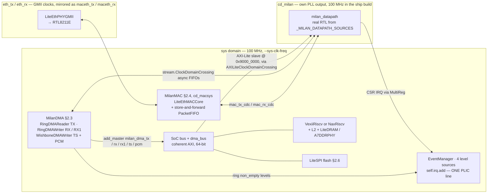
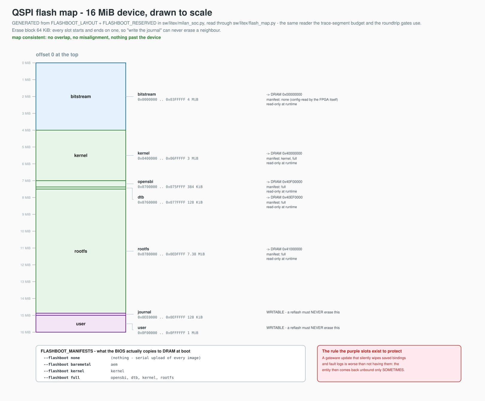

# The LiteX SoC - `sw/litex/` in depth

`sw/litex/milan_soc.py` (~3600 lines) is "the LiteX line of code": the fully-
FPGA host that replaced the Zynq PS. It builds a RISC-V Linux SoC on the
Alinx AX7101 (Artix-7 `xc7a100t`) with the Milan TSN datapath attached as a
real RTL instance, the ring-DMA engines, the LiteEth GMII MAC, DDR3, QSPI
flash-boot and the telemetry block.

This page maps the whole directory and the SoC's anatomy; the step-by-step
build/boot recipe stays in [`sw/README.md`](../../sw/README.md) and
[../integration/QSPI_FLASHBOOT.md](../integration/QSPI_FLASHBOOT.md).

---

## Contents

- **[1. Directory map - what each file is](#1-directory-map---what-each-file-is)** — One row per file with who it is for, so you can tell the SoC from the board file from the research instruments. Includes the two easy-to-misread entries: `milan_rgmii.py` is legacy and imported by nothing, and `evidence/` is where the known-good LiteX commit is recorded.
- **[2. SoC anatomy (milan_soc.py)](#2-soc-anatomy-milan_socpy)** — The memory map with bases read from the source, not prose (`milan_csr` at `0x9000_0000`, PCM BRAM at `0x9010_0000`), and why: everything at or above `0x8000_0000` is uncached IO on these CPUs, which is what moved the CSR window off the Zynq address. Six subsections take clocking, the datapath attach, DMA, MAC, CPU choice and flash-boot in turn — the flash map is generated, and the note there warns that the layout has moved twice, so any offset you remember is probably from before one of those moves.
- **[3. Building](#3-building)** — The ship-shape command line to copy, and the useful distinction: without `--build` you get elaboration and Verilog export with **no vendor tools at all**. Vivado is currently the only P&R backend wired for this board.
- **[4. The flags that are not optional](#4-the-flags-that-are-not-optional)** — Four flags and the exact failure each one prevents. `--coherent-dma` is not implied by `--all-blocks` and its absence looks like all-zero skbs and a garbage destination MAC; `--gtx-tx-invert` is the difference between 25–40 % corrupt frames and none.
- **[5. Simulation (milan_sim.py)](#5-simulation-milan_simpy)** — A single non-interactive command that boots the BIOS on a softcore and reads `"MILN"` back through the real datapath — the SoC-level rung between the RTL harnesses and silicon.
- **[6. Patches (patches/)](#6-patches-patches)** — Three patches applied in place to your LiteX/LiteEth trees, re-run after every LiteX update. Note that the VexiiRiscv L2-geometry one is **not** applied by `apply.sh` — apply it by hand for non-default L2.
- **[7. Reproducibility - versions](#7-reproducibility---versions)** — There is no pinned requirements file; this is the list of known-good anchors instead (LiteX `a1e1c36`, openFPGALoader ≥ v1.1.1, the `verilog-axis` gitlink) and what to do when `apply.sh` fails after an upgrade.
- **[8. The Migen DMA sims and on-target tools](#8-the-migen-dma-sims-and-on-target-tools)** — The six commands to run after touching ring or BD logic, straight from the interpreter with no pytest. Also flags that the `tools_*.c` benchmarks are board-side research instruments, not part of any build.

## 1. Directory map - what each file is

| File | Role | Audience |
|---|---|---|
| `milan_soc.py` | **The SoC.** CRG, CPU (VexiiRiscv/NaxRiscv), DDR3, LiteEth MAC, Milan datapath attach, ring-DMA engines, IRQs, QSPI flash-boot layout, CLI | everyone |
| `platforms/alinx_ax7101.py` | The board: pins (clk200, UART, GMII "e1" + RGMII "e2" RTL8211E PHYs, DDR3 2×MT41J256M16 = 512 MB, N25Q128 QSPI, LEDs), `xc7a100t-fgg484-2`, openFPGALoader programming | board porters |
| `deploy.sh` | Turnkey `build / load / flash / flash-images / console` for the AX7101; **encodes the known-good flag set** (§4) | everyone |
| `milan_sim.py` | Verilator **SoC-level sim**: boots the LiteX BIOS on a softcore with the real `milan_datapath` at `0x9000_0000`, proves the CPU⇄CSR path (reads ID `"MILN"`, milestone M-A2) | everyone |
| `patches/` | LiteX-ecosystem patches + `apply.sh` (§6) | everyone |
| `test_ring_dma.py` (+ `test_ring_bd.py`, `test_ring_tx.py`, `test_ring_writeback.py`, `test_rx_steer.py`, `test_tx_bd.py`) | **Migen behavioral sims** of the DMA engines (self-checking, print `ALL PASS`); `test_ring_dma.py` is the base harness the others import | DMA developers |
| `tools_*.c` (8 files) | On-target microbenchmarks compiled for the board (`lat_mem_rd`, `mapbench`, `recv_ring`, `recv_spin`, `recv_trunc`, `recv_zc`, `tcp_blast`, `wakebench`) - the instruments behind the perf findings | perf work |
| `phase0_measure.sh` | On-board telemetry/iperf sweep script (busybox `devmem`); CSR addresses are build-specific - regenerate before reuse | perf work |
| `poll_cost_model.py` | Analytical model projecting RX pps from measured sweeps | perf work |
| `evidence/` | Captured proof logs (sim + on-silicon `hw_*` logs, the M-A3 write-up). `hw_naxriscv_reads_MILN.log` records the **known-good LiteX commit `a1e1c36`** (§7) | reviewers |
| `milan_rgmii.py` | **Legacy, unused.** An RX-clock-inverted Series-7 RGMII PHY variant from before the board was confirmed GMII-wired; nothing imports it. Kept for reference only | - |

---

## 2. SoC anatomy (`milan_soc.py`)

**Where each window lives.** Bases below are read from `milan_soc.py`, not from
prose: `MILAN_CSR_BASE`/`MILAN_CSR_SIZE`, `MILAN_PCM_BRAM_BASE`/`_SIZE`, the
`FLASHBOOT_LAYOUT` DRAM targets, and the CPU-map comment in `MilanSoC.__init__`
("BOTH map csr @ `0xf000_0000` / clint @ `0xf001_0000` / plic @ `0xf0c0_0000`"),
which is why NaxRiscv and VexiiRiscv builds need no address changes.

| window | base | size | what it is |
|---|---|---|---|
| DRAM (LiteDRAM `main_ram`) | `0x4000_0000` | 512 MB (2 × MT41J256M16) | kernel `0x4000_0000`, dtb `0x40EF_0000`, OpenSBI entry `0x40F0_0000` (`FLASHBOOT_ENTRY`), rootfs/initrd `0x4100_0000` |
| `milan_csr` | `0x9000_0000` | `0x1_0000` (64 KB) | the datapath's AXI4-Lite register ABI, added with `cached=False` |
| `milan_pcm_bram` | `0x9010_0000` | `0x8000` (32 KB) | dual-port PCM window, present only when the PCM ring is elaborated as BRAM (`--pcm-ring bram`) |
| LiteX CSR bank | `0xf000_0000` | — | the Migen-generated CSRs (DMA rings, telemetry, LiteEth, LiteDRAM) |
| CLINT | `0xf001_0000` | — | timer + software interrupts |
| PLIC | `0xf0c0_0000` | — | external interrupts; the Milan `EventManager` is one source here |

Everything at or above `0x8000_0000` is the CPUs' uncached IO region — the
constraint that forced the Milan CSR window off the Zynq's `0x43C0_0000`
(§2.2, and [../integration/AXIS_CORES_ON_NAXRISCV.md](../integration/AXIS_CORES_ON_NAXRISCV.md) §2).

**The skeleton.** One picture of what is instantiated and which clock domain it
sits in — the subsections below then take each block in turn:



### 2.1 Clocking (`_CRG`)

`S7PLL` takes the board's 200 MHz to `sys` (100 MHz for the full build - DDR3
requires it), plus `sys4x`/`sys4x_dqs` + 200 MHz `idelay`/`S7IDELAYCTRL` for
the `A7DDRPHY`.

With `--milan-clk-freq` the Milan datapath gets its **own clock domain**
(`cd_milan`, 100 MHz in the current ship build; the SUPERSEDED perf-lineage
builds ran it at 50 MHz to lift the dense CBS/TCAM/PTP logic off the sys
timing budget): a 64-bit datapath at 100 MHz (6.4 Gb/s) far outruns 1 GbE.

The crossings:

- CSR bus via `AXILiteClockDomainCrossing`;
- each DMA/MAC AXIS lane via a `stream.ClockDomainCrossing` FIFO;
- the IRQ via `MultiReg`.

### 2.2 The datapath attach (`MilanNIC` / `add_milan_datapath()`)

Instantiates `milan_datapath` as **real RTL** (no black box) from the curated
`_MILAN_DATAPATH_SOURCES` list (the same file set the `tb/verilator/milan_dp`
harness and `syn/yosys` use, so the build can't drift from what is verified).

The CSR window is an AXI4-Lite slave at `MILAN_CSR_BASE = 0x9000_0000`
(64 KB, uncached-IO region on these CPUs; the Zynq build used
`0x43C0_0000` - only the base differs, offsets are the ABI in
[../reference/REGISTER_MAP.md](../reference/REGISTER_MAP.md)).

It also emits the CBS slope **multicycle constraint** on Xilinx parts - a
porting-relevant detail explained in
[../integration/PORTING_GUIDE.md](../integration/PORTING_GUIDE.md) §4.5.

Interrupts: an `EventManager` with four level sources (`tx`/`rx`/`ts`/`csr`)
folded into one PLIC line - matching the driver's four `interrupt-names`
(the DT encodes the aggregation; see [`sw/dts/README.md`](../../sw/dts/README.md)).

### 2.3 The DMA (`MilanDMA`)

The engines:

- TX is a `RingDMAReader` (native AXI bursts, DRAM → datapath);
- RX a `RingDMAWriter` (always-ready ingress, datapath → DRAM,
  completion-queue depth 32);
- TS a `WishboneDMAWriter`.

Masters attach to the CPU's **coherent** `dma_bus` when present - which is
why `--coherent-dma` is mandatory (§4). An optional second RX queue
(`--rx-queues 2`) adds an `RxSteer` classifier — since 2026-07-26 that is a
**dedicated gPTP lane** (q1 = DMAC `01-80-C2-00-00-0E` + EtherType `0x88F7`,
q0 = everything else), not the TCP-flow load-balancer it used to be. Each queue
is its own ring writer, interrupt and NAPI; per-board `rx_queues` and the
reflash gate on raising it are in
[../reference/EGRESS_QUEUE_MAP.md](../reference/EGRESS_QUEUE_MAP.md).

Endianness is `"big"` on purpose: memory order == wire order, so the CPU
never byte-swaps.

The BD-format/zero-copy/checksum evolution of these engines is chronicled
in [../fpga/CPPI_DMA_REDESIGN.md (archived)](../../historical_now_obsolete/fpga/CPPI_DMA_REDESIGN.md)
and the [findings log](../findings/README.md).

### 2.4 The MAC (`MilanMAC`)

`LiteEthPHYGMII` + `LiteEthMACCore` (preamble/CRC/padding) + a
store-and-forward `PacketFIFO` + a thin stream↔AXIS adapter.

The AX7101's RTL8211E port is wired **GMII** (not RGMII - see
[../integration/BOARD_PORTING_AX7101.md](../integration/BOARD_PORTING_AX7101.md) §3),
and the TX clock is forwarded **inverted** (`--gtx-tx-invert`, via the LiteEth
patch, §6) because edge-aligned launch off IOB-packed FFs was hold-marginal at
the PHY (25-40 % corrupt frames without it).

The Milan datapath keeps all packet intelligence; the MAC does L1/framing
only.

### 2.5 CPU: VexiiRiscv and NaxRiscv - read this before building
`--cpu {naxriscv,vexiiriscv}`; **the CLI default is `naxriscv`**, and
`deploy.sh` does not override it.

* **VexiiRiscv** (`--cpu vexiiriscv`, forced `linux` variant, RV64IMASU,
  sv39) is the ship core: the ship shape is **1-hart + `--l2-bytes
  32768`** (L2-32K) at 100e6. The **dual-hart SMP** (`--cpu-count 2`,
  L2-64K) configuration behind the older project-scoreboard Linux results is
  a SUPERSEDED perf-lineage variant; the perf-campaign docs
  ([findings](../findings/README.md)) measure that earlier configuration.
* **NaxRiscv** (default, RV64GC) is the earlier bring-up core, retained as a
  pure-NIC option and used by `milan_sim.py`. `--with-fpu`/`--xlen` behave
  as documented in the source (the FPU needs both the toolchain arch *and*
  the scala flags - handled for you).

So: the ship build is `--cpu vexiiriscv` **1-hart + `--l2-bytes 32768`**
at 100e6; to reproduce the older published Linux/perf results build the
SUPERSEDED perf-lineage `--cpu vexiiriscv --cpu-count 2` (L2-64K) instead; a
bare `deploy.sh build` gives you a NaxRiscv SoC. This asymmetry is tracked in
[KNOWN_ISSUES_AND_LIMITATIONS.md](../limitations/KNOWN_ISSUES_AND_LIMITATIONS.md).
The full named build configurations (`build.sh`) live in
[../integration/BUILDING.md](../integration/BUILDING.md).

### 2.6 QSPI flash-boot
`FLASHBOOT_LAYOUT` / `FLASHBOOT_RESERVED` / `FLASHBOOT_MANIFESTS` in
`milan_soc.py` are the **single source of truth** for the 16 MiB N25Q128
layout; the build writes `flashboot_layout.json` so gateware and
`deploy.sh flash-images` never drift. Guide:
[../integration/QSPI_FLASHBOOT.md](../integration/QSPI_FLASHBOOT.md).

*What is at which offset, and what must a reflash never erase?* — the map,
drawn to scale and **generated from those dicts**, so this page cannot carry a
stale copy of them:



Master: [`flash_layout.gen.py`](../diagrams/flash_layout.gen.py) — it reads the
dicts through `sw/dts/gen_mtd_partitions.py`'s `load_map()`, the same reader
the kernel's `fixed-partitions` node comes from, and prints
`check_flash_map()`'s verdict on the drawing.

That check is not cosmetic: every slot is erase-block (`0x1_0000`) aligned
because a partition starting or ending mid-block cannot be erased without
destroying its neighbour. Note the open item recorded in the source:
`deploy.sh` derives each image's ceiling from the *next image* offset and does
not read the `reserved` key, so an oversized rootfs is still caught by
hand-check only.

> **The layout has moved twice.** v3 (2026-07-12) put the bitstream at offset 0;
> v4 (2026-07-26) shrank `rootfs` to make room for the writable `journal` and
> `user` slots. Any offsets quoted from memory — including the comment above
> the dict in `milan_soc.py`, which still says "the kernel always lives at
> offset 0" — predate one of those moves. Read the picture, or the build's own
> `flashboot_layout.json`.

---

## 3. Building

```sh
cd sw/litex
# ship shape: 1-hart VexiiRiscv + L2-32K, datapath @ 100 MHz
./milan_soc.py --all-blocks --coherent-dma --milan-clk-freq 100e6 \
               --gtx-tx-invert --timing-opt --cpu vexiiriscv --l2-bytes 32768
               # add --build to run Vivado P&R; without it, elaboration +
               # gateware/Verilog export runs with NO vendor tools
               # (SUPERSEDED perf-lineage: --cpu-count 2 for dual-hart SMP / L2-64K)
./milan_soc.py ... --build     # Vivado bitstream
./milan_soc.py ... --load      # openFPGALoader -c ft232 (JTAG -> SRAM)
```

Or just `./deploy.sh` (build + load + console) / `./deploy.sh load` etc. -
`deploy.sh` carries the verified `MILAN_OPTS` and the JTAG/console device
identification for the AX7101.

Vivado is currently the **only P&R backend wired up for this board** (the
platform is instantiated with `toolchain="vivado"`). Elaboration-only runs
need no vendor tools, and re-targeting to another board/toolchain is Route A
in [../integration/PORTING_GUIDE.md](../integration/PORTING_GUIDE.md) §6.1.

## 4. The flags that are not optional

| Flag | Why it is required |
|---|---|
| `--coherent-dma` | **NOT implied by `--all-blocks`.** Without it the DMA masters bypass the CPU's snooping `dma_bus`: RX buffers are never CPU-visible (all-zero skbs, every frame dropped) and TX reads stale data (garbage dst MAC). Hardware-confirmed 2026-07-04 |
| `--gtx-tx-invert` | AX7101/RTL8211E GMII: edge-aligned TX launch is hold-marginal → 25-40 % corrupt frames; inverted (mid-bit) sampling → 0. Needs the LiteEth patch (§6) |
| `--milan-clk-freq 100e6` | Puts the datapath in its own `cd_milan` domain; the ship shape closes timing at 100e6 (SUPERSEDED perf-lineage builds used 50e6 to lift the dense CBS/TCAM/PTP logic off the sys budget, where the CBS block is the critical path) |
| `--all-blocks` | NIC+DMA+MAC+DDR3 in one build; implies `--with-spiflash` |

## 5. Simulation (`milan_sim.py`)

```sh
./milan_sim.py --non-interactive     # Verilator: BIOS boots, reads "MILN"
```

This is the SoC-level layer of the verification stack (RTL harnesses below
it, silicon above it) - see [../testing/TESTING.md](../testing/TESTING.md) and
[../testing/SIMULATION.md](../testing/SIMULATION.md). The sim SoC uses
NaxRiscv and the same `add_milan_datapath()` as the board build.

## 6. Patches (`patches/`)

Applied **in place** to the active Python env's LiteX/LiteEth trees by
`patches/apply.sh` (idempotent; **re-run after every LiteX update**):

| Patch | What it does |
|---|---|
| `0001-milan-linux-flashboot.patch` | Adds the `linux_flashboot` BIOS boot method (runs before serialboot; inert without the `MILAN_FLASHBOOT_*` constants that `--with-spiflash` emits) |
| `0002-liteeth-gmii-tx-clk-invert.patch` | Adds `tx_clk_invert` to `LiteEthPHYGMII` → the `--gtx-tx-invert` flag |
| `0002-vexiiriscv-l2-depth-args.patch` | Exposes VexiiRiscv L2 depth/geometry args used by the perf campaign's L2 experiments. **Not applied by `apply.sh`** - apply manually when building VexiiRiscv with non-default L2 |

Details and re-diff instructions: [`patches/README.md`](../../sw/litex/patches/README.md).

## 7. Reproducibility - versions

There is currently **no pinned requirements file**; patches are diffed
against LiteX `master`. Known-good anchors, recorded from working builds:

* LiteX git `a1e1c36` (from `evidence/hw_naxriscv_reads_MILN.log` - the
  on-silicon M-A2 run).
* openFPGALoader ≥ v1.1.1; Vivado with Artix-7 support for `--build`.
* `verilog-axis` submodule pinned by the gitlink
  (`git submodule update --init third_party/verilog-axis` - required for any
  elaboration).

If `apply.sh` fails after a LiteX upgrade, the patch context moved - re-diff
per `patches/README.md`. This gap (and the plan to pin properly) is tracked
in [KNOWN_ISSUES_AND_LIMITATIONS.md](../limitations/KNOWN_ISSUES_AND_LIMITATIONS.md).

## 8. The Migen DMA sims and on-target tools

The `test_*.py` sims are the regression net for the DMA engines - run them
after touching `RingDMAReader`/`RingDMAWriter`/BD logic:

```sh
cd sw/litex
python3 test_ring_dma.py      # base ring engines
python3 test_ring_bd.py       # BD-mode engines (largest suite)
python3 test_ring_tx.py  ; python3 test_ring_writeback.py
python3 test_rx_steer.py ; python3 test_tx_bd.py
```

Each prints `PASS <name>` per test and `ALL PASS` at the end (no pytest;
plain interpreter from your LiteX venv). The `tools_*.c` benchmarks are
cross-compiled and run **on the board**; they are research instruments, not
part of any build - their measurements live in the
[findings log](../findings/README.md).

---

*Related: [../integration/INTEGRATION_GUIDE.md](../integration/INTEGRATION_GUIDE.md) ·
[../integration/PORTING_GUIDE.md](../integration/PORTING_GUIDE.md) ·
[../integration/QSPI_FLASHBOOT.md](../integration/QSPI_FLASHBOOT.md) ·
[../integration/AXIS_CORES_ON_NAXRISCV.md](../integration/AXIS_CORES_ON_NAXRISCV.md)
(the three-plane attach model) · [../testing/TESTING.md](../testing/TESTING.md).*
