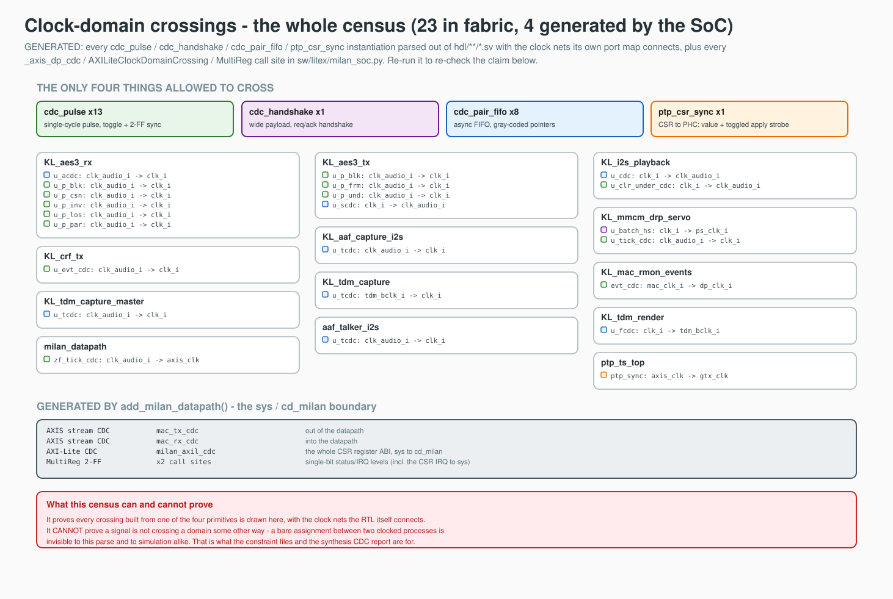

# Milan TSN FPGA - architecture & developer guide

The map a new developer should read first: the datapath, the control plane,
the clock domains, how the HDL maps to the Linux driver and device tree, and
**where to change things**. For the deep-dive companions:
[FULL_FPGA_SOLUTION.md](FULL_FPGA_SOLUTION.md) (build/run/roadmap),
[../fpga/FPGA_DESIGN.md](../fpga/FPGA_DESIGN.md) (every RTL module),
[../reference/REGISTER_MAP.md](../reference/REGISTER_MAP.md) (the ABI),
[`REQUIREMENTS.md`](../../REQUIREMENTS.md) (normative what/why).

The project has **two host variants around one datapath**:

* **Fully-FPGA softcore (primary):** LiteX RISC-V SoC on the Alinx AX7101
  (Artix-7) - CPU, DDR3, ring-DMA engines, LiteEth GMII MAC and the
  `milan_datapath` wrapper, all in fabric. This is where development and the
  performance campaigns happen. ([../litex/LITEX_SOC.md](../litex/LITEX_SOC.md))
* **Zynq-7020 PS (legacy variant):** `milan_top` + Vivado block design
  (`bd/milan-dma.tcl`: PS7 + AXI-DMA + interconnect), RGMII MAC in fabric.
  Kept working, but not the main line. (Section 9)

**The control plane is the protocol processor, and only that (2026-08-13).**
[`hdl/milan/KL_pp_shadow.sv`](../../hdl/milan/KL_pp_shadow.sv) wraps the pinned
`protocol-processor` submodule and `milan_datapath` instantiates it
**unconditionally** — no parameter, no fallback, no shadow arm. It owns ADP,
ACMP (talker and listener) and SRP. This repository's own ADP advertiser,
AECP/AEM engine, ACMP talker/listener and lwSRP applicant are **deleted**;
MAAP stays in this fabric (`KL_maap` + `hdl/milan/KL_pp_maap_shim.sv`) because
the shipping integration holds the processor's internal `KL_pp_maap` engine
disabled with `cfg_maap_internal_i = 0` and selects this fabric allocator.

**State the AECP surface before reading anything else: this entity serves the
processor's declared command inventory, including READ_DESCRIPTOR and
GET_COUNTERS.** Unsupported commands receive a conformant fallback. The
responder is the processor's AECP uCPU, which has
landed — the device is reachable on AECP, not silent. `READ_DESCRIPTOR`
(0x0004) returns `SUCCESS` carrying `configuration_index`, the reserved field
and the descriptor; `NO_SUCH_DESCRIPTOR` on a locate miss; `BAD_ARGUMENTS` on a
bad configuration index -- both error paths carrying the IEEE 1722.1 Section 7.4.5
4-byte `{descriptor_type, descriptor_index}` stub. **Controller enumeration is
reachable once the builder-generated descriptor image is loaded into DRAM.**
The tracked board flow verifies and loads the paired image with `aemi-load`
before entity enable. Unsupported operations get the conformant fallback with
the correct message type, length, and `controller_data_length`: never silence,
never malformed. `IDENTIFY_NOTIFICATION` (0x0026) arriving as a *command* is
`BAD_ARGUMENTS` -- Section 7.4.39.2's opcode-specific rule beats Section 9.3.5.3.3. A command
whose `target_entity_id` is not ours, and any AECP *response* arriving as input,
are silently refused: freed, counted, no reply. Milan Delta 7
`ACQUIRE_ENTITY` returns `NOT_SUPPORTED` with a zero owner.

**An echo is not an implementation**, so read the echo as a duty discharged
(IEEE 1722.1 Section 9.3.5: respond to what you do not implement), never as coverage.
Genuinely absent behind it: `SET_STREAM_FORMAT`, `SET_STREAM_INFO`, name access,
most Milan Table 5.22 change triggers, root-level IDENTIFY indication, and
saved-state persistence. `GET_DYNAMIC_INFO` is served by the processor batch
scanner. `ADD_AUDIO_MAPPINGS` and
`REMOVE_AUDIO_MAPPINGS` are served through an atomic root transaction and emit
their required successful-change notifications.
`SET_CLOCK_SOURCE` is accepted by the processor and its dynamic selection is
exported to the root, but no media-plane logic consumes it, so the media plane
remains pinned to INTERNAL. Those
are stated capability boundaries. What they cost functionally is Section 3.2; what the
affected CSR words read is
[../reference/REGISTER_MAP.md](../reference/REGISTER_MAP.md).

Machine-checked status rows are defined by the
[Milan feature status ledger](../reference/MILAN_FEATURE_STATUS.md):

<!-- milan-feature-status:start -->
| Feature ID | Status | Canonical value |
|---|---|---|
| `aem.served-command-set` | `implemented` | - |
| `aem.acquire-entity-refusal` | `not-supported` | - |
| `aem.mandatory-missing-set` | `missing` | - |
| `stream-input.start-stop` | `partial` | - |
| `stream-input.stopped-crf-observation` | `missing` | - |
| `crf.media-clock-consumption` | `missing` | - |
| `state.nonvolatile-persistence` | `missing` | - |
| `notifications.change-events` | `partial` | - |
| `notifications.controller-liveness` | `missing` | - |
<!-- milan-feature-status:end -->

The START/STOP command path and AAF media gate exist, but issue #97 keeps the
feature partial. Command success can precede the binding-record commit, and a
stopped CRF input currently loses receive observation together with timing
consumption.

**The entity model is no longer a fabric ROM — it lives in DDR3.** The
processor's descriptor store fetches it over a read-only master at a
**compile-time base**: there is no base register and software cannot relocate it
at runtime, so the image must be written at that base **before** the entity is
enabled. The end-station builder emits `aem_desc.bin`, `aem_desc.json`, and
`aem_desc.map`; the tracked board flow packages the paired artifacts and runs
`aemi-load` before entity enable. A custom integration that omits this step
answers `BAD_ARGUMENTS` to every read because the argument check runs before the
locate and an invalid image reports zero configurations. Section 4 has the detail and
the symptom.

---

## Contents

- **[1. Repository layout](#1-repository-layout)** -- Annotated directory tree, one line per directory saying what it holds. Fastest way to learn that `hdl/` mirrors the standards clauses (`ieee1722/`, `ieee17221/`, `ieee8021as/`, `ieee8021q/`) rather than the block hierarchy.
- **[2. System block diagram (fully-FPGA softcore)](#2-system-block-diagram-fully-fpga-softcore)** -- The whole SoC in one ASCII drawing: CPU and DMA engines above, `milan_datapath` below, TX/RX/TS lanes across. Says which SoC shape actually ships (1-hart, 32 KB L2) versus the superseded 2-hart perf peak, and names the five consumers of that one boundary.
- **[3. Datapath](#3-datapath)** -- Frame flow in both directions, and the two structural facts everything else follows from: the fabric engines inject *downstream* of the shaper (never touching classifier or queue), and the media copy is tapped *upstream* of the TCAM filter so the fabric keeps consuming AVTP while the CPU stays shielded from the multicast flood. Section 3.1 is the TX arbiter cascade after it collapsed 8 muxes → 4, and Section 3.2 the three functional losses the AECP boundary costs.
- **[4. Control plane (milan_csr)](#4-control-plane-milan_csr)** -- One AXI4-Lite window, sorted by direction: `o_*` configuration out, `i_*` status back, single-cycle command strobes, one IRQ line. Carries the boot ordering that bites: the descriptor image must be in DRAM at its compile-time base before the entity is enabled, and the enable is now *either* `PP_CTRL[0]` or the historic `ADP_CTRL.en`. Also the boundary that trips people up: the ring-DMA engines live in a separate LiteX CSR space at `0xf000_xxxx`.
- **[5. Clock domains & CDC](#5-clock-domains--cdc)** -- The domain table plus the generated crossing census, and the two things to read off it: every `sys ⇄ cd_milan` crossing comes from `add_milan_datapath()` (a hand-rolled extra is a bug), and the census is a *lower* bound. A bare assignment between clocked processes is invisible to it and to simulation alike.
- **[6. HDL ↔ software mapping](#6-hdl--software-mapping)** -- One row per concern joining a CSR group to the driver entry point and the device-tree property that binds them, so you can trace a feature end to end without opening three repos.
- **[7. Verification](#7-verification)** -- What the six layers each prove, including the split worth internalising: the Verilator suites prove the RTL does what it does, the BDD conformance suite proves it does what the standard says. Also the Yosys gate on tied-off datapath inputs, the defect class that let RMON read zero for months.
- **[8. Where to change things (maintainability)](#8-where-to-change-things-maintainability)** -- The maintenance table: for each kind of change, every file that must move together and the harnesses to re-run. Note the paired edits that are easy to half-do: queue count lives in two places, CBS defaults in two more.
- **[9. The Zynq-7020 variant (legacy)](#9-the-zynq-7020-variant-legacy)** -- The legacy host, kept working but off the main line. Read it for the decoder ring on older docs: wherever [`REQUIREMENTS.md`](../../REQUIREMENTS.md) or [historical `TODO.md`](../../TODO.md) mention `0x43C0_0000`, `IRQ_F2P` or `device-tree-xlnx`, they mean this variant only.

## 1. Repository layout

```
milan-fpga/
├─ README.md                 landing page + quick jumps
├─ REQUIREMENTS.md           normative requirements + 802.1 gap analysis
├─ TODO.md                   obsolete historical task list
├─ CHANGELOG.md              the measured per-lever performance ledger
├─ docs/                     ← the documentation tree (see docs/README.md)
│  ├─ overview/  integration/  fpga/  litex/  testing/  limitations/
│  ├─ reference/             REGISTER_MAP, FR/NFR, Milan v1.2 matrix
│  └─ findings/              dated bug post-mortems + perf campaigns
├─ protocol-processor/       the pinned control-plane submodule (ADP · ACMP · SRP)
├─ hdl/                      spec-aligned RTL tree (directories mirror the standards)
│  ├─ milan/                 milan_datapath.sv (fabric NIC wrapper) + milan_top.sv (Zynq)
│  │                         + KL_pp_shadow.sv (the protocol-processor wrapper — this
│  │                         device's whole 1722.1/SRP control plane) +
│  │                         KL_pp_maap_shim.sv (its per-source ALLOC/RELEASE face
│  │                         bridged onto KL_maap's one block claim)
│  ├─ common/                csr/milan_csr.sv ← memory-mapped control plane;
│  │                         CDC primitives (cdc_pulse/handshake/pair_fifo), AXIS
│  │                         iface + pkgs, KL_link_guard, tx_ifg_gasket,
│  │                         eth_event_counter/ (RMON)
│  ├─ ieee1722/              aaf/ (AAF packetize/depacketize, I2S/TDM capture+render,
│  │                         PCM ring/LPF/route) · avtp/ (parsers, stream table, RX
│  │                         monitor) · crf/ (CRF RX/TX + the MMCM-DRP and media-NCO
│  │                         servos, both structurally off -- Section 3.2) · maap/
│  ├─ ieee17221/             adp/ — `adp_tx_arbiter.sv` ONLY, a generic 2-in/1-out
│  │                         AXIS merge the data lane uses too. The advertiser, the
│  │                         ADP parser, the whole AECP/AEM engine and both ACMP
│  │                         engines were deleted with the legacy plane; the AECP
│  │                         responder that answers today is the processor's uCPU.
│  ├─ ieee8021as/            ptp_timestamp/ (PHC counter + ptp_csr_sync CDC +
│  │                         TX/RX stampers)
│  └─ ieee8021q/             ts/ (classifier + queues + CBS + arbiter) ·
│                            filtering/ (TCAM + RX dest-MAC filter). The lwSRP
│                            engine that lived in srp/ is deleted; SRP is the
│                            processor's.
├─ sw/
│  ├─ litex/                 the LiteX SoC (milan_soc.py), sims, patches, tools
│  ├─ builder/               endstation_builder.py - declarative end-station definition
│  ├─ driver/                kl-eth driver contract (source in sibling repo)
│  └─ dts/                   device-tree generator (per-host overlays)
├─ third_party/verilog-axis  vendored AXIS cores (submodule - init required!)
├─ bd/ constraints/          Zynq-variant block design + XDC
├─ syn/yosys/                open-toolchain portability check
└─ tb/
   ├─ verilator/             self-checking harness dirs (live regression; `ls tb/verilator/` authoritative)
   ├─ utests/ itests/        legacy Vivado/xsim testbenches
   └─ avtp_packet_gen_sv/    AVTP stimulus classes (Questa)
```

> Per-module detail for the `hdl/` tree:
> [../fpga/FPGA_DESIGN.md](../fpga/FPGA_DESIGN.md) Section 2.

## 2. System block diagram (fully-FPGA softcore)

```
   ┌─────────────────────────── Artix-7 fabric (LiteX SoC) ───────────────────────────┐
   │                                                                                   │
   │  VexiiRiscv ×1 (ship; NaxRiscv hist.)  L2  DDR3 ctrl (LiteDRAM)  QSPI  UART  PLIC │
   │        │ CPU bus                        │ dma_bus (coherent)                      │
   │        ├────────────────┬───────────────┴───────────────┐                         │
   │   AXI-Lite CSR      LiteX CSRs                  ring-DMA engines                  │
   │   @0x9000_0000     (0xf000_xxxx:                 RingDMAReader (TX, AXI bursts)   │
   │        │            DMA rings, telemetry)        RingDMAWriter (RX, always-ready) │
   │        ▼                                         WishboneDMAWriter (TS)           │
   │  ┌─────────────────────── milan_datapath (hdl/, vendor-neutral) ───────────────┐  │
   │  │ milan_csr ── config/status/IRQ to every block below                         │  │
   │  │ KL_pp_shadow (ADP · AECP · ACMP · SRP) + KL_maap ── control plane           │  │
   │  │ TX: s_axis_tx ─► classify ─► 5 queues ─► CBS ─► PTP-TX ─► arb ──► mac_tx    │  │
   │  │     fabric engines (AAF · CRF · ctl_tx = processor+MAAP) join ─┘ (post-CBS) │  │
   │  │ RX: mac_rx ─► PTP-RX ─┬─► TCAM dest-MAC filter ─► m_axis_rx   (host copy)   │  │
   │  │                       └─► AVTP parse ─► monitor ─► depkt ─► PCM (media)     │  │
   │  │ TS: {dir, seq_id, timestamp} records ─► m_axis_ts                           │  │
   │  └──────────────────────────────────────────────────────────────────────────┬─┘  │
   │                                                     MilanMAC (LiteEth GMII) │     │
   └──────────────────────────────────────────────────────────────────────────── │ ────┘
                                                                        RTL8211E PHY (GMII)
```

The ship SoC on the AX7101 is a **1-hart VexiiRiscv + `--l2-bytes 32768`**
(32 KB L2), as drawn (`sw/litex/build.sh cfg_ax7101`); the 2-hart / 64 KB-L2
SMP shape is the superseded performance-campaign peak (kept for the perf
lineage), not the deployed config.

The same `milan_datapath` is what the Zynq variant, the Verilator harnesses
([`tb/verilator/milan_dp`](../../tb/verilator/milan_dp)), the SoC sim (`milan_sim.py`) and the Yosys
portability check all build - one boundary, five consumers. Its port-level
contract is [../integration/INTEGRATION_GUIDE.md](../integration/INTEGRATION_GUIDE.md).

## 3. Datapath

**TX (CPU lane):** DMA reader → `traffic_controller_802_1q` (classify →
**five** per-queue FIFOs → CBS arbiter) → `ptp_ts_top` (TX timestamp capture at
the egress SFD) → a chain of `adp_tx_arbiter` mergers → MAC.

**TX (fabric lane):** the AAF talkers, the CRF talker, and the control lane —
the protocol processor's single packed byte stream (ADP, ACMP and SRP,
internally arbitrated) merged with MAAP's announce/probe/defend — inject into
that arbiter chain **downstream of the shaper**; they never touch the
classifier or a queue. The AAF talkers are paced by the SRP bandwidth gate
instead of by CBS; control frames pass a `tx_ifg_gasket` that the data lane
bypasses.

### 3.1 The TX arbiter cascade — four muxes, not eight

The processor emits ONE byte stream for every protocol it owns, so four of the
old control merges had no second source left once the planes that fed them were
deleted. `A_TXARB_DIAG` (`0x784`) supervises what remains, **LSB first**:

| lane | mux | merges |
|---|---|---|
| 0 | `ctl_tx` | protocol processor (`pp_tx_*`) + `KL_maap` → the control lane |
| 1 | `aaf_final` | shaped CPU traffic + the AAF talkers |
| 2 | `crf_dp` | that + the CRF talker (data lane, gasket-free) |
| 3 | `adp_tx` | the MAC boundary mux: data lane + the gasketed control lane |

Bits 7:4 read a structural zero — there is no fifth-to-eighth arbiter, as
opposed to four arbiters that happen never to have locked. It **was** 0
`aecp_acmp`, 1 `ctl_tx`, 2 `srp_ctl`, 3 `lstn_ctl`, 4 `maap_ctl`, 5
`aaf_final`, 6 `crf_dp`, 7 `adp_tx`: anything still decoding `0x784` by those
numbers now reads the wrong mux. The watchdog windows stay staggered
shortest-upstream (control chain 2^15, data merges 2^16, MAC boundary 2^17) so
only the true origin of a stall fires.

### 3.2 Three functional losses at the control and media boundary

These are not CSR cosmetics. They are behavior a bench will notice:

1. **The CRF media clock can never be SELECTED.** AECP `SET_CLOCK_SOURCE` is
   accepted and stored, and the wrapper exports the selected index to the root.
   No media-plane consumer reads it, so the active selection stays pinned at
   index 0, the INTERNAL media clock, for the life of the build.
   `KL_mmcm_drp_servo` and the `KL_media_nco` packet-grid servo are
   therefore **structurally off** and `A_MCSRV_STAT` (`0x8F8`) reads its idle.
   The CRF Media Clock Input engine (`KL_crf_rx`) still parses, counts and
   reports — it simply cannot steer anything.
2. **Presentation-time offset is pinned at the Milan 2 ms DEFAULT** for every
   Stream Output, because `SET_MAX_TRANSIT_TIME` / `SET_STREAM_INFO(ACC_LAT)`
   was its only writer. That is a *default*, not a zero: 0 ns would be a
   presentation time in the past and every listener would drop every frame as
   late.
3. **Milan Table 5.4 per-STREAM_OUTPUT diagnostic counters are live.**
   `KL_talker_diag_ctx` is instantiated per declared output and served through
   GET_COUNTERS. The Table 5.22 unsolicited change producer remains open.
   **The STREAM_INPUT counters at the `0x6B8` `A_STRMW_CNT`
   window are unaffected and still live** — they reach software through a CSR,
   not through AECP.

**RX:** MAC → `ptp_ts_top` (RX timestamp capture) → then the stream **tees**:

* the **host copy** goes through `rx_mac_filter` (TCAM + station MAC) to the RX
  DMA writer — and, on two-queue builds, `RxSteer` puts gPTP on its own queue;
* the **media copy** is tapped *upstream of that filter*, so the fabric keeps
  consuming the AVTP stream while the TCAM shields the CPU from the multicast
  flood: `avtp_stream_parser` (told what to match by `KL_stream_table`) →
  `KL_avtp_rx_monitor_ctx` (the accept verdict) → `KL_aaf_rx_depacketizer` →
  `KL_pcm_route` → the DRAM PCM ring and/or the DAC render path.

**Timestamp metadata:** `ptp_ts_top` emits `{direction, seq_id, timestamp}`
records on a separate AXIS stream → TS DMA → DRAM, for the driver to
correlate with skbs.

**Follow one frame, hop by hop, with the CSR to read at each stage:**
[../fpga/DATAPLANE_WALKTHROUGH.md](../fpga/DATAPLANE_WALKTHROUGH.md). Which
queue a frame takes and why:
[../reference/EGRESS_QUEUE_MAP.md](../reference/EGRESS_QUEUE_MAP.md). Stage-by-stage
prose with the DMA/host internals:
[../fpga/PIPELINE_STAGES.md](../fpga/PIPELINE_STAGES.md); per-stage counters
to watch it live: [../fpga/pipeline-telemetry.md](../fpga/pipeline-telemetry.md).

## 4. Control plane (`milan_csr`)

Everything the driver configures flows through one AXI4-Lite slave - a 64 KB
window at `0x9000_0000` on the softcore (`0x43C0_0000` on Zynq; only the
base differs, the offsets are the ABI in
[../reference/REGISTER_MAP.md](../reference/REGISTER_MAP.md)).

* **Outputs (`o_*`)** carry configuration to the datapath (MAC enables/IFG/
  station address, classifier PCP→TC map, per-queue CBS slopes/enables, PTP
  increment/offset/commands, the entity identity the processor advertises,
  TCAM entries).
* **Inputs (`i_*`)** bring status back (link/speed/duplex, RMON counters,
  live PTP TOD, event pulses).
* **Command strobes** (`o_ptp_cmd_*`, `o_stats_*`) are single-cycle *apply*
  pulses.
* **Interrupt** `o_irq = |(IRQ_STATUS & IRQ_MASK)` → one PLIC line on the
  softcore (EventManager), `IRQ_F2P` on Zynq.

The ring-DMA engines have their own LiteX-generated CSR space
(`0xf000_xxxx`) - documented in the DMA section of the register map.

**Load the descriptor image before you enable the entity.** The tracked board
flow does this with `aemi-load`. The AECP uCPU serves `READ_DESCRIPTOR` out of main memory, not out of a
fabric ROM: `milan_datapath` exposes a read-only descriptor-memory master
(`o_desc_mem_*` / `i_desc_mem_*`) that the LiteX SoC bridges to DRAM, and its
base is a **compile-time** parameter — `PP_DESC_BASE_P`, derived by the SoC from
its own memory map as the top 1 MiB of main RAM (`main_ram.origin +
main_ram.size - 0x100000`), never mirrored as a literal. There is no base
register, so software cannot point the store somewhere else at runtime; what
software *must* do is write the image at that base as part of boot, before
either enable bit goes high. A zeroed region fails the image header's magic
compare (`"AEMI"` = `0x41454D49`, layout version 1, plus a checksum) and reads
as "image not loaded", so every `READ_DESCRIPTOR` answers
`BAD_ARGUMENTS` — an entity that enumerates empty rather than one that
misbehaves. The status discriminates for you: `BAD_ARGUMENTS` on everything
means no image (or a corrupt one), whereas `NO_SUCH_DESCRIPTOR` means the image
is loaded and that descriptor is genuinely not in the model. It cannot hang either way: the store's watchdog (4096 cycles, about
41 us at 100 MHz) abandons a stalled burst and covers the request handshake too,
so a bridge that never accepts is a clean refusal. A late load heals without a
reset, because every locate against an invalid image re-arms the header probe.

**The descriptor supply chain is part of the tracked build and boot flow.**
[`sw/builder/endstation_builder.py`](../../sw/builder/endstation_builder.py)
turns the selected `endstation_*.yaml` into deployment image artifacts only
during an explicit `--write-fragment` or `--write-rtl` ownership transfer. It
writes `aem_desc.bin`, `aem_desc.json`, and `aem_desc.map` into the sibling
rootfs overlay when that overlay is present. `aemi-load` verifies their pairing
and writes the image to the derived base before entity enable. An ordinary
builder run only writes review artifacts under `sw/builder/out/`. A custom
integration that omits the load receives the fail-closed `BAD_ARGUMENTS`
behavior described above.

**The entity enable is ORed from two bits.** `PP_CTRL[0]` at `0x920` is the
protocol processor's own gate; `ADP_CTRL.en` at `0x600` bit 0 is the historic
entity enable every board script and bring-up recipe in this repo writes.
*Either* one enables the entity, because there is exactly one control plane now
— demanding both would strand every existing script, and honouring only the new
bit would silently ignore the old one. The `0x920`–`0x930` window
(`PP_CTRL`/`PP_STAT`/`PP_SPADDR`/`PP_SPDATA`/`PP_DIAG`) is **unconditional**:
`milan_csr`'s `PP_PLANE_P` parameter is gone, so the window is always decoded
and `PP_STAT` always carries its `0x5B` tag.

The register map is an ABI and no register was removed when the legacy plane
went, so a large group of words now read **structural zeros** (the source is
gone and there is no replacement) or are **write-only scratch** (they read back
what software wrote, and writing them changes nothing observable). Which is
which, word by word, is
[../reference/REGISTER_MAP.md](../reference/REGISTER_MAP.md) — read it before
believing a plausible-looking idle value. `0x648` is one of them despite the
uCPU having landed: `[16]` now carries the processor's live entity-lock level,
while `current_config` and the legacy counters remain structural zeros. The
AECP engine's own telemetry, including command, response and drop counts,
locate misses, last status, last length, image-valid and image-fault, is
**not** there; it lives in the protocol processor's side-port snapshot window,
reached through `KL_pp_shadow`'s side-port host bridge (`PP_SPADDR`/`PP_SPDATA`).

## 5. Clock domains & CDC

| Domain | Freq | Covers |
|--------|------|--------|
| `sys` | 100 MHz | CPU, DDR3, DMA engines, MAC core (softcore build) |
| `cd_milan` (= `axis_clk`) | 100 MHz in the deployed build; ~50 MHz only when split via `--milan-clk-freq` | the whole `milan_datapath`, incl. the CSR block |
| `gtx_clk` | 125 MHz | PTP timestamp counter + MAC-side capture (tied to `axis_clk` on the softcore build; separate on Zynq) |
| PHY RX clock | 125 MHz | inside the MAC only |

*Where are the seams — every one of them, and which two clocks does each join?*
The table above says what the domains are; the census says where they meet:



**Generated, not drawn.** [`cdc_census.gen.py`](../diagrams/cdc_census.gen.py)
parses every `cdc_pulse` / `cdc_handshake` / `cdc_pair_fifo` / `ptp_csr_sync`
instantiation out of `hdl/**/*.sv` — taking each crossing's two clocks from the
port map the RTL itself writes — and every `_axis_dp_cdc` /
`AXILiteClockDomainCrossing` / `MultiReg` call site out of
[`sw/litex/milan_soc.py`](../../sw/litex/milan_soc.py). It **refuses to emit** if a primitive's clock ports
have moved, rather than drawing a `?`. The editable master is
[`cdc_census.drawio`](../diagrams/cdc_census.drawio); regenerate with:

```
python3 docs/diagrams/cdc_census.gen.py docs/diagrams/cdc_census
rsvg-convert -w 1900 docs/diagrams/cdc_census.svg -o docs/diagrams/cdc_census.png
```

Two things to read off it. **All the `sys ⇄ cd_milan` crossings are generated
by `add_milan_datapath()`** — a hand-rolled extra one is a bug, not a feature.
And the census is a *lower* bound: it proves every crossing built from those
primitives is accounted for, but a bare assignment between two clocked
processes is invisible to it and to simulation alike, which is what the
constraint files and the synthesis CDC report are for. On the deployed softcore
build `gtx_clk` is tied to `axis_clk`, collapsing two of the domains — the
crossings stay instantiated so the Zynq variant, where they really are
separate, runs the same RTL.

Crossings: `sys ⇄ cd_milan` at the boundary (AXI-Lite async-FIFO CDC, AXIS
stream CDCs, IRQ 2-FF - all generated by `add_milan_datapath()`);
`axis_clk ⇄ gtx_clk` inside the datapath (`ptp_csr_sync` for CSR↔PHC,
`cdc_pulse`/`cdc_handshake` in `ptp_ts_core`). Full inventory:
[../fpga/FPGA_DESIGN.md](../fpga/FPGA_DESIGN.md) Section 3; constraint rules when
porting: [../integration/PORTING_GUIDE.md](../integration/PORTING_GUIDE.md) Section 4.5.

## 6. HDL ↔ software mapping

| Concern | HDL / gateware | Driver (`../kl-linux-drivers` kl-eth) | Device tree |
|---------|----------------|----------------------------------------|-------------|
| Bind / probe | `milan_csr` ID/CAP | `of_match` `kl,dma-ether-0.9`, read CAP | `compatible`, `reg` = csr + dma-tx/rx/ts |
| Datapath | ring-DMA engines (`milan_soc.py`) | ring + NAPI | `reg` DMA windows, `interrupt-names` tx-dma/rx-dma/ts-dma/csr |
| PHC | PTP regs (0x500) | `ptp_clock_info` adjfine/adjtime/gettime | - |
| HW timestamp | ts-metadata AXIS + IRQ | `SIOCSHWTSTAMP`, `skb_hwtstamps` | ts interrupt |
| CBS | CBS regs (0x400) | `ndo_setup_tc(CBS/mqprio)` | tc mapping |
| Classifier | classifier regs (0x300) | mqprio TC map | - |
| MAC/PHY | MAC regs (0x100) | phylib `adjust_link`, `ndo_set_rx_mode` | `phy-handle` |
| Stats | RMON regs (0x200) | `ethtool -S` | - |
| Entity identity | `0x600` group (entity_id, model_id, talker/listener counts) | boot-time identity programming (`ADP_CTRL.en` also enables the entity) | - |
| Entity model (AEM) | the descriptor-memory master `o_desc_mem_*` at `PP_DESC_BASE_P`, which serves `READ_DESCRIPTOR` | an explicit builder deployment transfer writes the paired image into the sibling rootfs overlay; `aemi-load` verifies and loads it before enable | the reserved main-memory region it sits in |
| Control plane | `KL_pp_shadow` + `PP_*` regs (0x920) | enable / side-port diagnostics only — no per-frame CPU work | - |
| RX filter | TCAM regs (0x700) | dest-MAC filtering | - |

The device tree is **generated** per host by [`sw/dts/milan_dt.py`](../../sw/dts/milan_dt.py) from the
build's `csr.json` (LiteX) or the IR JSON (Zynq) - see
[`sw/dts/README.md`](../../sw/dts/README.md). Driver-side contract and
caveats: [`sw/driver/README.md`](../../sw/driver/README.md).

## 7. Verification

Six layers, one map: [../testing/TESTING.md](../testing/TESTING.md).
Quick version: the self-checking Verilator harness dirs (`ls tb/verilator/`
is authoritative; [`tb/verilator/README.md`](../../tb/verilator/README.md))
cover every RTL block through the whole `milan_datapath` wrapper; the **BDD
conformance suite** (`cd tests && behave`) is the spec-facing counterpart —
the Verilator suites prove the RTL does what it does, that proves it does what
the standard says; Migen sims cover the DMA engines; `milan_sim.py` boots the
SoC in Verilator; [`syn/yosys`](../../syn/yosys) proves device portability (the `tops` list in
`run.sh` is authoritative; generic + ECP5); the legacy xsim TBs remain for
waveform work; silicon procedures close the loop.

Since 2026-07-26 **CI runs the RTL gates too** — the full Verilator sweep, the
Yosys sweep and the conformance suite, with Verilator built from source at a
pinned tag ([`.github/workflows/rtl.yml`](../../.github/workflows/rtl.yml)).
[`syn/yosys/run.sh`](../../syn/yosys/run.sh) additionally fails on a **tied-off `milan_datapath` input**
with no justified-tie entry: that is the defect class where a green port-level
testbench vouched for a cone silicon never drove (it is how RMON read zero for
months).

## 8. Where to change things (maintainability)

| To change… | Edit… | Then… |
|------------|-------|-------|
| A register offset / new field | [`hdl/common/csr/milan_csr.sv`](../../hdl/common/csr/milan_csr.sv) offset block + decode | update [`REGISTER_MAP.md`](../reference/REGISTER_MAP.md) + add a check in [`tb/verilator/csr/sim_main.cpp`](../../tb/verilator/csr/sim_main.cpp) (same commit) |
| Number of HW queues | `NUM_QUEUES` (milan_csr) + `NUMBER_OF_QUEUES` (`ethernet_packet_pkg.sv`) | re-run `csr`, `queues`, `shaper_core`, `cls`, `classifier`, `datapath` harnesses; ring/DMA queue count in `milan_soc.py`; the map itself is [EGRESS_QUEUE_MAP.md](../reference/EGRESS_QUEUE_MAP.md) |
| CBS default slopes | `CBS_*_RST` in `milan_csr.sv` **and** `IDLE_SLOPE_*`/`calc_*_credit` in `ethernet_packet_pkg.sv` | keep Σ idleSlope ≤ 75 % (`REQ-CBS-03`); re-run [`tb/verilator/cbs`](../../tb/verilator/cbs); remember the [reset-defaults shaping bug](../findings/CBS_DEFAULT_SHAPING_BUG.md) |
| PCP→TC classification (**tagged** traffic only) | `traffic_class_map.sv` decode | re-run [`tb/verilator/cls`](../../tb/verilator/cls) |
| Which queue a **control** protocol lands on | `CTRL_DMAC_TBL` in `traffic_class_map.sv` — one row per reserved destination MAC, **no EtherType precondition** (a BPDU has none) | re-run [`tb/verilator/cls`](../../tb/verilator/cls), [`tb/verilator/classifier`](../../tb/verilator/classifier); the map itself is [EGRESS_QUEUE_MAP.md](../reference/EGRESS_QUEUE_MAP.md) |
| ADP / ACMP / SRP behaviour | the pinned `protocol-processor` submodule — **not** `hdl/` | bump the submodule pin, re-run [`tb/verilator/pp_shadow`](../../tb/verilator/pp_shadow) and the `milan_dp` integration harness; the fabric side of the seam is [`hdl/milan/KL_pp_shadow.sv`](../../hdl/milan/KL_pp_shadow.sv) and its class-D port list |
| MAAP behaviour | [`hdl/ieee1722/maap/KL_maap.sv`](../../hdl/ieee1722/maap/KL_maap.sv) + [`hdl/milan/KL_pp_maap_shim.sv`](../../hdl/milan/KL_pp_maap_shim.sv) (the per-source ALLOC/RELEASE bridge) | re-run [`tb/verilator/maap`](../../tb/verilator/maap); the DA gate is the talker gate, so a MAAP change moves AAF admission |
| PTP rate/offset | `timestamp_counter.sv` + `ptp_csr_sync.sv` | re-run `ptp`, `ptp_sync`; driver `ptp_clock_info` |
| DMA/BD format | `milan_soc.py` engines | `sw/litex/test_*.py` sims + the driver in lockstep (see [recurring defect patterns](../limitations/RECURRING_DEFECT_PATTERNS.md)) |
| Add an IRQ source | `milan_csr` IRQ_STATUS/MASK (+ EventManager wiring in `milan_soc.py`, or `bd/milan-dma.tcl` `IRQ_F2P` on Zynq) | DT regeneration |
| Board pins / new board | [`sw/litex/platforms/`](../../sw/litex/platforms) | [../integration/PORTING_GUIDE.md](../integration/PORTING_GUIDE.md) |

**Conventions:** SystemVerilog with `` `default_nettype none ``,
TerosHDL/Doxygen `//!` comments on every generic/port/signal, named
`always_*` processes. Register offsets and reset values are defined once in
the RTL, documented in [REGISTER_MAP.md](../reference/REGISTER_MAP.md), and asserted equal by the CSR
harness. Every DUT change ships with its harness update in the same commit.

## 9. The Zynq-7020 variant (legacy)

`milan_top.sv` wraps the same datapath plus the verilog-ethernet
`eth_mac_1g_rgmii_fifo` MAC (source vendored externally) and hangs off the
PS7 via `milan_dma_wrapper.v` + the `bd/milan-dma.tcl` block design (PS7,
2× AXI-DMA, `clk_wiz`, `smartconnect`; CSR at `0x43C0_0000`, four GIC IRQ
lines). Constraints in `constraints/*.xdc`. [`REQUIREMENTS.md`](../../REQUIREMENTS.md) and parts of
[historical `TODO.md`](../../TODO.md) were written in this era - where they talk about `0x43C0_0000`,
`IRQ_F2P` or `device-tree-xlnx`, they describe this variant only. The
migration story from PS to softcore is
[../integration/FULLY_FPGA_RISCV_MIGRATION.md (archived)](../../historical_now_obsolete/integration/FULLY_FPGA_RISCV_MIGRATION.md).
