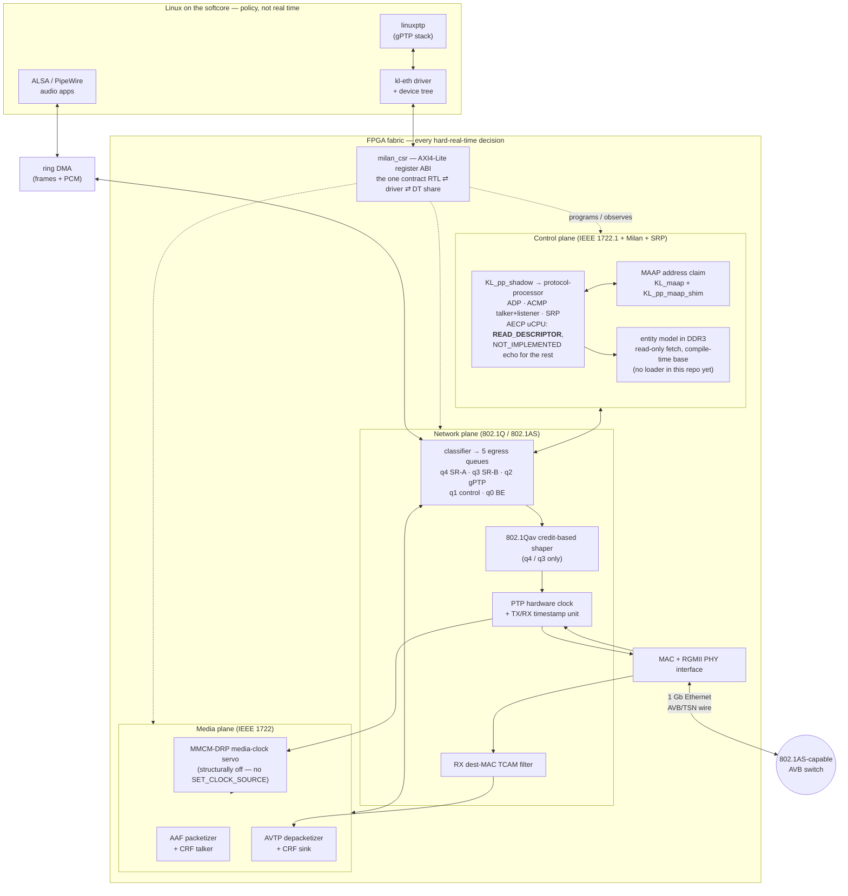

[OBSOLETE + 2026-08-16]

# milan-fpga at a glance — one page

*For someone deciding whether to use this at all.* Everything here is a summary
with a link; nothing here is the authority on its own subject.

---

## Contents

- **[What it is, in three sentences](#what-it-is-in-three-sentences)** -- Product scope, architecture, and the important capability boundary.
- **[The block diagram](#the-block-diagram)** -- Host, control, media, and network data flow.
- **[The standards it implements](#the-standards-it-implements)** -- Standards coverage and links to clause-level traceability.
- **[The register map at a glance](#the-register-map-at-a-glance)** -- Compact view of the software-visible control window.
- **[What is proven, and how](#what-is-proven-and-how)** -- Self-checking evidence and limits of the current verification.
- **[Is this for you?](#is-this-for-you)** -- Suitability guidance for adopters.

## What it is, in three sentences

**A Milan v1.2 AVB/TSN audio end-station implemented in FPGA fabric.**
A RISC-V softcore (VexiiRiscv, generated by LiteX) runs Linux and does the slow,
policy-shaped work — provisioning, `linuxptp`, ALSA; every hard-real-time thing
lives in vendor-neutral SystemVerilog next to it: the MAC, the 802.1Qav credit
shaper, the PTP hardware clock, AVTP/AAF/CRF streaming, MAAP, and — through
`hdl/milan/KL_pp_shadow.sv`, wrapping the pinned `protocol-processor` submodule
— the ATDECC discovery and connection plane, the AECP responder, and SRP. It
talks to real Milan gear on a real wire; the reference build runs 8 talker × 8 listener
streams on an Artix-7 (xc7a100t) with 512 MB of DDR3.

**The one boundary to know before anything else: this entity answers
READ_DESCRIPTOR, and answers every other AECP command with a conformant
NOT_IMPLEMENTED echo.** The responder is the protocol processor's AECP uCPU, in
fabric; this repository's own AECP/AEM engine was deleted rather than kept as a
fallback. So the device DISCOVERS over ADP, CONNECTS over ACMP, RESERVES over
SRP, and **enumeration is reachable again**: a controller's descriptor walk gets
`SUCCESS` with the descriptor, `NO_SUCH_DESCRIPTOR` on a locate miss and
`BAD_ARGUMENTS` on a bad configuration index, the error paths carrying the
§7.4.5 `{descriptor_type, descriptor_index}` stub. Reachable, not free: the
descriptors are fetched from DRAM, and **nothing in this repository builds or
loads that image yet**, so a stock build enumerates as empty (every read a
`BAD_ARGUMENTS`, because an invalid image reports zero configurations and the
argument check precedes the locate) until someone puts one there. That also
reads as a diagnostic: `BAD_ARGUMENTS` everywhere means no image, while
`NO_SUCH_DESCRIPTOR` means the image is loaded and that descriptor is absent. Every other opcode and every
other message type (ADDRESS_ACCESS, MVU included) gets a well-formed response
that changes nothing:
right message type, right length, right `controller_data_length`, never silence
and never malformed. `IDENTIFY_NOTIFICATION` arriving as a command is
`BAD_ARGUMENTS`.

**An echo is not an implementation.** `SET_CLOCK_SOURCE`,
`SET_MAX_TRANSIT_TIME`, `GET_COUNTERS` with the Milan Table 5.22 unsolicited
push, the audio-map setters, IDENTIFY and saved-state persistence across a power
cycle are genuinely absent behind it, and Milan Δ7 `ACQUIRE_ENTITY` is a known
gap: it is not distinguished from the generic echo. That is a stated capability
boundary from an informed decision — not a regression being worked around, and
not temporary. One operational consequence to plan for now: the entity model
lives in DDR3, so software must load the descriptor image at its compile-time
base **before** the entity is enabled — and the missing link is named, not
assumed. The generator is in the submodule
(`protocol-processor/hdl/aecp/desc/gen_desc_image.py`); no step in
[`sw/builder/`](../../sw/builder), `scripts/`, the LiteX SoC builder or the boot
path produces or loads the image, and the `aecp_aem_rom.svh` the builder still
writes is an orphan of the deleted fabric descriptor store, not that image.

**What it is not:** it is not a soft-IP core you drop into a vendor IP catalogue,
and it is not a conformance-tested commercial product. It *is* a readable,
self-checking reference design under an open hardware licence.

---

## The block diagram

Three honest caveats the picture cannot hold: **only CPU-originated frames go
through the classifier and the shaper** — the fabric engines inject after it —
the **RX media path taps upstream of the TCAM filter**, so the fabric keeps
listening while the filter shields the CPU, and **the control plane's TX is one
lane, not five**: the processor emits a single packed byte stream for every
protocol it owns and MAAP joins it in the `ctl_tx` mux, so the TX arbiter
cascade is four muxes (`ctl_tx`, `aaf_final`, `crf_dp`, `adp_tx` — LSB first in
`A_TXARB_DIAG` at `0x784`), not the eight it was. The first two are drawn
properly, hop by hop, in
[`../fpga/DATAPLANE_WALKTHROUGH.md`](../fpga/DATAPLANE_WALKTHROUGH.md).

Three functional losses sit behind that `NOT_IMPLEMENTED` echo and are worth
knowing here, because a bench will meet them — the command is answered, and
nothing happens: the **CRF media clock can never be selected**
(`SET_CLOCK_SOURCE` was its only writer, so the MMCM-DRP and media-NCO servos
are structurally off and `A_MCSRV_STAT` reads idle, while `KL_crf_rx` still
parses and counts); every Stream Output's **presentation-time offset is pinned
at the Milan 2 ms default** (a default, not a zero); and the **Milan Table 5.4
per-STREAM_OUTPUT counters are gone** — `KL_talker_diag_ctx` is not
instantiated, since GET_COUNTERS and the Table 5.22 push were its only readers.
The STREAM_INPUT counters at the `0x6B8` `A_STRMW_CNT` window are unaffected and
still live.

Deeper, generated versions of this picture:
[`SYSTEM_DOMAIN_MAP.md`](SYSTEM_DOMAIN_MAP.md) (every module by domain and
language) and [`ARCHITECTURE.md`](ARCHITECTURE.md) (runtime data/control flow).
The queue map itself is
[`../reference/EGRESS_QUEUE_MAP.md`](../reference/EGRESS_QUEUE_MAP.md). The
normative statement of what lives in fabric vs the softcore is
[`ARCHITECTURE_HW_SW_SPLIT.md`](../ARCHITECTURE_HW_SW_SPLIT.md).

---

## The standards it implements

| Standard | What of it is here | Clause coverage |
|---|---|---|
| **IEEE 1722.1-2021** (ATDECC) | ADP, ACMP (talker + listener) and AECP, all in the protocol processor. **AECP/AEM: `READ_DESCRIPTOR` (once a descriptor image is in DRAM — no build step here makes one) and the §9.3.5 duty to respond** — every other command is a conformant `NOT_IMPLEMENTED` echo, which is protocol conformance and not function; see the boundary above | [`traceability/ieee1722_1-2021.md`](../traceability/ieee1722_1-2021.md) |
| **IEEE 1722-2016** (AVTP) | AAF audio talker + listener, CRF media clock (input parses and counts; it cannot be *selected* as the clock source), MAAP | [`traceability/ieee1722-2016.md`](../traceability/ieee1722-2016.md) |
| **IEEE 802.1Q-2022** | VLAN + PCP classification, credit-based shaper (Qav), MSRP/MVRP in the protocol processor | [`traceability/ieee8021q.md`](../traceability/ieee8021q.md) |
| **IEEE 802.1AS-2020** (gPTP) | the hardware-assist scope: PHC, TX/RX timestamping, ingress latency | [`traceability/ieee8021as.md`](../traceability/ieee8021as.md) |
| **Milan v1.2** (profile) | the profile deltas on top of the four above — talker/listener obligations, fast connect, media clock | [`traceability/milan-v12.md`](../traceability/milan-v12.md) |

The clause-by-clause verification status — what is proven by a self-checking
test, what is partial, what is missing, and *why* a clause is N/A — is
[`SPEC_TRACEABILITY.md`](../SPEC_TRACEABILITY.md). The honest gap narrative is
[`MILAN_COMPLIANCE_GAPS.md`](../MILAN_COMPLIANCE_GAPS.md). Neither hides
anything: read them before you commit to this.

---

## The register map at a glance

One AXI4-Lite window, 64 KB, 32-bit little-endian. Offsets are fixed; only the
base differs per host SoC (`0x9000_0000` on the fully-FPGA build). This table is
the shape of the ABI — every field, reset value and access rule is in
[`reference/REGISTER_MAP.md`](../reference/REGISTER_MAP.md), and the `csr`
Verilator suite is its executable form.

| Base | Group |
|---|---|
| `0x000` | Identification / IRQ — read `ID` here first: it spells `MILN` |
| `0x100` · `0x200` | MAC control/status · RMON statistics — **read `STATS_CAP` (`0x204`) before believing a zero** |
| `0x300` · `0x400` | 802.1Q classifier · 802.1Qav CBS (per queue, stride `0x20`; `0x400`–`0x49F` at 5 queues) |
| `0x500` | PTP hardware clock |
| `0x600` · `0x648` | entity identity + enable (`ADP_CTRL.en`) · AECP/ACMP status + AAF talker (stream 0) |
| `0x680` · `0x6A4` | SRP group · ACMP listener bind record + AVTP RX / MAAP / audio diagnostics |
| `0x700` · `0x71C` | RX dest-MAC TCAM filter · link guard / MAC recovery |
| `0x724` – `0x7A0` | identity & playback overlay · CRF sink · CRF talker · AECP scan forensics · ACMP bind-restore |
| `0x800` · `0x870` | indexed per-stream window (NxN) · AAF per-stage latency taps |
| `0x8B4` · `0x8F8` · `0x900` | RX stream-parser probe · media-clock servo · channel-map debug |
| `0x920` – `0x930` | protocol processor: `PP_CTRL` (bit 0 = entity enable, ORed with `ADP_CTRL.en`), `PP_STAT`, side port, `PP_DIAG` — **always decoded** |

**No register was removed when the legacy control plane was deleted — the map
is an ABI.** What changed is what the words *mean*: a group whose source is gone
reads a documented **structural zero**, and a few provisioning words are now
**write-only scratch** that read back what software wrote while reaching nothing
on the wire. `A_TXARB_DIAG` (`0x784`) additionally **renumbered** its lanes with
the 8→4 mux collapse. [`REGISTER_MAP.md`](../reference/REGISTER_MAP.md) is the
authority for every one of those,
word by word; do not infer liveness from a plausible value.

The ring-DMA engines of the fully-FPGA build live in their **own**
LiteX-generated CSR space, not in this window. Neither is the entity model here:
`READ_DESCRIPTOR` is served out of DDR3, over a read-only master whose base is a
compile-time parameter with no register behind it — the image has to be placed
there by boot software, before either enable bit is set, and no code in this
repository does that today. `0x648` stays a structural zero even so
(`aecp_locked` and `current_config` are tied 0 — no ACQUIRE/LOCK, no
`SET_CONFIGURATION`); the AECP engine's counters live in the processor's
side-port snapshot window behind `PP_SPADDR`/`PP_SPDATA`, not at `0x648`.

---

## What is proven, and how

| Claim | Evidence you can re-run yourself |
|---|---|
| The RTL behaves per spec | the self-checking Verilator suites — `ls tb/verilator/` ([`../../tb/verilator/README.md`](../../tb/verilator/README.md)); CI runs the whole sweep |
| It behaves per the **standard**, not merely per its own RTL | the BDD conformance suite — `cd tests && behave -f plain` ([`../../tests/README.md`](../../tests/README.md)); a CI gate |
| The RTL is vendor-neutral (no Xilinx primitives) | `cd syn/yosys && make && make ecp5` ([`../../syn/yosys/README.md`](../../syn/yosys/README.md)) |
| The register map matches the RTL | the `csr` suite asserts it, offset by offset |
| Every clause maps to a module and a test | [`traceability/MODULE_MATRIX.md`](../traceability/MODULE_MATRIX.md) (generated, gated for drift) |
| An end-station can be *declared* rather than hand-wired | [`ENDSTATION_BUILDER.md`](../ENDSTATION_BUILDER.md) + `python3 sw/builder/test_builder.py` |

| Claim | Evidence you **cannot** re-run without a bench |
|---|---|
| Live talker ↔ listener audio, latency = the presentation offset | [`findings/PERFORMANCE_GOAL.md`](../findings/PERFORMANCE_GOAL.md), [`AAF_LATENCY_TAPS.md`](../AAF_LATENCY_TAPS.md) |
| gPTP sync, media-clock servo lock | [`design/TIME_SYNC.md`](../design/TIME_SYNC.md) |
| Boot from QSPI, driver bring-up, throughput | [`findings/BENCH_TOPOLOGY.md`](../findings/BENCH_TOPOLOGY.md), [`../CHANGELOG.md`](../../CHANGELOG.md) |

Those second-table rows are an **engineering record of measurements on specific
boards on specific dates**, not a promise about your hardware. Every number in
this repo is dated for that reason.

---

## Is this for you?

**Probably yes if** you want a readable, open reference for how Milan discovery,
connection, reservation and streaming actually work on the wire; you are
building an AVB/TSN endpoint and would rather start from working RTL than from a
datasheet; or you want to port a TSN datapath to a non-Xilinx device (the
portability is machine-checked, not claimed).

**Probably no if** you need AECP/AEM *control* — this entity can enumerate once
you supply the descriptor image yourself, and every setter and getter behind
`READ_DESCRIPTOR` is a `NOT_IMPLEMENTED` echo, so nothing a controller writes
takes effect and nothing it queries comes back; you
need a supported, conformance-tested product with a
vendor behind it; you cannot use Vivado and also need a bitstream (there is no
open place & route for Artix-7); or you need something that works out of the box
without reading the limitations page.

**Read next, in this order:** [`../../QUICKSTART.md`](../../QUICKSTART.md) (get
something green in 30 minutes) → [`FULL_FPGA_SOLUTION.md`](FULL_FPGA_SOLUTION.md)
(the full system) → [`../limitations/KNOWN_ISSUES_AND_LIMITATIONS.md`](../limitations/KNOWN_ISSUES_AND_LIMITATIONS.md)
(what bites).

Licence: CERN-OHL-W-2.0 (weakly reciprocal open hardware). Vendored third-party
code and its pins: [`../../THIRD_PARTY.md`](../../THIRD_PARTY.md).
