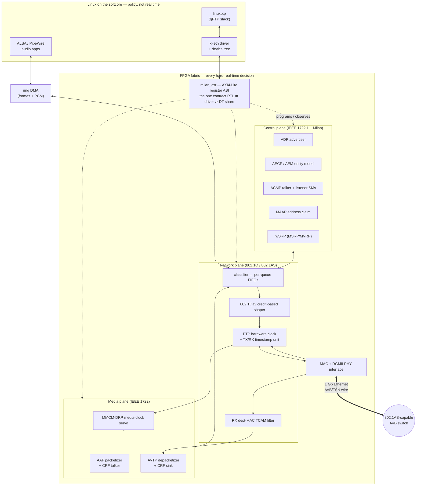

# milan-fpga at a glance — one page

*For someone deciding whether to use this at all.* Everything here is a summary
with a link; nothing here is the authority on its own subject.

---

## What it is, in three sentences

**A complete Milan v1.2 AVB/TSN audio end-station implemented in FPGA fabric.**
A RISC-V softcore (VexiiRiscv, generated by LiteX) runs Linux and does the slow,
policy-shaped work — provisioning, `linuxptp`, ALSA; every hard-real-time thing
lives in vendor-neutral SystemVerilog next to it: the MAC, the 802.1Qav credit
shaper, the PTP hardware clock, AVTP/AAF/CRF streaming, the full ATDECC control
plane (ADP/AECP/ACMP), MAAP and a lightweight SRP engine. It talks to real Milan
gear on a real wire — the reference build runs 8 talker × 8 listener streams on
an Artix-7 (xc7a100t) with 512 MB of DDR3.

**What it is not:** it is not a soft-IP core you drop into a vendor IP catalogue,
and it is not a conformance-tested commercial product. It *is* a complete,
readable, self-checking reference design under an open hardware licence.

---

## The block diagram

Deeper, generated versions of this picture:
[`SYSTEM_DOMAIN_MAP.md`](SYSTEM_DOMAIN_MAP.md) (every module by domain and
language) and [`ARCHITECTURE.md`](ARCHITECTURE.md) (runtime data/control flow).
The normative statement of what lives in fabric vs the softcore is
[`ARCHITECTURE_HW_SW_SPLIT.md`](../ARCHITECTURE_HW_SW_SPLIT.md).

---

## The standards it implements

| Standard | What of it is here | Clause coverage |
|---|---|---|
| **IEEE 1722.1-2021** (ATDECC) | ADP advertiser, AECP + AEM entity model, ACMP talker & listener state machines | [`traceability/ieee1722_1-2021.md`](../traceability/ieee1722_1-2021.md) |
| **IEEE 1722-2016** (AVTP) | AAF audio talker + listener, CRF media clock, MAAP | [`traceability/ieee1722-2016.md`](../traceability/ieee1722-2016.md) |
| **IEEE 802.1Q-2022** | VLAN + PCP classification, credit-based shaper (Qav), MSRP/MVRP as `lwSRP` | [`traceability/ieee8021q.md`](../traceability/ieee8021q.md) |
| **IEEE 802.1AS-2020** (gPTP) | the hardware-assist scope: PHC, TX/RX timestamping, ingress latency | [`traceability/ieee8021as.md`](../traceability/ieee8021as.md) |
| **Milan v1.2** (profile) | the profile deltas on top of the four above — talker/listener obligations, fast connect, media clock | [`traceability/milan-v12.md`](../traceability/milan-v12.md) |

The clause-by-clause verification status — what is proven by a self-checking
test, what is partial, what is missing, and *why* a clause is N/A — is
[`SPEC_TRACEABILITY.md`](../SPEC_TRACEABILITY.md). The honest gap narrative is
[`MILAN_COMPLIANCE_GAPS.md`](../MILAN_COMPLIANCE_GAPS.md). Neither hides
anything: read them before you commit to this.

---

## The register map at a glance

One AXI4-Lite window, 64 KB, 32-bit little-endian. Offsets are fixed; only the
base differs per host SoC (`0x9000_0000` on the fully-FPGA build). This table is
the shape of the ABI — every field, reset value and access rule is in
[`reference/REGISTER_MAP.md`](../reference/REGISTER_MAP.md), and the `csr`
Verilator suite is its executable form.

| Base | Group |
|---|---|
| `0x000` | Identification / IRQ — read `ID` here first: it spells `MILN` |
| `0x100` · `0x200` | MAC control/status · RMON statistics |
| `0x300` · `0x400` | 802.1Q classifier · 802.1Qav CBS (per queue, stride `0x20`) |
| `0x500` | PTP hardware clock |
| `0x600` · `0x648` | ADP advertiser · AECP/ACMP status + AAF talker (stream 0) |
| `0x680` · `0x6A4` | lwSRP engine · ACMP listener SM + AVTP RX / MAAP / audio diagnostics |
| `0x700` · `0x71C` | RX dest-MAC TCAM filter · link guard / MAC recovery |
| `0x724` – `0x7A0` | identity & playback overlay · CRF sink · CRF talker · AECP scan forensics · ACMP bind-restore |
| `0x800` · `0x870` | indexed per-stream window (NxN) · AAF per-stage latency taps |
| `0x8B4` · `0x8F8` · `0x900` | RX stream-parser probe · media-clock servo · channel-map debug |

The ring-DMA engines of the fully-FPGA build live in their **own**
LiteX-generated CSR space, not in this window.

---

## What is proven, and how

| Claim | Evidence you can re-run yourself |
|---|---|
| The RTL behaves per spec | the self-checking Verilator suites — `ls tb/verilator/` ([`../../tb/verilator/README.md`](../../tb/verilator/README.md)) |
| The RTL is vendor-neutral (no Xilinx primitives) | `cd syn/yosys && make && make ecp5` ([`../../syn/yosys/README.md`](../../syn/yosys/README.md)) |
| The register map matches the RTL | the `csr` suite asserts it, offset by offset |
| Every clause maps to a module and a test | [`traceability/MODULE_MATRIX.md`](../traceability/MODULE_MATRIX.md) (generated, gated for drift) |
| An end-station can be *declared* rather than hand-wired | [`ENDSTATION_BUILDER.md`](../ENDSTATION_BUILDER.md) + `python3 sw/builder/test_builder.py` |

| Claim | Evidence you **cannot** re-run without a bench |
|---|---|
| Live talker ↔ listener audio, latency = the presentation offset | [`findings/PERFORMANCE_GOAL.md`](../findings/PERFORMANCE_GOAL.md), [`AAF_LATENCY_TAPS.md`](../AAF_LATENCY_TAPS.md) |
| gPTP sync, media-clock servo lock | [`design/TIME_SYNC.md`](../design/TIME_SYNC.md) |
| Boot from QSPI, driver bring-up, throughput | [`findings/BENCH_TOPOLOGY.md`](../findings/BENCH_TOPOLOGY.md), [`../CHANGELOG.md`](../../CHANGELOG.md) |

Those second-table rows are an **engineering record of measurements on specific
boards on specific dates**, not a promise about your hardware. Every number in
this repo is dated for that reason.

---

## Is this for you?

**Probably yes if** you want a readable, complete, open reference for how Milan
actually works on the wire; you are building an AVB/TSN endpoint and would rather
start from working RTL than from a datasheet; or you want to port a TSN datapath
to a non-Xilinx device (the portability is machine-checked, not claimed).

**Probably no if** you need a supported, conformance-tested product with a
vendor behind it; you cannot use Vivado and also need a bitstream (there is no
open place & route for Artix-7); or you need something that works out of the box
without reading the limitations page.

**Read next, in this order:** [`../../QUICKSTART.md`](../../QUICKSTART.md) (get
something green in 30 minutes) → [`FULL_FPGA_SOLUTION.md`](FULL_FPGA_SOLUTION.md)
(the full system) → [`../limitations/KNOWN_ISSUES_AND_LIMITATIONS.md`](../limitations/KNOWN_ISSUES_AND_LIMITATIONS.md)
(what bites).

Licence: CERN-OHL-W-2.0 (weakly reciprocal open hardware). Vendored third-party
code and its pins: [`../../THIRD_PARTY.md`](../../THIRD_PARTY.md).
