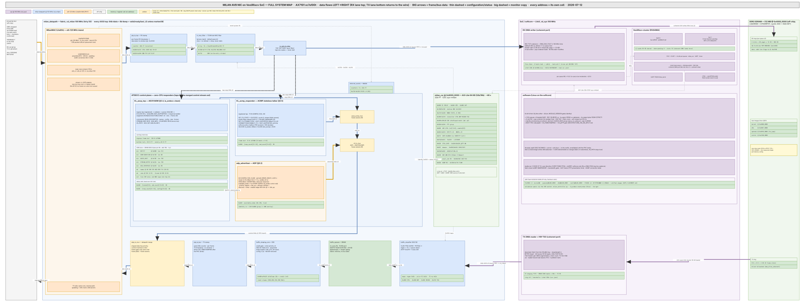

# The Full-FPGA Milan Solution  -  architecture, build, and how to continue

This is the master guide to the **vendor-neutral, fully-FPGA** Milan TSN network
interface: a single **VexiiRiscv RV64IMA** softcore running Linux (the historical
**NaxRiscv RV64GC** core is retained as a pure-NIC/FPU bitstream option,
`~/litex-milan/work/fpu32.bit`), with the entire Milan/AVB/TSN datapath in fabric, on
an **Alinx AX7101 (Xilinx Artix-7 xc7a100t)**  -  built with an **open toolchain**
(LiteX + Verilator + Yosys; Vivado only for the final Artix bitstream).



> The picture above is generated (editable
> [`milan_system_map.drawio`](../diagrams/milan_system_map.drawio); regenerate with
> `python3 docs/diagrams/milan_system_map.gen.py docs/diagrams/milan_system_map.drawio`,
> render per [`docs/diagrams/README.md`](../diagrams/README.md) - never edit the render).

It is written for two audiences:
- **High-level** (§1–§3): what the system is, the protocol stack, the block diagram,
  and current status  -  enough to reason about the solution and plan work.
- **Medium-level** (§4–§8): module-by-module wiring, the CSR/DMA/IRQ ABI, the exact
  build/run commands, how each boundary is attached, and how to add the next piece.

**Read this before the rest of the page (2026-08-13).** The IEEE 1722.1 / SRP
control plane of this device is [`hdl/milan/KL_pp_shadow.sv`](../../hdl/milan/KL_pp_shadow.sv),
wrapping the pinned `protocol-processor` submodule, instantiated
**unconditionally** by [`hdl/milan/milan_datapath.sv`](../../hdl/milan/milan_datapath.sv) —
no parameter, no fallback, no shadow arm. It owns ADP, ACMP (talker and
listener) and SRP; MAAP stays in this fabric (`KL_maap` bridged by
`hdl/milan/KL_pp_maap_shim.sv`) because the processor implements none by design.
This repository's own ADP advertiser, AECP/AEM engine, ACMP talker and listener,
and lwSRP applicant are **deleted**.

**The AECP surface serves the processor's declared command inventory, including
READ_DESCRIPTOR and GET_COUNTERS.** Unsupported commands receive the conformant
fallback. The responder is the processor's AECP uCPU, which has
landed. `READ_DESCRIPTOR` (0x0004) returns `SUCCESS` with `configuration_index`,
the reserved field and the descriptor, `NO_SUCH_DESCRIPTOR` on a locate miss and
`BAD_ARGUMENTS` on a bad configuration index — the error paths carrying the IEEE
1722.1 §7.4.5 4-byte `{descriptor_type, descriptor_index}` stub — so the device
DISCOVERS over ADP, CONNECTS over ACMP, RESERVES over SRP, and **enumeration is
reachable again, once a descriptor image is in DRAM: nothing in this repository
puts one there yet** (see the third paragraph).
Every other opcode and every other message type (AEM, ADDRESS_ACCESS,
VENDOR_UNIQUE/MVU) gets an echo with the correct `message_type`+1, length and
`controller_data_length`; a command addressed to another `target_entity_id`, or
an AECP *response* arriving as input, is silently refused — freed, counted, no
reply. `IDENTIFY_NOTIFICATION` (0x0026) as a command is `BAD_ARGUMENTS`
(§7.4.39.2). **Known gap:** Milan Δ7 `ACQUIRE_ENTITY` (`NOT_SUPPORTED` with
`owner_id` = 0) is not distinguished from the generic echo.

**An echo is not an implementation.** Absent behind it, and absent for real:
`SET_CLOCK_SOURCE`, `SET_MAX_TRANSIT_TIME` (and `SET_STREAM_INFO`'s
`MSRP_ACC_LAT`), the audio-map setters, `GET_COUNTERS` with the Milan Table 5.22
unsolicited push, IDENTIFY, and saved-state persistence — nothing here restores a
binding across a power cycle. This is a stated capability boundary from an
informed decision, not a regression and not a blip. Everywhere below where this
page says "AVDECC in fabric", read it against these two paragraphs.

**The entity model lives in DDR3, not in a fabric ROM — and nothing here fills
it.** The processor's descriptor store fetches the model over a read-only master
whose base is a **compile-time** parameter (`PP_DESC_BASE_P`, derived by the SoC
as the top 1 MiB of `main_ram`, not mirrored as a literal); there is no base
register. Software must load the image at that base **before** enabling the
entity, and no software in this repository does: the generator is in the
submodule (`protocol-processor/hdl/aecp/desc/gen_desc_image.py`), no step in
[`sw/builder/`](../../sw/builder), `scripts/`, the LiteX SoC builder or the boot
path emits or writes it, and the `aecp_aem_rom.svh` the builder still produces
is an orphan of the deleted fabric descriptor store. On a stock build the region
is therefore unloaded, its header magic (`"AEMI"` = `0x41454D49`, layout version
1, plus checksum) fails, and every `READ_DESCRIPTOR` answers
`BAD_ARGUMENTS` — an invalid image reports zero configurations, and the
argument check runs ahead of the locate, so no configuration index passes. It
never hangs on it — the store's watchdog (4096 cycles,
about 41 us at 100 MHz) abandons a stalled burst and covers the request
handshake — and a late load heals without a reset, because each locate re-arms
the header probe.

Companion documents:
- [`PROTOCOL_VALIDATION_MATRIX.md`](../testing/PROTOCOL_VALIDATION_MATRIX.md)  -  **every protocol
  × where it's implemented × the test that validates it** (the validation contract).
- [`FULLY_FPGA_RISCV_MIGRATION.md` (archived)](../../historical_now_obsolete/integration/FULLY_FPGA_RISCV_MIGRATION.md)  -  the deep, step-
  numbered migration plan (§A.x parts are referenced throughout here).
- [`ARCHITECTURE.md`](ARCHITECTURE.md)  -  the datapath/control-plane internals.
- [`AXIS_CORES_ON_NAXRISCV.md`](../integration/AXIS_CORES_ON_NAXRISCV.md)  -  how AXI-Stream cores
  attach to the CPU (the pattern the Milan NIC follows).
- [`REGISTER_MAP.md`](../reference/REGISTER_MAP.md)  -  the CSR ABI.

---

## Contents

- **[1. What the full-FPGA solution is (high level)](#1-what-the-full-fpga-solution-is-high-level)** — One ASCII block plus the four claims it makes: single-hart VexiiRiscv is what ships (NaxRiscv stays the CLI *default*), the datapath contains no vendor primitives, three boundaries are separately swappable, and only the final bitstream needs Vivado.
- **[2. The protocol stack (high level)](#2-the-protocol-stack-high-level)** — Plane by plane, the answer to "is this in fabric or in software?" — media, control, reservation, timing, shaping and L2. Only the gPTP daemon is software; AECP/AEM is in fabric but partial, answering `READ_DESCRIPTOR` and echoing `NOT_IMPLEMENTED` at everything else, which §2.1 prices in bench terms.
- **[3. Status at a glance](#3-status-at-a-glance)** — A layer-by-layer state table where every ✅ names the log or harness that backs it, including the milestone evidence files (`hw_*_MILN*.log`, the DDR3-800 memtest, the M-A3 write-up) — and the two AECP rows that are deliberately not ✅: enumeration answered but image-less, control not implemented.
- **[4. Repository map (medium level)](#4-repository-map-medium-level)** — The annotated tree: which spec clause each `hdl/` directory mirrors, and where the SoC, the builder, the harnesses and the portability check live.
- **[5. The three datapath boundaries (medium level)](#5-the-three-datapath-boundaries-medium-level)** — CSR, DMA and MAC taken one at a time, plus the event path. Worth reading for two facts: only the CSR *base* is host-specific (the offsets are the ABI), and the M-A2 log's `VERSION` word is stale by design — only the `"MILN"` ID is the stable part of that check.
- **[6. Build & run (medium level)](#6-build--run-medium-level)** — Copy-pasteable commands per tier: harnesses and Yosys with no LiteX, the softcore sim, elaboration with no vendor tools, then the bitstream and the Linux device-tree generation.
- **[7. How to extend (medium level, cookbook)](#7-how-to-extend-medium-level-cookbook)** — A "to add X, touch these files" table. Each row names the harness you also owe — the CSR row notes the harness asserts the RTL and [`REGISTER_MAP.md`](../reference/REGISTER_MAP.md) agree, so documentation is not optional there.
- **[8. The CSR / DMA / IRQ ABI (medium level)](#8-the-csr--dma--irq-abi-medium-level)** — The three ABIs in one screen: the CSR group summary (`0x000`–`0x900`, including the indexed per-stream and channel-map windows that landed after the Zynq-era `0x000`–`0x700` block, with [`REGISTER_MAP.md`](../reference/REGISTER_MAP.md) as the authority), the DMA simple-mode register names as they appear in `csr.csv`, and the four PLIC source names.
- **[9. What remains, and how to finish it (the roadmap)](#9-what-remains-and-how-to-finish-it-the-roadmap)** — Historical: all seven steps are done, and it is kept for the order and the results. The one still worth reading is step 4 — the AX7101 is GMII, and the RGMII mis-strap gave 100 % preamble errors.

## 1. What the full-FPGA solution is (high level)

```
        ┌──────────────────────────── FPGA (xc7a100t) ────────────────────────────┐
        │                                                                          │
        │   VexiiRiscv RV64IMA (sv39 MMU) ── Linux ── kl-eth driver                │
        │        │  pbus (AXI-Lite)        │ DMA bus         │ PLIC                 │
        │        ▼                         ▼                 ▲                      │
        │   ┌─────────┐   ┌──────────────────────────┐   ┌──────┐                  │
        │   │milan_csr│◄──┤   milan_datapath  (§A.9)  │──►│ IRQs │                  │
        │   │ 0x000.. │   │  classify→CBS→PTP→ADParb  │   └──────┘                  │
        │   └─────────┘   │  PTP-RX→dest-MAC filter   │                            │
        │      ▲          └────┬────────────────┬─────┘                            │
        │      │  CSR          │ DMA AXIS        │ MAC-facing AXIS                  │
        │      │          ┌────▼─────┐      ┌────▼───────────────┐                 │
        │   CPU bus       │ MilanDMA │      │ MilanMAC           │                 │
        │                 │ tx/rx/ts │      │ LiteEthMACCore     │─► GMII  ─► PHY  │
        │                 │ §A.6     │      │ + gmii    PHY §A.7 │                 │
        │                 └────┬─────┘      └────────────────────┘                 │
        │                      ▼ memory (LiteDRAM on board / integrated RAM in sim) │
        └──────────────────────────────────────────────────────────────────────────┘
```

- **VexiiRiscv RV64IMA + sv39, MMU, Linux** — generated by SpinalHDL, integrated by
  LiteX; the **shipped configuration is single-hart** (`--cpu vexiiriscv` +
  `--l2-bytes 32768`). Boots the LiteX BIOS → OpenSBI → Linux. (The dual-hart SMP
  `--cpu-count 2` config is a superseded perf-lineage variant. The historical NaxRiscv
  RV64GC core is retained as a pure-NIC/FPU option and remains the CLI default —
  see [docs/litex/LITEX_SOC.md](../litex/LITEX_SOC.md) §2.5.)
- **The whole TSN datapath is in fabric**  -  `milan_datapath` (the §A.9 PS-less
  wrapper) owns classification, the credit-based shaper, PTP timestamping, the
  dest-MAC TCAM filter, MAAP, the AAF/CRF stream engines, and `KL_pp_shadow` —
  the protocol processor that IS the 1722.1/SRP control plane. It is completely
  vendor-neutral (Verilator- and Yosys-verified; no Xilinx primitives inside).
- **Three clean boundaries** hang off the datapath: the **CSR** control plane
  (to the CPU), the **DMA** boundary (to memory), and the **MAC** boundary (to the
  1G MAC + GMII PHY — the AX7101 board is GMII, not RGMII; see §9). Each is a separate, swappable block.
- **Open toolchain end-to-end** except the final Artix bitstream: LiteX generates
  the SoC, Verilator runs the RTL + boots the softcore, Yosys proves device
  portability. Only `--build` (Vivado place-&-route for xc7a100t) needs the vendor
  tool  -  and that step now runs (Vivado has Artix-7 device support installed; the
  board boots Linux and passes traffic on silicon  -  see §9).

## 2. The protocol stack (high level)

| Plane | Protocols | Where |
|-------|-----------|-------|
| **Media transport** | AVTP (IEEE 1722) AAF / CRF, 48/96/192 kHz | **in fabric** (AAF packetizer/depacketizer + CRF TX/RX, [`hdl/ieee1722/`](../../hdl/ieee1722), silicon-validated). The media-clock servos are present but structurally off — §2.1 |
| **Discovery + connection** | ADP, ACMP (talker and listener)  -  IEEE 1722.1-2021 + Milan v1.2 | **in fabric**, in the protocol processor ([`hdl/milan/KL_pp_shadow.sv`](../../hdl/milan/KL_pp_shadow.sv) → the pinned `protocol-processor` submodule) |
| **Enumeration + control** | AECP / AEM, MVU | **in fabric, PARTIAL** — the processor's AECP uCPU. `READ_DESCRIPTOR` is answered from a DDR3 descriptor image, so enumeration is reachable once that image exists (no step here builds or loads it); **control is NOT IMPLEMENTED** — every other opcode, and MVU, gets a conformant `NOT_IMPLEMENTED` echo. See §2.1 |
| **Address allocation** | MAAP (1722 Annex B) | **in fabric** (`KL_maap`, bridged to the processor's per-source ALLOC/RELEASE face by `hdl/milan/KL_pp_maap_shim.sv`) |
| **Reservation** | SRP / MSRP / MVRP (802.1Q) | **in fabric**, in the protocol processor (the class-D SRP face drives the CBS slope and the talker gate) + HW TCAM filter |
| **Timing** | gPTP / 802.1AS, PTP hardware clock | HW PHC + timestamping, SW `ptp4l` |
| **Shaping / QoS** | 802.1Qav CBS, 802.1Q PCP classification | HW (per-queue, only shaped queues) |
| **L2 / L1** | 802.3 1G MAC, GMII PHY, dest-MAC filtering, RMON | HW MAC + fabric datapath |

The per-protocol **status and the test that validates each** is the subject of
[`PROTOCOL_VALIDATION_MATRIX.md`](../testing/PROTOCOL_VALIDATION_MATRIX.md). Scope decisions
(redundancy out; only 48/96/192 kHz; stereo talker + format-adaptive listener) are
recorded in [`MILAN_V12_DEPENDENCY_MATRIX.md`](../reference/MILAN_V12_DEPENDENCY_MATRIX.md) and
the entity model under `avdecc/`.

### 2.1 What the AECP row costs, named

The echo is a *protocol* answer, not a functional one: the command is
acknowledged with the right message type, length and `controller_data_length`,
and nothing in the device changes. Three of the losses behind it are functional,
not paperwork, and each has a place a bench will notice it:

1. **The CRF media clock can never be SELECTED.** `SET_CLOCK_SOURCE` was the
   only writer of the live CLOCK_DOMAIN `clock_source_index`; it is pinned at 0
   (the INTERNAL media clock) for the life of the build. `KL_mmcm_drp_servo` and
   the `KL_media_nco` packet-grid servo are therefore structurally off and
   `A_MCSRV_STAT` (`0x8F8`) reads its idle. `KL_crf_rx` still parses, counts and
   reports — it cannot steer.
2. **Every Stream Output's presentation-time offset is pinned at the Milan 2 ms
   DEFAULT** (`SET_MAX_TRANSIT_TIME` is gone). A default, not a zero: 0 ns is a
   presentation time in the past, and every listener would drop every frame as
   late.
3. **Milan Table 5.4 per-STREAM_OUTPUT counters are live.**
   `KL_talker_diag_ctx` is instantiated per declared output and served through
   GET_COUNTERS. The Table 5.22 unsolicited change producer remains open.
   STREAM_INPUT counters remain live too.

Also structural, and cheaper to learn here than on a wire capture: the entity
enable is now **either** `PP_CTRL[0]` (`0x920`) **or** the historic
`ADP_CTRL.en` (`0x600` bit 0) — the two are ORed, and `milan_csr`'s
`PP_PLANE_P` parameter is gone so the `0x920` window is always decoded. And the
bring-up order is now load-then-enable: the descriptor image must already be in
DRAM at `PP_DESC_BASE_P` when that bit goes high, or the entity comes up
enumerable-but-empty — a zeroed region reads as "image not loaded" through the
image header's magic / version / checksum, and every `READ_DESCRIPTOR` answers
`BAD_ARGUMENTS` (an invalid image reports zero configurations, and the argument
check precedes the locate — `NO_SUCH_DESCRIPTOR` would instead mean the image
loaded and that one descriptor is absent). Because no build or boot step in this repository writes
that image, **enumerable-but-empty is what a stock build does**, and it is the
first thing to check before blaming the responder. It cannot wedge on it: the
store's watchdog abandons a stalled burst.

## 3. Status at a glance

| Layer | State | Evidence |
|-------|-------|----------|
| TSN datapath RTL (classify/CBS/PTP/filter) | ✅ complete + verified | all Verilator harnesses green + the Yosys tops (`ls tb/verilator/` and the `tops` list in [`syn/yosys/run.sh`](../../syn/yosys/run.sh) are the authoritative counts) |
| `milan_datapath` §A.9 PS-less wrapper | ✅ complete + verified | [`tb/verilator/milan_dp`](../../tb/verilator/milan_dp) (11 checks); Yosys |
| VexiiRiscv SoC (CPU + CSR + IRQ) | ✅ boots Linux **on silicon** (RV64IMA/sv39; NaxRiscv also boots in sim) | `deploy.sh`; [`sw/litex/evidence/naxriscv_sim_boot.log`](../../sw/litex/evidence/naxriscv_sim_boot.log) |
| **CPU reads NIC ID="MILN" (M-A2)** | ✅ **on silicon** (25 MHz + 100 MHz) | `sw/litex/evidence/hw_*_MILN*.log` |
| **DDR3-800 memtest (M-A1)** | ✅ **on silicon** (100 MHz via datapath CDC) | `evidence/hw_ddr3_800_cdc_100mhz.log` |
| §A.6 DMA (AXIS↔memory, simple-mode CSRs) | ✅ DMA-TX + AXIS-CDC verified on silicon (M-A3 half) | `evidence/hw_ma3_dma_datapath_100mhz.md` |
| §A.7 MAC + PHY (LiteEth **GMII**  -  AX7101 is GMII, not RGMII) | ✅ **on silicon**  -  correct frames both directions (M-A3) | `milan_soc.py --all-blocks`; TROUBLESHOOTING §17; [`kl-eth-tx-debug.md`](../findings/kl-eth-tx-debug.md) |
| **Full SoC (`--all-blocks`: NIC+DMA+MAC+DDR3 @100 MHz)** | ✅ boots Linux on silicon | `deploy.sh` |
| Control plane (ADP + ACMP + SRP) in fabric | ✅ in fabric, unconditional | [`hdl/milan/KL_pp_shadow.sv`](../../hdl/milan/KL_pp_shadow.sv) over the pinned `protocol-processor` submodule; harness [`tb/verilator/pp_shadow`](../../tb/verilator/pp_shadow) |
| MAAP | ✅ in fabric, silicon-validated | [`hdl/ieee1722/maap/`](../../hdl/ieee1722/maap) + [`hdl/milan/KL_pp_maap_shim.sv`](../../hdl/milan/KL_pp_maap_shim.sv); the ALLOC_DA success **is** the talker DA gate |
| **AECP / AEM enumeration** | ⚠️ **responder in fabric, image not supplied** — `READ_DESCRIPTOR` is answered (SUCCESS / NO_SUCH_DESCRIPTOR / BAD_ARGUMENTS) out of DDR3, but a stock build has no image there, so every read answers `BAD_ARGUMENTS` — the locate is never even reached | the processor's AECP uCPU via [`hdl/milan/KL_pp_shadow.sv`](../../hdl/milan/KL_pp_shadow.sv); the generator is in the submodule and no repo step runs it — see the preamble |
| **AECP / AEM control** | ❌ **NOT IMPLEMENTED** — every other opcode is a conformant `NOT_IMPLEMENTED` echo, and an echo is not coverage | `SET_CLOCK_SOURCE`, `SET_MAX_TRANSIT_TIME`, `GET_COUNTERS` + the Table 5.22 push, the audio-map setters, IDENTIFY and persistence are genuinely absent; Milan Δ7 `ACQUIRE_ENTITY` is not distinguished from the echo |
| Linux driver (kl-eth) | ✅ **on silicon**  -  ping/iperf/CBS + ring DMA (M-A5) | [`RX_RING_DMA.md` (archived)](../../historical_now_obsolete/findings/RX_RING_DMA.md), [`AVB_SWITCH_DIRECTION.md`](AVB_SWITCH_DIRECTION.md) |
| Artix-7 bitstream + board bring-up | ✅ built + running on the AX7101 | `deploy.sh`, [`QSPI_FLASHBOOT.md`](../integration/QSPI_FLASHBOOT.md) |
| SRP (MSRP/MVRP) + AAF/CRF media datapath | ✅ **in fabric** | SRP is the protocol processor's (its class-D face drives the CBS slope and the talker gate); media datapath [`hdl/ieee1722/aaf/`](../../hdl/ieee1722/aaf)+`crf/`, silicon-validated; per-clause glyphs live in the validation matrix |

---

## 4. Repository map (medium level)

```
protocol-processor/          the pinned control-plane submodule (ADP · ACMP · SRP)
hdl/                         vendor-neutral RTL (Verilator + Yosys verified), spec-aligned tree
  milan/                     milan_datapath.sv (§A.9 PS-less wrapper - the fabric NIC)
                             + milan_top.sv (Zynq variant, PS + MAC in-line)
                             + KL_pp_shadow.sv (the protocol-processor wrapper = the
                             whole 1722.1/SRP control plane, instantiated
                             unconditionally) + KL_pp_maap_shim.sv (its ALLOC/RELEASE
                             face bridged onto KL_maap's one block claim)
  common/                    csr/milan_csr.sv (AXI4-Lite control plane), CDC primitives
                             (cdc_pulse/handshake/pair_fifo), AXIS iface + pkgs,
                             KL_link_guard, tx_ifg_gasket, eth_event_counter/ (RMON)
  ieee1722/                  aaf/ (packetizer/depacketizer, I2S/TDM capture+render, PCM
                             ring/LPF/route, tone gen) · avtp/ (parsers, stream table,
                             RX monitor) · crf/ (CRF RX/TX + the servos, off) · maap/
  ieee17221/                 adp/ - adp_tx_arbiter.sv only (a generic 2-in/1-out AXIS
                             merge, used on the data lane too). The advertiser, the ADP
                             parser, aecp/ and acmp/ were deleted with the legacy plane
  ieee8021as/                ptp_timestamp/ (PHC + TX/RX timestamping, ptp_ts_top)
  ieee8021q/                 ts/ (classify + queues + 802.1Qav CBS)
                             · filtering/ (dest-MAC TCAM + RX filter). srp/ is deleted;
                             SRP is the protocol processor's
third_party/verilog-axis/    Forencich AXIS cores (vendored)
sw/
  litex/
    milan_soc.py             THE board SoC target (VexiiRiscv + NIC + DMA + MAC)
    milan_sim.py             Verilator sim SoC (proves M-A2 on the softcore)
    platforms/alinx_ax7101.py  the AX7101 (xc7a100t) LiteX platform
    evidence/                captured sim boot + MILN-read logs
  builder/                   endstation_builder.py - declarative end-station definition
  dts/                       device tree (kl,dma-ether) + binding
  driver/                    kl-eth driver ABI contract
tb/verilator/                self-checking RTL harnesses (see its README; `ls` is authoritative)
syn/yosys/                   sv2v + Yosys device-portability check (the `tops` list in
                             run.sh is authoritative; generic synth + ECP5)
docs/                        this file + the companions listed at the top
```

## 5. The three datapath boundaries (medium level)

`milan_datapath` (see the file header for the full port list) exposes exactly three
external boundaries; each is attached by a small LiteX submodule in `milan_soc.py`
via the shared `add_milan_datapath()` helper (`extra_ports`). This is the same
control/data/event pattern documented generically in
[`AXIS_CORES_ON_NAXRISCV.md`](../integration/AXIS_CORES_ON_NAXRISCV.md).

One more face crosses out of the wrapper and is *not* one of the three, because
it carries no packets and takes no configuration: the **descriptor-memory
master** `o_desc_mem_*` / `i_desc_mem_*`, a read-only request/response port the
processor's AECP store uses to fetch the entity model from main memory.
`milan_soc.py` bridges it to DRAM at `PP_DESC_BASE_P`, propagating a response
error rather than masking it — an aborted burst degrades that locate to
`NO_SUCH_DESCRIPTOR`, so a corrupt descriptor is never served as though it were
good.

### 5.1 Control  -  `milan_csr` (AXI4-Lite)
- A 64 KB AXI4-Lite slave mapped in the CPU IO region at **`0x9000_0000`**. Only
  the *base* is host-specific: the offsets the Zynq build also carried
  (`0x000`–`0x700`) are unchanged from that build at `0x43C0_0000`, and the map
  has since grown past them — the indexed per-stream window at `0x800` and the
  channel-map window at `0x900` are inside the same 64 KB slave.
  [`REGISTER_MAP.md`](../reference/REGISTER_MAP.md) is the authority for all of it.
- LiteX bridges the CPU Wishbone bus → AXI-Lite automatically (`Bus adapted`).
- **Proven on the softcore:** the BIOS `mem_read 0x90000000` returns `4d 49 4c 4e`
  ("MILN") + the `VERSION` word  -  migration milestone **M-A2**. That log captured
  `0x00010003`; VERSION is bumped on every gateware change, so the current tree
  returns `0x0001_0015` (`milan_csr.sv`). The last value read back off silicon is
  `0x0001_0014` — [`FLASH_0x0014_0727.md`](../findings/FLASH_0x0014_0727.md) —
  because neither `0x0015` nor `0x0016` has been built yet. Only the `"MILN"` ID
  is the stable part of this check.

### 5.2 Data  -  `MilanDMA` (§A.6, `--with-dma`)
- Three LiteX simple-mode DMA engines, each its own Wishbone master:
  - **TX** `WishboneDMAReader`: memory → `s_axis_tx` (frames to send)
  - **RX** `WishboneDMAWriter`: `m_axis_rx` → memory (received frames)
  - **TS** `WishboneDMAWriter`: `m_axis_ts` → memory (PTP timestamp metadata)
- Each has `with_csr=True` → a **simple-mode register block** (`base`, `length`,
  `enable`, `done`, `loop`, `offset`) auto-mapped in the LiteX CSR space. This is the
  ABI the Linux driver programs; it mirrors the Zynq `axi_dma` simple mode so the
  driver's DMA model is unchanged. (Scatter-gather / multi-queue = Option 6b, later.)
- On the board these target LiteDRAM; in sim/elaboration they target integrated RAM.

### 5.3 MAC  -  `MilanMAC` (§A.7, `--with-mac`)
- **LiteEthPHYGMII** (the AX7101 board is GMII, 8-bit SDR — the earlier `s7rgmii`
  RGMII path was a mis-strap and is retired; see §9)
  + **LiteEthMACCore** (preamble/CRC/padding, PHY-width conversion) at 64-bit.
- A thin stream↔AXIS adapter connects the MAC core's `sink`/`source` to the
  datapath's `m_axis_mac_tx_*` / `s_axis_mac_rx_*`. The Milan datapath does *all*
  packet processing; the MAC core only does L1/framing.
- Board-gated details (exact `last_be`↔`tkeep`, MDIO link/speed status, RMON event
  pulses) are wired to sensible values for elaboration and validated on hardware.

### 5.4 Events  -  IRQ → PLIC
- `o_irq_csr` (link-change / PTP-TX-ready / RMON-rollover aggregate) plus the three
  DMA-done sources are collected by a LiteX `EventManager` into **one** VexiiRiscv
  **PLIC** line (`milan_interrupt`); the driver demuxes via `milan_csr` `IRQ_STATUS` +
  the EventManager `pending` register. The device tree therefore lists a single
  interrupt on the LiteX build (four discrete GIC lines on Zynq)  -  generated per
  platform, see [`../sw/dts/README.md`](../../sw/dts/README.md).

## 6. Build & run (medium level)

All commands assume the LiteX venv + toolchain from [`../sw/README.md`](../../sw/README.md)
(`~/litex-milan/venv`, `JAVA_HOME=/usr/lib/jvm/java-17-openjdk`), run from a work dir
that is **not** the litex-repos parent.

```sh
# --- RTL verification (no Vivado, no LiteX) ---
cd tb/verilator && for d in */ ; do (cd $d && make) || break; done   # every harness dir
cd syn/yosys && ./run.sh                       # every device-portability top (list in run.sh)

# --- softcore in simulation (Verilator; proves the CPU + NIC CSR path) ---
./sw/litex/milan_sim.py --xlen 32              # build + boot; mem_read 0x90000000 => MILN

# --- the full FPGA SoC (elaborate + export gateware; no vendor tools) ---
./sw/litex/milan_soc.py --full                 # NIC + DMA + MAC + PHY, RV64
./sw/litex/milan_soc.py --full --xlen 32       # RV32 fallback (tighter fabric/timing)

# --- the Artix-7 bitstream (needs Vivado with Artix-7 device support  -  see §9) ---
./sw/litex/milan_soc.py --full --build         # place & route -> .bit
./sw/litex/milan_soc.py --full --build --load  # + program the board

# --- Linux (needs the board / a bitstream) ---
litex_json2dts_linux build/csr.json > milan.dts
sw/dts/milan_dt.py extract --platform litex build/csr.json --board sw/dts/boards/ax7101.json \
  > sw/dts/ir/milan-dt.litex.json
sw/dts/milan_dt.py gen sw/dts/ir/milan-dt.litex.json >> milan.dts   # kl,dma-ether (generated, real addrs)
# build Image + OpenSBI + Buildroot; boot; then bring the NIC up (ethtool/ptp4l/tc cbs)
# then, BEFORE enabling the entity: write the AEM descriptor image into main
# memory at PP_DESC_BASE_P. NO STEP ABOVE PRODUCES IT - the generator lives in
# the submodule (protocol-processor/hdl/aecp/desc/gen_desc_image.py) and nothing
# in sw/builder, scripts/ or the boot path calls it. Until you do this by hand,
# every READ_DESCRIPTOR answers BAD_ARGUMENTS.
```

## 7. How to extend (medium level, cookbook)

| To add… | Do this |
|---------|---------|
| a new CSR register | add it in [`hdl/common/csr/milan_csr.sv`](../../hdl/common/csr/milan_csr.sv) (write-case + read-mux + reset), extend [`tb/verilator/csr`](../../tb/verilator/csr), document in [`REGISTER_MAP.md`](../reference/REGISTER_MAP.md) (the harness asserts they agree) |
| a new datapath stage | insert into `milan_datapath.sv` between the existing AXIS hops; add a `tb/verilator/*` harness; add it to [`syn/yosys/run.sh`](../../syn/yosys/run.sh) |
| a new AXIS core on the CPU | follow the 3-plane pattern in [`AXIS_CORES_ON_NAXRISCV.md`](../integration/AXIS_CORES_ON_NAXRISCV.md) |
| the LiteDRAM controller | add a `ddram` pad group to `platforms/alinx_ax7101.py` (needs the AX7101 DDR3 pinout) + `A7DDRPHY`/`MT41J256M16` in `_CRG`/`MilanSoC` (migration §A.3) |
| link/speed status (MDIO) | drive `i_i_mac_speed`/`i_i_link_up` from the LiteEth PHY status / a fabric MDIO master (§A.7 refine) |
| scatter-gather DMA | replace `MilanDMA`'s simple-mode engines with a descriptor-ring DMA (Option 6b) + rework the driver rings |
| ADP / ACMP / AECP / SRP behaviour | change the pinned `protocol-processor` submodule and bump its pin — **not** `hdl/`; then re-run [`tb/verilator/pp_shadow`](../../tb/verilator/pp_shadow) and the `milan_dp` integration harness. The fabric side of the seam is [`hdl/milan/KL_pp_shadow.sv`](../../hdl/milan/KL_pp_shadow.sv) (a port list by design: it adds no logic and no interpretation on the class-D path) |
| MAAP behaviour | [`hdl/ieee1722/maap/`](../../hdl/ieee1722/maap) + [`hdl/milan/KL_pp_maap_shim.sv`](../../hdl/milan/KL_pp_maap_shim.sv) + [`tb/verilator/maap`](../../tb/verilator/maap). Remember the coupling: `acmp_declaring_o` asserts only after an `ALLOC_DA` success, so MAAP **is** the talker gate |
| an AECP/AEM command | not here: the responder is the processor's AECP uCPU, so a new opcode is a microprogram in the submodule, behind its own pin bump. What *is* missing on this side is the image-supply chain — an `endstation_*.yaml` → descriptor-image JSON step feeding `protocol-processor/hdl/aecp/desc/gen_desc_image.py`, plus a boot-time load into `PP_DESC_BASE_P`. Until that exists, `READ_DESCRIPTOR` has nothing to serve |

## 8. The CSR / DMA / IRQ ABI (medium level)

- **milan_csr** window `0x9000_0000` + offsets `0x000..0x930`  -  full table in
  [`REGISTER_MAP.md`](../reference/REGISTER_MAP.md), which is normative; the list
  below is a summary of the group *bases* only. `0x000` ID/VERSION/CAP, `0x100`
  MAC, `0x200` RMON stats, `0x300` classifier, `0x400` CBS (per-queue), `0x500`
  PTP, `0x600` entity identity + enable, then the control groups (`0x648`
  AECP/ACMP status + AAF talker, `0x680` SRP, `0x6A4` ACMP listener bind record +
  AVTP RX/MAAP/audio), `0x700` TCAM and the `0x71C`-`0x7B8`
  overlay/CRF/bind-restore words. Above those sit the two **indexed** windows
  that are not a flat register block: `0x800` the per-stream window
  (`A_STRM_SEL` selects one of the N listener / N talker contexts,
  `A_STRM_SNAP` latches it), with the latency taps at `0x870` and the probe
  groups at `0x8B4`/`0x8C8`/`0x8F8` above it, `0x900` the channel-map fabric
  debug port, and `0x920`-`0x930` the protocol processor's own window
  (`PP_CTRL`/`PP_STAT`/side port/`PP_DIAG`), which is now **always decoded** —
  `PP_PLANE_P` is gone.
- **The entity model is not in this window**, and never becomes visible in it:
  `READ_DESCRIPTOR` is served from DRAM over the descriptor-memory master at
  `PP_DESC_BASE_P`, and the AECP engine's counters (commands, responses, drops,
  locate misses, last status/length, image-valid, image-fault) are read through
  the processor's side-port snapshot window (`PP_SPADDR`/`PP_SPDATA`), not from
  `0x648` — which stays a structural zero because `aecp_locked` (no ACQUIRE/LOCK)
  and `current_config` (no `SET_CONFIGURATION`) are tied off.
- **No register was removed** when the legacy plane was deleted; the map is an
  ABI. What changed is meaning: words whose source is gone read documented
  **structural zeros**, a few provisioning words became **write-only scratch**
  (they read back what software wrote and reach nothing on the wire), and
  `A_TXARB_DIAG` (`0x784`) **renumbered** with the 8→4 arbiter collapse — LSB
  first it is now 0 `ctl_tx`, 1 `aaf_final`, 2 `crf_dp`, 3 `adp_tx`, bits 7:4 a
  structural zero. Decoding it by the old numbers reads the wrong mux.
- **DMA** simple-mode CSRs (LiteX CSR space, auto-mapped; names in `build/csr.csv`):
  `milan_dma_tx_{base,length,enable,done}`, `milan_dma_rx_{…}`, `milan_dma_ts_{…}`.
- **IRQ** → PLIC sources `tx-dma, rx-dma, ts-dma, csr` (DT `interrupts = <1..4>`).

---

## 9. What remains, and how to finish it (the roadmap)

**Silicon bring-up is done.** Steps 1–6 below are all **complete on the AX7101**  -  the
board boots Linux on VexiiRiscv, passes traffic both directions (`iperf3`), and offloads
802.1Qav CBS. Step 7 (the AVDECC/SRP control stack + media datapath) landed in fabric,
and was then **substituted**: the plane it describes was deleted on 2026-08-13 and the
protocol processor took ADP/ACMP/SRP, and AECP with them (see the preamble and
§2.1). Kept here as the historical order, each item marked with its result.

1. **Artix-7 Vivado device support**  -  ✅ **DONE.** Vivado has Artix-7 device data
   installed; `--full --build` places & routes to a real `.bit` (see the
   `vivado-zynq7000-not-installed` memory note).
2. **LiteDRAM**  -  ✅ **DONE.** The `ddram` pads + `A7DDRPHY` + `MT41J256M16` are in
   (migration §A.3); BIOS DRAM memtest passes on the board (**M-A1**, DDR3-800 @100 MHz).
3. **Board bring-up of the CSR path**  -  ✅ **DONE.** The M-A2 `mem_read` returns `MILN`
   on hardware.
4. **Data path on the wire (M-A3)**  -  ✅ **DONE.** The AX7101 is **GMII (8-bit), not
   RGMII**  -  the original RGMII interface gave 100 % preamble errors (TROUBLESHOOTING §17).
   On `LiteEthPHYGMII` (+ `last_be`/coherent-DMA/endianness fixes) the FPGA exchanges
   correct frames both directions with the i210 through the ProfiTap taps.
5. **Linux boot (M-A4)**  -  ✅ **DONE.** OpenSBI + kernel + Buildroot boot with the
   `kl,dma-ether` DT node (serial upload and QSPI flash-boot  -  [`QSPI_FLASHBOOT.md`](../integration/QSPI_FLASHBOOT.md)).
6. **Driver bring-up (M-A5)**  -  ✅ **DONE.** `kl-eth` is up: `ping`, `ethtool -T` (PHC),
   `ptp4l`, `tc … cbs offload`, and ring-DMA networking at the measured scoreboard
   ([`RX_RING_DMA.md` (archived)](../../historical_now_obsolete/findings/RX_RING_DMA.md), [`AVB_SWITCH_DIRECTION.md`](AVB_SWITCH_DIRECTION.md)). **M-A5 = "Milan on FPGA" closed.**
7. **AVDECC protocols**  -  **SUPERSEDED 2026-08-13, and not uniformly.** The
   fabric ACMP/ADP/lwSRP engines this step delivered were silicon-validated and
   are now **deleted**; ADP, ACMP and SRP are the protocol processor's
   ([`hdl/milan/KL_pp_shadow.sv`](../../hdl/milan/KL_pp_shadow.sv)), MAAP stayed
   in this fabric ([`hdl/ieee1722/maap/`](../../hdl/ieee1722/maap)), and
   **AECP/AEM came back partial**: the processor's uCPU answers
   `READ_DESCRIPTOR` and echoes `NOT_IMPLEMENTED` at everything else, with the
   descriptor image still to be supplied from outside this repo. The AAF/CRF
   media datapath ([`hdl/ieee1722/`](../../hdl/ieee1722)) is untouched. Each row
   in the [`PROTOCOL_VALIDATION_MATRIX.md`](../testing/PROTOCOL_VALIDATION_MATRIX.md)
   names its test; read every AECP row other than `READ_DESCRIPTOR` and the
   respond-to-everything duty as NOT IMPLEMENTED, not as covered by the
   processor.

The full SoC builds, boots Linux, passes traffic, and runs discovery, connection,
reservation and the media plane in fabric on silicon today — with an AECP
responder that answers `READ_DESCRIPTOR` and nothing else, and with no descriptor
image built for it here yet. What is still open lives in
[`KNOWN_ISSUES_AND_LIMITATIONS.md`](../limitations/KNOWN_ISSUES_AND_LIMITATIONS.md) and
the GitHub issue tracker (the per-round status files were retired in favor of issues).
