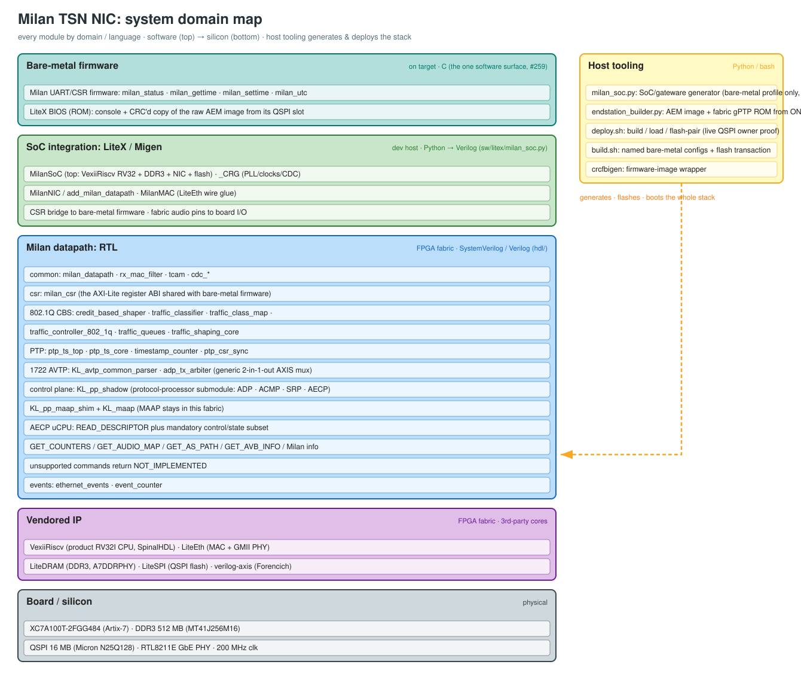

# System domain map

Which module lives in which domain / language  -  the whole Milan TSN NIC stack, from the
firmware down to the Artix-7 silicon, plus the host tooling that generates and deploys it.
Software at the top, hardware at the bottom.

*(Editable source: [`SYSTEM_DOMAIN_MAP.drawio`](../SYSTEM_DOMAIN_MAP.drawio)  -  open in
[diagrams.net](https://app.diagrams.net). Regenerate the `.drawio`/`.svg`/`.png` from one
layout model with [`SYSTEM_DOMAIN_MAP.gen.py`](../SYSTEM_DOMAIN_MAP.gen.py)
(`python3 docs/SYSTEM_DOMAIN_MAP.gen.py docs/SYSTEM_DOMAIN_MAP` → `.svg`+`.drawio`, then
`rsvg-convert -o …png …svg`). If you add modules, edit the generator, not the outputs.)*

## The domains

| Domain | Language / form | Where | Contains |
|--------|-----------------|-------|----------|
| **Boot firmware** | C | target (M-mode / ROM) | The LiteX BIOS in ROM and the bare-metal Milan firmware it hands control to: UART commands, CSR policy, identity, the AEM image copy. In **milan-fpga** `sw/firmware/`. |
| **SoC integration** | Python (Migen/LiteX) → Verilog | dev host | `MilanSoC`, `_CRG`, `MilanNIC`/`add_milan_datapath`, and `MilanMAC` — the glue that wires the fabric to the bare-metal CPU, LiteEth, LiteDRAM, LiteSPI, and board audio pins. All in **milan-fpga** [`sw/litex/milan_soc.py`](../../sw/litex/milan_soc.py). |
| **Milan datapath  -  RTL** | SystemVerilog | FPGA fabric | The TSN logic in **milan-fpga** `hdl/`: `milan_datapath`, `milan_csr` (the register contract), the PTP hardware clock, 1722 AVTP + AVDECC processing, the stand-alone 802.1Q CBS/classifier and PTP record-stamper blocks (verified, not in the shipped datapath), event counters, `rx_mac_filter`/`tcam`, CDC, and fabric I2S/TDM endpoints. |
| **Vendored IP** | 3rd-party cores | FPGA fabric | VexiiRiscv (the product profile is cacheless RV32I in machine mode; wider shapes remain buildable) and historical NaxRiscv, LiteEth (MAC + GMII/RGMII PHY), LiteDRAM (DDR3), LiteSPI (QSPI), verilog-axis (Forencich). Not ours  -  pinned upstream. |
| **Board / silicon** | physical |  -  | XC7A100T-2FGG484, DDR3 512 MB, 16 MB QSPI (N25Q128), RTL8211E GbE PHY, 200 MHz clock. |
| **Host tooling** | Python / bash | dev host | `milan_soc.py` (SoC gen), `deploy.sh` (`flash-pair` live-proves and transactionally updates QSPI), `patches/apply.sh`, `crcfbigen` — they **generate, flash and boot** the whole stack. |

The register map (`milan_csr`) is the contract that stitches three domains together: the RTL
defines it and every consumer reads it from the build's own `csr.csv`  -  see
[REGISTER_MAP.md](../reference/REGISTER_MAP.md). For the runtime data/control flow (rather than this
by-domain view) see [ARCHITECTURE.md](ARCHITECTURE.md); for the boot path,
[QSPI_FLASHBOOT.md](../integration/QSPI_FLASHBOOT.md).
