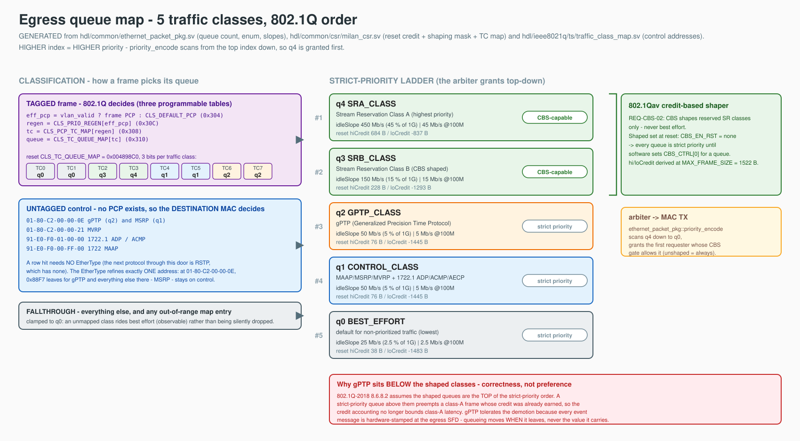

# Egress queue map (802.1Q traffic classes)

The end-station's TX datapath owns **five egress queues**, `q0 … q4`, and the
**higher index is the higher priority** — `q4` wins arbitration over `q0`. That
is the 802.1Q convention and it is also the convention the credit-based shaper
needs (see [Why gPTP sits below the shaped classes](#why-gptp-sits-below-the-shaped-classes)).

**It was six until VERSION `0x0014`**, and the sixth queue was a deliberate
spare at `q1`. It is gone, and the reason is measured, not aesthetic — see
[Why five and not six](#why-five-and-not-six).

Single source of truth in the RTL: `ethernet_packet_pkg::network_priority_t`
(the enum value **is** the queue index) and
`ethernet_packet_pkg::priority_encode` (scans from the top index down).
The CSR view is [REGISTER_MAP.md](REGISTER_MAP.md) — `CAP.num_queues`,
`CLS_TC_QUEUE_MAP` (`0x310`) and the per-queue CBS window at `0x400`.

> **THE QUEUE MAP IS UNCHANGED BY THE 2026-08-13 SUBSTITUTION; ITS SRP INPUTS
> MOVED.** The lwSRP applicant that supplied the reservation is deleted along
> with the rest of this repository's 1722.1/SRP plane; SRP is the pinned
> `protocol-processor` submodule's now, and the datapath takes the **granted
> slope, the adopted domain priority/VID and the per-stream admission bit**
> off its class-D face every clock. Nothing in the classifier, the queues, the
> credit arithmetic or the reset slopes moved. One ordering property changed
> shape and is written up honestly in
> [CBS slope ordering](#cbs-slope-ordering-after-the-substitution) below.


## Contents

- **[The map at a glance](#the-map-at-a-glance)** — One picture, *generated from the RTL* rather than drawn, with the regenerate command. It is built to make two things hard to misread, both of which have already been "fixed" the wrong way once: gPTP sits below both shaped classes deliberately, and no queue is CBS-shaped at reset.
- **[The map](#the-map)** — The five-row table. Read the "classified by" column first — three non-overlapping rules decide everything: tagged traffic by PCP, untagged control by destination MAC, the rest falls to q0. Expressing the control rows as a PCP mapping would be fiction, and until `0x0012` that fiction *was* the implementation.
- **[Why five and not six](#why-five-and-not-six)** — The six-queue map did not place: 282 slices short with LUTs at 99.84 % and flip-flops at 42 %, so combinational logic was the binding resource. The spare queue went because it carried no traffic. The sub-sections are unusually candid — the recovery is an **estimate** (≈147–314 slices against 282 needed, no Vivado run), so five queues must not be assumed to place either.
- **[PCP → traffic class → queue (tagged traffic)](#pcp--traffic-class--queue-tagged-traffic)** — The four-step table chain with its reset values, and the resulting PCP→queue row. The detail that matters when reprogramming: an entry naming a queue ≥ the queue count is **clamped to q0**, not handed to the demux, which would silently drop the frame — still load-bearing because 5 is not a power of two and three codes name nothing.
- **[Untagged control traffic is classified by destination MAC](#untagged-control-traffic-is-classified-by-destination-mac)** — The reserved-address table plus the three cases it cannot settle by itself: gPTP and MSRP share one address and are split by EtherType, AECP has no group address so its arm keys on EtherType and is documented as the weakest rather than dressed up, and a *tagged* `0x22F0` stays a stream. Also why there is no EtherType precondition at all — an RSTP BPDU has none to match.
- **[CBS reset slopes](#cbs-reset-slopes)** — The per-queue idleSlope, hiCredit and loCredit, summing to 72.5 % under the 75 % ceiling. Two decisions worth knowing: the removed spare's 2.5 % is left unallocated on purpose, and every queue powers up **unshaped** because shaping q0 at reset once paced all best-effort TX to ~250 Mbit/s on silicon.
- **[Why gPTP sits below the shaped classes](#why-gptp-sits-below-the-shaped-classes)** — Written because someone will read the ordering as a bug. Three arguments: CBS's latency bound assumes the shaped queues are on top, gPTP is stamped at the egress SFD *downstream* of the arbiter so queueing shifts when it leaves and not what it says, and the measured service — 9.18 % of the port, worst gap 23.55 µs — is 40× what 802.1AS consumes. Ends by retiring the misdiagnosis that started the worry.
- **[FQTSS: what is actually measured](#fqtss-what-is-actually-measured)** — The clause-34 checks with their numbers, including the non-vacuity control that proves the split is the shaper and not the arbiter (CBS off → q4 takes 100 %). Then the honest part: the reservation is **over-delivered** — 90.8 % of the port at a 45 % slope — with the mechanism spelled out. Size a reservation against the delivered share, not the configured slope.
- **[CBS slope ordering after the substitution](#cbs-slope-ordering-after-the-substitution)** — The one thing the protocol-processor SRP engine does differently from the deleted `KL_lwsrp_bw_gate`: it asserts admission and slope in the *same* cycle instead of sequencing them around a hold. Equal on the opening edge, conservative on the closing one — and what is genuinely lost is the hold as a named, testable behaviour.
- **[Ingress (RX to the CPU): two queues](#ingress-rx-to-the-cpu-two-queues)** — The RX split is now gPTP versus everything else, and the section records what that *cost*: the TCP flow-hash split that broke the single-NAPI ACK ceiling is gone and bulk RX reverts to the one-hart number. Also the reflash-gated procedure for raising the AX to two queues, which moves every DMA window by `0x74`.
- **[Where the fabric bypasses all of this](#where-the-fabric-bypasses-all-of-this)** — The scope limit on the whole page: only CPU-originated frames traverse the classifier, the queues and the shaper. Every fabric engine injects downstream, so these assignments bite a software AVDECC controller or MRP stack and nothing else.

## The map at a glance



*Which queue does a frame land in, who beats whom, and which classes may be
credit-shaped* — one picture, and **it is generated, not drawn**:
[`egress_queue_map.gen.py`](../diagrams/egress_queue_map.gen.py) parses the queue
count, the enum, the reset idleSlopes, the reset hi/loCredit, the reset shaping
mask, the reset TC→queue map and the reserved control addresses straight out of
[`hdl/common/ethernet_packet_pkg.sv`](../../hdl/common/ethernet_packet_pkg.sv), [`hdl/common/csr/milan_csr.sv`](../../hdl/common/csr/milan_csr.sv) and
[`hdl/ieee8021q/ts/traffic_class_map.sv`](../../hdl/ieee8021q/ts/traffic_class_map.sv). Change the queue count in the package
and the drawing reflows — ranks renumber, the CBS bracket follows the SR
classes, and a TC map entry that no longer names a real queue is drawn as the
`q0` clamp it becomes. Regenerate with:

```
python3 docs/diagrams/egress_queue_map.gen.py docs/diagrams/egress_queue_map
rsvg-convert -w 2000 docs/diagrams/egress_queue_map.svg -o docs/diagrams/egress_queue_map.png
```

Two things the picture makes hard to misread, both of which have already been
"fixed" the wrong way once: **gPTP sits below both shaped classes on purpose**,
and **no queue is CBS-shaped at reset** (`CBS_EN_RST` is all zeros — the shaper
is opt-in per queue, and shaping `q0` once paced all best-effort TX to
~250 Mbit/s, see [CBS_DEFAULT_SHAPING_BUG.md](../findings/CBS_DEFAULT_SHAPING_BUG.md)).

## The map

| Queue | Enum | Purpose | Classified by | Shaping |
|-------|------|---------|---------------|---------|
| **q4** | `SRA_CLASS` | **SR class A** — every AVB stream MSRP reserved, per the reservation domains | **PCP** (3) on the SR VID | **CBS** (802.1Qav) |
| **q3** | `SRB_CLASS` | **SR class B** — not used today; provisioned so an MSRP class-B domain has somewhere to land | **PCP** (2) on the SR VID | **CBS** (802.1Qav) |
| **q2** | `GPTP_CLASS` | 802.1AS / gPTP. Today these frames come from the CPU (the PTP daemon), so this is the CPU's sync lane | **DMAC** `01-80-C2-00-00-0E` + EtherType `0x88F7` | strict priority |
| **q1** | `CONTROL_CLASS` | MAAP, MSRP, MVRP, and IEEE 1722.1-2021 ADP / ACMP / AECP | **DMAC** (reserved group address table) | strict priority |
| **q0** | `BEST_EFFORT` | everything else, to and from the CPU | fallthrough | strict priority — **never CBS**, see below |

**Read the "classified by" column before the rest of this page.** There is one
rule per kind of traffic, and they do not overlap:

* **Tagged traffic carries a PCP, so 802.1Q decides.** That is the AVTP streams,
  and the three programmable tables below route them — to the CBS-shaped
  **q4 / q3**.
* **Untagged control traffic carries no PCP at all**, so it is classified on the
  reserved **destination MAC address**, the same thing a bridge itself keys on.
  That is gPTP, MSRP, MVRP and the 1722.1 trio — **q2 / q1**. See
  [Untagged control traffic is classified by destination MAC](#untagged-control-traffic-is-classified-by-destination-mac).
* Everything else falls through to **q0**.

Expressing the q2/q1 rows as a PCP mapping would be fiction: those frames have
no tag, so the only PCP the tables could apply to them is the *port default*,
which is one value for the whole port. Until VERSION `0x0012` that is exactly
what happened and the control row was **dead on the wire** — documented but not
implemented.

## Why five and not six

The six-queue map **did not fit the AX7101** (`xc7a100t`). Three Vivado seeds
failed placement identically:

```
ERROR: [Place 30-487] ... 15850 slices in the device, of which 11673 are available,
                          however the unplaced instances require 11955 slices
Luts: 63298 (combined) 72347 (total), available capacity: 63400
Flip flops: 53341, available capacity: 126800     <- FFs are NOT the constraint
```

**282 slices short, with LUTs at 99.84 % of capacity and flip-flops at 42 %** —
so the binding resource was combinational logic, not state. The 4 → 6 step had
added two CBS slope engines, two queue FIFOs and a wider CSR decode to a design
that already placed at 99.93 % slice occupancy.

What went is the queue that carried **no traffic**: the spare. Nothing was ever
mapped to it, no protocol was waiting for it, and every other class keeps its
rank, its shaping and its bandwidth share — only the indices below SR class B
shift down by one. Every user of the map is symbolic (`SRA_CLASS`,
`GPTP_CLASS`, …), so the renumbering touches the enum, the two CSR reset words
and this page, and nothing else.

Do not reintroduce a spare "for symmetry". Inserting a class later means
renumbering, and renumbering is cheap here precisely because nothing outside
this page and `ethernet_packet_pkg` knows an index.

### How much this recovers — an ESTIMATE, and why it may not be enough

> **RESOLVED 2026-07-27 — it placed, and it met timing.** The prediction below
> was tested: three Vivado seeds of the five-queue map all placed and **all met
> timing** (best WNS **+0.147 ns**), and that bitstream is now flashed and
> running — see
> [`../findings/FLASH_0x0014_0727.md`](../findings/FLASH_0x0014_0727.md).
>
> The estimate was good on LUTs and **misleading on the thing that actually
> binds**. Predicted ≈147–314 slices recovered from the queue reduction alone;
> delivered, across the queue reduction *plus* the four logic levers *plus* the
> LPF prune, **−5,216 LUT** (61,959 → 56,743, 97.7 % → 89.5 %) — yet slice
> occupancy moved only **99.93 % → 99.65 %**, leaving **fifty-five slices free**.
> LUT count and slice count are not proportional at this occupancy, so a LUT
> recovery does not convert to slices at anything like face value. Read the
> estimate below as the record of a prediction that was right in direction and
> optimistic in units.

> **Everything below this line is the ORIGINAL ESTIMATE, kept as written.**
> Every figure is either open-synthesis output (`yosys`, not Vivado) or
> arithmetic on two Vivado reports that are not otherwise identical builds. At
> the time it was written no Vivado run had been made for the 5-queue map — see
> [What is not verified](#what-is-not-verified).

**Estimate**, from device-mapped open synthesis (`yosys 0.66`,
`synth_xilinx -family xc7`, `stat -top` over the whole hierarchy; run
2026-07-27 against this tree and `origin/main`), 6 queues vs 5, per top:

| top | LUT1..6 | +INV | CARRY4 | FF | BRAM | DSP |
|---|---|---|---|---|---|---|
| `classifier_wrap` | −2 | −2 | 0 | 0 | 0 | 0 |
| `queues_wrap` | −157 | −159 | −3 | −162 | 0 | 0 |
| `shaper_core_wrap` | −703 | −1125 | −99 | −406 | 0 | −3 |
| `datapath_wrap` | −613 | −1030 | −105 | −507 | −3 | −3 |
| `milan_csr` | −138 | −142 | 0 | −194 | 0 | 0 |
| **`milan_datapath`** | **−812** | **−1224** | **−105** | **−590** | **−3** | **−3** |

The classifier is unchanged because `ceil(log2 5)` is still 3 — `tdest` does not
narrow. The saving is one `credit_based_shaper` (its 3 DSPs and its serial
divider), one `axis_fifo` (3 BRAM at the deployed depth) and one slice of the
CSR decode.

**Converting that to slices is where the honesty is required.** Two independent
estimates, both anchored on real Vivado reports:

* **Vivado-to-Vivado.** The shipping 8×8 bitstream (4-queue map) placed at
  **15 839 / 15 850 slices** — 99.93 %, 11 slices spare
  ([Section 6.2 of the historical NxN architecture](../NXN_ARCHITECTURE.md#62-lever-3-priced-is-removing-the-render-lpf-worth-it-2026-07-26)). The 6-queue build needed
  `15850 − 11673 + 11955` = **16 132** slices. That is **+293 slices for +2
  queues ≈ 147 slices per queue**, so dropping one gives back **≈ 147** — barely
  half the 282 needed. (Caveat: the 6-queue round also added the DMAC control
  table and the wider CSR decode, so not all of the 293 is queue.)
* **Scaled synthesis.** At the failing build's ratio of 63 298 LUTs / 16 132
  slices ≈ 3.9 LUTs per slice, the measured **−812 … −1224** LUTs is
  **≈ 208 … 314 slices**, depending on whether Vivado absorbs yosys's bare `INV`
  cells into neighbouring LUTs (it usually does, which argues for the low end).

So the **estimated** recovery is somewhere in **≈ 147 … 314 slices against 282
required**, and the estimate anchored on real Vivado numbers sits at the
*bottom* of that range. **Five queues on their own must not be assumed to
place.**

**Both follow-on levers have since been spent (2026-07-27,
[Section 6.3 of the historical NxN architecture](../NXN_ARCHITECTURE.md#63-area-round-2026-07-27-logic-levers-measured-no-vivado)), so the 5-queue map no
longer stands alone.** `LPF_P = 0` (**428 LUT / 756 FF ≈ 109 slices**, the
shipping 8×8 place report's own row) is now declared in
`board.constraints.render_lpf` of the `ax7101` config and rides `sweep.sh`
and `build.sh cfg_ax8x8`; four logic levers in `KL_chan_map_render`, the
lwSRP walker and the two ACMP context engines added an **estimated
383 … 877 slices** on top. (Three of those four blocks were **deleted
outright** on 2026-08-13 with the 1722.1/SRP plane, which returns far more
than the levers ever would have — measured in
[historical protocol-processor area measurement](../findings/PP_SHADOW_AREA_0812.md).
The ladder below is kept as the record of the decision that was taken at the
time.) The ladder — 282 over, −147 for the queue,
−109 for the filter, −383…877 for the logic — leaves **357 … 851 slices of
estimated margin**. That is an estimate, not a placement; the caveats in
*What is not verified* below still apply in full, and a build is still the
only thing that settles it.

### What is not verified

Stated plainly, because the numbers above are easy to over-read:

* **No Vivado run.** Nothing here was synthesised, placed or routed by Vivado
  for the 5-queue map. The slice figures are converted from yosys cell counts
  or inferred from two earlier Vivado reports. **A 55-minute build is the only
  thing that settles whether this places.** `LPF_P = 0` and the four logic
  levers of Section 6.3 are already in the shipping argv, so that build is the one to
  run — there is no second lever left to hold back for a retry.
* **The two Vivado reports being differenced are not the same design.** The
  shipping 8×8 place report is a 4-queue build; the failing report is a
  6-queue build that also added the DMAC control table, the out-of-range clamp
  and a wider CSR decode. Attributing all 293 slices to "two queues"
  over-credits the queues, so the 147 slices/queue figure is, if anything,
  optimistic on the low side and pessimistic on the high side. It is a bound,
  not a measurement.
* **yosys is not Vivado.** Its mapping leaves ~22 000 bare `INV` cells in
  `milan_datapath` that Vivado would absorb into neighbouring LUT inputs, which
  is exactly why the table gives both `LUT1..6` and `+INV` columns and why the
  slice range is wide. A flattened (`-flatten`) run of the same design put
  `milan_datapath` at **+97 LUTs**, i.e. optimisation noise swamped the signal
  at 55 k cells — that number is reported here as a caution, not as evidence,
  and it is the reason the hierarchical figures are the ones quoted.
* **Nothing was run on hardware.** No board, no bench, no bitstream. Timing
  (WNS) is likewise unknown; removing logic usually helps, but "usually" is not
  a measurement.
* **`REQ-CBS-07` over-delivery is CLOSED** (the wire-time debt law, gh #63 I5;
  it was open at the time of the renumbering): each CBS carries a per-queue
  Q16 wire-time debt and accrues idleSlope only while it is zero, so the
  shaped share tracks the reservation instead of over-delivering.
  [`tb/verilator/shaper_core`](../../tb/verilator/shaper_core) now measures 47.04 % delivered share at the
  450 Mb/s class-A slope (was 90.82 % under the old accrual).

## PCP → traffic class → queue (tagged traffic)

Classification of **VLAN-tagged** frames is three programmable tables in series
(`traffic_class_map.sv`, `REQ-CLS-01..04`):

```
eff_pcp = vlan_valid ? frame PCP : CLS_DEFAULT_PCP      (0x304)
regen   = CLS_PRIO_REGEN[eff_pcp]                       (0x30C)
tc      = CLS_PCP_TC_MAP[regen]                         (0x308)
queue   = CLS_TC_QUEUE_MAP[tc]                          (0x310)
```

At reset `CLS_PRIO_REGEN` and `CLS_PCP_TC_MAP` are the identity
(`0x00FAC688`), so **traffic class == PCP**, and `CLS_TC_QUEUE_MAP` resets to
`0x004898C0` — 3 bits per entry (`ceil(log2 5)` is still 3), giving:

| PCP (= TC at reset) | 802.1Q name | Queue |
|---------------------|-------------|-------|
| 0 | BE, best effort | q0 |
| 1 | BK, background | q0 |
| 2 | EE / **SR class B** (802.1Q-2018 Table 34-1 default) | **q3** |
| 3 | CA / **SR class A** (802.1Q-2018 Table 34-1 default; the PCP `KL_aaf_packetizer` and lwSRP actually put on the wire) | **q4** |
| 4 | VI, video | q1 |
| 5 | VO, voice | q1 |
| 6 | IC, internetwork control | q2 |
| 7 | NC, network control | q2 |

Every queue is mapped — there is no spare left to leave empty. Software is free
to reprogram all three tables; an entry that names a queue
`>= NUMBER_OF_QUEUES` is **clamped to q0** rather than being handed to the
demux, which would silently drop the frame (`axis_demux.v`:
`drop_ctl = drop || select >= M_COUNT`). That clamp exists because the queue
count is not a power of two — **5 is not either**, so it is still load-bearing:
three of the eight codes (5, 6, 7) name nothing.

An **untagged** frame has no PCP, so `eff_pcp` becomes `CLS_DEFAULT_PCP` — one
value for every untagged frame on the port. That is why the tables cannot route
control traffic and why the fast paths below exist.

## Untagged control traffic is classified by destination MAC

`traffic_class_map.sv` carries a **table of reserved control group addresses**
(`REQ-CLS-10`, VERSION `0x0012`). An untagged frame addressed to a row in that
table is control traffic:

| Protocol | Destination MAC | EtherType | Queue |
|----------|-----------------|-----------|-------|
| gPTP (802.1AS) | `01:80:C2:00:00:0E` | `0x88F7` | **q2** |
| MSRP | `01:80:C2:00:00:0E` | `0x22EA` | **q1** |
| MVRP | `01:80:C2:00:00:21` | `0x88F5` | **q1** |
| 1722.1 ADP / ACMP | `91:E0:F0:01:00:00` | `0x22F0` | **q1** |
| 1722 MAAP | `91:E0:F0:00:FF:00` | `0x22F0` | **q1** |
| 1722.1 AECP | the **peer entity's unicast MAC** | `0x22F0` | **q1** |

Why the address and not the EtherType: these are the addresses a bridge
classifies on, they are what the protocols are actually defined by, and a
destination address is far harder to forge usefully than an EtherType. **A row
hit needs no EtherType at all** — see the RSTP note below for why that is
deliberate.

Three things the table alone does not settle, handled explicitly:

* **gPTP and MSRP share `01:80:C2:00:00:0E` and go to different queues.** The
  address says "reserved control"; the EtherType then splits that **one**
  address — `0x88F7` leaves for q2, everything else at that address (MSRP
  included) stays on q1. In the RTL the split is simply that the gPTP arm is
  tested first. [`tb/verilator/cls`](../../tb/verilator/cls) and [`tb/verilator/classifier`](../../tb/verilator/classifier) both drive the
  two protocols at that single address and assert they land on different queues.
* **AECP has no group address.** An AECP command or response is addressed to the
  *peer* entity's individual MAC; on egress that is the controller we are
  answering, so our own station MAC (which `rx_mac_filter` knows, `REQ-MAC-02`)
  is the **source** here and is no help. There is nothing to look up, so this
  one arm — and only this one — is keyed on the EtherType: *untagged `0x22F0`
  to an individual (unicast) address*. It is the weakest arm in the block and is
  documented as such rather than dressed up: a forged untagged `0x22F0` to any
  unicast destination reaches q1. The exposure is bounded, because q1 sits below
  gPTP and below both CBS-shaped classes, so the most a forgery buys is a lift
  over best effort — it cannot touch stream or sync latency.
* **A tagged `0x22F0` is an AVTP *stream*, not control.** The fast path requires
  the frame to be untagged, so a tagged `0x22F0` keeps its PCP and rides q4/q3
  exactly as before — including when it is addressed to one of the control group
  addresses above. This is asserted directly in both classifier suites and as a
  config-independent invariant across the 200 000-frame randomised sweep.

**RSTP is anticipated, and it is why the table has no EtherType precondition.**
RSTP BPDUs ride the Bridge Group Address `01:80:C2:00:00:00`, and **a BPDU has
no EtherType**: it is an 802.3/LLC frame whose two octets at that offset are a
*length*, with the protocol identified by the LLC DSAP/SSAP `0x42`. Any
`ethertype == X && dmac == Y` shape would lock it out permanently. Adding RSTP
is therefore **a new row in `CTRL_DMAC_TBL`** (plus whatever LLC decode the
queue choice needs) rather than a redesign. It is **not implemented today**:
there is no row, no LLC/DSAP decode anywhere in `hdl/`, and no queue has been
chosen for it — and since VERSION `0x0014` there is no spare queue to put it
in, so whoever adds it either shares `CONTROL_CLASS` or renumbers. Both classifier suites drive
`01:80:C2:00:00:00` today as a **negative**, asserting it classifies like any
other unknown address; whoever adds the row will see those checks flip, which is
the point.

**gPTP fast path (unchanged).** EtherType `0x88F7` short-circuits the tables and
always lands on `GPTP_CLASS` (q2), in both PCP and legacy modes. With
`CLS_CTRL[1]` set (`REQ-CLS-07`) the fast path additionally demands the reserved
destination `01-80-C2-00-00-0E`, so a spoofed `0x88F7` cannot steal the sync
lane. `REQ-CLS-10` did not touch this arm.

### The enable bit, and why it ships ON

The control fast path is gated by **`CLS_CTRL[2]`** (`ctrl_class`), and unlike
`CLS_CTRL[1]` it **resets to 1**. `CLS_CTRL` therefore resets to `0x5`, not
`0x1`. The reasoning, since the house pattern for a wire-behaviour change is
normally to ship it off:

* `CLS_CTRL[1]` ships **off** because it *restricts* an arm silicon already
  depends on — turning it on can only take a queue away from a frame that has
  it today, so software opts in. `CLS_CTRL[2]` is the opposite: it *implements* a
  documented row that was never on the wire. The frames it moves are on q0
  today and `CONTROL_CLASS` outranks q0, so the change cannot take service away
  from anything. There is no working behaviour to protect.
* The map is the spec. Shipping the bit off would leave the control row of this
  very page fiction, which is the defect being fixed.
* It still gets a bit at all — the gPTP fast path has none — because **a fast
  path is unbypassable by the tables**: once control frames short-circuit, no
  `CLS_PCP_TC_MAP` / `CLS_TC_QUEUE_MAP` programming can move them. `CLS_CTRL[2]
  = 0` is the only way back to table-only classification, and it restores the
  VERSION `0x0011` wire behaviour **bit-for-bit** — which also makes it a clean
  bisect lever if control traffic on q2 ever surprises anyone in the field.

## CBS reset slopes

`CBS_*_RST` in `milan_csr.sv`, mirroring `ethernet_packet_pkg::IDLE_SLOPE_1G`
and its `calc_hi_credit`/`calc_lo_credit` companions
(`MAX_FRAME_SIZE = 1522`):

| Queue | idleSlope @ 1 Gb/s | share | hiCredit | loCredit |
|-------|--------------------|-------|----------|----------|
| q4 SR class A | 450 Mb/s | 45 % | 684 | −837 |
| q3 SR class B | 150 Mb/s | 15 % | 228 | −1293 |
| q2 gPTP | 50 Mb/s | 5 % | 76 | −1445 |
| q1 control | 50 Mb/s | 5 % | 76 | −1445 |
| q0 best effort | 25 Mb/s | 2.5 % | 38 | −1483 |

Σ = 725 Mb/s = **72.5 %** of the port rate, under the 75 % `REQ-CBS-03`
ceiling, and the shaped pair alone is 600 Mb/s = 60 %, comfortably inside the
802.1Q-2018 Section 34.3.1 ceiling that actually constrains SR classes. Every class
keeps the share it had at six queues; the spare's 2.5 % is **left
unallocated**, because `REQ-CBS-03` is a ceiling rather than a target and
handing it to best effort would change a live class's provisioning for no
reason. `IDLE_SLOPE_100M` is the same shares of 100 Mb/s.

**Every queue powers up UNSHAPED** (`CBS_EN_RST = 0b00000`) and that is not an
oversight. Shaping q0 at reset once paced *all* best-effort TX to ~250 Mbit/s on
silicon — see [CBS_DEFAULT_SHAPING_BUG.md](../findings/CBS_DEFAULT_SHAPING_BUG.md).
Software opts a queue in through `CBS_CTRL[0]` once a reservation exists; the
SRP path does it automatically for the queue named in `LWSRP_CTRL[4:2]`
(reset **4**; it was 5 while the map had six queues) when a reservation is
granted — the grant is the protocol processor's since 2026-08-13, the CSR
field and the mux are unchanged. The field keeps 3 bits, so codes 5-7 name no queue at all —
`milan_datapath` gates the slope mux on `qidx < NUM_QUEUES` so a bogus index
leaves the `0x400` values alone.

## Why gPTP sits below the shaped classes

gPTP is at **q2, underneath the CBS-shaped q4 and q3**. Someone will eventually
read that as a bug and "fix" it. It is not a bug, and it is not a preference —
it is a correctness requirement:

* **802.1Q credit-based shaping assumes the shaped queues are the top of the
  strict-priority order.** The credit accounting in 802.1Q-2018 Section 8.6.8.2 bounds
  the class-A latency by reasoning about how long a shaped queue can be kept
  from transmitting: at most one maximum-length frame from a lower-priority
  queue, plus the queues above it that the standard *knows about*. A strict-
  priority queue placed **above** the shaped classes can preempt a class-A frame
  whose credit is already earned, for an amount of time the credit model does
  not account for. The shaper still runs, but the guarantee it computes is no
  longer the guarantee the network gets. In short: a CBS guarantee does not
  survive an unshaped higher-priority queue sitting above the shaped classes.
* **gPTP does not need to be on top, because it is not timed by when it
  leaves.** Every event message is hardware-timestamped at the **egress SFD**
  in `ptp_ts_top`, downstream of this arbiter. A queueing delay therefore
  changes *when* the message goes out, not the timestamp it carries — and the
  residence time is exactly what the protocol's correction field exists to
  absorb. What would genuinely hurt gPTP is timestamp *error*, and that is
  unaffected by queue order.
* **The load argument is not close, and it is measured, not asserted.** A Milan
  class-A domain at 48 kHz runs 8000 frames/s per stream; gPTP runs 8–16
  frames/s. [`tb/verilator/shaper_core`](../../tb/verilator/shaper_core) (FQTSS-4) drives q4 shaped at its 450 Mb/s
  class-A reset slope and permanently backlogged, offers q2 continuously, and
  measures what q2 gets: **9.18 % of the port, worst service gap 368 slots =
  23.55 µs** of 1 Gb/s wire time — unchanged by the renumbering, as it must be.
  8–16 frames of 64–90 B per second is ~0.2 % of
  a 1 Gb/s port, so q2 is offered **more than 40×** what 802.1AS can consume, and
  the gap is bounded because a credit-shaped q4 *must* yield periodically by
  construction.

Note also that the historical worry here was misdiagnosed: the TX
timestamp timeouts of 2026-07-13 were **not** queue starvation. Silicon was
running the legacy classifier at the time and gPTP already outranked bulk TCP;
the delay lived in the driver's single 256-slot TX descriptor ring, upstream of
the classifier entirely. The fix for that class of problem is a priority TX
ring/doorbell, not a queue promotion.

## FQTSS: what is actually measured

802.1Q-2018 clause 34 ("Forwarding and Queuing Enhancements for Time-Sensitive
Streams") is the layer *above* both the credit arithmetic and the arbiter, and
it is the property this whole ordering argument rests on. It is gated in
[`tb/verilator/shaper_core`](../../tb/verilator/shaper_core) (and, for the register view software sees, in
[`tb/verilator/csr`](../../tb/verilator/csr)):

| Check | Clause | Result |
|-------|--------|--------|
| **Bandwidth availability.** Σ idleSlope over the SR classes, and over every queue, at both link rates | Section 34.3.1 / `REQ-CBS-03` | SR A+B = **600 Mb/s = 60 %** of 1 Gb/s; all five = **725 Mb/s = 72.5 %** at 1 G and 72.5 % at 100 M. Class A's slope must also exceed class B's. Read out of `ethernet_packet_pkg` **and** out of the `0x400` CSR window, so the package and the registers cannot drift apart. |
| **The shaped class and best effort share the port.** q4 shaped and permanently backlogged, q0 unshaped and permanently backlogged | Section 8.6.8.2 | q4 outranks q0 absolutely, so only the credit gate can stop it -- and it does: **11.97 / 22.91 / 47.04 %** of the port at idleSlope 100 / 200 / 450 Mb/s, q0 taking the rest. Neither queue is ever starved, and the split is monotone in idleSlope. (Pre-debt-law these read 13.70 / 30.11 / 90.82 % -- the `REQ-CBS-07` over-delivery.) |
| **Non-vacuity.** Same stimulus with CBS switched off | — | q4 takes **100.00 %**. So the split above *is* the shaper, not the arbiter and not the harness. |
| **gPTP is not starved by a saturating class A** | Section 8.6.8.2 | 52.96 % of the port under the debt law (the shaped class no longer over-consumes), worst gap 3.07 µs -- see above. |
| **Admission.** A reservation whose slope would break the ceiling is refused | Section 34.3.1 | Was `KL_lwsrp_bw_gate`, which carried the 750e6 / 75e6 limits in RTL and tore down an over-budget TSpec on a live reservation -- **that block and its suite are deleted (2026-08-13)**; admission is now the protocol processor's `KL_srp_admission`, which walks its sources and latches the grant, the granted slope and the running Σ together at round end. The config side is unchanged: builder gate 18d rejects an over-subscribed class-A request before a bitstream exists. |

**The reservation is honoured and wire-time paced** (`REQ-CBS-07` closed, the
gh #63 I5 debt law): each CBS carries a per-queue Q16 wire-time debt — bytes
per accepted beat, plus the 24-octet per-frame overhead and the MAC min-frame
pad at tlast, drained at the port byte rate — and idleSlope accrues only while
the debt is zero, which is exactly the 802.1Q-2018 8.6.8.2 (d)/(e) `transmit`
variable made honest against an unpaced MAC FIFO. At the 450 Mb/s class-A
reset slope the shaped queue now takes 47.0 % of the port where the old
accrual gave it 90.8 % against a 45 % reservation. The per-byte debit is
unchanged and exact. Steady-state egress is
`(S/8) x L*link / (L*link + 24*S)` client bytes/s for L-byte frames — the
per-frame overhead comes out of the shaped rate (3.6 % under `S/8` at
100 Mb/s / 64 B frames), a deliberate conservative stance: the SRP idleSlope
math (`MaxFrameSize + 42`) reserves that overhead, and the old law handed it
out twice. [`tb/verilator/shaper_core`](../../tb/verilator/shaper_core) asserts the law's own fixed point and
that delivery never exceeds `S/8`; [`tb/verilator/cbs`](../../tb/verilator/cbs) pins the debt
arithmetic state-for-state against a reference model.

## CBS slope ordering after the substitution

An honest change, not a regression, and worth writing down because the
invariant it protects is the one thing on this page that could hurt the wire.

The deleted `KL_lwsrp_bw_gate` sequenced the two events explicitly. On
activation it **joined a stream's idleSlope into the running Σ first**, held,
then opened that stream's gate; on teardown it **closed the gate first**,
held, then removed the slope. The invariant that bought: *no stream ever
transmits against a slope the shaper has not budgeted*.

The protocol processor has no such hold. `KL_srp_admission` walks its sources
and latches the grant, the granted slope and the running sum **together** at
round end, and the published admission bit is that grant ANDed with the live
request. So the two edges land like this:

* **Opening edge — equal, never worse.** A source's gate can only rise once a
  round has granted it, and that same round is what put its slope into the
  sum. Gate and Σ therefore change on the *same* edge, never gate-first. The
  hold existed to let the slope settle through the CSR mux; that mux is
  combinational and in this clock domain, so there is nothing to settle.
* **Closing edge — conservative, not permissive.** The admission bit drops the
  cycle the request drops, but the sum is round-latched and keeps the stopped
  stream's slope until the next round completes. The shaper goes on budgeting
  bandwidth for a stream that has already stopped: **briefly high for zero
  traffic**, which is the safe direction.

**Neither edge lets a stream transmit against an un-budgeted slope**, so the
invariant holds on both. What is genuinely lost is the bw-gate's explicit
hold as a *named, testable behaviour*: the ordering is now a consequence of
the admission round's structure rather than a sequencer anyone can point at,
and the suite that used to point at it is deleted.

## Ingress (RX to the CPU): two queues

The RX side splits into **two** queues, and the split is gPTP vs everything
else (`RxSteer` in [`sw/litex/milan_soc.py`](../../sw/litex/milan_soc.py), present when
`board.constraints.rx_queues >= 2`):

| RX queue | Contents |
|----------|----------|
| **q1** | frames whose DMAC is `01-80-C2-00-00-0E` **and** whose (inner) EtherType is `0x88F7` — the same test `traffic_class_map` applies on egress under `REQ-CLS-07`. One detector, one rule, both directions. |
| **q0** | everything else |

Each queue is its own DMA ring writer, its own interrupt and its own NAPI.
`steer_hash_sel[0] = 1` forces everything to q0 (bypass).

**What this replaced, honestly.** `RxSteer` used to be a TCP 4-tuple flow hash
built for throughput: it split one MTU-1500 RX stream into two flow-consistent
queues so two TCP flows' ACK/receive processing ran on two harts, which is how
the single-NAPI ACK-processing ceiling was broken (measured RX 223 Mbit — see
[RX_PERF_TUNING_MAP.md](../findings/RX_PERF_TUNING_MAP.md)). **That parallel
ACK split is gone.** Bulk RX is single-NAPI again and the RX throughput ceiling
reverts to the one-hart number.

What is bought instead is latency where it matters: PTP event messages no
longer sit behind bulk traffic in a shared ring. RX-side PTP latency is
precisely what once held `asCapable` false — late RX stamps, not a switch fault
([GPTP_RXPAD_ROOTCAUSE.md](../findings/GPTP_RXPAD_ROOTCAUSE.md)). A sync/pdelay
exchange is ~64–90 B at 8–16 frames/s, so the dedicated queue is essentially
never backlogged and its NAPI never competes with a 1500 B burst.

**Per-board `rx_queues`.** Both boards ship **2**: with `rx_queues = 1`
there is no steer block at all and PTP shares q0 with bulk, so PTP steering
is simply not implemented on such a build -- the D7 grandmaster-loss class.
The Arty carried 2 first; the AX7101 8x8 config was raised 1 -> 2 on
2026-07-28 (861f411e) with `boot_chain_pin.dma-ts`/`pcm-dma` moved to the
2-queue addresses, because flipping it moves every DMA window from `dma-ts`
onward by `0x74` and builder gate 19c refuses the change against a stale
`boot_chain_pin`. Any future queue-count change repeats that recipe: bump
`rx_queues`, re-pin, rebuild, reflash against the new `csr.csv`.

## Where the fabric bypasses all of this

The notification claim in this section is checked against the
[Milan feature status ledger](MILAN_FEATURE_STATUS.md):

<!-- milan-feature-status:start -->
| Feature ID | Status | Canonical value |
|---|---|---|
| `notifications.change-events` | `implemented` | - |
<!-- milan-feature-status:end -->

Only frames the **CPU** sends (`s_axis_tx_*` into `milan_datapath`) traverse the
classifier, the per-queue FIFOs and the CBS arbiter. The fabric engines inject
**after** the shaper, through the `adp_tx_arbiter` chain and the control-lane
IFG gasket:

* the AAF talker (`KL_aaf_packetizer` / `aaf_talker_i2s`) — paced by the SRP
  admission gate rather than by CBS;
* ADP, ACMP, MAAP, the CRF talker, and the MSRP/MVRP PDUs. Since 2026-08-13
  all of those except MAAP and CRF come from the protocol processor's single
  packed TX stream, and the control lane's merge is `ctl_tx_mux` — processor
  plus MAAP, two legs, one arbiter. **AECP responses ride that same packed
  stream**: the processor's AECP uCPU serves the current command inventory and
  emits a conformant `NOT_IMPLEMENTED` echo for commands outside it, driving the
  processor's solicited TX lane, so AECP frames do leave this device on the
  control lane. The unsolicited lane emits command-specific state-change
  responses plus the observed Milan Table 5.22 stream, AVB, path, lock and
  per-descriptor counter notifications. Counter emissions are limited to one
  per descriptor per second.

So the q4/q3/q1 assignments bite for **CPU-originated** traffic today: a
software AVDECC controller or a software MSRP stack lands on q1, gPTP from the
PTP daemon lands on q2, and everything else lands on q0. Moving the fabric
talker inside the shaper is a separate piece of work (the `is_1g` follow-up
noted in `milan_datapath.sv`).

That bounds what `REQ-CLS-10` changes on the wire, and the honest version is
worth stating: the fabric already emits ADP, ACMP, MAAP and the MSRP/MVRP
PDUs downstream of this classifier, so those frames never touched a
queue and are unaffected. What moves from q0 to q1 is **software**-originated
control traffic — a host AVDECC controller or a host MRP stack — plus anything
the fabric hands to the classifier in future. The map is now true for both.
