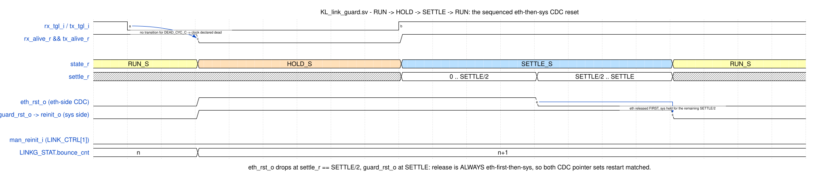

# Milan TSN CSR  -  register map (ABI)

> Production classification (needed / optional / debug, with rationale):
> [REGISTER_MAP_CLASSES.md](REGISTER_MAP_CLASSES.md).

Memory-mapped control/status registers for the Milan TSN NIC. This is the
**stable ABI** shared by the HDL (`hdl/common/csr/milan_csr.sv`), the Linux driver
(`../kl-linux-drivers`), and the device tree (`reg` of the `kl,dma-ether` node).
Satisfies `REQ-CSR-05`; implements the control surface for `REQ-CSR/PTP/CBS/CLS/
MAC/*` in [`REQUIREMENTS.md`](../../REQUIREMENTS.md).

* **Bus:** AXI4-Lite, 32-bit data, little-endian. **Base is host-specific**  -  the
  register *offsets* below are fixed, only the window base differs per SoC:
  `0x43C0_0000` on the Zynq PS build, **`0x9000_0000`** on the fully-FPGA VexiiRiscv
  (formerly NaxRiscv) SoC (an MMIO peripheral must live in the CPU IO region ≥
  `0x8000_0000`; the mem-map is identical across the two cores, so the ABI is unchanged). The
  device-tree `reg` base must match the target. Window 64 KB.
* **Access:** `RO` read-only, `RW` read-write, `W1C` write-1-to-clear,
  `W1S` write-1-to-set (self-clearing command strobe), `ROc` read latches/clears.
* Unused bits read 0; writes to `RO` fields are ignored; unmapped offsets read 0
  and `SLVERR` is **not** raised (OKAY) to keep the driver simple.
* **Timing (2026-07-16 config-in-RAM read path):** plain-RW readback is served
  from a write-through shadow BRAM — reads complete one clock later than the
  original mux (AXI4-Lite handshake absorbs it; no driver change). After reset
  the block holds `*READY` low for ~513 clocks while the defaults ROM is swept
  into the shadow, so soft-reset readback values are identical to before.
* `N` = `NUMBER_OF_QUEUES` (from `CAP.num_queues`, default **5** since
  VERSION `0x0014`; it was 6 from `0x0011` to `0x0013`). Queue **4 is the
  highest priority**, queue 0 the lowest (802.1Q order) — see
  [EGRESS_QUEUE_MAP.md](EGRESS_QUEUE_MAP.md).

## Contents

- **[Register groups](#register-groups)** — The one-screen index: base offset → what lives there, from `0x000` to `0x900`. Start here to find which group you want, then jump to its own section below.
  - [A group can be STRUCTURALLY absent (optional-block prunes, 2026-07-27)](#a-group-can-be-structurally-absent-optional-block-prunes-2026-07-27) — Six blocks can now be pruned at elaboration; all default PRESENT, so this map is exactly what a shipping build answers. Read it before trusting a zero: a pruned build keeps the window and the RW words but its RO words read a **structural** zero, and there is deliberately no capability bit to tell that apart from an idle block — check the build plan, not the register.
  - [0x000  -  Identification / IRQ](#0x000-----identification--irq) — `ID` = `"MILN"` for driver probe, the capability word, and the IRQ trio. `VERSION`'s description doubles as the gateware changelog — every minor from `0x0002` to `0x0017`, including why the queue count went 6 → 5 (three Vivado seeds failed placement 282 slices short), why `0x0016` makes every talker stamp `tu = 1` until software leases the clock, and why `0x0017` makes the channel-map RAMs readable at all.
  - [0x100  -  MAC control / status  (REQ-MAC-01..03)](#0x100-----mac-control--status--req-mac-0103) — Station address, IFG, link status, and the RX address filter's five-step decision order — note that `promisc` outranks even an explicit TCAM drop. Carries a real defect worth knowing: `is_1g` reset 1 meant a 100 Mb/s port admitted reservations against a 10× budget until software wrote the register. The multicast hash fold is given as an equation your `ndo_set_rx_mode` must match exactly.
  - [0x200  -  Statistics (RMON)  (REQ-MAC-04)](#0x200-----statistics-rmon--req-mac-04) — Nine counters behind a coherent snapshot latch, plus `STATS_CAP` — the register that tells "counted, nothing wrong" from "no event source in this build". Read it before believing a zero: with `i_mac_events` tied off, every lane read zero on both boards for months while every testbench passed.
  - [0x300  -  802.1Q classifier  (REQ-CLS-01..04)](#0x300-----8021q-classifier--req-cls-0104) — The three mapping tables and their reset values, then the caveat that reframes them: **these tables only route tagged traffic**. Control protocols are untagged and are classified on their reserved destination MAC instead, deliberately with no EtherType precondition — and gPTP short-circuits to a queue *below* both shaped classes, which is a correctness requirement rather than a preference.
  - [0x400  -  802.1Qav CBS (per queue)  (REQ-CBS-01..03)](#0x400-----8021qav-cbs-per-queue--req-cbs-0103) — Four registers per queue, the reset slope table (Σ 725 Mb/s = 72.5 %, under the 75 % ceiling), and write semantics down to how long a slope change takes to bite. Every queue powers up **unshaped** on purpose — shaping q0 at reset once paced all best-effort TX to ~250 Mbit/s on silicon.
  - [0x500  -  PTP hardware clock  (REQ-PTP-01..04, 06)](#0x500-----ptp-hardware-clock--req-ptp-0104-06) — The Q8.24 rate controls and the settime/adjtime/gettime strobes that give linuxptp its full clock-ops set. The latency-correction pair has a fixed sign in hardware — ingress subtracted, egress added — and must be applied on one side only, never both.
  - [0x700  -  RX destination-MAC TCAM filter  (REQ-MAC-02)](#0x700-----rx-destination-mac-tcam-filter--req-mac-02) — The exact alternative to the approximate hash filter: per-bit-masked destination-MAC match, one indexed entry per commit. Gives the whitelist and blacklist recipes and a worked ternary entry for a whole reserved multicast block.
  - [Link guard / MAC recovery (VERSION minor ≥ 0x0006)](#link-guard--mac-recovery-version-minor--0x0006) — The link-bounce supervisor, added here after `0x774` was misread as a TCAM register. The chronogram is the payload: the two resets do **not** release together — `eth_rst` drops half-way through SETTLE so both CDC pointer sets restart matched, which means reading the guard bit alone mid-episode gives you the wrong answer.
  - [0x778  -  Clock validity: the AVTP tu verdict  (VERSION minor >= 0x0016)](#0x778-----clock-validity-the-avtp-tu-verdict--version-minor--0x0016) — The register that stops this device claiming timestamps it cannot prove. Reset is `tu = 1`, so a board whose software never leases the sync claim declares uncertainty rather than health — and the section explains why the fix is a header bit and **not** a stream gate: Milan 5.3.7.3 forbids stopping the stream and 1722 7.5 forbids `tv = 0` on AAF. Also draws the line between what fabric can see for itself (PHC steps, grandmaster changes) and what only `ptp4l` knows.
  - [0x724  -  identity / playback / 802.1AS overlay](#0x724-----identity--playback--8021as-overlay) — Five words the softcore daemons write so the fabric ADP/AEM engines answer with wire truth instead of ROM defaults — board name, playback LPF enable, and the gPTP parent bridge clock identity behind AS_PATH.
  - [0x738  -  CRF media-clock sink  (Milan v1.2 7.3, KL_crf_rx)](#0x738-----crf-media-clock-sink--milan-v12-73-kl_crf_rx) — The measurement half of clock recovery: lock takes 8 clean PDUs and drops after 100 ms of silence. Note which word is *not* a loop input — `CRF_DELTA` carries the talker+transit phase constant; the servo steers on `CRF_RATE`, where 1 ppm = 512 units.
  - [0x750  -  CRF media-clock talker  (Milan v1.2 7.3.1, KL_crf_tx)](#0x750-----crf-media-clock-talker--milan-v12-731-kl_crf_tx) — Emits 500 PDU/s timestamped off the real audio-MMCM sample grid. All four identity words treat **reset 0 as AUTO**, deriving stream id and dest MAC from the MAAP block — which is why the claimed MAAP count has to be `N_STREAMS+1`.
  - [0x768  -  AECP GET_DYNAMIC_INFO scan forensics (BDBG)](#0x768-----aecp-get_dynamic_info-scan-forensics-bdbg) — Three read-only words latched at each record verdict of the `0x4B` batch scanner: the raw header bytes as scanned, the decoded command/length, and the scan pointer. For debugging a descriptor read that comes back wrong.
  - [0x600  -  ADP advertiser  (IEEE 1722.1-2021 / Milan v1.2, FR-DISC-01..04)](#0x600-----adp-advertiser--ieee-17221-2021--milan-v12-fr-disc-0104) — Entity identity in, advertise timing and `available_index` owned by hardware. Two field facts: the index bumps on *every* transmitted ADPDU because controllers read a repeat as an incoherent entity, so a frozen `ADP_STATUS` means nothing is leaving at all — the dormancy signature.
  - [0x648  -  AECP/ACMP status + AAF talker  (IEEE 1722.1 / Milan v1.2)](#0x648-----aecpacmp-status--aaf-talker--ieee-17221--milan-v12) — AECP/ACMP counters plus the legacy flat stream-0 talker config. `AAF_CTRL` must be written bit-preserving — a bare `0x3` zeroes the SR VID, and VID-0 frames leave the reserved tree and flood unshaped. Also the ADP dormancy forensics word and how to read re-arms against departs.
  - [0x680  -  lwSRP engine  (802.1Q MSRP/MVRP, Milan v1.2 §5.6, FR-SRP-\*)](#0x680-----lwsrp-engine--8021q-msrpmvrp-milan-v12-56-fr-srp-) — The fabric SRP endpoint, which resolves a reservation into the AAF admission gate and the class-A idleSlope through a hardware mux — no CSR write-back, so the `0x400` values you read are not what is in force. `LWSRP_STATUS[11]` is the sticky row-shortfall flag and the *only* software-visible symptom of a refused provisioning row.
  - [0x6A4  -  ACMP listener SM  (Milan v1.2 §5.5 listener, FR-CONN-01)](#0x6a4-----acmp-listener-sm--milan-v12-55-listener-fr-conn-01) — The largest diagnostic group: listener state ladder, the Milan Table 7-156 stream counters, MAAP claim status, pilot tone, playback drift rails and the ts_delta sync-error word. The counters now **saturate** rather than truncate — a board read SEQ_NUM_MISMATCH 51,523, four fifths of the way to a wrap that would have made a degrading link look like a healing one.
  - [0x7A0  -  ACMP bind-restore  (saved-state fast-connect E1, Milan 5.5.3.5.2)](#0x7a0-----acmp-bind-restore--saved-state-fast-connect-e1-milan-55352) — Boot-time re-injection of a saved listener bind, with no new connection logic — the existing probe ladder takes over exactly as at power-on. A commit into an occupied context is **refused, not merged**, and the feature must be gated on `VERSION` plus a write/readback probe.
  - [0x7B8  -  Persistence-journal ingest  (saved-state fast-connect E3)](#0x7b8-----persistence-journal-ingest--saved-state-fast-connect-e3) — **WIRED since `VERSION 0x0019`** (gate on it: on older gateware writes go nowhere and reads return an ambiguous 0). Milan v1.2 5.3.8.2 makes the saved bound state a *shall*; software lifts one flash slot image verbatim through `DATA` between `CTRL` start/end, and the design point stands: the CRC trailer is the last word, so a torn, foreign or stale image yields zero restores — a half-applied context table is not representable. Shares the E1 restore port with journal-wins arbitration and owner-routed acks.
  - [0x7C8  -  AEM dynamic-state patch port  (saved-state fast-connect E4)](#0x7c8-----aem-dynamic-state-patch-port--saved-state-fast-connect-e4) — **WIRED at `VERSION 0x0022`** (gate on it). The write master the AEM store never had, and therefore the half of Milan persistence that was missing: saving the §5.3 dynamic state always worked, putting it back had no path at all. Software names a **descriptor and a field**, never a byte address, and the fabric resolves the range from the same generated tables `SET_STREAM_FORMAT` uses and revalidates through the same acceptance. Refused — never queued — while `ADP_CTRL[0]` is set, so "replay before you advertise" is structural.
  - [0x800  -  Indexed per-stream window  (NxN streams, NXN_ARCHITECTURE.md §1.5)](#0x800-----indexed-per-stream-window--nxn-streams-nxn_architecturemd-15) — SELECT-then-read over N listener and N talker contexts, so decode area stays O(1) in N. The dense part of the whole map: index 0 is a hard *alias* of the flat registers rather than a copy, `0xDEADDEAD` marks a word not backed here (distinct from a true zero), route flags are independent bits not an enum, and the staging rule — a commit only overrides the stream table when a stream_id was staged **for that index** — is the fabric-listener blocker fix. Read the bench warning before arming extra talkers with the SRP engine off.
  - [0x870  -  AAF per-stage latency taps  (roadmap item-11, KL_aaf_latency_taps)](#0x870-----aaf-per-stage-latency-taps--roadmap-item-11-kl_aaf_latency_taps) — Six inter-stage deltas as `{max,last}` plus a separate min word, in `axis_clk` cycles. They characterise an envelope, not one threaded frame — the token is followed by order, so a shared MAC boundary can catch a nearer non-AAF edge. Like every group at `>= 0x800` it needs the read carve-out or the whole block reads 0.
  - [0x8B4  -  RX stream-parser probe  (APRB, avtp_stream_parser + milan_datapath)](#0x8b4-----rx-stream-parser-probe--aprb-avtp_stream_parser--milan_datapath) — The only listener-side view **upstream** of the stream-table match, which is why a bound listener that accepts nothing used to be undiagnosable — every other counter reads 0 in unison and none can say why. Ends with a three-row table that turns `PARSED`/`MATCHED` into a verdict.
  - [0x8C8  -  Playback chain probe  (PBK, roadmap item-7: KL_pcm_tx -> KL_chan_map_render -> KL_i2s_feed_mux -> KL_i2s_playback)](#0x8c8-----playback-chain-probe--pbk-roadmap-item-7-kl_pcm_tx---kl_chan_map_render---kl_i2s_feed_mux---kl_i2s_playback) — Three words that answer the first question about a silent line-out: did any frame reach the DAC, and if not where did it stop. Exists because the playback engine's own registers are migen CSRs on the LiteX build and appear nowhere in this map. The four-row table separates "map never programmed" from "host is starving the ring".
  - [0x8F8  -  MMCM-DRP media-clock servo  (Milan v1.2 7.3.4, KL_mmcm_drp_servo)](#0x8f8-----mmcm-drp-media-clock-servo--milan-v12-734-kl_mmcm_drp_servo) — Servo state, DRP fault flags and the signed applied trim in 1/16 ppm. Both knobs are bench-gated: `ps_invert` because silicon once stepped opposite the datasheet reading, `auto_repair` default 0 so a mismatch is reported rather than reprogrammed. Origin of the dead-read trap — this word read 0 on every build before the carve-out landed.
  - [0x900  -  channel-map fabric  (docs/CHANNEL_MAP_64.md §6, KL_chan_map_render / KL_chan_map_capture)](#0x900-----channel-map-fabric--docschannel_map_64md-6-kl_chan_map_render--kl_chan_map_capture) — Bench write port into the 64×64 render/capture map RAMs, disarmed at reset so the deployed audio path stays bit-identical. Arming it also moves the DAC's *pace* onto the 48 kHz media grid — without that a host-ring playback can never advance the DAC, because the legacy feed only ticks when an inbound stream does. Also holds the `0x910`/`0x914` **map-RAM readback**: what the RAM actually contains, not `0x908`'s shadow of what software last wrote, with `LOOP_SUSPECT` = *mapped but never fed* — the one bit that separates a slot that is working and quiet from a slot that was never connected, since both emit `24'd0`. Its un-armed state is `0xDEADDEAD`, never `0`.
- **[DMA registers (fully-FPGA build only  -  separate CSR space)](#dma-registers-fully-fpga-build-only-----separate-csr-space)** — A different window with different rules: LiteX CSR space, addresses from the build's own `csr.csv`, seven words per ring engine. Two traps documented at length — `base`/`length` are **byte** quantities, and the multi-word ordering is *word* order, not byte order, so a native 64-bit write to `base` swaps the halves and silently corrupts the DMA address.
- **[Notes](#notes)** — Three bus-level rules that apply everywhere: self-clearing strobes read back 0, 64-bit reads are not atomic (use the snapshot latch for TOD), and how the map is versioned.
  - [PCM ring (LiteX CSR bank, 0xf0003120)](#pcm-ring-litex-csr-bank-0xf0003120) — Where the AAF RX payload actually lands: a wrapping DRAM ring whose write pointer the consumer chases, counted in 64-bit words. Payload is wire byte order — S32BE interleaved PCM, no swap.

## Register groups

| Base | Group |
|------|-------|
| `0x000` | Identification / IRQ (global) |
| `0x100` | MAC control / status |
| `0x200` | Statistics (RMON) |
| `0x300` | 802.1Q classifier |
| `0x400` | 802.1Qav CBS (per-queue, stride `0x20`; `0x400`-`0x49F` at `N`=5) |
| `0x500` | PTP hardware clock |
| `0x600` | ADP advertiser (IEEE 1722.1 entity model) |
| `0x648` | AECP/ACMP status + AAF talker (flat stream-0 registers) |
| `0x680` | lwSRP engine (802.1Q MSRP/MVRP, Milan v1.2 §5.6) |
| `0x6A4` | ACMP listener SM + AVTP RX / MAAP / audio diagnostics (Milan v1.2 §5.5) |
| `0x700` | RX destination-MAC TCAM filter |
| `0x71C` | Link guard / MAC recovery (`LINK_CTRL`, `RST_EPOCH`, `LINKG_STAT` 0x774) |
| `0x724` | Identity / playback / 802.1AS overlay words |
| `0x778` | Clock validity — the AVTP `tu` verdict (`CLKV_CTRL`/`STAT`/`TUCNT`, minor ≥ `0x0016`) |
| `0x738` | CRF media-clock sink (Milan v1.2 7.3, `KL_crf_rx`) |
| `0x750` | CRF media-clock talker (`KL_crf_tx`) |
| `0x768` | AECP GET_DYNAMIC_INFO scan forensics (BDBG) |
| `0x7A0` | ACMP bind-restore (saved-state fast-connect, Milan 5.5.3.5.2) |
| `0x7B8` | Persistence-journal ingest (saved-state fast-connect E3, **wired at `0x0019`**) |
| `0x7C8` | AEM dynamic-state patch port (saved-state fast-connect E4, **wired at `0x0022`**) |
| `0x800` | Indexed per-stream window (NxN streams, SEL/SNAP + 0x810-0x868) |
| `0x870` | AAF per-stage latency taps (item-11, `KL_aaf_latency_taps`) |
| `0x8B4` | RX stream-parser probe (the pre-match listener view) |
| `0x8C8` | Playback chain probe (item-7: host ring -> render crossbar -> DAC) |
| `0x8F8` | MMCM-DRP media-clock servo (Milan v1.2 7.3.4) |
| `0x900` | Channel-map fabric debug window (chmap64) — write port + bypass arm, and the `0x910`/`0x914` **map-RAM readback** |

### A group can be STRUCTURALLY absent (optional-block prunes, 2026-07-27)

Six `milan_datapath` blocks are now behind **elaboration-time prune
parameters** ([docs/design/AREA_BUDGET.md](../design/AREA_BUDGET.md) tier 1).
**Every one defaults to PRESENT**, so a shipping build's map is exactly what
this page describes. A build that pulls a lever keeps the *register window* —
the address still decodes, RW words still store and read back — but the block
behind it is gone and its RO words read a **structural zero**, which is not a
measurement:

| Parameter | Reads 0 structurally | Other effect |
|---|---|---|
| `MCSERVO_P = 0` | `0x8F8 MCSRV_STAT` | `0x8FC MCSRV_CTRL` still RW; MMCM DRP/PS pins never move |
| `LTAP_P = 0` | `0x874`-`0x8B0`; `0x870 LTAP_CTRL` reads `0x2` (enable bit only, no status) | — |
| `MAAP_P = 0` | `0x6D0 MAAP_STAT0`, `0x6D4 MAAP_STAT1` | `MAAP_CTRL.en` becomes effectively **reserved**: setting it pins AAF admission shut |
| `I2SPB_P = 0` | `0x6D8 I2SPB_STAT`, `0x6E0 I2SPB_TRIM`, `0x6F0 I2SPB_DBG` | the four `i2s_dac_*` pins park at 0 |
| `RXFILT_P = 0` | — | the whole `0x700` TCAM group still stores; **nothing reads it** and the port is PROMISCUOUS |
| `LPF_P = 0` | — | `0x72C LPF_CTRL` still RW with no filter behind it |

There is deliberately **no capability bit** for these (unlike `STATS_CAP 0x204`
for the RMON lanes): adding one would be a CSR contract change owing a `VERSION`
bump at default settings, which the prune round did not spend. The declaration
lives in the build config (`board.features`) and in the generated
`build_plan.md`. **Consequence for a reader:** at `0x8F8` you cannot tell "no
servo built" from "servo idle at internal clock", and at `0x870` you cannot tell
"no taps built" from "taps never armed" — check the build plan, not the
register.

The ring-DMA engines of the fully-FPGA build have their **own** CSR space
(LiteX-generated, e.g. the `0xf000_2800`/`0xf000_3000` regions) - see the
"DMA registers" section further down; those are not part of this 64 KB
window.

### 0x000  -  Identification / IRQ

| Offset | Name | Acc | Reset | Description |
|--------|------|-----|-------|-------------|
| `0x000` | `ID` | RO | `0x4D494C4E` | Magic `"MILN"`; driver match/probe check |
| `0x004` | `VERSION` | RO | `0x0001_0023` | `[31:16]` major, `[15:0]` minor (**0x0023 SINK 0 OWNS A REAL lwSRP LISTENER ROW** — the legacy flat pair (row 0, the `0x694` word) is the talker-0/software-owned attribute, and ACMP sink 0's TA coupling read THAT row's registrar, so a bind on sink 0 could never see the peer's Talker Advertise register against its own stream: the SM re-probed forever, no Listener Ready was ever declared, and the 5.3.7.3 licence never opened — the 07-28..08-05 return-leg cluster, root-caused live at the inline tap. The attribute table grows ONE dedicated listener-0 row at index `L+T-1` (`SRP_LSN0_ROW_C`), fabric-provisioned by the same rotating requester the k>0 sinks use (want = ACMP-bound & engine-on & ~software-owned), declared at bind time with the DERIVED sid `{talker_entity_id, talker_unique_id}` (the probe answer re-provisions the same row with the authoritative sid/dmac per Milan v1.2 5.5.3.5.18), and sink 0's SETTLED_RSV_OK promotion (5.5.3.5.27) now reads its own row. `A_STRM_SEL` gains bit `[9]` — the listener-0 row select (`{dir=0, idx=0}` is the park state and cannot carry the meaning) — and `A_STRMW_SRP`'s idx-0 hard alias of `0x694` yields to it. Same pass, wire-facing on wide shapes: `KL_lwsrp_ctx_tx`'s batch walker kept a 4-bit row cursor whose `4'hF` doubled as both no-more-rows and REAL LANE 15, so any build whose extension-lane count reached 16 — this round's 8×8 + CRF + listener-0 = 17 rows — could never serialize its top lane's attribute and re-emitted a stale row's sid in its place (found by the `milan_dp` 4c leg: the dedicated row provisioned, registered and promoted while the wire carried a two-tests-old stream_id); the sentinel moved outside the lane space (`6'd63`) and every row index in the ctx/walker path widened to 5 bits behind a ≤32-row elaboration guard. Prior: **0x0022 THE AEM STORE HAS A SECOND WRITE MASTER** — Milan v1.2 puts eleven unconditional persistence SHALLs on a PAAD-AE, and every one of them could already be *read*; most could not be *put back*, because `KL_aecp_aem_store`'s write port had exactly one master, `KL_aecp_response_builder`'s `SET_*` write-back. No CSR reached it, and a self-addressed AECP command cannot reach it either — the parser taps the RX path, and a unicast frame the board sends to its own MAC is never forwarded back to the sending port. The new group `0x7C8-0x7D4` is that master. Software names a **descriptor and a field**, never a byte address, and the fabric resolves the range from the same generated `WB_STRIN_FMT_ADDR_C` / `WB_STROUT_FMT_ADDR_C` / `WB_SAMPLING_RATE_C` / `WB_CLOCK_SRC_IDX_C` tables `SET_STREAM_FORMAT` itself uses, so regenerating a config can never leave a boot script pointing at a stale offset. The payload runs through the **same acceptance the AECP setter applies**, because a restore that installs a format the entity does not declare as supported is a worse conformance break than the revert it fixes. And the whole group is **refused — never queued** — while `ADP_CTRL[0]` is set, which turns "replay before the entity advertises" from an init-script convention into a property of the hardware. Closes 5.3.8.1, 5.3.7.1, 5.3.5.1 and the descriptor half of 5.3.11.1; 5.3.7.6 and 5.3.13 answer `VD_FIELD` by name because they live in response-builder register files with no slave port yet; 5.3.4.1 / 5.3.4.2 — which require the **opposite**, being cleared by a power cycle — are unreachable by construction, since no field code resolves to either. Prior: **0x0021 THE TSPEC DESCRIBES THE FRAME THIS BUILD EMITS** — `0x0020` made the Talker TSpec *arithmetic* Milan's; this minor fixes its *input*. `milan_datapath` derives every talker row's MaxFrameSize from `tctx_chans_r`, a shadow of the TCTX w0 `chans` field — and no board software writes that window, because the rows are provisioned by the fabric (`srp_fab_rec_mux`). The shadow reset to `4'd2` while `KL_aaf_packetizer` reset its own per-talker `chans_r` to the elaborated `WIRE_CHANS_C`, so on the shipping 4-channel Arty the wire carried a 120-octet AAF AVTPDU while talkers 1..N-1 **declared 73** — 7.36 Mb/s reserved for a stream occupying 10.368, and CBS grants credit against the declaration, so the shortfall surfaces as drops under load rather than as an error anywhere. Talker 0 escaped it because the fabric mux loop starts at `s=1` and slot 0 keeps `cfg_lwsrp_max_frame` — the same index-0-works / 1..N-1-broken signature as `0x001F`. The reset is now `aaf_chn_clamp(TALKER_WIRE_CHANS_P)`, the same parameter the framer is handed, so reservation and wire agree by construction at 2, 4 or 8 channels and a CSR write still overrides. `tb/verilator/milan_dp` gained an `obj_nxn4c` leg elaborating the shipping Arty shape (4 streams × 4 wire channels over the TDM8+I2S blend): nothing in the suite had ever elaborated a build whose framer width differed from the shadow's reset, which is why two equal numbers hid a defect. Same pass, in `sw/builder`: `srp_frame_geometry` gained Table 4.4's `+1` headroom octet and `srp_idle_slope_bps` now runs the clause's four steps rather than a folded `+42`, so the tool that computes the class-A ceiling and emits `cfg_lwsrp_max_frame` matches `KL_lwsrp_bw_gate`; the CRF row declares the table's 29; and the MRP LeaveTime default moved 600 → 5000 ms (Milan 4.2.7.1.1 Table 4.3), which the generated CSR defaults would otherwise have programmed back over the RTL reset. Prior: **0x0020 THE TSPEC IS MILAN'S TABLE 4.4** — MaxFrameSize gains the octet the table mandates for sample-clock tolerance (`24*N + 24 + 1`), and the bandwidth gate runs the clause's four-step recipe including its step 2 minimum-frame clamp (`if F < 68 then F = 68`), which a folded `+42` constant had silently dropped; both errors UNDER-reserved, worst on CRF (5376 kbps against the mandated 5632). Prior: **0x001F EVERY AAF TALKER EGRESSES, WITH ITS OWN IDENTITY** — the companion to `0x001E`: that round gave every talker row an lwSRP *declaration* and the streams still never left, because two more pieces of per-talker state had the same root cause (only the `0x800` window writes them, and no board software drives it). (1) **admission** ANDed a TCTX `CTRL[0]` shadow that reset to 0, so no talker above 0 could ever egress — deleted, not inverted, because Milan v1.2 5.3.7.3/5.4.2.19/5.4.2.20/5.5.4.1 leave no room for a per-stream software enable on a Stream Output; `AAF_CTRL[0]` is now the one enable for every talker and the per-stream lwSRP gate is REQUIRED for t>0 (t0's `~lwsrp_enable` escape is deliberately not mirrored: `LWSRP_CTRL` resets to engine-OFF, so mirroring it would admit unpaced PROBE_TX-only streams out of reset). (2) **identity** — the packetizer read dmac/VID/unique_id for t>0 only from that same never-written window, so an armed talker framed to dmac `00:00:00:00:00:00` on VID 0 with stream_id `{station_mac, uid 0}`, colliding with t0 and reaching no listener, while its own SRP row declared `{station_mac, uid t}` and the ACMP answer promised dmac base+t. It now DERIVES the same identity the other two publish, with software-named-wins per field. Prior: **0x001E EVERY AAF TALKER ROW IS ADVERTISED** — the lwSRP provisioning port had exactly two writers, this `0x800` window (which **no board software drives**) and the fabric's CRF Media Clock Output row, so no AAF talker row above 0 ever held a reservation. Measured twice: `A_STRMW_SRP` `0x85C` read `0x0000_037E` at talker idx 0 — a live hard alias of the legacy flat row, which is exactly why idx-0-only reads looked healthy — and `0x0000_0000` at idx 1/2/3 on a 4×4 board; and a ProfiShark capture inline on the board link with a licensed stream running showed MSRP declaring a Talker Advertise for exactly `{02:00:00:00:00:02, uid 0x0000}` and `{…, uid 0x0004}` (uid 4 = `N_STREAMS` = the CRF output) and **nothing** for uid 1/2/3 — the two stream_ids on the wire were precisely the two rows that had a provisioner. Milan v1.2 5.3.7.3 conditions streaming on declaring a Talker Advertise **and** receiving a Listener Ready/Ready Failed, so an unadvertised stream can never be licensed: no talker but 0 could stream, whatever the registrar computed. Every AAF talker row now has a fabric requester of its own — see "AAF talker-row provisioning is FABRIC-OWNED" under the `0x800` window for the want, the derived identity and the arbitration. **Software-visible**: `SRP` and `SID_*` at talker idx>0 read a fabric-provisioned row instead of `0`, and the lwSRP provisioning record now obeys the same `{dir, idx}` staging guard the stream-table side has carried since `0x000F`, 0x001D ADP liveness is readable — new RO `ADP_DIAG2` 0x674 (egressed-ADPDU count, discovers seen vs accepted, last message_type, `{send_pending, busy, disc_pend, available}`), because `ADP_DIAG` 0x668 reads the same `0` for a healthy advertiser and a stalled one and a 2026-07-30 bench session needed a wire capture to tell them apart; the discover-response random delay also now scales with `valid_time` per 6.2.4.2.2 (unchanged for `valid_time >= 4`, i.e. every shipped config). SAME MINOR, WIRE-FACING: the ADP re-announce period is now `MIN(5, MAX(1, valid_time/2))` seconds, the FASTER of Milan v1.2 Table 5.50 (TMR_ADVERTISE "a timer with a fixed value of 5 seconds", restarted per send by 5.6.3.5.9) and IEEE 1722.1-2021 Figure 6-2 (`MAX(1, valid_time/2)` s) — it was `valid_time` seconds, i.e. **10.000 s measured on the wire** at the bench value and 31 s at this register's own reset value, which is why a 5 s passive discovery pass saw the entity on a coin flip; the advertised `valid_time` FIELD is unchanged. Arming is now a LEVEL (Milan 5.6.3.5.2 / 5.6.3.5.3), so an enabled entity on a live link advertises with **no pulse, no tick and no CSR toggle** and `ADP_CTRL[0] = 0` is Table 5.49 DOWN — hence `ADP_DIAG[15:8]` rearm_cnt reads **1 after a clean boot** (the STARTUP arm) and counts the enable 0→1 recovery too. Milan Table 5.50 GM_CHANGE (5.6.3.5.7, IEEE Figure 6-5 UPDATE GM) is implemented in fabric for the first time: `gm_change_i` was tied to `1'b0`, so a grandmaster election only reached the wire at the next periodic**, 0x0002 ADP, 0x0003 TCAM, 0x0005 CRF talker, 0x0006 link guard, 0x0007 robustness round, 0x0008 indexed per-stream window 0x800, 0x0009 P12: window engine-backed, 0x000A saved-state fast-connect: bind-restore 0x7A0 + window 0x860-0x868, 0x000B chmap64 AEM projector + ring source + wire_chans fan-out + tdm_dout, 0x000C N-context ACMP talker responder — probes answered per uid 0..N-1 with dmac = MAAP base+uid, t>0 admission mirrors t0 term-by-term, talker-window honesty + the 0xDEADDEAD not-backed rule, LTAP same-cycle cascade, 0x000D RX stream-parser probe group 0x8B4-0x8C4 — the first pre-match listener view, 0x000E item-7 playback chain closed in fabric — render crossbar gains a host-ring source (map `SRC` bit) and `KL_i2s_feed_mux` picks the DAC source **and** its pace, plus the PBK probe group 0x8C8-0x8D0, 0x000F fabric-listener blocker fix — window sid staging is qualified by the index it was staged for, and an eviction carrying the ZERO sid is RELEASE-TO-ALIAS (entry 0 returns to the ACMP bound record at runtime), 0x0010 lwSRP attribute rows sized L+T-1 instead of max(L,T) — every t>0 talker row was above `N_CTX_P` and refused; out-of-range rows read `0xDEAD` instead of aliasing row 0, `LWSRP_STATUS[11]` is the sticky shortfall flag, talker rows derive MaxFrameSize `24 + 24*C` from their own TCTX chans, and the CRF media clock output is a bindable ACMP talker source at `talker_unique_id = N_STREAMS`, 0x0011 **six egress queues in 802.1Q order** (higher index = higher priority): q5 CBS SR class A, q4 CBS SR class B, q3 gPTP, q2 MAAP/MSRP/MVRP + 1722.1 ADP/ACMP/AECP, q1 spare, q0 best effort — the CBS window runs to `0x4BF`, `CAP.num_queues` reads 6, the CBS reset slopes are re-derived per queue, `CLS_TC_QUEUE_MAP` packs 3 bits/entry and resets to `0x006D2B00`, and `LWSRP_CTRL`'s class-A queue field widens to `[4:2]` with reset 5, **0x0012 the q2 `CONTROL_CLASS` row is implemented, keyed on the DESTINATION MAC** — MAAP, MSRP, MVRP and 1722.1 ADP/ACMP/AECP are untagged link-local PDUs carrying no PCP, so at the `0x0011` reset configuration they fell through `CLS_DEFAULT_PCP` into the tables and landed on best effort; `traffic_class_map` now holds a table of reserved control group addresses (`01-80-C2-00-00-0E`, `01-80-C2-00-00-21`, `91-E0-F0-01-00-00`, `91-E0-F0-00-FF-00`) with **no EtherType precondition**, the EtherType splitting only the shared `01-80-C2-00-00-0E` (gPTP `0x88F7` → q3, MSRP `0x22EA` → q2), AECP covered by the one unicast+`0x22F0` arm, a **tagged `0x22F0` still riding the shaped SR queues**, and a new `CLS_CTRL[2]` `ctrl_class` enable that **resets to 1** so `CLS_CTRL` reads `0x5`, **0x0013 RMON is alive and self-declaring** — `KL_mac_rmon_events` synthesises the `ethernet_events` pulse vector at the SoC's MAC boundary (frame AXIS handshakes, the MAC's per-frame bad-frame flag, and its FCS / preamble error counts), so `RX_ERROR_BAD_FCS`, `RX_ERROR_BAD_FRAME` and `RX_FIFO_BAD_FRAME` now count on LiteEth builds instead of reading a hardwired zero; the four MAC-internal lanes that genuinely have no source are declared **unsupported** in the new RO `STATS_CAP` (`0x204`) rather than faked, and `AVTPRX_STAT` / `AVTPRX_ERR` **saturate** their packed views of the 32-bit STREAM_INPUT counters instead of wrapping, **0x0014 FIVE egress queues, compactly renumbered** — the six-queue map did not fit the xc7a100t (three Vivado seeds failed placement identically at 11955 slices required vs 11673 available, 282 short, LUTs at 99.84 % of capacity and flip-flops at 42 %), so the queue that carried no traffic — q1, the deliberate spare — was dropped: q4 CBS SR class A, q3 CBS SR class B, q2 gPTP, q1 MAAP/MSRP/MVRP + 1722.1 ADP/ACMP/AECP, q0 best effort. Every class keeps its rank, its shaping and its bandwidth share; gPTP still sits below both shaped classes and all queues still power up unshaped. The CBS window runs to `0x49F` and `0x4A0` reads 0, `CAP.num_queues` reads 5, the reset idleSlopes sum to 725 Mb/s = 72.5 %, `CLS_TC_QUEUE_MAP` still packs 3 bits/entry and resets to `0x004898C0`, and `LWSRP_CTRL[4:2]` keeps its width with its reset dropping from 5 to 4, **0x0015 the ADP shape registers are READ-ONLY** — `ADP_TALKER` (`0x618`) and `ADP_LISTENER` (`0x61C`) were plain RW words resetting to zero, so the entity's advertised `talker_stream_sources` / `listener_stream_sinks` came from a hand-typed boot script; on silicon 2026-07-27 the 8×8 AX7101 advertised **1 source / 2 sinks** — the numbers that were true at 1×1 — beside a reference device advertising 4/10 and a peer host advertising 8/8, so every controller could see and bind ONE of its eight streams, and the CRF Media Clock Output at `talker_unique_id = N_STREAMS` was outside the advertised range and invisible to ATDECC while its PDUs were on the wire every 2 ms. Both words are now **software-DEFINED, not software-writable**: their values come from `gen/adp_shape_defaults.svh`, generated from `configs/endstation_*.yaml` by the end-station builder in the same pass that emits this shape's AEM descriptor ROM — `0x618` = `{ADP_TALKER_CAPS_C, ADP_TALKER_SRC_C}`, `0x61C` = `{ADP_LISTENER_CAPS_C, ADP_LISTENER_SINK_C}`. There is no parameter and no register. `milan_datapath` `` `include ``-s the **same file** and sizes its ACMP talker/listener context arrays from those constants, so the advertised range is the addressable range is the descriptor set; writes are silently ignored like `CAP` and `VERSION`. The listener context count also changes from `max(N_STREAMS, 2)` — which reserved the CRF sink only up to N = 2 and then silently dropped it — to whatever the config says (`N + 1`); and `talker_capabilities` loses `MEDIA_CLOCK_SOURCE` at 1×1 (`0x4801` → `0x4001`) because that config has no CRF STREAM_OUTPUT to back it. `scripts/check_entity_shape.py` is the gate, and `build.sh`/`sweep.sh` refuse to launch unless the tracked entity definition is the config being built, **0x0017 the channel-map RAMs are READABLE** — `CHMAP_WORD` `0x908` always read back `milan_csr`'s **own shadow** of the last word software wrote, and both map RAMs' read ports were tied off in `milan_datapath` (`map_rd_en_i = 1'b0`, `map_rd_data_o ()`), so nothing about the deployed channel map was observable from software — a capture slot that is mapped but has never been fed emits `24'd0`, bit-identical to a slot that is working and quiet, which is exactly the structural zero that must read UNSUPPORTED instead. New `CHMAP_SNAP` `0x910` (W1S arm + busy/valid/timeout/unsupported/armed, the `CHMAP_RDBK_P` capability in `[9:8]`, and a **constant `0xC5`** tag so a read of 0 means the gateware predates the register) and `CHMAP_LOOP` `0x914` (the word the RAM actually holds, with `[18]` `LOOP_SUSPECT` = mapped & ~fed). The un-armed state is **`0xDEADDEAD`, not 0** — `0` is a legal map entry, so the `0x800` window's "reads 0 until SNAP is armed" trap is deliberately not repeated. New elaboration parameter `CHMAP_RDBK_P` defaults to 0 ("no readback port in this build"), and a 15-clock watchdog holds that declaration to the wire: a side declared present that does not answer sets timeout and leaves the data word poisoned, **0x0016 the AVTP `tu` bit is driven and the 0x778 clock-validity group exists to drive it** — until this minor every talker stamped `tu = 0` unconditionally, measured on 2026-07-27 streaming 31 M AAF frames from a PHC 216,446 s out of the gPTP domain while telling the listener the timestamps were fine; Milan v1.2 5.3.7.3 forbids stopping the Stream Output and IEEE 1722-2016 7.5 forbids `tv = 0` on AAF at `sp = 0`, so `tu` is the only conformant lever and Milan v1.2 4.3.5.2 makes setting it a **shall**. New: `CLKV_CTRL` `0x778`, `CLKV_STAT` `0x77C`, `CLKV_TUCNT` `0x780`. **Behaviour change on every board**: the reset state is `tu = 1`, so a build whose software never leases the sync claim emits `tu = 1` on every AAF and CRF frame — deliberate, because unknown clock state means NOT valid), **0x0018 `AAF_CTRL` resets `0x0002_0002` → `0x0002_0000`** — bit 1 is `cfg_aaf_bypass` and it ORs past BOTH qualifying terms of the AAF admission gate, so its set-at-reset state made every board stream unconditionally from power-on before any software ran; Milan v1.2 5.3.7.3's licence is CONDITIONAL ("as long as … RECEIVING A LISTENER READY …") and the repo's own traceability had flattened the clause into the unconditional half, so the defect and its justification were one mis-restated sentence — a legacy bring-up build must now ASK for the bypass (measured on silicon: bypass set with nothing bound = 15,503 tagged AAF frames in 6 s, cleared = 0, bound = 18,012 — gating costs a bound stream nothing), **0x0019 the compliance round that closes the 07-27/28 silicon findings in fabric** — the saved-state journal-ingest group `A_JNL_CTRL/DATA/STAT/SEQ` `0x7B8-0x7C4` (Milan 5.3.8.2/.3: boot replay pushes a CRC-32-verified image through `0x7B8` and the FABRIC refuses torn/foreign/stale images whole), the 5.3.7.3 silence fill (a bound talker frames zero-carrying pairs wherever the audio interface does not feed it, so "no ADC on this board" is no longer "no frames"), per-index Milan GET_COUNTERS (Table 5.4 talker blocks from `KL_talker_diag_ctx`, every sink's Table 5.16 set from the all-context mirror), the CRF Media Clock Output as a REAL class-A stream (C-TAG + shaped queue + fabric-provisioned lwSRP talker row), the SRP-only talker licence (5.5.2.7: a registered Listener Ready starts streaming with NO ACMP involvement), and `CBS_QUEUES_MASK_P` (see the `0x400` note), **0x001C dynamic audio mapping on EVERY listener stream port** — Milan v1.2 5.3.3.9 is a shall and it is plural ("The Stream Port Input of a Configuration shall not contain any AUDIO_MAP descriptor. Note: this means that a PAAD-AE implements dynamic mappings on all of its Stream Port Inputs"), but the fabric engine served exactly one port (`STREAM_PORT_INPUT[0]`) and no shipped config armed it, so every listener port advertised a static `AUDIO_MAP` and `ADD_AUDIO_MAPPINGS` (`0x2C`) / `REMOVE_AUDIO_MAPPINGS` (`0x2D`) answered `NOT_SUPPORTED` everywhere — a controller could not re-route a received channel at runtime at all. The `` `AEM_DYNMAP `` store is now keyed by the GLOBAL cluster index (the addressed port's `base_cluster` + the record's port-relative `mapping_cluster_offset`), which is exactly the render crossbar's map-RAM address, so the model, the fabric and the `0x900` debug window share one index space; `GET_AUDIO_MAP` pages each port's own fixed partition, an entry carries `mapping_stream_index` (1722.1-2021 Table 7-33: any Stream Input may feed any port) and the 5.4.2.27 channel bound follows THAT stream's current format. `configs/endstation_arty_4x4` and `configs/endstation_ax7101_8x8` now ship `map_mode: dynamic` on every listener, so those images advertise `number_of_maps=0` per `STREAM_PORT_INPUT` and **their render crossbar powers up unmapped** (no non-volatile plane behind the list — 5.3.10.1's restore-after-power-cycle is a recorded deviation); `endstation_arty_current` stays static so the tracked entity definition is byte-identical. Same pass: the projector's write into the render map RAM is now GATED on `addr < CHMAP_PHYS_C` instead of truncated to `$clog2(CHMAP_PHYS_C)` bits — with 64 keys against 10 physical channels, key 16 would have aliased onto the I2S L channel) |
| `0x008` | `CAP` | RO | param | `[3:0]` num_queues, `[8]` CBS, `[9]` PTP, `[10]` STATS, `[11]` RX-filter, `[12]` ADP, `[13]` TCAM, `[14]` LWSRP, `[23:16]` ts_width |
| `0x00C` | `SCRATCH` | RW | `0` | R/W scratch (bus liveness test) |
| `0x010` | `IRQ_STATUS` | W1C | `0` | `[0]` tx_ts_ready, `[1]` link_change, `[2]` rmon_rollover |
| `0x014` | `IRQ_MASK` | RW | `0` | 1 = interrupt enabled; masked bits still visible in `IRQ_RAW` |
| `0x018` | `IRQ_RAW` | RO | `0` | Latched event bits before masking |

The PS IRQ line = `\|(IRQ_STATUS & IRQ_MASK)`.

#### `VERSION` is also what every ATDECC controller is told (2026-07-28)

`0x004` is not only a driver probe. It is the **single source of truth** for
this gateware's version, and the ENTITY descriptor's `firmware_version` field
(IEEE 1722.1-2021 7.2.1 Table 7-2, offset 116, 64 octets) is **derived** from
it — `avdecc/gen_aem_store.py` `firmware_version_string()` parses the
`parameter logic [31:0] VERSION` out of `hdl/common/csr/milan_csr.sv` and the
end-station builder stamps the result into the descriptor ROM. The mapping is
this table's own field split, rendered decimal, plus one component the
register does not carry:

| ATDECC `firmware_version` | source |
|---------------------------|--------|
| **major** | `VERSION[31:16]` |
| **minor** | `VERSION[15:0]` — one flat ABI ordinal, which is how this row's changelog and every `VERSION minor >=` feature gate already read it |
| **rev** | `entity.firmware_rev` in `configs/endstation_*.yaml`, optional, default `0` — a firmware respin that changes no CSR ABI |

So `VERSION = 0x0001_0016` is advertised as **`1.22.0`**, and
`devmem 0x90000004` beside Hive's entity page is a check anyone can do by eye.
No config declares a firmware version; the builder **refuses** the key
(`entity.firmware_version`), because a second declaration is a second answer
and it is the one controllers get: until 2026-07-28 all three configs said
`"0.1.0"` while the fabric was at `0x0001_0016`, so every board we ship
reported firmware 0.1.0 to Hive, la_avdecc and anything else enumerating it.
IEEE 1722.1-2021 6.2.2.8 excludes `firmware_version` from the fields that make
an entity model "changed", so bumping `VERSION` does **not** move any
`entity_model_id` — including `endstation_arty_current`'s pinned deployed
identity. `scripts/check_entity_shape.py` is the gate.

### 0x100  -  MAC control / status  `(REQ-MAC-01..03)`

| Offset | Name | Acc | Reset | Description |
|--------|------|-----|-------|-------------|
| `0x100` | `MAC_CTRL` | RW | `0x13` | `[0]` tx_en, `[1]` rx_en, `[2]` promisc, `[3]` allmulti, `[4]` is_1g (only consulted when `[5]` is set), `[5]` speed_manual (0 = derive the link rate from `MAC_STATUS` speed, 1 = use `[4]` verbatim  -  REQ-MAC-03, reset 0) |
| `0x104` | `MAC_IFG` | RW | `0x0C` | `[7:0]` inter-frame gap (bytes), default 12 |
| `0x108` | `MAC_ADDR_LO` | RW | `0` | station MAC `[31:0]`  -  **LSB-first**: wire byte 0 in `[7:0]`, byte 3 in `[31:24]` (a plain `memcpy` of the 6-byte address into two LE words) |
| `0x10C` | `MAC_ADDR_HI` | RW | `0` | station MAC `[47:32]` in `[15:0]`  -  wire byte 4 in `[7:0]`, byte 5 in `[15:8]` |
| `0x110` | `MAC_STATUS` | RO | – | `[0]` link_up, `[2:1]` speed (0=10,1=100,2=1000), `[3]` full_duplex |
| `0x114` | `MC_HASH_LO` | RW | `0` | multicast hash filter, buckets 0-31 (bit `n` = bucket `n`) |
| `0x118` | `MC_HASH_HI` | RW | `0` | multicast hash filter, buckets 32-63 |
| `0x11C` | `PHY_RESET` | RW | `0x1` | `[0]` phy_reset_n (0 = hold PHY in reset) |

`MAC_CTRL` reset `0x13` = tx_en+rx_en+is_1g (preserves today's tied constants).

**Link rate (REQ-MAC-03).** The effective `is_1g` follows the MAC's reported
speed (`MAC_STATUS[2:1] == 2`) unless `MAC_CTRL[5]` is set. `MAC_CTRL[4]`'s
reset value is 1, so before 2026-07-26 a 100 Mb/s port reported gigabit to every
`is_1g` consumer until software wrote the register  -  and `is_1g` sets the lwSRP
bandwidth-gate admission limit (750 vs 75 Mb/s) and the CBS sendSlope
denominator, so a 100 Mb/s port admitted reservations against a 10x-too-large
budget. `MAC_CTRL[5]` exists to pin the rate by hand when the MAC's speed report
cannot be trusted.

**RX address filter (REQ-MAC-02).** `promisc`/`allmulti`/`MAC_ADDR_*`/`MC_HASH_*`
are consumed by `rx_mac_filter` in the RX AXIS path, but only once
`TCAM_CTRL[1]` (`addr_filter_en`, reset 0) is set  -  a build that never sets it
keeps the legacy blanket `TCAM_CTRL[0]` miss policy. Decision order per frame:

1. a 1-beat runt is always swallowed;
2. `promisc` → accept (it outranks even an explicit TCAM drop entry  -  a
   capture must see the wire, and filtering is exactly what promiscuous mode
   switches off);
3. a TCAM hit → `ACTION[0]` decides;
4. `addr_filter_en` → broadcast accepted; **group** address accepted if
   `allmulti` **or** its hash bucket is set; **unicast** accepted only on an
   exact match with `MAC_ADDR_HI/LO`;
5. otherwise `TCAM_CTRL[0]`.

**Multicast hash function.** Bucket = a 6-bit XOR fold of the 48-bit
destination MAC in standard notation, MSB-aligned groups of six bits:
`bucket = a[47:42] ^ a[41:36] ^ a[35:30] ^ a[29:24] ^ a[23:18] ^ a[17:12] ^
a[11:6] ^ a[5:0]`. `ndo_set_rx_mode` must compute the same fold (`01-80-C2-00-00-0E`
→ `0x0180C200000E` → bucket 23, i.e. `MC_HASH_LO` bit 23). The hash is approximate by design (many
addresses share a bucket); the `0x700` TCAM is the exact alternative.

### 0x200  -  Statistics (RMON)  `(REQ-MAC-04)`

Counters mirror `ethernet_events`. Software writes `STATS_CTRL[0]=1` to latch a
**coherent snapshot** of all counters into the read window, then reads them.

**Invalidate-on-MAC-reset (2026-07-22):** a MAC reinit (link-guard episode or
`LINK_CTRL[1]`) restarts the MAC path *without* a CSR-domain reset, so a
pre-reset snapshot would keep serving stale counts (the 2026-07-19
"CSR plane lies until live counters tick" forensics).

The reinit **release** edge now zeroes `STAT0..8` in hardware; all-zero means
"no valid snapshot" - software re-arms with a fresh `STATS_CTRL[0]` write.
Plain-RW config registers are unaffected (they are not MAC-domain state; the
aresetn-swept defaults ROM already covers full fabric resets).

Order follows the `ethernet_events_t` enum in
`hdl/common/eth_event_counter/ethernet_events.svh`; `STAT`*n* is counter lane *n*
(`counts_o[n*32 +: 32]`) at offset `0x210 + 4*n`, so the HW packing and the ABI
stay 1:1.

**READ `STATS_CAP` (`0x204`) BEFORE BELIEVING A ZERO.** A zero STAT word means
one of two very different things, and until VERSION `0x0013` software could not
tell them apart:

* the lane counted, and nothing went wrong — good news;
* the lane has **no event source in this build** — no news at all.

`STATS_CAP` bit *n* = 1 says lane *n* at `0x210 + 4n` is real. Bit *n* = 0 says
it is structurally silent, and a UI must render it "not supported", never
"0 errors". This is the register that would have made the 2026-07-22 defect
visible from software on day one: with `i_mac_events` tied to `0`, *every* lane
read zero on both boards for months while every testbench passed.

**Lane sources.** Two lanes are derived *inside* `milan_datapath` from its MAC
AXIS boundary handshake (one accepted `tlast` beat = one frame) — the matching
bits of the `i_mac_events` port are ignored, so an external MAC can never
double-count them, and those two lanes are supported on every integration by
construction. The rest arrive through `i_mac_events`, which on the LiteX/LiteEth
SoCs is now driven by `KL_mac_rmon_events`
(`hdl/common/eth_event_counter/KL_mac_rmon_events.sv`) from what LiteEth
actually exposes at that boundary:

| lane | source | in `STATS_CAP` on a LiteEth build |
|---|---|---|
| `TX_FIFO_GOOD_FRAME` | datapath MAC-TX AXIS accepted `tlast` | ✅ |
| `RX_FIFO_GOOD_FRAME` | datapath MAC-RX AXIS accepted `tlast` | ✅ |
| `RX_ERROR_BAD_FCS` | LiteEth `crc_errors` (CRC32 checker) | ✅ |
| `RX_ERROR_BAD_FRAME` | LiteEth `preamble_errors` (preamble/alignment) | ✅ |
| `RX_FIFO_BAD_FRAME` | frames delivered with LiteEth's `error` flag set — FCS failure **or** undersize runt | ✅ |
| `TX_ERROR_UNDERFLOW` | none — MAC-internal, not exposed | ❌ |
| `TX_FIFO_OVERFLOW` | none — MAC-internal, not exposed | ❌ |
| `TX_FIFO_BAD_FRAME` | none — MAC-internal, not exposed | ❌ |
| `RX_FIFO_OVERFLOW` | none — MAC-internal, not exposed | ❌ |

The four unsupported lanes are deliberately **not** synthesised from AXIS
backpressure: `rx_tvalid & ~rx_tready` is the datapath stalling the MAC, which
is the *precursor* to an RX FIFO overflow rather than an overflow, and counting
it as one would swap a lying zero for a lying count.

A CSR-only / simulation elaboration with no MAC attached reports `STATS_CAP`
`0x108` (the two derived good-frame lanes only); a board build with the LiteEth
MAC reports `0x1B8`.

Note `RX_FIFO_GOOD_FRAME` counts every frame crossing the boundary, including
ones `RX_FIFO_BAD_FRAME` flags — the datapath's derivation has no visibility of
the MAC's verdict, so *good* here means *delivered*, and the two lanes are a
superset/subset pair rather than a partition.

| Offset | Name | Acc | Reset | Description |
|--------|------|-----|-------|-------------|
| `0x200` | `STATS_CTRL` | W1S/RW | `0` | `[0]` snapshot (W1S, self-clear), `[1]` reset-counters |
| `0x204` | `STATS_CAP` | RO live | build | `[8:0]` per-lane capability mask, lane *n* = `STAT` word at `0x210 + 4n`; 1 = real counter, 0 = structurally silent. **Live**, not snapshot-latched: `STATS_CTRL[0]` does not affect it. `[31:9]` reserved 0 |
| `0x210` | `STAT_TX_ERROR_UNDERFLOW` | RO | `0` | TX underflow — no source, see `STATS_CAP` |
| `0x214` | `STAT_TX_FIFO_OVERFLOW` | RO | `0` | TX FIFO overflow — no source, see `STATS_CAP` |
| `0x218` | `STAT_TX_FIFO_BAD_FRAME` | RO | `0` | TX FIFO bad frame — no source, see `STATS_CAP` |
| `0x21C` | `STAT_TX_FIFO_GOOD_FRAME` | RO | `0` | frames transmitted OK |
| `0x220` | `STAT_RX_ERROR_BAD_FRAME` | RO | `0` | RX preamble/alignment errors |
| `0x224` | `STAT_RX_ERROR_BAD_FCS` | RO | `0` | RX FCS errors |
| `0x228` | `STAT_RX_FIFO_OVERFLOW` | RO | `0` | RX FIFO overflow — no source, see `STATS_CAP` |
| `0x22C` | `STAT_RX_FIFO_BAD_FRAME` | RO | `0` | RX frames delivered flagged bad (FCS failure or runt) |
| `0x230` | `STAT_RX_FIFO_GOOD_FRAME` | RO | `0` | frames received OK |

### 0x300  -  802.1Q classifier  `(REQ-CLS-01..04)`

| Offset | Name | Acc | Reset | Description |
|--------|------|-----|-------|-------------|
| `0x300` | `CLS_CTRL` | RW | `0x5` | `[0]` use_pcp (1 = classify by PCP table, 0 = legacy EtherType), `[1]` dmac_check (1 = the 0x88F7 gPTP fast path also demands DMAC `01-80-C2-00-00-0E`; a spoofed 0x88F7 then falls to the PCP tables / BEST_EFFORT instead of taking the priority queue  -  REQ-CLS-07, **reset 0**), `[2]` ctrl_class (1 = untagged frames to a reserved control group address, and untagged `0x22F0` to a unicast address, take `CONTROL_CLASS` = q1 - REQ-CLS-10, **reset 1**; clearing it restores VERSION `0x0011` wire behaviour bit-for-bit, modulo the `0x0014` renumbering) |
| `0x304` | `CLS_DEFAULT_PCP` | RW | `0` | `[2:0]` default port priority for untagged frames |
| `0x308` | `CLS_PCP_TC_MAP` | RW | `0xFAC688`* | PCP→traffic-class, 8×3 bits: TC of PCP `p` = `[3p+2:3p]` |
| `0x30C` | `CLS_PRIO_REGEN` | RW | `0xFAC688` (identity) | priority regeneration, 8×3 bits (ingress PCP→internal prio). Reset was `0x688FAC` until 2026-07-05  -  a half-swap (0..3↔4..7) that misrouted every tagged SR frame; fixed to identity. |
| `0x310` | `CLS_TC_QUEUE_MAP` | RW | `0x004898C0` | TC→queue, 8×`ceil(log2 N)` bits. At `N`=5 that is still 3 bits/entry and the reset is the 5-queue map: TC0/1→q0, TC2→**q3** (SR class B), TC3→**q4** (SR class A), TC4/5→q1 (control), TC6/7→q2 (gPTP). Every queue is mapped — there is no spare. An entry naming a queue ≥ `N` is **clamped to q0** by `traffic_class_map` (without the clamp `axis_demux` would silently drop the frame — `select >= M_COUNT`); 5 is not a power of two either, so the clamp is still load-bearing. |

\* `0xFAC688` is the **identity** PCP→TC map (TC `p` = `p`), so at reset the
traffic class *is* the PCP and `CLS_TC_QUEUE_MAP` alone decides the queue. The
Table 8-5 collapse for a station with fewer than 8 classes is the driver's to
program via `tc mqprio` (see `REQ-CLS-04`).

**These tables only route TAGGED traffic.** An untagged frame has no PCP, so
`eff_pcp` is `CLS_DEFAULT_PCP` — one value for the whole port. The control
protocols (gPTP, MSRP, MVRP, 1722.1 ADP/ACMP/AECP, MAAP) are untagged
link-local frames and are therefore **not** classified here at all; they are
classified on their reserved **destination MAC address**. Do not read the q2/q1
rows of [EGRESS_QUEUE_MAP.md](EGRESS_QUEUE_MAP.md) as PCP assignments.

**gPTP fast path.** EtherType `0x88F7` short-circuits the tables and always
lands on `GPTP_CLASS` = **q2**, i.e. *below* the CBS-shaped q4/q3. That is
deliberate and is a correctness requirement, not a preference — see
[EGRESS_QUEUE_MAP.md](EGRESS_QUEUE_MAP.md) §"Why gPTP sits below the shaped
classes". With `CLS_CTRL[1]` set the fast path also demands the reserved DMAC
(`REQ-CLS-07`).

**Control fast path (`REQ-CLS-10`, `CLS_CTRL[2]`, reset 1).** An **untagged**
frame addressed to one of the reserved control group addresses
`01-80-C2-00-00-0E` (MSRP), `01-80-C2-00-00-21` (MVRP), `91-E0-F0-01-00-00`
(ADP/ACMP) or `91-E0-F0-00-FF-00` (MAAP) short-circuits the tables to
`CONTROL_CLASS` = **q1**, in both classifier modes. A table row hit needs **no
EtherType** — that is deliberate, so that RSTP (Bridge Group Address
`01-80-C2-00-00-00`, and no EtherType at all: a BPDU is an 802.3/LLC frame) can
later be added as a row rather than a redesign. The EtherType refines exactly
one address: `01-80-C2-00-00-0E` carries gPTP *and* MSRP, and the gPTP arm wins
first so `0x88F7` goes to q2 while `0x22EA` stays on q1. AECP has no group
address (it is addressed to the peer entity's unicast MAC), so it is covered by
one EtherType-keyed arm — untagged `0x22F0` to an individual address. A
**tagged** `0x22F0` is an AVTP stream and is untouched by all of this: it keeps
its PCP and rides q4/q3. Full argument, including why the bit ships **on**, in
[EGRESS_QUEUE_MAP.md](EGRESS_QUEUE_MAP.md).

### 0x400  -  802.1Qav CBS (per queue)  `(REQ-CBS-01..03)`

Per queue `q ∈ [0,N)` at `0x400 + q*0x20`:

| Offset | Name | Acc | Reset | Description |
|--------|------|-----|-------|-------------|
| `+0x00` | `CBS_IDLE_SLOPE` | RW | see below | idleSlope, bits/s (sendSlope = idleSlope − portRate, derived in HW) |
| `+0x04` | `CBS_HI_CREDIT` | RW | see below | hiCredit, signed bytes |
| `+0x08` | `CBS_LO_CREDIT` | RW | see below | loCredit, signed bytes |
| `+0x0C` | `CBS_CTRL` | RW | `0` | `[0]` shaped-enable (0 = strict priority, credit forced eligible) |

Since VERSION `0x0019` the shipped builds elaborate `CBS_QUEUES_MASK_P = 0x18`
(derived by the builder from `srp.class_queue`): only q4/q3 — the two SR
classes — carry a `credit_based_shaper` instance. The q0–q2 rows above keep
their addresses and read back as written but are **inert**, exactly as if
`CBS_CTRL[0]` were never set on them — which is how every deployed
configuration has always run those queues (the USER queue architecture shapes
only the SR classes; gPTP must stay below the shaped queues). The
`shaper_core` suite's dual-core oracle proves a masked queue is bit-identical
to an unshaped built one.

Reset defaults (`milan_csr` `CBS_*_RST`, mirroring `ethernet_packet_pkg.sv`).
**Indexed by queue**, so row 0 is q0 = best effort and row 4 is q4 = SR class A
— the table used to run the other way round, because q0 used to be the
highest-priority queue:

| q | class | idleSlope | % of 1 Gb/s | hiCredit | loCredit | shaped |
|---|-------|-----------|-------------|----------|----------|--------|
| 4 | SR class A (CBS) | 450 Mb/s | 45 % | 684 | −837 | 0 |
| 3 | SR class B (CBS) | 150 Mb/s | 15 % | 228 | −1293 | 0 |
| 2 | gPTP | 50 Mb/s | 5 % | 76 | −1445 | 0 |
| 1 | control (MAAP/MSRP/MVRP, ADP/ACMP/AECP) | 50 Mb/s | 5 % | 76 | −1445 | 0 |
| 0 | best effort | 25 Mb/s | 2.5 % | 38 | −1483 | 0 |

Σ idleSlope = 725 Mb/s = 72.5 % of the 1 Gb/s port rate, under the 75 %
`REQ-CBS-03` ceiling; the two shaped classes alone are 600 Mb/s = 60 %, which is
the figure 802.1Q-2018 §34.3.1 actually constrains. Every class keeps the share
it had in the 6-queue map — the 2.5 % that belonged to the dropped spare is
deliberately left **unallocated** rather than reassigned, because `REQ-CBS-03`
is a ceiling and moving it would change a live class's provisioning for no
reason. hi/lo are `calc_hi/lo_credit(idleSlope, 1e9)` for MAX_FRAME_SIZE = 1522.
The 100 Mb/s table (`IDLE_SLOPE_100M`) is the same shares of 100 Mb/s.

**ALL queues power up unshaped** (`CBS_EN_RST = 0b00000`): the default class map
routes untagged/BE traffic to q0, and shaping q0 at reset silently paced all
best-effort TX to ~250 Mbit/s (measured on silicon 2026-07-07, see
[CBS_DEFAULT_SHAPING_BUG.md](../findings/CBS_DEFAULT_SHAPING_BUG.md)). Software opts a queue in via `CBS_CTRL[0]`
(REQ-CBS-02: SR classes only, never BE).

Write semantics:

* The HW clamps credit down immediately if a write lowers hiCredit below the
  current credit, so shrinking a burst allowance takes effect at once.
* An `CBS_IDLE_SLOPE` write takes effect within two slope-engine passes, at
  most 200 datapath cycles = 2 us at 100 MHz
  (`credit_based_shaper.sv slope_engine`, sequential divider since 2026-07-11);
  hiCredit/loCredit/shaped-enable act on the next cycle.
* The driver must keep Σ idleSlope of the *shaped* queues ≤ 75 % of the port
  rate.

**Shaping applies per queue, not globally.** A frame is credit-based-shaped
**only when both** hold:

1. its PCP maps  -  through `CLS_PRIO_REGEN` → `CLS_PCP_TC_MAP` →
   `CLS_TC_QUEUE_MAP`  -  to a queue, **and**
2. that queue's `CBS_CTRL[0]` shaped-enable is **1**.

A queue with `CBS_CTRL[0]=0` (or a PCP that maps to it) is **strict
priority / unshaped** (`allow_transmit` forced 1 in `credit_based_shaper.sv`). At
reset **no queue is shaped** (`CBS_EN_RST = 0b00000`, see the reset-defaults note
above). Software chooses which queues are SR/shaped (subject to the
75 % Σ idleSlope budget) by programming the PCP→queue map and the per-queue enables
together  -  e.g. `tc mqprio` + `tc cbs offload`.

### 0x500  -  PTP hardware clock  `(REQ-PTP-01..04, 06)`

| Offset | Name | Acc | Reset | Description |
|--------|------|-----|-------|-------------|
| `0x500` | `PTP_CTRL` | RW | `0x1` | `[0]` counter enable |
| `0x504` | `PTP_INCR` | RW | `0x0800_0000` | nominal increment per tick, **Q8.24** ns: `[31:24]` integer ns, `[23:0]` fractional ns. `0x08000000` = 8.0 ns/tick @125 MHz |
| `0x508` | `PTP_ADJ` | RW | `0` | signed Q8.24-ns adjfine addend added to `PTP_INCR` each tick (rate discipline) |
| `0x510` | `PTP_TOD_WR_LO` | RW | `0` | settime target `[31:0]` (ns) |
| `0x514` | `PTP_TOD_WR_HI` | RW | `0` | settime target `[63:32]` |
| `0x518` | `PTP_OFFSET_LO` | RW | `0` | adjtime signed delta `[31:0]` |
| `0x51C` | `PTP_OFFSET_HI` | RW | `0` | adjtime signed delta `[63:32]` |
| `0x520` | `PTP_CMD` | W1S | `0` | `[0]` load (apply settime), `[1]` adjust (apply adjtime), `[2]` snapshot (latch TOD for gettime)  -  self-clearing pulses |
| `0x530` | `PTP_TOD_RD_LO` | RO | `0` | latched TOD `[31:0]` (updated when the PHC snapshot returns) |
| `0x534` | `PTP_TOD_RD_HI` | RO | `0` | latched TOD `[63:32]` |
| `0x540` | `PTP_INGRESS_LAT` | RW | `0` | ingress latency correction, ns  -  **SUBTRACTED** from every RX capture (the wire SFD preceded the AXIS SOP the tap stamps). Unsigned; the sign is fixed in HW, software never negates. |
| `0x544` | `PTP_EGRESS_LAT` | RW | `0` | egress latency correction, ns  -  **ADDED** to every TX capture (the SFD follows the AXIS SOP) |

Both reset to 0 = uncorrected. The bench currently applies its measured
constants in `ptp4l` (`ingressLatency`); move the correction to one side or the
other, **never both**, or it double-counts. These registers are the
register half of REQ-PTP-06  -  true SFD capture needs a tap at the GMII/PHY
boundary, which nothing at the AXIS boundary can synthesise, so the constants
stay characterisation-derived.

### 0x700  -  RX destination-MAC TCAM filter  `(REQ-MAC-02)`

A ternary CAM (`tcam.sv`) in the RX path (`rx_mac_filter`) that accepts/drops
frames by destination MAC  -  exact **or** wildcard/range (per-bit `mask`). Precise
alternative to the approximate `MC_HASH` hash filter. Software programs one indexed
entry per commit: write the KEY/MASK/ACTION shadows, then `TCAM_CMD`. Reset:
`default_pass=1` (accept-all until entries are installed  -  safe bring-up).

| Offset | Name | Acc | Reset | Description |
|--------|------|-----|-------|-------------|
| `0x700` | `TCAM_CTRL` | RW | `0x1` | `[0]` default_pass (1 = accept frames that miss the table), `[1]` addr_filter_en (1 = a TCAM miss falls to the 802.3 station address filter of the `0x100` group instead of `[0]`  -  REQ-MAC-02, reset 0) |
| `0x704` | `TCAM_KEY_LO` | RW | `0` | match key `[31:0]` (dest MAC, MSB-first: byte0 in `[31:24]`? no  -  see note) |
| `0x708` | `TCAM_KEY_HI` | RW | `0` | match key `[47:32]` in `[15:0]` |
| `0x70C` | `TCAM_MASK_LO` | RW | `0` | care mask `[31:0]` (1 = compare, 0 = wildcard) |
| `0x710` | `TCAM_MASK_HI` | RW | `0` | care mask `[47:32]` in `[15:0]` |
| `0x714` | `TCAM_ACTION` | RW | `0` | `[0]` drop-on-match (else accept), `[7:1]` steer tag |
| `0x718` | `TCAM_CMD` | W1S | `0` | `[4:0]` entry index, `[8]` valid (1 = add/update, 0 = remove), `[16]` commit (self-clearing)  -  latches KEY/MASK/ACTION shadows into the entry |

The 48-bit `key`/`mask` = `{HI[15:0], LO}` and are compared MSB-first against the
destination MAC in standard notation (`01-80-C2-00-00-0E` → `0x0180C200000E`).
Whitelist: `default_pass=0` + accept entries (`ACTION[0]=0`). Blacklist:
`default_pass=1` + drop entries (`ACTION[0]=1`). Example ternary entry: reserved
multicast block `01-80-C2-00-00-0x` = key `0x0180C2000000`, mask `0xFFFFFFFFFFF0`.
See [`../hdl/ieee8021q/filtering/doc/tcam.md`](../../hdl/ieee8021q/filtering/doc/tcam.md).

### Link guard / MAC recovery (VERSION minor ≥ 0x0006)

The L1/L2 link-bounce supervisor (`hdl/common/KL_link_guard.sv`) and the daemon
recovery strobes. (Added 2026-07-23 — these were live in RTL but undocumented here,
which caused a false "0x774 = TCAM" reading; TCAM is 0x700–0x718 only.)

| Offset | Name | Acc | Reset | Fields |
|--------|------|-----|-------|--------|
| `0x71C` | `LINK_CTRL` | RW | `0` | `[0]` sw_link (daemon-tracked PHY link), `[1]` mac_reinit (hold MAC sys-side in reset), `[2]` linkg_dis (1 = guard disabled), `[3]` linkg_freeze (test hook: fake eth clock death → drills the full FSM with no cable) |
| `0x720` | `RST_EPOCH` | RO | `0` | datapath reset-release count — the shadow-lie canary (a live tick proves a real reset happened, e.g. so a CSR-wipe is not mistaken for an unbind) |
| `0x774` | `LINKG_STAT` | RO | — | `KL_link_guard` `stat_o`: `[31:16]` bounce_cnt (saturating), `[9]` freeze, `[8]` dis, `[7]` act_recent (RX seen ~1.3 s), `[6]` guard_rst (reinit held), `[5:4]` state (0 RUN, 1 HOLD, 2 SETTLE), `[2]` eth_rst (sequenced eth-CDC reset, minor ≥ 0x0007), `[1]` tx_alive, `[0]` rx_alive |

### 0x778  -  Clock validity: the AVTP `tu` verdict  `(VERSION minor >= 0x0016)`

**Why this group exists (2026-07-27).** This end station streamed 31 M AAF
frames whose presentation times came from a PHC **216,446 s (60 h)** away from
the gPTP domain, at full rate, with the AVTP `tu` bit hard-wired to 0 the whole
time. The receiving Milan device counted **99.4 %** of them LATE or EARLY and
had no way to defend itself, because the one field that exists to warn it said
the timestamps were good
([`../findings/REF_LISTENER_TIMESTAMP_SWEEP_0727.md`](../findings/REF_LISTENER_TIMESTAMP_SWEEP_0727.md)).

**What the standard requires, and what it forbids.** Not stopping: Milan v1.2
5.3.7.3 says a talker with a Listener Ready "**shall be streaming** AVTP
packets. This specification excludes the possibility for a Stream Output to be
stopped (STREAMING_WAIT shall not be implemented)." Not `tv = 0` either: IEEE
1722-2016 7.5 makes `tv = 1` mandatory on **every** AAF AVTPDU when `sp = 0`,
which is our shape. The lever is `tu` — Milan v1.2 4.3.5.2 ("A Talker PAAD
**shall** set the AVTP `tu` bit as described in [AVTP, Clause 4.4.4.7]") and
Annex B.1.1 (on a grandmaster change, `tu` **shall** be 1 for 0.25 s).

**Where the evidence comes from.** Three terms, and the boundary between them
is the honest part:

| Term | Who knows it | How it reaches `tu` |
|---|---|---|
| PHC is disciplined to the domain | **software only** — a servo fact inside `ptp4l`. This is information-theoretic, not a wiring gap: `avtp_timestamp` is the low 32 bits of an unsigned ns count and laps every 4.294967296 s, so past one lap the modular difference carries no information about the direction *or* magnitude of the error ([`../design/PRESENTATION_TIME_WRAP.md`](../design/PRESENTATION_TIME_WRAP.md)). Only the talker's own servo knows | `CLKV_CTRL[0]` **leased**, not flagged: every write reloads `[15:4]` quarter-seconds of validity and the claim lapses when they run out |
| PHC **step** (settime / adjtime) | fabric, for itself — the `PTP_CMD` strobes | 0.25 s holdover, no software cooperation needed |
| grandmaster change | the daemon already publishes it into `ADP_GM_LO/HI` for the advertiser | a change in that value arms the same holdover (Milan Annex B.1.1) |

**Fail-safe by construction.** Reset is `SYNC_OK = 0` with an expired lease, so
`tu = 1`. A gateware whose software never writes `CLKV_CTRL` emits `tu = 1` on
every AAF and CRF frame — that is the correct answer, not a bug: we cannot
prove the clock, so we must not claim it. A lease of `0` means "expire
immediately" and is a legal way for software to say *never trust me*.

| Offset | Name | Acc | Reset | Description |
|--------|------|-----|-------|-------------|
| `0x778` | `CLKV_CTRL` | RW | `0x0000_0080` | `[0]` SYNC_OK — software asserts the PHC is disciplined to the gPTP domain. `[1]` **W1S** report a gPTP discontinuity software saw (servo reset, GM timing-source change); self-clearing, always reads 0. `[15:4]` validity lease in **quarter-seconds**; **any** write to this register reloads it, and `0` = expire immediately. Reset = lease 8 (2 s) with **SYNC_OK clear** |
| `0x77C` | `CLKV_STAT` | RO live | — | `[0]` `tu` as currently stamped on every outgoing stream frame, `[1]` sync_ok (the lease-backed claim), `[2]` no live lease (reset state, or the lease ran out), `[3]` inside a discontinuity holdover, `[15:4]` lease remaining in quarter-seconds |
| `0x780` | `CLKV_TUCNT` | RO live | `0` | Milan v1.2 Table 5.4 / Table 5.6 `TIMESTAMP_UNCERTAIN` for the talker side: one increment per **1 s observation interval** in which `tu` was set at least once — **not** one per frame and **not** one per `tu` edge (that is the IEEE 1722.1-2021 Table 7-159 reading, which Milan overrides for a PAAD). Engine-wide: one PHC, so the value serves every STREAM_OUTPUT |
| `0x784` | `TXARB_DIAG` | RO live | `0xA7000000` | (minor ≥ `0x001B`) TX-trunk arbiter lock supervision. `[7:0]` locked-now, `[15:8]` abort-sticky (a granted source abandoned its frame mid-packet; the arbiter closed the frame with one injected `tlast` beat and released the lock), `[23:16]` stall-sticky (a presented beat was refused downstream for a whole 2^17-cycle window — the block is **below** that mux, nothing was released), `[31:24]` constant tag `0xA7` (a zero read means the gateware predates the register). Lane order LSB-first: 0 `aecp_acmp`, 1 `ctl_tx`, 2 `srp_ctl`, 3 `lstn_ctl`, 4 `maap_ctl`, 5 `aaf_final`, 6 `crf_dp`, 7 `adp_tx` (the MAC boundary mux). Stickies clear only on reset — this register is forensics for the 07-29 wedge class (all TX dead, RX perfect), which by definition outlives every soft recovery path. Lane 7 abort names an upstream trunk abort; lane 7 **stall** names the `mac_tx_cdc`/MAC side (H1), which `LINK_CTRL[1]`'s widened reinit scope (same minor) now resets |

**The software contract — implemented 2026-07-28 in `gptp2csr.sh`.** The gPTP
daemon that already publishes GM id (`0x624`/`0x628`), pdelay (`0x6E4`) and
AS_PATH (`0x730`/`0x734`) is the right place to lease this, and now does:
it writes `CLKV_CTRL` = `{lease, 0, disc, sync_ok}` every loop, renewing the
countdown while its servo reports locked and writing `sync_ok = 0` when it
does not. Read `CLKV_STAT[2]` to tell "no daemon" from "daemon says
unsynchronised".

It claims in exactly two cases and fails **closed** in every other:

| ptp4l state | claim? | why |
|---|---|---|
| `portState SLAVE`, `gmPresent`, `\|master_offset\| <= 1 us` | **yes** | disciplined to the domain. The offset test is load-bearing — `portState SLAVE` alone is also what a clock 216,446 s adrift reports (2026-07-27). 1 µs is Milan v1.2 4.4.2.1's own stated gPTP-accuracy budget |
| `portState MASTER`, `gmPresent` false, `gmIdentity` == our own | **yes** | we ARE the grandmaster: our PHC *defines* gPTP time rather than approximating it, so 4.4.4.7's "may not correspond to gPTP time" cannot apply |
| `LISTENING` / `PRE_MASTER` / `UNCALIBRATED` / `PASSIVE` / `FAULTY` | no | BMCA has not settled — not yet a grandmaster |
| `pmc` silent (ptp4l dead), unparsable reply | no | unknown is not valid |

Claiming health is deliberately harder than losing it: `LOCK_N` (default 3)
consecutive good samples to assert, **one** bad sample to drop. The lease
length is derived from the iteration time the loop measures, not from a
constant — on the softcore one iteration really costs 6–11 s (it is fork- and
`pmc`-bound), and a lease that lapses *between renewals on a healthy clock*
makes `CLKV_TUCNT` climb, which reports a clock fault that is not there.

> **Why this paragraph used to end "until that is deployed, boards emit
> `tu = 1` continuously".** They did, for a while, and it was not benign.
> Measured 2026-07-28 with both boards at VERSION `0x0001_0016`: `CLKV_STAT`
> = `0x00000005` on the ALINX **and** the Arty, with `CLKV_TUCNT` climbing at
> exactly **1.00/s since boot** — `tu` set in **100 %** of observation
> intervals — while the ALINX was a healthy grandmaster and the Arty was
> `SLAVE` at `master_offset` **−93 ns**. Two synchronised talkers were
> telling every listener not to trust their timestamps. That is a
> **conformance failure, not a conservative default**: IEEE 1722-2016 PICS
> **AAF-10** (*"Is the tu field set to zero (0) when gPTP time is stable?"*,
> status `AAF:M`) makes the reset half **mandatory**, and Milan v1.2 4.4.2.3
> has a Listener PAAD free-wheel its media clock *after `tu` is reset* — so a
> talker that never resets it never lets a conformant listener leave
> free-wheel.

**Reading it.** `CLKV_TUCNT` moving proves the path is alive; `CLKV_TUCNT`
frozen at 0 with `CLKV_STAT[1]` set is a healthy clock. `CLKV_TUCNT` frozen at
0 with `CLKV_STAT[0]` set would be the decorative-ABI shape and cannot happen —
the counter and the bit come from the same register.

**What the state field and the two reset bits do over one episode** —
*in what order are the two resets released, and why does that order matter?*



`[5:4]` walks `RUN → HOLD → SETTLE → RUN`, but the two reset bits do **not**
move together: `eth_rst` (`[2]`) drops **half-way through SETTLE**, `guard_rst`
(`[6]`) only at the end of it. That ordering is the whole point — the eth halves
get at least `SETTLE_CYC_C/2` clean *clocked* reset cycles while the sys side is
still held, so both CDC pointer sets restart matched. Reading `[6]` alone and
concluding "the guard has released" is therefore wrong for the middle of an
episode. A re-death inside SETTLE falls back to HOLD and re-arms `eth_rst`; a
manual `LINK_CTRL[1]` edge runs the *same* sequence but deliberately does not
bump `bounce_cnt`, which stays a true cable-event counter. Master:
[`wd_linkguard_reset.json`](../diagrams/wd_linkguard_reset.json).

`PTP_CMD` strobes cross into the `gtx_clk` PTP domain via `ptp_csr_sync`
(value + toggle-synchronised apply strobe, `REQ-CSR-03`). `gettime` is
asynchronous: writing `PTP_CMD[2]` pulses the snapshot command into the PHC; the
sampled TOD returns across the CDC and lands in `PTP_TOD_RD_{LO,HI}` a few cycles
later (the driver reads it after the round trip). `PTP_INCR`/`PTP_ADJ` are the
Q8.24-ns rate controls consumed by `timestamp_counter`.

### 0x724  -  identity / playback / 802.1AS overlay

Software-published overlay words: the softcore daemons write board identity
and live gPTP topology here so the fabric ADP/AEM engines answer with wire
truth ([`../design/TIME_SYNC.md`](../design/TIME_SYNC.md) §2.5).

| Offset | Name | Acc | Reset | Description |
|--------|------|-----|-------|-------------|
| `0x724` | `ENT_NAME_LO` | RW | `0` | entity_name chars 0-3, `[7:0]` = char 0 (board-name overlay; all-zero = keep the ROM name) |
| `0x728` | `ENT_NAME_HI` | RW | `0` | entity_name chars 4-7 |
| `0x72C` | `LPF_CTRL` | RW | `0x1` | `[0]` playback biquad LPF enable (`KL_pcm_lpf`), on by default |
| `0x730` | `AS2_LO` | RW | `0` | 802.1AS parent bridge clockIdentity `[31:0]` |
| `0x734` | `AS2_HI` | RW | `0` | parent bridge clockIdentity `[63:32]`; 0 = none/unknown. Daemon-written from the gPTP PARENT_DATA_SET; the AEM AVB_INTERFACE overlay answers AS_PATH = [GM, parent bridge] from it |

### 0x738  -  CRF media-clock sink  `(Milan v1.2 7.3, KL_crf_rx)`

The measurement half of the CRF clock-recovery loop: `KL_crf_rx` validates
every PDU of the followed CRF stream against the Milan 7.3.2 profile
constants and produces the servo's phase/frequency inputs; the MMCM-DRP
actuator status lives at `0x8F8`. Loop semantics + RTL citations:
[`../design/TIME_SYNC.md`](../design/TIME_SYNC.md) §3.3-3.4.

The followed stream normally comes from the CRF sink bind (ACMP listener
sink 1 — the bind wins); the SID pair here is the manual lever, and the
bind-restore group notes that this sink re-arms via `0x738`.

| Offset | Name | Acc | Reset | Description |
|--------|------|-----|-------|-------------|
| `0x738` | `CRF_CTRL` | RW/RO | `0` | `[0]` CRF sink enable (RW); `[31]` locked (RO live: 8 clean consecutive PDUs to lock, 100 ms silence or a validation error to unlock) |
| `0x73C` | `CRF_SIDLO` | RW | `0` | followed CRF stream_id `[31:0]` |
| `0x740` | `CRF_SIDHI` | RW | `0` | stream_id `[63:32]` |
| `0x744` | `CRF_DELTA` | RO | `0` | signed `crf_ts - ptp_now` (ns) at each accepted PDU — phase, same signed-delta contract as `AVTPRX_TSD` (0x6EC); carries the talker+transit constant, deliberately NOT a servo input |
| `0x748` | `CRF_RATE` | RO | `0` | signed ns error per 512 ms window (256-PDU ring): the talker's media clock measured against gPTP — the servo frequency input (1 ppm = 512 units) |
| `0x74C` | `CRF_STATUS` | RO | `0` | `[31:16]` PDUs accepted, `[15:8]` format errors (7.3.2 pull/base/dlen/interval/type check), `[7:0]` sequence errors |

Those three are **three of the ten** Milan Table 5.6 counters this sink keeps
(FRAMES_RX, UNSUPPORTED_FORMAT, SEQ_NUM_MISMATCH). The other seven —
MEDIA_LOCKED, MEDIA_UNLOCKED, STREAM_INTERRUPTED, MEDIA_RESET,
TIMESTAMP_UNCERTAIN, LATE_TIMESTAMP, EARLY_TIMESTAMP — have **no CSR window
and are not getting one**: they are served by AECP `GET_COUNTERS` on the CRF
Media Clock Input descriptor, straight off the `KL_crf_rx` ports, and a CSR
copy would be a second source for a live value that agrees on day one and
drifts in silence. Read them with a controller, not with `devmem`.

#### Bench recipe - proving the Table 5.6 laws on silicon

Desk-proven by `tb/verilator/crf_rx` (20 mutations bite) and the
`@rule:advertised-is-measured` / `@rule:era-wipe` behave scenarios; this is
what to run on the **next flash** to see the same laws on the wire. Nothing
here needs a Vivado run - all four probes are `devmem` plus one controller
`GET_COUNTERS`. The CRF sink must be bound to a live CRF talker first
(`0x73C`/`0x740` = its stream_id, then `0x738` bit 0 = 1).

1. **The era wipe is visible with `devmem` alone** - `CRF_STATUS[31:16]`
   (FRAMES_RX) is one of the ten, so a bind edge must snap it to zero:

   ```sh
   devmem 0x9000074C 32        # let it run: [31:16] climbs ~1/s, not ~500/s
   devmem 0x90000738 32 0      # unbind
   devmem 0x9000074C 32        # MUST HOLD - 5.3.8.10 does not wipe on unbind
   devmem 0x90000738 32 1      # bind
   devmem 0x9000074C 32        # MUST read 0x00000000 - all three fields wiped
   devmem 0x90000738 32        # and [31] locked must be 0, re-earned in 8 PDUs
   ```

   Two failure signatures to watch for: a value that *survives* the last bind
   is the pre-2026-08-03 behaviour (a dead era's totals leaking into a new
   binding), and a `[31:16]` that climbs at ~500/s instead of ~1/s is the
   per-frame counter reading, not Milan's observation interval.

2. **The interval law** - park a stopwatch on `CRF_STATUS[31:16]`. At the
   shipping `IVAL_CYC_P` (= `MILAN_CLK_FREQ_HZ`, the clause's 1 s ceiling) it
   must advance by **1 per second** while 500 PDU/s arrive. Same for
   `[15:8]`/`[7:0]` under a fault.

3. **The five with no CSR window** - `GET_COUNTERS` on **STREAM_INPUT index
   8** (the CRF Media Clock Input; indices 0..7 are the AAF sinks on the 8x8
   shape). The response must carry `counters_valid = 0x00000F3F`, and the
   movement that proves each one:

   | counter | how to provoke it on the bench | expected |
   |---|---|---|
   | `MEDIA_RESET` | make the CRF talker change its media-clock source (1722-2016 10.4.3 says it toggles `mr` and holds the new level ≥ 8 PDUs) | +1 per observation interval containing the toggle - **not** +1 per PDU of the hold |
   | `TIMESTAMP_UNCERTAIN` | disturb the talker's gPTP (unplug its GM path) so it emits `tu = 1` | +1/s while `tu` is set, stops when it clears |
   | `LATE_TIMESTAMP` | drop the CRF reservation / flood the path so PDUs arrive after their reference instant | +1/s while late |
   | `EARLY_TIMESTAMP` | a talker whose Max Transit Time exceeds `MAXTT_NS_P + EARLY_MARGIN_NS_P` (2 ms + 10 ms) | +1/s while early |
   | `STREAM_INTERRUPTED` | bounce the talker's link, or block ≥ 2 consecutive CRF PDUs | **per event**, so a burst of 3 gaps inside one second reads +3, while `SEQ_NUM_MISMATCH` reads +1 for the same burst |

   The last row is the sharpest single check: the two counters diverging on
   one burst is what distinguishes Table 5.6's two grammars, and it is the
   thing a served constant could never do.

4. **A Controller Unbind must not be an interruption** (Table 5.6's own
   exclusion). `GET_COUNTERS`, then unbind via ACMP, then `GET_COUNTERS`
   again: `STREAM_INTERRUPTED` must be unchanged. Re-bind and it - with the
   other nine - must read 0.

### 0x750  -  CRF media-clock talker  `(Milan v1.2 7.3.1, KL_crf_tx)`

Emits the CRF AUDIO_SAMPLE stream (subtype 4, pull 0, base_frequency 48000,
timestamp_interval 96 ⇒ 500 PDU/s), timestamped from the real audio-MMCM
sample grid: every 96th `/512` sample event latches the live PHC value, so
the wire carries the actual audio-clock rate as the PHC sees it. A PDU that
would collide with a busy serializer is skipped whole — timestamps stay
truthful, only the cadence stretches
([`../design/TIME_SYNC.md`](../design/TIME_SYNC.md) §3.2).

| Offset | Name | Acc | Reset | Description |
|--------|------|-----|-------|-------------|
| `0x750` | `CRFT_CTRL` | RW | `0` | `[0]` CRF talker enable; `[1]` **class-A declare + tag** (Milan v1.2 7.3.3: "An AVB Class A Stream Reservation *shall* be used to transmit [the] CRF Media Clock Stream") — the fabric provisions its own lwSRP talker row and derives the C-TAG (PCP 3, VID = `LWSRP_VID`) from that row's *validity*, so tagged-but-undeclared is unreachable; with `[1]` clear the stream falls back to the untagged control-lane shape (flooded by the bridge, but alive). Live read: `[4]` row provisioned, `[5]` frames leaving tagged, `[6]` reservation active, `[19:8]` VID, `[22:20]` PCP |
| `0x754` | `CRFT_SIDLO` | RW | `0` | CRF talker stream_id `[31:0]`. **Reset 0 = AUTO (since VERSION `0x0010`, `N_STREAMS > 1` builds only):** the fabric uses `{station MAC, N_STREAMS}` — exactly the stream_id the ACMP talker responder answers with for `talker_unique_id = N_STREAMS`, the CRF Media Clock Output context ([NXN_ARCHITECTURE.md](../NXN_ARCHITECTURE.md) §3.5). A non-zero pair wins outright (static provisioning, unchanged) |
| `0x758` | `CRFT_SIDHI` | RW | `0` | stream_id `[63:32]`, same AUTO rule (the pair is tested together) |
| `0x75C` | `CRFT_DMLO` | RW | `0` | CRF stream dest MAC `[31:0]` (same packing as `AAF_DM*`). **Reset 0 = AUTO:** the MAAP block slot `base + N_STREAMS`, one past the audio talkers — so `MAAP_CTRL`'s claimed count must be `N_STREAMS+1`. A non-zero pair wins outright |
| `0x760` | `CRFT_DMHI` | RW | `0` | dest MAC `[47:32]` in `[15:0]`, same AUTO rule |
| `0x764` | `CRFT_COUNT` | RO | `0` | CRF PDUs emitted |

### 0x768  -  AECP GET_DYNAMIC_INFO scan forensics (BDBG)

Three RO words latched at each record verdict of the `0x4B`
GET_DYNAMIC_INFO batch scanner in `KL_aecp_response_builder`
(descriptor-read debugging).

| Offset | Name | Acc | Reset | Description |
|--------|------|-----|-------|-------------|
| `0x768` | `BDBG0` | RO | `0` | the four record-header bytes as scanned `{dlen_hi, dlen_lo, cmd_hi, cmd_lo}` |
| `0x76C` | `BDBG1` | RO | `0` | `[30:16]` record command_type, `[15:0]` record data length, at the verdict |
| `0x770` | `BDBG2` | RO | `0` | `[24:16]` scan pointer, `[8:0]` payload end (bytes) |

### 0x600  -  ADP advertiser  `(IEEE 1722.1-2021 / Milan v1.2, FR-DISC-01..04)`

Identity and control for the hardware ADP transmit engine (`adp_advertiser`). The
software AVDECC stack programs the entity identity here (typically mirroring the
`avdecc/milan-v12-entity.json` ENTITY descriptor); the hardware owns the advertise
timing and `available_index`. `station MAC` (source MAC / entity_id seed) comes from
`MAC_ADDR_{LO,HI}`, not this group.

| Offset | Name | Acc | Reset | Description |
|--------|------|-----|-------|-------------|
| `0x600` | `ADP_CTRL` | RW | `0x0000_1F00` | `[0]` advertise-enable, `[12:8]` valid_time (units of 2 s; reset 31 ⇒ 62 s validity) |
| `0x604` | `ADP_ENTITY_ID_LO` | RW | `0` | entity_id `[31:0]` (EUI-64) |
| `0x608` | `ADP_ENTITY_ID_HI` | RW | `0` | entity_id `[63:32]` |
| `0x60C` | `ADP_MODEL_ID_LO` | RW | `0` | entity_model_id `[31:0]` |
| `0x610` | `ADP_MODEL_ID_HI` | RW | `0` | entity_model_id `[63:32]` |
| `0x614` | `ADP_ENTITY_CAPS` | RW | `0` | entity_capabilities (e.g. `0xC588` for a Milan PAAD) |
| `0x618` | `ADP_TALKER` | **RO** | `{ADP_TALKER_CAPS_C, ADP_TALKER_SRC_C}` | `[15:0]` talker_stream_sources, `[31:16]` talker_capabilities. **Hardwired from the end-station config, writes ignored** (VERSION `0x0015`). The values live in `hdl/common/csr/gen/adp_shape_defaults.svh`, GENERATED from `configs/endstation_*.yaml` by `sw/builder/endstation_builder.py` in the same pass that emits this shape's AEM descriptor ROM. `ADP_TALKER_SRC_C` = the `STREAM_OUTPUT` descriptor count = the AAF talkers plus the CRF Media Clock Output when the config has one, and `milan_datapath` sizes its ACMP talker context array from **the same constant**, so the advertised range is the addressable range. `1` at 1×1, `N+1` at N×N. `ADP_TALKER_CAPS_C` = `IMPLEMENTED` \| `AUDIO_SOURCE` \| `MEDIA_CLOCK_SOURCE` **only when a CRF output exists** → `0x4001` at 1×1, `0x4801` at N×N |
| `0x61C` | `ADP_LISTENER` | **RO** | `{ADP_LISTENER_CAPS_C, ADP_LISTENER_SINK_C}` | `[15:0]` listener_stream_sinks, `[31:16]` listener_capabilities. Same generated include, same rule: `ADP_LISTENER_SINK_C` = the `STREAM_INPUT` descriptor count = the AAF sinks plus the CRF sink → `2` at 1×1, `N+1` at N×N, and it sizes the ACMP listener context array. `ADP_LISTENER_CAPS_C` = `0x4801` wherever a CRF sink exists |
| `0x620` | `ADP_CONTROLLER_CAPS` | RW | `0` | controller_capabilities |
| `0x624` | `ADP_GPTP_GM_LO` | RW | `0` | gptp_grandmaster_id `[31:0]` |
| `0x628` | `ADP_GPTP_GM_HI` | RW | `0` | gptp_grandmaster_id `[63:32]` |
| `0x62C` | `ADP_GPTP_DOMAIN` | RW | `0` | `[7:0]` gptp_domain_number |
| `0x630` | `ADP_IDX0` | RW | `0` | `[15:0]` current_configuration_index, `[31:16]` identify_control_index |
| `0x634` | `ADP_IDX1` | RW | `0` | `[15:0]` interface_index |
| `0x638` | `ADP_ASSOC_ID_LO` | RW | `0` | association_id `[31:0]` |
| `0x63C` | `ADP_ASSOC_ID_HI` | RW | `0` | association_id `[63:32]` |
| `0x640` | `ADP_CMD` | W1S | `0` | `[0]` advertise-now (+ bump available_index), `[1]` depart  -  self-clearing |
| `0x644` | `ADP_STATUS` | RO | `0` | `[31:0]` available_index (owned by the advertiser; equals the value on the wire) |

The advertiser emits an 82-byte ADPDU (dst `91:E0:F0:01:00:00`, EtherType `0x22F0`,
subtype `0xFA`) merged into the MAC TX stream by `adp_tx_arbiter` between frames.

`available_index` increments on EVERY transmitted ADPDU — periodic re-advertise,
discover response and departing alike (`adp_advertiser.sv` serialiser: controllers
treat a repeated index as an incoherent entity; bump-on-change-only was
silicon-diagnosed 2026-07-12).

A frozen `ADP_STATUS` therefore means no ADPDUs are leaving at all — the
[`ADP_DORMANCY.md`](../findings/ADP_DORMANCY.md) incident signature. See
[`../hdl/ieee17221/adp/doc/adp_advertiser.md`](../../hdl/ieee17221/adp/doc/adp_advertiser.md).

### 0x648  -  AECP/ACMP status + AAF talker  `(IEEE 1722.1 / Milan v1.2)`

Read-only counters from the AECP/AEM listener (`KL_aecp_top`) and the ACMP
responder, the legacy flat AAF talker configuration for stream 0 (talker
index 0 of the 0x800 window is a hard alias of these — see the alias rule
there), the ADP dormancy diagnostics and the Milan talker SM view. Stream
semantics: [`../design/AUDIO_STREAMING.md`](../design/AUDIO_STREAMING.md).

| Offset | Name | Acc | Reset | Description |
|--------|------|-----|-------|-------------|
| `0x648` | `AECP_STAT0` | RO | `0` | `[16]` entity locked (a controller holds LOCK_ENTITY), `[15:0]` AECP commands accepted |
| `0x64C` | `AECP_STAT1` | RO | `0` | `[31:16]` AECP responses sent, `[15:0]` live current_configuration_index |
| `0x650` | `ACMP_STAT` | RO | `0` | ACMP responder: `[31:16]` responses sent, `[15:0]` commands accepted |
| `0x654` | `AAF_CTRL` | RW | `0x0002_0000` | `[0]` talker enable, `[1]` **gate bypass — 1 = stream whenever enabled; RESET IS NOW 0 (VERSION `0x0018`), so a build must ASK for the legacy bring-up behaviour. Milan v1.2 5.3.7.3 conditions streaming on receiving a Listener Ready/Ready Failed**; 0 = Milan-gated, `[27:16]` SR VID (reset 2). Write bit-preserving: **`0x0002_0001` to enable** (talker on, bypass CLEAR). A bare `0x3` zeroes the VID, and VID-0 frames leave the reserved SR tree (bridges strip the tag on egress) and flood unshaped. 🔴 **`0x0002_0003` — the recipe this table gave until 2026-07-28 — keeps the bypass set and makes the board stream SR-class-A-tagged AAF with no reservation, which Milan v1.2 5.3.7.3 does not license** (*"As long as a PAAD is declaring a Talker Advertise attribute **and receiving a Listener Ready or Listener Ready Failed attribute** for a Stream Output, it shall be streaming AVTP packets"*). Measured on both boards, nothing bound: `0x694 = 0x00000030` (no Listener, gate shut) beside 18,488 tagged AAF frames in 6 s on the inline tap. Clearing `[1]` stopped them — and a bound listener (`0x694 = 0x0000037E`) kept them flowing. The escape hatch exists for deliberate, watched experiments on a link whose other end can take it; it is not a boot setting. See [`docs/MILAN_COMPLIANCE_GAPS.md`](../MILAN_COMPLIANCE_GAPS.md) §3 |
| `0x658` | `AAF_DMLO` | RW | `0xF000_FE01` | AAF stream dest MAC `[31:0]` (reset = MAAP-range `91:E0:F0:00:FE:01`). Fallback value: while `MAAP_CTRL[0]` is set and `MAAP_STAT1[2]` addr_valid, the datapath streams to the MAAP-claimed DMAC instead (`eff_aaf_dmac` mux) |
| `0x65C` | `AAF_DMHI` | RW | `0x91E0` | dest MAC `[47:32]` in `[15:0]` |
| `0x660` | `AAF_FRAMES` | RO | `0` | AAF frames sent (the window `PDUS` word latches this at talker idx 0) |
| `0x664` | `AAF_PAIRS` | RO | `0` | I2S sample pairs captured by the talker front-end |
| `0x668` | `ADP_DIAG` | RO | `0` | ADP dormancy forensics: `[7:0]` depart events taken, `[15:8]` dormancy self-re-arms, `[17:16]` last depart cause `{shutdown, link_down}`. rearm_cnt ticking while depart_cnt holds = a state upset, not a commanded depart ([`ADP_DORMANCY.md`](../findings/ADP_DORMANCY.md)). **Read `ADP_DIAG2` 0x674 FIRST**: this word is `0`-with-a-startup-arm through a perfectly healthy session, so it can neither confirm nor deny that the advertiser is still advertising - 0x674 answers that |
| `0x674` | `ADP_DIAG2` | RO | `0` | **ADP liveness in ONE read (VERSION `0x001D`)**: `[7:0]` ADPDUs **egressed** (wraps at 256), `[15:8]` ENTITY_DISCOVERs **accepted for this entity**, `[23:16]` ENTITY_DISCOVERs **seen on the wire whoever they name**, `[27:24]` `message_type` of the last ADPDU sent (0 = AVAILABLE, 1 = DEPARTING), `[31:28]` state `{send_pending, busy, disc_pend, available}`. **How to read it**: `[7:0]` moving across two reads a re-advertise period apart = the advertiser is alive, and `[28]` is the `available_r` that `ADP_DIAG` 0x668 could only describe by its absence. `[23:16]` = 0 means *nobody on this segment is sending ENTITY_DISCOVER at all* (a passive controller discover pass sends none); `[23:16]` moving with `[15:8]` still 0 means the discovers name other entities, which per IEEE 1722.1-2021 6.2.7 Figure 6-5 this entity **must** ignore (`entity_id != 0 && entity_id != entityInfo.entity_id` -> no advertise). WHY IT EXISTS: on 2026-07-30 a bench session spent hours on an ADP "dormancy" that a peer-side capture then disproved (ADPDUs at exactly 10.000 s spacing, available_index 2681 -> 2682 -> 2683 = ~7.4 h unbroken), because `0x668` reads `0` for a healthy advertiser that never departed and never re-armed **and** for a hypothetical stalled one. The counters egress-count at the AXIS `tlast`, so a frame queued behind a locked trunk is NOT reported as sent. `[7:0]` is sourced from `adp_advertiser.sent_cnt_o`, `[23:16]` from `KL_aecp_ingress.adp_disc_seen_o` counted in `milan_csr` |
| `0x66C` | `ACMP_TALKER` | RO | `0` | Milan talker SM: `[0]` probe_armed (PROBE_TX activation), `[1]` talker_active, `[2]` mirror of the `ACMP_LOBS[0]` manual override (the SM's effective listener_observed additionally ORs the lwSRP term in the datapath), `[3]` resolved AAF admission gate |
| `0x670` | `ACMP_LOBS` | RW | `0` | `[0]` manual listener_observed override — OR-ed with the lwSRP-sourced listener_observed (the lwSRP socket, see the 0x680 group) |

### 0x680  -  lwSRP engine  `(802.1Q MSRP/MVRP, Milan v1.2 §5.6, FR-SRP-*)`

The fabric SRP talker endpoint (`hdl/ieee8021q/srp/KL_lwsrp_top.sv`,
[`LWSRP_FPGA_ARCHITECTURE.md`](../LWSRP_FPGA_ARCHITECTURE.md)). Re-homed here
from that doc's original 0x660 sketch (0x654-0x670 are AAF/DIAG/ACMP now).

While enabled it declares MSRP Domain (+ TalkerAdvertise when `[1]` is set)
and the MVRP VID every JoinTime, registers the bridge's Listener attribute
for our StreamID `{station MAC, 0}`, and resolves the reservation into the
AAF admission gate + the class-A CBS idleSlope (hardware mux over the 0x400
value of the queue selected in `LWSRP_CTRL[4:2]` — no CSR write-back). A qidx
that names a queue ≥ `N` leaves the 0x400 values untouched (`milan_datapath`
gates the mux on the index being real).

While enabled it also:

* sources ACMP `listener_observed` (OR-ed with the manual `A_ACMP_LOBS`
  override at 0x670), and
* makes a reservation a PRECONDITION for AAF transmit (`FR-SRP-03`;
  `AAF_CTRL[1]` bypass remains the escape hatch — **and it is SET at
  reset, so the precondition is not in force on a board that has not
  explicitly cleared it**; see the `0x654` row and
  [`docs/MILAN_COMPLIANCE_GAPS.md`](../MILAN_COMPLIANCE_GAPS.md) §3).

`LWSRP_STATUS[8]` is the licence Milan v1.2 5.3.7.3 defines, and it is
honest: it reads 0 when no Listener Ready / Ready Failed is registered.
`ACMP_TALKER 0x66C[3]` is the *resolved* admission gate that actually
admits frames. **When those two disagree, the bypass is engaged** — on
2026-07-28 both boards read `0x66C = 0x08` (admission 1) beside
`0x694 = 0x30` (licence 0), which is the signature to look for.

| Offset | Name | Acc | Reset | Description |
|--------|------|-----|-------|-------------|
| `0x680` | `LWSRP_CTRL` | RW | `0x10` | `[0]` engine enable, `[1]` talker declare, `[4:2]` class-A queue for the slope mux (reset **4** = the reset PCP3→TC3→**q4** map; it was 5 from VERSION `0x0011` to `0x0013`, when the map had six queues). The field was `[3:2]` until VERSION `0x0011`; it had to widen because the 802.1Q-ordered map puts SR class A on the TOP queue and 2 bits cannot reach it. It keeps 3 bits at `N`=5 (`ceil(log2 5)` = 3), so codes 5-7 name no queue and leave the `0x400` values untouched. |
| `0x684` | `LWSRP_VID` | RW | `2` | `[11:0]` SR VID (Domain + DataFrameParameters + MVRP) |
| `0x688` | `LWSRP_DMAC_LO` | RW | `0xF000_FE01` | stream dest MAC `[31:0]` (same packing as `AAF_DM*`) |
| `0x68C` | `LWSRP_DMAC_HI` | RW | `0x91E0` | stream dest MAC `[47:32]` |
| `0x690` | `LWSRP_TSPEC` | RW | `0x0001_00E0` | `[15:0]` MaxFrameSize, `[31:16]` MaxIntervalFrames (per class-A 125 µs interval). **Scope (since VERSION `0x0010`): this word serves the LEGACY row 0 and every listener context row only.** A talker context row at `0x800` window idx>0 derives its own MaxFrameSize from that stream's TCTX w0 `chans` — `24 + 24*C`, the AAF-PCM32 MSDU the packetizer actually frames — so a 2ch and an 8ch talker no longer reserve identically ([NXN_ARCHITECTURE.md](../NXN_ARCHITECTURE.md) §3.4.2). `MaxIntervalFrames` stays shared: it is an SR-class property |
| `0x694` | `LWSRP_STATUS` | RO | `0` | `[1:0]` listener declaration (0 none/ignore, 1 asking-failed, 2 ready, 3 ready-failed), `[2]` listener registered, `[3]` listener ready, `[4]` talker declared, `[5]` domain ok, `[6]` reservation ACTIVE, `[7]` TSpec over the 75 % gate, `[8]` stream gate open, `[9]` slope mux engaged, `[10]` TalkerFailed seen (sticky), `[11]` **attribute-row shortfall (sticky, since VERSION `0x0010`)**: a `0x800` provisioning request named a context row this build does not have (`ctx_idx >= KL_lwsrp_top.N_CTX_P`). Reads 0 on a correctly-sized engine; a 1 means the shape needs more than the elaborated `L+T-1` rows and the surplus reservations are being dropped — the ONLY software-visible symptom, since a refused row moves no counter anywhere else. `[15:12]` reserved 0, `[23:16]` MSRP failure code, `[31:24]` ingress FIFO frame drops |
| `0x698` | `LWSRP_SLOPE` | RO | `0` | granted idleSlope, bits/s = `MaxIntervalFrames × (MaxFrameSize+42) × 8 × 8000` |
| `0x69C` | `LWSRP_CNT` | RO | `0` | `[31:16]` MRPDUs received (post dst/EtherType filter), `[15:0]` MRPDUs sent |
| `0x6A0` | `LWSRP_LATENCY` | RW | `0` | TalkerAdvertise AccumulatedLatency, ns (constant until measured) |

MSRP frames go to `01:80:C2:00:00:0E`/`0x22EA`, MVRP to
`01:80:C2:00:00:21`/`0x88F5` (link-local, never forwarded by bridges) through
the low-rate control TX merge. `CAP[14]` advertises the group. Timers: Join
200 ms, Leave 600 ms, LeaveAll 10 s from `MILAN_CLK_FREQ_HZ`.

### 0x6A4  -  ACMP listener SM  `(Milan v1.2 §5.5 listener, FR-CONN-01)`

The `KL_acmp_listener` state machine for the STREAM_INPUT[0] sink
(BIND_RX/UNBIND_RX/GET_RX_STATE + the talker-probe ladder; pipewire
acmp-milan-v12.c contract). The SM/monitor registers are read-only — the
binding is controller-driven over ACMP; the group tail carries the RW
MAAP/tone/pdelay knobs.

| Offset | Register | Access | Fields |
|--------|----------|--------|--------|
| `0x6A4` | `ACMPL_STATE` | RO | `[2:0]` SM state (0 UNBOUND, 1 PRB_W_AVAIL, 2 PRB_W_DELAY, 3 PRB_W_RESP, 4 PRB_W_RESP2, 5 PRB_W_RETRY, 6 SETTLED_NO_RSV, 7 SETTLED_RSV_OK), `[3]` bound, `[4]` stream active, `[5]` Listener attr declared, `[6]` TalkerAdvertise registered, `[7]` TalkerFailed registered, `[12:8]` last ACMP status (7 = listener-talker timeout), `[14:13]` probing status (0 disabled / 1 passive / 2 active / 3 completed), `[15]` bound talker ADP-visible, `[27:16]` stream VLAN from the probe response |
| `0x6A8` | `ACMPL_TALKER_LO` | RO | bound talker entity id `[31:0]` |
| `0x6AC` | `ACMPL_TALKER_HI` | RO | bound talker entity id `[63:32]` |
| `0x6B0` | `ACMPL_CNT` | RO | `[31:16]` PROBE_TX commands sent, `[15:0]` listener commands accepted |
| `0x6B4` | `ACMPL_TUID` | RO | `[23:16]` MSRP TalkerFailed code (bound stream), `[15:0]` bound talker unique id |
| `0x6B8` | `AVTPRX_STAT` | RO | AVTP RX monitor (STREAM_INPUT[0], Milan Table 7-156): `[31:24]` STREAM_INTERRUPTED, `[23:16]` MEDIA_UNLOCKED, `[15:8]` MEDIA_LOCKED, `[0]` media-locked level. The three byte fields are **saturating** narrow views of 32-bit counters (VERSION `0x0013`, same rule as `AVTPRX_ERR`): `0xFF` = "at least 255", full width at `A_STRMW_CNT` `0x830 + 4k` |
| `0x6BC` | `AVTPRX_FRX` | RO | STREAM_INPUT[0] FRAMES_RX (full 32-bit counter) |
| `0x6C0` | `AVTPRX_ERR` | RO | `[31:16]` SEQ_NUM_MISMATCH, `[15:8]` UNSUPPORTED_FORMAT, `[7:0]` TIMESTAMP_UNCERTAIN. **Narrow SATURATING views** of 32-bit counters (VERSION `0x0013`): all-ones means "**at least** this many", not "exactly this many" — read the full-width value at `A_STRMW_CNT` (`0x830 + 4k`; SEQ_NUM_MISMATCH = `0x83C`). Before `0x0013` these fields TRUNCATED, i.e. counted down again after the roll: silicon 2026-07-26 read SEQ_NUM_MISMATCH `51,523` on a board up 81 h, 79 % of the way to a 16-bit wrap that would have made a degrading link look like a healing one. Values below the ceiling are unchanged |
| `0x6C4` | `PCMRX_CNT` | RO | AAF RX depacketizer: `[31:16]` whole frames dropped (FIFO overflow), `[15:0]` PDU payloads emitted to the PCM ring |
| `0x6C8` | `PCMRX_TS` | RO | avtp_timestamp of the last ring-accepted PDU (media-clock recovery hook) |
| `0x6CC` | `MAAP_CTRL` | RW | reset `0x0800`: `[0]` en, `[1]` seed_valid, `[15:8]` block count (default 8), `[31:16]` seed offset (provisioning re-claim) |
| `0x6D0` | `MAAP_STAT0` | RO | `[31:24]` conflicts (re-address events), `[23:16]` DEFENDs sent, `[15:0]` claimed offset |
| `0x6D4` | `MAAP_STAT1` | RO | `[2]` addr_valid (= ANNOUNCE state; DMAC = 91:E0:F0:00 + offset), `[1:0]` state (0 idle / 1 probe / 2 announce) |
| `0x6D8` | `I2SPB_STAT` | RO/W1C | I2S playback drift rails: `[31:16]` underruns (silence frames), `[15:0]` overruns (pairs dropped) — measures free-running-48k drift until CRF media-clock discipline. Both rails saturate at `0xFFFF`; **W1C per half (2026-07-22, gaps 5b)**: a write with any bit of a half set restarts that half's counter (the other half is untouched; a zero write is inert; readback stays the live count). W1C was chosen over clear-on-bind: the rails are engine diagnostics, not Milan Table 5.6 stream counters — a bind-triggered clear would erase evidence mid-diagnosis and add a bind-path dependency, while W1C leaves the observation window entirely under software control |
| `0x6DC` | `TONE_CTRL` | RW | `[0]` pilot tone: 1 kHz 0 dBFS exact-period 48×24-bit sine replaces the I2S ADC on both talker channels (digital THD+N −148.1 dB; E2E acceptance ≤ −120 dBFS via `tone_thdn.py` on the listener ring dump) |
| `0x6E0` | `I2SPB_TRIM` | RO | media-clock recovery servo: `[31:16]` signed NCO trim (LSB ≈ 15.3 ppm; fill-level servo steers playback rate to the talker), `[15:0]` FIFO fill (pairs). Rail events count MEDIA_RESET |
| `0x6E4` | `GPTP_PDELAY` | RW | reset `0`: measured gPTP neighbor propagation delay, ns — written by the softcore gPTP daemon, served back through the AEM AVB_INTERFACE overlay ([`../design/TIME_SYNC.md`](../design/TIME_SYNC.md) §2.5) |
| `0x6E8` | `ACMPL_DBG` | RO | listener walker forensics: `[31:24]` CLASSIFY entries (any frame), `[23:16]` ACMP-subtype (0xFC) classifies, `[15:8]` flags at the last ACMP classify `{dst_ok, etype_ok, sv0, len_ok, ovfl, lstnr_hi_ok, lstnr_lo_ok, is_lstn_cmd}`, `[7:0]` ACMP-base + listener-command hits |
| `0x6EC` | `AVTPRX_TSD` | RO | signed ts_delta = `avtp_timestamp - ptp_now` (ns) at the last accepted STREAM_INPUT[0] PDU — the stream-sync error signal (LATE counts when delta < 0, EARLY beyond offset + margin; [`../design/TIME_SYNC.md`](../design/TIME_SYNC.md) §3.6) |
| `0x6F0` | `I2SPB_DBG` | RO | DAC-serial forensics: the exact 32 serial bits of the last LEFT half-frame as sent at the DAC pin (CDC-latched) |

Timers per the reference: probe response 200 ms ×2, retry 4 s, no-talker
10 s, random pre-probe delay 0..1023 ms (LFSR).

### 0x7A0  -  ACMP bind-restore  `(saved-state fast-connect E1, Milan 5.5.3.5.2)`

Boot-time re-injection of a listener bind saved in non-volatile memory - the
journal record format, the QSPI slot map, the torn-write contract and the boot
replay sequence are in
[`../design/SAVED_STATE_FASTCONNECT.md`](../design/SAVED_STATE_FASTCONNECT.md).

Software stages the persisted binding parameters (5.5.2.4 + 5.5.3.5.3:
talker_entity_id, talker_unique_id, controller_entity_id, flags) and
commits; the fabric writes the Milan 5.5.3.5.2 ENTRY record into the ACMP
listener context table — state `PRB_W_AVAIL`, probing_status `PASSIVE`,
ACMP status 0, and the SRP stream parameters (stream_id / dest MAC / VLAN)
**cleared** per 5.5.2.6 step 1.

No new connection logic: the existing fabric ladder (ADP talker watch ->
TMR_DELAY -> PROBE_TX ladder) takes over, so the sink waits for the talker's
ENTITY_AVAILABLE (5.5.1.4) and re-probes exactly like a power-on
fast-connect. Software gate: VERSION >= `0x000A` **and** a write/readback
probe of `0x7A0` (pattern `0xA5C35A3C`).

| Offset | Name | Acc | Reset | Description |
|--------|------|-----|-------|-------------|
| `0x7A0` | `REST_TK_LO` | RW | `0` | saved talker_entity_id `[31:0]` (doubles as the feature probe word) |
| `0x7A4` | `REST_TK_HI` | RW | `0` | saved talker_entity_id `[63:32]` |
| `0x7A8` | `REST_META` | RW | `0` | `[15:0]` talker_unique_id; `[27:16]` saved VLAN — informational only, **ignored on load** (5.5.2.6 step 1 re-probes it) |
| `0x7AC` | `REST_CTLR_LO` | RW | `0` | saved controller_entity_id `[31:0]` |
| `0x7B0` | `REST_CTLR_HI` | RW | `0` | saved controller_entity_id `[63:32]` |
| `0x7B4` | `REST_CMD` | W1S / RO | `0` | Write: `[31]` commit (accepted only while idle), `[23:8]` binding flags (bit 3 = STREAMING_WAIT), `[3:0]` target sink index (listener_unique_id). Read (live): `[31]` busy (commit in flight), `[30]` done (a commit completed since reset), `[9:8]` status of the last commit — `0` injected, `1` refused: target context OCCUPIED (not `LSM_UNBOUND_S`; record untouched), `2` refused: bad index (>= N sinks, or a record-only context without the probe SM — the CRF sink re-arms via `0x738`), `[3:0]` last committed index |

The commit is refused rather than merged when the context is already bound
(5.5.1.2: only a controller changes a bound state) — `acmp-persist` treats
status 1/2 as "leave the fabric alone". With no engine attached (TB ties)
a commit stays busy forever; the VERSION + probe gate prevents software
from ever committing on such gateware.

### 0x7B8  -  Persistence-journal ingest  `(saved-state fast-connect E3)`

> **WIRED at `VERSION 0x0019`** (2026-07-28). The RTL
> ([`../../hdl/ieee17221/aecp/KL_persist_journal.sv`](../../hdl/ieee17221/aecp/KL_persist_journal.sv))
> and this ABI are Verilator-gated by `tb/verilator/persist` (96 checks), whose
> `persist_wrap.sv` carries the decode below as the executable spec `milan_csr`
> now reproduces strobe-for-strobe; the end-to-end path (AXI → journal → E1 →
> restored listener context, then a clean 5.5.3.5.8 unbind) is the `E3` case in
> `tb/verilator/milan_dp/sim_nxn.cpp`, both NxN legs. On gateware **older than
> `0x0019`** `0x7BC` writes go nowhere and `0x7C0` reads `0` — indistinguishable
> from "idle, no verdict" — so software **must** gate on `VERSION`, never on a
> read of this group. The journal and the E1 direct path SHARE the restore port
> (journal wins while restoring; acks are owner-routed) and are boot-software-
> sequenced, never legitimately concurrent. Restores land only on sinks with
> the full binding SM — `PROBE_SM_EN` covers **sink 0 only** today (a recorded
> gap). Milan v1.2 5.3.8.2: "The current bound state shall be saved in a
> non-volatile memory and restored after a power cycle." Design record:
> [`../design/SAVED_STATE_FASTCONNECT.md`](../design/SAVED_STATE_FASTCONNECT.md) §8.

Software pushes ONE journal slot image (32-bit little-endian words, verbatim
from flash) through this port. The fabric verifies magic / format major / shape
/ length / CRC-32 / owning `entity_id` / `SEQ` monotonicity and only THEN issues
the E1 bind-restore transactions above - one per journal record. **A torn,
truncated, foreign or stale image produces ZERO restores**: the CRC-32 trailer
is the last word of the image, so a half-applied context table is not
representable, not merely avoided.

| Offset | Name | Acc | Reset | Description |
|--------|------|-----|-------|-------------|
| `0x7B8` | `JNL_CTRL` | W1S / RO | `0` | Write: `[0]` start a slot image, `[1]` image complete -> verify (+ replay), `[2]` abort back to idle. Read (live): `[31]` busy, `[30]` done (a verdict produced since reset) |
| `0x7BC` | `JNL_DATA` | WO | - | next 32-bit journal word, little-endian exactly as read from flash. Reads `0` |
| `0x7C0` | `JNL_STAT` | RO | `0` | `[2:0]` state (0 idle, 1 load, 2 verify, 3/4/5 replay, 6 done), `[7:4]` verdict, `[11:8]` records in the accepted image, `[15:12]` records the ACMP engine injected, `[23:16]` per-record refusal bitmap (bit r = record r came back with a nonzero E1 status), `[30]` done, `[31]` busy |
| `0x7C4` | `JNL_SEQ` | RO | `0` | `SEQ` of the last **accepted** image; 0 = none accepted this boot. A rejected image never advances it, which is what makes the A/B fall-back to an older intact slot admissible |

Verdicts in `0x7C0[7:4]`: `0` none · `1` ACCEPT · `2` MAGIC (not a journal slot,
or an erased one) · `3` VERSION (format major this build cannot read) · `4`
SHAPE (`rec_words` != 6, or `n_rec` 0 / above capacity) · `5` LENGTH (truncated
or overlong transfer) · `6` CRC (**torn write / bit rot**) · `7` ENTITY (journal
belongs to another `entity_id` - a cloned rootfs) · `8` STALE (`SEQ` does not
beat the accepted watermark).

Structural verdicts are ordered before the CRC so an operator gets a naming
diagnosis (an erased slot reads as MAGIC, not CRC), but nothing that is
**trusted for action** - the entity id, the `SEQ` watermark, any record word -
is consulted until the CRC has closed.

### 0x7C8  -  AEM dynamic-state patch port  `(saved-state fast-connect E4)`

> **WIRED at `VERSION 0x0022`.** On older gateware these writes go nowhere and
> `0x7D4` reads `0` — which is indistinguishable from "idle, nothing attempted"
> — so the version gate is **not optional**, exactly as for the `0x7B8` group.

This is the write master `KL_aecp_aem_store` never had, and therefore the half
of Milan persistence that was missing. Saving the eleven §5.3 dynamic-state
items always worked; putting them back did not, because that RAM's write port
was driven solely by the `SET_*` write-back inside
[`KL_aecp_response_builder`](../../hdl/ieee17221/aecp/KL_aecp_response_builder.sv).
No CSR reached it, and a self-addressed AECP command cannot reach it either —
the parser taps the **RX** path, and a unicast frame the board sends to its own
MAC is never forwarded back to the sending port.

Engine: [`KL_aem_patch.sv`](../../hdl/ieee17221/aecp/KL_aem_patch.sv),
instantiated inside `KL_aecp_top` next to the store it writes. Executable spec:
[`tb/verilator/aempatch/aempatch_wrap.sv`](../../tb/verilator/aempatch/aempatch_wrap.sv).

| Offset | Name | Acc | Reset | Description |
|---|---|---|---|---|
| `0x7C8` | `AEMP_SEL` | WO | - | `{descriptor_type[31:16], descriptor_index[15:0]}` — WHAT to patch. Reads `0`: the selection is engine state, not a shadow register, and a read-back would invite software to believe a selection survived a refusal it did not survive |
| `0x7CC` | `AEMP_FIELD` | WO | - | `[2:0]` which field of that descriptor: `0` stream format, `1` sampling rate, `2` clock source. `3` (presentation time offset) and `4` (name) are **registered and refused** — see the verdict note below. Reads `0` |
| `0x7D0` | `AEMP_DATA` | WO | - | next payload word, **MSW first**, as a left-aligned big-endian byte stream in descriptor order. Push `ceil(len/4)` words: 2 for a format, 1 for a sampling rate or a clock source. Reads `0` |
| `0x7D4` | `AEMP_CTRL` | W1S / RO | `0` | Write: `[0]` commit, `[1]` abort. Read (live): `[2:0]` state, `[7:4]` verdict, `[11:8]` bytes written by the last ACCEPT, `[14:12]` words staged, `[18:16]` field, `[19]` **ADP gate** (1 = writes are being refused), `[30]` done, `[31]` busy |

Verdicts in `0x7D4[7:4]`: `0` none · `1` ACCEPT · `2` **ADP** (refused — the
entity is advertising) · `3` DESC (no such descriptor or index) · `4` FIELD
(this port does not serve that field) · `5` LENGTH (wrong `AEMP_DATA` word
count for the field) · `6` VALUE (payload failed the same acceptance the AECP
setter applies).

Three properties are worth reading as design decisions rather than details:

* **Descriptor-addressed, never byte-addressed.** Software names a descriptor
  and a field; the *fabric* resolves the byte range from the same generated
  `WB_STRIN_FMT_ADDR_C` / `WB_STROUT_FMT_ADDR_C` / `WB_SAMPLING_RATE_C` /
  `WB_CLOCK_SRC_IDX_C` tables `SET_STREAM_FORMAT` uses. A byte offset in a boot
  script would be a second copy of a generated constant, and the AEM ROM is
  regenerated on every config change. It also means the port physically cannot
  write outside a field it knows the name of.
* **Validation is the same test, not a second one.** A restore is checked
  against that descriptor's own generated reference — the supported-format
  family rule for an AAF sink, exact match for a CRF sink or any Stream Output,
  the advertised rate table, the `0..2` clock-source bound. Installing a format
  the entity does not declare would be a worse conformance break than the
  revert it fixes.
* **Ordering is structural.** Every write is refused while `ADP_CTRL[0]` is
  set, and a transfer straddling an enable is dropped rather than resumable.
  "Replay before you advertise" is enforced by the hardware.

**What it deliberately does not reach.** Milan 5.3.4.1 (locked state) and
5.3.4.2 (registered controllers) require the *opposite* of persistence — both
are cleared by a power cycle. Neither has a field code or a table entry here,
so the refusal is not a policy someone can forget to apply; it is the absence
of a mechanism.

**Still open after this group.** 5.3.7.6 (presentation time offset), 5.3.13
(names other than the ENTITY descriptor's, which `0x724/0x728` already covers),
5.3.9.1 / 5.3.10.1 (the dynamic channel maps) and the *live* clock-source
shadow all live in `KL_aecp_response_builder` register files that have no slave
port yet. Field codes `3` and `4` exist so those cases answer **by name**
rather than by silence.

### 0x800  -  Indexed per-stream window  `(NxN streams, [NXN_ARCHITECTURE.md](../NXN_ARCHITECTURE.md) §1.5)`

One SELECT register plus ONE decoded word block views any of the N listener /
N talker stream contexts — decode area is O(1) in N instead of the O(N) flat
replication (~500 words at 8x8). The reader is the single softcore daemon:
SEL-then-read sequencing costs nothing.

`N_LISTENERS_P` / `N_TALKERS_P` are elaboration parameters of `milan_csr`.
**They both default to 1 in the RTL, and the shipping AX7101 shape is 8** —
`milan_datapath` drives both from its own `N_STREAMS`, which the builder sets to
`max(listeners, talkers)` from the config, and `configs/endstation_ax7101_8x8.yaml`
declares 8 of each (`test_builder.py` gate 2 pins `--num-streams 8` for that
board). The Arty config declares one of each, so that board *is* the N = 1 shape
and every window word there is the flat alias described below. **Read the count off
the build, never off this page**: the index is only 4 bits wide and an out-of-range
selection reads 0, which is indistinguishable from a real zero at a glance.

| Offset | Name | Acc | Reset | Description |
|--------|------|-----|-------|-------------|
| `0x800` | `A_STRM_SEL` | RW | `0` | `[3:0]` stream index, `[8]` dir (0 = listener, 1 = talker), `[9]` **listener-0 row select (since VERSION `0x0023`)**: 1 = the window serves sink 0's DEDICATED lwSRP row (`SRP_LSN0_ROW_C = L+T-1`) — `[8]`/`[3:0]` are ignored while set. `{dir=0, idx=0}` could not carry this meaning because it is the register's PARK state (tests and daemons rest the select there), so a plain bit was added instead. Only these bits are stored/read back. Writing SEL invalidates the ACMP/SRP read snapshots (they re-poll for the new selection). **Until a re-poll lands, the snapshot-served words read literal `0`** — a listener `SID`/`DMAC` of 0 right after a SEL write means "not fresh yet", NOT "no bind" (and on a running board a persistence daemon may be moving SEL in its own loop: read until a value repeats — [TROUBLESHOOTING §21](../limitations/TROUBLESHOOTING.md)) |
| `0x804` | `A_STRM_SNAP` | W1S / RO | `0` | Write `[0]`=1: latch the selected stream's `STATE` + `CNT0..9` + `PDUS` into the window shadow as ONE coherent block. Read: `[0]` busy. Poll busy=0 before reading the latched words |
| `0x810` | `A_STRMW_CTRL` | RW | — | listener: `[0]` en, `[2:1]` route FLAGS `{[2] RENDER, [1] DMA}` — independently combinable, see the route paragraph below (LCTX w4, engine-backed); talker idx 0: `[0]` en = **hard alias of `AAF_CTRL[0]`** (merge write — VID/bypass bits untouched); talker idx>0: TCTX w0 (`[0]` en arms the stream — the per-stream admission composition, see the talker t>0 paragraph). A CTRL write at idx>0 also COMMITS the lwSRP provisioning record (see below). **Staging rule (VERSION ≥ `0x000F`): a CTRL commit overrides the stream table only when a stream_id was staged FOR THIS INDEX** via `A_STRMW_SID_LO/HI` — staging for one index then committing another no longer arms the second with the first's sid. **`[0]`=0 with no sid staged for this index is RELEASE-TO-ALIAS**: it commits the zero sid, which disarms the override so entry 0 returns to the live ACMP bound record. An eviction that *does* carry a staged sid is a deliberate disable and keeps the override armed. **The SAME staging guard now covers the lwSRP provisioning record (2026-07-30)** — it used to take the staging set unconditionally, and those four words are ONE register set shared by every index, so a sid staged for one selection was written into whatever row was committed next (measured at the desk: talker idx2's attribute row read back the sid staged for listener idx2, i.e. a Talker Advertise for a stream this station does not emit). A commit that names **no** sid for this selection provisions the row with a ZERO sid, which for an AAF talker row idx>0 is RELEASE-TO-FABRIC (see the talker-row provisioning paragraph). Ownership is by SELECTION, not spent by the commit: repeated `CTRL` writes at the index a sid was staged for keep that sid |
| `0x814` | `A_STRMW_SID_LO` | RW/RO | — | stream_id `[31:0]`. listener: RO from the ACMP bind context (tbl port); talker idx 0: RO derived `{station MAC, uid=0}`; talker idx>0: RO from the lwSRP row snapshot — which since 2026-07-30 reads the FABRIC-derived `{station MAC, uid=idx}` unless software named a sid for this selection. Writes stage the provisioning sid (and forward to LCTX w0 for listeners); the staging set is bound to the `{dir, idx}` it was written under |
| `0x818` | `A_STRMW_SID_HI` | RW/RO | — | stream_id `[63:32]`, same rules (LCTX w1) |
| `0x81C` | `A_STRMW_DMAC_LO` | RW/RO | — | stream DMAC `[31:0]`. listener: RO ACMP bind context; talker idx 0: **hard alias of `AAF_DMLO`** (RW, exact); talker idx>0: TCTX w1 (engine-backed). Writes stage the provisioning DMAC |
| `0x820` | `A_STRMW_DMAC_HI` | RW/RO | — | DMAC `[47:32]` in `[15:0]`; talker idx 0 = **hard alias of `AAF_DMHI`**; talker idx>0: TCTX w2 |
| `0x824` | `A_STRMW_FMT_LO` | RW | — | current stream format `[31:0]` (LCTX w2, engine-backed; talker side is AECP-owned — reads `0xDEADDEAD`, writes ignored) |
| `0x828` | `A_STRMW_FMT_HI` | RW | — | format `[63:32]` (LCTX w3; talker side reads `0xDEADDEAD`) |
| `0x82C` | `A_STRMW_STATE` | RO snap | `0` | Snap-latched pack. listener: `[2:0]` ACMP lsm state, `[4:3]` probing, `[9:5]` acmp_status, `[10]` media_locked, `[18:11]` wire_chans, `[27:19]` SRP bits (= low 9 bits of `A_STRMW_SRP`). talker (LIVE per-stream since 0x000C — bits `[3:0]` at idx>0 were hardwired 0 before, the 2026-07-26 window-honesty fix): `[0]` probe_armed, `[1]` talker_active, `[2]` lobs, `[3]` composed admission (`aaf_stream_en[idx]`; idx 0 = `aaf_gate`), `[27:19]` SRP bits |
| `0x830`-`0x854` | `A_STRMW_CNT0..9` | RO snap | `0` | The 10 Milan Table 5.6 / 1722.1-2021 Table 7-157 STREAM_INPUT counters at the Table 7-157 word offsets 0..36: MEDIA_LOCKED, MEDIA_UNLOCKED, STREAM_INTERRUPTED, SEQ_NUM_MISMATCH, MEDIA_RESET, TIMESTAMP_UNCERTAIN, UNSUPPORTED_FORMAT, LATE_TIMESTAMP, EARLY_TIMESTAMP, FRAMES_RX. **Full 32-bit** — this is the authoritative width; the flat `AVTPRX_STAT`/`AVTPRX_ERR` words are saturating 8/16-bit summaries of these. Until VERSION `0x0013` the index-0 words were re-derived from those packed views and inherited their truncation (and MEDIA_RESET / LATE / EARLY_TIMESTAMP read a hard 0 while the monitor was counting them), so there was **no** full-width path anywhere. Talker contexts read `0xDEADDEAD` (the not-backed rule below). **The two Milan 1.3 5.3.8.10 additions — TIMESTAMP_VALID / TIMESTAMP_NOT_VALID (per-frame tv-bit tallies, LCTX words 26/27, `TV + TNV == FRAMES_RX`) — are NOT window-exposed** (the `0x858+` words were already claimed); they are served by AECP GET_COUNTERS at the 1722.1-2021 block offsets 24/28 under valid mask `0xFFF` (was `0xF3F`), and a bench read can fetch LCTX w26/w27 through the raw `lctx` read port if ever needed |
| `0x858` | `A_STRMW_PDUS` | RO snap | `0` | listener: `{drops[31:16], pdus[15:0]}` (= `PCMRX_CNT` at idx 0); talker: per-stream frames_sent (idx 0 = `AAF_FRAMES`; idx>0 = the packetizer ctx FRAMES word, snap-fetched through the TCTX port) |
| `0x85C` | `A_STRMW_SRP` | RO | — | per-stream lwSRP attribute status. idx 0: **live hard alias of `LWSRP_STATUS` (0x694)**. idx>0: `{16'0, ctx_rd_stat}` = `{valid, dir, declared, registered, ready, failed, decl[1:0], fail_code[7:0]}` from the live lwSRP context row — listener idx `k>0` = ctx row `k`, talker idx `t` = ctx row `(L-1)+t`, and **listener idx 0 = ctx row `L+T-1` (`SRP_LSN0_ROW_C`, since VERSION `0x0023`), served ONLY via `A_STRM_SEL[9]`** — at a plain `{dir=0, idx=0}` select this word stays the legacy `0x694` alias; the table is `L+T` rows deep ([NXN_ARCHITECTURE.md](../NXN_ARCHITECTURE.md) §3.4.1). **`0xDEAD` = NOT BACKED** (since VERSION `0x0010`): the selected row is `>= N_CTX_P` in this build. It used to alias row 0 instead, i.e. report the legacy pair's live reservation for a row that was never provisioned; `LWSRP_STATUS[11]` latches whenever this happens. The ctx port only grants while `LWSRP_CTRL[0]` is set, so with the engine disabled the SRP-served words (`SRP`, and `SID_*` at talker idx>0) stay at their "not fresh" 0. **AAF talker rows idx>0 are FABRIC-provisioned since 2026-07-30** — they used to read `0x0000_0000` (valid clear) on a live board because nothing drove this window; see the talker-row provisioning paragraph. `valid` alone is NOT proof a row is usable: a `CTRL` commit sets it, and pre-fix it was set on rows carrying the NULL stream_id |
| `0x860` | `A_STRMW_CTLR_LO` | RO | — | **E2 (saved-state fast-connect):** binding controller_entity_id `[31:0]` from the ACMP bind context (5.5.3.5.3 step 2). Listener contexts only — talker dir reads `0xDEADDEAD` |
| `0x864` | `A_STRMW_CTLR_HI` | RO | — | controller_entity_id `[63:32]` (talker dir `0xDEADDEAD`) |
| `0x868` | `A_STRMW_BIND` | RO | — | `{flags[31:16], tuid[15:0]}` from the ACMP bind context — `flags` are the stored binding flags (bit 3 = STREAMING_WAIT, 5.5.2.4), `tuid` the bound talker_unique_id. Talker dir reads `0xDEADDEAD`; `0x86C` (window hole) reads `0xDEADDEAD` |

**The `0xDEADDEAD` not-backed rule (0x000C).** A window word that does not
exist for the selected direction/index reads the POISON value `0xDEADDEAD`,
never 0 — software (and a bench devmem) can tell "this word is not backed
here" from a true zero at first glance. Out-of-range index reads stay 0
(a different condition: the selection itself is invalid).

**The alias rule (N=1 bit-compat axiom).** The legacy flat registers remain
the authority and index 0 of the window is a HARD ALIAS of them — never a
copy:

* talker idx 0 `CTRL[0]`/`DMAC_LO`/`DMAC_HI` are the same storage as
  `AAF_CTRL[0]`/`AAF_DMLO`/`AAF_DMHI` (a window write is visible at the flat
  address and vice versa; the `CTRL` alias merges bit 0 only),
* `SRP` idx 0 is the live `0x694` word, and
* the listener idx-0 SNAP latches the flat
  `AVTPRX_*`/`PCMRX_CNT`/`ACMPL_STATE` sources (`CNT0..3/5/6` mirror today's
  truncated 8/16-bit flat counters — the idx-0 SNAP deliberately keeps the
  flat sources in P12 too, which IS the alias axiom; extra contexts read the
  full 32-bit LCTX words).

Every pre-window CSR TB passes unchanged. `PCMRX_CNT` (0x6C4) stays the
SHARED depacketizer's global `{drops,pdus}` across all streams; per-stream
pdus live in the window `PDUS` word.

**SNAP atomicity ([M-5.4.2.25] GET_COUNTERS).** A SNAP latches `STATE` +
`CNT0..9` + `PDUS` as one coherent set. Index 0 latches all flat sources in
a single cycle. Extra contexts run an engine-arbitrated burst on the context
RAM's port B; `busy` covers the whole burst; the latched words serve reads
until the next SNAP (they do NOT track live counters). Firmware
GET_COUNTERS = `SEL`, `SNAP`, poll `busy`, read the block.

**P12 coherence level (engine-backed, VERSION 0x0009).** The live engines
serve each burst word only when fully event-drained, so every latched WORD
is event-atomic and reflects a completely-applied event state; the engines
do not freeze across the whole burst, so a block whose fetch straddles an
in-flight event is bounded by the burst's start/end states (counters are
monotonic, reset only on that stream's bind edge).

Engine-backed CFG words (`CTRL`/`FMT` listener side, `CTRL`/`DMAC` extra
talker contexts) are "slow" reads served live from the context RAM (>= 4
AXI-stalled cycles, longer while the engine walks an event). A listener
`CTRL` commit at any idx also writes the classification stream-table entry
`{sid staged via SID_LO/HI, en}` and the route field.

**Route flags (`CTRL[2:1]`, KL_pcm_route).** The 2-bit field is a pair of
INDEPENDENT flags, not an exclusive enum:

* `CTRL[1]` = DMA (payload lands in the stream's DRAM ring at
  `pcm base + s*stride`, see the `_PCMRingNxN` CSRs at N > 1),
* `CTRL[2]` = RENDER (feeds the LPF + I2S render path; if several streams
  carry the flag the lowest-indexed one wins).

`0b11` = RENDER|DMA = capture-while-rendering; `0b00` = NULL (neither — the
monitor still counts).

Mapping from the retired P3 enum (ALSA-design feedback, open question 4):

* P3 `0 NULL` -> `0b00`;
* P3 `1 RENDER` -> `0b11` (P3's RENDER also forwarded the ring copy — the
  flags now say so directly);
* P3 `2 DMA` -> `0b01` (the raw value 2 now means RENDER-only).

Reset default: stream 0 = `0b11`, others `0b00` — bit-identical N=1
behavior to P3.

**Talker t>0 arming (`aaf_stream_en_w`, mirrored since 0x000C).** Talker
stream 0's admission is the flat `aaf_gate` unchanged (`AAF_CTRL`
en/bypass, MAAP claim, ACMP talker-active, lwSRP row-0 gate). A talker
idx>0 arms with the SAME composition, term by term:

* `AAF_CTRL[0]` — the SAME flat enable stream 0 uses. **Since `0x001F`
  there is no per-context arming bit.** TCTX `CTRL[0]` used to be ANDed
  here, and it reset to 0 with no board-software writer, so on a
  shape-static build (`0x0015`+) *no talker above 0 could ever egress* —
  measured on silicon m001g as the bind soak's `t0` leg fully green while
  `t1/t2/t3` sat at zero frames despite `CONNECT` SUCCESS, declared SRP
  rows and `tu=0`. It was **removed rather than inverted**: 1722.1-2021
  Table 8-4 bit 12 makes `STREAMING_WAIT` an *option*, Milan v1.2
  5.4.2.19/5.4.2.20 require `NOT_SUPPORTED` for `START_`/`STOP_STREAMING`
  on a Stream Output, 5.3.7.3 "excludes the possibility for a Stream
  Output to be stopped", and 5.5.4.1 says a Talker "shall always stream
  AVTP packets as long as bandwidth is reserved" — a per-stream software
  enable is not ours to have. The word still carries chans/VID; bit 0 is
  simply no longer consulted by anything. AND
* the engine-wide MAAP term (`~MAAP_CTRL[0] | addr_valid` — ONE claim
  engine claims a BLOCK of N addresses; stream j transmits and answers
  probes with base+j) AND
* `AAF_CTRL[1]` bypass OR (per-stream ACMP talker_active AND the
  per-stream lwSRP bw-gate with the `~LWSRP_CTRL[0]` escape).

The per-stream ACMP term comes from `KL_acmp_tlkr_ctx` at
`N_SRC_P = N_STREAMS` (0x000C): CONNECT_TX/PROBE_TX answers SUCCESS for
every `talker_unique_id` 0..N-1 (stream_id `{station MAC, uid}`, dest_mac
`MAAP base + uid`), each uid keeping its own Milan §4.3.3.1 15 s probe
window; `talker_active[j>0]` = probe window open OR that stream's
reservation row live (a granted per-stream reservation implies a ready
listener); `A_ACMP_LOBS[0]` overrides every stream. Note the sample-source
reality: the PHYSICAL I2S capture front-end emits slot 0 only — an armed
t>0 emits frames when the chmap capture crossbar
([`../CHANNEL_MAP_64.md`](../CHANNEL_MAP_64.md) §4/§5) feeds its pair
slots (any source, TONE included).

**AAF talker-row provisioning is FABRIC-OWNED (2026-07-30).** The lwSRP
provisioning port used to have exactly two writers — this window and the
fabric's CRF Media Clock Output row — and **no board software drives this
window**, so no AAF talker row above 0 ever held a reservation. Measured
twice:

* CSR, live read through `A_STRM_SEL` `0x100+idx`: `A_STRMW_SRP`
  (`0x85C`) = `0x0000_037E` at talker idx 0 and `0x0000_0000` at idx
  1/2/3 on a 4×4 board. Idx 0 is a live hard alias of the legacy flat row,
  which is exactly why idx-0-only reads looked healthy.
* WIRE, ProfiShark inline on the board link with a licensed stream
  running: MSRP declared a Talker Advertise for exactly
  `{02:00:00:00:00:02, uid 0x0000}` and `{…, uid 0x0004}` — uid 4 is
  `N_STREAMS`, i.e. the CRF output — and **nothing** for uid 1/2/3. The
  two stream_ids on the wire were precisely the two rows that had a
  provisioner.

Milan v1.2 §5.3.7.3 conditions streaming on declaring a Talker Advertise
AND receiving a Listener Ready/Ready Failed, so an unadvertised stream can
never be licensed: no talker but 0 could stream. Every AAF talker row now
has a fabric requester of its own (`milan_datapath` `aaf_srp_prov`),
modelled on the CRF one and sharing one rotating arbiter with it:

* the **want** is `TCTX CTRL[0]` (this window's `0x810` en) AND
  `LWSRP_CTRL[0]` AND `LWSRP_CTRL[1]`. Upstream terms only — the
  per-stream bw-gate is an *output* of the engine, so wanting on it
  deadlocks. It deliberately does NOT include ACMP talker-active: Milan
  §5.5.2.7 licences a stream on SRP alone, so the advertisement has to
  exist BEFORE a controller binds or fast-connect (§5.5.3.5.3) finds no
  reservation to register against;
* the **identity** is derived: stream_id `{station MAC, uid = idx}` and
  DMAC = MAAP block base+idx, the same values the ACMP responder answers
  a `PROBE_TX` for that `talker_unique_id` with, so the declaration and
  the answer cannot disagree. TSpec `MaxFrameSize` = `24 + 24*C` from that
  row's own TCTX `CTRL` chans field; `MaxIntervalFrames` stays shared (an
  SR-class property);
* clearing `CTRL[0]` **withdraws** the row (valid → 0, one LV PDU if the
  attribute was on the wire), and re-enabling re-declares it;
* **software still wins if it names a stream_id** — the `CRFT_SID`
  precedent applied per row. A `CTRL` commit carrying a non-zero sid
  staged for THAT selection takes the row and the fabric stands down
  without withdrawing it; a commit naming none (which is what every plain
  enable is) is retaken by the fabric, because a row holding the zero sid
  is a reservation for a stream this station does not emit.

Arbitration, for anyone adding a third fabric writer: a pending CSR
**write** masks every fabric grant (a write is a discrete committed
operation), the CSR **poll** does not (it is level-high forever while a
non-zero row is selected — gating on it pinned the first fabric requester
off permanently), a yielded poll beat is marked stale through
`i_srp_ctx_stolen`, and the fabric slots rotate so a served slot becomes
the lowest priority.

**Bench warning (2026-07-26 silicon).** With `LWSRP_CTRL[0]` cleared the
CBS slope mux disengages, so an admitted talker stream transmits UNPACED
(measured ≈56 k frames/s against the paced 10.4 k/s on the AX 8×8) — a
100M listener port drowns in minutes. Open t>0 admission through real
per-stream reservations (or keep windows short) — never leave the engine
off with armed extra talkers.

**Engine-backed words + read timing.** Window reads of LCTX/TCTX-backed
words (`CTRL`/`FMT` listener side, `CTRL`/`DMAC` extra talker contexts) are
served from the context RAM's second port — the AXI read simply stretches a
few clocks (handshake absorbs it, like the config-shadow reads).

While the lane-K engines are not connected, those inputs are tied inert at
the SoC (`i_lctx_rd_data=0`, `i_lctx_snap_ok=1`, same for TCTX,
`i_acmp_tbl_*=0` — allowlisted in `scripts/check_tied_inputs.sh`), so
engine-backed words read 0 and SNAP completes immediately; the index-0
aliases are fully live today. During a SNAP burst, engine-backed word reads
return 0 (poll busy first).

**lwSRP provisioning through the window.** For idx>0, writing `SID_LO/HI`
(+ `DMAC_LO/HI` for talkers) stages the record and a `CTRL` write commits it
to the live lwSRP attribute-context port (`KL_lwsrp_top ctx_*`): `en`=1
provisions (TalkerAdvertise or Listener declaration per dir), `en`=0
withdraws.

Row map: listener idx k → ctx row k, talker idx t → ctx row
`N_LISTENERS_P-1+t`; row 0 is the legacy pair (read-only, served by the
flat aliases). PriorityAndRank is the class-A constant; TSpec/latency come
from the shared `LWSRP_TSPEC`/`LWSRP_LATENCY` registers until per-stream
TSpec words exist.

**Out-of-range rule.** idx ≥ `N_LISTENERS_P` (dir 0) / `N_TALKERS_P`
(dir 1): every window word reads 0, writes are ignored (no alias, no engine
strobes, no provisioning), SNAP latches zeros and completes. `A_STRM_SEL` /
`A_STRM_SNAP` themselves always decode.

### 0x870  -  AAF per-stage latency taps  `(roadmap item-11, KL_aaf_latency_taps)`

> **Pipeline diagram of where every tap sits:** [`../AAF_LATENCY_TAPS.md`](../AAF_LATENCY_TAPS.md)
> (TX CAP→SOF→EOF→MAC_TX, RX MAC_RX→ACCEPT→DEPKT→PCM_RING, each mapped to its
> trigger and CSR). Per-sample DDR3 history: [`../LATENCY_HISTORY_RING.md`](../LATENCY_HISTORY_RING.md).

Per-stage TX/RX AAF pipeline latency, measured in **axis_clk cycles** (divide
by the datapath clock - 50 MHz Arty / 100 MHz AX7101 - for seconds). Two
independent chains each latch a free-running cycle count at the documented
pipeline points and expose the inter-stage deltas (last / min / max,
saturating 16-bit) plus the gPTP epoch of the measured reference frame:

  * **TX**: `CAP` (ring/I2S pair in) `->` `PKT_SOF` (packetizer first beat)
    `->` `PKT_EOF` (packetizer last beat) `->` `MAC_TX` (frame egresses the
    MAC boundary). Deltas d0 = CAP→SOF, d1 = SOF→EOF, d2 = EOF→MAC.
  * **RX**: `MAC_RX` (frame ingress) `->` `ACCEPT` (AVTP monitor
    parse-complete / accept pulse) `->` `DEPKT` (payload last beat) `->`
    `PCM_RING` (payload accepted at the ring writer). Deltas d0 = MAC_RX→ACCEPT,
    d1 = ACCEPT→DEPKT, d2 = DEPKT→RING.

**Measurement model.** Each chain follows ONE tagged reference frame at a
time: it arms on a stage-0 edge (latching the epoch cycle + gPTP time), takes
the next edge at each later stage as that frame's progress, and on the final
stage records the deltas + publishes the epoch + increments `samples`.

A per-stage timeout (`TIMEOUT_C` ≈ 0.5 ms) aborts and re-arms a stuck token
(`timeouts++`), so a dropped frame never wedges the chain. The token is
followed by ORDER, not a threaded frame id, so under mixed traffic a shared
boundary (`MAC_TX`/`MAC_RX`) may catch a nearer non-AAF edge - min/last/max
therefore characterise the latency ENVELOPE rather than one exact frame.

The I2S-out playout stage is FIFO-fill dominated (the CDC pair FIFO decouples
PDUs from DAC frames) and stays observed via `I2SPB_STAT` fill/converged; a
**DDR3 per-sample history ring is the documented follow-up**.

Both the `LTAP_CTRL` status word and the 16 RO readback words live at
`>= 0x800`, so - exactly like the servo - they need the `rd_in_window`
carve-out or they read 0. Per-delta packing: word `2d` = `{max16, last16}`,
word `2d+1` = `{16'd0, min16}`.

| Offset | Name | Acc | Reset | Description |
|--------|------|-----|-------|-------------|
| `0x870` | `LTAP_CTRL` | RW | `0x2` | W: `[1]` enable (measure; reset 1), `[0]` W1S clear all stats. R: `[1]` enable, `[8]` tx_active, `[11:9]` tx stage awaited, `[12]` rx_active, `[15:13]` rx stage awaited. Since 0x000C the chain walk consumes SAME-CYCLE stage pulses as 0-cycle hops (combinational stages — e.g. the `KL_pcm_route` DEPKT→RING pass-through — no longer strand the token; RX D2 legitimately reads min=0) |
| `0x874` | `LTAP_TX_EPOCH` | RO | `0` | gPTP ns (`ptp_now[31:0]`) latched at the last completed TX frame's CAP stage |
| `0x878` | `LTAP_TX_INFO` | RO | `0` | `[15:0]` samples (completed TX frames, saturating), `[31:16]` timeouts (aborted tokens) |
| `0x87C` | `LTAP_TX_D0` | RO | `0` | CAP→SOF: `[15:0]` last, `[31:16]` max (cycles) |
| `0x880` | `LTAP_TX_D0_MIN` | RO | `0xFFFF` | CAP→SOF: `[15:0]` min (cycles) |
| `0x884` | `LTAP_TX_D1` | RO | `0` | SOF→EOF: `[15:0]` last, `[31:16]` max |
| `0x888` | `LTAP_TX_D1_MIN` | RO | `0xFFFF` | SOF→EOF: `[15:0]` min |
| `0x88C` | `LTAP_TX_D2` | RO | `0` | EOF→MAC_TX: `[15:0]` last, `[31:16]` max |
| `0x890` | `LTAP_TX_D2_MIN` | RO | `0xFFFF` | EOF→MAC_TX: `[15:0]` min |
| `0x894` | `LTAP_RX_EPOCH` | RO | `0` | gPTP ns latched at the last completed RX frame's MAC_RX stage |
| `0x898` | `LTAP_RX_INFO` | RO | `0` | `[15:0]` samples, `[31:16]` timeouts |
| `0x89C` | `LTAP_RX_D0` | RO | `0` | MAC_RX→ACCEPT: `[15:0]` last, `[31:16]` max |
| `0x8A0` | `LTAP_RX_D0_MIN` | RO | `0xFFFF` | MAC_RX→ACCEPT: `[15:0]` min |
| `0x8A4` | `LTAP_RX_D1` | RO | `0` | ACCEPT→DEPKT: `[15:0]` last, `[31:16]` max |
| `0x8A8` | `LTAP_RX_D1_MIN` | RO | `0xFFFF` | ACCEPT→DEPKT: `[15:0]` min |
| `0x8AC` | `LTAP_RX_D2` | RO | `0` | DEPKT→PCM_RING: `[15:0]` last, `[31:16]` max |
| `0x8B0` | `LTAP_RX_D2_MIN` | RO | `0xFFFF` | DEPKT→PCM_RING: `[15:0]` min |

### 0x8B4  -  RX stream-parser probe  `(APRB, avtp_stream_parser + milan_datapath)`

**Why this group exists (2026-07-26).** Every other listener-side counter in
this design — `AVTPRX_*`, `PCMRX_*`, the `0x800` window `CNT0..9`, the RX
latency taps — lives **downstream of the stream-table match**. When a bound
listener accepts nothing they all read 0 in unison and none of them can say
*why*: frames never arrived, or arrived and matched nothing, or matched and
were rejected. These five words are the view **upstream** of the match, and
they were the missing instrument in the fabric-listener accept blocker
([`../limitations/TROUBLESHOOTING.md`](../limitations/TROUBLESHOOTING.md)
§21). The counters already existed inside `avtp_stream_parser`; this group
is what finally wires them out.

The `SID`/`INFO` latch only follows **stream** subtypes (`subtype[7] = 0`:
AAF, CRF, CVF, 61883). Control traffic — ADP/ACMP/AECP/MAAP, which is
continuous on a live fabric — is deliberately excluded so it cannot
overwrite the media evidence between two `devmem` reads. All words are live
RO (no arm, no snapshot) and free-running from reset; read them twice to
get a rate.

| Offset | Name | Acc | Reset | Description |
|--------|------|-----|-------|-------------|
| `0x8B4` | `APRB_PARSED` | RO | `0` | AVTP frames the RX parser fully parsed (32-bit free-running, all subtypes) |
| `0x8B8` | `APRB_MATCHED` | RO | `0` | of those, frames whose `stream_id` matched an ARMED stream-table entry |
| `0x8BC` | `APRB_SID_LO` | RO | `0` | `stream_id[31:0]` **as lifted off the wire** for the last stream-subtype frame |
| `0x8C0` | `APRB_SID_HI` | RO | `0` | `stream_id[63:32]` of that frame |
| `0x8C4` | `APRB_INFO` | RO | `0` | `[7:0]` that frame's AVTP subtype, `[8]` it matched, `[15:12]` matched entry index, `[23:16]` stream-table entries currently armed |

**Reading the three failure modes** (listener bound, nothing accepted):

| `PARSED` | `MATCHED` | verdict |
|---|---|---|
| static | static | frames are not reaching the parser at all — look upstream (MAC, filter, classify), not at the listener |
| climbing | static | the parser sees them and the compare misses — diff `APRB_SID_*` against the bind record (`0x814`/`0x818`) and check `INFO[23:16]` is non-zero (a table with **no armed entry** matches nothing) |
| climbing | climbing | the match is fine; the loss is downstream — `AVTPRX_ERR` (format) then the depacketizer/ring |

### 0x8C8  -  Playback chain probe  `(PBK, roadmap item-7: KL_pcm_tx -> KL_chan_map_render -> KL_i2s_feed_mux -> KL_i2s_playback)`

**Why this group exists (2026-07-26).** The playback engine's own control and
status (`pb_enable`, ring base/len/stride, per-stream `wr_ptr`/`rd_ptr`,
underrun/overrun) are **migen** CSRs generated inside the LiteX SoC
(`sw/litex/milan_soc.py`), so they exist only on that build and never appear
in this map. Since the task #31 ship flip (`--aaf-playback` in `cfg_ax8x8`)
that migen block is a REAL driver surface: it lands in the `milandma` CSR
bank immediately after the capture PCM engine (DT window `pb-dma`,
`0xf0003140/+0x84` on the 8x8 shape) and self-identifies through a leading
`pb_cap` geometry word (`[31:24]`=0x4D, `[23:16]`=wire chans, `[15:8]`=T
rings) exactly like the capture cap at `pcm-dma +0x1c`; `snd-kl-milan` maps
it as the ALSA playback direction and `sw/litex/check_dtb_csr.py` gates the
DT window against the build's `csr.csv` (`milan_dma_pb_cap`) at deploy time. Nothing on the AXI-Lite control plane could answer the first
question you ask of a silent line-out: *did any audio frame reach the DAC at
all, and if not, where did it stop?* These three words answer it end to end —
`PBK_FEEDS` moving proves the chain is delivering, `PBK_STAT[15:0]` separates
"armed and genuinely silent" from "you never programmed the map", and
`PBK_RAILS` says whether the host is keeping the ring fed.

All words are live RO (no arm, no snapshot) and free-running from reset; read
them twice to get a rate. Same `>= 0x800` `rd_in_window` carve-out class as
the `0x8B4` and `0x870` groups (without it the whole block reads 0 while the
fabric counts fine — the `0x8F8` dead-read trap).

| Offset | Name | Acc | Reset | Description |
|--------|------|-----|-------|-------------|
| `0x8C8` | `PBK_STAT` | RO | `0` | `[15:0]` disarmed-render frames: media frames delivered to the DAC while the crossbar was selected and **no** map entry backed phys{0,1} (saturates at `0xFFFF`) — nonzero means the audio is silent because the map is empty, not because the source is; `[16]` feed source (1 = render crossbar, 0 = legacy listener tap) = `CHMAP_CTRL[0]`; `[17]` `KL_pcm_tx` is walking a sample tick; `[18]` playback master enable; `[19]` phys{0,1} armed in the render map; `[21:20]` reserved 0; `[31:22]` per-phys playback-source mask (map entry `EN` **and** `SRC` = playback), phys 0..9 |
| `0x8CC` | `PBK_FEEDS` | RO | `0` | media frames handed to the `KL_i2s_playback` producer on the **live** source (32-bit, wraps). Render mode counts 48 kHz media ticks; legacy mode counts accepted listener-tap beats. A **static** count with the chain armed is the "nothing is being delivered" verdict |
| `0x8D0` | `PBK_RAILS` | RO | `0` | `KL_pcm_tx` host-ring rails, summed across streams and saturating at `0xFFFF` per half: `[31:16]` underruns (ring empty at a media tick — the host is not refilling; the pair is still emitted so the cadence never skews), `[15:0]` overruns (host lapped the reader by more than one sub-ring; `rd_ptr` fast-forwards one lap) |
| `0x8D4` | - | - | `0` | unmapped (reads 0, never shadow-aliased) |

**Reading a silent line-out** (playback armed, nothing audible):

| `PBK_FEEDS` | `PBK_STAT[15:0]` | `PBK_RAILS[31:16]` | verdict |
|---|---|---|---|
| static | - | - | nothing is reaching the DAC feed. If `PBK_STAT[16]` = 0 the crossbar is not even selected (`CHMAP_CTRL[0]`); if it is 1 the media grid is dead |
| climbing | climbing | - | the crossbar is running but the render map is empty — program phys 0/1 (`CHMAP_SEL`/`CHMAP_WORD` with `SRC` = playback) and re-check `PBK_STAT[31:22]` |
| climbing | static 0 | climbing | the map is armed and the DAC is being fed, but the **host** is starving the ring — the samples are repeat-last (or silence) substitutes, not audio. Look at the ALSA writer, not the fabric |
| climbing | static 0 | static | the chain is delivering real ring words; a silent output is downstream (DAC mute/level, `I2SPB_STAT` rails at `0x6D8`) |

### 0x8F8  -  MMCM-DRP media-clock servo  `(Milan v1.2 7.3.4, KL_mmcm_drp_servo)`

The CRF clock-recovery ACTUATOR (status word + control knobs; loop
semantics in [`../design/TIME_SYNC.md`](../design/TIME_SYNC.md) §3.4).
Parked at the map TAIL (after the 0x800-0x85C window) on purpose: parallel
feature lanes are extending the 0x700 group, so a tail slot cannot collide
on merge; `0x8FC` next to it holds the servo control knobs.

| Offset | Name | Acc | Reset | Description |
|--------|------|-----|-------|-------------|
| `0x8F8` | `MCSRV_STAT` | RO | `0` | `[2:0]` state (0 IDLE, 1 VERIFY, 2 REPAIR, 3 ACQUIRE, 4 LOCKED, 5 HOLDOVER, 6 FAULT), `[3]` DRP config verified, `[4]` DRP config mismatch (read-verify failed; repaired only when `MCSRV_CTRL[1]` is set), `[5]` MMCM LOCKED (synced), `[6]` fine-PS actuator busy, `[7]` PSDONE-watchdog fault (sticky), `[8]` DRP relock-timeout fault, `[15:9]` reserved 0, `[31:16]` **signed** applied frequency trim in 1/16 ppm units (e.g. `+0x06E9` = +110.6 ppm). The servo engages only at `clock_source == 2` (CRF descriptor); in every other mode this word reads state IDLE with trim 0 and the servo generates **zero** DRP/PS activity |
| `0x8FC` | `MCSRV_CTRL` | RW | `0` | `[0]` ps_invert: flips the servo fine-PS direction mapping (bench sign knob - 2026-07-23 mf51 silicon stepped opposite the UG472 reading and rails went 25x worse under the servo; settle the polarity on silicon via this bit, then bake the winner as the RTL default); `[1]` auto_repair: 1 = allow the DRP divider repair path (a `[4]` mismatch triggers the full reset-sequenced read-modify-write reprogram), default 0 = verify-only (bench-gated). NOTE both 0x8F8/0x8FC needed the rd_in_window >=0x800 carve-out - 0x8F8 read 0 on every build before 2026-07-23 |

### 0x900  -  channel-map fabric  `([docs/CHANNEL_MAP_64.md](../CHANNEL_MAP_64.md) §6, KL_chan_map_render / KL_chan_map_capture)`

Debug write port + bypass arm for the 64x64 render/capture map RAMs. Same
dedicated-arm carve-out as MCSRV (NOT in `is_plain_rw` - a 0x900 shadow write
would alias word 0x100 - plus its own `rd_in_window` 0x900-0x93F term, or every
read here would be the 0x8F8 dead-read trap).

`CHMAP_CTRL[0]` = 0 (reset) leaves the deployed audio path bit-identical: the
render/capture crossbars are muxed OUT of both the packetizer feed and the
i2s_playback feed. Setting it to 1 also moves the DAC's **pace** onto the
48 kHz media grid and masks the render LPF (`KL_i2s_feed_mux`; see the
`0x8C8` group) - without that a host-ring playback can never advance the
DAC, because the legacy feed only ticks when an inbound AVB stream does. The AEM audio-map projector (1722.1 7.2.19 / Milan es-4.16)
is the canonical programmer; this window is the bench override (a documented
follow-up wires the projector to the same port).

| Offset | Name | Acc | Reset | Description |
|--------|------|-----|-------|-------------|
| `0x900` | `CHMAP_CTRL` | RW | `0` | `[0]` csr_write_en - fabric bypass arm. While 0, the default capture/render paths drive bit-identically and `CHMAP_WORD` writes are refused (counted in `CHMAP_STAT[23:16]`). Set 1 after programming the map to select the crossbar outputs |
| `0x904` | `CHMAP_SEL` | RW | `0` | `[5:0]` map entry index, `[8]` side (0 = RMAP/render phys channel 0..9, 1 = CMAP/capture pair slot 0..31). Selects the target of the next `CHMAP_WORD` write |
| `0x908` | `CHMAP_WORD` | RW | - | `[15:0]` the §5 map word `{EN[15], SRC[14:12], rsvd[11:8], IDX_HI[7:4], IDX_LO[3:0]}`. Write commits through the shared map write port when `CHMAP_CTRL[0]` = 1; readback = last committed word. **Render side (RMAP)**: `SRC[12]` selects the source bank — 0 = AVB listener, `IDX` = `{stream[6:4], ch[2:0]}` (the pre-item-7 meaning, and what the AEM projector always writes); 1 = **host playback ring**, `IDX` = `{[6:4],[2:0]}` read as one linear playback channel `2*pair_slot + (0 L / 1 R)` from `KL_pcm_tx`. This is the only route from an ALSA playback ring to the line-out |
| `0x90C` | `CHMAP_STAT` | RO | `0` | `[15:0]` aem/csr commits (wraps), `[23:16]` csr_refused (override disarmed; saturates) |
| `0x910` | `CHMAP_SNAP` | W1S / RO | `0xC500_0000` | **W** `[0]` arm a readback of the entry named by `CHMAP_SEL` (ignored while busy). **R** `[0]` busy, `[1]` valid — the LAST snapshot carries fabric data, `[2]` timeout — the LAST snapshot ended without the fabric answering, `[3]` unsupported — the LAST arm was refused because this side has no readback port in this build, `[4]` armed — a snapshot has been armed since reset, `[9:8]` capability (`[8]` render port wired, `[9]` capture port wired **and** carrying the `{loop_fed, loop_mapped}` mask), `[22:16]` `{side, index}` latched at the last arm, `[31:24]` **constant `0xC5`** |
| `0x914` | `CHMAP_LOOP` | RO | `0xDEAD_DEAD` | The map word **the RAM actually holds**. `[15:0]` raw fabric readback word — capture side `{loop_fed[15], loop_mapped[14], half[13:12], entry[11:0]}` (the per-half `{L_en, R_en}` pair since the 5.4.2.26 half-enable round; a fully-armed slot reads `2'b11` where this row used to say `2'b0`). NOTE the two formats: the `CHMAP_WORD` you WRITE is `{EN[15], SRC[14:12], rsvd, IDXH, IDXL}`; the ENTRY you read BACK here is `{half, idxh[11:8], en[7], src[6:4], idx[3:0]}` — e.g. word `0xB000` correctly reads back as entry `0x0B0`, and mistaking the packing for corruption cost a bench session. `loop_fed`/`loop_mapped`/`LOOP_SUSPECT` grade the LOOP source only, never general slot health, render side `{8'd0, entry[7:0]}`; `[16]` mapped, `[17]` fed, `[18]` **`LOOP_SUSPECT` = mapped & ~fed**, `[19]` side, `[25:20]` index, `[26]` **VALID** (this word is a measurement), `[27]` **MASK_VALID** (`[18:16]` are a measurement — capture side only). **`0xDEADDEAD` = there is no measurement behind this word** |
| `0x918`-`0x93C` | - | - | `0` | reserved to this feature (read 0, never shadow-aliased) |

#### `0x910`/`0x914` - reading the map RAM, and why the un-armed state is not zero

`CHMAP_WORD` `0x908` has never been able to answer "what does the map RAM
hold?". Its readback is `milan_csr`'s **own shadow** of the last word software
wrote, and until `VERSION` `0x0017` both RAM read ports were tied off in
`milan_datapath` (`map_rd_en_i = 1'b0`, `map_rd_data_o ()`), so there was no
path to the truth at all. Two consequences, both measured rather than
theoretical: the AEM audio-map projector can rewrite the render map underneath
software without `0x908` moving, and a **capture slot that is mapped but has
never been fed emits `24'd0` — bit-identical to a slot that is working and
quiet**. On a board that routes no audio pins that ambiguity is the whole
diagnosis, and the fallback ("frames are counting but the payload is all
zeros") cannot separate the two either.

`CHMAP_LOOP[18]` `LOOP_SUSPECT` is the separation: `mapped = 1, fed = 0` is a
slot the map advertises that no audio has ever reached.

**Sequence** (the `0x800` window's discipline, deliberately):

```
1. write CHMAP_SEL  0x904 = {side[8], index[5:0]}
2. write CHMAP_SNAP 0x910 = 1                     # arm
3. poll  CHMAP_SNAP 0x910 until [0] busy == 0     # bounded: <= 16 clocks
4. read  CHMAP_LOOP 0x914
```

**ARMING, AND THE TRAP THIS REGISTER REFUSES TO REPEAT.** The `0x800` window's
data words read **`0`** until their `SNAP` is armed, which is
indistinguishable from a dead block — a real trap that has cost time on this
bench. `CHMAP_LOOP` cannot do that, because `0` is a *legal* map entry
(`EN = 0`). So:

* **un-armed, timed out, or refused → `CHMAP_LOOP` reads `0xDEADDEAD`**, the
  house not-a-measurement sentinel (same rule as the `0x800` window's
  not-backed `CNT` words). It is never `0`.
* every word that *is* a measurement carries `[26]` `VALID = 1`, so even a
  genuinely-empty map entry at index 0 reads `0x0400_0000`, not `0`.
* `[27]` `MASK_VALID` says whether `[18:16]` are a measurement. Only the
  **capture** RAM's readback carries `{loop_fed, loop_mapped}`; on the render
  side those three bits are structurally 0 and must not be read as "unmapped,
  never fed" (that entry's own `EN` bit is raw `[7]`). Same rule as
  `STATS_CAP` `0x204` — a capability bit is what separates a silent lane from
  a measured zero.
* `CHMAP_SNAP[31:24]` is a **constant `0xC5`**. `0x910` used to be in the
  reserved-reads-0 range, so `CHMAP_SNAP == 0` is an unambiguous "this
  gateware predates the register" probe (the `0xA5C35A3C` pattern at `0x7A0`,
  same idea). `0x918` and up still read 0.

**Declared vs. wired.** `CHMAP_SNAP[9:8]` publishes the `CHMAP_RDBK_P`
elaboration parameter, whose default is **0 = no readback port in this
build** — the honest default, and the state `milan_datapath` actually shipped
in. An arm against a side whose bit is clear is **refused** (`[3]` unsup) and
no request reaches the fabric. That is a declaration, so a watchdog holds it
to the wire: a side that is declared present and does not answer within 15
clocks sets `[2]` timeout and leaves `CHMAP_LOOP` poisoned, rather than
latching whatever the bus happened to hold.

**No standard is cited here on purpose.** IEEE 1722.1 and Milan v1.2 say
nothing about a vendor debug register; the canonical, standardised view of an
audio map is `GET_AUDIO_MAP` (1722.1 7.2.19 / Milan es-4.16) over AECP, which
reads the *model*. This register reads the *RAM*, which is the only way to
tell the model and the fabric apart.

**Hardware acceptance (desk-verified only; no bitstream built for this):**

```sh
# 1. the register exists at all
devmem 0x90000910 32                     # expect 0xC5xxxxxx, NOT 0
# 2. the readback port is wired in this build
#    ((val >> 8) & 3) == 3  -> both sides;  0 -> gateware predates the wiring
# 3. walk the capture slots of an 8x8 talker shape
for k in $(seq 0 31); do
  devmem 0x90000904 32 $((0x100 | k))    # CHMAP_SEL: side=capture, index=k
  devmem 0x90000910 32 1                 # arm
  devmem 0x90000910 32                   # poll until bit0 == 0
  devmem 0x90000914 32                   # CHMAP_LOOP
done
```

Read each `CHMAP_LOOP`: `0xDEADDEAD` means no measurement (check
`CHMAP_SNAP[3:2]` for refused vs. silent); bit `[18]` set means **that slot is
in the map and nothing has ever fed it**, which on a talker that is streaming
is the mis-wired-loopback signature and is why its AAF payload is all zeros.
Expect bit `[18]` clear on every enabled slot of a healthy 8x8 talker.

## DMA registers (fully-FPGA build only  -  separate CSR space)

On the fully-FPGA VexiiRiscv (formerly NaxRiscv) SoC the AXIS↔memory DMA (§A.6,
`MilanDMA`) is **not** part of the `milan_csr` window above  -  its engines' registers are auto-mapped in the
**LiteX CSR space** (absolute addresses in the generated `build/csr.csv`; the device
tree exposes them via the `dma-tx`, `dma-rx`, `dma-ts` `reg` entries).

**`dma-tx` and `dma-rx` are ring engines** (2026-07-04: `RingDMAReader`/`RingDMAWriter`,
native AXI-burst masters on the coherent dma_bus  -  see
[`RX_RING_DMA.md` (archived)](../../historical_now_obsolete/findings/RX_RING_DMA.md) for why the simple-mode/wishbone predecessors were
throughput-broken). Both share one 7-word layout over a circular coherent buffer of
frame slots `[8 B header][payload padded to 8 B]`, wrapping via `mask`:

| Offset | Register | dma-rx (writer) | dma-tx (reader) |
|--------|----------|-----------------|-----------------|
| `+0x00/+0x04` | `base` hi/lo | ring base **byte** address (64-bit, MS word first) | same |
| `+0x08` | `mask`   | ring size−1 (power of two) | same |
| `+0x0c` | `wr_ptr` | **RO**  -  HW commits a whole frame at a time | **RW**  -  SW advances after queueing a frame |
| `+0x10` | `rd_ptr` | **RW**  -  SW releases consumed bytes | **RO**  -  HW consumption pointer |
| `+0x14` | `enable` | ring enable | same |
| `+0x18` | `dropped` / `sent` | RO: whole frames dropped (ingress/ring full) | RO: frames streamed to the datapath |

Header word: RX = `{rsvd[31:0], seq[15:0], len[15:0]}` (len = padded payload bytes);
TX = `{rsvd[47:0], len[15:0]}` (len = **exact** bytes  -  HW derives the last-beat byte
mask, so TX wire frames are not 8-padded). RX `wr_ptr` only moves after the frame's
last AXI B response (software never sees a partial frame); TX HW resyncs `rd := wr`
on a nonsense header (len 0 or > 4096) instead of streaming garbage. Frame slots may
wrap the ring end  -  software splits its memcpy, hardware splits its bursts (also at
4 KB AXI boundaries). Max frame 4096 B incl. header.

**`dma-ts` remains a LiteX simple-mode engine** (mirrors Zynq `axi_dma` simple mode):

| Register | Access | Meaning |
|----------|--------|---------|
| `<eng>_base`   | RW (64-bit) | DMA buffer base **byte** address in system memory |
| `<eng>_length` | RW (32-bit) | transfer length in **bytes** |
| `<eng>_enable` | RW | 1 = arm/start the transfer |
| `<eng>_done`   | RO | 1 = transfer complete (raises the `<eng>` IRQ) |
| `<eng>_loop`   | RW | 1 = continuous (ring) mode |
| `<eng>_offset` | RO | current transfer offset (progress, in **bus words**) |

> **⚠ `base`/`length` are BYTE quantities, not words** (simple-mode: hardware-confirmed
> `length=8` transmits ONE 8-byte word; `offset` counts words). The ring pointers/masks
> are byte quantities too, always 8-aligned. (Descriptor rings / multi-queue remain the
> later Option 6b upgrade  -  see [`FULLY_FPGA_RISCV_MIGRATION.md` (archived)](../../historical_now_obsolete/integration/FULLY_FPGA_RISCV_MIGRATION.md) §A.6.)

> **Cache-coherent DMA (no manual flushes).** Built with `milan_soc.py --coherent-dma`,
> the DMA masters attach to VexiiRiscv's (formerly NaxRiscv's) cache-snooping `dma_bus`, so
> a CPU-written TX frame is DMA-read correctly and a DMA-written RX frame is CPU-read correctly
> **without any cache maintenance**. Without it, the CPU reaches DRAM by a direct memory bus while the DMA uses
> the wishbone/L2  -  a different path, so the DMA sees stale DRAM (hardware-confirmed). The
> DMA engines use `endianness="big"` (no byte-swap) so the Wishbone/AXIS/on-wire byte order
> all match; the LiteX default `"little"` byte-swaps each word and reverses every frame.
>
> **MAC loopback**  -  `milan_mac_loopback` (**`0xf0003818`**, bit 0): `1` feeds the datapath's
> MAC-TX stream straight back into MAC-RX (bypassing LiteEth core + PHY), for a
> memory→TX-DMA→datapath→RX-DMA→memory self-test with no wire. `0` = normal (to the PHY).

> **⚠ Caveat  -  this DMA window uses a *different* register layout than `milan_csr`.**
> The `milan_csr` control plane (`0x9000_0000`) is a plain 32-bit AXI-Lite slave
> (offset = register; my 64-bit regs are explicit hi/lo pairs). The DMA registers live
> in the **LiteX CSR bus** (a *separate* window, `0xf000_0000` family), with
> `config_csr_data_width = 32`: each CSR is a **native-endian** 32-bit word at a 4-byte
> stride  -  plain `readl`/`writel` (verified: LiteX's `CSR_MMPTR` is
> `*(volatile uint32_t *)`, no byte-swap). So `length`/`enable`/`done`/`offset` are just
> `readl`/`writel`.
>
> The one twist is **`config_csr_ordering_big`, which is WORD order, not byte order**: a
> register wider than 32 bits is split into 32-bit words with the **most-significant word
> at the lower address**. The 64-bit `base` is therefore `base[63:32]` at `+0x0` and
> `base[31:0]` at `+0x4` (`milan_dma_tx_base` = `0xf0002800..0x2807`, `_length` at
> `0xf0002808`; matches the generated `base_read` = `read(0x2800)<<32 | read(0x2804)`).
> A native 64-bit `iowrite64`/`readq` to `base` swaps the two halves → wrong DMA address
> → silent corruption. Write it as two 32-bit words (hi @ `+0x0`, lo @ `+0x4`) or use the
> LiteX `csr.h` accessors.
>
> **On "endian":** (a) the DTB encodes all `reg`/`interrupts` cells big-endian by spec,
> but that is the blob format  -  `of_*`/`be32_to_cpu` convert it transparently and it does
> **not** change register access. (b) These CSRs are **native-endian**, so do **NOT** put
> a `big-endian` property on the node or use `ioread32be`/a BE regmap  -  that would
> byte-swap and corrupt every read. The only "big" here is the multi-word *word* order
> above. This whole caveat is LiteX-specific  -  on Zynq the DMA was a plain-MMIO `axi_dma`
> block. See also [`sw/dts/README.md`](../../sw/dts/README.md) and [`sw/driver/README.md`](../../sw/driver/README.md).

## Notes

* All command strobes (`STATS_CTRL[0]`, `PTP_CMD[*]`) read back 0 (self-clearing).
* Multi-word 64-bit reads (TOD, MAC addr) are **not** atomic on the bus; for TOD
  use the snapshot latch, for others read hi/lo with the field stable.
* The map is versioned by `VERSION`; additive changes bump minor, breaking
  changes bump major and the driver's `of` compatible string.

### PCM ring (LiteX CSR bank, `0xf0003120`)

The AAF RX payload lands in a wrapping DRAM ring driven by a
`WishboneDMAWriter` in loop mode (same recipe as the TS record ring):
`milan_dma_pcm_base/length/enable/loop` configure it, `milan_dma_pcm_offset`
is the ring write pointer (in 64-bit words) the consumer chases. Payload is
full 64-bit words in wire byte order = S32BE interleaved PCM. Registered
after `hs_pgsz_cap` — additions-only, no existing CSR address moved
(csv-diff-verified).

At N > 1 (`_PCMRingNxN`; `_PCMRingBRAM` keeps the identical block) the bank
is `base[64]` +0x00, `length` +0x08, `stride` +0x0C, `enable` +0x10, `sel`
+0x14, `offset` +0x18 (RO, the `sel`-selected stream's write pointer, BYTES),
followed by the geometry capability word the `snd-kl-milan` I1 gate reads
(the `hs_pgsz_cap` precedent — without it the driver refuses any DT
declaring more than one capture stream):

| Offset  | Name  | Access | Value | Description |
|---------|-------|--------|-------|-------------|
| `+0x1C` | `CAP` | RO     | `0x4D0000NN` | `[31:24]` = `0x4D` `'M'` magic (guards against stray nonzero reads on older gateware, where this address reads 0 = capability absent); `[23:16]` = baked stride in 64 KiB units — **0**: this engine bakes NO stride, the runtime `stride` CSR at `+0x0C` is driver-programmed; `[15:8]` = T playback rings behind this block — **0**: capture-only, the `KL_pcm_tx` playback rings live behind their own `pb_*` CSR block; `[7:0]` = L capture rings = elaborated `N_STREAMS` (`0x08` on the AX 8x8, `0x04` on the Arty 4x4) |
