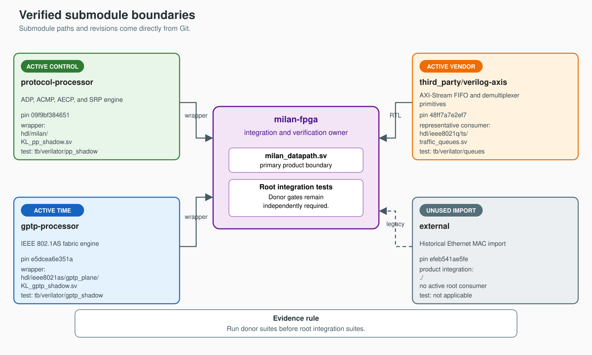

# Submodule integration map

Gitlinks define accepted revisions.

Detached submodule heads are normal.

Dirty submodules invalidate local evidence.



## Contents

- **[Pinned dependencies](#pinned-dependencies)** — Identify every imported repository.
- **[Initialize safely](#initialize-safely)** — Populate exact recorded revisions.
- **[Respect ownership](#respect-ownership)** — Separate donor and root responsibilities.
- **[Known documentation conflicts](#known-documentation-conflicts)** — Avoid stale donor claims.

## Pinned dependencies

<!-- submodule-pins:start -->
| Path | Pin | Purpose | Root integration |
|---|---|---|---|
| `external` | `efeb541ae5fe1e078332d8462dca2fc2d9cb8db5` | Historical Ethernet MAC RTL | No active product consumer |
| `gptp-processor` | `903a58125da89ba445c737e6d7db9ea5a8ba25f6` | Fabric gPTP engine | `KL_gptp_shadow.sv` |
| `protocol-processor` | `3770ae02c56ca712d4a3505f429298b62edd5da8` | ADP, ACMP, AECP, and SRP | `KL_pp_shadow.sv` |
| `third_party/verilog-axis` | `48ff7a7e2ef782cf778d47910cf85835c64b1bce` | AXI-Stream primitives | Multiple RTL consumers |
<!-- submodule-pins:end -->

`traffic_queues.sv` is one representative consumer.

Other consumers exist throughout root RTL.

The pin checker reads Git index entries.

It does not trust checked-out heads.

## Initialize safely

Required root gates use three submodules.

```sh
git submodule update --init \
  third_party/verilog-axis \
  protocol-processor \
  gptp-processor
```

The unused external import uses SSH.

Initialize it only when needed.

```sh
git submodule update --init external
```

Compare every populated checkout revision.

```sh
git submodule status --recursive
```

- A leading space confirms the recorded revision.
- A leading dash means uninitialized content.
- A leading plus means revision mismatch.
- A leading `U` means unresolved content.

Revision agreement does not prove cleanliness.

```sh
git submodule foreach --quiet --recursive 'git status --short'
```

The cleanliness command must print nothing.

## Respect ownership

- Change donor behavior inside its repository.
- Land donor tests before changing pins.
- Move pins only after donor evidence.
- Run root integration after every pin.
- Root tests never replace donor suites.
- Root wrappers own adaptation logic.
- Root documentation owns integration behavior.

| Repository | Donor gate | Root gate |
|---|---|---|
| `protocol-processor` | `protocol-processor/scripts/run_suites.sh` | `make -C tb/verilator/pp_shadow` |
| `gptp-processor` | `make -C gptp-processor` | `make -C tb/verilator/gptp_shadow` |
| `third_party/verilog-axis` | Upstream evidence | `make -C tb/verilator/queues` |
| `external` | Upstream evidence | Not applicable; no active product consumer |

## Known documentation conflicts

Current donor prose contains known contradictions.

Use root RTL for integration truth.

Imported prose never defines root runtime behavior.

| Conflict | Implementation evidence |
|---|---|
| gPTP README reports default-off integration | `milan_datapath.sv` defaults enabled |
| gPTP README describes retired host services | Full solution uses bare-metal firmware and fabric gPTP |
| Protocol interface guide shows word-wide RX | Landed processor receives bytes |
| Protocol interface guide shows RX backpressure | Landed processor has no RX ready |

Track donor repairs separately.
