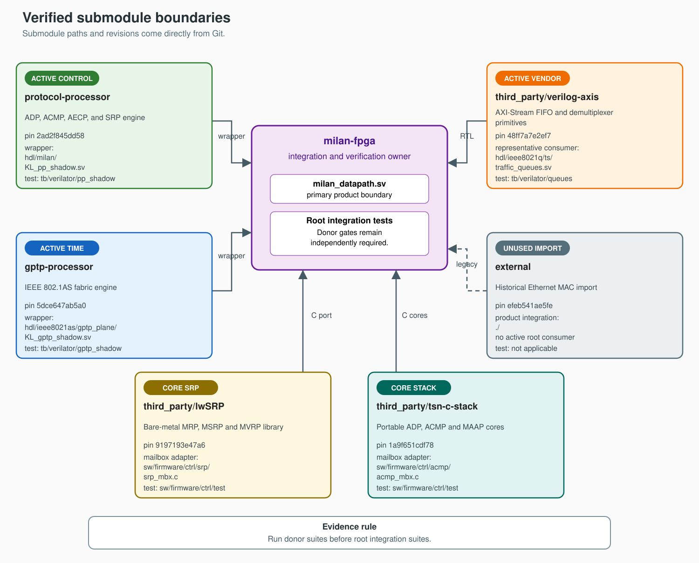

# Submodule integration map

Gitlinks define accepted revisions.

Detached submodule heads are normal.

Dirty submodules invalidate local evidence.



## Contents

- **[Pinned dependencies](#pinned-dependencies)** — Identify every imported repository.
- **[Initialize safely](#initialize-safely)** — Populate exact recorded revisions.
- **[Respect ownership](#respect-ownership)** — Separate donor and root responsibilities.
- **[Known documentation conflicts](#known-documentation-conflicts)** — Avoid stale donor claims.

## Pinned dependencies

<!-- submodule-pins:start -->
| Path | Pin | Purpose | Root integration |
|---|---|---|---|
| `external` | `efeb541ae5fe1e078332d8462dca2fc2d9cb8db5` | Historical Ethernet MAC RTL | No active product consumer |
| `gptp-processor` | `5dce647ab5a01a6ecff9a982b22e3a4a1d946d3d` | Fabric gPTP engine | `KL_gptp_shadow.sv` |
| `protocol-processor` | `c951a9ff0cb5851fb159d33e966e5a2a9a188fe3` | ADP, ACMP, AECP, and SRP | `KL_pp_shadow.sv` |
| `third_party/verilog-axis` | `48ff7a7e2ef782cf778d47910cf85835c64b1bce` | AXI-Stream primitives | Multiple RTL consumers |
<!-- submodule-pins:end -->

Issue #508 adopted these processor changes.

| Processor issues | Merged PR | Adopted behavior |
|---|---|---|
| [92](https://github.com/Mister-M-alt/protocol-processor-control-plane-avb-milan/issues/92), [93](https://github.com/Mister-M-alt/protocol-processor-control-plane-avb-milan/issues/93) | [109](https://github.com/Mister-M-alt/protocol-processor-control-plane-avb-milan/pull/109) | Saved-binding restore, bounded walk, listener boot hold |
| [94](https://github.com/Mister-M-alt/protocol-processor-control-plane-avb-milan/issues/94) | [110](https://github.com/Mister-M-alt/protocol-processor-control-plane-avb-milan/pull/110) | Descriptor-memory guard; no external port change |
| [43](https://github.com/Mister-M-alt/protocol-processor-control-plane-avb-milan/issues/43), [49](https://github.com/Mister-M-alt/protocol-processor-control-plane-avb-milan/issues/49) | [111](https://github.com/Mister-M-alt/protocol-processor-control-plane-avb-milan/pull/111) | Processor-owned input probing, ACMP status and failure fields |
| [112](https://github.com/Mister-M-alt/protocol-processor-control-plane-avb-milan/issues/112) | [114](https://github.com/Mister-M-alt/protocol-processor-control-plane-avb-milan/pull/114) | Admission grants wait for the current declaration's evaluation |
| [116](https://github.com/Mister-M-alt/protocol-processor-control-plane-avb-milan/issues/116) | [117](https://github.com/Mister-M-alt/protocol-processor-control-plane-avb-milan/pull/117) | Parent-gate fixes; no behavior or external port change |
| [113](https://github.com/Mister-M-alt/protocol-processor-control-plane-avb-milan/issues/113) | [115](https://github.com/Mister-M-alt/protocol-processor-control-plane-avb-milan/pull/115) | Latency-only GET_STREAM_INFO notification; no external port change |

PR 117 merged as `265d6762`.

PR 115 then merged as `990f9652`.

Issue #567 adopted processor pin `0922e434`.

| Merged processor PR | Adopted change |
|---|---|
| [118](https://github.com/Mister-M-alt/protocol-processor-control-plane-avb-milan/pull/118) | October MVU waiver and unsupported-command response tests |
| [119](https://github.com/Mister-M-alt/protocol-processor-control-plane-avb-milan/pull/119) | Complete integration parameter inventory and its checker |

That adoption left processor HDL and ROM generators unchanged.

The repository tool recorded ROM digest rows for `0922e434`.

Their digests match the `990f9652` rows.

Issue #502 adopted processor pin `870ff88a`.

- PR 121 exports each accepted live name write.
- `KL_pp_shadow` connects that pulse to saved-state pending.
- The parent's actual-write enable supplies the map trigger.
- Later marks retain their command-completion meaning.

Issue #580 adopted processor pin `16be6768`.

- [Processor PR 124](https://github.com/Mister-M-alt/protocol-processor-control-plane-avb-milan/pull/124) rejects body/key type and index mismatches.
- [Processor PR 126](https://github.com/Mister-M-alt/protocol-processor-control-plane-avb-milan/pull/126) documents descriptor ownership.
- [Processor #122](https://github.com/Mister-M-alt/protocol-processor-control-plane-avb-milan/issues/122#issuecomment-5853884588) retains Milan 5.3.3.8's cluster minimum.
- The zero-cluster 8x8 input pools violate that minimum.
- Parent [#584](https://github.com/kebag-logic/milan-fpga/issues/584) owns the D8 product correction.
- All five configurations retain identical AEM images and builder outputs.

Issues #606 and #608 adopt processor pin `c951a9ff`.

- [Processor PR 129](https://github.com/Mister-M-alt/protocol-processor-control-plane-avb-milan/pull/129) retries refused destination allocation every 100 ms.
- Every enabled source acquires independently of its first probe.
- [Processor PR 130](https://github.com/Mister-M-alt/protocol-processor-control-plane-avb-milan/pull/130) defers own LeaveAll aging until transmit acceptance.
- Listener withdrawal before that action still clears IN.
- Existing LV withdrawal semantics remain unchanged.
- Parent regressions exercise MAAP acquisition and CRF STREAM_STOP.
- Bench re-measurement follows on the next image.

The ROM ledger records current and earlier pins.

The boundary diagram follows the current pin.

OOC synthesis requires ledger rows for the pin of record.
Rows must match that exact pin.

The parent wrapper's parameter bindings match the documented inventory.

Run the inventory checker from the parent checkout:

```sh
python3 protocol-processor/scripts/check-integrator-params.py
```

The [datapath suite](../../tb/verilator/milan_dp/README.md#the-508-get_stream_info-seam-the-gsi-section-of-obj_notify) records notification coverage.

`traffic_queues.sv` is one representative consumer.

Other consumers exist throughout root RTL.

The pin checker reads Git index entries.

It does not trust checked-out heads.

## Initialize safely

Required root gates use three submodules.

```sh
git submodule update --init \
  third_party/verilog-axis \
  protocol-processor \
  gptp-processor
```

The unused external import uses SSH.

Initialize it only when needed.

```sh
git submodule update --init external
```

Compare every populated checkout revision.

```sh
git submodule status --recursive
```

- A leading space confirms the recorded revision.
- A leading dash means uninitialized content.
- A leading plus means revision mismatch.
- A leading `U` means unresolved content.

Revision agreement does not prove cleanliness.

```sh
git submodule foreach --quiet --recursive 'git status --short'
```

The cleanliness command must print nothing.

## Respect ownership

- Change donor behavior inside its repository.
- Land donor tests before changing pins.
- Move pins only after donor evidence.
- Run root integration after every pin.
- Root tests never replace donor suites.
- Root wrappers own adaptation logic.
- Root documentation owns integration behavior.

| Repository | Donor gate | Root gate |
|---|---|---|
| `protocol-processor` | `protocol-processor/scripts/run_suites.sh` | `make -C tb/verilator/pp_shadow` |
| `gptp-processor` | `make -C gptp-processor` | `make -C tb/verilator/gptp_shadow` |
| `third_party/verilog-axis` | Upstream evidence | `make -C tb/verilator/queues` |
| `external` | Upstream evidence | Not applicable; no active product consumer |

## Known documentation conflicts

The reviewed gPTP guides match root ownership.

The pinned engine exports `phc_slew_active_o` for policy correction.

The parent carries it to the CRF servo (#545).

Window overlap preserves lock until measured correction completes.

- [Manager guide](https://github.com/Mister-M-alt/FPGA-gPTP/blob/5dce647ab5a01a6ecff9a982b22e3a4a1d946d3d/docs/MANAGER.md)
- [Integration guide](https://github.com/Mister-M-alt/FPGA-gPTP/blob/5dce647ab5a01a6ecff9a982b22e3a4a1d946d3d/docs/INTEGRATION.md)
- [HDL guide](https://github.com/Mister-M-alt/FPGA-gPTP/blob/5dce647ab5a01a6ecff9a982b22e3a4a1d946d3d/docs/HDL_DEVELOPER.md)
- [Test guide](https://github.com/Mister-M-alt/FPGA-gPTP/blob/5dce647ab5a01a6ecff9a982b22e3a4a1d946d3d/docs/TEST_DEVELOPER.md)

Protocol donor prose retains these known contradictions.

Use root RTL for integration truth.

Imported prose never defines root runtime behavior.

| Conflict | Implementation evidence |
|---|---|
| Protocol interface guide shows word-wide RX | Landed processor receives bytes |
| Protocol interface guide shows RX backpressure | Landed processor has no RX ready |

Track donor repairs separately.

Historical audit exceptions remain open disclosures.
PR13/PR6 branch continuity is UNKNOWN.

PR13/PR9 retain the negative-merge baseline.
Parent integration does not clear these donor audit findings.
