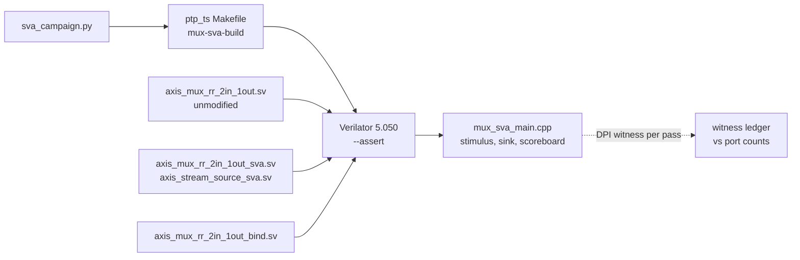

# Assertion-based verification with bound SVA checkers

This page is the guide for adding SystemVerilog Assertions (SVA) to a
first-party module without editing its RTL. The representative instance is
[`hdl/common/axis_mux_rr_2in_1out.sv`](../../hdl/common/axis_mux_rr_2in_1out.sv),
checked in the `ptp_ts` suite since #372. Every tool behaviour stated below was
measured on the pinned Verilator 5.050 (the CI pin); a later Verilator manual
is not evidence for it.

## Contents

- **[What is in the tree](#what-is-in-the-tree)** -- The checker, bind, harness and campaign files, and every property with its owner, law and the campaign row that shows it failing.
- **[What the pinned Verilator does with assertions](#what-the-pinned-verilator-does-with-assertions)** -- Behaviour measured on Verilator 5.050: default-on assertions, silent mistyped binds, the failure line, pass actions on vacuous edges, two-state values.
- **[How to add a checker](#how-to-add-a-checker)** -- Names, binding, enabling, reset and past state, witnesses, and the campaign row every new property owes.
- **[Running and reproducing](#running-and-reproducing)** -- The commands, the harness plusargs and exit codes, where raw logs go, and how to read one failure line.
- **[What this does not establish](#what-this-does-not-establish)** -- Four-state behaviour, CDC, formal proof, timing closure and product coverage stay outside this evidence.

## What is in the tree



| File | Role |
|---|---|
| [`tb/common/sva/axis_stream_source_sva.sv`](../../tb/common/sva/axis_stream_source_sva.sv) | Reusable: the source obligations of one AXI4-Stream interface (Arm IHI0051A section 2.2). TVALID, TDATA, TKEEP and TLAST hold from the first stalled edge until the handshake. |
| [`tb/common/sva/axis_mux_rr_2in_1out_sva.sv`](../../tb/common/sva/axis_mux_rr_2in_1out_sva.sv) | The mux checker: one interface instance per port, plus the mux's grant, ownership, state, reset and forwarding laws. |
| [`tb/common/sva/axis_mux_rr_2in_1out_bind.sv`](../../tb/common/sva/axis_mux_rr_2in_1out_bind.sv) | Attaches the checker, as `u_sva`, to every instance of the mux. |
| [`tb/verilator/ptp_ts/mux_sva_main.cpp`](../../tb/verilator/ptp_ts/mux_sva_main.cpp) | The harness: compliant sources, a sink, an independent scoreboard, the witness ledger and eight scenarios, at TDATA_WIDTH 8 and 64. |
| [`tb/verilator/ptp_ts/sva_campaign.py`](../../tb/verilator/ptp_ts/sva_campaign.py) | The detection campaign: every property must fail on a defect written against it. |
| [`tb/verilator/ptp_ts/Makefile`](../../tb/verilator/ptp_ts/Makefile) | `make` runs the original `ptp_ts_top` harness, then `mux-sva`, then `sva-campaign`. One recipe, `mux-sva-build`, builds every shape. |

The properties, whose obligation each one is, and the campaign row that shows
it failing. A stimulus property binds the testbench: the mux is only held to
its own laws while the sources keep theirs.

| Label | Instance | Obligation of | Law | Form | Fails in |
|---|---|---|---|---|---|
| `ap_tvalid_held_until_handshake` | `u_s0_stimulus`, `u_s1_stimulus` | stimulus | a stalled TVALID stays high until TREADY takes the beat | concurrent | `stimulus-s0_drop_tvalid`, `stimulus-s1_drop_tvalid` (both widths) |
| `ap_tvalid_held_until_handshake` | `u_m_dut` | DUT | the same, on the output | concurrent | `mutant-released_while_tlast_stalled-w64` |
| `ap_tdata_stable_until_handshake` | all three | as above | TDATA does not move while its beat is stalled | concurrent | `stimulus-s*_flip_tdata`, `mutant-tdata_hidden_while_stalled-w8` |
| `ap_tkeep_stable_until_handshake` | all three | as above | TKEEP does not move while its beat is stalled | concurrent | `stimulus-s*_flip_tkeep`, `mutant-tkeep_hidden_while_stalled-w64` |
| `ap_tlast_stable_until_handshake` | all three | as above | TLAST does not move while its beat is stalled | concurrent | `stimulus-s*_flip_tlast`, `mutant-tlast_hidden_while_stalled-w8` |
| `ap_state_legal` | `u_sva` | DUT | the state decodes to exactly one of IDLE, STREAM_0 and STREAM_1 | concurrent | `mutant-illegal_state_reached-w64` |
| `ap_grant_only_to_requester` | `u_sva` | DUT | a grant from IDLE goes only to a source that offered a beat | concurrent | `mutant-granted_without_request-w8` |
| `ap_owner_held_until_tlast_handshake` | `u_sva` | DUT | the owning packet keeps the output until its TLAST beat is taken | concurrent | `mutant-released_before_tlast_s0-w8`, `mutant-released_before_tlast_s1-w64` |
| `ap_owner_released_after_tlast` | `u_sva` | DUT | the owner lets go after its TLAST beat | concurrent | `mutant-kept_after_tlast-w8` |
| `ap_reset_releases_owner` | `u_sva` | DUT | a reset sampled at one edge leaves no owner at the next | concurrent, no `disable iff` | `mutant-reset_ignored-w64` |
| `ai_grants_mutually_exclusive` | `u_sva` | DUT | s0 and s1 never both see TREADY | deferred immediate | `mutant-both_sources_ready-w64` |
| `ai_ready_only_for_owner_and_ready_sink` | `u_sva` | DUT | a source sees TREADY exactly when it owns the output and the sink is ready | deferred immediate | `mutant-ready_ignores_sink-w8` |
| `ai_tvalid_forwarded` | `u_sva` | DUT | m TVALID is the owner's TVALID, and low with no owner | deferred immediate | `mutant-tvalid_waits_for_tready-w64` |
| `ai_payload_forwarded_on_transfer` | `u_sva` | DUT | an accepted m beat carries the owner's TDATA, TKEEP and TLAST | deferred immediate | `mutant-tkeep_from_other_source-w64` |

Round-robin order is deliberately not a property. The scoreboard grades it,
and `scoreboard-round_robin_inverted-w8` shows the scoreboard failing while no
property does.

## What the pinned Verilator does with assertions

Each fact was measured on Verilator 5.050, with a synthetic probe or with the
campaign row named.

- **Assertions are on by default.** Since 5.038, `--no-assert` turns them off;
  before 5.038 they were off unless `--assert` was given. The checker builds
  pass `--assert` anyway, so the intent survives an older tool.
- **`--no-assert` removes everything.** Concurrent assertions, immediate
  assertions and both kinds of action block are compiled out, including a DPI
  call in an action (`coverage-assertions_disabled-w64`).
- **Bind is by module name only**, never by instance path.
- **A bind to a module that does not exist is accepted silently.** It builds
  with no diagnostic, even under `-Wall`, and the design then has no checker
  (`coverage-bind_target_mistyped-w8`).
- **A failure is one line, then a stop.** It reads `[<time>] %Error: <file>:<line>:
  Assertion failed in <path>.<label>: <message>`. At the default error limit
  the model then prints `Verilog $stop` and exits 1. With
  `+verilator+error+limit+<n>` it continues, so every assertion failing at
  that edge is reported.
- **Reset affects the two edges differently in the measured 5.050 setup.**
  For `disable iff (!rst_n) a |=> b`, an attempt completing on a reset edge
  is skipped: neither action runs. An attempt starting on a reset edge
  passes vacuously when the next edge is out of reset: its pass action runs
  with witness flag 0.
- **A pass action runs at every passing edge, vacuous or not.**
  `$assertvacuousoff` changes nothing. Counting pass actions therefore counts
  clock edges, not checks.
- **`$past` works inside a pass action**, which is how a witness reports
  whether its antecedent really held.
- **`cover`, immediate or concurrent, runs only under `--coverage-user`.** No
  suite here passes it.
- **`assume property` is checked like `assert property`**, with the same
  `Assertion failed` line.
- **A DPI scope exists only while a DPI call remains in the module.** Under
  `--no-assert` the checker instances have no scope at all.
- **The simulation is two-state.** An X reads as 0 and `$isunknown` of it is
  0, so an X-propagation assertion cannot fire.

## How to add a checker

### Files and names

- Put checkers in [`tb/common/sva/`](../../tb/common/sva): `<module>_sva.sv`
  for a module's checker and `<module>_bind.sv` for its bind. A checker for an
  interface that several modules share is its own module, like
  `axis_stream_source_sva`.
- Follow the HDL house style of [CONTRIBUTING.md](../../CONTRIBUTING.md): the
  SPDX banner, `` `default_nettype `` none and wire, typed `_P` parameters,
  inputs documented inline with `//!`, and named blocks. Refuse an impossible
  parameter at elaboration, as `gen_guard_tdata_width` does.
- Label every assertion. `ap_` is a concurrent property and `ai_` an
  immediate one; the rest of the label names the law, not the expression.
- Give every assertion an `else $error(...)` that states the broken rule and
  cites its clause when there is one.
- Say whose obligation an interface check is in its instance name:
  `u_<port>_stimulus` where the testbench or an upstream block drives TVALID,
  `u_<port>_dut` where the module under test does.
- A checker only observes. It never drives a signal, and the product RTL is
  never edited to host one.

### Binding

- One bind file per target module:
  `bind <module> <module>_sva #(...) u_sva (...);`. Every instance of the
  module in the elaborated design gets the checker.
- Connection expressions resolve in the scope of the bound instance. Read
  internal state there, against the module's own names: the mux bind passes
  `state == IDLE` rather than copying the enum encoding into the checker.
- Pass parameters from the instance, `.TDATA_WIDTH_P(TDATA_WIDTH)`, so each
  instance gets a checker of its own shape.
- A build carries the checker only if it lists the checker files and the
  bind. Because a mistyped bind target builds silently, the harness must prove
  the checker is present (see [Witnesses](#witnesses)).

### Enabling

- List the DUT, the checker files and the bind in one build recipe, and pass
  `--assert` explicitly.
- Do not add `-Wno-fatal` to a checker build: a new warning in the checker or
  the bind should fail it. Waive the DUT's standing findings exactly as its
  existing suite already does. `mux-sva-build` waives only `CASEINCOMPLETE`.
- Build every shape a campaign needs through that same recipe, overriding
  variables, so the negative controls cannot drift from the positive build.

### Reset and past state

The reset and first-edge results come from the
[R239-1 pinned 5.050 probes and receipts](https://github.com/kebag-logic/milan-fpga/tree/7795e487048867fde07a224ec1a5885acfb4375b/review-evidence/372-r1/review/R239-1).

- A protocol law on a synchronously reset interface is a concurrent property
  sampled at the rising edge, with `disable iff (!rst_n)`. A source may then
  drop a stalled beat into reset without failing it.
- A law about reset itself has no `disable iff`. `ap_reset_releases_owner` is
  `!rst_n |=> owner_none_i`.
- `|=>` delays an obligation by one edge; `$past` and `$stable` use previous
  samples. In the measured Verilator 5.050 two-state setup, the first-edge
  previous value is 0, regardless of the signal's declared initial value.
  A probe with `one = 1'b1` held constant fails both `$past(one) == 1'b1`
  and `$stable(one)` at that first edge. Hold reset for the first edges,
  as every harness here does.
- A combinational law that holds at every settled point, reset included, is a
  deferred immediate assertion (`assert final`) in an `always_comb` block.
  Every `ai_` law is written that way.
- Do not write an X check. The simulation is two-state (see
  [What this does not establish](#what-this-does-not-establish)).

### Witnesses

A property that never saw its antecedent passes every run, and so does a
checker that is not there. Every property therefore reports each completed
attempt through a DPI pass action, with a non-vacuity flag computed from
`$past`:

```systemverilog
ap_tvalid_held_until_handshake: assert property (
    @(posedge clk_i) disable iff (!rst_n) stalled_w |=> tvalid_i)
  axis_sva_witness("ap_tvalid_held_until_handshake", $past(rst_n && stalled_w));
else
  $error("TVALID fell before TREADY took the beat (IHI0051A 2.2)");
```

- Keep `rst_n` inside the witness flag's `$past`, beside the antecedent.
  In the pinned 5.050 probe, a stalled offer on a reset edge produces a
  vacuous pass action at the next running edge. `$past(stalled_w)` alone
  would incorrectly count that as non-vacuous; testing current `rst_n`
  would not exclude it. `$past(rst_n && stalled_w)` reports flag 0,
  matching the reset-qualified antecedent used by the tool.
- The import is `context`, so the harness finds its ledger through the
  calling scope (`svPutUserData`), with no global state.
- The harness looks each expected checker scope up by name at start-up. A
  missing scope is a failed check: the bind is missing or mistyped, or
  `--no-assert` compiled every call out.
- The harness compares 21 witness pairs with its own port counts: 15 require
  equality. Two use a floor: `ap_owner_held_until_tlast_handshake` and
  `ap_grant_only_to_requester` also involve internal state, so port-visible
  events give a lower bound. Four immediate laws require presence only:
  both counts must be above zero, without an equality or floor comparison,
  because these assertions re-evaluate whenever an input moves.
- Only the flagged calls are counted, and none of them is added to the
  suite's check total. The tally counts graded verdicts, never assertion
  evaluations or clock edges.

### Proving each property can fail

Every new property needs a campaign row that makes it fail, read by the
property's own name. A property never seen to fail cannot be told apart from
one that cannot fail (Rule 8 of the
[code quality guide](../development/CODE_QUALITY.md)).

- **Mutant.** Rewrite one span of a scratch copy of the product module. The
  span must occur exactly once, so a moved line fails the row instead of
  mutating nothing. The mutant must build.
- **Stimulus fault.** Break one source rule from the harness on purpose, with
  a plusarg on the clean build.
- **Scoreboard row.** A defect no property claims must be caught by the
  harness's own verdict while no property fires.
- **Elaboration row.** An illegal parameter must be refused by the checker's
  own guard message (`elaboration-tdata_width_12`), with the legal widths
  building in the clean rows.
- **Lost-coverage control.** Build or run the clean design with its checker
  unable to vouch for it. The four controls are `--no-assert`, a mistyped
  bind target, s0 and s1 swapped in the bind, and one scenario that never
  stalls the output (`+grade_witnesses`). The harness must refuse each
  positive run by its own scope or witness check, and every stimulus fault
  must be injected and go undetected, or the detection check could pass
  without the checker. The swapped bind breaks no law, so only the witness
  counts the harness takes from the ports can catch it.
- **Detection** means the build succeeded, the harness exited 3 (its
  assertion stop), and an `Assertion failed in` line names the expected path.
  A compile failure, a crash, a watchdog or a usage error is not a detection.
- Keep expected failures out of the suite log. Raw logs go under the
  campaign's directory, and only one verdict line per row is printed.
- Never weaken a property to make a run pass. A failure on the unmodified
  product RTL is a finding to publish for a scoped decision.

## Running and reproducing

Pass the pinned tool to every command that builds (`VERILATOR=...` for make,
`--verilator` for the campaign):

```sh
# the whole suite: ptp_ts_top, the mux at both widths, the campaign
make -C tb/verilator/ptp_ts VERILATOR=<path to verilator 5.050>

# the bound checker alone, at TDATA_WIDTH 8 and 64
make -C tb/verilator/ptp_ts mux-sva VERILATOR=<path to verilator 5.050>

# one scenario with one stimulus fault, exactly as the campaign runs it
tb/verilator/ptp_ts/obj_dir_mux_sva_w8/Vmux_sva +verilator+error+limit+1000 \
    +scenario=single_beats +stimulus_fault=s0_drop_tvalid

# the campaign's row names, then one row (it needs the mux-sva builds)
python3 tb/verilator/ptp_ts/sva_campaign.py --list
python3 tb/verilator/ptp_ts/sva_campaign.py --only mutant-reset_ignored \
    --verilator <path to verilator 5.050>
```

- The harness takes `+scenario=<name>` (default: all eight, in order),
  `+stimulus_fault=<s0|s1>_<drop_tvalid|flip_tdata|flip_tkeep|flip_tlast>`,
  `+seed=<n>`, and `+grade_witnesses`, which grades the witnesses after a
  single scenario too. It prints the seed of its random scenario in its first
  line, so a random failure replays from its own log.
- It exits 0 on a pass, 1 when a graded check fails, 2 on a bad plusarg, and
  3 when an assertion stopped a run whose error limit was raised.
- Raw campaign logs are kept per row in
  `tb/verilator/ptp_ts/obj_dir_sva_campaign/<row>/`: the build log, the run
  log, and the scratch source of a mutant or a mistyped bind.

A failure reads like this (from `stimulus-s0_drop_tvalid-w8`):

```text
[6000] %Error: axis_stream_source_sva.sv:71: Assertion failed in TOP.axis_mux_rr_2in_1out.u_sva.u_s0_stimulus.ap_tvalid_held_until_handshake: TVALID fell before TREADY took the beat (IHI0051A 2.2)
SVA-STOP: an assertion failed at the edge ending cycle 6 (the %Error lines above name it); the run stops at that edge
```

- `[6000]` is simulation time in picoseconds. The harness runs one clock per
  nanosecond, so this is the rising edge that ends cycle 6.
- The path is the bind instance (`u_sva`), then the checker instance, whose
  name says whose obligation broke (`u_s0_stimulus`), then the label.
- The message names the rule and its clause.

## What this does not establish

- **Four-state behaviour.** Verilator is two-state: X and Z are never
  observed, so nothing here shows that an X cannot propagate.
- **CDC correctness.** The checker samples one clock. No crossing is modelled
  or checked.
- **A formal proof.** Only simulation ran. No formal tool has read these
  properties.
- **Timing closure.** The simulation is cycle-based and zero-delay.
- **Coverage of the product.** One module carries assertions. The mux
  instance inside `ptp_ts_top` is not bound: the original `run` leg is
  unchanged and does not compile the checker. No functional coverage is
  collected, and no `covergroup` or `cover` is part of this rollout.
- **Completeness of a property.** Each campaign row shows that its property
  can fail on one defect, not that it catches every defect of that kind.
