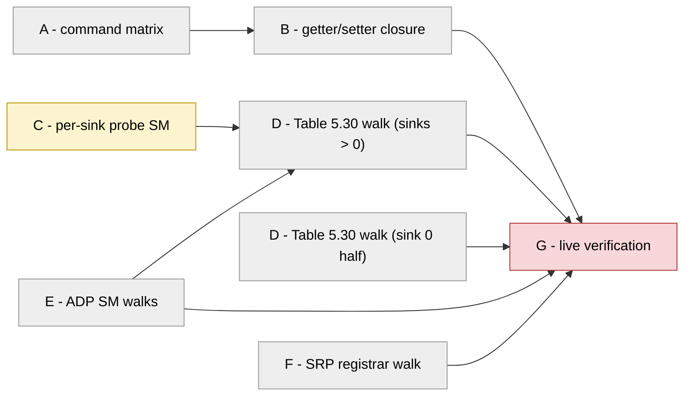

# Full protocol sweep — every mandatory command, every state machine, verified per clause

Status: PLAN, 2026-07-28 (USER-requested). Executes AFTER the 0x0019 flash +
§8.3 validation round; the live halves are gated on R6/R7 (same VERSION on
both boards, read, not assumed). Owner of the plan: this file. Owner of each
lane: assigned when the lane opens.

The question this campaign answers, in one sentence: **for every 1722.1 /
Milan v1.2 mandatory getter, setter, ADP and ACMP state machine, does the
entity answer exactly what the clause says — and is the SRP reservation and
the stream on the wire the consequence the clauses promise?**

The method is the repo's standing one
([`methodology.md`](methodology.md)): extract the clause tables into matrix
rows FIRST, so coverage becomes a diff instead of an impression (R1: name the
oracle); then close the holes the diff names. Nothing here is licensed by a
paraphrase — every lane quotes its clauses out of the PDFs on this machine
(`$STANDARDS_DIR` trap: the PDFs are present, the variable is merely unset).

## Contents

- **[What already exists (do not rebuild it)](#what-already-exists-do-not-rebuild-it)** — The 60-70 % of this campaign that is already held by existing suites, named per surface so a lane spends its context on the uncovered remainder instead of re-proving the covered majority.
- **[Lane A — the 5.4.2 command matrix (the analysis half)](#lane-a--the-542-command-matrix-the-analysis-half)** — Extract Milan's mandatory command table into matrix rows and DIFF them against existing coverage, so "what is untested" becomes a generated list instead of an impression. Names its own expected day-one holes as the extractor's sanity check.
- **[Lane B — getter/setter gap closure](#lane-b--gettersetter-gap-closure)** — Close what lane A names: remaining SET_STREAM_INFO flags, START/STOP_STREAMING refusal paths, and the nine settings-persistence shalls — the last of which may spawn its own follow-on lane if the restore-path design is not small.
- **[Lane C — per-sink probe SM (the enabler RTL)](#lane-c--per-sink-probe-sm-the-enabler-rtl)** — The one structural RTL item: PROBE_SM_EN_P covers sink 0 only today, so sinks 1..N-1 have no Auto Connect and no restore target. Everything lane D wants for sinks > 0 waits on this.
- **[Lane D — ACMP sink SM, Table 5.30 cell by cell](#lane-d--acmp-sink-sm-table-530-cell-by-cell)** — One scenario per reachable transition cell of Milan's 48-cell listener table, asserting the clause's FULL exit-action list, with the timer-shrink discipline that makes second-scale MRP timers simulable.
- **[Lane E — ADP state machines](#lane-e--adp-state-machines)** — The advertise and discovery SM walks; discovery feeds Table 5.30's talker-watch events, which is why this lands before or with lane D.
- **[Lane F — SRP registrar/applicant walk](#lane-f--srp-registrarapplicant-walk)** — 802.1Q registrar/applicant tables plus Milan's quoted IN->MT modification and the class-A-only Domain rules; also owns the recorded min-size/keep rx question, to be decided from 802.3 rather than convenience.
- **[Lane G — live wire verification (bench, serial)](#lane-g--live-wire-verification-bench-serial)** — Reference-device calibration of C9-C13, full hive runs on both boards, the re-staged LIVE cert suite, and SRP + stream truth on the taps. Strictly after the current round's §8.3 ladder, strictly serial.
- **[Dependency order](#dependency-order)** — The lane graph and the parallel/serial shape: A/C/E/F first, then B/D, then G alone on the bench.
- **[Rules that bind every lane](#rules-that-bind-every-lane)** — The standing constraints: quote clauses, ship negative controls, record-don't-detour, never down-declare, bench and Vivado stay serial.

## What already exists (do not rebuild it)

A lane that re-tests these is spending its context on the covered 60-70 %:

| Surface | Where it is already held |
|---|---|
| AECP command behaviours (item-10 set) | `tests/features/item10_*.feature` (acquire, lock, name, sampling_rate, clock_source, stream_format, stream_info, configuration, control, max_transit_time, read_descriptor, get_milan_info, audio_maps) |
| Response frame contract (size/status/per-index) | [`tb/verilator/aecp`](../../tb/verilator/aecp) (byte-exact goldens, per-index sweeps), [`tests/features/aecp_response_contract.feature`](../../tests/features/aecp_response_contract.feature) |
| Per-index GET_COUNTERS, Tables 5.16/5.17 | `KL_talker_diag_ctx` + monitor mirror, [`tb/verilator/tkdiag`](../../tb/verilator/tkdiag), aecp suite (this round) |
| Independent-controller view | [`tb/tools/hive_compliance.py`](../../tb/tools/hive_compliance.py) C1-C13 (C9-C13 still owe the §8.3.2 reference-device calibration) |
| ACMP behaviours (not the full SM walk) | [`tb/verilator/acmp`](../../tb/verilator/acmp), `acmp_lstn`, the milan_dp bind/E3 cases |
| ADP behaviours (cadence, depart, dormancy) | `tb/verilator/adp*`, `A_ADP_DIAG` silicon work |
| SRP licence + reservation semantics | six `lwsrp*` suites incl. the term-by-term 5.3.7.3 licence; the L2 SRP-only case (Listener Ready alone → `LWSRP_STATUS 0x37E` → frames) |
| Stream-on-the-wire oracle | hive C13 (bind the reference sink, read ITS counters), the §8.3 tap ladder |

## Lane A — the 5.4.2 command matrix (the analysis half)

**Level 3 / oracle = the clause.** Est. 1 day. No RTL.

1. Extract Milan v1.2 5.4.2.1-5.4.2.x (the mandatory AECP command set,
   ~30 commands) and the 1722.1-2021 7.4 command table into a new
   COMMAND_MATRIX page beside this one (the lane creates it - citing the
   path before the file exists would fail the doc-path gate, correctly):
   `command x descriptor-kind x index-range x {success, each named error,
   unsolicited} x clause`.
2. Diff each row against the existing coverage (behave clause tags, aecp
   suite case list, hive checks) the way `gen_module_matrix.py` diffs
   modules; emit the rows with NO covering check as the lane-B backlog.
3. Gate: `matrix-check`-style — a new command implemented without a matrix
   row fails CI, so the matrix cannot rot (R2: it must be able to fail).

Acceptance: the matrix names every hole; the holes it is EXPECTED to name on
day one (or the extractor is wrong): SET_STREAM_INFO flags beyond
MSRP_ACC_LAT, the nine settings-persistence shalls (5.3.8.x/5.3.13), the
CRF-input counter mask, START/STOP_STREAMING edge paths.

## Lane B — getter/setter gap closure

**Levels 0-3.** Est. 1-2 days once lane A names the rows. Fix order inside
the lane: cheapest clause-visible refusal first.

Known members before lane A even runs:

- SET_STREAM_INFO: implement or clause-refuse each remaining flag
  (STREAM_VLAN_ID and friends) — whichever the clause supports; quote it.
- START/STOP_STREAMING: talker-side refusal paths (Milan excludes
  STREAMING_WAIT; the refusal must be the specified status, full-size).
- The nine settings-persistence shalls (sampling rate, both current formats,
  PTO, started/stopped, both chmap lists, clock source, user names —
  5.3.8.x, 5.3.13): needs the AECP-settings restore path design (a CSR store
  window or a replay port); DESIGN in this lane, implement only if the
  design stays small — else it becomes its own follow-on lane. The binding
  half is already done (0x7B8 journal, VERSION 0x0019).

## Lane C — per-sink probe SM (the enabler RTL)

**Level 0-2 / oracle = Milan 5.5.3.** Est. 2-3 days RTL + TB. THE structural
item: `PROBE_SM_EN_P` defaults to sink 0 only and the datapath never
overrides it, so sinks 1..N-1 carry record-only binds — no Auto Connect, no
restore target, half of Table 5.30 unreachable for them. Deliverables:

1. Per-sink SM elaboration (mask from the generated shape, like every other
   shape constant — config-driven, not a hand mask).
2. The E3 journal restore path re-tested against a sink > 0.
3. Area check on the AX (87.8 % LUT estimate already; OOC-synth before
   believing any area claim — standing rule).

## Lane D — ACMP sink SM, Table 5.30 cell by cell

**Level 2 / oracle = Milan Table 5.30 (48 transition cells, 5.5.3.5.1-.48).**
Est. 3-4 days. Depends on lane C for sinks > 0; the sink-0 half can start
immediately.

1. Timer-shrink parameters for TMR_NO_RESP (200 ms) / TMR_RETRY (4 s) /
   TMR_DELAY (0-1 s) / TMR_NO_TK (10 s), the `-G` override discipline
   CLKV_QTICK already uses — a TB that waits real seconds is a TB nobody
   runs.
2. One scenario per reachable cell, named for its clause
   (`5.5.3.5.16: PRB_W_RESP + TMR_NO_RESP -> PRB_W_RESP2`), each asserting
   the FULL exit action list of the clause (messages sent, probing status,
   timers armed), not just the next state.
3. The `x` cells (cannot happen) get negative controls where an injection
   can even express them; the `-` cells (ignored) assert no state change.

## Lane E — ADP state machines

**Level 2/4 / oracle = Milan 5.6.3 (advertise) + 5.6.4 (discovery — note it
DIFFERS from 1722.1 6.2.6; the clause says so).** Est. 1-2 days on top of
the existing cadence/depart/dormancy coverage: the delta is a state-walk
with per-transition assertions, plus the discovery SM as the LISTENER's
talker-watch (it feeds Table 5.30's EVT_TK_DISCOVERED/DEPARTED — lane D
consumes it, so E lands first or together).

## Lane F — SRP registrar/applicant walk

**Level 0/2 / oracle = 802.1Q Tables 10-3/10-4 + Milan 4.2.7.2.1/4.2.7.2.2.**
Est. 1-2 days.

1. Registrar walk incl. the Milan-modified transition, quoted:
   `IN / rLv! -> (Lv) -> MT` (4.2.7.2.2) — the 5 s LeaveTime shortcut.
2. Domain rules: startup/Link-Up Domain declaration for class A
   {priority 3, VID 2}, and the update-on-received-Domain behaviour
   (4.2.7.2.1); class B stays out of scope — 4.2.7.2.1 mandates the Domain
   for class A only (verdict recorded 2026-07-28).
3. The recorded rx-path question from the SRP-only lane: a 60 B
   final-keep-0x0F MRPDU alone does not register where the full-keep 64 B
   copy does — root-cause in `lwsrp_rx` (min-size/keep handling), fix or
   document the wire truth (a real MSRP frame on the wire is >= 64 B with
   FCS, so the TB shape may simply be unphysical — decide from 802.3, not
   from convenience).

## Lane G — live wire verification (bench, serial)

**Levels 4-5 / oracles = the reference device + the taps.** Est. 1 bench
day, AFTER the §8.3 ladder of the current round is green. Bench is serial;
this lane never runs beside a build.

1. Calibrate C9-C13 against the reference device (the §8.3.2 rule: a check
   that fails there is wrong until a clause says otherwise).
2. hive_compliance full run against both boards; acceptance is the §8.3.3
   shape (our failures collapse to the known remainder; reference stays
   clean).
3. The cert-recreate LIVE suite from the peer host (it must be re-staged
   first — the venv on that host is gone; recipe in the project memory).
4. SRP on the wire: the tap decoders against our declarations after each
   lane-F change — Domain, TalkerAdvertise vectors, Listener registrations,
   and the §8.3.6 licence numbers (`0x30` unbound / `0x37E` bound, zero
   tagged AAF unbound, ~8000/s bound).
5. Stream truth: C13 per talker index (not just talker 0), incl. the CRF
   output at uid N against a reference CRF sink if the reference device
   exposes one.

## Dependency order

Serial total ~8-10 desk days + 1 bench day; the usual multiwork shape is
A/C/E/F in parallel first (A is the map the others consult), then B/D, then
G alone on the bench. Lane C is the only RTL with area risk; everything else
is tests and small refusal paths.

## Rules that bind every lane

- R3: quote the clause in the check, the scenario and the commit; where the
  standard is silent, write that it is silent.
- R2: every new check ships its negative control, and C-series checks run
  against the reference device before their verdicts are trusted.
- Methodology §5: a defect found outside the lane's subject is recorded and
  handed to a fresh lane — the Table 5.30 walk WILL surface things; it must
  not fix them in passing.
- No down-declaration ever: a hole is closed by raising the fabric or by a
  clause-quoted refusal, never by shrinking what the entity advertises
  (dade536 is the standing counter-example).
- Bench and Vivado stay serial; suites run under the sweep lock.
