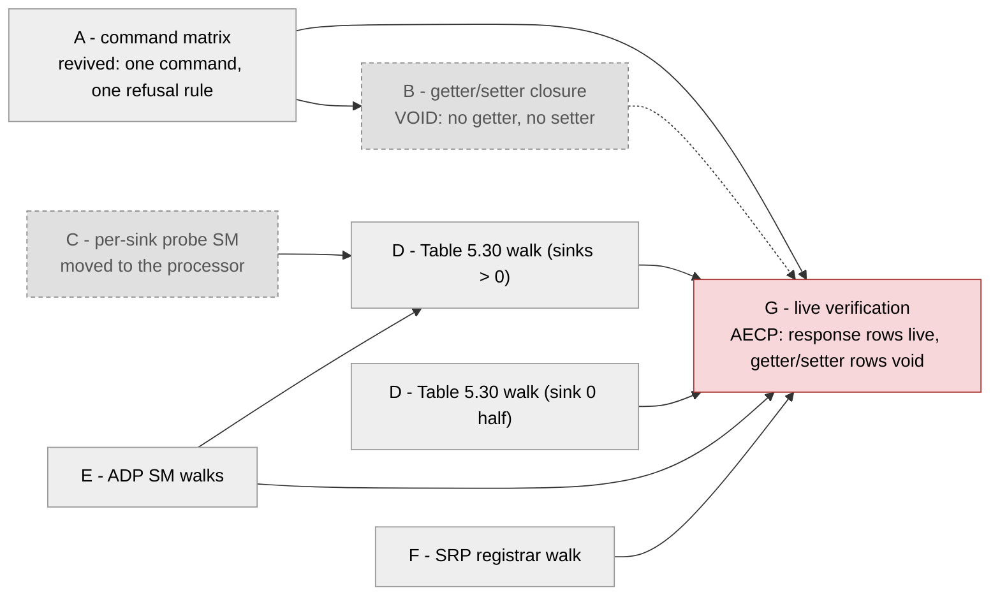

[OBSOLETE + 2026-08-16]

# Full protocol sweep — every mandatory command, every state machine, verified per clause

Status: PLAN, 2026-07-28 (USER-requested), **substantially invalidated
2026-08-13**. Executes AFTER the 0x0019 flash + §8.3 validation round; the live
halves are gated on R6/R7 (same VERSION on both boards, read, not assumed).
Owner of the plan: this file. Owner of each lane: assigned when the lane opens.

> ## What this plan can still be run against (2026-08-13)
>
> The control plane this plan was written for **no longer exists**. This
> repository's AECP/AEM engine, ACMP talker and listener, ADP advertiser and
> parser, and lwSRP applicant were deleted; the `protocol-processor` submodule,
> wrapped by [`hdl/milan/KL_pp_shadow.sv`](../../hdl/milan/KL_pp_shadow.sv), is
> the control plane and
> [`hdl/milan/milan_datapath.sv`](../../hdl/milan/milan_datapath.sv)
> instantiates it unconditionally.
>
> **Lanes E (ADP), F (SRP) and the ACMP half of D are still real work** — they
> now target the processor, and the oracle (the clause) is unchanged.
>
> **CORRECTION 2026-08-13 — this entity DOES answer AECP.** An earlier revision
> of this block said it answered no AECP/AEM command at all and voided lanes A
> and B on that basis. **The premise was false**: the processor's **AECP uCPU
> landed**. In one sentence, *it answers `READ_DESCRIPTOR`, and answers every
> other AECP command with a conformant `NOT_IMPLEMENTED` echo* — correct
> `message_type`+1, correct length, correct `controller_data_length`.
> `IDENTIFY_NOTIFICATION` (0x0026) arriving as a **command** draws
> `BAD_ARGUMENTS` (IEEE 1722.1 §7.4.39.2 beats §9.3.5.3.3). A command whose
> `target_entity_id` is not ours, and any AECP **response** arriving as input,
> are silently refused: freed, counted, no reply.
>
> The honest re-triage of the lanes:
>
> * **Lane A is revived, and its answer is nearly uniform.** There is an
>   implementation to diff a command matrix against now. Exactly one command has
>   a function (`READ_DESCRIPTOR`, three status paths); every other row of the
>   5.4.2 set reads NOT IMPLEMENTED with a conformant refusal.
> * **Lane B stays VOID.** Every member is a getter or a setter, and not one of
>   them exists — `SET_STREAM_INFO`, `START`/`STOP_STREAMING` and the nine
>   settings-persistence *shalls* all draw the echo and change nothing. The
>   persistence half is doubly gone.
> * **Lane G's AECP rows split.** A check that needed a well-formed AECP
>   *response*, or that walks descriptors, runs again; a check that needed a
>   getter or a setter does not.
>
> **An echo is not an implementation.** Nothing below may be re-graded as
> covered because the entity answered.
>
> **The descriptor image is not supplied by this repository**, so on a stock
> build every `READ_DESCRIPTOR` answers `BAD_ARGUMENTS` — not
> `NO_SUCH_DESCRIPTOR`: the configuration range check precedes the locate and an
> invalid image reports `configurations_count` = 0. Enumeration is reachable, not
> working. The pair is a discriminator for a sweep: `BAD_ARGUMENTS` everywhere =
> no image or a corrupt one; `NO_SUCH_DESCRIPTOR` = image loaded and that
> descriptor genuinely absent. **Known gap kept visible:** Milan Δ7 `ACQUIRE_ENTITY`
> (`NOT_SUPPORTED` with `owner_id` = 0) is not distinguished from the generic
> echo.
>
> Lane C (per-sink probe SM) is likewise not this repository's item any more:
> the sink state machine lives in the processor.

The question this campaign answers, in one sentence: **for every 1722.1 /
Milan v1.2 mandatory getter, setter, ADP and ACMP state machine, does the
entity answer exactly what the clause says — and is the SRP reservation and
the stream on the wire the consequence the clauses promise?** As of 2026-08-13
the getter/setter half follows the processor's served command inventory. That
inventory includes `READ_DESCRIPTOR` and `GET_COUNTERS`; unsupported commands
receive the conformant fallback. The campaign must grade the served AECP paths
as well as ADP, ACMP, SRP and the resulting stream on the wire.

The method is the repo's standing one
([`methodology.md`](methodology.md)): extract the clause tables into matrix
rows FIRST, so coverage becomes a diff instead of an impression (R1: name the
oracle); then close the holes the diff names. Nothing here is licensed by a
paraphrase — every lane quotes its clauses out of the PDFs on this machine
(`$STANDARDS_DIR` trap: the PDFs are present, the variable is merely unset).

## Contents

- **[What already exists (do not rebuild it)](#what-already-exists-do-not-rebuild-it)** — Named per surface so a lane spends its context on the uncovered remainder. Reconciled 2026-08-13: five of its eight rows read "nowhere" because the suites and features that held them were deleted with the RTL — and two of those five now have a subject again, since the landed AECP uCPU emits a response contract and a descriptor-read path that the deleted suites used to be the only graders of.
- **[Lane A — the 5.4.2 command matrix (the analysis half)](#lane-a--the-542-command-matrix-the-analysis-half)** — **Revived** now that the AECP uCPU has landed: there is an implementation to diff against, and the diff is lopsided on purpose — one command with a function, one opcode-specific refusal rule, one response-contract row, two silent-refusal rows, and every other 5.4.2 row NOT IMPLEMENTED.
- **[Lane B — getter/setter gap closure — VOID](#lane-b--gettersetter-gap-closure--void)** — **Still void after re-triage.** Every member is a getter or a setter and not one exists; the entity now answers them with a conformant refusal that reads, writes and persists nothing, and the persistence half is doubly gone.
- **[Lane C — per-sink probe SM (the enabler RTL) — NOT THIS REPOSITORY'S ITEM](#lane-c--per-sink-probe-sm-the-enabler-rtl--not-this-repositorys-item)** — **Reassigned.** The sink state machine is the protocol processor's now; only the area-check discipline survives here.
- **[Lane D — ACMP sink SM, Table 5.30 cell by cell](#lane-d--acmp-sink-sm-table-530-cell-by-cell)** — One scenario per reachable transition cell of Milan's 48-cell listener table, asserting the clause's FULL exit-action list, with the timer-shrink discipline that makes second-scale MRP timers simulable.
- **[Lane E — ADP state machines](#lane-e--adp-state-machines)** — The advertise and discovery SM walks; discovery feeds Table 5.30's talker-watch events, which is why this lands before or with lane D.
- **[Lane F — SRP registrar/applicant walk](#lane-f--srp-registrarapplicant-walk)** — 802.1Q registrar/applicant tables plus Milan's quoted IN->MT modification and the class-A-only Domain rules; also owns the recorded min-size/keep rx question, to be decided from 802.3 rather than convenience.
- **[Lane G — live wire verification (bench, serial)](#lane-g--live-wire-verification-bench-serial)** — Reference-device calibration of C9-C13, full hive runs on both boards, the re-staged LIVE cert suite, and SRP + stream truth on the taps — with the AECP rows split per check: response-shaped and descriptor-walking ones run again, getter/setter ones stay void. Strictly after the current round's §8.3 ladder, strictly serial.
- **[Dependency order](#dependency-order)** — The lane graph and the parallel/serial shape: A/C/E/F first, then B/D, then G alone on the bench, with A revived and B and C the only voided nodes.
- **[Rules that bind every lane](#rules-that-bind-every-lane)** — The standing constraints: quote clauses, ship negative controls, record-don't-detour, never down-declare, bench and Vivado stay serial.

## What already exists (do not rebuild it)

A lane that re-tests these is spending its context on the covered remainder.
**Reconciled 2026-08-13** — five of the eight rows this table used to carry
named suites and features that have been deleted, and the honest entry for each
is that the coverage is gone, not that it moved:

| Surface | Where it is already held |
|---|---|
| AECP command behaviours (item-10 set) | The processor `pp_top` suite grades the command engine end to end. The BDD inventory in `tests/steps/aecp_engine_steps.py` is checked against the RTL dispatch so a newly served opcode cannot remain in the fallback set |
| Response frame contract (size/status/per-index) | The processor `pp_top` suite grades the byte-exact AECP response contract. Root `milan_dp` grades the integrated wire path, including supported and missing descriptor indices |
| Per-index GET_COUNTERS, Tables 5.16/5.17 | [`tb/verilator/tkdiag`](../../tb/verilator/tkdiag) grades the Stream Output counter arithmetic. [`tb/verilator/milan_dp`](../../tb/verilator/milan_dp) grades every declared AAF output and the CRF output through GET_COUNTERS at the integrated wire boundary, including isolation, wrap, reset-on-start and missing-index refusal. The pinned la_avdecc decoder checks the generated fixed response body |
| Independent-controller view | [`tb/tools/hive_compliance.py`](../../tb/tools/hive_compliance.py) C1-C13 (C9-C13 still owe the §8.3.2 reference-device calibration). Its AECP-dependent checks now measure an entity that **answers, and refuses**: expect explicit `NOT_IMPLEMENTED` statuses rather than timeouts, and expect `READ_DESCRIPTOR` to answer `BAD_ARGUMENTS` while no descriptor image is loaded (the configuration range check precedes the locate, and an invalid image reports a configuration count of zero, so `NO_SUCH_DESCRIPTOR` needs a loaded image to appear at all). Read that as the boundary, not as a regression — and do not read a well-formed refusal as a passed check |
| ACMP behaviours (not the full SM walk) | [`tb/verilator/pp_shadow`](../../tb/verilator/pp_shadow), end-to-end and coarse (the bind record reaching the class-D face, the MAAP DA gate, the anti-wedge invariant), plus the `milan_dp` bind cases. The two deleted per-message ACMP suites are **not** replaced by it |
| ADP behaviours (cadence, depart, dormancy) | [`tb/verilator/pp_shadow`](../../tb/verilator/pp_shadow) group B (a real `ENTITY_DISCOVER` accepted end to end) and group G (`adp_next_avail_index_o` advances). Cadence, depart and dormancy had three dedicated suites and `A_ADP_DIAG` silicon work; the suites are deleted and **`A_ADP_DIAG` now reads a structural zero** — see the register map for the per-word verdicts |
| SRP licence + reservation semantics | the processor's class-D SRP face (`0x680` domain word, granted slope, over-limit bit), graded at the fabric edge. The six `lwsrp*` suites — including the term-by-term 5.3.7.3 licence walk — are deleted, so the *engine-level* semantics are unproven in this tree |
| Stream-on-the-wire oracle | hive C13 (bind the reference sink, read ITS counters), the §8.3 tap ladder. Unaffected: it reads the reference device's counters, not ours |

## Lane A — the 5.4.2 command matrix (the analysis half)

> **REVIVED 2026-08-13** — this lane was voided on the false premise that no
> AECP command is answered. The AECP uCPU landed, so there *is* an
> implementation to diff a command matrix against, and the diff is worth
> producing precisely because it is so lopsided. Expect the matrix to come out
> as: **one command with a function** (`READ_DESCRIPTOR`, with `SUCCESS` /
> `NO_SUCH_DESCRIPTOR` / `BAD_ARGUMENTS` as three separate rows, and the §7.4.5
> 4-byte `{descriptor_type, descriptor_index}` stub on the two error paths);
> **one opcode-specific refusal rule** (`IDENTIFY_NOTIFICATION`-as-command →
> `BAD_ARGUMENTS`); **one page-wide response-contract row** for the conformant
> `NOT_IMPLEMENTED` echo, which grades IEEE 1722.1 §9.3.5's duty to respond and
> **nothing about any command**; **two silent-refusal rows**; and **every other
> 5.4.2 row NOT IMPLEMENTED**. A row must not be marked covered because the
> entity answered it.

**Level 3 / oracle = the clause.** Est. 1 day. No RTL.

1. Extract Milan v1.2 5.4.2.1-5.4.2.x (the mandatory AECP command set,
   ~30 commands) and the 1722.1-2021 7.4 command table into a new
   COMMAND_MATRIX page beside this one (the lane creates it - citing the
   path before the file exists would fail the doc-path gate, correctly):
   `command x descriptor-kind x index-range x {success, each named error,
   unsolicited} x clause`.
2. Diff each row against the existing coverage (behave clause tags, aecp
   suite case list, hive checks) the way `gen_module_matrix.py` diffs
   modules; emit the rows with NO covering check as the lane-B backlog.
3. Gate: `matrix-check`-style — a new command implemented without a matrix
   row fails CI, so the matrix cannot rot (R2: it must be able to fail).

Acceptance: the matrix names every hole; the holes it is EXPECTED to name on
day one (or the extractor is wrong): SET_STREAM_INFO flags beyond
MSRP_ACC_LAT, the nine settings-persistence shalls (5.3.8.x/5.3.13), the
CRF-input counter mask, START/STOP_STREAMING edge paths — and, added by the
uCPU landing, the Milan Δ7 `ACQUIRE_ENTITY` row, which wants `NOT_SUPPORTED`
with `owner_id` = 0 and gets the generic `NOT_IMPLEMENTED` echo instead. That
one is a **known gap**, not an unknown; the extractor must show it as a hole,
not as a refusal that happens to be well-formed.

## Lane B — getter/setter gap closure — **VOID**

> **STILL VOID 2026-08-13, after re-triage against the landed AECP uCPU.** Every
> member of this lane is a getter or a setter, and not one of them exists. The
> entity now *answers* `SET_STREAM_INFO`, `START`/`STOP_STREAMING` and the nine
> settings-persistence commands — with a conformant `NOT_IMPLEMENTED` echo that
> reads nothing, writes nothing and persists nothing. There is a command path
> and there is no function on it, so there is still no clause-specific refusal
> to write and no round trip to close. The persistence half is doubly gone: the
> journal RTL was deleted and the NVM face is answered by a blank-flash
> responder, so a restore walk always finds blank flash and completes with zero
> records — **nothing in this device persists a binding across a power cycle.**
> Milan v1.2 5.3.8.2 wants saved state; this build does not have it, and says so
> structurally rather than by a zeroed counter.

**Levels 0-3.** Est. 1-2 days once lane A names the rows. Fix order inside
the lane: cheapest clause-visible refusal first.

Known members before lane A even runs:

- SET_STREAM_INFO: implement or clause-refuse each remaining flag
  (STREAM_VLAN_ID and friends) — whichever the clause supports; quote it.
- START/STOP_STREAMING: talker-side refusal paths (Milan excludes
  STREAMING_WAIT; the refusal must be the specified status, full-size).
- The nine settings-persistence shalls (sampling rate, both current formats,
  PTO, started/stopped, both chmap lists, clock source, user names —
  5.3.8.x, 5.3.13): needs the AECP-settings restore path design (a CSR store
  window or a replay port); DESIGN in this lane, implement only if the
  design stays small — else it becomes its own follow-on lane. The binding
  half is already done (0x7B8 journal, VERSION 0x0019).

## Lane C — per-sink probe SM (the enabler RTL) — **NOT THIS REPOSITORY'S ITEM**

> **Reassigned 2026-08-13.** `PROBE_SM_EN_P` belonged to the deleted ACMP
> listener. The sink state machine is the protocol processor's, so the enabler
> work (if it is still needed) belongs in that submodule, and the E3 journal
> restore path this lane wanted to re-test no longer exists at all. The area
> check below is the one part that still applies to whatever replaces it.

**Level 0-2 / oracle = Milan 5.5.3.** Est. 2-3 days RTL + TB. THE structural
item: `PROBE_SM_EN_P` defaults to sink 0 only and the datapath never
overrides it, so sinks 1..N-1 carry record-only binds — no Auto Connect, no
restore target, half of Table 5.30 unreachable for them. Deliverables:

1. Per-sink SM elaboration (mask from the generated shape, like every other
   shape constant — config-driven, not a hand mask).
2. The E3 journal restore path re-tested against a sink > 0.
3. Area check on the AX (87.8 % LUT estimate already; OOC-synth before
   believing any area claim — standing rule).

## Lane D — ACMP sink SM, Table 5.30 cell by cell

> **Still real, retargeted 2026-08-13.** The DUT is now the protocol
> processor's listener, reached through
> [`tb/verilator/pp_shadow`](../../tb/verilator/pp_shadow) or on the wire. The
> timer-shrink discipline below carries over unchanged — `pp_shadow` already
> compresses time with `-GPP_TIM_DIV_US_P` / `-GPP_TIM_DIV_MS_P`, and keeps
> `KL_maap` on the **same** compressed millisecond via `-GMAAP_CLK_HZ_P` so the
> two planes are never measured on two different scales. One assertion class is
> gone with the CSR words that carried it: `ACMPL_STATE` no longer tracks
> PROBING/SETTLED (`0x6A4`'s state-machine fields are structural zeros), so a
> per-cell check must take `bound` as the truth and read the rest from the wire.

**Level 2 / oracle = Milan Table 5.30 (48 transition cells, 5.5.3.5.1-.48).**
Est. 3-4 days. Depends on lane C for sinks > 0; the sink-0 half can start
immediately.

1. Timer-shrink parameters for TMR_NO_RESP (200 ms) / TMR_RETRY (4 s) /
   TMR_DELAY (0-1 s) / TMR_NO_TK (10 s), the `-G` override discipline
   CLKV_QTICK already uses — a TB that waits real seconds is a TB nobody
   runs.
2. One scenario per reachable cell, named for its clause
   (`5.5.3.5.16: PRB_W_RESP + TMR_NO_RESP -> PRB_W_RESP2`), each asserting
   the FULL exit action list of the clause (messages sent, probing status,
   timers armed), not just the next state.
3. The `x` cells (cannot happen) get negative controls where an injection
   can even express them; the `-` cells (ignored) assert no state change.

## Lane E — ADP state machines

**Level 2/4 / oracle = Milan 5.6.3 (advertise) + 5.6.4 (discovery — note it
DIFFERS from 1722.1 6.2.6; the clause says so).** Est. 1-2 days on top of
the existing cadence/depart/dormancy coverage: the delta is a state-walk
with per-transition assertions, plus the discovery SM as the LISTENER's
talker-watch (it feeds Table 5.30's EVT_TK_DISCOVERED/DEPARTED — lane D
consumes it, so E lands first or together).

## Lane F — SRP registrar/applicant walk

**Level 0/2 / oracle = 802.1Q Tables 10-3/10-4 + Milan 4.2.7.2.1/4.2.7.2.2.**
Est. 1-2 days.

1. Registrar walk incl. the Milan-modified transition, quoted:
   `IN / rLv! -> (Lv) -> MT` (4.2.7.2.2) — the 5 s LeaveTime shortcut.
2. Domain rules: startup/Link-Up Domain declaration for class A
   {priority 3, VID 2}, and the update-on-received-Domain behaviour
   (4.2.7.2.1); class B stays out of scope — 4.2.7.2.1 mandates the Domain
   for class A only (verdict recorded 2026-07-28).
3. The recorded rx-path question from the SRP-only lane: a 60 B
   final-keep-0x0F MRPDU alone does not register where the full-keep 64 B
   copy does. **The `lwsrp_rx` engine and its suite are deleted**, so the
   original root-cause target is gone; the question survives and must be re-put
   to the processor's SRP receive path, and the deciding argument is unchanged
   (a real MSRP frame on the wire is >= 64 B with FCS, so the old TB shape may
   simply have been unphysical — decide from 802.3, not from convenience).

## Lane G — live wire verification (bench, serial)

**Levels 4-5 / oracles = the reference device + the taps.** Est. 1 bench
day, AFTER the §8.3 ladder of the current round is green. Bench is serial;
this lane never runs beside a build.

1. Calibrate C9-C13 against the reference device (the §8.3.2 rule: a check
   that fails there is wrong until a clause says otherwise).
2. hive_compliance full run against both boards; acceptance is the §8.3.3
   shape (our failures collapse to the known remainder; reference stays
   clean). **The "known remainder" on our boards is every AECP check that
   needs a getter or a setter** — a controller sees discovery and connection
   succeed, sees a conformant `NOT_IMPLEMENTED` come back for
   `GET_COUNTERS`, `GET_MILAN_INFO`, `GET_STREAM_INFO`, `SET_*` and the rest,
   and gets no value from any of them. The checks that need only a
   well-formed AECP response, or that walk descriptors, are back in play:
   `READ_DESCRIPTOR` is answered, and answers `BAD_ARGUMENTS` until a
   descriptor image is loaded into DRAM. The tracked builder/rootfs handoff
   supplies it on an explicit deployment transfer; a custom flow that skips
   that transfer stays empty — the microprogram's configuration range check runs before the
   locate, and an invalid image reports a configuration count of zero, so
   `NO_SUCH_DESCRIPTOR` is not even reachable until an image exists. Record the
   remainder as the boundary, and do not let a well-formed
   refusal be re-graded as coverage.
3. The cert-recreate LIVE suite from the peer host (it must be re-staged
   first — the venv on that host is gone; recipe in the project memory).
4. SRP on the wire: the tap decoders against our declarations after each
   lane-F change — Domain, TalkerAdvertise vectors, Listener registrations,
   and the §8.3.6 licence numbers (`0x30` unbound / `0x37E` bound, zero
   tagged AAF unbound, ~8000/s bound).
5. Stream truth: C13 per talker index (not just talker 0), incl. the CRF
   output at uid N against a reference CRF sink if the reference device
   exposes one.

## Dependency order

The original estimate was ~8-10 desk days + 1 bench day over lanes A-G. With B
and C void and only the getter/setter rows struck from G, what is left is **A
(the command matrix, revived and lopsided), D (ACMP), E (ADP) and F (SRP)
against the protocol processor, plus the bench lane minus its getter/setter
rows** — all of them retargeted, none of them re-estimated here. Lane C was the
only RTL with area risk and it is not this repository's item any more;
everything remaining is tests. G still runs alone on the bench, and bench and
Vivado still stay serial.

## Rules that bind every lane

- R3: quote the clause in the check, the scenario and the commit; where the
  standard is silent, write that it is silent.
- R2: every new check ships its negative control, and C-series checks run
  against the reference device before their verdicts are trusted.
- Methodology §5: a defect found outside the lane's subject is recorded and
  handed to a fresh lane — the Table 5.30 walk WILL surface things; it must
  not fix them in passing.
- No down-declaration ever: a hole is closed by raising the fabric or by a
  clause-quoted refusal, never by shrinking what the entity advertises
  (dade536 is the standing counter-example).
- Bench and Vivado stay serial; suites run under the sweep lock.
