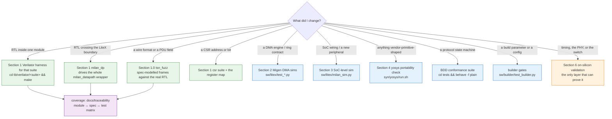

# Testing & verification - the complete map

Every layer of verification in this repo, what it proves, and the exact
command to run it. This page is the map; the per-layer detail stays next to
the tests ([`tb/verilator/README.md`](../../tb/verilator/README.md),
[SIMULATION.md](SIMULATION.md), [RUNNING_TESTS.md](RUNNING_TESTS.md)) and the
current protocol-level verdict is the
[Milan v1.2 audit](MILAN_V12_AUDIT_2026-08-16.md).

> **Suite counts in prose go stale.** Never trust a number in a doc: the
> authoritative harness count is the directory listing (`ls tb/verilator/`,
> one dir per suite) and the authoritative synthesis-top count is the `tops`
> array in [`syn/yosys/run.sh`](../../syn/yosys/run.sh). If a doc and the tree disagree, the tree wins.

> ### The capability boundary this page is now written against (2026-08-16)
>
> This repository's own IEEE 1722.1 / SRP control plane — the AECP/AEM engine,
> the ACMP talker and listener, the ADP advertiser and parser, the lwSRP
> applicant — was **deleted**. The control plane is the `protocol-processor`
> submodule, wrapped by [`hdl/milan/KL_pp_shadow.sv`](../../hdl/milan/KL_pp_shadow.sv)
> and instantiated **unconditionally** by
> [`hdl/milan/milan_datapath.sv`](../../hdl/milan/milan_datapath.sv). No
> parameter, no fallback, no shadow arm.
>
> **ADP, ACMP, SRP and AECP are testable against the processor.** The AECP uCPU
> serves the command inventory in
> [`tests/steps/aecp_engine_steps.py`](../../tests/steps/aecp_engine_steps.py),
> including `READ_DESCRIPTOR` and `GET_COUNTERS`. Unsupported commands receive
> a conformant `NOT_IMPLEMENTED` response. `IDENTIFY_NOTIFICATION` (0x0026)
> arriving as a command receives `BAD_ARGUMENTS` per IEEE 1722.1 Section 7.4.39.2. A
> command for another entity and an AECP response arriving as input are silently
> refused, freed and counted.
>
> `GET_COUNTERS` serves every declared Stream Output with the Milan Table 5.17
> mask and compact five-counter layout. The block and integration suites grade
> STREAM_START, STREAM_STOP, MEDIA_RESET, TIMESTAMP_UNCERTAIN and FRAMES_TX,
> including wrap, reset-on-start, per-index isolation and missing-index refusal.
> The Milan Table 5.22 unsolicited push is still open because the processor's
> unsolicited TX lane has no counter-change producer. IDENTIFY and saved-state
> persistence also remain open.
>
> Verification is split deliberately. The processor's `pp_top` suite grades
> the AECP response path, the root `milan_dp` suite grades the counter sources
> through the wire response for all supported shapes, `tkdiag` grades the
> counter arithmetic, and the BDD suite grades the standards-facing contract.
> The full Verilator sweep and BDD suite run in CI.
>
> **Descriptor enumeration is reachable once the descriptor image is in DRAM.**
> The end-station builder emits `aem_desc.bin`, `aem_desc.json`, and
> `aem_desc.map`; the tracked board flow packages the paired artifacts and runs
> `aemi-load` before enabling the entity. If a custom integration skips that
> step, every `READ_DESCRIPTOR` answers `BAD_ARGUMENTS` because the configuration
> range check runs before the locate and an invalid image reports
> `configurations_count` = 0.
> Use the two error statuses as a discriminator: `BAD_ARGUMENTS` to every read
> means no image (or a corrupt one), `NO_SUCH_DESCRIPTOR` means the image is
> loaded and that descriptor is genuinely absent. Milan Delta 7
> `ACQUIRE_ENTITY` is graded for `NOT_SUPPORTED`, a zero `owner_id`, and the
> command-specific response length.

Machine-checked status rows are defined by the
[Milan feature status ledger](../reference/MILAN_FEATURE_STATUS.md):

<!-- milan-feature-status:start -->
| Feature ID | Status | Canonical value |
|---|---|---|
| `aem.served-command-set` | `implemented` | - |
| `aem.acquire-entity-refusal` | `not-supported` | - |
| `aem.mandatory-missing-set` | `implemented` | - |
| `stream-input.start-stop` | `implemented` | - |
| `stream-input.stopped-crf-observation` | `implemented` | - |
| `stream-format.set` | `implemented` | - |
| `stream-info.set-acc-lat` | `implemented` | - |
| `crf.media-clock-consumption` | `missing` | - |
| `state.nonvolatile-persistence` | `missing` | - |
| `notifications.change-events` | `partial` | - |
| `verification.long-gate-policy` | `implemented` | `local-required, remote-optional` |
<!-- milan-feature-status:end -->

The local full Verilator and Yosys portability sweeps are mandatory validation
evidence. Their long GitHub copies are optional and do not block review when
the local equivalents pass. Issue #97 owns the response-boundary and stopped
CRF observation gaps that keep START/STOP partial.

## Contents

- **[Which layer do I run?](#which-layer-do-i-run)** -- Start here: a flowchart keyed on *what you changed*, answering "what is the cheapest thing that would catch me being wrong". The point it makes is the one-way door at the bottom: timing, PHY and switch interop cannot be simulated here, so exhaust the free layers first.
- **[0. Prerequisites](#0-prerequisites)** -- What each layer needs before it will run, including the two that bite: the Verilator floor of 5.050 (see Section 7 for why) and the `verilog-axis` submodule that five suites elaborate.
- **[1. Verilator RTL harnesses - tb/verilator/ (the live regression)](#1-verilator-rtl-harnesses---tbverilator-the-live-regression)** -- The main regression layer: the one-line sweep, the generated module↔spec↔test coverage map with its ⚪ untested list, the tsn_fuzz field-validation campaign (AAF only since 2026-08-13), and the per-suite table -- reconciled against the tree on 2026-08-13, when it **shrank** by the thirteen suites deleted with the control-plane RTL, with the standing reminder that `ls tb/verilator/` is the authority, not the table.
- **[2. Migen DMA-engine sims - sw/litex/test_\*.py](#2-migen-dma-engine-sims---swlitextest_py)** -- The ring/BD engine sims, and the niche they fill: this layer is invisible to the RTL harnesses and too slow to sweep in the SoC sim.
- **[3. SoC-level simulation - sw/litex/milan_sim.py](#3-soc-level-simulation---swlitexmilan_simpy)** -- Booting the real BIOS on the softcore over Verilator to prove the CPU⇄CSR path end to end -- the M-A2 `"MILN"` read, in simulation, before any board exists.
- **[4. Device-portability check - syn/yosys/](#4-device-portability-check---synyosys)** -- sv2v + Yosys over every top, proving synthesizability off-Xilinx (not behaviour, not timing). Also the two structural reports `run.sh` prints: the tied-off-input inventory and the observer-purity check that taps must never drive the streams they observe.
- **[4b. RTL lint - scripts/lint_rtl.py (the ratcheted gate)](#4b-rtl-lint---scriptslint_rtlpy-the-ratcheted-gate)** -- Verilator `--lint-only` over all 82 modules in `hdl/` for the price of a cache restore, why Verible was not worth a second toolchain (155 of the opening 188 findings were width warnings it cannot compute), and the split that keeps it honest: a per-directory ratchet grandfathers today's backlog and prints it in full, while a malformed `lint_off` or a module that will not elaborate fails outright.
- **[5. Legacy / auxiliary testbenches](#5-legacy--auxiliary-testbenches)** -- What still lives under [`tb/utests`](../../tb/utests), [`tb/itests`](../../tb/itests) and the Questa packet-generator library, why none of it gates anything, and the rule when they disagree with a Verilator suite: trust the Verilator suite.
- **[6. On-silicon validation](#6-on-silicon-validation)** -- The mandatory post-flash step and the reason it exists: a build whose fabric paths run perfectly can still ship with a dead host plane, and every audio drill stays green while the kernel sees nothing. Then the bring-up order and where silicon measurements get logged.
- **[6c. Controller-side validation -- la_avdecc and Hive](#6c-controller-side-validation----la_avdecc-and-hive)** -- The standing rule that every round validates with BOTH la_avdecc and Hive, and why our own tools cannot substitute: how to run the counters probe and read its CLEAN/DIRTY verdict, where the example controllers live, the feature-define ABI trap that SIGSEGVs at run time, and the Hive compile option that makes malformed responses look like a pass.
- **[6b. Unattended campaigns -- status file and alert webhook](#6b-unattended-campaigns----status-file-and-alert-webhook)** -- The design contract for multi-day runs where silence means healthy: one STATUS word answering "alive and healthy" without parsing a log, the deliberate `FAILED` vs `BLOCKED` split (blocked never alerts -- that is the false alarm that teaches people to ignore the next one), a fire-once webhook, and why the primary record lives on the host.
- **[7. Known gaps (kept honest)](#7-known-gaps-kept-honest)** -- The current CI boundary, including the missing Table 5.22 counter-change producer, remaining controller commands and the supported Verilator version.
- **[Policy](#policy)** -- The two standing rules in three sentences: a DUT change ships with its harness update in the same commit, and a module is not done until it appears in layer 1 (and layer 4 unless vendor-gated).

## Which layer do I run?

*I changed X — what is the cheapest thing that would catch me being wrong?*
Every layer below proves something the layer above it cannot. Deliberately no
counts here (see the warning above); the tree is authoritative for those.



**The one-way door is the bottom branch.** Timing closure, PHY behaviour and
switch interop cannot be simulated here — everything above is free and fast,
and silicon time is neither, so exhaust the cheap layers first. The coverage
map that says whether a module has any of these at all is
[`docs/traceability/MODULE_MATRIX.md`](../traceability/MODULE_MATRIX.md), and it
is generated (Section 0.1).

## 0. Prerequisites

| Layer | Needs |
|---|---|
| Verilator harnesses | `verilator >= 5.050`, a C++17 compiler, and `git submodule update --init third_party/verilog-axis protocol-processor`. Five suites elaborate Forencich cores; `pp_shadow`, `milan_dp` and `hostplane` elaborate the processor through `milan_datapath`. No vendor tools are required |
| Yosys portability | `yosys` + [`sv2v`](https://github.com/zachjs/sv2v) on `PATH` + the same submodule |
| Migen DMA sims / SoC sim | a LiteX Python environment ([Section 7 of ../litex/LITEX_SOC.md](../litex/LITEX_SOC.md#7-reproducibility---versions)) |
| Legacy utests/itests | Vivado (xsim); [`tb/avtp_packet_gen_sv`](../../tb/avtp_packet_gen_sv) needs Modelsim/Questa |

## 1. Verilator RTL harnesses - `tb/verilator/` (the live regression)

Self-checking, exit `0` = PASS:

```sh
cd tb/verilator
for d in */ ; do ( cd "$d" && make clean >/dev/null && make ) || exit 1; done
```

Per-suite DUT/what-it-proves table: [`tb/verilator/README.md`](../../tb/verilator/README.md).
`ls tb/verilator/` is authoritative (one dir per suite).
Highlights: `milan_dp` drives the **whole `milan_datapath` wrapper** (the
LiteX integration boundary - CSR ID read, classifier programming, byte-exact
TX/RX); `pp_shadow` is the suite that **grades** the protocol processor as this
device's control plane, and since 2026-08-13 it is the only control-plane suite
of any kind; `controller_rate` is the gating regression born from the
[CBS datapath bug](../findings/CBS_DATAPATH_BUG.md); `cbs`/`ptp` check
arithmetic against independent reference models (10⁴-10⁵ checks each).

**Three suites need the public protocol-processor submodule.**
`milan_datapath` instantiates `KL_pp_shadow` unconditionally, so `pp_shadow`,
`milan_dp` and `hostplane` all resolve `protocol-processor/hdl`. Its remote uses
anonymous HTTPS. Run `git submodule update --init protocol-processor` before
building any of them. The CI workflow initializes it before the full sweep.


### 0.1 Coverage map — the module ↔ spec ↔ test matrix

[`docs/traceability/MODULE_MATRIX.md`](../traceability/MODULE_MATRIX.md) maps
**every** `hdl/` module to its spec family, the clause(s) it appears against,
and the testbench(es) that compile it — with a top **⚪ untested** list that
makes coverage gaps visible (roadmap item-3 per-module traceability). It is
**generated** from the RTL tree + the TB Makefiles + the tsn_fuzz campaign, so
it never drifts: `make matrix` regenerates it and `make matrix-check` (run by
`make` in [`tb/verilator/tsn_fuzz/`](../../tb/verilator/tsn_fuzz)) fails if the committed copy is stale. Each
spec-family leaf dir carries the same table as `README-tests.md`.

### 1.0 `tb/verilator/tsn_fuzz/` — the field-validation campaign (AAF only since 2026-08-13)

Co-simulation campaigns that drive the **real RTL** with spec-modelled traffic
and grade every field of every message. tsn-gen supplies the field/constraint
model; the campaign builds real wire frames, reads DUT state in-band, and gates
on state stability.

| campaign | DUT | covers |
|---|---|---|
| `make aaf` | parser→rxmon→depacketizer | the listener **accept verdict** graded on the parser's own pre-match counters, per-field verdicts, wire-truth channels, **lock survival** |

> **The four 1722.1 campaigns are DELETED, and that is a coverage loss.**
> `make aecp`, `make adp`, `make acmp` and the `legacy` smoke driver fuzzed
> `KL_aecp_top`, `adp_advertiser` and `KL_acmp_listener` — RTL that no longer
> exists in this tree. Nothing replaced them: **there is no field-level fuzzing
> of ADP, ACMP or AECP in this repository any more.** ADP and ACMP are the
> protocol processor's and are exercised end-to-end by `pp_shadow`, which is a
> different and much coarser thing than a per-field campaign — do not read
> `pp_shadow` as inheriting their coverage. **AECP is now a real fuzz target
> again, and an unfuzzed one**: the landed uCPU has a response contract (the
> conformant `NOT_IMPLEMENTED` echo), three `READ_DESCRIPTOR` status paths, an
> opcode-specific `BAD_ARGUMENTS` rule and two silent-refusal rules — all of
> which a malformed-frame campaign could grade, and none of which any campaign
> grades today. It is not a *command* fuzz target: there are no getters or
> setters to fuzz values into. The AAF campaign survives untouched because it
> fuzzes `hdl/ieee1722`, which is data plane and was not replaced.

Run `make` in that directory. A focused local run **skips cleanly** when
tsn-gen is absent, so the harness remains buildable without the generator.
The skip is declared, not silent: the suite prints a `SUITE-SKIP:` line that
`scripts/suite_tally.py` lists in its output, so a smaller total says why. The
suite still reports the two traceability contracts it checks on every run, and
those — not the marker — are what keep it out of `NOCOUNT`; a declared skip
never excuses a suite from producing a count. CI builds
the public `tsn-gen` revision pinned by `TSN_GEN_REV` in
`.github/workflows/rtl.yml`, exports `TSN_GEN_ROOT`, and runs the 164-check AAF
campaign.

A missing, truncated or reworded campaign tally is still fatal, but it is worth
saying *why*, because the reason changed. It used to be fatal by accident: the
suite printed no shape the tally knew, fell to `NOCOUNT`, and stopped the sweep.
Giving the suite an unconditional two-check floor removed that backstop — the
floor clears `NOCOUNT` on its own, so a reworded campaign line would have
dropped 164 checks from the headline with everything green. So the suite's
`aaf` target now requires one of exactly two outcomes, a readable tally or a
declared skip, and fails loudly on anything else.

**No check total is quoted here on purpose.** The campaign ends by printing its
own `N pass, M fail, K known gaps` line, and writes that same line into a
`TEST_RESULTS.md` **in the folder of the RTL it validates**
([`hdl/ieee1722/avtp/doc/`](../../hdl/ieee1722/avtp/doc)) — so a block's
verification status is visible from the block itself and there is no
hand-maintained copy to drift. A second copy here rotted once already: this
page carried a total and a per-campaign breakdown that were both a campaign
behind the suite. Current tally, full rationale, the tsn-gen wire-layout caveat
and the tracked gaps: [`tb/verilator/tsn_fuzz/README.md`](../../tb/verilator/tsn_fuzz/README.md).

### 1.1 Suite index — reconciled against the tree 2026-08-13

[`scripts/run_all_suites.sh`](../../scripts/run_all_suites.sh) runs every dir under [`tb/verilator/`](../../tb/verilator) that has a
`Makefile`. **Run it for the verdicts; this page does not carry them.** The last
whole-tree sweep recorded here (2026-07-26, Verilator v5.050, 55/55 green)
described a tree that no longer exists — twelve of the suites it graded have
since been deleted — so quoting it would be quoting a measurement of a
different design. Its check total was also an under-count: that total came from
`grep -o 'checks: *[0-9]*'` and suites do not all print that string (the tree
emits five summary shapes, and 29 of 57 suite logs matched none of them and
contributed a silent zero — shown by adding 66 assertions to a suite and
watching the printed total not move). Rerun the sweep for both figures.

With no options the script remains the mandatory serial local sweep. GitHub
uses four isolated `--shard INDEX/4` workers to reduce wall time, then keeps
`verilator-suites` as a small aggregate required check. That aggregate compares
the uploaded log names with the live `tb/verilator/*/Makefile` inventory and
fails on a missing, unexpected, or multiply-owned suite before trusting the
combined tally. `scripts/run_all_suites.sh --shard 0/4 --list` shows a worker's
deterministic selection without building it; sharding is a scheduling detail,
not permission to validate only one quarter locally.

> **This table SHRANK on 2026-08-13, and that is the first time it ever has.**
> The standing rule was that every round grows it. Thirteen suites — `aecp`,
> `aempatch`, `acmp`, `acmp_lstn`, `persist`, `adp`, `adp_advertise`,
> `adp_parser`, `lwsrp`, `lwsrp_ctx`, `lwsrp_rx`, `lwsrp_tx`,
> `lwsrp_switchpdu` — were deleted with the RTL they graded, together with the
> `csr` suite's `obj_live` leg and the four 1722.1 `tsn_fuzz` campaigns. **What
> each of them proved is now unproven by anything in this tree.** In
> particular: byte-exact AECP response goldens, the per-index getter/setter
> sweeps, the AEM dynamic-state patch port round trip, the KLJ1 saved-state
> journal decode + replay, the ADP receive `%Error-ENUMVALUE` gate, and the six
> lwSRP applicant/registrar/walker suites. `pp_shadow` does **not** inherit any
> of it — it grades the processor's presence, its RX classify→serializer path,
> its class-D fabric face, the MAAP adapter and the anti-wedge invariant, which
> is a different question from "does this PDU field decode per the clause".

Since 2026-07-28 the tallying lives in
[`scripts/suite_tally.py`](../../scripts/suite_tally.py), which knows every
shape in the tree and — the point — **fails the sweep on a count it cannot
read**. A suite that reports no count, or reports one in a shape nobody taught
the tool, is an *unknown*; the sweep says so and exits non-zero rather than
folding it in as a zero. That is the same rule as *a structural zero is not a
measurement*, applied to the instrument instead of the design. A new suite is
therefore correct by default or loud, never silently uncounted.
Run `python3 scripts/suite_tally.py --selftest` to see both verdicts fire.

A third thing the tool reports but does **not** treat as a verdict: a
`SUITE-SKIP:` line, by which a suite declares that an optional campaign ran
nothing. It is listed so a reader can see why a total is smaller, and that is
all — it adds no checks and does not clear `NOCOUNT`. Letting a marker clear it
would make the verdict a suite's own to declare; measured on a real sweep,
replacing one suite's log with a lone marker hid 72% of the checks behind a
green run. A suite that must skip reports the checks it *did* run instead.

Two more things the sweep now refuses to guess at:

* **Concurrent sweeps.** Every suite builds into a fixed `obj_*` directory
  inside its own `tb/verilator/<suite>/`, so two sweeps in the same tree
  compile into the same objects and contaminate each other's totals. A second
  sweep is now REFUSED (exit 91) instead, naming the holder; `--wait` queues
  behind it. Separate worktrees have separate roots and do not block each
  other — point `SUITE_SWEEP_LOCK` at one shared path to serialise them all.
* **Suites killed by the wall clock.** Each suite runs under `timeout`, and any
  non-zero status used to be recorded as a *failing suite* — so under CPU
  contention from parallel lanes a healthy suite (`hostplane`, more than once)
  was reported as a test failure, costing someone a hunt for a defect that did
  not exist. That case is now its own `TIMEOUT` verdict (exit 92): not a pass,
  not a failure, an unknown. Raise it with `SUITE_TIMEOUT`.

**This table is not the authority — `ls tb/verilator/` is.** It names every
suite the tree carried on 2026-08-13 and what each is for; run the sweep for
verdicts and for check counts.

| suite | what it is for |
|---|---|
| [`tb/verilator/aaf`](../../tb/verilator/aaf) | — |
| [`tb/verilator/aaf_audio_loop`](../../tb/verilator/aaf_audio_loop) | — |
| [`tb/verilator/aaf_latency_taps`](../../tb/verilator/aaf_latency_taps) | the per-stage TX/RX latency taps |
| [`tb/verilator/adp_tx`](../../tb/verilator/adp_tx) | `adp_tx_arbiter` — the generic 2-in-1-out AXIS arbiter, which SURVIVED the control-plane deletion because the data lane uses it too |
| [`tb/verilator/aes3`](../../tb/verilator/aes3) | the AES3/S-PDIF ser/des family |
| [`tb/verilator/avtp_parser`](../../tb/verilator/avtp_parser) | the listener ACCEPT VERDICT at every shipping shape; carries the entry-0 blocker guard (T6) |
| [`tb/verilator/avtp_rxmon`](../../tb/verilator/avtp_rxmon) | — |
| [`tb/verilator/avtp_stream`](../../tb/verilator/avtp_stream) | — |
| [`tb/verilator/cbs`](../../tb/verilator/cbs) | CBS arithmetic vs a fixed-point replica and an ideal 802.1Qav model |
| [`tb/verilator/cdc`](../../tb/verilator/cdc) | — |
| [`tb/verilator/chmap_capture`](../../tb/verilator/chmap_capture) | — |
| [`tb/verilator/chmap_render`](../../tb/verilator/chmap_render) | — |
| [`tb/verilator/classifier`](../../tb/verilator/classifier) | — |
| [`tb/verilator/clkvalid`](../../tb/verilator/clkvalid) | `KL_ptp_clock_validity` — the AVTP `tu` verdict, two shapes |
| [`tb/verilator/cls`](../../tb/verilator/cls) | classification incl. the reserved-DMAC control table and the tagged-0x22F0 negative |
| [`tb/verilator/controller_rate`](../../tb/verilator/controller_rate) | the gating regression born from the CBS datapath bug |
| [`tb/verilator/crf_rx`](../../tb/verilator/crf_rx) | the CRF Media Clock Input engine. It parses, counts and reports, but the root media plane does not consume the processor's stored clock-source selection, so it cannot steer anything |
| [`tb/verilator/crf_tx`](../../tb/verilator/crf_tx) | — |
| [`tb/verilator/csr`](../../tb/verilator/csr) | the executable form of [REGISTER_MAP.md](../reference/REGISTER_MAP.md). Its `obj_live` leg is **deleted** — that leg drove the old control-plane windows live |
| [`tb/verilator/datapath`](../../tb/verilator/datapath) | — |
| [`tb/verilator/eth_tx_reset`](../../tb/verilator/eth_tx_reset) | — |
| [`tb/verilator/hostplane`](../../tb/verilator/hostplane) | the silicon-shape host lanes (RX delivery, ts records, filter-no-leak). Elaborates `milan_datapath`, so it needs the `protocol-processor` submodule |
| [`tb/verilator/i2spb`](../../tb/verilator/i2spb) | — |
| [`tb/verilator/ifg`](../../tb/verilator/ifg) | — |
| [`tb/verilator/lat_history_ring`](../../tb/verilator/lat_history_ring) | — |
| [`tb/verilator/link_guard`](../../tb/verilator/link_guard) | — |
| [`tb/verilator/maap`](../../tb/verilator/maap) | `KL_maap`, which remains the shipping allocator while the processor's internal MAAP engine is disabled |
| [`tb/verilator/mac_rmon`](../../tb/verilator/mac_rmon) | the revived RMON event derivation + STATS_CAP |
| [`tb/verilator/media_nco`](../../tb/verilator/media_nco) | `KL_media_nco`, the steerable media sample grid. See Section 7 -- the servo that would steer it is structurally off in every build |
| [`tb/verilator/milan_dp`](../../tb/verilator/milan_dp) | the whole `milan_datapath` wrapper at legacy, N=4 and N=8; carries the entry-0 blocker guard (TRAP-1). Elaborates the processor with the wrapper, so it needs the `protocol-processor` submodule |
| [`tb/verilator/mmcm_servo`](../../tb/verilator/mmcm_servo) | `KL_mmcm_drp_servo` as a block. Same Section 7 caveat: the block is graded, the build never enables it |
| [`tb/verilator/mmcm_servo_autorepair`](../../tb/verilator/mmcm_servo_autorepair) | — |
| [`tb/verilator/pair_fill`](../../tb/verilator/pair_fill) | `KL_pair_blend` + `KL_pair_zero_fill` |
| [`tb/verilator/pcm_playback`](../../tb/verilator/pcm_playback) | host ring → `KL_pcm_tx` → render crossbar → feed mux → DAC pin, bit-exact plus the negatives |
| [`tb/verilator/pcm_ring_bram`](../../tb/verilator/pcm_ring_bram) | — |
| [`tb/verilator/pcm_tx`](../../tb/verilator/pcm_tx) | — |
| [`tb/verilator/pcmlpf`](../../tb/verilator/pcmlpf) | — |
| [`tb/verilator/pp_shadow`](../../tb/verilator/pp_shadow) | **the control plane.** `milan_datapath` with the protocol processor elaborated in: presence + the `PP_STAT` `0x5B` tag, RX classify → FIFO → serializer → validator on a real ADP `ENTITY_DISCOVER`, the classifier rejecting non-control traffic, the side port answering with the processor's own `KLPP` magic, the class-D fabric face moving (`adp_next_avail_index_o` advances), the MAAP adapter refusing safely and granting, and a global `accepted == answered` anti-wedge invariant. It carries **no** `-Wno-*` at all, so every warning is fatal. Needs the public HTTPS `protocol-processor` submodule |
| [`tb/verilator/ptp`](../../tb/verilator/ptp) | PHC arithmetic vs an independent reference model |
| [`tb/verilator/ptp_sync`](../../tb/verilator/ptp_sync) | — |
| [`tb/verilator/ptp_ts`](../../tb/verilator/ptp_ts) | — |
| [`tb/verilator/queues`](../../tb/verilator/queues) | — |
| [`tb/verilator/rx_filter`](../../tb/verilator/rx_filter) | — |
| [`tb/verilator/shaper_core`](../../tb/verilator/shaper_core) | FQTSS/arbitration, incl. the gPTP-not-starved measurement |
| [`tb/verilator/tcam`](../../tb/verilator/tcam) | — |
| [`tb/verilator/tcam_csr`](../../tb/verilator/tcam_csr) | — |
| [`tb/verilator/tdm`](../../tb/verilator/tdm) | — |
| [`tb/verilator/tdm_render`](../../tb/verilator/tdm_render) | — |
| [`tb/verilator/tkdiag`](../../tb/verilator/tkdiag) | `KL_talker_diag_ctx` grades the Milan Table 5.4 per-STREAM_OUTPUT counter arithmetic, including the nonvacuous MEDIA_RESET reset-on-start path. `milan_datapath` instantiates one context for every AAF output and the CRF output; `milan_dp` grades that integration and its AECP response path |
| [`tb/verilator/tsn_fuzz`](../../tb/verilator/tsn_fuzz) | the field-validation campaign -- **AAF only** since 2026-08-13 (Section 1.0); standalone `make` skips without tsn-gen, CI installs the pinned generator, and the full sweep rejects an uncounted skip |

The standing rule is that every round grows this table. 2026-08-13 is the one
round that shrank it, by deliberate deletion of the RTL underneath — recorded
above rather than smoothed over.

## 2. Migen DMA-engine sims - `sw/litex/test_*.py`

Behavioral sims of the ring-DMA/BD engines that live in `milan_soc.py`
(the layer the RTL harnesses cannot see, and the SoC sim is too slow to
sweep). Self-checking (`ALL PASS`):

```sh
cd sw/litex
for t in test_ring_dma test_ring_bd test_ring_tx test_ring_writeback \
         test_rx_steer test_tx_bd test_pb_bus_err test_pp_mem_bridge; do
    python3 $t.py || exit 1; done
```

The last two are bus-fault sims rather than DMA sims: `test_pb_bus_err.py`
covers the AAF playback fetch (a read that fails must not be latched),
`test_pp_mem_bridge.py` the protocol processor's two main-memory bridges (an
access that is never acked must not wedge them, and with them the whole DMA
bus - the 2026-08-13 board defect).

## 3. SoC-level simulation - `sw/litex/milan_sim.py`

Boots the real LiteX BIOS on the softcore with the real `milan_datapath`
mapped at `0x9000_0000`, over Verilator - proves the CPU⇄CSR path end to end
(milestone M-A2: BIOS reads ID `"MILN"`).

```sh
cd sw/litex && ./milan_sim.py --non-interactive
```

Detail (incl. what each of the three sim layers can and cannot catch):
[SIMULATION.md](SIMULATION.md).

## 4. Device-portability check - `syn/yosys/`

sv2v + Yosys `synth` + `hierarchy -check` over every top in the
[`syn/yosys/run.sh`](../../syn/yosys/run.sh) `tops` array (the authoritative list; fails on any
leftover vendor primitive), plus a concrete non-Xilinx mapping:

```sh
cd syn/yosys
make          # generic, device-independent
make ecp5     # Lattice ECP5 mapping
```

Proves synthesizability off-Xilinx, not behaviour (layer 1 does that) and
not timing. See [Section 5 of ../integration/PORTING_GUIDE.md](../integration/PORTING_GUIDE.md#5-proving-it-the-open-toolchain-portability-check).
`run.sh` also prints two trailing structural reports: the tied-off-input
inventory ([`scripts/check_tied_inputs.sh`](../../scripts/check_tied_inputs.sh), the RMON class) and the
observer-purity check ([`syn/yosys/check_tap_purity.sh`](../../syn/yosys/check_tap_purity.sh) — taps/telemetry must
never drive the observed streams' nets; standalone it is exit-coded and
self-tests against a deliberately-broken fixture).

## 4b. RTL lint - `scripts/lint_rtl.py` (the ratcheted gate)

Verilator `--lint-only` over **every module in `hdl/`** — 82 elaborations,
~10 s on a 4-core runner, wired into the `rtl` workflow as a step *before* the
suite sweep so a lint break is a one-minute verdict rather than an hour's wait.

```sh
python3 scripts/lint_rtl.py            # sweep + census; lowers the ratchet
python3 scripts/lint_rtl.py --check    # the CI gate; writes nothing
python3 scripts/lint_rtl.py --pragmas  # just the `lint_off` gate (instant)
python3 scripts/lint_rtl.py --self-test  # prove the pragma gate still bites
```

**Why Verilator and not Verible** — both were run over the same 89 files
(2026-07-27), so this is measured, not assumed:

| | findings | width findings | cost in CI |
|---|---|---|---|
| Verilator `--lint-only` 5.050 | 188 | **155** (`WIDTHTRUNC` 74 + `WIDTHEXPAND` 81) | zero — the suites already cache this exact binary |

(the 188 is the opening measurement both tools were compared on; the ratchet
has since been paid down to 150 — see below.)
| Verible v0.0-4084, default rules | 1004 | **0** — it has no elaborator | 16.4 MB download + a second cache entry + a second version pin |

916 of Verible's 1004 are pure style, the biggest single rule being 356
`parameter-name-style` — whose default pattern rejects essentially every
parameter in the tree, because [Section 1 of `../../CONTRIBUTING.md`](../../CONTRIBUTING.md#1-hdl-house-style-cemal-dogan--oguz-kahraman-school)
mandates the `_C`/`_P` suffix convention Verible does not expect. Disable
every rule that fights the house style and **three** rules survive, worth
**15** findings (`undersized-binary-literal` 9, `posix-eof` 4,
`case-missing-default` 2 — Verilator already reports 1 of those 2). Fifteen
findings do not buy a second toolchain. Revisit if the tree ever adopts
Verible's naming conventions, or if a *formatter* is wanted — a different job
from this gate.

**Three verdicts, only one of them ratcheted:**

| Verdict | Ratcheted? | Why |
|---|---|---|
| Malformed / unbalanced / unjustified `lint_off` | **no — hard fail** | `lint_off CODE // prose` builds under 5.050 and *does not* build under 5.020; no violation count can express "this file stops building elsewhere". An unexplained `lint_off` is the same defect class as an unexplained tied-off input |
| A module that will not elaborate (`MODMISSING`) | **no — hard fail** | that is a broken build or a broken sweep, not a finding |
| Everything else Verilator codes | **yes** | [`../../scripts/lint.budget`](../../scripts/lint.budget), per directory |

The ratchet is the [`gen_module_matrix.py --check`](../traceability/gen_module_matrix.py)
pattern: a normal run only ever **lowers** an entry, `--check` fails when a
directory exceeds it, and nothing can raise one. It opened at **188** on
2026-07-27 and stands at **150** across 12 directories — `WIDTHEXPAND` 73,
`WIDTHTRUNC` 64, `SYNCASYNCNET` 5, `MULTIDRIVEN` 4, `CASEINCOMPLETE` 2, then
one each of `DECLFILENAME` and `ALWCOMBORDER`. The 38 that went were **one
root cause**: `axi_stream_if` defaulted `TDATA_WIDTH_P` to 32 in a tree where
all 53 instantiations pass 64 explicitly, so any module whose only stream port
is the interface was linted at a width nothing builds it at. Defaulting it to
64 took `SELRANGE` 20 → 0 plus 18 width findings, closed the `ENUMVALUE`
(`KL_adp_parser` gained the explicit cast **and** the tree's first Verilator
suite for it), and retired two `lint_off SELRANGE` pragmas whose recorded
justification had been false since those modules moved to flat 64-bit ports.
The remaining `SYNCASYNCNET` 5 were investigated and deliberately **not**
fixed — see the note in [`../../scripts/lint_rtl.py`](../../scripts/lint_rtl.py);
they are one house-rule deviation (`posedge clk_i or negedge rst_n`, which is
correct for a LiteX `AsyncResetSynchronizer`-driven reset) selected by a
second, correct thing (a 2-FF reset bridge into the audio domain), and
`milan_datapath`'s is inherited from its children rather than its own. Every
one of
them is **printed in full on every gated run**: a ratchet that hides what it
grandfathers is a silent cap, and this project already paid for that once
(`check_tied_inputs.sh`, Section 4).

Waivers are tables in the script, each naming the reason *and where the reason
is recorded* — `TIMESCALEMOD` (a lint-only artifact: two of 95 files carry a
`` `timescale ``, so Verilator flags the other 93) and `PINMISSING` on
`axi_stream_if`'s provably-dead `clk`/`rst_n` ports. [`third_party/verilog-axis`](../../third_party/verilog-axis)
is on the resolution path and is **never linted** — it is upstream code.

## 5. Legacy / auxiliary testbenches

| Where | What | Status |
|---|---|---|
| [`tb/utests/`](../../tb/utests) | Hand-written SystemVerilog TBs run under Vivado **xsim** (`vivado -mode tcl -source <tb>.tcl` where a `.tcl` exists) | **Superseded** for regression by the Verilator suites ([`tb/utests/802_1q_traffic_shaper/README.md`](../../tb/utests/802_1q_traffic_shaper/README.md) maps old→new); waveform-inspection style, not exit-code gating |
| [`tb/itests/`](../../tb/itests) | xsim integration TBs: `ptp_timestamp/` (has `.tcl`, Vivado 2023.1) and `802_1q_traffic_shaper/` (**`.sv` only - no `.tcl` runner**) | Legacy; the Verilator `milan_dp`/`datapath` suites cover the integration seams without vendor tools |
| [`tb/avtp_packet_gen_sv/`](../../tb/avtp_packet_gen_sv) | Randomized AVTP packet-generator class library for the xsim TBs (Modelsim/Questa: `cd tb/avtp_packet_gen_sv/examples && do run.do`) | Development aid, in-progress |
| [`tb/common/`](../../tb/common) | `axi_stream_driver.svh` - shared AXIS BFM class for the xsim TBs (the Verilator suites have their own C++ BFMs) | - |

## 6. On-silicon validation

**Mandatory first step after EVERY flash: [`scripts/hostplane_smoke.sh`](../../scripts/hostplane_smoke.sh) on
the board shell (~60 s).** It verifies the host plane specifically —
`rx_packets` increments, the dma-ts ring offset advances
(`milan_dma_ts_offset`, `0xf0003118` on the flashed AX build — read it from
that build's own `csr.csv`), ID=`MILN` + VERSION readable, the `AAF_CTRL` VID
field intact (`0x0002xxxx`), the ALSA card module loaded, and the protocol
processor's two memory bridges acked every bus access they issued with no
error and no timeout (the `ppmem` counters, plus the `0x5B` presence tag and
the DFI hand-off in `stat[4]`, so an absent bank cannot pass as a quiet bus) --
one PASS/FAIL line per check, nonzero exit on any FAIL.
Rationale: a build whose fabric paths (AAF/CRF/SRP/ADP) run perfectly can
still ship with a dead host plane (2026-07-25 regression class), and every
audio-first drill stays green while the kernel sees nothing. Do not start
any other board procedure until this passes.

Bring-up order and board procedures:
[../integration/BOARD_PORTING_AX7101.md](../integration/BOARD_PORTING_AX7101.md)
(CSR ID read → MAC → DMA), [../integration/QSPI_FLASHBOOT.md](../integration/QSPI_FLASHBOOT.md)
(boot), [RUNNING_TESTS.md](RUNNING_TESTS.md) (all-layers walkthrough incl.
board), and the in-fabric telemetry that instruments silicon runs:
[../fpga/pipeline-telemetry.md](../fpga/pipeline-telemetry.md). Current protocol
validation status: [Milan v1.2 audit](MILAN_V12_AUDIT_2026-08-16.md).
Performance measurements on silicon are logged in the
[findings log](../findings/README.md) with their methodology.

## 6c. Controller-side validation -- la_avdecc and Hive

**STANDING RULE: every round validates with BOTH la_avdecc and Hive.** They are
not interchangeable with the repo's own tools. `avdecc/milan_controller.py` and
the behave models are OUR implementation of the standard; la_avdecc is a
third-party one, and Hive is a GUI over that same library. A defect that both
our tools and our models share is invisible until a foreign implementation
parses the wire.

Everything below runs on the peer/controller host, whose AVB NIC is the one
that sees the DUT. See [../findings/BENCH_TOPOLOGY.md](../findings/BENCH_TOPOLOGY.md)
for hosts and paths.

### The counters probe (scriptable, has a verdict)

```sh
ssh <peer-host>
cd ~/la_avdecc-probe/bin && sudo -n ./counters-probe <avb-iface>
```

**GRADE IT BY PARITY, NOT BY ITS EXIT CODE (measured 2026-08-15).** Run the
same probe against the Milan-validated reference peer on the same wire and
compare the two transcripts. On the 0x004A build ours and the peer's are
identical line for line: `GET_COUNTERS ENTITY` refused `NOT_SUPPORTED` by
both, `STREAM_INPUT 0` Success with `counters_valid 0x00000FFF` on both,
`STREAM_INPUT 999` `NO_SUCH_DESCRIPTOR` on both, `AVB_INTERFACE 0` Success
`0x00000023`, `CLOCK_DOMAIN 0` Success `0x00000003`, and **zero la_avdecc
complaints** on both. The peer nevertheless reports `DIRTY rc=5`, so that code
is unreachable: the compiled binary still expects `GET_COUNTERS ENTITY` to
succeed, which contradicts its own source (`expectSuccess = false`) and
contradicts a real Milan device, since an entity that keeps no ENTITY counters
must refuse. **The bar is: byte-identical behaviour to the reference peer and
`complaints = 0`.** If a true `rc = 0` is ever wanted, rebuild the probe from
its source first, minding the feature-define ABI trap below.

It links real la_avdecc 4.3.1-beta1, so it enforces what Hive enforces, and it
ends in a machine-readable line:

```
PROBE: verdict CLEAN|DIRTY (rc=<n>, complaints=<n>)
```

`rc` counts failed `GET_COUNTERS` calls; `complaints` counts la_avdecc's own
model-validation objections. **`CLEAN` is the pass criterion**, and the two
numbers fail for different reasons: a non-zero `complaints` means the library
rejected something about our descriptors, which is a worse finding than a
missing command.

What it exercises: `GET_COUNTERS` on ENTITY, STREAM_INPUT 0, **STREAM_INPUT
999**, AVB_INTERFACE 0 and CLOCK_DOMAIN 0. Index 999 is deliberate — a bad
index must be answered correctly, not crashed and not answered SUCCESS.

Historical gateware baseline measured 2026-08-14: **`DIRTY (rc=5,
complaints=0)`** because that build returned `NOT_IMPLEMENTED` for the five
requests. The current source serves the supported counter targets. Run
`scripts/verify_la_avdecc_counters.sh` to decode the fixed Stream Output
response fixture with the pinned reference library.

### The example controllers (full model, and connections)

`~/la_avdecc-src/examples/src` carries `entityDumper.cpp` (walks and prints the
whole entity model) and `simpleController.cpp`, alongside `discovery.cpp` and
`streamFormatInfo.cpp`. `~/la_avdecc-probe` is an install tree (`include/`,
`lib/`, `cmake/`) and is the **proven-good recipe**: `counters-probe` was built
against it and runs.

**TRAP, and it has bitten this project: the la_avdecc ABI is sensitive to
feature defines.** A program built with different defines than the library
links cleanly and then SIGSEGVs at run time. On a segfault, suspect the defines
before suspecting the device, and take them from the installed cmake config
rather than guessing.

### Hive

Hive is the GUI. Save its log and read it: it reports `Success` per descriptor,
names each `NOT_IMPLEMENTED` opcode, and emits deserialize warnings that no
other tool shows. Note that Hive is compiled with
`IGNORE_INVALID_NON_SUCCESS_AEM_RESPONSES`, so it **processes malformed
non-success responses anyway** — a size violation shows up as an `Info` line,
not a failure, and a stricter controller would reject it. Do not read a Hive
pass as proof a response is well formed.

## 6b. Unattended campaigns -- status file and alert webhook

A long on-silicon campaign can run for **days**. It is driven from a host, not
from a board, and it is built so that **nobody is woken unless something is
actually wrong**. Silence means healthy.

> **The implementation of this contract is [`../../harness/README.md`](../../harness/README.md)**
> — [`harness/run.sh`](../../harness/run.sh), one entry point over eight phases, with the resume cursor,
> heartbeat, per-phase JSONL, forensic bundle and one-shot alert described below.
> That page also carries the **3am operator contract** (start / resume / where
> the logs are / what to do on `FAILED` / how to tell a device defect from a
> harness problem) and an explicit **proven-vs-inferred** split, because as of
> 2026-07-27 the harness has driven a mock bench and no real hardware. Its
> `es-N.M` item registry lives in the private test repository; only the
> machinery is in this tree.

### The contract is one file

The runner maintains a single `STATUS` file containing exactly one word plus a
one-line reason:

| value | meaning |
|---|---|
| `RUNNING` | in progress; a heartbeat file carries `{phase, item, iteration, timestamp}` |
| `DONE` | the campaign completed and every item passed |
| `FAILED` | a real defect was found — the run stopped escalating and captured a forensic bundle |

Everything else (the append-only JSONL record, the human-readable log, the
per-item artefacts) is detail. "Is it alive, and is it healthy" must be
answerable by reading two small files, without parsing a log.

**`FAILED` and `BLOCKED` are deliberately different.** `FAILED` is a defect in
the device under test. `BLOCKED` is the harness being unable to run an item — a
board unreachable, a tool missing, a capture device busy. Blocked items are
counted and reported but **never raise an alert**: waking someone for a blocked
item is the false alarm that teaches people to ignore the next one.

### The webhook

The runner calls a notification hook exactly once, on the **first** transition
to `FAILED`. Subsequent failures are recorded but do not re-alert, so a single
defect cannot produce a hundred messages overnight.

The hook is a **config value, not code**. If it is unset the hook is a clean
no-op — the campaign still runs and still records everything, it simply has no
off-site channel.

```ini
# campaign config (not committed - it carries site-specific values)
alert_webhook = https://<your-endpoint>
alert_timeout_s = 10
```

The call is a single POST with a short plain-text body, kept under a couple of
hundred characters so it survives mobile truncation, and it leads with the
actionable part:

```sh
curl -fsS --max-time "$ALERT_TIMEOUT_S" -X POST \
     -H 'Content-Type: text/plain' \
     --data "milan campaign FAILED: <item> — <one-line reason> (host <name>, run <id>)" \
     "$ALERT_WEBHOOK"
```

Any endpoint that accepts a POST works — a self-hosted notifier, a chat
integration, or a small script on a machine that is always awake. **The failure
of the webhook must never fail the campaign**: `curl` is invoked with a timeout,
its exit status is recorded, and the run continues either way. An alert that
cannot be delivered is a logging problem, not a test result.

### Why the log lives on the host

The primary record is on the **host**, and it is complete on its own — no result
depends on board-side storage. A multi-day campaign produces far more than the
2 MiB the board reserves for its own writable area, and the host is also the
only thing guaranteed to survive a board that hangs.

Board-side flash logging is reserved for the one case the host cannot observe: a
fault where the board dies before it can report. That path is designed but **not
yet available** — no deployed tree carries an mtd node and no mtd driver is known
to bind to the flash controller in this kernel configuration. The falsifier is
`cat /proc/mtd` after a flash and boot. Until then the hook degrades silently to
host-only.

## 7. Known gaps (kept honest)

* **AECP is partially implemented and graded.** The processor's AECP uCPU
  serves the command inventory in `tests/steps/aecp_engine_steps.py`, including
  `READ_DESCRIPTOR` and `GET_COUNTERS`. Unsupported commands receive the
  conformant fallback response. The processor `pp_top` suite, the root
  `milan_dp` integration suite and the BDD conformance suite grade the served
  paths and the response contract.
  Descriptor enumeration is reachable once the builder-generated image is
  loaded into DRAM. The tracked board flow packages the paired artifacts and
  runs `aemi-load` before enabling the entity. A custom integration that omits
  that step gets `BAD_ARGUMENTS`: the microprogram checks
  `configuration_index` against `configurations_count` before it locates, and an
  invalid image reports a count of zero, so no index passes and the locate is
  never reached. `NO_SUCH_DESCRIPTOR` — the locate-miss status — is therefore
  only reachable against a loaded image, which makes the pair a useful
  discriminator when a controller probe comes back empty. Remaining gaps
  include the Milan Table 5.22 unsolicited counter-change producer, IDENTIFY,
  saved-state persistence and commands still outside the served inventory.
  Milan Delta 7 `ACQUIRE_ENTITY` is graded for `NOT_SUPPORTED`, a zero owner,
  correct addressing, and the command-specific length. Three consequences
  remain easy to mistake for test failures:
  * **The CRF media clock can never be SELECTED.** `SET_CLOCK_SOURCE` is
    accepted and stored, and the wrapper exports the selected index to the root.
    No media-plane consumer reads it, so the active selection stays pinned at
    0 (the INTERNAL media clock) for the life of a build. `KL_mmcm_drp_servo`
    and the `KL_media_nco` packet-grid servo are therefore **structurally off**
    and `A_MCSRV_STAT` (`0x8F8`) reads its idle. Their suites still pass; the
    build never enables what they grade.
  * **Presentation-time offset is pinned at the Milan 2 ms DEFAULT** for every
    Stream Output (`SET_MAX_TRANSIT_TIME` is gone). That is a default, not a
    zero — 0 ns would be a presentation time in the past and every listener
    would drop every frame as late.
  * **Milan Table 5.4 per-STREAM_OUTPUT counters are implemented for solicited
    reads.** `KL_talker_diag_ctx` is instantiated for every declared AAF output
    and the CRF output, and `GET_COUNTERS` returns the compact Milan five-counter
    layout. The Table 5.22 unsolicited push remains open because its change
    producer is not connected to the processor's unsolicited TX lane.
* **The datapath-level suites run in CI.** `pp_shadow`, `milan_dp` and
  `hostplane` elaborate `milan_datapath` with the protocol processor.
  [`.github/workflows/rtl.yml`](../../.github/workflows/rtl.yml) initializes the
  public HTTPS `protocol-processor` and `third_party/verilog-axis` submodules
  before the full Verilator sweep.
* **The BDD conformance suite runs on every verification round** (USER standing
  order, 2026-07-26). `cd tests && behave -f plain` — the run's own tally is
  authoritative, so read it there rather than here; on 2026-08-13 it stood at 12
  features. It is offline by default (the Python models in [`tests/steps`](../../tests/steps) mirror the
  RTL, so it needs no DUT binary and no simulator, and finishes in ~1 s). It is
  the spec-facing counterpart to the Verilator suites: those prove the RTL does
  what it does, this proves it does what the standard says. Wired in as the
  `bdd-conformance` job so it is a gate, not something to remember.
  The suite shrank on 2026-08-13 with the deleted control plane, then grew back
  around the processor command inventory. `aecp_read_descriptor.feature`,
  `aecp_response_contract.feature` and `counters_contract_milan.feature` cover
  the current standards-facing contract. `ls tests/features/` before citing a
  feature file because older filenames remain only in historical records.
* **CI now runs the RTL gates too** (2026-07-26).
  [`.github/workflows/docs.yml`](../../.github/workflows/docs.yml) runs the docs
  gate (twice — the second time with `.git` deleted, so the tarball/zip path
  stays honest), the traceability no-drift gate and the end-station builder
  gates; [`.github/workflows/rtl.yml`](../../.github/workflows/rtl.yml) runs the
  whole Verilator sweep via [`scripts/run_all_suites.sh`](../../scripts/run_all_suites.sh), the ratcheted RTL lint
  (Section 4b) and the Yosys portability sweep. The RTL jobs initialize both
  `verilog-axis` and `protocol-processor`. The docs workflow also initializes
  `protocol-processor` before running the builder gate. Local commands:
  [Section 2 of `../../QUICKSTART.md`](../../QUICKSTART.md#2-track-1--simulate-no-fpga-no-vendor-tools).
* **The SoC is elaborated, and by whom is the open question** (2026-08-21,
  issues #154, #156 and #185). Every argv-to-RTL-parameter chain in this
  repository used to be proven by source-text greps against
  `sw/litex/milan_soc.py`, and three separate blockers in three lanes on one
  day were that one gap: a flag parsed, threaded part of the way, and never
  reaching the parameter it names. In one of them a reviewer severed the
  chain at two independent hops and got `ALL GATES PASS` both times.

  Two gates in [`sw/builder/test_builder.py`](../../sw/builder/test_builder.py)
  close that class. Gate 23f patches `Instance` in the executed module's
  namespace and reads the live `p_*` keyword arguments, so what is graded is
  what elaboration would hand Vivado; eleven negative controls sever the
  chain hop by hop and require it to go red. Gate 23g asserts every
  `build.sh` recipe and every `sweep.sh` leg reaches that same `Instance`
  with the flow tail its own launcher appends, `--build` included, which is
  the flag every shape gate in the tree excludes.

  Both need a LiteX interpreter, and **CI now installs one**.
  [`.github/workflows/elaborate.yml`](../../.github/workflows/elaborate.yml)
  runs on pushes to `dev`/`main`, on pull requests, and on manual dispatch.
  It installs the revisions pinned in
  [`sw/litex/litex_pins.txt`](../../sw/litex/litex_pins.txt), places the
  VexiiRiscv checkout at the revision LiteX itself names, runs
  [`sw/litex/patches/apply.sh`](../../sw/litex/patches/apply.sh), and then
  runs `sw/builder/test_builder.py --require-elaboration`.

  The patch series is the reason that install is three steps and not one.
  Upstream LiteX has no `baremetal` VexiiRiscv variant, which is the shipping
  AX profile, and the revision it pins rejects the `--scala-args` four of the
  five configs pass. [`sw/litex/patches`](../../sw/litex/patches) has always
  carried the series that closes both, but until 2026-08-21 nothing in CI ran
  `apply.sh` and no gate compared its result, so it had silently stopped
  applying. Gate 23h now reconstructs it. #185 carries that measurement.

  A documentation-only pull request pays for none of it: every heavy step is
  gated on `scripts/ci_scope.py`, the classifier PR #176 added, and that
  classifier fails safe - an empty diff or an unresolvable base both come
  back RTL-relevant. Were the script ever absent the workflow would say so in
  its log and elaborate unconditionally rather than guess. The workflow's
  scheduling policy, what makes its check red and what only skips, is the
  `Elaboration` section of [`CI_WORKFLOWS.md`](CI_WORKFLOWS.md).

  What the workflow does **not** prove is stated in its own output:

  | property | why |
  |---|---|
  | the verdict **names every arm that did not run** | `ALL GATES PASS EXCEPT n NOT RUN`, with the reason, is the honest line when a gate declines. A gate that prints its own SKIP and lets the verdict print a green is how the absence of a proof comes to read as the presence of one |
  | `--require-elaboration` **fails** rather than skips | so a broken install cannot quietly return the job to the state it was written to end. Two things fail it: no interpreter, and an interpreter whose VexiiRiscv rejects the `--l2-*` arguments the series adds. A recipe may be recorded as unrunnable only for one exact diagnostic; any other failure is red, and a recorded row becomes red as stale when the recipe starts working. The classifier self-test preserves both teeth after #184 removed the last live row |
  | LiteX is **pinned** in [`sw/litex/litex_pins.txt`](../../sw/litex/litex_pins.txt) | an install from master turns an upstream commit into a red on a pull request that changed nothing, and `migen` on PyPI is stale code sharing a version number with the git tree, which fails at `csr.py:64` on any interpreter newer than 3.10 |
* **The Verilator version matters, and distro packages are not enough.**
  Measured 2026-07-26 by running the suites under each version in a container:

  | Verilator | ships with | result |
  |---|---|---|
  | 5.020 | Ubuntu 24.04 | **cannot build** `hostplane`/`milan_dp`/`tsn_fuzz` and the (since-deleted) `aecp` — `BLKLOOPINIT: Delayed assignment to array inside for loops`, on legal SystemVerilog that Yosys synthesises fine |
  | 5.032 | Debian trixie, Ubuntu 25.04 | builds, but **6 of 490 `aecp` checks** read back `0` (AS_PATH / AVB_INFO CDL, `UNSUPPORTED_FORMAT`, `FRAMES_RX`) — a testbench/C++ ABI sensitivity, not a known RTL fault. **Moot since 2026-08-13**: the suite it was measured on is deleted, so this row can no longer be reproduced. Kept because the sensitivity is a property of the tool, and the next suite it bites will look exactly like this |
  | 5.050 | Arch, and the CI pin | the reference. The 55/55-green figure this row used to quote was the 2026-07-26 sweep of a tree that no longer exists (Section 1.1) -- rerun the sweep |

  CI therefore **builds Verilator from source at a pinned tag** (`VERILATOR_VERSION`
  in the workflow) and caches it, rather than trusting `apt`. The RTL was
  deliberately NOT contorted to satisfy 5.020: the construct it rejects is legal
  and synthesises, so the cost belongs on the toolchain pin, not the design.
  If you are on a distro Verilator and a datapath harness will not build, this
  is why.
* `milan_top` (Zynq variant) is not coverable by the open flows (PS7 + the
  external verilog-ethernet MAC); its TSN content is covered via
  `milan_dp`. It is out of the Section 4b lint sweep for the same reason -- it cannot
  even *elaborate* without the `external/` submodule (an SSH remote CI cannot
  fetch) and the Xilinx `milan_dma` core. Linted against a checked-out
  `external/` it reported **116 `PINMISSING`** — 91 on its `milan_csr`
  instance, 24 on the AECP top, 1 on `ptp_ts_top` — i.e. it had drifted that
  far behind the modules it wires, and that was *before* the control-plane
  deletion removed one of those modules outright. Budget that before reviving
  it.
* The legacy xsim TBs test pre-rework interfaces in places; trust the
  Verilator suites where they disagree.
* Check-counts quoted in READMEs are informational; the harnesses print
  their own counts at run time.

## Policy

Every DUT change ships with its harness update **in the same commit** - the
CSR harness is the executable form of
[../reference/REGISTER_MAP.md](../reference/REGISTER_MAP.md), and a new RTL
module is not "done" until it appears in layer 1 (and layer 4 unless it is
vendor-gated).
