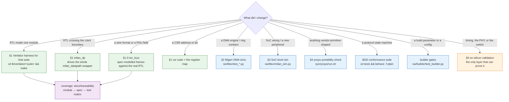

# Testing & verification - the complete map

Every layer of verification in this repo, what it proves, and the exact
command to run it. This page is the map; the per-layer detail stays next to
the tests ([`tb/verilator/README.md`](../../tb/verilator/README.md),
[SIMULATION.md](SIMULATION.md), [RUNNING_TESTS.md](RUNNING_TESTS.md)) and the
protocol-level coverage contract is
[PROTOCOL_VALIDATION_MATRIX.md](PROTOCOL_VALIDATION_MATRIX.md).

> **Suite counts in prose go stale.** Never trust a number in a doc: the
> authoritative harness count is the directory listing (`ls tb/verilator/`,
> one dir per suite) and the authoritative synthesis-top count is the `tops`
> array in `syn/yosys/run.sh`. If a doc and the tree disagree, the tree wins.

## Contents

- **[Which layer do I run?](#which-layer-do-i-run)** — Start here: a flowchart keyed on *what you changed*, answering "what is the cheapest thing that would catch me being wrong". The point it makes is the one-way door at the bottom — timing, PHY and switch interop cannot be simulated here, so exhaust the free layers first.
- **[0. Prerequisites](#0-prerequisites)** — What each layer needs before it will run, including the two that bite: the Verilator floor of 5.050 (see §7 for why) and the `verilog-axis` submodule that five suites elaborate.
- **[1. Verilator RTL harnesses - tb/verilator/ (the live regression)](#1-verilator-rtl-harnesses---tbverilator-the-live-regression)** — The main regression layer: the one-line sweep, the generated module↔spec↔test coverage map with its ⚪ untested list, the tsn_fuzz field-validation campaign, and a full per-suite result table from the 2026-07-26 sweep — with the standing reminder that `ls tb/verilator/` is the authority, not the table.
- **[2. Migen DMA-engine sims - sw/litex/test_\*.py](#2-migen-dma-engine-sims---swlitextest_py)** — The ring/BD engine sims, and the niche they fill: this layer is invisible to the RTL harnesses and too slow to sweep in the SoC sim.
- **[3. SoC-level simulation - sw/litex/milan_sim.py](#3-soc-level-simulation---swlitexmilan_simpy)** — Booting the real BIOS on the softcore over Verilator to prove the CPU⇄CSR path end to end — the M-A2 `"MILN"` read, in simulation, before any board exists.
- **[4. Device-portability check - syn/yosys/](#4-device-portability-check---synyosys)** — sv2v + Yosys over every top, proving synthesizability off-Xilinx (not behaviour, not timing). Also the two structural reports `run.sh` prints: the tied-off-input inventory and the observer-purity check that taps must never drive the streams they observe.
- **[4b. RTL lint - scripts/lint_rtl.py (the ratcheted gate)](#4b-rtl-lint---scriptslint_rtlpy-the-ratcheted-gate)** — Verilator `--lint-only` over all 82 modules in `hdl/` for the price of a cache restore, why Verible was not worth a second toolchain (155 of the opening 188 findings were width warnings it cannot compute), and the split that keeps it honest: a per-directory ratchet grandfathers today's backlog and prints it in full, while a malformed `lint_off` or a module that will not elaborate fails outright.
- **[5. Legacy / auxiliary testbenches](#5-legacy--auxiliary-testbenches)** — What still lives under `tb/utests`, `tb/itests` and the Questa packet-generator library, why none of it gates anything, and the rule when they disagree with a Verilator suite: trust the Verilator suite.
- **[6. On-silicon validation](#6-on-silicon-validation)** — The mandatory post-flash step and the reason it exists: a build whose fabric paths run perfectly can still ship with a dead host plane, and every audio drill stays green while the kernel sees nothing. Then the bring-up order and where silicon measurements get logged.
- **[6b. Unattended campaigns — status file and alert webhook](#6b-unattended-campaigns--status-file-and-alert-webhook)** — The design contract for multi-day runs where silence means healthy: one STATUS word answering "alive and healthy" without parsing a log, the deliberate `FAILED` vs `BLOCKED` split (blocked never alerts — that is the false alarm that teaches people to ignore the next one), a fire-once webhook, and why the primary record lives on the host.
- **[7. Known gaps (kept honest)](#7-known-gaps-kept-honest)** — What CI does and does not cover now, and the measured Verilator version table worth knowing before you file a build bug: 5.020 cannot build four suites, 5.032 silently mis-reads six `aecp` checks, 5.050 is the pin. States why CI builds Verilator from source instead of trusting `apt`, and why the RTL was deliberately not contorted to satisfy the older tool.
- **[Policy](#policy)** — The two standing rules in three sentences: a DUT change ships with its harness update in the same commit, and a module is not done until it appears in layer 1 (and layer 4 unless vendor-gated).

## Which layer do I run?

*I changed X — what is the cheapest thing that would catch me being wrong?*
Every layer below proves something the layer above it cannot. Deliberately no
counts here (see the warning above); the tree is authoritative for those.



**The one-way door is the bottom branch.** Timing closure, PHY behaviour and
switch interop cannot be simulated here — everything above is free and fast,
and silicon time is neither, so exhaust the cheap layers first. The coverage
map that says whether a module has any of these at all is
[`docs/traceability/MODULE_MATRIX.md`](../traceability/MODULE_MATRIX.md), and it
is generated (§0.1).

## 0. Prerequisites

| Layer | Needs |
|---|---|
| Verilator harnesses | `verilator >= 5.050` (the CI pin — see §7: 5.020 **cannot build** four suites and 5.032 mis-reads six `aecp` checks), a C++17 compiler, **and** `git submodule update --init third_party/verilog-axis` (five suites elaborate Forencich cores) - no vendor tools |
| Yosys portability | `yosys` + [`sv2v`](https://github.com/zachjs/sv2v) on `PATH` + the same submodule |
| Migen DMA sims / SoC sim | a LiteX Python environment ([../litex/LITEX_SOC.md](../litex/LITEX_SOC.md) §7) |
| Legacy utests/itests | Vivado (xsim); `tb/avtp_packet_gen_sv` needs Modelsim/Questa |

## 1. Verilator RTL harnesses - `tb/verilator/` (the live regression)

Self-checking, exit `0` = PASS:

```sh
cd tb/verilator
for d in */ ; do ( cd "$d" && make clean >/dev/null && make ) || exit 1; done
```

Per-suite DUT/what-it-proves table: [`tb/verilator/README.md`](../../tb/verilator/README.md).
`ls tb/verilator/` is authoritative (one dir per suite).
Highlights: `milan_dp` drives the **whole `milan_datapath` wrapper** (the
LiteX integration boundary - CSR ID read, classifier programming, byte-exact
TX/RX); `controller_rate` is the gating regression born from the
[CBS datapath bug](../findings/CBS_DATAPATH_BUG.md); `cbs`/`ptp` check
arithmetic against independent reference models (10⁴-10⁵ checks each).


### 0.1 Coverage map — the module ↔ spec ↔ test matrix

[`docs/traceability/MODULE_MATRIX.md`](../traceability/MODULE_MATRIX.md) maps
**every** `hdl/` module to its spec family, the clause(s) it appears against,
and the testbench(es) that compile it — with a top **⚪ untested** list that
makes coverage gaps visible (roadmap item-3 per-module traceability). It is
**generated** from the RTL tree + the TB Makefiles + the tsn_fuzz campaign, so
it never drifts: `make matrix` regenerates it and `make matrix-check` (run by
`make` in `tb/verilator/tsn_fuzz/`) fails if the committed copy is stale. Each
spec-family leaf dir carries the same table as `README-tests.md`.

### 1.0 `tb/verilator/tsn_fuzz/` — IEEE 1722.1 field-validation campaign (2026-07-25)

Four co-simulation campaigns that drive the **real RTL** with spec-modelled
1722.1 traffic and grade every field of every message. tsn-gen supplies the
field/constraint model; the campaign builds real wire frames, reads DUT state
in-band, and gates on state stability.

| campaign | DUT | covers |
|---|---|---|
| `make aecp` | `KL_aecp_top` | getters × 19 descriptor types, setters (legal/illegal/SET→GET), header fuzz, addressing, length, **Milan v1.2 mandatory census 10/10** |
| `make adp` | `adp_advertiser` | all 20 advertised fields at their wire offsets, events, `available_index` |
| `make acmp` | `KL_acmp_listener` | 15 ACMP fields, all 16 message types, BIND→state→UNBIND, 70-byte rule |
| `make aaf` | parser→rxmon→depacketizer | the listener **accept verdict** graded on the parser's own pre-match counters, per-field verdicts, wire-truth channels, **lock survival** |
| `make legacy` | `KL_aecp_top` | the original 14-command cosim smoke driver |

Run `make` in that directory (~3 min). It **skips cleanly** when tsn-gen is
absent, so the suite stays runnable without the generator.

**No check total is quoted here on purpose.** Every campaign ends by printing
its own `N pass, M fail, K known gaps` line, and writes that same line into a
`TEST_RESULTS.md` **in the folder of the RTL it validates**
(`hdl/ieee17221/{aecp,acmp,adp}/doc/`, `hdl/ieee1722/avtp/doc/`) — so a block's
verification status is visible from the block itself and there is no
hand-maintained copy to drift. A second copy here rotted once already: this
page carried a total and a per-campaign breakdown that were both a campaign
behind the suite. Current tally, full rationale, the tsn-gen wire-layout caveat
and the tracked gaps: [`tb/verilator/tsn_fuzz/README.md`](../../tb/verilator/tsn_fuzz/README.md).

### 1.1 Suite index — the full sweep, run 2026-07-26

`scripts/run_all_suites.sh` over every dir under `tb/verilator/` that has a
`Makefile`:

```
suites: 55   passed: 55   failed: 0
checks: 2064050   in-suite failures: 0
```

Verilator v5.050.

> **The totals above predate the 2026-07-28 accounting fix and are too low.**
> The check total used to come from `grep -o 'checks: *[0-9]*'`, and suites do
> not all print that string — the tree emits six different summary shapes, so
> **28 of the 57 suite logs matched none of them and contributed a silent
> zero**. The defect was shown by adding 66 assertions to a suite and watching
> the printed total not move at all. Rerun the sweep for a current figure; do
> not quote the block above.

Since 2026-07-28 the tallying lives in
[`scripts/suite_tally.py`](../../scripts/suite_tally.py), which knows every
shape in the tree and — the point — **fails the sweep on a count it cannot
read**. A suite that reports no count, or reports one in a shape nobody taught
the tool, is an *unknown*; the sweep says so and exits non-zero rather than
folding it in as a zero. That is the same rule as *a structural zero is not a
measurement*, applied to the instrument instead of the design. A new suite is
therefore correct by default or loud, never silently uncounted.
Run `python3 scripts/suite_tally.py --selftest` to see both verdicts fire.

Two more things the sweep now refuses to guess at:

* **Concurrent sweeps.** Every suite builds into a fixed `obj_*` directory
  inside its own `tb/verilator/<suite>/`, so two sweeps in the same tree
  compile into the same objects and contaminate each other's totals. A second
  sweep is now REFUSED (exit 91) instead, naming the holder; `--wait` queues
  behind it. Separate worktrees have separate roots and do not block each
  other — point `SUITE_SWEEP_LOCK` at one shared path to serialise them all.
* **Suites killed by the wall clock.** Each suite runs under `timeout`, and any
  non-zero status used to be recorded as a *failing suite* — so under CPU
  contention from parallel lanes a healthy suite (`hostplane`, more than once)
  was reported as a test failure, costing someone a hunt for a defect that did
  not exist. That case is now its own `TIMEOUT` verdict (exit 92): not a pass,
  not a failure, an unknown. Raise it with `SUITE_TIMEOUT`.

**This table is not the authority — `ls tb/verilator/` is.** Rerun the sweep
rather than trusting the row count here.

| suite | 2026-07-26 sweep | note |
|---|---|---|
| `tb/verilator/aaf` | PASS | — |
| `tb/verilator/aaf_audio_loop` | PASS | — |
| `tb/verilator/aaf_latency_taps` | PASS | 73 checks — the per-stage TX/RX taps |
| `tb/verilator/acmp` | PASS | — |
| `tb/verilator/acmp_lstn` | PASS | — |
| `tb/verilator/adp` | PASS | — |
| `tb/verilator/aempatch` | PASS | 92 checks — the E4 AEM dynamic-state ingest port (CSR 0x7C8-0x7D4). Central leg is a **round trip**: restore a stream format over CSR with ADP down, advertise, read it back over a normal `GET_STREAM_FORMAT`. Second executable gates the store's write-port arbitration at the RAM directly, because the frame level cannot collide the two masters — a mutation campaign is what found that. 10 of 10 injected defects caught |
| `tb/verilator/adp_parser` | PASS | 228 checks — ADP receive; the one suite with `-Wno-fatal` deliberately absent, so `%Error-ENUMVALUE` is a build failure |
| `tb/verilator/adp_tx` | PASS | — |
| `tb/verilator/aecp` | PASS | — |
| `tb/verilator/aes3` | PASS | 50 checks — the AES3/S-PDIF ser/des family |
| `tb/verilator/avtp_parser` | PASS | 10 665 checks — the listener ACCEPT VERDICT at every shipping shape; carries the entry-0 blocker guard (T6) |
| `tb/verilator/avtp_rxmon` | PASS | — |
| `tb/verilator/avtp_stream` | PASS | — |
| `tb/verilator/cbs` | PASS | 129 407 checks — CBS arithmetic vs a fixed-point replica and an ideal 802.1Qav model |
| `tb/verilator/cdc` | PASS | — |
| `tb/verilator/chmap_capture` | PASS | — |
| `tb/verilator/chmap_render` | PASS | — |
| `tb/verilator/classifier` | PASS | — |
| `tb/verilator/cls` | PASS | 200 073 checks — classification incl. the reserved-DMAC control table and the tagged-0x22F0 negative |
| `tb/verilator/controller_rate` | PASS | the gating regression born from the CBS datapath bug |
| `tb/verilator/crf_rx` | PASS | — |
| `tb/verilator/crf_tx` | PASS | — |
| `tb/verilator/csr` | PASS | 337 checks — the executable form of [REGISTER_MAP.md](../reference/REGISTER_MAP.md) |
| `tb/verilator/datapath` | PASS | — |
| `tb/verilator/eth_tx_reset` | PASS | — |
| `tb/verilator/hostplane` | PASS | 77 checks — the silicon-shape host lanes (RX delivery, ts records, filter-no-leak) |
| `tb/verilator/i2spb` | PASS | — |
| `tb/verilator/ifg` | PASS | — |
| `tb/verilator/lat_history_ring` | PASS | — |
| `tb/verilator/link_guard` | PASS | — |
| `tb/verilator/lwsrp` | PASS | — |
| `tb/verilator/lwsrp_ctx` | PASS | — |
| `tb/verilator/lwsrp_rx` | PASS | — |
| `tb/verilator/lwsrp_switchpdu` | PASS | — |
| `tb/verilator/lwsrp_tx` | PASS | — |
| `tb/verilator/maap` | PASS | — |
| `tb/verilator/mac_rmon` | PASS | the revived RMON event derivation + STATS_CAP |
| `tb/verilator/milan_dp` | PASS | 282 checks — the whole milan_datapath wrapper at legacy, N=4 and N=8; carries the entry-0 blocker guard (TRAP-1) |
| `tb/verilator/mmcm_servo` | PASS | — |
| `tb/verilator/mmcm_servo_autorepair` | PASS | — |
| `tb/verilator/pcm_playback` | PASS | 40 checks — host ring → KL_pcm_tx → render crossbar → feed mux → DAC pin, bit-exact plus the negatives |
| `tb/verilator/pcm_ring_bram` | PASS | — |
| `tb/verilator/pcm_tx` | PASS | — |
| `tb/verilator/pcmlpf` | PASS | — |
| `tb/verilator/persist` | PASS | the KLJ1 saved-state journal decode + replay |
| `tb/verilator/ptp` | PASS | 201 250 checks — PHC arithmetic vs an independent reference model |
| `tb/verilator/ptp_sync` | PASS | — |
| `tb/verilator/ptp_ts` | PASS | — |
| `tb/verilator/queues` | PASS | — |
| `tb/verilator/rx_filter` | PASS | — |
| `tb/verilator/shaper_core` | PASS | 1 520 848 checks — FQTSS/arbitration, incl. the gPTP-not-starved measurement |
| `tb/verilator/tcam` | PASS | — |
| `tb/verilator/tcam_csr` | PASS | — |
| `tb/verilator/tdm` | PASS | — |
| `tb/verilator/tdm_render` | PASS | — |
| `tb/verilator/tsn_fuzz` | PASS | the IEEE 1722.1 field-validation campaign (skips cleanly without tsn-gen) |

The standing rule: every round grows this table, never shrinks it.

## 2. Migen DMA-engine sims - `sw/litex/test_*.py`

Behavioral sims of the ring-DMA/BD engines that live in `milan_soc.py`
(the layer the RTL harnesses cannot see, and the SoC sim is too slow to
sweep). Self-checking (`ALL PASS`):

```sh
cd sw/litex
for t in test_ring_dma test_ring_bd test_ring_tx test_ring_writeback \
         test_rx_steer test_tx_bd; do python3 $t.py || exit 1; done
```

## 3. SoC-level simulation - `sw/litex/milan_sim.py`

Boots the real LiteX BIOS on the softcore with the real `milan_datapath`
mapped at `0x9000_0000`, over Verilator - proves the CPU⇄CSR path end to end
(milestone M-A2: BIOS reads ID `"MILN"`).

```sh
cd sw/litex && ./milan_sim.py --non-interactive
```

Detail (incl. what each of the three sim layers can and cannot catch):
[SIMULATION.md](SIMULATION.md).

## 4. Device-portability check - `syn/yosys/`

sv2v + Yosys `synth` + `hierarchy -check` over every top in the
`syn/yosys/run.sh` `tops` array (the authoritative list; fails on any
leftover vendor primitive), plus a concrete non-Xilinx mapping:

```sh
cd syn/yosys
make          # generic, device-independent
make ecp5     # Lattice ECP5 mapping
```

Proves synthesizability off-Xilinx, not behaviour (layer 1 does that) and
not timing. See [../integration/PORTING_GUIDE.md](../integration/PORTING_GUIDE.md) §5.
`run.sh` also prints two trailing structural reports: the tied-off-input
inventory (`scripts/check_tied_inputs.sh`, the RMON class) and the
observer-purity check (`syn/yosys/check_tap_purity.sh` — taps/telemetry must
never drive the observed streams' nets; standalone it is exit-coded and
self-tests against a deliberately-broken fixture).

## 4b. RTL lint - `scripts/lint_rtl.py` (the ratcheted gate)

Verilator `--lint-only` over **every module in `hdl/`** — 82 elaborations,
~10 s on a 4-core runner, wired into the `rtl` workflow as a step *before* the
suite sweep so a lint break is a one-minute verdict rather than an hour's wait.

```sh
python3 scripts/lint_rtl.py            # sweep + census; lowers the ratchet
python3 scripts/lint_rtl.py --check    # the CI gate; writes nothing
python3 scripts/lint_rtl.py --pragmas  # just the `lint_off` gate (instant)
python3 scripts/lint_rtl.py --self-test  # prove the pragma gate still bites
```

**Why Verilator and not Verible** — both were run over the same 89 files
(2026-07-27), so this is measured, not assumed:

| | findings | width findings | cost in CI |
|---|---|---|---|
| Verilator `--lint-only` 5.050 | 188 | **155** (`WIDTHTRUNC` 74 + `WIDTHEXPAND` 81) | zero — the suites already cache this exact binary |

(the 188 is the opening measurement both tools were compared on; the ratchet
has since been paid down to 150 — see below.)
| Verible v0.0-4084, default rules | 1004 | **0** — it has no elaborator | 16.4 MB download + a second cache entry + a second version pin |

916 of Verible's 1004 are pure style, the biggest single rule being 356
`parameter-name-style` — whose default pattern rejects essentially every
parameter in the tree, because [`../../CONTRIBUTING.md`](../../CONTRIBUTING.md) §1
mandates the `_C`/`_P` suffix convention Verible does not expect. Disable
every rule that fights the house style and **three** rules survive, worth
**15** findings (`undersized-binary-literal` 9, `posix-eof` 4,
`case-missing-default` 2 — Verilator already reports 1 of those 2). Fifteen
findings do not buy a second toolchain. Revisit if the tree ever adopts
Verible's naming conventions, or if a *formatter* is wanted — a different job
from this gate.

**Three verdicts, only one of them ratcheted:**

| Verdict | Ratcheted? | Why |
|---|---|---|
| Malformed / unbalanced / unjustified `lint_off` | **no — hard fail** | `lint_off CODE // prose` builds under 5.050 and *does not* build under 5.020; no violation count can express "this file stops building elsewhere". An unexplained `lint_off` is the same defect class as an unexplained tied-off input |
| A module that will not elaborate (`MODMISSING`) | **no — hard fail** | that is a broken build or a broken sweep, not a finding |
| Everything else Verilator codes | **yes** | [`../../scripts/lint.budget`](../../scripts/lint.budget), per directory |

The ratchet is the [`gen_module_matrix.py --check`](../traceability/gen_module_matrix.py)
pattern: a normal run only ever **lowers** an entry, `--check` fails when a
directory exceeds it, and nothing can raise one. It opened at **188** on
2026-07-27 and stands at **150** across 12 directories — `WIDTHEXPAND` 73,
`WIDTHTRUNC` 64, `SYNCASYNCNET` 5, `MULTIDRIVEN` 4, `CASEINCOMPLETE` 2, then
one each of `DECLFILENAME` and `ALWCOMBORDER`. The 38 that went were **one
root cause**: `axi_stream_if` defaulted `TDATA_WIDTH_P` to 32 in a tree where
all 53 instantiations pass 64 explicitly, so any module whose only stream port
is the interface was linted at a width nothing builds it at. Defaulting it to
64 took `SELRANGE` 20 → 0 plus 18 width findings, closed the `ENUMVALUE`
(`KL_adp_parser` gained the explicit cast **and** the tree's first Verilator
suite for it), and retired two `lint_off SELRANGE` pragmas whose recorded
justification had been false since those modules moved to flat 64-bit ports.
The remaining `SYNCASYNCNET` 5 were investigated and deliberately **not**
fixed — see the note in [`../../scripts/lint_rtl.py`](../../scripts/lint_rtl.py);
they are one house-rule deviation (`posedge clk_i or negedge rst_n`, which is
correct for a LiteX `AsyncResetSynchronizer`-driven reset) selected by a
second, correct thing (a 2-FF reset bridge into the audio domain), and
`milan_datapath`'s is inherited from its children rather than its own. Every
one of
them is **printed in full on every gated run**: a ratchet that hides what it
grandfathers is a silent cap, and this project already paid for that once
(`check_tied_inputs.sh`, §4).

Waivers are tables in the script, each naming the reason *and where the reason
is recorded* — `TIMESCALEMOD` (a lint-only artifact: two of 95 files carry a
`` `timescale ``, so Verilator flags the other 93) and `PINMISSING` on
`axi_stream_if`'s provably-dead `clk`/`rst_n` ports. `third_party/verilog-axis`
is on the resolution path and is **never linted** — it is upstream code.

## 5. Legacy / auxiliary testbenches

| Where | What | Status |
|---|---|---|
| `tb/utests/` | Hand-written SystemVerilog TBs run under Vivado **xsim** (`vivado -mode tcl -source <tb>.tcl` where a `.tcl` exists) | **Superseded** for regression by the Verilator suites ([`tb/utests/802_1q_traffic_shaper/README.md`](../../tb/utests/802_1q_traffic_shaper/README.md) maps old→new); waveform-inspection style, not exit-code gating |
| `tb/itests/` | xsim integration TBs: `ptp_timestamp/` (has `.tcl`, Vivado 2023.1) and `802_1q_traffic_shaper/` (**`.sv` only - no `.tcl` runner**) | Legacy; the Verilator `milan_dp`/`datapath` suites cover the integration seams without vendor tools |
| `tb/avtp_packet_gen_sv/` | Randomized AVTP packet-generator class library for the xsim TBs (Modelsim/Questa: `cd tb/avtp_packet_gen_sv/examples && do run.do`) | Development aid, in-progress |
| `tb/common/` | `axi_stream_driver.svh` - shared AXIS BFM class for the xsim TBs (the Verilator suites have their own C++ BFMs) | - |

## 6. On-silicon validation

**Mandatory first step after EVERY flash: `scripts/hostplane_smoke.sh` on
the board shell (~60 s).** It verifies the host plane specifically —
`rx_packets` increments, the dma-ts ring offset advances, ID=`MILN` +
VERSION readable, the `AAF_CTRL` VID field intact (`0x0002xxxx`), the ALSA
card module loaded — one PASS/FAIL line per check, nonzero exit on any FAIL.
Rationale: a build whose fabric paths (AAF/CRF/SRP/ADP) run perfectly can
still ship with a dead host plane (2026-07-25 regression class), and every
audio-first drill stays green while the kernel sees nothing. Do not start
any other board procedure until this passes.

Bring-up order and board procedures:
[../integration/BOARD_PORTING_AX7101.md](../integration/BOARD_PORTING_AX7101.md)
(CSR ID read → MAC → DMA), [../integration/QSPI_FLASHBOOT.md](../integration/QSPI_FLASHBOOT.md)
(boot), [RUNNING_TESTS.md](RUNNING_TESTS.md) (all-layers walkthrough incl.
board), and the in-fabric telemetry that instruments silicon runs:
[../fpga/pipeline-telemetry.md](../fpga/pipeline-telemetry.md). Protocol-by-
protocol validation status: [PROTOCOL_VALIDATION_MATRIX.md](PROTOCOL_VALIDATION_MATRIX.md).
Performance measurements on silicon are logged in the
[findings log](../findings/README.md) with their methodology.

## 6b. Unattended campaigns — status file and alert webhook

A long on-silicon campaign can run for **days**. It is driven from a host, not
from a board, and it is built so that **nobody is woken unless something is
actually wrong**. Silence means healthy.

> **The implementation of this contract is [`../../harness/README.md`](../../harness/README.md)**
> — `harness/run.sh`, one entry point over eight phases, with the resume cursor,
> heartbeat, per-phase JSONL, forensic bundle and one-shot alert described below.
> That page also carries the **3am operator contract** (start / resume / where
> the logs are / what to do on `FAILED` / how to tell a device defect from a
> harness problem) and an explicit **proven-vs-inferred** split, because as of
> 2026-07-27 the harness has driven a mock bench and no real hardware. Its
> `es-N.M` item registry lives in the private test repository; only the
> machinery is in this tree.

### The contract is one file

The runner maintains a single `STATUS` file containing exactly one word plus a
one-line reason:

| value | meaning |
|---|---|
| `RUNNING` | in progress; a heartbeat file carries `{phase, item, iteration, timestamp}` |
| `DONE` | the campaign completed and every item passed |
| `FAILED` | a real defect was found — the run stopped escalating and captured a forensic bundle |

Everything else (the append-only JSONL record, the human-readable log, the
per-item artefacts) is detail. "Is it alive, and is it healthy" must be
answerable by reading two small files, without parsing a log.

**`FAILED` and `BLOCKED` are deliberately different.** `FAILED` is a defect in
the device under test. `BLOCKED` is the harness being unable to run an item — a
board unreachable, a tool missing, a capture device busy. Blocked items are
counted and reported but **never raise an alert**: waking someone for a blocked
item is the false alarm that teaches people to ignore the next one.

### The webhook

The runner calls a notification hook exactly once, on the **first** transition
to `FAILED`. Subsequent failures are recorded but do not re-alert, so a single
defect cannot produce a hundred messages overnight.

The hook is a **config value, not code**. If it is unset the hook is a clean
no-op — the campaign still runs and still records everything, it simply has no
off-site channel.

```ini
# campaign config (not committed - it carries site-specific values)
alert_webhook = https://<your-endpoint>
alert_timeout_s = 10
```

The call is a single POST with a short plain-text body, kept under a couple of
hundred characters so it survives mobile truncation, and it leads with the
actionable part:

```sh
curl -fsS --max-time "$ALERT_TIMEOUT_S" -X POST \
     -H 'Content-Type: text/plain' \
     --data "milan campaign FAILED: <item> — <one-line reason> (host <name>, run <id>)" \
     "$ALERT_WEBHOOK"
```

Any endpoint that accepts a POST works — a self-hosted notifier, a chat
integration, or a small script on a machine that is always awake. **The failure
of the webhook must never fail the campaign**: `curl` is invoked with a timeout,
its exit status is recorded, and the run continues either way. An alert that
cannot be delivered is a logging problem, not a test result.

### Why the log lives on the host

The primary record is on the **host**, and it is complete on its own — no result
depends on board-side storage. A multi-day campaign produces far more than the
2 MiB the board reserves for its own writable area, and the host is also the
only thing guaranteed to survive a board that hangs.

Board-side flash logging is reserved for the one case the host cannot observe: a
fault where the board dies before it can report. That path is designed but **not
yet available** — no deployed tree carries an mtd node and no mtd driver is known
to bind to the flash controller in this kernel configuration. The falsifier is
`cat /proc/mtd` after a flash and boot. Until then the hook degrades silently to
host-only.

## 7. Known gaps (kept honest)

* **The BDD conformance suite runs on every verification round** (USER standing
  order, 2026-07-26). `cd tests && behave` — 45 features / 594 scenarios /
  3548 steps (measured 2026-08-06; the run's own tally is authoritative,
  prose counts go stale), offline by default (the Python models in `tests/steps` mirror the
  RTL, so it needs no DUT binary and no simulator, and finishes in ~3 s). It is
  the spec-facing counterpart to the Verilator suites: those prove the RTL does
  what it does, this proves it does what the standard says. Wired in as the
  `bdd-conformance` job so it is a gate, not something to remember.
* **CI now runs the RTL gates too** (2026-07-26).
  [`.github/workflows/docs.yml`](../../.github/workflows/docs.yml) runs the docs
  gate (twice — the second time with `.git` deleted, so the tarball/zip path
  stays honest), the traceability no-drift gate and the end-station builder
  gates; [`.github/workflows/rtl.yml`](../../.github/workflows/rtl.yml) runs the
  whole Verilator sweep via `scripts/run_all_suites.sh`, the ratcheted RTL lint
  (§4b) and the Yosys portability sweep. Both RTL jobs need the `verilog-axis`
  submodule, which is why they are a separate workflow from the submodule-free
  docs gates. Local commands: [`../../QUICKSTART.md`](../../QUICKSTART.md) §2.
* **The Verilator version matters, and distro packages are not enough.**
  Measured 2026-07-26 by running the suites under each version in a container:

  | Verilator | ships with | result |
  |---|---|---|
  | 5.020 | Ubuntu 24.04 | **cannot build** `aecp`/`hostplane`/`milan_dp`/`tsn_fuzz` — `BLKLOOPINIT: Delayed assignment to array inside for loops`, on legal SystemVerilog that Yosys synthesises fine |
  | 5.032 | Debian trixie, Ubuntu 25.04 | builds, but **6 of 490 `aecp` checks** read back `0` (AS_PATH / AVB_INFO CDL, `UNSUPPORTED_FORMAT`, `FRAMES_RX`) — a testbench/C++ ABI sensitivity, not a known RTL fault. **Open.** |
  | 5.050 | Arch, and the CI pin | reference: **55/55 suites green, 0 failures** (full sweep 2026-07-26). The check total recorded here was 2 064 050, which is an *under-count* — see the note in §1.1; the suite/failure columns are what this row is comparing |

  CI therefore **builds Verilator from source at a pinned tag** (`VERILATOR_VERSION`
  in the workflow) and caches it, rather than trusting `apt`. The RTL was
  deliberately NOT contorted to satisfy 5.020: the construct it rejects is legal
  and synthesises, so the cost belongs on the toolchain pin, not the design.
  If you are on a distro Verilator and a datapath harness will not build, this
  is why.
* `milan_top` (Zynq variant) is not coverable by the open flows (PS7 + the
  external verilog-ethernet MAC); its TSN content is covered via
  `milan_dp`. It is out of the §4b lint sweep for the same reason — it cannot
  even *elaborate* without the `external/` submodule (an SSH remote CI cannot
  fetch) and the Xilinx `milan_dma` core. Linted against a checked-out
  `external/` it reports **116 `PINMISSING`** — 91 on its `milan_csr`
  instance, 24 on `KL_aecp_top`, 1 on `ptp_ts_top` — i.e. it has drifted that
  far behind the modules it wires. Budget that before reviving it.
* The legacy xsim TBs test pre-rework interfaces in places; trust the
  Verilator suites where they disagree.
* Check-counts quoted in READMEs are informational; the harnesses print
  their own counts at run time.

## Policy

Every DUT change ships with its harness update **in the same commit** - the
CSR harness is the executable form of
[../reference/REGISTER_MAP.md](../reference/REGISTER_MAP.md), and a new RTL
module is not "done" until it appears in layer 1 (and layer 4 unless it is
vendor-gated).
