<!--
SPDX-FileCopyrightText: 2026 Kebag Logic
SPDX-License-Identifier: CERN-OHL-W-2.0
-->
# Module ↔ spec ↔ test traceability matrix

**GENERATED — do not hand-edit.** `python3 docs/traceability/gen_module_matrix.py`
(regenerate on any RTL/TB tree change; `--check` gates staleness **and the untested-count ratchet** in CI).

Every module in `hdl/` mapped to its spec family, the clause(s) it
appears against in the clause matrices, and the testbench(es) that
compile it. A module with no testbench is an **⚪ UNTESTED** row —
that is the coverage gap this matrix exists to make visible.

The count of ⚪ rows is ratcheted by [`untested.budget`](untested.budget): a normal run only ever lowers
it, and `--check` fails when the live count exceeds it — so a new
module without a testbench breaks the gate instead of quietly
growing the backlog. The one escape is a 🗄️ **ARCHIVED** banner
marker in the module's own file, which states *why* no open-flow
test is possible and is reproduced verbatim below.

Legend: ✅ dedicated Verilator TB · ➰ exercised transitively in a broader TB's design · 🔬 in the tsn_fuzz field campaign · 📦 package · 🗄️ archived by a stated decision · ⚪ not compiled by any TB.

**Totals:** 91 modules · 89 with a dedicated TB · 0 exercised-only · 53 field-fuzzed · 1 archived · **0 not in any TB**

## Coverage by spec family

*Which family is thinnest on dedicated testbenches?* — the ordering the tables below cannot show. Weakest first.

```mermaid
xychart-beta
    title "Modules per spec family: dedicated testbenches vs total"
    x-axis ["milan", "ieee1722", "ieee8021as", "common", "ieee17221", "ieee8021q"]
    y-axis "modules" 0 --> 36
    bar [3, 35, 5, 10, 19, 19]
    bar [2, 34, 5, 10, 19, 19]
```

The solid bar is the modules carrying a dedicated Verilator testbench; the pale sliver above it is the shortfall against the family total. Exact numbers, including the archived and fuzzed columns the chart cannot show:

| family | modules | ✅ dedicated TB | ➰ exercised only | 🔬 field-fuzzed | 🗄️ archived | ⚪ untested |
|---|---|---|---|---|---|---|
| Milan integration | 3 | 2 | 0 | 0 | 1 | 0 |
| IEEE 1722 (AVTP) | 35 | 34 | 0 | 30 | 0 | 0 |
| IEEE 802.1AS | 5 | 5 | 0 | 0 | 0 | 0 |
| Common / integration | 10 | 10 | 0 | 0 | 0 | 0 |
| IEEE 1722.1 (ATDECC) | 19 | 19 | 0 | 19 | 0 | 0 |
| IEEE 802.1Q | 19 | 19 | 0 | 0 | 0 | 0 |

## 🗄️ Archived modules (no open-flow test is possible)

Reason quoted from each module's own file banner — the generator reads it there, so it cannot drift from the code.

* `milan_top` — `hdl/milan/milan_top.sv`  
  no open-flow testbench is possible for THIS file, and

## IEEE 1722.1 (ATDECC)

_ADP / ACMP / AECP-AEM-MVU_

| module | file | test | clauses |
|---|---|---|---|
| ✅ `KL_acmp_listener` | `ieee17221/acmp/KL_acmp_listener.sv` | `acmp_lstn` · `hostplane` · `milan_dp` · `pp_shadow` · `tsn_fuzz` · 🔬`make acmp` | — |
| ✅ `KL_acmp_lstn_ctx` | `ieee17221/acmp/KL_acmp_lstn_ctx.sv` | `acmp_lstn` · `csr` · `hostplane` · `milan_dp` · `persist` · `tsn_fuzz` · ➰pp_shadow · 🔬`make acmp` | 5.5.1.4, 5.5.2.6, M-ACMP-9 |
| ✅ `KL_acmp_responder` | `ieee17221/acmp/KL_acmp_responder.sv` | `acmp` · `hostplane` · `milan_dp` · 🔬`make acmp` | — |
| ✅ `KL_acmp_tlkr_ctx` | `ieee17221/acmp/KL_acmp_tlkr_ctx.sv` | `acmp` · `hostplane` · `milan_dp` · 🔬`make acmp` | — |
| 📦 `acmp_pkg` | `ieee17221/acmp/acmp_pkg.sv` | 🔬`make acmp` | — |
| ✅ `KL_adp_parser` | `ieee17221/adp/KL_adp_parser.sv` | `adp_parser` · 🔬`make adp` | — |
| ✅ `adp_advertiser` | `ieee17221/adp/adp_advertiser.sv` | `adp` · `adp_advertise` · `hostplane` · `milan_dp` · `tsn_fuzz` · 🔬`make adp` | — |
| 📦 `adp_pkg` | `ieee17221/adp/adp_pkg.sv` | 🔬`make adp` | — |
| ✅ `adp_tx_arbiter` | `ieee17221/adp/adp_tx_arbiter.sv` | `adp_tx` · `hostplane` · `milan_dp` · 🔬`make adp` | — |
| ✅ `KL_aecp_accessor` | `ieee17221/aecp/KL_aecp_accessor.sv` | `aecp` · `aempatch` · `hostplane` · `milan_dp` · 🔬`make aecp` | — |
| ✅ `KL_aecp_aem_dyn_mux` | `ieee17221/aecp/KL_aecp_aem_dyn_mux.sv` | `aecp` · `aempatch` · `hostplane` · `milan_dp` · 🔬`make aecp` | — |
| ✅ `KL_aecp_aem_store` | `ieee17221/aecp/KL_aecp_aem_store.sv` | `aecp` · `aempatch` · `hostplane` · `milan_dp` · 🔬`make aecp` | — |
| ✅ `KL_aecp_common_parser` | `ieee17221/aecp/KL_aecp_common_parser.sv` | `aecp` · `aempatch` · `hostplane` · `milan_dp` · 🔬`make aecp` | — |
| ✅ `KL_aecp_ingress` | `ieee17221/aecp/KL_aecp_ingress.sv` | `aecp` · `aempatch` · `hostplane` · `milan_dp` · 🔬`make aecp` | 5.4.5.3, M-AECP-11 |
| ✅ `KL_aecp_l0_state` | `ieee17221/aecp/KL_aecp_l0_state.sv` | `aecp` · `aempatch` · `hostplane` · `milan_dp` · 🔬`make aecp` | — |
| ✅ `KL_aecp_packet_validator` | `ieee17221/aecp/KL_aecp_packet_validator.sv` | `aecp` · `aempatch` · `hostplane` · `milan_dp` · 🔬`make aecp` | — |
| ✅ `KL_aecp_response_builder` | `ieee17221/aecp/KL_aecp_response_builder.sv` | `aecp` · `aempatch` · `hostplane` · `milan_dp` · 🔬`make aecp` | — |
| ✅ `KL_aecp_timers` | `ieee17221/aecp/KL_aecp_timers.sv` | `aecp` · `aempatch` · `hostplane` · `milan_dp` · 🔬`make aecp` | 5.4.5.3, M-AECP-11 |
| ✅ `KL_aecp_top` | `ieee17221/aecp/KL_aecp_top.sv` | `aecp` · `aempatch` · `hostplane` · `milan_dp` · 🔬`make aecp` | — |
| ✅ `KL_aem_patch` | `ieee17221/aecp/KL_aem_patch.sv` | `aempatch` · ➰aecp,hostplane,milan_dp · 🔬`make aecp` | — |
| ✅ `KL_persist_journal` | `ieee17221/aecp/KL_persist_journal.sv` | `persist` · ➰hostplane,milan_dp · 🔬`make aecp` | 5.5.1.4, 5.5.2.6, M-ACMP-9 |
| 📦 `aecp_pkg` | `ieee17221/aecp/aecp_pkg.sv` | 🔬`make aecp` | — |

## IEEE 1722 (AVTP)

_AAF / CRF / MAAP / AVTP common_

| module | file | test | clauses |
|---|---|---|---|
| ✅ `KL_aaf_capture_i2s` | `ieee1722/aaf/KL_aaf_capture_i2s.sv` | `aaf` · `hostplane` · `milan_dp` · 🔬`make aaf` | 7.3.3 |
| ✅ `KL_aaf_latency_chain` | `ieee1722/aaf/KL_aaf_latency_taps.sv` | `aaf_latency_taps` · `hostplane` · `milan_dp` · 🔬`make aaf` | — |
| ✅ `KL_aaf_packetizer` | `ieee1722/aaf/KL_aaf_packetizer.sv` | `aaf` · `aaf_audio_loop` · `chmap_capture` · `hostplane` · `milan_dp` · `tdm` · 🔬`make aaf` | 35.2.2.8.4, 4.3.5.2, 4.4.2.3, 802.3 |
| ✅ `KL_aaf_rx_depacketizer` | `ieee1722/aaf/KL_aaf_rx_depacketizer.sv` | `aaf_audio_loop` · `avtp_rxmon` · `hostplane` · `milan_dp` · `tsn_fuzz` · 🔬`make aaf` | — |
| ✅ `KL_aes3_rx` | `ieee1722/aaf/KL_aes3_rx.sv` | `aes3` · 🔬`make aaf` | — |
| ✅ `KL_aes3_tx` | `ieee1722/aaf/KL_aes3_tx.sv` | `aes3` · 🔬`make aaf` | — |
| ✅ `KL_chan_map_capture` | `ieee1722/aaf/KL_chan_map_capture.sv` | `chmap_capture` · `hostplane` · `milan_dp` · 🔬`make aaf` | — |
| ✅ `KL_chan_map_render` | `ieee1722/aaf/KL_chan_map_render.sv` | `chmap_render` · `hostplane` · `milan_dp` · `pcm_playback` · 🔬`make aaf` | — |
| ✅ `KL_i2s_feed_mux` | `ieee1722/aaf/KL_i2s_feed_mux.sv` | `hostplane` · `milan_dp` · `pcm_playback` · 🔬`make aaf` | — |
| ✅ `KL_i2s_playback` | `ieee1722/aaf/KL_i2s_playback.sv` | `hostplane` · `i2spb` · `milan_dp` · `mmcm_servo` · `pcm_playback` · 🔬`make aaf` | — |
| ✅ `KL_lat_history_ring` | `ieee1722/aaf/KL_lat_history_ring.sv` | `lat_history_ring` · 🔬`make aaf` | — |
| ✅ `KL_media_adv` | `ieee1722/aaf/KL_media_adv.sv` | `hostplane` · `milan_dp` · 🔬`make aaf` | — |
| ✅ `KL_pair_blend` | `ieee1722/aaf/KL_pair_blend.sv` | `hostplane` · `milan_dp` · `pair_fill` · 🔬`make aaf` | — |
| ✅ `KL_pair_zero_fill` | `ieee1722/aaf/KL_pair_zero_fill.sv` | `hostplane` · `milan_dp` · `pair_fill` · 🔬`make aaf` | 5.3.7.2, 5.3.7.3, M-DEV-13 |
| ✅ `KL_pcm_lpf` | `ieee1722/aaf/KL_pcm_lpf.sv` | `hostplane` · `milan_dp` · `pcmlpf` · 🔬`make aaf` | — |
| ✅ `KL_pcm_ring_bram` | `ieee1722/aaf/KL_pcm_ring_bram.sv` | `hostplane` · `pcm_ring_bram` · 🔬`make aaf` | — |
| ✅ `KL_pcm_route` | `ieee1722/aaf/KL_pcm_route.sv` | `avtp_rxmon` · `hostplane` · `milan_dp` · 🔬`make aaf` | — |
| ✅ `KL_pcm_tx` | `ieee1722/aaf/KL_pcm_tx.sv` | `hostplane` · `milan_dp` · `pcm_playback` · `pcm_tx` · 🔬`make aaf` | — |
| ✅ `KL_tdm_capture` | `ieee1722/aaf/KL_tdm_capture.sv` | `hostplane` · `milan_dp` · `tdm` · 🔬`make aaf` | 7.3.3 |
| ✅ `KL_tdm_capture_master` | `ieee1722/aaf/KL_tdm_capture_master.sv` | `hostplane` · `milan_dp` · `tdm` · 🔬`make aaf` | 7.3.3 |
| ✅ `KL_tdm_render` | `ieee1722/aaf/KL_tdm_render.sv` | `hostplane` · `milan_dp` · `tdm_render` · 🔬`make aaf` | — |
| ✅ `KL_tone_gen` | `ieee1722/aaf/KL_tone_gen.sv` | `chmap_capture` · `hostplane` · `milan_dp` · 🔬`make aaf` | — |
| ✅ `aaf_talker_i2s` | `ieee1722/aaf/aaf_talker_i2s.sv` | `aaf` · `hostplane` · `milan_dp` · 🔬`make aaf` | 4.3.5.2, 4.4.2.3, M-DEV-13 |
| 🔬 `KL_avtp_common_parser` | `ieee1722/avtp/KL_avtp_common_parser.sv` | 🔬`make aaf` | — |
| ✅ `KL_avtp_rx_monitor` | `ieee1722/avtp/KL_avtp_rx_monitor.sv` | `aaf_audio_loop` · `avtp_rxmon` · `hostplane` · `milan_dp` · `tsn_fuzz` · 🔬`make aaf` | 4.3.5.2, 4.4.2.1, M-DEV-13 |
| ✅ `KL_avtp_rx_monitor_ctx` | `ieee1722/avtp/KL_avtp_rx_monitor_ctx.sv` | `avtp_rxmon` · `hostplane` · `milan_dp` · 🔬`make aaf` | 4.3.5.2, 4.4.2.3, 4.4.4.7, 5.17 |
| ✅ `KL_media_clock_restart` | `ieee1722/avtp/KL_media_clock_restart.sv` | `hostplane` · `milan_dp` · `tkdiag` · 🔬`make aaf` | 4.4.4.3, 5.4 |
| ✅ `KL_stream_table` | `ieee1722/avtp/KL_stream_table.sv` | `avtp_parser` · `avtp_rxmon` · `avtp_stream` · `hostplane` · `milan_dp` · 🔬`make aaf` | — |
| ✅ `KL_talker_diag_ctx` | `ieee1722/avtp/KL_talker_diag_ctx.sv` | `hostplane` · `milan_dp` · `tkdiag` · 🔬`make aaf` | 4.25, 4.4.4.3, 5.17, 5.4 |
| ✅ `avtp_stream_parser` | `ieee1722/avtp/avtp_stream_parser.sv` | `aaf_audio_loop` · `avtp_parser` · `avtp_rxmon` · `avtp_stream` · `hostplane` · `milan_dp` · `tsn_fuzz` · 🔬`make aaf` | 4.4.3.4, 4.4.4.3, 5.6 |
| 📦 `avtp_subtype_pkg` | `ieee1722/avtp/avtp_subtype_pkg.sv` | 🔬`make aaf` | — |
| ✅ `KL_crf_rx` | `ieee1722/crf/KL_crf_rx.sv` | `crf_rx` · `hostplane` · `milan_dp` | 1.2, 4.4.4.3, 5.3.8.10, 5.4 |
| ✅ `KL_crf_tx` | `ieee1722/crf/KL_crf_tx.sv` | `crf_tx` · `hostplane` · `milan_dp` | 1.2, 10.4.2, 10.4.3, 10.4.6 |
| ✅ `KL_media_nco` | `ieee1722/crf/KL_media_nco.sv` | `hostplane` · `media_nco` · `milan_dp` | — |
| ✅ `KL_mmcm_drp_servo` | `ieee1722/crf/KL_mmcm_drp_servo.sv` | `hostplane` · `milan_dp` · `mmcm_servo` · `mmcm_servo_autorepair` | — |
| ✅ `KL_maap` | `ieee1722/maap/KL_maap.sv` | `hostplane` · `maap` · `milan_dp` | — |

## IEEE 802.1Q

_TS/CBS shaping · SRP/MRP · VLAN/TCAM filtering_

| module | file | test | clauses |
|---|---|---|---|
| ✅ `rx_mac_filter` | `ieee8021q/filtering/rx_mac_filter.sv` | `hostplane` · `milan_dp` · `rx_filter` · `tcam_csr` | — |
| ✅ `tcam` | `ieee8021q/filtering/tcam.sv` | `hostplane` · `milan_dp` · `rx_filter` · `tcam` · `tcam_csr` | — |
| ✅ `KL_lwsrp_bw_gate` | `ieee8021q/srp/KL_lwsrp_bw_gate.sv` | `csr` · `hostplane` · `lwsrp` · `lwsrp_ctx` · `milan_dp` | — |
| ✅ `KL_lwsrp_ctx` | `ieee8021q/srp/KL_lwsrp_ctx.sv` | `csr` · `hostplane` · `lwsrp` · `lwsrp_ctx` · `milan_dp` | — |
| ✅ `KL_lwsrp_ctx_tx` | `ieee8021q/srp/KL_lwsrp_ctx_tx.sv` | `csr` · `hostplane` · `lwsrp` · `lwsrp_ctx` · `milan_dp` | — |
| ✅ `KL_lwsrp_ingress` | `ieee8021q/srp/KL_lwsrp_ingress.sv` | `csr` · `hostplane` · `lwsrp` · `lwsrp_ctx` · `lwsrp_rx` · `lwsrp_switchpdu` · `milan_dp` | — |
| ✅ `KL_lwsrp_registrar` | `ieee8021q/srp/KL_lwsrp_registrar.sv` | `csr` · `hostplane` · `lwsrp` · `lwsrp_ctx` · `lwsrp_rx` · `lwsrp_switchpdu` · `milan_dp` | — |
| ✅ `KL_lwsrp_rx` | `ieee8021q/srp/KL_lwsrp_rx.sv` | `csr` · `hostplane` · `lwsrp` · `lwsrp_ctx` · `lwsrp_rx` · `lwsrp_switchpdu` · `milan_dp` | — |
| ✅ `KL_lwsrp_ta_registrar` | `ieee8021q/srp/KL_lwsrp_ta_registrar.sv` | `csr` · `hostplane` · `lwsrp` · `lwsrp_ctx` · `lwsrp_rx` · `lwsrp_switchpdu` · `milan_dp` | — |
| ✅ `KL_lwsrp_timers` | `ieee8021q/srp/KL_lwsrp_timers.sv` | `csr` · `hostplane` · `lwsrp` · `lwsrp_ctx` · `milan_dp` | — |
| ✅ `KL_lwsrp_top` | `ieee8021q/srp/KL_lwsrp_top.sv` | `csr` · `hostplane` · `lwsrp` · `lwsrp_ctx` · `milan_dp` | — |
| ✅ `KL_lwsrp_tx` | `ieee8021q/srp/KL_lwsrp_tx.sv` | `csr` · `hostplane` · `lwsrp` · `lwsrp_ctx` · `lwsrp_tx` · `milan_dp` | 5.3.7.2, 5.3.7.3, M-DEV-13 |
| ✅ `KL_lwsrp_walker` | `ieee8021q/srp/KL_lwsrp_walker.sv` | `csr` · `hostplane` · `lwsrp` · `lwsrp_ctx` · `lwsrp_rx` · `lwsrp_switchpdu` · `milan_dp` | — |
| 📦 `lwsrp_pkg` | `ieee8021q/srp/lwsrp_pkg.sv` | — | — |
| ✅ `credit_based_shaper` | `ieee8021q/ts/credit_based_shaper.sv` | `cbs` · `controller_rate` · `datapath` · `hostplane` · `milan_dp` · `shaper_core` | — |
| ✅ `traffic_class_map` | `ieee8021q/ts/traffic_class_map.sv` | `classifier` · `cls` · `controller_rate` · `datapath` · `hostplane` · `milan_dp` | — |
| ✅ `traffic_classifier` | `ieee8021q/ts/traffic_classifier.sv` | `classifier` · `controller_rate` · `datapath` · `hostplane` · `milan_dp` | — |
| ✅ `traffic_controller_802_1q` | `ieee8021q/ts/traffic_controller_802_1q.sv` | `controller_rate` · `datapath` · `hostplane` · `milan_dp` | — |
| ✅ `traffic_queues` | `ieee8021q/ts/traffic_queues.sv` | `controller_rate` · `datapath` · `hostplane` · `milan_dp` · `queues` | — |
| ✅ `traffic_shaping_core` | `ieee8021q/ts/traffic_shaping_core.sv` | `controller_rate` · `datapath` · `hostplane` · `milan_dp` · `shaper_core` | — |

## IEEE 802.1AS

_gPTP timestamping / pdelay / sync_

| module | file | test | clauses |
|---|---|---|---|
| ✅ `KL_ptp_clock_validity` | `ieee8021as/ptp_timestamp/KL_ptp_clock_validity.sv` | `clkvalid` · `hostplane` · `milan_dp` | 1.00, 1.2, 4.3.5.2, 4.4.2.3 |
| ✅ `ptp_csr_sync` | `ieee8021as/ptp_timestamp/ptp_csr_sync.sv` | `hostplane` · `milan_dp` · `ptp_sync` · `ptp_ts` | — |
| ✅ `ptp_ts_core` | `ieee8021as/ptp_timestamp/ptp_ts_core.sv` | `hostplane` · `milan_dp` · `ptp_ts` | — |
| ✅ `ptp_ts_top` | `ieee8021as/ptp_timestamp/ptp_ts_top.sv` | `hostplane` · `milan_dp` · `ptp_ts` | — |
| ✅ `timestamp_counter` | `ieee8021as/ptp_timestamp/timestamp_counter.sv` | `hostplane` · `milan_dp` · `ptp` · `ptp_ts` | — |

## Common / integration

_CSR, CDC, RMON, utilities_

| module | file | test | clauses |
|---|---|---|---|
| ✅ `KL_link_guard` | `common/KL_link_guard.sv` | `hostplane` · `link_guard` · `milan_dp` | 6.2.5, 6.2.5.2.2 |
| ✅ `axis_mux_rr_2in_1out` | `common/axis_mux_rr_2in_1out.sv` | `hostplane` · `milan_dp` · `ptp_ts` | — |
| ✅ `cdc_handshake` | `common/cdc_handshake.sv` | `cdc` · `hostplane` · `milan_dp` · `mmcm_servo` · `mmcm_servo_autorepair` · `ptp_ts` | — |
| ✅ `cdc_pair_fifo` | `common/cdc_pair_fifo.sv` | `aaf` · `aes3` · `hostplane` · `i2spb` · `milan_dp` · `mmcm_servo` · `pcm_playback` · `tdm` · `tdm_render` | — |
| ✅ `cdc_pulse` | `common/cdc_pulse.sv` | `aes3` · `cdc` · `crf_tx` · `hostplane` · `i2spb` · `mac_rmon` · `milan_dp` · `mmcm_servo` · `mmcm_servo_autorepair` · `pcm_playback` · `ptp_ts` | — |
| 📦 `ethernet_packet_pkg` | `common/ethernet_packet_pkg.sv` | — | — |
| ✅ `tx_ifg_gasket` | `common/tx_ifg_gasket.sv` | `hostplane` · `ifg` · `milan_dp` | — |
| ✅ `milan_csr` | `common/csr/milan_csr.sv` | `csr` · `hostplane` · `milan_dp` | — |
| ✅ `KL_mac_rmon_events` | `common/eth_event_counter/KL_mac_rmon_events.sv` | `mac_rmon` | — |
| ✅ `ethernet_events` | `common/eth_event_counter/ethernet_events.sv` | `hostplane` · `milan_dp` | — |
| ✅ `event_counter` | `common/eth_event_counter/event_counter.sv` | `hostplane` · ➰milan_dp | — |

## Milan integration

_datapath + top wrappers_

| module | file | test | clauses |
|---|---|---|---|
| ✅ `KL_pp_shadow` | `milan/KL_pp_shadow.sv` | `pp_shadow` · ➰hostplane,milan_dp | — |
| ✅ `milan_datapath` | `milan/milan_datapath.sv` | `hostplane` · `milan_dp` | 35.2.2, 35.2.4.3, 35.2.7, 4.4.4.3 |
| 🗄️ `milan_top` | `milan/milan_top.sv` | 🗄️ archived | — |

