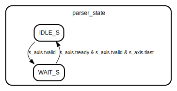

# Entity: KL_avtp_common_parser 
- **File**: KL_avtp_common_parser.sv

## Diagram

## Generics

| Generic name   | Type | Value | Description |
| -------------- | ---- | ----- | ----------- |
| TDATA_WIDTH    | int  | 64    |             |
| PIPELINE_DELAY | int  | 1     |             |

## Description
Get the AVTP common header (Big endian ETH packets - 
Starting from the EthernetType - 22F0 + AVTPDU common headers + ...
e.g first STREAM DATA contains --> S_AXIS_TDATA[63:48]= EthernetType, S_AXIS_TDATA[47:40]=subtype) to identify the received packets, convey the following control/stream and alternative packets to the logic;

* Supported Control Packets -- ADP, AECP, ACPM and MAAP
* Supported Stream Packets -- 61883_IIDC, MMA_STREAM, AAF
* Supported Alternative Packets -- CRF
* Discard the rest of the AVTP packets received.

TDEST port of the AXI4-Stream Master indicates the packet type;
* 0 - Supported Control Packet 
* 1 - Supported Stream Packet
* 2 - Supported Alternative Packet
* 3 - Others

TUSER port of the AXI4-Stream Master dedicated for the Received Subtype

## Ports

| Port name | Direction | Type                 | Description                           |
| --------- | --------- | -------------------- | ------------------------------------- |
| clk_i     | input     | wire                 | Global clock                          |
| rst_n     | input     | wire                 | Active-low Reset                      |
| s_axis    |           | axi_stream_if.slave  | AXI4-Stream Slave interface           |
| m_axis    |           | axi_stream_if.master | AXI4-Stream Master interface for FIFO |

## Signals

| Name                           | Type                      | Description                                                                               |
| ------------------------------ | ------------------------- | ----------------------------------------------------------------------------------------- |
| subtype_enum                   | e                         | AVTP possible subtype-field from  IEEE 1722-2016 Table 6. AVTP Stream data subtype values |
| rcvd_subtype_r                 | reg [7:0]                 | Received subtype field from Slave AXIS                                                    |
| tdata_pipe [0:PIPELINE_DELAY]  | logic [TDATA_WIDTH-1:0]   | Create pipeline registers                                                                 |
| tkeep_pipe [0:PIPELINE_DELAY]  | logic [TDATA_WIDTH/8-1:0] |                                                                                           |
| tvalid_pipe [0:PIPELINE_DELAY] | logic                     |                                                                                           |
| tlast_pipe [0:PIPELINE_DELAY]  | logic                     |                                                                                           |
| tready_pipe [0:PIPELINE_DELAY] | logic                     |                                                                                           |
| skid_data                      | logic [TDATA_WIDTH-1:0]   | Skid buffer for backward path                                                             |
| skid_keep                      | logic [TDATA_WIDTH/8-1:0] |                                                                                           |
| skid_last                      | logic                     |                                                                                           |
| skid_valid                     | logic                     |                                                                                           |
| i                              | int                       | For loop constant                                                                         |
| k                              | int                       |                                                                                           |
| m_ready_reg                    | logic                     | Registered downstream ready                                                               |

## Types

| Name    | Type                                                                                                          | Description                                                                                                                                 |
| ------- | ------------------------------------------------------------------------------------------------------------- | ------------------------------------------------------------------------------------------------------------------------------------------- |
| state_t | enum bit {      IDLE_S,      WAIT_S   } | Supported Control Packets;  `ADP - AECP - ACMP - MAAP`   Supported Stream Packets;  `IIDC, MMA_STREAM, AAF` Supported Alternative Packets;  `CRF` |

## Processes
- skid_buffer_logic: ( @(posedge clk_i) )
  - **Type:** always_ff
- input_pipeline: ( @(posedge clk_i) )
  - **Type:** always_ff
- tready_pipeline: (  )
  - **Type:** always_comb
  - **Description**
  Propagate tready backward through pipeline
- tdest_assign: (  )
  - **Type:** always_comb
  - **Description**
  Handle the TDEST[1:0] w.r.t control, alternative or stream 
  h0 : Packet Control 
  h1 : Packet Stream 
  h2 : Packet Alternative 
  h3 : Not supported, not transmitted
- subtype_save_logic: (@(posedge clk_i))
  - **Type:** always_ff
  - **Description**
  Receive the AVTP packets starting from the EthernetType. Transmit the supported AVTP packets, discard the ones not  supported in this version of the code. 

## State machines
