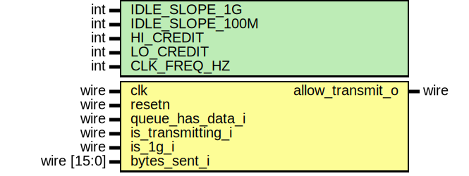

# Entity: credit_based_shaper 
- **File**: credit_based_shaper.sv

## Diagram

## Generics

| Generic name    | Type | Value       | Description                                 |
| --------------- | ---- | ----------- | ------------------------------------------- |
| IDLE_SLOPE_1G   | int  | 750_000_000 | Idle slope in bits per second for 1G(bps)   |
| IDLE_SLOPE_100M | int  | 75_000_000  | Idle slope in bits per second for 100M(bps) |
| HI_CREDIT       | int  | 1536        | Maximum credit (bytes), scaled internally   |
| LO_CREDIT       | int  | -1536       | Minimum credit (bytes), scaled internally   |
| CLK_FREQ_HZ     | int  | 125_000_000 | Clock frequency in Hz                       |

## Ports

| Port name         | Direction | Type        | Description                                  |
| ----------------- | --------- | ----------- | -------------------------------------------- |
| clk               | input     | wire        | clock signal                                 |
| resetn            | input     | wire        | Synhronous active low reset                  |
| queue_has_data_i  | input     | wire        | Queue has data ready to send                 |
| is_transmitting_i | input     | wire        | High when the queue is actively transmitting |
| is_1g_i           | input     | wire        | High when the link rate is 1GBps             |
| bytes_sent_i      | input     | wire [15:0] | Number of bytes sent in current cycle        |
| allow_transmit_o  | output    | wire        | High when credit allows transmission         |

## Signals

| Name                 | Type                | Description                                                 |
| -------------------- | ------------------- | ----------------------------------------------------------- |
| credit               | logic signed [47:0] | Credit counter in Q31.16 fixed-point format (48-bit signed) |
| idle_slope           | logic signed [47:0] | Dynamic idle slope selection                                |
| send_slope           | logic signed [47:0] |                                                             |
| idle_slope_per_cycle | logic signed [47:0] | Fixed-point scaled slope values                             |
| send_slope_per_byte  | logic signed [47:0] |                                                             |

## Processes
- unnamed: (  )
  - **Type:** always_comb
  - **Description**
  Dynamic slope calculation 
- credit_update_logic: ( @( posedge clk ) )
  - **Type:** always_ff
  - **Description**
  Allow transmit if credit is non-negative  Credit update logic 
