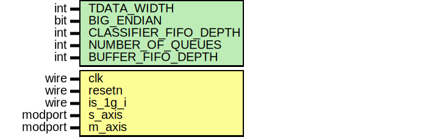

# Entity: traffic_controller_802_1q 
- **File**: traffic_controller_802_1q.sv

## Diagram

## Generics

| Generic name          | Type | Value | Description                          |
| --------------------- | ---- | ----- | ------------------------------------ |
| TDATA_WIDTH           | int  | 64    | AXI-Stream data bus width            |
| BIG_ENDIAN            | bit  | 1     | Determines byte order for classifier |
| CLASSIFIER_FIFO_DEPTH | int  | 64    | FIFO depth for classification stage  |
| NUMBER_OF_QUEUES      | int  | 4     | Number of traffic classes/queues     |
| BUFFER_FIFO_DEPTH     | int  | 8192  | Per-queue FIFO depth                 |

## Ports

| Port name | Direction | Type                 | Description                      |
| --------- | --------- | -------------------- | -------------------------------- |
| clk       | input     | wire                 | Clock signal                     |
| resetn    | input     | wire                 | Active-low synchronous reset     |
| is_1g_i   | input     | wire                 | High when the link rate is 1GBps |
| s_axis    |           | axi_stream_if.slave  | slave interface of AXIS          |
| m_axis    |           | axi_stream_if.master | master interface of AXIS         |

## Signals

| Name           | Type                        | Description                     |
| -------------- | --------------------------- | ------------------------------- |
| queue_grant    | wire [NUMBER_OF_QUEUES-1:0] | One-hot queue grant signals     |
| queue_has_data | wire [NUMBER_OF_QUEUES-1:0] | One-hot queue data availability |

## Constants

| Name        | Type | Value              | Description            |
| ----------- | ---- | ------------------ | ---------------------- |
| TDEST_WIDTH |      | (NUMBER_OF_QUEUES) | Width of `tdest` field |

## Instantiations

- classifier_to_queue: axi_stream_if
  -  AXIS interface from traffic_classifier to traffic_queues- queue_to_shaper: axi_stream_if
  -  AXIS interface from traffic_queues to traffic_shaping_core- classifier: traffic_classifier
  -  Classifier: Extracts priority and assigns `tdest` value- buffer_queues: traffic_queues
  -  buffer_queues: One FIFO per queue, stores packets based on `tdest`- traffic_shaper: traffic_shaping_core
  -  Shaper: Applies Credit-Based Shaping (CBS) to regulate egress flow