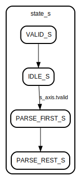

# Entity: KL_adp_parser 
- **File**: KL_adp_parser.sv

## Diagram

## Ports

| Port name           | Direction | Type                | Description                                       |
| ------------------- | --------- | ------------------- | ------------------------------------------------- |
| clk_i               | input     | wire                | Global clock                                      |
| rst_n               | input     | wire                | Active-low Reset                                  |
| s_axis              |           | axi_stream_if.slave | Slave AXI4-Stream interface                       |
| rcv_adp_discover_o  | output    | wire                | Strobe that indicates the ADP packet is DISCOVERY |
| rcv_adp_available_o | output    | wire                | Strobe that indicates the ADP packet is AVAILABLE |
| rcv_adp_departing_o | output    | wire                | Strobe that indicates the ADP packet is DEPARTING |
| rcv_entity_info_o   | output    | entity_info         | Struct that holds the packet information.         |

## Signals

| Name           | Type      | Description                                     |
| -------------- | --------- | ----------------------------------------------- |
| state_s        | e         |                                                 |
| data_counter_r | reg [3:0] | Count the data                                  |
| parse_flag_r   | reg       | Correct AXI4-Stream transaction from Slave side |

## Constants

| Name           | Type | Value | Description                        |
| -------------- | ---- | ----- | ---------------------------------- |
| MAX_DATA_CNT_C |      | 4'd8  | Expected data count on ADP packet. |

## Processes
- parse_logic: ( @(posedge clk_i) )
  - **Type:** always
  - **Description**
  Recieve the s_axis.tvalid and start parsing the input ADP packet. 
- control_logic: ( @(posedge clk_i) )
  - **Type:** always
  - **Description**
  Counting the correct AXI4-Stream Transactions and controlling the PARSE_S state by parse_flag_r register. 

## State machines

