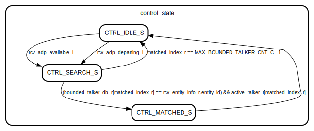
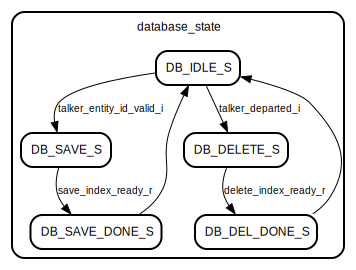
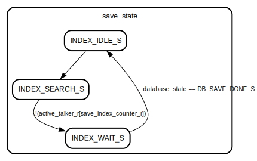
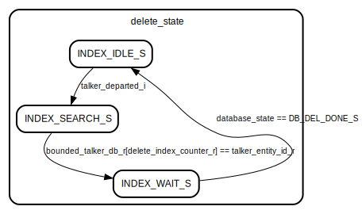

# Entity: KL_discovery_controller 
- **File**: KL_discovery_controller.sv

## Diagram

## Description

Controller for KL_discovery_state  
Tasks; 
1- Save the talker_entity_ids from ACMP - When bound happened talker_entity_id_valid_i will be high  
2- Get the rcv_adp_available, rcv_adp_departing, rcv_entity_id, rcv_available_index, rcv_interface_index and rcv_valid_time from KL_adp_parser.  
3- Loop all the possible talker_entity_ids and compare individually with rcv_entity_id whenever rcv_adp_available OR rcv_adp_departing arrived.  
4- If ids are matched -> Provide RCV_ADP_AVAILABE OR RCV_ADP_DEPARTING events to KL_discovery_state  
5- Align events available_index_o, interface_index_o and valid_time_o

## Ports

| Port name                | Direction | Type                                   | Description                                |
| ------------------------ | --------- | -------------------------------------- | ------------------------------------------ |
| clk_i                    | input     | wire                                   | Global clock                               |
| rst_n                    | input     | wire                                   | Active-low Reset                           |
| talker_entity_id_i       | input     | wire [63:0]                            | From ACMP Top - Talker entity Id           |
| talker_entity_id_valid_i | input     | wire                                   | From ACMP Top - Talker entity Id is valid  |
| talker_departed_i        | input     | wire                                   | From ACMP Top - Talker is departed         |
| rcv_adp_available_i      | input     | wire                                   | Received packet is Available               |
| rcv_adp_departing_i      | input     | wire                                   | Received packet is Departing               |
| rcv_entity_info_i        | input     | entity_info_t                          | Received ATDECC Entity Info                |
| rcv_entity_info_o        | output    | entity_info_t                          | Entity Info to Discovery state module      |
| active_talker_o          | output    | wire [MAX_BOUNDED_TALKER_CNT_C -1 : 0] | Active talkers                             |
| discovery_events_o       | output    | adp_discovery_event_t                  | Discovery events to Discovery state module |

## Signals

| Name                   | Type                                        | Description                                                                 |
| ---------------------- | ------------------------------------------- | --------------------------------------------------------------------------- |
| rcv_adp_available_r    | reg                                         | ADP available received                                                      |
| rcv_adp_departing_r    | reg                                         | ADP departing received                                                      |
| matched_index_r        | reg [clog2(MAX_BOUNDED_TALKER_CNT_C)-1 : 0] | Matched index register                                                      |
| talker_entity_id_r     | reg [63:0]                                  | Holds the entity_id's of bounded talkers and status field                   |
| bounded_talker_db_r    | reg [MAX_BOUNDED_TALKER_CNT_C-1 : 0][63:0]  | Bounded talkers                                                             |
| active_talker_r        | reg [MAX_BOUNDED_TALKER_CNT_C-1 : 0]        | Current active talkers                                                      |
| number_of_talker_r     | reg [clog2(MAX_BOUNDED_TALKER_CNT_C)-1 : 0] | Keep track of the total number_of_talkers that are active                   |
| i                      | int                                         |                                                                             |
| j                      | int                                         |                                                                             |
| save_index_r           | reg [clog2(MAX_BOUNDED_TALKER_CNT_C)-1 : 0] | Index of holding the next available slot to save within bounded_talker_db_r |
| save_index_counter_r   | reg [clog2(MAX_BOUNDED_TALKER_CNT_C)-1 : 0] |                                                                             |
| save_index_ready_r     | reg                                         | Saving index found                                                          |
| delete_index_r         | reg [clog2(MAX_BOUNDED_TALKER_CNT_C)-1 : 0] | Index of holding the bounded talker to be de-activate                       |
| delete_index_counter_r | reg [clog2(MAX_BOUNDED_TALKER_CNT_C)-1 : 0] |                                                                             |
| delete_index_ready_r   | reg                                         | Delete index found                                                          |

## Types

| Name             | Type                                                                                                                                                                                                                                                                                          | Description                                       |
| ---------------- | --------------------------------------------------------------------------------------------------------------------------------------------------------------------------------------------------------------------------------------------------------------------------------------------- | ------------------------------------------------- |
| state_control_t  | enum bit [1:0] {      CTRL_IDLE_S,      CTRL_SEARCH_S,      CTRL_MATCHED_S   }                                                                                                       | Controller state, drive Database and index states |
| state_database_t | enum bit [2:0] {      DB_IDLE_S,      DB_SAVE_S,      DB_DELETE_S,      DB_DEL_DONE_S,      DB_SAVE_DONE_S   } | Database operations state                         |
| state_index_t    | enum bit [1:0] {      INDEX_IDLE_S,      INDEX_SEARCH_S,      INDEX_WAIT_S   }                                                                                                       | Search index state                                |

## Processes
- control_fsm: ( @(posedge clk_i) )
  - **Type:** always
- database_fsm: ( @(posedge clk_i) )
  - **Type:** always
- index_fsm: ( @(posedge clk_i) )
  - **Type:** always
- delete_fsm: ( @(posedge clk_i) )
  - **Type:** always

## State machines

