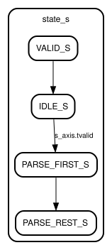

# Entity: KL_adp_parser 
- **File**: KL_adp_parser.sv

## Contents

- **[Diagram](#diagram)** — Generated block symbol (`KL_adp_parser.svg`) — the entity and its port fan-out at a glance.
- **[Ports](#ports)** — The interface contract: one AXIS slave in, three mutually-exclusive message-type strobes out (DISCOVER / AVAILABLE / DEPARTING), and the whole decoded ADPDU delivered as one `entity_info` struct.
- **[Signals](#signals)** — Three internals only: the FSM state, a 4-bit beat counter, and `parse_flag_r`, the "this was a well-formed AXIS transaction" qualifier.
- **[Constants](#constants)** — `MAX_DATA_CNT_C = 8`, the expected beat count of an ADP packet — the single number the parser measures a frame against.
- **[Processes](#processes)** — The two always blocks and their split of duty: `parse_logic` lifts fields off tvalid, `control_logic` counts beats and gates entry into the parse state.
- **[State machines](#state-machines)** — The generated FSM bubble diagram for the parse sequence.

## Diagram

## Ports

| Port name           | Direction | Type                | Description                                       |
| ------------------- | --------- | ------------------- | ------------------------------------------------- |
| clk_i               | input     | wire                | Global clock                                      |
| rst_n               | input     | wire                | Active-low Reset                                  |
| s_axis              |           | axi_stream_if.slave | Slave AXI4-Stream interface                       |
| rcv_adp_discover_o  | output    | wire                | Strobe that indicates the ADP packet is DISCOVERY |
| rcv_adp_available_o | output    | wire                | Strobe that indicates the ADP packet is AVAILABLE |
| rcv_adp_departing_o | output    | wire                | Strobe that indicates the ADP packet is DEPARTING |
| rcv_entity_info_o   | output    | entity_info         | Struct that holds the packet information.         |

## Signals

| Name           | Type      | Description                                     |
| -------------- | --------- | ----------------------------------------------- |
| state_s        | e         |                                                 |
| data_counter_r | reg [3:0] | Count the data                                  |
| parse_flag_r   | reg       | Correct AXI4-Stream transaction from Slave side |

## Constants

| Name           | Type | Value | Description                        |
| -------------- | ---- | ----- | ---------------------------------- |
| MAX_DATA_CNT_C |      | 4'd8  | Expected data count on ADP packet. |

## Processes
- parse_logic: ( @(posedge clk_i) )
  - **Type:** always
  - **Description**
  Recieve the s_axis.tvalid and start parsing the input ADP packet. 
- control_logic: ( @(posedge clk_i) )
  - **Type:** always
  - **Description**
  Counting the correct AXI4-Stream Transactions and controlling the PARSE_S state by parse_flag_r register. 

## State machines

