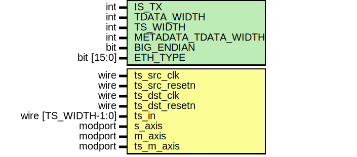
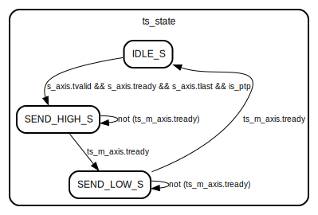

# Entity: ptp_ts_core 
- **File**: ptp_ts_core.sv

## Diagram

## Generics

| Generic name         | Type       | Value  | Description                     |
| -------------------- | ---------- | ------ | ------------------------------- |
| IS_TX                | int        | 1      | Set to 1 for TX mode, 0 for RX  |
| TDATA_WIDTH          | int        | 64     | AXI-Stream data width           |
| TS_WIDTH             | int        | 64     | Timestamp width                 |
| METADATA_TDATA_WIDTH | int        | 64     | Metadata output width           |
| BIG_ENDIAN           | bit        | 1      | Endianness for field extraction |
| ETH_TYPE             | bit [15:0] | 'h88F7 | EtherType for PTP               |

## Ports

| Port name     | Direction | Type                 | Description                                                   |
| ------------- | --------- | -------------------- | ------------------------------------------------------------- |
| ts_src_clk    | input     | wire                 | ts_src_clk Source clock domain for timestamp input            |
| ts_src_resetn | input     | wire                 | ts_src_resetn Active-low reset for source clock domain        |
| ts_dst_clk    | input     | wire                 | ts_dst_clk Destination clock domain for AXI-Stream processing |
| ts_dst_resetn | input     | wire                 | ts_dst_resetn Active-low reset for destination clock domain   |
| ts_in         | input     | wire [TS_WIDTH-1:0]  | ts_in Global timestamp input (source clock domain)            |
| s_axis        |           | axi_stream_if.slave  | s_axis Input AXI-Stream interface for Ethernet frames         |
| m_axis        |           | axi_stream_if.master | m_axis Output AXI-Stream interface (passthrough of input)     |
| ts_m_axis     |           | axi_stream_if.master | ts_m_axis Output AXI-Stream interface for timestamp metadata  |

## Signals

| Name                 | Type                                            | Description                                                                 |
| -------------------- | ----------------------------------------------- | --------------------------------------------------------------------------- |
| ts_cdc_out           | logic [TS_WIDTH-1:0]                            | Timestamp after CDC                                                         |
| ts_captured_src      | logic [TS_WIDTH-1:0]                            | Timestamp latched in source domain                                          |
| start_packet = '0    | logic                                           | Flag to indicate start-of-packet                                            |
| byte_counter         | logic [clog2(PTP_SEQ_ID_OFFSET + BEAT_BYTES):0] | Byte count from SOP                                                         |
| sop_detected         | logic                                           | Indicates start of valid frame                                              |
| cdc_trigger          | wire                                            | Pulse for timestamp capture                                                 |
| ptp_seq_id           | logic [PTP_SEQ_ID_BIT_WIDTH-1:0]                | Extracted sequence ID from PTP header                                       |
| ptp_seq_id_valid = 0 | logic                                           | Latch to mark sequence ID of PTP has been extracted                         |
| seq_id_received      | logic                                           | Flag to indicate seq_id is captured                                         |
| is_ptp               | logic                                           | Indicates frame is PTP (ETH_TYPE matched)                                   |
| eth_type             | logic [ETH_TYPE_BIT_WIDTH-1:0]                  | Extracted ethertype                                                         |
| eth_type_valid = 0   | logic                                           | Latch to mark eth_type has been extracted                                   |
| src_rcv              | logic                                           | Acknowledment from destination logic that data recived                      |
| src_send             | logic                                           | Assertion of signal allows the data will be synchronised                    |
| dest_req             | logic                                           | Assertion of signal inform that the data is ready to be used in dest domain |

## Constants

| Name       | Type | Value                     | Description |
| ---------- | ---- | ------------------------- | ----------- |
| BEAT_BYTES |      | TDATA_WIDTH / BYTE_TO_BIT |             |

## Types

| Name       | Type                                                                                                                                                                           | Description |
| ---------- | ------------------------------------------------------------------------------------------------------------------------------------------------------------------------------ | ----------- |
| ts_state_t | enum logic[1:0]{    IDLE_S,          SEND_HIGH_S,     SEND_LOW_S    } |             |

## Processes
- on_demand_timestamp_capture: ( @(posedge ts_src_clk) )
  - **Type:** always_ff
  - **Description**
  Timestamp Capture in Source Domain 
- sop_detect_and_timestamp: ( @(posedge ts_dst_clk) )
  - **Type:** always_ff
  - **Description**
  Start of Packet Detection 
- byte_counter_logic: ( @(posedge ts_dst_clk) )
  - **Type:** always_ff
  - **Description**
  Byte Counter Logic 
- field_extraction: ( @(posedge ts_dst_clk) )
  - **Type:** always_ff
  - **Description**
  Field Extraction (ETH_TYPE and PTP Sequence ID) 
- unnamed: ( @(posedge ts_dst_clk) )
  - **Type:** always_ff
- to_ps_fifo_logic: ( @(posedge ts_dst_clk) )
  - **Type:** always_ff
  - **Description**
  Timestamp Metadata Output FSM 

## Instantiations

- sop_pulse_cdc: cdc_pulse (hdl/common/cdc_pulse.sv; replaced xpm_cdc_pulse)
  -  AXI-Stream Passthrough Start of packet logic
 SOP Pulse CDC: Triggers timestamp capture from SOP event
- timestamp_cdc: cdc_handshake (hdl/common/cdc_handshake.sv; replaced xpm_cdc_handshake)

## State machines

- Timestamp Metadata Output FSM