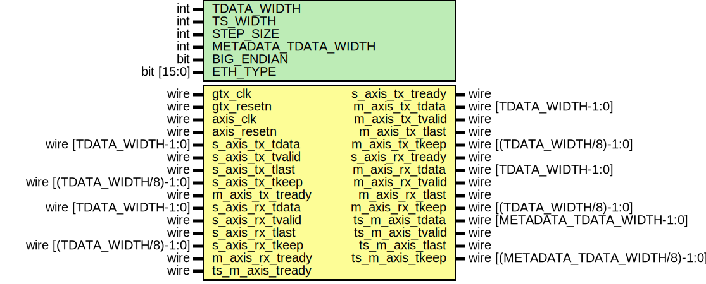

# Entity: ptp_ts_top 
- **File**: ptp_ts_top.sv

## Diagram

## Generics

| Generic name         | Type       | Value  | Description                     |
| -------------------- | ---------- | ------ | ------------------------------- |
| TDATA_WIDTH          | int        | 64     | AXI-Stream data width           |
| TS_WIDTH             | int        | 64     | Timestamp width                 |
| STEP_SIZE            | int        | 8      | Step size per clock cycle       |
| METADATA_TDATA_WIDTH | int        | 64     | Metadata output width           |
| BIG_ENDIAN           | bit        | 0      | Endianness for field extraction |
| ETH_TYPE             | bit [15:0] | 'hF788 | EtherType for PTP               |

## Ports

| Port name        | Direction | Type                                | Description            |
| ---------------- | --------- | ----------------------------------- | ---------------------- |
| gtx_clk          | input     | wire                                | Timestamp clock domain |
| gtx_resetn       | input     | wire                                | Timestamp reset domain |
| axis_clk         | input     | wire                                | AXIS clock domain      |
| axis_resetn      | input     | wire                                | AXIS reset domain      |
| s_axis_tx_tdata  | input     | wire [TDATA_WIDTH-1:0]              | TX AXI-Stream inputs   |
| s_axis_tx_tvalid | input     | wire                                |                        |
| s_axis_tx_tready | output    | wire                                |                        |
| s_axis_tx_tlast  | input     | wire                                |                        |
| s_axis_tx_tkeep  | input     | wire [(TDATA_WIDTH/8)-1:0]          |                        |
| m_axis_tx_tdata  | output    | wire [TDATA_WIDTH-1:0]              | TX AXI-Stream outputs  |
| m_axis_tx_tvalid | output    | wire                                |                        |
| m_axis_tx_tready | input     | wire                                |                        |
| m_axis_tx_tlast  | output    | wire                                |                        |
| m_axis_tx_tkeep  | output    | wire [(TDATA_WIDTH/8)-1:0]          |                        |
| s_axis_rx_tdata  | input     | wire [TDATA_WIDTH-1:0]              | RX AXI-Stream inputs   |
| s_axis_rx_tvalid | input     | wire                                |                        |
| s_axis_rx_tready | output    | wire                                |                        |
| s_axis_rx_tlast  | input     | wire                                |                        |
| s_axis_rx_tkeep  | input     | wire [(TDATA_WIDTH/8)-1:0]          |                        |
| m_axis_rx_tdata  | output    | wire [TDATA_WIDTH-1:0]              | RX AXI-Stream outputs  |
| m_axis_rx_tvalid | output    | wire                                |                        |
| m_axis_rx_tready | input     | wire                                |                        |
| m_axis_rx_tlast  | output    | wire                                |                        |
| m_axis_rx_tkeep  | output    | wire [(TDATA_WIDTH/8)-1:0]          |                        |
| ts_m_axis_tdata  | output    | wire [METADATA_TDATA_WIDTH-1:0]     |                        |
| ts_m_axis_tvalid | output    | wire                                |                        |
| ts_m_axis_tready | input     | wire                                |                        |
| ts_m_axis_tlast  | output    | wire                                |                        |
| ts_m_axis_tkeep  | output    | wire [(METADATA_TDATA_WIDTH/8)-1:0] |                        |

## Signals

| Name      | Type                | Description               |
| --------- | ------------------- | ------------------------- |
| timestamp | wire [TS_WIDTH-1:0] | internal timestamp signal |

## Instantiations

- s_axis_tx: axi_stream_if
  -  AXI-Stream Interface Declarations- s_axis_rx: axi_stream_if
- m_axis_tx: axi_stream_if
- m_axis_rx: axi_stream_if
- ts_m_axis_tx: axi_stream_if
- ts_m_axis_rx: axi_stream_if
- ts_tx_buffered: axi_stream_if
- ts_rx_buffered: axi_stream_if
- ts_switch_to_fifo: axi_stream_if
- ts_counter: timestamp_counter
  -  ts_counter: 64-bit counter for time stamping packets- ptp_ts_tx: ptp_ts_core
  -  TX packets timestamping- ptp_ts_rx: ptp_ts_core
  -  RX packets timestamping- tx_ts_buffer: xpm_fifo_axis
- rx_ts_buffer: xpm_fifo_axis
- axis_tx_rx_ts_switch_rr: axis_mux_rr_2in_1out
  -  AXIS mux to combine buffered TX and RX streams- ts_buffer_to_ps: xpm_fifo_axis
  -  AXIS fifo to store timestamp before DMA engine