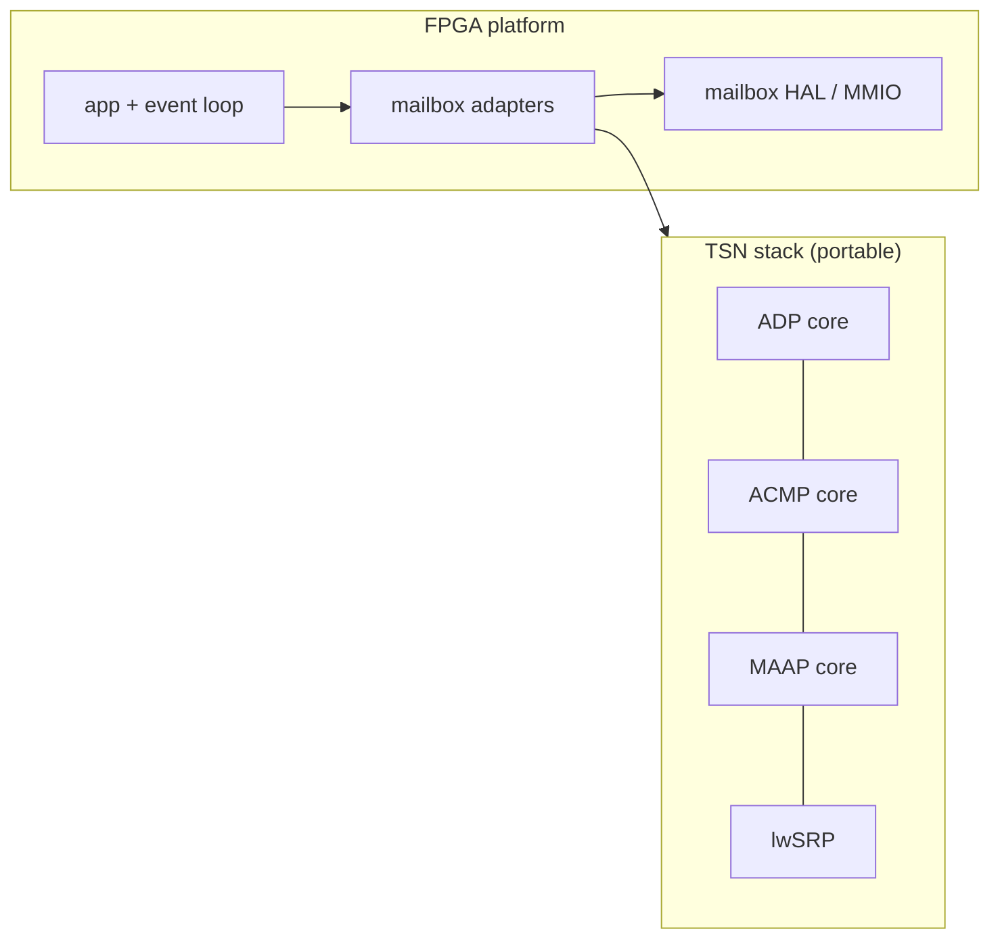

The TSN stack's C code shares one directory with the FPGA platform glue. Separate the two, so the stack is easy to find, reuse and test on its own.

## Today

Everything lives under [`sw/firmware/ctrl/`](https://github.com/kebag-logic/milan-fpga/tree/dev/sw/firmware/ctrl) on dev `6aa25dec`. It mixes three kinds of code.

| Kind | Where today | Depends on |
|---|---|---|
| Protocol cores (the TSN stack) | `adp/adp.c`, `acmp/acmp.c`, `acmp/acmp_nvm.c`, `maap/maap.c`, `wire/wire.h`; SRP is [lwSRP](https://github.com/kebag-logic/lwSRP) in `third_party/lwSRP` | its own header, `wire.h` and libc only |
| Mailbox adapters | `adp/adp_mbx.c`, `acmp/acmp_mbx.c`, `maap/maap_mbx.c`, `maap/maap_csr.c`, `srp/srp_mbx.c` | the core and the FPGA mailbox contract |
| Platform and composition | `mbx/` (contract, HAL, MMIO), `plat/`, `host/` (mailbox model), `port/` (pools, debug, lwSRP port), `app/`, `loop/`, `test/rv32_image/` | the FPGA register map and the RV32 image |

Tests sit in `sw/firmware/ctrl/test/` and [`sw/firmware/gtest/`](https://github.com/kebag-logic/milan-fpga/tree/dev/sw/firmware/gtest). Twelve scripts, workflows and docs name the `sw/firmware/ctrl/` paths.

## Goal

- The protocol cores and their unit tests live in their own location, with no dependency on the mailbox, the register map or the RV32 image.
- The FPGA firmware (adapters, HAL, composition, image) consumes the stack through its public headers only.
- A reader finds "the TSN stack" in one place.

## Decision needed first

Where the stack goes:
- **(a)** a top-level directory in this repository, for example `sw/tsn/`. Recommended first step: one PR, history kept, no new repository to review.
- **(b)** its own repository, used as a submodule, as lwSRP is. That is a later step once (a) has settled the boundary.

## Acceptance

1. The ADP, ACMP and MAAP cores, `wire.h` and their core-only unit tests move to the chosen location with `git mv`, so history is kept. The lwSRP pin is unchanged.
2. A gate refuses any include from the stack into the mailbox, platform, register-map or image code. A planted control must be caught.
3. The adapters, app, loop, HAL and image build unchanged against the stack's headers. The two linked RV32 images are byte-identical before and after the move.
4. Every path that names the old locations is updated: the builder, CI workflows, coverage ratchet, mutation tables, evidence readers and docs. Coverage stays at 100 %, and all mutation campaigns catch the same plants.
5. A short README in the stack's location says what it contains, what it must not depend on, and how to run its tests.

No behaviour change. Relates to #665 (Mark II firmware).
