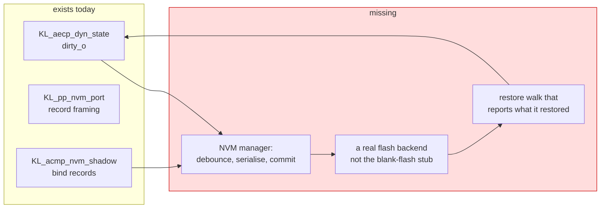

state=open updated=2026-09-28T07:30:44Z
## Refined 2026-08-22 (maintainer instruction: refine the On Hold tickets; READY, sequenced behind #69)

**Decision:** this ticket keeps the saved-state acceptance and now also owns the clean re-landing of the NVM power-cut coverage; #178 is consolidated here and closed.

**State of the world (measured 2026-08-22):**
- Donor `main` is `44489453`, which carries protocol-processor PR #13 (`tb/nvm_port`: a torn commit cannot lose other records; 90/90) together with the #69 notification work. There is no donor commit with one without the other, so the pin bump is #69's; this ticket starts its parent-side work once that pin is on `dev`.
- The parent side is the actual gap: the NVM face is a blank-flash responder (reads 0xFF, writes discarded) and `A_PP_STAT` reports a successful restore of zero records. Nothing persists.

**Work (parent side, after the #69 pin lands):**
1. Decide and record the backing store publicly before implementing: a dedicated QSPI flash region behind the existing SPI-flash controller (the boot flash already holds bitstream + kernel; a sector-aligned record region is the natural home), versus a DRAM shadow committed to flash by firmware/driver. Measure the area of the flash path before committing (USER: keep usage low, re-use the existing controller).
2. Wire the processor's NVM port to that store; a restore walk that finds blank flash must report "nothing restored", never success.
3. Persist and restore the eight Milan items and the binding state listed below; prove power-cut safety with the donor's nvm_port semantics in the parent (a torn commit cannot lose other records).
4. Parent tests: a Verilator bench that writes, power-cycles (reset with retained flash model), restores, and fails when any record is missing; negative control by reverting the store.
5. Docs: `docs/reference/REGISTER_MAP.md` (`A_PP_STAT` semantics), the persistence page, the feature ledger.

Acceptance as in the original body. Closed into this ticket: #178 (re-land lane).

---

## Summary

**Nothing in this device survives a power cycle.**

Milan v1.2 names eight things a PAAD-AE shall save in non-volatile memory and
restore. The processor's NVM face is a blank-flash responder: reads return `0xFF`,
writes are accepted and discarded, erase completes. A restore walk always finds
blank flash and completes with zero records — and reports success, which is worse
than failing, because `A_PP_STAT` then shows a restore that never happened.

This blocks the saved-state compliance tests completely. They are among the few
items in the end-station test plan with **no escape clause**. There is no "if the
DUT does not implement persistence, skip" anywhere in them.

Landed context (VERSION `0x004C`): `KL_aecp_dyn_state.sv` holds every settable
value and raises `dirty_o` when a persisted field moves — deliberately **not** for
the IDENTIFY value, which §5.3.12 keeps volatile. So the "what changed" signal
exists. What does not exist is anything behind it.

## The eight items required by the saved-state compliance tests

> 1. currently set CONFIGURATION
> 2. sampling rate of each AUDIO_UNIT
> 3. format of each STREAM_INPUT/OUTPUT
> 4. presentation time offset of each STREAM_OUTPUT
> 5. channel mappings of each STREAM_PORT_INPUT and STREAM_PORT_OUTPUT
> 6. clock source of each CLOCK_DOMAIN
> 7. entity_name and group_name of the ENTITY descriptor
> 8. name of each other descriptor that has a user-settable name

Plus, from §5.3.8.2/.3/.7, the binding compliance tests also check: the **bound state**, the **binding parameters** (talker entity ID, source
index, requesting controller ID) and the **started/stopped state**.

Milan §5.5.1.2 is blunt about why the bind matters:

> If a Stream Input is in a bound state, it will retain that state across power
> cycles and will only transition into an unbound state due to the intervention of
> a controller.

That is what makes saved-state fast-connect (§5.5.1.4 / §5.5.2.6) possible at all,
and the saved-binding compliance tests power-cycle the DUT and check that the
binding came back.

## What must NOT be persisted

Getting this wrong is its own defect, and two of the three are checked:

| State | Clause | Rule |
|---|---|---|
| lock state + locking controller | §5.3.4.1 | *"The locked state is cleared by a power cycle."* |
| registered-controller list | §5.3.4.2 | *"The list of registered controllers is cleared by a power cycle."* |
| IDENTIFY value | §5.3.12 | 0 = not identifying is *"the default mode after reset"* |

`KL_aecp_dyn_state` already implements the third by not raising `dirty_o` for
`SEL_IDENT`. The first two live in `KL_aecp_notify` and are already volatile by
construction — worth an explicit check rather than an assumption.

One item Milan is **silent** on: whether the current configuration index persists.
The saved-state compliance requirements say it does, so follow the test plan.

## The shape of the work

Three separable pieces, and they can land in this order:

1. **A real backend.** Today's stub is the blocker for everything else. Note the
   existing finding that the blank-flash stub makes `A_PP_STAT` report a restore
   that never happened — the honest failure mode is a restore that says
   "zero records, and here is why", not one that says "done".
2. **The manager**: debounce (a controller sweeping a config should not write flash
   per command), serialise the dynamic store plus the bind records, commit, and
   handle a power cut mid-write without bricking the saved set. `KL_pp_nvm_port`
   already does record framing and `tb/nvm_port` covers it.
3. **The restore walk**, which must write the dynamic store's rows **and their
   valid bits** — this is exactly why the store was built with a valid-bit fallback
   rather than a boot seed from the image: a restore just writes rows, and does not
   have to be sequenced against a seeder that would otherwise overwrite it.

## Wear and correctness

Not a clause, but it will bite on the bench: `dirty_o` rises on every persisted
write, and the mapping compliance sequence alone issues a dozen SETs in a row. A commit
per command would burn erase cycles for no benefit. Debounce, and say in the PR
what the window is and what a power cut inside it loses.

## Blocks

The saved-state, saved-binding, and fast-connect compliance tests, including
the Milan §5.5.1.4 and §5.5.2.6 power-cycle behavior.

## How we prove it

**Desk (`protocol-processor/tb/`)**
- `tb/nvm_port`: the record framing already has coverage; extend it with a
  **power-cut** case — a commit interrupted mid-write must leave the previous saved
  set intact and readable, never a half-record that restores as garbage.
- A new `tb/nvm_manager` (or an arm of `tb/dyn_state`): set every one of the eight
  items, commit, reset the DUT, restore, and read every value back through the
  AECP commands. The vacuity trap to avoid: a restore that writes nothing and a
  store that was never reset both "pass" a naive read-back, so the reset must be
  proven to have cleared the rows first.
- The **volatile** set: after restore, the lock is clear, the registry is empty and
  IDENTIFY is 0. A persistence layer that saved those is a defect.

**Model-driven (`tb/verilator/milan_dp`)**
- The `[AECP-MODEL]` block already walks the generated model; add a save/restore
  cycle and re-run the same graders, which turns "every command answers the model"
  into "every command answers the model **after a power cycle**".

**On silicon**
- This is the one area where desk proof is genuinely insufficient: real flash, real
  power cuts. `harness/` runs the unattended campaign; a power-cycle soak with the
  eight items set to non-default values, read back after each cycle, is the
  acceptance test.

