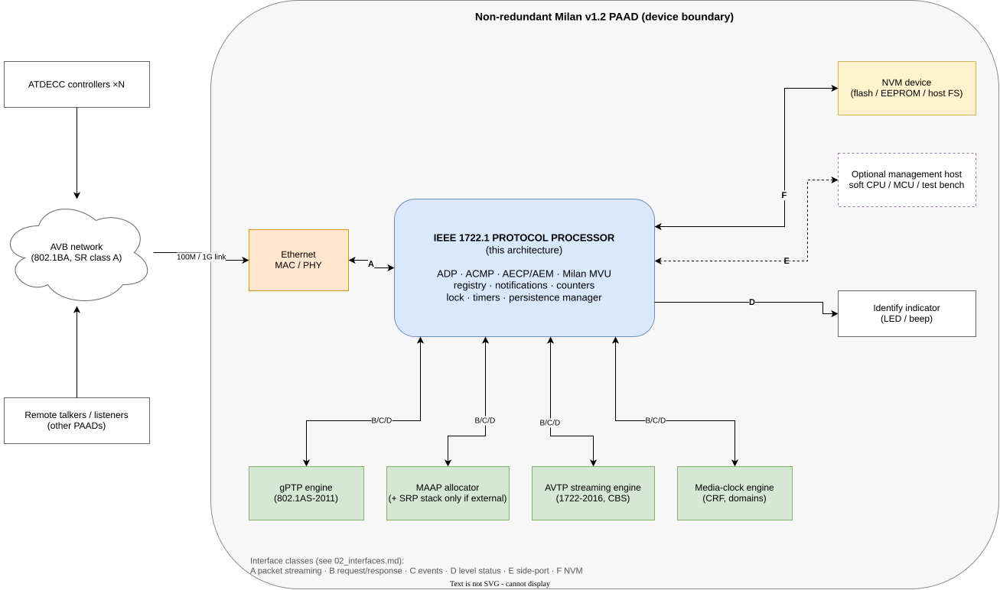
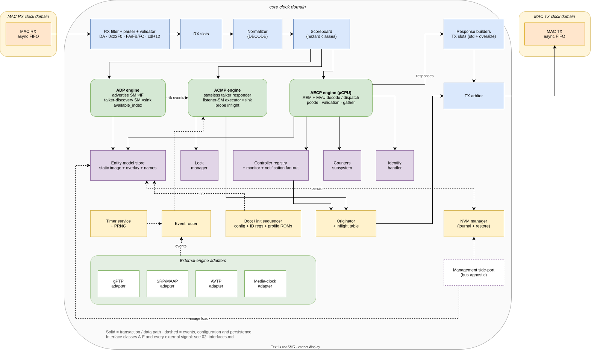
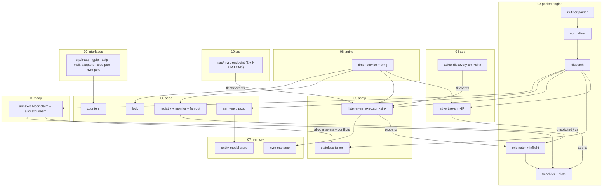

<!-- SPDX-License-Identifier: CERN-OHL-W-2.0 -->
# 01 — Overview

## 1. Purpose and scope

This document set specifies the architecture of a compact, deterministic hardware
protocol processor implementing the **control plane of a non-redundant Milan v1.2 PAAD**
on IEEE 1722.1-2021: ADP discovery, Milan ACMP binding/probing, AECP/AEM and Milan
Vendor Unique execution, unsolicited notifications, counters, and persistence.

- **HDL-agnostic**: structure, interfaces, state and algorithms only — no language
  constructs, no vendor primitives. Any HDL implementation is written against these
  documents.
- **Non-redundant**: Milan ch. 8 excluded; `REDUNDANCY` feature flag = 0; the seams a
  redundant variant would need (per-interface keying, Annex C descriptor tails) stay
  parameterized ([§7](#7-parameter-master-table-f015)).
- **Autonomous**: the processor runs without a CPU. A bus-agnostic management side-port
  carries non-real-time plumbing (image load, NVM backing, debug, optional firmware
  assist) and may be attached to any soft CPU/MCU/test harness
  ([02 §7](02_interfaces.md)).
- Supersedes the original concept document
  ([review](../00_MILAN_COMPLIANCE_REVIEW.md)); its surviving ideas are credited there
  (§4).

## 2. System context

**F01.1 — System context** (source:
[`diagrams/src/01-system-context.drawio`](../diagrams/src/01-system-context.drawio))

| In scope (this processor) | Out of scope (external engines it commands/observes) |
|---|---|
| ADP / ACMP / AECP+MVU protocol execution | Ethernet MAC/PHY, frame filtering below DA/EtherType |
| MAAP block claim (IEEE 1722-2016 Annex B, [11](11_maap_engine.md)) — opt-in via `cfg_maap_internal_i`; default 0 keeps the seam external | external `maap` allocator (the default wiring; the fabric's own engine answers the seam) |
| Controller registry, notifications, lock, counters, identify | gPTP time sync datapath (802.1AS-2011 profile) |
| Entity-model storage and descriptor assembly | media transport below the control plane |
| SRP endpoint participant — MSRP + MVRP, Class A/single-VID ([10](10_srp_engine.md); `P-EN-SRP-ENGINE` keeps an external-stack alternative) | full SRP bridge behavior (attribute propagation, per-port registrar sets) |
| Timers/deadlines, PRNG, persistence orchestration | AVTP streaming datapath, CBS shaping, media clocking |
| Management side-port | NVM physical device (behind the NVM port) |

The four external protocol engines are reached through the **adapter interfaces** of
[02 §4](02_interfaces.md); their observable state that AECP commands report is cataloged
once in [F02.10](02_interfaces.md#fig-02-statusdict).

## 3. Design principles

1. **Shared infrastructure, graded engines** — one packet engine, one TX arbiter, one
   timer service, one state-memory complex; per-protocol compute sized to the protocol:
   ADP = hardwired FSMs, ACMP = table-driven record executor, AECP = microcoded engine.
   (Original options analysis retained: pure-FSM (A) too rigid for AECP, per-command
   accelerators (D) too large; pipeline + µcoded EXECUTE (C) chosen.)
2. **Milan-first** — Milan semantics are the normative baseline (Milan §5.5.2.1
   precedence); plain-IEEE behavior is a documented *profile* selected by ROM columns
   ([§7](#7-parameter-master-table-f015)), not the default.
3. **Entity-initiated traffic is first-class** — the originator path (probes, liveness
   checks, notifications, identify, periodic ADP) shares the pipeline via transaction
   origins {RX, TIMER, SELF, MGMT} ([03 §4](03_packet_engine.md)).
4. **Deterministic deadlines** — every command class has a budget tracked by the
   deadline engine ([08 §4](08_timing.md)); the design never emits `IN_PROGRESS`.
5. **Everything parameterized** — sizes, feature flags and profile ROMs in one table
   (F01.5); no magic constants in engine documents (T-IDs / P-IDs only).
6. **Single-source artifacts** — command table, transition tables and constants are
   designed to be generated from one machine-readable model, which also emits the
   reference model and test vectors ([09 §1](09_verification.md)).

## 4. Top-level architecture

**F01.2 — Processor top level** (source:
[`diagrams/src/01-top-level.drawio`](../diagrams/src/01-top-level.drawio))

| Block | Responsibility | Owning doc |
|---|---|---|
| RX interface + filter/parser/validator | CDC in, DA/EtherType/subtype demux, header + length validation | [03 §3](03_packet_engine.md) |
| RX slot manager + transaction normalizer | zero-copy payload slots; normalized transaction records | [03 §3–§4](03_packet_engine.md) |
| Scoreboard | hazard classes / serialization keys; cross-engine interlock | [03 §6](03_packet_engine.md) |
| ADP engine | advertise SM ×interface; talker-discovery SM ×bound sink; available_index | [04](04_adp_engine.md) |
| ACMP engine | stateless talker responder; listener SM executor ×sink; inflight | [05](05_acmp_engine.md) |
| AECP engine (µCPU) | AEM+MVU decode/dispatch/µcode; validation chains; response assembly | [06](06_aecp_engine.md) |
| Controller registry + monitor + notification fan-out | registration tuples; liveness; unsolicited generation + rate limits | [06 §7](06_aecp_engine.md) |
| Lock manager | ENTITY lock, `T-LOCK-UNLOCK` auto-unlock, lock checks for AECP/ACMP/side-port | [06 §6.8](06_aecp_engine.md) |
| Counters subsystem | per-descriptor banks, invariants, observation latching | [06 §6.6](06_aecp_engine.md), [07 §4](07_memory_maps.md) |
| Identify handler | identify value/output; notification bursts | [06 §7](06_aecp_engine.md) |
| Entity-model store | static image + dynamic overlay + names; descriptor assembly | [07 §3](07_memory_maps.md) |
| Originator + inflight table | entity-initiated PDUs; response routing back to owners | [03 §5](03_packet_engine.md) |
| Response builders + TX slots + TX arbiter | PDU serialization; standard + oversize slots; priority merge | [03 §7–§8](03_packet_engine.md) |
| Timer service + PRNG | tick generation, deadline RAM, randomized draws | [08 §3](08_timing.md) |
| SRP/MAAP · gPTP · AVTP · media-clock adapters | the four engine contracts (srp served internally by default) | [02 §4](02_interfaces.md) |
| SRP engine | MSRP/MVRP endpoint participant: 1 Domain FSM + 1 VLAN FSM + N+M stream FSMs | [10](10_srp_engine.md) |
| MAAP engine | Annex B block claim: probe/announce/defend SM, the internal allocator-seam server, claim publication | [11](11_maap_engine.md) |
| NVM manager | persistence journal; boot restore | [07 §5](07_memory_maps.md) |
| Management side-port | image load, debug, NVM backing, optional firmware assist | [02 §7](02_interfaces.md) |
| Boot/init sequencer + config/ID registers + profile ROMs | bring-up ordering; identity; profile selection | this doc §5, [§7](#7-parameter-master-table-f015) |
| Event router | fan-out of adapter/SM events to counters, SMs, notifications | [03 §5](03_packet_engine.md) |

## 5. Operational model

- **Initialization** — boot sequencer order: (1) load/validate descriptor image and
  identity registers (side-port or ROM); (2) NVM restore of the persisted set
  ([07 §5](07_memory_maps.md)); (3) preload engine state — a restored binding puts that
  sink's listener SM in `PRB_W_AVAIL`; (4) adapters report ready; (5) assert
  `entity_enable` — only now may ADP advertise (Milan §5.6.1), because the entity must
  already accept AECP commands and bind/probe requests.
- **Steady state** — RX commands, timer events, self-originated traffic and side-port
  accesses flow through the same normalized-transaction pipeline
  ([03 §4](03_packet_engine.md)); every state commit can trigger notifications.
- **Shutdown** — `SHUTDOWN` request drives each advertise SM to emit ENTITY_DEPARTING
  and resets `available_index`; link-down never does ([04 §6.1](04_adp_engine.md)).

## 6. Terminology, notation, and the Milan↔IEEE delta master table

Naming follows Milan; conventions (IDs, anchors, mask rule, cdl+12 rule, participants)
are defined in [docs/README.md](../README.md). Deltas are cited as `Δn` everywhere.

**F01.4 — Milan overrides IEEE (master table)**

| Δ | Milan rule (overrides IEEE 1722.1) | Clause |
|---|---|---|
| Δ1 | Renames: `BIND_RX`=CONNECT_RX, `UNBIND_RX`=DISCONNECT_RX, `PROBE_TX`=CONNECT_TX | §5.5.2.2 |
| Δ2 | ACMPDU truncated to 56 B; shall send and accept this form | §5.5.2.2 |
| Δ3 | All five ACMP command timeouts collapse to a single value (`T-ACMP-CMD`), replacing IEEE's four different per-command timeouts | Table 5.26 |
| Δ4 | Talker stateless: PROBE_TX pure query; DISCONNECT_TX → SUCCESS no-op; GET_TX_CONNECTION → NOT_SUPPORTED | §5.5.2.7, §5.5.4 |
| Δ5 | ADP: fixed `valid_time` and advertise cadence (`T-ADP-ADV`) plus the DOWN/WAITING/DELAY SM with GM_CHANGE re-advertise, replacing IEEE's reannounce (valid_time/2) + randomDeviceDelay model | §5.6.2, §5.6.3 |
| Δ6 | GET_STREAM_INFO: 80-B extended response (`flags_ex`, `pbsta`, `acmpsta`); CONNECTED→`BOUND`, TALKER_FAILED→`REGISTERING_FAILED` | §5.4.2.10 |
| Δ7 | ACQUIRE_ENTITY shall never succeed → `NOT_SUPPORTED` | §5.4.2.1 |
| Δ8 | Responses may exceed the 524-octet cdl cap for READ_DESCRIPTOR, GET_AVB_INFO, GET_AS_PATH, GET_AUDIO_MAP, ADD/REMOVE_AUDIO_MAPPINGS | §5.4.1 |
| Δ9 | STREAM_OUTPUT counter masks: MEDIA_RESET 0x4, TIMESTAMP_UNCERTAIN 0x8, FRAMES_TX 0x10 (differ from IEEE Tables 7-158/159) | Table 5.17 |
| Δ10 | LOCK_ENTITY restricted to the ENTITY descriptor; other descriptors → NOT_SUPPORTED | §5.4.2.2 |
| Δ11 | SET_STREAM_INFO prohibited on Stream Input; START/STOP_STREAMING prohibited on Stream Output (→ NOT_SUPPORTED) | §5.4.2.9/.19/.20 |
| Δ12 | Registry entry = {EID, MAC, port} tuple, ≥16 per interface, per-controller unsolicited sequence_id (IEEE: MAC-keyed, global counter allowed) | §5.3.4.2, §5.4.5.1 |
| Δ13 | MSRP registrar: `IN / rLv!` transitions instantaneously to MT (no leavetimer) | §4.2.7.2.2 |
| Δ14 | STREAMING_WAIT not implementable on Stream Outputs — talker streams whenever bandwidth is reserved | §5.3.7.3, §5.5.4.1 |
| Δ15 | Listener behavior = Milan 8-state binding/probing SM; binding persists across power cycles (replaces IEEE §8.2.4 listener SM + fast connect) | §5.5.3, §5.3.8.2 |

## 7. Parameter master table (F01.5)

All parameters are synthesis-time. Only this table carries
values; other documents reference `P-…` IDs.

| P-ID | Default | Range / constraint | Affects |
|---|---|---|---|
| P-N-AVB-INTERFACES | 1 | ≥1 (redundancy seam: keys registry/ADP/counters/records) | all per-interface state |
| P-N-STREAM-IN | product | ≥1 with a Base format if listener (Milan §6.4) | sink records, discovery SMs, counters |
| P-N-STREAM-OUT | product | ≥1 with a Base format if talker (Milan §6.3) | source records, DA timers, counters |
| P-N-CONTROLLERS | 16 | ≥16 per interface (Milan §5.3.4.2) | registry, monitor timers, fan-out |
| P-N-CONFIGURATIONS | 1 | ≥1 | index maps, image size |
| P-N-AUDIO-UNITS / P-N-CLOCK-DOMAINS / P-N-CLOCK-SOURCES | 1 / 1 / 2 | model-driven (≥1 CD, ≥1 CS/CD) | overlay, counters, MVU MCR |
| P-N-FORMATS-MAX | 16 | ≤47 (IEEE 1722.1-2021 Table 7-8) | descriptor assembly, format tables |
| P-MAP-SUBSET-CH-MAX | 176 | =176 (Milan §5.4.2.26) | audio-map partitioning |
| P-N-MAP-ENTRIES | product | per port | map RAM |
| P-DESCR-IMAGE-BYTES | 16384 | ≥ worked size ([07 §6](07_memory_maps.md)) | **no RTL consumer** — the image moved to main memory at `DESC_BASE_P` ([07 §3.3](07_memory_maps.md)); retained as the sizing budget only |
| P-RX-SLOTS × P-RX-SLOT-BYTES | 4 × 576 | slot ≥ 536 (max command PDU) | RX buffering |
| P-TX-STD-SLOTS × 576 | 4 | — | response buffering |
| P-TX-OVERSIZE-BYTES | 1600 | ≥ max frame (Δ8) | oversize responses |
| P-NOTIF-QUEUE-DEPTH | 16 | — | notification triggers |
| P-CA-POOL | 4 | — | concurrent CONTROLLER_AVAILABLE probes |
| P-TIMER-SLOTS | formula | allocation formula owned by [08 §5](08_timing.md) (baseline examples: 66; 89 with the SRP engine) | deadline RAM |
| P-UCODE-ROM-DEPTH | 2048 | ~35 programs × ~25 µops + margin | AECP µcode |
| P-UCODE-ROM-W | 48 | µop width (encoding `hdl/aecp/ucpu_pkg.sv`; 2048 × 48 measured 3 RAMB36, datapath LUT count in [`syn/ooc/`](../../syn/ooc/README.md)) | AECP µcode |
| P-DISPATCH-ROM-W | 48 | dispatch-ROM entry width (field layout [06 §8](06_aecp_engine.md)) | AECP dispatch |
| P-ACMP-TROM-W | 32 | ACMP transition-ROM entry width (112 cells per profile column, [F05.3](05_acmp_engine.md#fig-05-listener-matrix)) | ACMP executor |
| P-TRACE-RING | 256 × 128 | trace-ring records × record bits ([02 §7](02_interfaces.md) window) | trace ring |
| P-MRPDU-QUEUE-BYTES | 2048 | SRP MRPDU RX queue: one max-size frame + headroom ([10 §4](10_srp_engine.md)) | SRP engine |
| P-SRP-DOM-DEF-VID | 2 | 16-bit; =2 in every product build (Milan §4.2.7.2.1). Any other value is a verification fixture proving the top-level binding, not a product profile | SRP Domain FSM default VID ([F10.2](10_srp_engine.md#fig-10-domsm)): declared at startup and LINK_UP, restored at LINK_DOWN; a received Class A Domain is still adopted over it |
| P-CLK-HZ | 100 MHz | any; prescaler retuned | timebase |
| P-INTERNAL-INGRESS-DELAY-NS | product | added to reported input latency (Milan §5.4.2.10.1) | GET_STREAM_INFO |
| P-PT-OFFSET-DEFAULT-NS | 2 000 000 | 0..0x7FFFFFFF (Milan §5.3.7.6) | presentation time |
| P-EN-MVU-SUID / P-EN-MVU-MCR | 1 / 1 | Milan "recommended" MVU groups | MVU decode |
| `MILAN_FEATURES_FLAGS.TALKER_DYNAMIC_MAPPINGS_WHILE_RUNNING` | 0 | GET_MILAN_INFO feature 0x2 remains clear | µcode constant + root-integrator mapping validation |
| P-EN-IDENTIFY-NOTIFICATION | 1 | "should" (Milan §5.4.5.4) | identify handler |
| P-EN-ADDRESS-ACCESS / P-EN-FIRMWARE-ASSIST | 0 / 0 | IEEE-optional ([GAP-13](../00_MILAN_COMPLIANCE_REVIEW.md#gap-13)) | side-port features |
| P-EN-SRP-ENGINE | 1 | 1 = internal SRP engine ([10](10_srp_engine.md)) serves the `srp` contract; 0 = external stack | SRP engine, MRP timers, V9 filter |
| P-EN-PLAIN-IEEE-PROFILE | 0 | selects IEEE ROM columns (below) | profiles |
| P-EN-REDUNDANCY | 0 | reserved seam — must stay 0 (this spec) | GET_MILAN_INFO flag |

**Profile mechanism** — a profile is a *selection of ROM columns*, not scattered
`if`s: timing-constant column ([F08.1](08_timing.md#fig-08-constants) profile column),
ACMP listener transition ROM, AECP dispatch validity column, STREAM_OUTPUT counter-mask
table (Δ9). Baseline = Milan; `P-EN-PLAIN-IEEE-PROFILE` swaps columns without touching
datapaths.

## 8. Document map

**F01.3 — Blocks → documents**

Reading order and per-role paths: [docs/README.md §1](../README.md).
