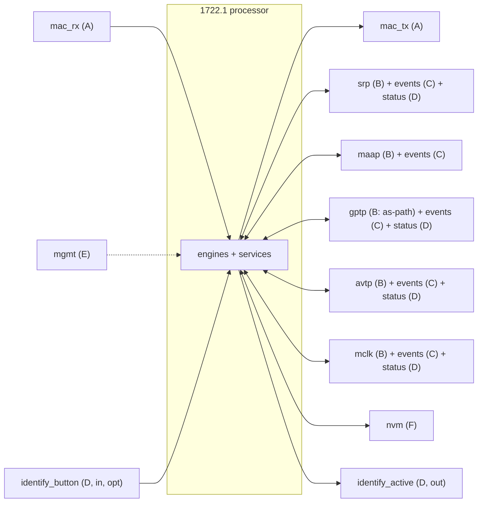
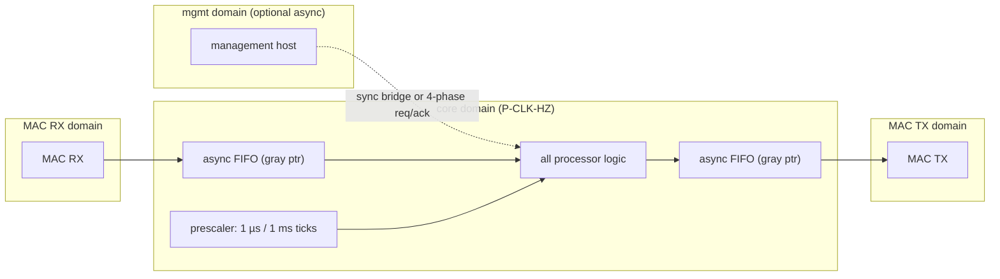
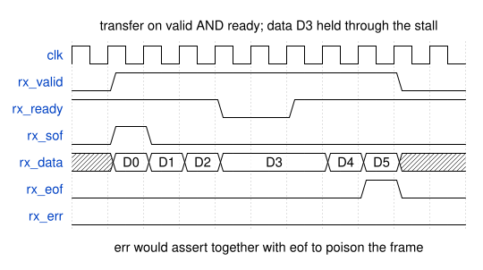
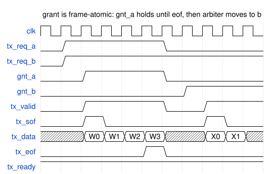
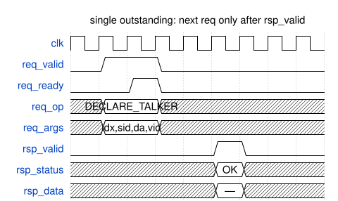
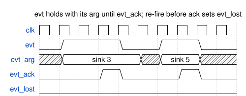
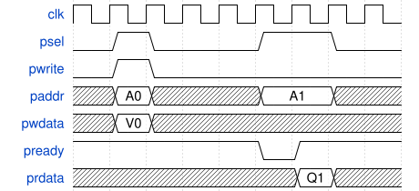
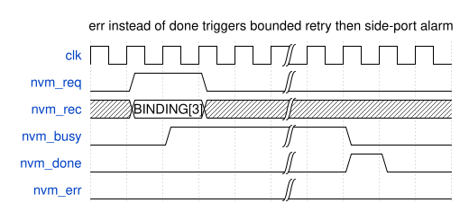

<!-- SPDX-License-Identifier: CERN-OHL-W-2.0 -->
# 02 — External Interfaces

Every contract the processor presents to the outside world. Interfaces are grouped in
six **classes**; each class has one template handshake (waveform) and per-instance
signal/operation tables. Nothing outside this document names an external signal — other
documents reference the instance names and the dictionary
[F02.10](#fig-02-statusdict).

## 1. Interface taxonomy

| Class | Kind | Instances | Template |
|---|---|---|---|
| **A** | Packet streaming (valid/ready, sof/eof) | `mac_rx`, `mac_tx`; reused by trace port, firmware sink | [F02.3](#fig-02-rxwave)/[F02.4](#fig-02-txwave) |
| **B** | Request/response engine API (single outstanding) | `srp`, `maap`, `gptp`, `avtp`, `mclk` | [F02.5](#fig-02-apiwave) |
| **C** | Event pulse with ack (sticky until acked) | events from all adapters + timer expiries | [F02.6](#fig-02-evtwave) |
| **D** | Level status (synchronized, sampled) | status dictionary | [F02.10](#fig-02-statusdict) |
| **E** | Memory-mapped side-port | `mgmt` | [F02.7](#fig-02-memwave) |
| **F** | NVM commit/restore | `nvm` | [F02.8](#fig-02-nvmwave) |

<a id="fig-02-landscape"></a>**F02.1 — Interface landscape**



<a id="fig-02-catalog"></a>**F02.9 — Instance catalog**

| Instance | Class | Dir | Clock domain | Consumers | Notes |
|---|---|---|---|---|---|
| `mac_rx` | A | in | MAC-RX → core (async FIFO) | packet engine | one per AVB interface (P-N-AVB-INTERFACES) |
| `mac_tx` | A | out | core → MAC-TX (async FIFO) | TX arbiter | one per AVB interface |
| `srp` | B+C+D | both | core | ACMP, AECP gather, counters, NOTIF | talker/listener attribute ops; served by the internal SRP engine ([10](10_srp_engine.md)) or an external stack (`P-EN-SRP-ENGINE`) |
| `maap` | B+C | both | core | talker DA management | allocation + conflict events; served internally by [11](11_maap_engine.md) when `cfg_maap_internal_i` = 1 |
| `gptp` | B+C+D | both | core | ADP, AECP gather, counters | GM/domain/asCapable/path |
| `avtp` | B+C+D | both | core | ACMP settle, AECP, counters | per-stream control + health events |
| `mclk` | B+C+D | both | core | AECP (clock source, MVU MCR), counters | per clock domain |
| `mgmt` | E | in | own (sync or 4-phase async) | model store, NVM, debug, ctrl/status | optional at runtime, needed for image load unless ROM |
| `nvm` | F | both | core | NVM manager | record-level, device-agnostic |
| `identify_active` | D | out | core | device indicator | level, 1 = identifying |
| `identify_button` | D | in | core (2FF sync) | identify handler | optional (P-EN-IDENTIFY-NOTIFICATION) |

## 2. Clocking, reset, CDC

<a id="fig-02-cdc"></a>**F02.2 — Clock/reset domains**



Rules (behavioral — no vendor primitives):

1. **One core clock domain** for the entire processor. `P-CLK-HZ` is free; the
   prescaler retunes the 1 µs/1 ms ticks ([08 §3](08_timing.md)).
2. MAC boundaries cross via **dual-clock FIFOs** (gray-coded pointers or equivalent);
   frame-atomic handoff (a frame is visible only when complete + good, or dropped).
3. `mgmt` is either synchronous to core or bridged by a 4-phase req/ack; single-bit
   inputs (`identify_button`, link status if raw) pass 2-flop synchronizers.
4. **Quasi-static configuration** (descriptor image, identity registers, parameters
   loaded via `mgmt`) is written only while `entity_enable = 0` and is treated as
   stable afterwards — no CDC needed post-enable.
5. Reset: asynchronous assert, synchronous release, released in the boot-sequencer
   order ([01 §5](01_overview.md)); `entity_enable` is the master gate implementing
   ADP start gating (Milan §5.6.1).

## 3. Class A — packet streaming

> ⚠ **The landed top does not implement this class as specified below, and the RTL is
> authoritative.** `protocol_processor_top` presents a **byte** stream in each direction:
> `rx_valid_i` / `rx_data_i[7:0]` / `rx_last_i` inbound with **no `ready` and no
> backpressure at all**, and `tx_valid_o` / `tx_sof_o` / `tx_data_o[7:0]` / `tx_eof_o` /
> `tx_ready_i` outbound. There is no `empty` and no `err` on either side. Wire against
> the [integrator guide](../guides/integrator.md#3-the-mac-faces), which documents the
> landed face; the 32-bit word contract below, and the `ready`/`err` signals in F02.3, are
> a specification the implementation did not take.

Word-oriented stream, `DATA_W` = 32 (parameterizable), MSB-first byte lanes, `empty`
gives the unused byte count in the `eof` word. `err` with `eof` invalidates the frame
(RX: drop; TX: MAC aborts with bad FCS).

| Signal | Dir (RX inst.) | Width | Meaning |
|---|---|---|---|
| `valid` | in | 1 | word present |
| `ready` | out | 1 | sink accepts; transfer on `valid ∧ ready` |
| `data` | in | 32 | payload word |
| `sof` / `eof` | in | 1/1 | frame delimiters (both on `valid ∧ ready` words) |
| `empty` | in | 2 | unused bytes in `eof` word |
| `err` | in | 1 | with `eof`: frame invalid |

The RX stream carries frames already filtered on DA ∈ {unicast MAC, `91-E0-F0-01-00-00`}
and EtherType 0x22F0 when the external MAC can filter; the parser re-checks regardless
([03 §3](03_packet_engine.md)).

<a id="fig-02-rxwave"></a>**F02.3 — RX stream: backpressure + end of frame**



<details>
<summary>WaveDrom source (editable)</summary>

```wavedrom
{"signal": [
  {"name": "clk",      "wave": "p.........."},
  {"name": "rx_valid", "wave": "01.......0."},
  {"name": "rx_ready", "wave": "1...0.1...."},
  {"name": "rx_sof",   "wave": "010........"},
  {"name": "rx_data",  "wave": "x====..==x.", "data": ["D0", "D1", "D2", "D3", "D4", "D5"]},
  {"name": "rx_eof",   "wave": "0.......10."},
  {"name": "rx_err",   "wave": "0.........."}
],
 "head": {"text": "transfer on valid AND ready; data D3 held through the stall"},
 "foot": {"text": "err would assert together with eof to poison the frame"}}
```

</details>

<a id="fig-02-txwave"></a>**F02.4 — TX stream with arbiter grant (no mid-frame regrant)**



<details>
<summary>WaveDrom source (editable)</summary>

```wavedrom
{"signal": [
  {"name": "clk",      "wave": "p.........."},
  {"name": "tx_req_a", "wave": "01....0...."},
  {"name": "tx_req_b", "wave": "01........."},
  {"name": "gnt_a",    "wave": "0.1...0...."},
  {"name": "gnt_b",    "wave": "0......1..."},
  {"name": "tx_valid", "wave": "0.1...0.1.."},
  {"name": "tx_sof",   "wave": "0.10....10."},
  {"name": "tx_data",  "wave": "x.====x.==x", "data": ["W0", "W1", "W2", "W3", "X0", "X1"]},
  {"name": "tx_eof",   "wave": "0....10...."},
  {"name": "tx_ready", "wave": "1.........."}
],
 "head": {"text": "grant is frame-atomic: gnt_a holds until eof, then arbiter moves to b"}}
```

</details>

## 4. Class B — engine request/response APIs

One template contract for all five instances: **single outstanding request per
instance**; `req_valid ∧ req_ready` accepts; exactly one `rsp_valid` follows with
`rsp_status ∈ {OK, FAIL, UNSUPPORTED}` and instance-specific `rsp_data`. Requests are
non-blocking for the engines: the AECP gather path snapshots class-D status instead of
issuing class-B calls wherever possible.

<a id="fig-02-apiwave"></a>**F02.5 — Engine-API template (all class-B instances)**



<details>
<summary>WaveDrom source (editable)</summary>

```wavedrom
{"signal": [
  {"name": "clk",       "wave": "p........"},
  {"name": "req_valid", "wave": "01.0....."},
  {"name": "req_ready", "wave": "0.10....."},
  {"name": "req_op",    "wave": "x=.x.....", "data": ["DECLARE_TALKER"]},
  {"name": "req_args",  "wave": "x=.x.....", "data": ["idx,sid,da,vid"]},
  {"name": "rsp_valid", "wave": "0....10.."},
  {"name": "rsp_status","wave": "x....=x..", "data": ["OK"]},
  {"name": "rsp_data",  "wave": "x....=x..", "data": ["—"]}
],
 "head": {"text": "single outstanding: next req only after rsp_valid"}}
```

</details>

### 4.1 `srp` — SRP/MSRP adapter operations

This contract is served by the **in-scope SRP engine** ([10](10_srp_engine.md)) when
`P-EN-SRP-ENGINE` selects it (the [F01.5](01_overview.md#7-parameter-master-table-f015) default), or by an external SRP stack otherwise — the ops, events
and status signals below are identical either way; no consumer can tell the
difference. That includes the shaper: the contract publishes the granted
per-source idleSlope and admission (class-D) because IEEE 802.1Q §34.6.1 runs
the credit-based shaper on `operIdleSlope` ("used by the credit-based shaper
algorithm (8.6.8.2) as its idleSlope"), §34.3(c) makes SRP the source of that
value whenever SRP is in operation, and §34.6.1.1 defines the per-stream
idleSlope this field carries — an external stack must publish the same two
fields or it cannot serve this contract.

| Op | Args | Result | Used by |
|---|---|---|---|
| `DECLARE_TALKER` | source idx, stream_id, dest MAC, VLAN, tspec (from format, Milan Table 4.4) | OK/FAIL | talker DA-gate ([05 §6bis](05_acmp_engine.md)) |
| `WITHDRAW_TALKER` | source idx | OK | MAAP conflict / PCP change flow |
| `DECLARE_LISTENER` | sink idx, state ∈ {READY, ASKING_FAILED, NONE} | OK | listener SM settle/teardown |
| `WITHDRAW_LISTENER` | sink idx | OK | unbind/teardown |
| `GET_DOMAIN` | SR class | {priority, default VID} | GET_AVB_INFO gather |

Class-C events from `srp`: `TK_ATTR_REGISTERED{sink, adv|failed}` /
`TK_ATTR_UNREGISTERED{sink}` (matched on the sink's settled {stream_id, DA, VLAN} —
exact match per Milan §5.3.8.9, matching done in the adapter),
`LISTENER_REG_CHANGE{source, state}`, `DOMAIN_CHANGE{class}`. Class-D status: see
[F02.10](#fig-02-statusdict).

### 4.2 `maap` — address allocation

| Op | Args | Result |
|---|---|---|
| `ALLOC_DA` | source idx | {dest MAC} or FAIL |
| `RELEASE_DA` | source idx | OK |

Events: `MAAP_CONFLICT{source}` → drives the withdraw → 2×LeaveAll → re-alloc →
re-declare flow ([05 §6bis](05_acmp_engine.md), backoff `T-SRP-LEAVEALL2`).

This face is a **processor-top port group** by default, and — since the MAAP
engine landed ([11](11_maap_engine.md)) — also an internal seam: the quasi-static
`cfg_maap_internal_i` selects whether the fabric's allocator answers through the
port group (0, the landed default, byte-identical) or `KL_pp_maap` answers
internally under this same contract with the port group quiesced and the claim
published on `maap_addr_o`/`maap_addr_valid_o`. Either way `GS_DECLARING` is
reachable only through `GS_DA_OK`, which is only ever written on an `ALLOC_DA`
success. An unconnected face with the internal engine disabled therefore pins the
published talker DA gate at 0 and stops every engine-driven `DECLARE_TALKER` — the
processor's talker half would be dead by construction.

**Degrade rule.** An allocator that is absent, slow or broken is a legal wiring.
**Both** halves of the transaction are bounded, because both can hang and they
hang differently:

| half | bound | what an unbounded version costs |
|---|---|---|
| request never ACCEPTED | `P-MAAP-ACCEPT-CYC` (1024 cycles, ≈10 µs at `P-CLK-HZ`, well inside `T-BUDGET-ACMP-RESP`) | the one event-serialized walker parks in the request state — and it also answers `PROBE_TX` / `DISCONNECT_TX` / `GET_TX_STATE` for every source, so the talker half of ACMP *and* SRP goes silent |
| request accepted, never ANSWERED | `P-MAAP-RSP-MS` (10 s) | the single-outstanding tracker is GLOBAL, so allocation stops for **every** source: no `GS_DA_OK`, no DA gate, no `DECLARE_TALKER`. Nothing wedges — dispatch outranks the pending-init flag, so the processor answers normally forever while no stream can start |

Both abandons leave the source exactly where a refused `ALLOC_DA` leaves it — no
DA, no declaration, `PROBE_TX` answered `TALKER_DEST_MAC_FAILED` — and the retry
is stimulus-driven, never self-scheduled (a self-retry would hold the global
tracker for one bound per round and starve every higher-index source, since
pending events are picked lowest-index-first).

`P-MAAP-RSP-MS` is derived from **IEEE Std 1722-2016 Annex B**, because
`ALLOC_DA` maps onto a real MAAP claim walk. Table B.8 gives
`MAAP_PROBE_RETRANSMITS` = 3 and a `probe_timer` (B.3.4.2) drawn from
`MAAP_PROBE_INTERVAL_BASE` (500 ms) < T < BASE + `MAAP_PROBE_INTERVAL_VARIATION`
(600 ms); the Table B.7 walk acquires the address after exactly 3 probe
intervals, so ≤ **1800 ms** per attempt, and a conflicting probe/defend/announce
restarts it (B.3.5.3) for another ≤ 1800 ms. 10 s covers a clean acquisition plus
four conflict restarts. It must also stay **below `T-SRP-DAFRESH`** (15 s): a
grant arriving after the `PROBE_TX` that triggered it has gone stale cannot open
the gate anyway. The 30 s `MAAP_ANNOUNCE_INTERVAL_BASE` is *not* in the bound —
the address is acquired on entry to `DEFEND`, before the first announce.

**`RELEASE_DA` is owed, not attempted.** The degrade rule above applies to
`ALLOC_DA` only. An allocation that cannot reach the face is safe to drop because
the stimulus that asked for it comes again (a probe, a listener, a timer); a
release has no such stimulus, and the DA-gate record naming the address is wiped
by the same event that asks for the release. So a release skipped because the
single-outstanding face was busy (the *normal* state for seconds at a time,
since `ALLOC_DA` is a real claim walk) leaves the address allocated with nothing
left to notice. The processor therefore books the debt per source and retries
until the face **accepts** it, which also covers the `P-MAAP-ACCEPT-CYC` abandon
(the flag is cleared by the accept, never by the offer). **IEEE Std 1722-2016**
permits the delay and forbids the loss: B.3.5.2 attaches no deadline to
`Release!`, Table B.7 leaves the machine legally in DEFEND (announcing and
defending an address it still holds) until the event arrives, and footnote c
makes the range free only once `Release!` has reached INITIAL. Releases are
ordered **ahead of** allocations, so a source that leaves and rejoins hands back
its old address before it asks for a new one. The teardown itself never waits:
`WITHDRAW_TALKER`, the record wipe and the timer cancel all land in the removal
event's own cycle whatever the face is doing.

**Stale responses.** A shim that accepted a request will answer it even after the
processor abandoned it. That answer must never install a DA: the source it was
for has moved on, and the tracker may already name a different one — installing
it would give two sources the same stream destination address. Responses are
therefore matched FIFO against a stale credit taken at each abandon, and swallowed
while one is outstanding. Under the single-outstanding rule above at most one can
ever be owed.

### 4.3 `gptp` — time-sync data

| Op | Args | Result |
|---|---|---|
| `READ_AS_PATH` | interface idx, entry idx | {path_count, path_sequence[idx]} — iterated by the GET_AS_PATH µprogram |

Events: `GM_CHANGE{interface}` (drives ADP re-advertise + GPTP_GM_CHANGED counter +
GET_AVB_INFO notification), `AS_CAPABLE_CHANGE{interface}`,
`PATH_CHANGE{interface}`. Class-D: GM id, domain, propagation delay, asCapable.

### 4.4 `avtp` — streaming engine control

| Op | Args | Result |
|---|---|---|
| `INPUT_CONFIGURE` | sink idx, {stream_id, dest MAC, VLAN} | OK — also arms RX filtering to the configured format (Milan §4.4.2.2) |
| `INPUT_ENABLE` / `INPUT_DISABLE` | sink idx | OK — start/stop listening (settle / teardown) |
| `INPUT_START` / `INPUT_STOP` | sink idx | OK after binding-record commit or confirmed no-op; timeout or invalid index reports failure |
| `SET_INPUT_FORMAT` / `SET_OUTPUT_FORMAT` | idx, format (8 B) | OK/FAIL |
| `OUTPUT_SET_PT_OFFSET` | source idx, offset ns | OK (0..0x7FFFFFFF) |
| `OUTPUT_STATUS` | source idx | {streaming} |

Events (per sink, feed the STREAM_INPUT counter bank and Table 5.22 notifications):
`MEDIA_LOCKED/UNLOCKED`, `STREAM_INTERRUPTED`, `SEQ_NUM_MISMATCH`, `MEDIA_RESET`,
`TIMESTAMP_UNCERTAIN`, `UNSUPPORTED_FORMAT`, `LATE/EARLY_TIMESTAMP`, `FRAMES_RX_TICK`;
per source: `STREAM_START/STOP`, `MEDIA_RESET`, `TIMESTAMP_UNCERTAIN`, `FRAMES_TX_TICK`.

**Landed shape of the counter read (`ctr_*` on `protocol_processor_top`).** The
event list above is how a complete implementation would *feed* a counter bank
inside the processor; the tree ships the other direction, because the counters
already exist in the integrator's datapath and mirroring them here would cost a
second copy of every tally. GET_COUNTERS therefore READS:

| Signal | Dir | Meaning |
|---|---|---|
| `ctr_req_o` | out | a quadlet of a GET_COUNTERS response is being asked for |
| `ctr_desc_type_o` / `ctr_desc_index_o` | out | the object, straight off AECPDU @24 / @26 |
| `ctr_word_o` | out | 0..31 = `counters_block` quadlet at block byte 4·n (IEEE Table 7-157 for STREAM_INPUT); 32 = the `counters_valid` word itself |
| `ctr_data_i` | in | that quadlet, 32-bit unsigned, wrapping |
| `ctr_wait_i` | in | **HOLD** the beat; 0 means the answer is on `ctr_data_i` now |

The hold polarity is the contract's safety property: an integrator who leaves the
face unwired drives 0, every quadlet reads 0, `counters_valid` reads 0, and the
response says "this entity keeps no counters for that object" — which is what
§7.4.42.2 means by a clear valid bit. Claiming a bit whose quadlet never moves
is the one answer the face must never be able to produce by accident. A face
that holds forever is bounded by `MEM_TIMEOUT_CYC_P` ([06 §8.1](06_aecp_engine.md)).

### 4.5 `mclk` — media clocking

| Op | Args | Result |
|---|---|---|
| `SET_CLOCK_SOURCE` | clock domain idx, CLOCK_SOURCE idx | OK/FAIL |
| `GET_MCR_DEFAULTS` | clock domain idx | {default_mcr_prio} (read-only, vendor-set) |

Events: `MC_LOCKED{domain}` / `MC_UNLOCKED{domain}` → CLOCK_DOMAIN counter bank.

## 5. Class C — events

All events are **sticky until acked**, carry a small argument, and may coalesce: if the
same event re-fires before ack, `evt_lost` is set for counting-sensitive consumers
(counter ticks are never lost: adapters hold per-event tick accumulators read at the
observation tick, [06 §6.6](06_aecp_engine.md)).

<a id="fig-02-evtwave"></a>**F02.6 — Event pulse with ack**



<details>
<summary>WaveDrom source (editable)</summary>

```wavedrom
{"signal": [
  {"name": "clk",      "wave": "p........."},
  {"name": "evt",      "wave": "01..0.1.0."},
  {"name": "evt_arg",  "wave": "x=...x=.x.", "data": ["sink 3", "sink 5"]},
  {"name": "evt_ack",  "wave": "0..10..10."},
  {"name": "evt_lost", "wave": "0........."}
],
 "head": {"text": "evt holds with its arg until evt_ack; re-fire before ack sets evt_lost"}}
```

</details>

Event catalog (routed by the event router to the listed consumers):

| Event | Source | Consumers |
|---|---|---|
| `LINK_UP/DOWN{if}` | MAC/PHY (2FF sync) | ADP advertise SM, counters, SRP domain re-declare |
| `GM_CHANGE{if}` | gptp | ADP advertise SM, counters, NOTIF (GET_AVB_INFO) |
| `AS_CAPABLE_CHANGE{if}` / `PATH_CHANGE{if}` | gptp | NOTIF (GET_AVB_INFO / GET_AS_PATH) |
| `TK_ATTR_REGISTERED/UNREGISTERED{sink}` | srp | ACMP listener SM (`EVT_TK_REGISTERED/UNREGISTERED`) |
| `LISTENER_REG_CHANGE{src}` | srp | talker DA-gate, NOTIF (GET_STREAM_INFO), GET_TX_STATE data |
| `DOMAIN_CHANGE{class}` | srp | NOTIF (GET_AVB_INFO), talker PCP flow |
| `MAAP_CONFLICT{src}` | maap | talker DA flow ([05 §6bis](05_acmp_engine.md)) |
| stream-health set (§4.4) | avtp | counters, NOTIF (GET_COUNTERS rate-limited) |
| `MC_LOCKED/UNLOCKED{domain}` | mclk | counters |
| timer expiries `{owner tag}` | timer service | owning SM/engine ([08 §3](08_timing.md)) |

## 6. Class D — level status dictionary

Table-only by design: these are synchronized levels with no transaction protocol; a
waveform would show nothing. Single source of truth for external state names — the
GET_x gather paths ([06 §6.2](06_aecp_engine.md)) cite these names.

<a id="fig-02-statusdict"></a>**F02.10 — External status dictionary**

| Signal (per instance) | Width | Source | Sample rule | Consumed by |
|---|---|---|---|---|
| `link_up[if]` | 1 | MAC/PHY | 2FF sync + event on edge | ADP SM, counters, GET_AVB_INFO |
| `gm_id[if]` | 64 | gptp | stable between GM_CHANGE events | ADPDU, GET_AVB_INFO, discovery-SM match |
| `gptp_domain[if]` | 8 | gptp | idem | ADPDU, GET_AVB_INFO, discovery-SM match |
| `as_capable[if]` | 1 | gptp | level + change event | GET_AVB_INFO + notification |
| `prop_delay_ns[if]` | 32 | gptp | latched at read | GET_AVB_INFO |
| `path_count[if]` | 16 | gptp | with READ_AS_PATH burst | GET_AS_PATH |
| `class_a_prio` / `class_a_vid` | 3 / 12 | srp | level + DOMAIN_CHANGE event | GET_AVB_INFO, talker declare |
| `tk_decl_state[src]` | 2 | srp | {NONE, ADVERTISE, FAILED — self-declared, permitted but unused by this profile ([10 §6.3](10_srp_engine.md))} | GET_STREAM_INFO(out), GET_TX_STATE |
| `lstn_reg_state[src]` | 2 | srp | the registered Listener's FourPackedEvent (802.1Q §35.2.2.7.4): 0 NONE (Ignore), 1 ASKING_FAILED, 2 READY, 3 READY_FAILED. These codes live in ONE place, [`srp_pkg::srp_decl_e`](../../hdl/srp/srp_pkg.sv), and no module keeps a second copy; READY and READY_FAILED share bit 1, which is what the streaming reduction tests | GET_TX_STATE and GET_STREAM_INFO(out) REGISTERING_FAILED, DA-gate, the Milan §5.3.7.3 streaming reduction |
| `tk_reg_state[sink]` | 2 | srp | {NONE, ADVERTISE, FAILED} for the settled match | GET_STREAM_INFO(in), GET_RX_STATE |
| `msrp_fail_code[x]` / `msrp_fail_bridge[x]` | 8 / 64 | srp | valid with FAILED states | GET_STREAM_INFO |
| `granted_slope_bps[src]` | 32 | srp | per-stream granted idleSlope while `sr_admitted[src]` = 1, else 0 (802.1Q §34.6.1.1) | CBS slope MUX, per-talker gate |
| `sr_admitted[src]` | 1 | srp | reservation admitted against the Σ-slope port ceiling | AVTP per-talker gate |
| `acc_latency[sink]` | 32 | srp | registered talker attr value | GET_STREAM_INFO(in) (+ P-INTERNAL-INGRESS-DELAY-NS) |
| `streaming[src]` | 1 | avtp | level | GET_STREAM_INFO(out) derivation |
| `mc_locked[domain]` | 1 | mclk | level + events | counters |
| `identify_active` | 1 | identify handler | out; level | device indicator |
| `identify_button` | 1 | pin (optional) | 2FF + debounce | identification notification |

## 7. Class E — management side-port

Bus-agnostic single-master register/memory port; any host bridge (APB/AXI-lite/Avalon/
JTAG/testbench) maps 1:1 onto it. Word addressed, 32-bit data.

| Signal | Dir | Width |
|---|---|---|
| `psel` / `pwrite` | in | 1 / 1 |
| `paddr` | in | 20 |
| `pwdata` / `prdata` | in / out | 32 |
| `pready` | out | 1 (wait states allowed) |

<a id="fig-02-memwave"></a>**F02.7 — Side-port: write, then read with one wait state**



<details>
<summary>WaveDrom source (editable)</summary>

```wavedrom
{"signal": [
  {"name": "clk",    "wave": "p........"},
  {"name": "psel",   "wave": "010..1.0."},
  {"name": "pwrite", "wave": "010......"},
  {"name": "paddr",  "wave": "x=x..=.x.", "data": ["A0", "A1"]},
  {"name": "pwdata", "wave": "x=x......", "data": ["V0"]},
  {"name": "pready", "wave": "1....01.."},
  {"name": "prdata", "wave": "x.....=x.", "data": ["Q1"]}
]}
```

</details>

Address windows (word offsets; full map in [07 §5.5](07_memory_maps.md)):

| Window | Access | Contents |
|---|---|---|
| `0x00000` | W (pre-enable only) | descriptor image + identity load |
| `0x10000` | RO | dynamic-overlay debug view |
| `0x20000` | RO | registry + counters snapshot |
| `0x30000` | RW | control/status: `entity_enable`, `shutdown_req`, boot status, profile select |
| `0x40000` | RO | trace ring (class-A framing reused; shape `P-TRACE-RING`, [F01.5](01_overview.md#7-parameter-master-table-f015)) |
| `0x50000` | RW | firmware mailbox (only if `P-EN-FIRMWARE-ASSIST`; [GAP-13](../00_MILAN_COMPLIANCE_REVIEW.md#gap-13)) |

Lock interaction: side-port writes that mirror ATDECC state changes (names, sampling
rate, …) pass the **lock manager** check like any front-panel change and generate
notifications when unlocked (Milan §5.4.5.2) — enforced in the overlay write path, not
left to the host.

## 8. Class F — NVM port

Record-level, device-agnostic: the NVM manager presents {record id, payload}; the
backing implementation (SPI flash controller, EEPROM, host filesystem via `mgmt`) is
free. Long busy periods expected; commits are asynchronous to protocol responses
([03 §6](03_packet_engine.md) ordering rule d).

| Signal | Dir | Width |
|---|---|---|
| `req` / `we` | out | 1 / 1 |
| `record_id` | out | 8 |
| `wdata` / `rdata` | out / in | streamed bytes (record framing per [07 §5](07_memory_maps.md)) |
| `busy` / `done` / `err` | in | 1 each |

<a id="fig-02-nvmwave"></a>**F02.8 — NVM commit (broken axis over the busy period)**



<details>
<summary>WaveDrom source (editable)</summary>

```wavedrom
{"signal": [
  {"name": "clk",      "wave": "p....|...."},
  {"name": "nvm_req",  "wave": "01.0.|...."},
  {"name": "nvm_rec",  "wave": "x=.x.|....", "data": ["BINDING[3]"]},
  {"name": "nvm_busy", "wave": "0.1..|.0.."},
  {"name": "nvm_done", "wave": "0....|.10."},
  {"name": "nvm_err",  "wave": "0....|...."}
],
 "head": {"text": "err instead of done triggers bounded retry then side-port alarm"}}
```

</details>

Boot restore is the mirror image (`we = 0`): the boot sequencer reads every record,
CRC-validates, falls back to vendor defaults on failure, **then** releases
`entity_enable` ([07 §5.3](07_memory_maps.md)).

### 8.1 What the integrator reads while a commit is outstanding

The device face above says a transaction is running; it does not say whether any
state is waiting to be written. An integrator that publishes a "saved state
pending" bit needs both of these top-level outputs, and neither changes behaviour.

| Signal | Dir | Width | When |
|---|---|---|---|
| `nvm_unflushed_o` | out | `P-N-STREAM-IN` | bit k is 1 from the cycle the manager ACCEPTS a changed binding for sink k (a write-back that moves no persisted field never raises it) until that record commits with `done`, or until it gives up after `RETRY-MAX` retries — which is the same cycle `nvm_alarm_o` rises. A capture that lands mid-flush holds the bit: the burst re-serializes. |
| `aecp_nvm_stb_o` / `aecp_nvm_mark_o` | out | 1 / 8 | one `clk_i` cycle per committed command that carries the µCPU's `NVM_MARK` effect, with the mark code naming the record group: **1** a dynamic-state field (sampling rate, clock source, configuration index, stream format, stream info), **6** channel maps, **7** user names. The code is meaningful only while the strobe is 1. |

Only the binding records have a writer inside this processor (the manager above).
Groups 6 and 7 have none, so the mark is the only evidence their live values moved:
an integrator that persists them owns both the record and the write.

Both are combinational reads of `clk_i`-domain registers, like every class-D level
of [§6](#6-class-d-level-status-dictionary) — a consumer in another clock domain
owns its own 2FF synchroniser.

## 9. Parameterization

Widths/depths referenced here: `P-N-AVB-INTERFACES`, `P-N-STREAM-IN/OUT` (dictionary
array sizes), `P-CLK-HZ` (prescaler), `P-EN-FIRMWARE-ASSIST`,
`P-EN-IDENTIFY-NOTIFICATION` — values in [F01.5](01_overview.md#fig-01-params).
