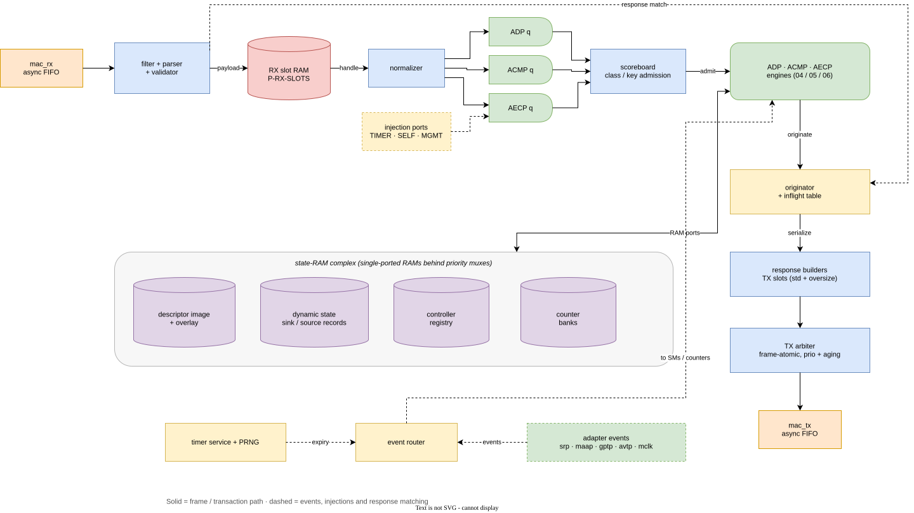
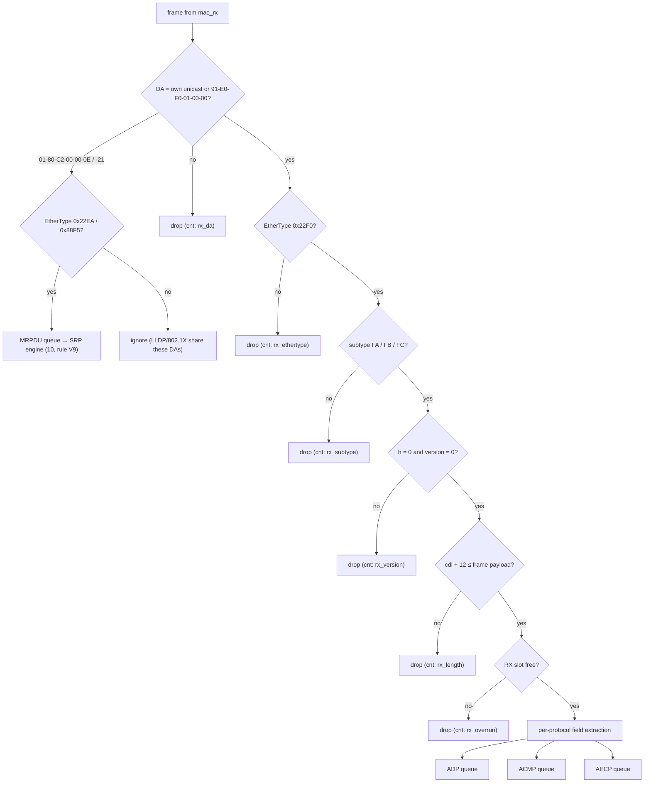
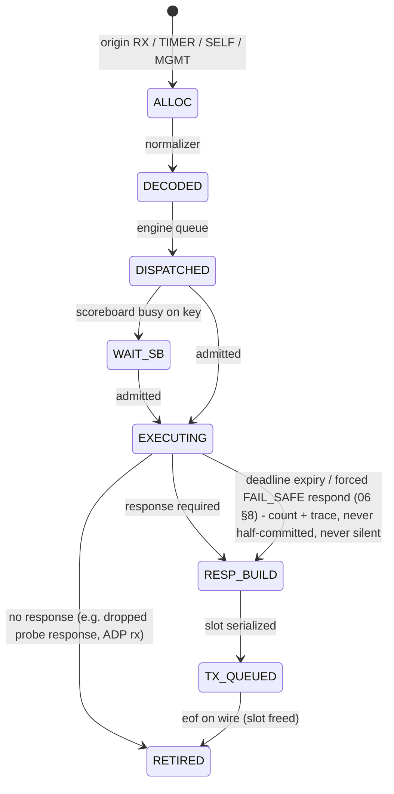

<!-- SPDX-License-Identifier: CERN-OHL-W-2.0 -->
# 03 — Packet Engine (shared RX/TX datapath)

## 1. Role

Everything protocol-agnostic and shared: frame ingress and validation, normalized
transactions, dispatch, the scoreboard, the self-origination path, response buffering,
and TX arbitration. The three engines ([04](04_adp_engine.md)/[05](05_acmp_engine.md)/
[06](06_aecp_engine.md)) only ever see normalized transactions and slot handles.

## 2. Shared datapath

<a id="fig-03-datapath"></a>**F03.1 — Shared datapath & memory interconnect** (source:
[`diagrams/src/03-shared-datapath.drawio`](../diagrams/src/03-shared-datapath.drawio))



> This export **predates** the move of the descriptor image and the AECP response buffer
> into the integrator's main memory, so its "state-RAM complex" still shows the image on
> chip. The current shape is [`20-rtl-dataflow.svg`](../diagrams/20-rtl-dataflow.svg) and
> [`22-aecp-descriptor-fetch.svg`](../diagrams/22-aecp-descriptor-fetch.svg); the
> component table below is correct.

| Component | Notes |
|---|---|
| RX async FIFO + filter/parser/validator | one per AVB interface; frame-atomic |
| RX slot RAM | `P-RX-SLOTS` × `P-RX-SLOT-BYTES`; zero-copy payload handles |
| Transaction normalizer | builds the record of [§4](#4-normalized-transaction) |
| Per-engine dispatch FIFOs | ADP / ACMP / AECP queues + the TIMER/SELF/MGMT injection ports |
| Scoreboard | admission control per hazard class/key ([§6](#6-scoreboard-hazard-classes-and-ordering)) |
| State-RAM port arbiters | overlay, dynamic state, registry, counters — each RAM single-ported with a small priority mux (engines never stall the RX path). The **descriptor image is not among them**: it lives in the integrator's main memory ([07 §3.3](07_memory_maps.md)), and only a one-descriptor line buffer and the cached index map are on chip |
| Response builders + TX slot RAM | `P-TX-STD-SLOTS` standard + 1 oversize slot ([§7](#7-response-building-and-buffers)) |
| Originator + inflight table | entity-initiated PDUs; response matching ([§5](#5-origins-originator-and-event-router)) |
| TX arbiter → TX async FIFO | frame-atomic priority merge ([§8](#8-tx-arbitration)) |
| Event router | sticky-event fan-out (catalog in [02 §5](02_interfaces.md)) |

## 3. RX pipeline

<a id="fig-03-rxflow"></a>**F03.2 — RX validate/decode flow**



<a id="fig-03-valrules"></a>**F03.6 — Validation and tolerance rules**

| # | Rule | Scope | Action | Source |
|---|---|---|---|---|
| V1 | Total PDU = `control_data_length` **+ 12**; IEEE figures printing +8 are an erratum | all | compute lengths from cdl | IEEE §9.2.2.6 (Δ-free, see [docs/README §4](../README.md)) |
| V2 | Padding to min Ethernet frame is excluded from cdl → **trust cdl, not frame length**; accept frame ≥ cdl+12 | all | parse cdl+12 octets, ignore the rest | IEEE §9.3.2 |
| V3 | Accept 56-B truncated ACMPDU (Milan) **and** 96-B IEEE form; also tolerate 2013 short forms | ACMP | fields beyond received length read as 0 | Milan §5.5.2.2; IEEE §8.2.1 note |
| V4 | Accept REGISTER_UNSOLICITED_NOTIFICATION with or without `flags` (absent = 0) | AECP | length-dependent decode | IEEE §7.4.37.1 |
| V5 | ADP: `entity_id` filter — ENTITY_DISCOVER for 0 or own EID; AVAILABLE/DEPARTING passed to talker matcher only | ADP | others dropped silently | Milan §5.6.3.1/§5.6.4.1 |
| V6 | AECP: `target_entity_id` ≠ own EID → drop (responses: match inflight table instead) | AECP | drop / route to originator | IEEE Fig 9-3 |
| V7 | ACMP: responses matched on {controller EID, seq, msg_type} against inflight; unknown → ignore | ACMP | route or ignore | IEEE §8.2.1; Milan §5.5.3.1 |
| V8 | Malformed below these gates is **never fatal**: drop + count, no state change | all | per-drop counters (trace-visible) | design rule |
| V9 | With `P-EN-SRP-ENGINE`: DA `01-80-C2-00-00-0E` + EtherType `0x22EA` (MSRP) and DA `01-80-C2-00-00-21` + EtherType `0x88F5` (MVRP) bypass the 1722.1 pipeline into the SRP engine's MRPDU queue; its own tolerance rules apply ([10 §3](10_srp_engine.md)); DA alone is NOT sufficient — LLDP (0x88CC) and 802.1X share these group DAs | MRP | route | 802.1Q Table 10-1/10-2, §35.2.2.1 (constants); Milan §4.2.7 (shall support) |

Field extraction uses the offset tables of the PDU reg figures
([F03.4](#fig-03-header), [F04.5](04_adp_engine.md#fig-04-adpdu),
[F05.13](05_acmp_engine.md#fig-05-acmpdu), [F06.10](06_aecp_engine.md#fig-06-aecpdu)).

<a id="fig-03-header"></a>**F03.4 — Common control header** (lanes bottom→top = wire
order; `@n` byte offsets are authoritative, lane bit indices are diagram-local)


<details>
<summary>WaveDrom source (editable)</summary>

```wavedrom
{"reg": [
  {"bits": 8,  "name": "subtype @0 (FA=ADP FB=AECP FC=ACMP)"},
  {"bits": 1,  "name": "h=0"},
  {"bits": 3,  "name": "version=0"},
  {"bits": 4,  "name": "message_type @1[3:0]"},
  {"bits": 5,  "name": "status / valid_time @2[7:3]"},
  {"bits": 11, "name": "control_data_length @2[2:0],@3"},
  {"bits": 64, "name": "entity_id / stream_id / target_entity_id @4..@11"}
], "config": {"bits": 96, "lanes": 3, "hspace": 950}}
```

</details>

## 4. Normalized transaction

One record shape for all work items, regardless of origin:

| Field | Width | Notes |
|---|---|---|
| `origin` | 2 | RX / TIMER / SELF / MGMT |
| `interface_index` | log2(P-N-AVB-INTERFACES) | ingress port (or target port for SELF) |
| `arrival_ts` | 32 (ms) | deadline base = completion of reception (last byte) |
| `protocol` | 3 | ADP / ACMP / AEM / MVU / AA |
| `message_type`, `status_in` | 4, 5 | from header |
| `cdl` | 11 | validated |
| `src_mac` | 48 | response addressing + registry tuple |
| `controller_eid`, `target_eid` | 64, 64 | as applicable |
| `sequence_id` | 16 | echoed in responses |
| `u`, `cr` | 1, 1 | AECP header bits |
| `opcode` | 16 | AEM command_type / MVU command_type / ACMP-ADP message_type |
| `operands` | struct | desc_type, desc_index, config_index, talker/listener unique_id, … |
| `rx_slot` | handle | zero-copy payload (null for TIMER/SELF) |
| `hazard_class`, `hazard_key` | 4, 16 | from dispatch ROM ([§6](#6-scoreboard-hazard-classes-and-ordering)) |
| `tx_slot` | handle | allocated at response build |
| `deadline` | 32 (ms) | arrival + class budget ([08 §4](08_timing.md)) |
| `resp_disposition` | 2 | unicast / ACMP multicast / identify multicast |

<a id="fig-03-lifecycle"></a>**F03.3 — Transaction lifecycle**



Pool sizing: transactions in flight ≤ `P-RX-SLOTS` + queue depths; the deadline-kill
arc guarantees pool drain even under pathological load (a kill never leaves partial
state: commits are atomic at EXECUTE end, [06 §5](06_aecp_engine.md)).

## 5. Origins, originator, and event router

The pipeline has **four producers** into the same dispatch stage:

1. **RX** — parsed frames (above).
2. **TIMER** — expiry events re-enter as transactions targeting their owner engine
   (e.g. `TMR_ADVERTISE` → ADP; monitor expiry → registry probe flow).
3. **SELF** — the **originator**: single service point where engines request
   entity-initiated PDUs: ACMP `PROBE_TX` (from the listener SM), AECP
   `CONTROLLER_AVAILABLE` (from the registry monitor), unsolicited responses (from the
   fan-out engine), `IDENTIFY_NOTIFICATION`, ADP TX. The originator:
   - accepts a PDU already serialized into a TX slot, then holds that immutable slot
     across the exchange so a retry sends the exact same bytes
     ([05 §6.4](05_acmp_engine.md));
   - assigns `sequence_id` from the owner's counter (per-controller for unsolicited,
     [06 §7](06_aecp_engine.md));
   - for command-type PDUs (PROBE_TX, CONTROLLER_AVAILABLE) writes an **inflight
     entry** `{owner, key, seq, deadline T-ID, retried}` so V7/V6 route the response
     back. The response timer starts only when the TX arbiter grants the handle to
     the serializer, so time spent in the lane queue cannot consume an attempt
     budget. Serializer grants and cancellation pulses are parked per inflight
     entry before the shared timer arm port, so a simultaneous response cannot
     lose either event.
     On deadline expiry with `retried = 0` it re-sends the held slot once;
     the retry timer likewise starts only after serializer acceptance. A second
     expiry reports timeout to the owner. IEEE's one-retry rule is thereby central,
     not per-engine (IEEE §9.3.6.1.2, §8.2.2.1.5). The CONTROLLER_AVAILABLE key is
     the full `{controller Entity ID, controller MAC}` tuple, so a folded-MAC
     collision or a response for another target cannot complete the exchange;
   - releases cancelled or completed slots through a per-slot pending merge. Two
     release sources can pulse together without losing a handle, and a cancelled
     handle still waiting in the originator lane queue is removed before slot reuse.
     A selected handle remains withdrawable until the slot pool accepts its
     serializer start. The arbiter grants only on that acceptance boundary;
     later release clears the hold so the final serializer beat frees the slot.
4. **MGMT** — side-port operations that mirror ATDECC changes enter as transactions so
   lock checks, commits and notifications follow the same path ([02 §7](02_interfaces.md)).

The **event router** delivers sticky events (catalog [02 §5](02_interfaces.md)) to
their consumers; consumers that are state machines treat them as SM events, the
counters subsystem latches ticks at the observation tick, and the notification engine
turns the Table 5.22 subset into triggers.

## 6. Scoreboard: hazard classes and ordering

<a id="fig-03-hazards"></a>**F03.7 — Hazard classes and serialization keys.** Admission
control per class/key — the load-bearing role is **cross-engine interlock** (the AECP
µCPU is single-issue anyway):

| Class | Members | Key | Rule |
|---|---|---|---|
| RO_SNAPSHOT | all GETs, READ_DESCRIPTOR, GET_RX/TX_STATE | addressed descriptor | parallel; blocked only vs in-flight write on the same key |
| CFG_BARRIER | SET_CONFIGURATION | global | drain all in-flight, block admission, then execute (STREAM_IS_RUNNING pre-guard first) |
| STREAM_CFG | SET_STREAM_FORMAT/INFO, START/STOP_STREAMING, BIND/UNBIND/probe events, listener-SM steps | stream index | serialized per key — doubles as the per-sink SM serialization (one event at a time per sink) |
| MAP_CFG | ADD/REMOVE_AUDIO_MAPPINGS, GET_AUDIO_MAP (write side) | stream port | serialized per key **and** cross-locked with STREAM_CFG of referenced streams (format↔mapping validation pair) |
| CLOCK_CFG | SET_SAMPLING_RATE, SET_CLOCK_SOURCE, MVU SET_MCR_INFO | audio unit / clock domain | serialized per key |
| NAME_WR | SET_NAME | descriptor | serialized per key |
| LOCK_OP | LOCK_ENTITY + `T-LOCK-UNLOCK` expiry event | global | serialized vs every lock-protected member (incl. ACMP BIND/UNBIND and MGMT writes) |
| REGISTRY_OP | REGISTER/DEREGISTER, monitor removals, TIME_LIMITED expiry | registry | serialized on the registry |
| IDENTIFY | SET_CONTROL(identify), notification bursts | identify | serialized |

The current top-level classifier maps every ACMP transaction to `STREAM_CFG`
and maps AECP opcodes `0x002C` and `0x002D` to `MAP_CFG`. The scoreboard uses
the documented class-wide exclusion, so an ACMP stream-state transition cannot
enter after mapping commit-begin and before the mapping response releases its
hold.

The top has one live admission port. Ready ACMP and AECP heads use round-robin
choice, and neither dispatch queue pops unless the scoreboard grants that
head. This prevents a continuous ACMP stream from starving a conflicting AECP
write. The selected engine records the granted hold id and RX slot. The hold
is released only when that same engine returns the matching RX slot, after its
solicited response request has been queued or after a defined silent
retirement. A simultaneous ACMP and AECP retirement is serialized through a
one-cycle pending release bit. Root-local and SRP enable changes do not cross
this processor admission point; the root mapping transaction therefore adds a
per-output reservation after its phase-1 recheck.

Ordering rules:

- **(a)** commit → solicited-response enqueue → notification-trigger enqueue
  (notifications always reflect committed state; requester excluded).
- **(b)** per-controller solicited responses keep arrival order within a class
  (single-issue satisfies this; stated as an invariant for future parallel
  implementations — IEEE permits pipelined controllers, §9.2.2).
- **(c)** the unsolicited stream is an independent per-controller sequence
  ([06 §7](06_aecp_engine.md)).
- **(d)** NVM commits are asynchronous and never delay responses.
- **(e)** a deadline expiry **forces a response, never a silent drop** (IEEE
  1722.1-2021 §9.3.2.6: "Entities shall respond to all ATDECC commands within
  240 milliseconds"): the transaction is redirected to the FAIL_SAFE µprogram
  ([06 §8](06_aecp_engine.md)), which emits a correctly-addressed response
  carrying the best current status; the serialization key is released only
  after that response is queued, and no partial commit survives the kill. The
  AECP deadline is **armed at `T-BUDGET-AECP-WC`**, leaving ≥ 140 ms of the
  `T-AECP-RESP` line for the FAIL_SAFE build and TX serialization — the forced
  response is on the wire inside 240 ms, not merely started at it.

## 7. Response building and buffers

- TX slot classes: `P-TX-STD-SLOTS` × 576 B (covers every ≤ 524-cdl PDU) and **one
  full-frame oversize slot** (`P-TX-OVERSIZE-BYTES`) reserved for the Δ8 command set
  (READ_DESCRIPTOR, GET_AVB_INFO, GET_AS_PATH, GET_AUDIO_MAP, ADD/REMOVE_AUDIO_MAPPINGS
  — Milan §5.4.1). GET_DYNAMIC_INFO is **not** oversize-allowed and enforces the
  524-cdl cap by skipping elements ([06 §6.7](06_aecp_engine.md)).
- Builders serialize from response templates + field writes; `control_data_length`
  computed last; padding added by the MAC path and never counted (V2).
- Every AECP opcode — implemented or not — has a **response-size ROM** entry so
  `NOT_IMPLEMENTED` responses are correctly sized (IEEE §9.3.5.3.3;
  [06 §6](06_aecp_engine.md)).

### 7.1 Realization — the AECP response buffer lives in MAIN MEMORY

`hdl/aecp/KL_aecp_resp_buf.sv`. The buffer a µprogram builds its response in is
`16 + LINE_BYTES_P` = 592 B at the shipping shape — the §3.2 worst-case descriptor
plus the 06 §8 header record and the 4-byte `{configuration_index, reserved}` prefix.
Held as fabric state inside `KL_aecp_engine` it measured **5,079 flip-flops and 3,495
LUTs** (xc7a100t, Vivado 2026.1, post-synthesis out-of-context at the 1-stream shape)
and it was those instances the placer could not pack on a die whose 135 block-RAM
tiles were already 100 % used. It is not a cache, it is never read while it is
written, and only the frame builder reads it — so it went the same way the entity
model did ([07 §3.3.1](07_memory_maps.md)): into the integrator's main memory, behind
a second **vendor-neutral master** on `protocol_processor_top` (`resp_mem_*`) at the
compile-time `RESP_BASE_P`. Unlike the image this region is **written** by the
processor, so the integrator must reserve it and it must not overlap `DESC_BASE_P`.

The master is READ **and** WRITE, and it is deliberately a *second* master rather
than a widening of `desc_mem_*`: both clients are watchdog-bounded with one
outstanding transaction each, and sharing one channel would buy an arbiter whose
grant has to be released correctly on every timeout arm of both. The integrator's
memory system already arbitrates.

Three rules make it work:

- **Write order.** Byte addresses arrive non-decreasing from byte 12 upward within
  one response (06 §8: `BUILD_HEADER` owns 0..11, the cursor starts at 12 and every
  `BUILD_FIELD`/`APPEND`/`COPY_BUFFER` advances it), so the block holds exactly ONE
  open 64-bit lane and writes it out the moment a byte for a different lane arrives.
  Writes below byte 12 are accepted and dropped: that record is not the wire header
  and has no reader.
- **Flow control.** `rb_ready` is new on the µCPU's response-buffer face and
  `wr_ready_o` is a **register**: every write is captured into a one-deep skid and
  absorbed a byte per cycle from there, so the ready never depends on `wr_addr`.
  Driving it from the address instead puts the µCPU's stall path through this block's
  lane arithmetic and back into the µcode-ROM address — measured at 18 logic levels
  and ~1 ns of WNS on the reference part.
- **An echoed payload never touches memory.** IEEE §9.3.5.3.3's echo is the command
  verbatim and the command is still in its RX slot until the engine frees it, so the
  frame builder reads those bytes straight out of the slot.

Latency is free here for the same reason it is in 07 §3.3.1: IEEE §9.2.1.1 gives an
AECP command **100 ms**, which is 10,000,000 clocks at `P-CLK-HZ`. `tb/pp_top`
measures the whole path — MAC command byte 0 to MAC response byte 0 — at **7,244
clocks** for a 316-byte payload with every access costing the reference SoC's measured
~1424 ns (143 clocks), i.e. **0.07 %** of the budget; the 592-byte worst case adds 33
more lane writes and stays under 0.13 %. A bridge that never answers is a legal
wiring: the watchdog voids the response and the engine emits a well-formed
`ENTITY_MISBEHAVING` (IEEE §7.4 status 10) rather than silence, a leaked TX slot or a
`SUCCESS` carrying bytes it never read.

## 8. TX arbitration

```mermaid
flowchart LR
  acmup["ACMP responses"] --> arb{"TX arbiter&#10;prio 1"}
  aecpp["AECP solicited"] --> arb2{"prio 2"}
  origp["originator: probes / CA / identify"] --> arb2
  notifp["unsolicited fan-out (paced)"] --> arb3{"prio 3"}
  srpp["SRP MRPDUs (10, when P-EN-SRP-ENGINE)"] --> arb3
  adpp["ADP periodic"] --> arb4{"prio 4"}
  arb --> mux["frame-atomic grant&#10;+ starvation guard"]
  arb2 --> mux
  arb3 --> mux
  arb4 --> mux
  mux --> fifo["mac_tx async FIFO"]
```

<a id="fig-03-txflow"></a>**F03.5 — TX path**



| Rule | Detail |
|---|---|
| Priorities | ACMP (tightest budget, `T-BUDGET-ACMP-RESP`) > AECP solicited + originator commands > notification bursts > ADP periodic |
| Frame-atomic | grant holds sof→eof ([F02.4](02_interfaces.md#fig-02-txwave)); no preemption |
| Starvation guard | aging promotes any requester older than `T-TX-AGING` to priority 1 |
| Notification pacing | fan-out engine spaces bursts so ≥ 1 slot/frame-time remains for solicited traffic; counters class additionally rate-limited ≤ 1/descriptor/s |
| Destination addressing | AECP: unicast to `src_mac` (or registry MAC for unsolicited). ACMP: **all** responses multicast `91-E0-F0-01-00-00`. ADP: multicast `91-E0-F0-01-00-00`. Identify: multicast `91-E0-F0-01-00-01` (IEEE Annex B). MRPDUs: MSRP `01-80-C2-00-00-0E` / MVRP `01-80-C2-00-00-21` |

## 9. Parameterization

`P-RX-SLOTS`, `P-RX-SLOT-BYTES`, `P-TX-STD-SLOTS`, `P-TX-OVERSIZE-BYTES`,
`P-NOTIF-QUEUE-DEPTH`, `P-CA-POOL`, `P-N-AVB-INTERFACES` — values in
[F01.5](01_overview.md#fig-01-params). Cross-references: engines
[04](04_adp_engine.md)/[05](05_acmp_engine.md)/[06](06_aecp_engine.md); memory
[07](07_memory_maps.md); budgets [08](08_timing.md). Matrix rows covered:
REQ-ACMP-001/012, REQ-AEM-001/023, and the V-rules feed TOL tests
([09 §3](09_verification.md)).
