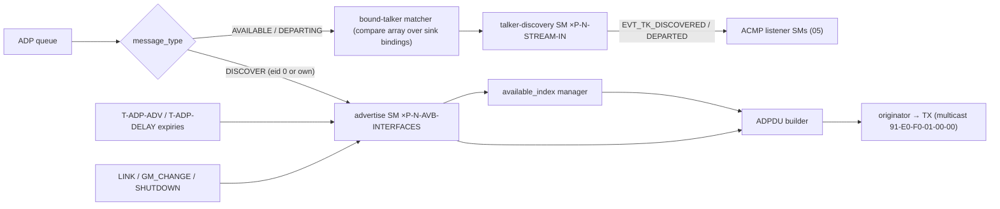
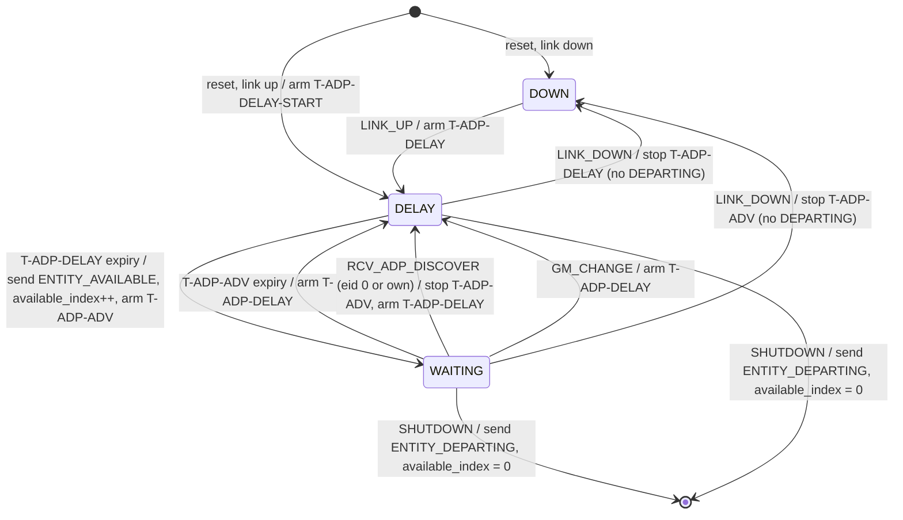
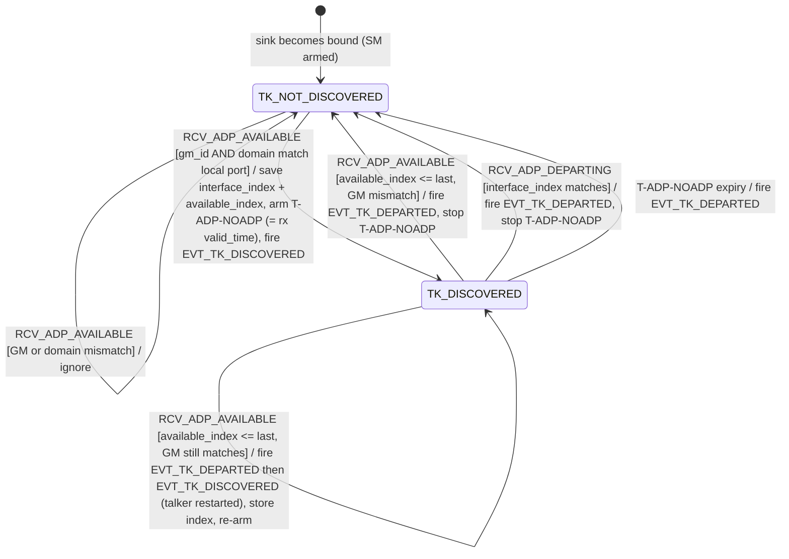
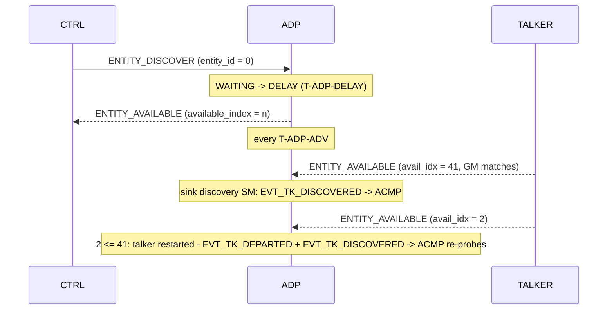

<!-- SPDX-License-Identifier: CERN-OHL-W-2.0 -->
# 04 — ADP Engine (discovery)

## 1. Role and scope

Advertises this entity and tracks the availability of **bound talkers** for the ACMP
listener machines. Pure hardwired FSMs — no microcode (3 message types, one fixed
68-byte PDU, all fields register-sourced).

| Responsibilities | Non-goals |
|---|---|
| ENTITY_AVAILABLE advertising per AVB interface (Milan §5.6.3) | a general network entity table with aging — that is a *controller* concept, deliberately absent ([GAP-16](../00_MILAN_COMPLIANCE_REVIEW.md#gap-16)) |
| ENTITY_DISCOVER responses; ENTITY_DEPARTING on shutdown | discovery of anything other than bound talkers |
| `available_index` management | |
| Per-bound-sink talker-discovery SM feeding ACMP | |

## 2. External contract

Consumes: ADP queue transactions ([03 §4](03_packet_engine.md)); timer expiries
`T-ADP-*`; events `LINK_UP/DOWN{if}`, `GM_CHANGE{if}`; `SHUTDOWN` request; class-D
`gm_id[if]`, `gptp_domain[if]` ([F02.10](02_interfaces.md#fig-02-statusdict)).
Produces: ADP TX requests to the originator; `EVT_TK_DISCOVERED{sink}` /
`EVT_TK_DEPARTED{sink}` to the ACMP listener SMs; `GPTP_GM_CHANGED` counter ticks.

## 3. PDU handling

<a id="fig-04-adpdu"></a>**F04.5 — ADPDU** (68 B, cdl = 56, IEEE Fig 6-1; lanes
bottom→top = wire order; `@n` byte offsets authoritative)


<details>
<summary>WaveDrom source (editable)</summary>

```wavedrom
{"reg": [
  {"bits": 8,  "name": "subtype @0 = 0xFA"},
  {"bits": 1,  "name": "h=0"},
  {"bits": 3,  "name": "ver=0"},
  {"bits": 4,  "name": "message_type @1"},
  {"bits": 5,  "name": "valid_time @2 (Milan: 10)"},
  {"bits": 11, "name": "cdl = 56"},
  {"bits": 64, "name": "entity_id @4"},
  {"bits": 64, "name": "entity_model_id @12"},
  {"bits": 32, "name": "entity_capabilities @20"},
  {"bits": 16, "name": "talker_stream_sources @24"},
  {"bits": 16, "name": "talker_capabilities @26"},
  {"bits": 16, "name": "listener_stream_sinks @28"},
  {"bits": 16, "name": "listener_capabilities @30"},
  {"bits": 32, "name": "controller_capabilities @32 = 0"},
  {"bits": 32, "name": "available_index @36"},
  {"bits": 64, "name": "gptp_grandmaster_id @40"},
  {"bits": 8,  "name": "gptp_domain_number @48"},
  {"bits": 8,  "name": "reserved @49"},
  {"bits": 16, "name": "current_configuration_index @50"},
  {"bits": 16, "name": "identify_control_index @52"},
  {"bits": 16, "name": "interface_index @54"},
  {"bits": 64, "name": "association_id @56 = 0"},
  {"bits": 32, "name": "reserved @64"}
], "config": {"bits": 544, "lanes": 17, "hspace": 950}}
```

</details>

Message types: 0 ENTITY_AVAILABLE · 1 ENTITY_DEPARTING · 2 ENTITY_DISCOVER.
`valid_time` = 0 in DEPARTING/DISCOVER (IEEE §6.2.2.5).

**Field-sourcing table** (every TX field ← one owner):

| Field | Source | Rule |
|---|---|---|
| `valid_time` | constant | **10** (2-s units ⇒ 20 s validity; cadence `T-ADP-ADV`) — Δ5 |
| `entity_id`, `entity_model_id` | config/ID registers | model id ≠ 0/≠ all-1s; changes on structural model change (Milan §5.3.1) |
| `entity_capabilities` | constant | [F04.6](#fig-04-caps) |
| `talker_stream_sources` / `listener_stream_sinks` | model metadata | **max across all configurations** (Milan §5.3.3.1) |
| `talker_capabilities` / `listener_capabilities` | config registers | Milan-unconstrained; per IEEE Tables 6-3/6-4: IMPLEMENTED 0x0001 + AUDIO_SOURCE/SINK 0x4000 (+ MEDIA_CLOCK_SOURCE/SINK 0x0800 if CRF outputs/inputs) — review §8 item 6 |
| `controller_capabilities` | constant 0 | not a controller |
| `available_index` | available_index manager | [§5](#5-state) |
| `gptp_grandmaster_id` / `gptp_domain_number` | class-D `gm_id[if]`, `gptp_domain[if]` | sampled at PDU build; per-interface |
| `current_configuration_index` | dynamic overlay | ADPDU otherwise independent of configuration (Milan §5.6.2 note) |
| `identify_control_index` | model metadata | same index in every configuration (Milan §5.3.3.10) |
| `interface_index` | instance constant | per advertise-SM instance |
| `association_id` | constant 0 | ASSOCIATION_ID not supported |

<a id="fig-04-caps"></a>**F04.6 — `entity_capabilities` value (Milan §5.6.2)**

> ⚠ Bit tables in Milan and IEEE 1722.1 are **MSB-first** (bit 31 ⇔ mask `0x00000001`).
> The **hex mask column is authoritative**; never derive shifts from bit-number columns.

| Flag | Mask | Value |
|---|---|---|
| AEM_SUPPORTED | 0x00000008 | 1 |
| VENDOR_UNIQUE_SUPPORTED | 0x00000080 | 1 |
| CLASS_A_SUPPORTED | 0x00000100 | 1 |
| GPTP_SUPPORTED | 0x00000400 | 1 |
| AEM_IDENTIFY_CONTROL_INDEX_VALID | 0x00004000 | 1 |
| AEM_INTERFACE_INDEX_VALID | 0x00008000 | 1 |
| AEM_PERSISTENT_ACQUIRE_SUPPORTED | 0x00002000 | 0 |
| GENERAL_CONTROLLER_IGNORE | 0x00010000 | 0 |
| ENTITY_NOT_READY | 0x00020000 | 0 |
| ACMP_ACQUIRE_WITH_AEM | 0x00040000 | 0 |
| EFU_MODE | 0x00000001 | 0 (no Milan firmware mode, [GAP-13](../00_MILAN_COMPLIANCE_REVIEW.md#gap-13)) |
| all others | — | 0 |

## 4. Internal blocks

<a id="fig-04-blocks"></a>**F04.1 — ADP engine internals**



## 5. State

Per interface: advertise SM state (2 b), `available_index` (32 b, volatile: 0 at
power-up, **increment after** each transmitted ENTITY_AVAILABLE, reset to 0 on
ENTITY_DEPARTING — IEEE §6.2.2.9), one timer handle. Per sink: discovery SM state
(1 b), saved `interface_index` + last `available_index` of the bound talker, one
`T-ADP-NOADP` handle — stored in the sink record ([F07.6](07_memory_maps.md#fig-07-sinkrec)).

## 6. Behavior

### 6.1 Advertise state machine (one per AVB interface)

<a id="fig-04-advsm"></a>**F04.2 — Milan advertise SM (Milan §5.6.3)**



| Rule | Note |
|---|---|
| Startup delay is **T-ADP-DELAY-START**, every later delay **T-ADP-DELAY** | two distinct constants — single-constant implementations are a known bug class (review §8 item 5) |
| ENTITY_DEPARTING **only** on SHUTDOWN; never on link-down | Milan §5.6.3.5.6/.10 |
| GM change ⇒ re-advertise (through DELAY) | Milan §5.6.3.5.7; also ticks GPTP_GM_CHANGED |
| DOWN ignores DISCOVER/GM_CHANGE/SHUTDOWN; DELAY ignores DISCOVER/GM_CHANGE | Table 5.51 |
| Held in DOWN until `entity_enable` (boot gate) | Milan §5.6.1 |

### 6.2 Talker-discovery state machine (one per Stream Input; active while bound)

<a id="fig-04-discsm"></a>**F04.3 — Talker-discovery SM (Milan §5.6.4; differs from IEEE §6.2.6)**



Guards (Milan §5.6.4.5.1/.2): an ENTITY_AVAILABLE is only accepted when its
`gptp_grandmaster_id` **and** `gptp_domain_number` equal the local port's current
values; in TK_DISCOVERED, `interface_index` must equal the saved value.
`available_index ≤ last` is the **talker-restart detector** — the departed+rediscovered
event pair makes the ACMP listener re-probe stale SRP parameters
([05 §6.5](05_acmp_engine.md)).

### 6.3 Canonical sequence

<a id="fig-04-seq"></a>**F04.4 — Discovery interplay (incl. talker restart)**



## 7. µcode / dispatch

n/a — pure FSM engine.

## 8. Timing

Owns `T-ADP-ADV`, `T-ADP-DELAY`, `T-ADP-DELAY-START`, `T-ADP-NOADP` — values only in
[F08.1](08_timing.md#fig-08-constants). Random draws come from the PRNG
([08 §3](08_timing.md)).

## 9. Milan deltas

> **Δ5 — Milan overrides IEEE:** the fixed `valid_time` and `T-ADP-ADV` cadence and the
> DOWN/WAITING/DELAY SM with GM_CHANGE re-advertise replace IEEE's
> `valid_time/2` reannounce and millisecond-scale `randomDeviceDelay`
> (IEEE §6.2.4; Milan §5.6.2–5.6.3).

Also inherited here: per-sink discovery replaces IEEE §6.2.6 general discovery
(Milan §5.6.4, [F01.4](01_overview.md#fig-01-deltas) Δ15 context).

## 10. Parameterization

Instances scale with `P-N-AVB-INTERFACES` (advertise SMs) and `P-N-STREAM-IN`
(discovery SMs). No other knobs.

## 11. Cross-references

Covers REQ-ADP-001…014 ([matrix](../00_MILAN_COMPLIANCE_REVIEW.md#fig-00-matrix)).
Downstream consumer: [05 §6](05_acmp_engine.md). Timer values: [08 §2](08_timing.md).
Sink-record fields: [07 §4](07_memory_maps.md).
