<!-- SPDX-License-Identifier: CERN-OHL-W-2.0 -->
# 05 — ACMP Engine (Milan connection management)

## 1. Role and scope

Implements Milan connection management (Milan §5.5): a **stateless talker responder**
and, per Stream Input, the Milan 8-state **listener binding/probing state machine**.
Read [04](04_adp_engine.md) first — the listener SM consumes its discovery events.

| Responsibilities | Non-goals (explicit) |
|---|---|
| BIND_RX / UNBIND_RX / GET_RX_STATE handling per sink | **no talker-side connection state** (Milan §5.5.2.7) |
| PROBE_TX origination with exact-duplicate retry | DISCONNECT_TX changes nothing — always SUCCESS no-op |
| Settlement + SRP reservation orchestration | GET_TX_CONNECTION → `NOT_SUPPORTED` (Table 5.48) |
| PROBE_TX / GET_TX_STATE / DISCONNECT_TX responder | fast connect, CL_ENTRIES, saved controller state (IEEE-2013isms) |
| Binding persistence via NVM | honoring STREAMING_WAIT on outputs (Δ14) |

## 2. External contract

Consumes: ACMP queue ([03 §4](03_packet_engine.md)); `EVT_TK_DISCOVERED/DEPARTED{sink}`
([04 §6.2](04_adp_engine.md)); `TK_ATTR_REGISTERED/UNREGISTERED{sink}` from `srp`;
timer expiries `T-ACMP-*`; lock queries to the lock manager. Produces: responses +
PROBE_TX via originator; `srp` ops (`DECLARE/WITHDRAW_LISTENER`), `avtp` ops
(`INPUT_CONFIGURE/ENABLE/DISABLE/START/STOP`); NVM binding records; `pbsta`/`acmpsta`
and bound/settled state read by AECP gather ([06 §6.2](06_aecp_engine.md)); notification
triggers on every committed state change.

## 3. PDU handling

<a id="fig-05-acmpdu"></a>**F05.13 — Milan truncated ACMPDU** (56 B; Milan sends and
accepts this form, longer IEEE forms accepted with the missing tail read as 0 — V3;
lanes bottom→top = wire order, `@n` byte offsets authoritative)


<details>
<summary>WaveDrom source (editable)</summary>

```wavedrom
{"reg": [
  {"bits": 8,  "name": "subtype @0 = 0xFC"},
  {"bits": 1,  "name": "h=0"},
  {"bits": 3,  "name": "ver=0"},
  {"bits": 4,  "name": "message_type @1"},
  {"bits": 5,  "name": "status @2"},
  {"bits": 11, "name": "cdl = 44 (56-B PDU)"},
  {"bits": 64, "name": "stream_id @4"},
  {"bits": 64, "name": "controller_entity_id @12"},
  {"bits": 64, "name": "talker_entity_id @20"},
  {"bits": 64, "name": "listener_entity_id @28"},
  {"bits": 16, "name": "talker_unique_id @36 (= STREAM_OUTPUT index)"},
  {"bits": 16, "name": "listener_unique_id @38 (= STREAM_INPUT index)"},
  {"bits": 48, "name": "stream_dest_mac @40"},
  {"bits": 16, "name": "connection_count @46"},
  {"bits": 16, "name": "sequence_id @48"},
  {"bits": 16, "name": "flags @50"},
  {"bits": 16, "name": "stream_vlan_id @52"},
  {"bits": 16, "name": "connected_listeners_entries @54 (reserved, CL_ENTRIES_VALID=0)"}
], "config": {"bits": 448, "lanes": 14, "hspace": 950}}
```

</details>

Message types (Milan names, IEEE names in parentheses — Δ1): 0/1 PROBE_TX cmd/resp
(CONNECT_TX) · 2/3 DISCONNECT_TX cmd/resp · 4/5 GET_TX_STATE · 6/7 BIND_RX
(CONNECT_RX) · 8/9 UNBIND_RX (DISCONNECT_RX) · 10/11 GET_RX_STATE · 12/13
GET_TX_CONNECTION.

`flags` masks (MSB-first warning of [docs/README §4](../README.md) applies):
CLASS_B `0x0001` · FAST_CONNECT `0x0002` · SAVED_STATE `0x0004` · STREAMING_WAIT
`0x0008` · **REGISTERING_FAILED** `0x0040` (IEEE name SRP_REGISTRATION_FAILED) ·
CL_ENTRIES_VALID `0x0080`. Unused-by-Milan flags sent as 0, ignored on RX
(Tables 5.24/5.25).

Incoming dispatch (Milan §5.5.3.1, rule V7 of [03 §3](03_packet_engine.md)):

| Message | Guard | Action |
|---|---|---|
| BIND_RX / UNBIND_RX / GET_RX_STATE cmd | `listener_entity_id` = own; `listener_unique_id` valid | else respond **LISTENER_UNKNOWN_ID** (state fields undefined) |
| PROBE_TX_RESPONSE | `listener_entity_id` = own; the LISTENER `unique_id` @38 valid (it addresses the record; the talker's @36 may differ freely); {controller EID, talker EID, talker unique_id, seq} match the saved probe | else **silently ignore** |
| PROBE_TX / DISCONNECT_TX / GET_TX_STATE / GET_TX_CONNECTION cmd | `talker_entity_id` = own | talker responder [§6bis](#6bis-talker-side-stateless-responder) |
| anything else | — | ignore |

All ACMP responses go to multicast `91-E0-F0-01-00-00`; all five command timeouts are
`T-ACMP-CMD` (Δ3).

## 4. Internal blocks

<a id="fig-05-blocks"></a>**F05.1 — ACMP engine internals**

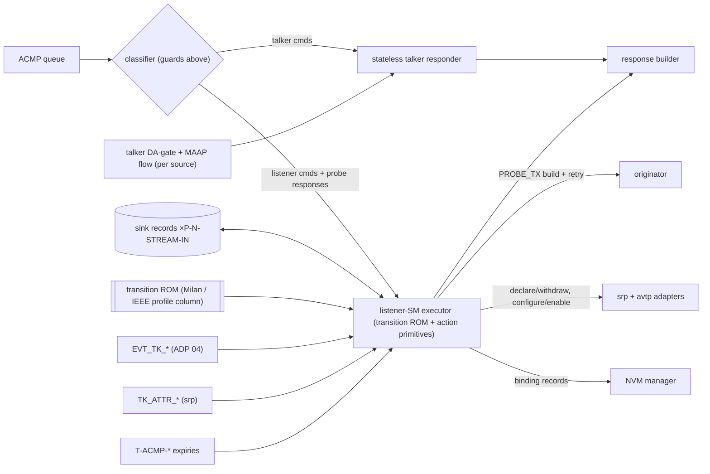

**Compute-model decision** — one event-driven **executor over per-sink records** with a
transition-table ROM (state × event → next state + action list) and ~16 hardwired
action primitives, instead of (a) a replicated FSM per sink (wasteful past a few
sinks) or (b) microcode (unjustified — the SM is Milan-normative and closed). Events
are rare (network/timer scale); one-event-at-a-time per sink is *required* anyway
(STREAM_CFG serialization, [03 §6](03_packet_engine.md)); state scales in RAM with
`P-N-STREAM-IN`; and the ROM is the Milan/IEEE profile seam. Implementations may
replicate the executor for very large sink counts without changing this contract.

## 5. State

<a id="fig-05-sinkrec"></a>Per-sink record (layout figure
[F07.6](07_memory_maps.md#fig-07-sinkrec), ≈48 B core):

| Group | Fields |
|---|---|
| SM | `sm_state` (3 b, 8 states) · `pbsta` (3 b) · `acmpsta` (5 b) |
| Flags | bound · started · saved STREAMING_WAIT · probe `retried` · srp_listener_declared (2 b) · talker_registered · tk_discovered |
| Binding | `talker_entity_id` (64) · `talker_unique_id` (16) · `bind_controller_eid` (64) |
| Probe | `probe_seq` (16) — the saved command is **regenerated**, not stored raw |
| Settled | `stream_id` (64) · `stream_dest_mac` (48) · `stream_vlan_id` (12) |
| Discovery | saved `interface_index` · last `available_index` (32) |
| Timers | SM timer handle · T-ADP-NOADP handle |

NVM shadow ≈20 B/sink: {valid, talker EID, talker unique_id, controller EID, started}
(Milan §5.3.8.2/.3/.7). `pbsta` encodings: 0 PROBING_DISABLED · 1 PROBING_PASSIVE ·
2 PROBING_ACTIVE · 3 PROBING_COMPLETED. `acmpsta` = IEEE Table 8-3 code, **defined
only while PROBING_ACTIVE**, else 0 (Milan §5.3.8.6).

## 6. Listener behavior — the four-view package

Reading guide: **[F05.3](#fig-05-listener-matrix) is the single authoritative
artifact.** F05.2 shows only the happy path; F05.4/F05.5 zoom into the two dense
regions; the sequences of [§8](#8-canonical-sequences) give the temporal view.
Verification walks every F05.3 cell ([09 §3](09_verification.md), MTXW).

### 6.1 States

| State | Meaning | pbsta |
|---|---|---|
| `UNBOUND` | no binding | 0 DISABLED |
| `PRB_W_AVAIL` | bound; waiting for ADP to discover the talker | 1 PASSIVE |
| `PRB_W_DELAY` | talker seen; anti-storm delay before probing | 2 ACTIVE |
| `PRB_W_RESP` | probe #1 sent, awaiting response | 2 ACTIVE |
| `PRB_W_RESP2` | exact-duplicate probe #2 sent | 2 ACTIVE |
| `PRB_W_RETRY` | both probes failed / error status; backoff | 2 ACTIVE |
| `SETTLED_NO_RSV` | SRP params latched; waiting matching talker attribute | 3 COMPLETED |
| `SETTLED_RSV_OK` | matching talker attribute registered | 3 COMPLETED |

### 6.2 Happy path only

<a id="fig-05-listener-main"></a>**F05.2 — Listener SM, happy path (authoritative behavior: [F05.3](#fig-05-listener-matrix))**

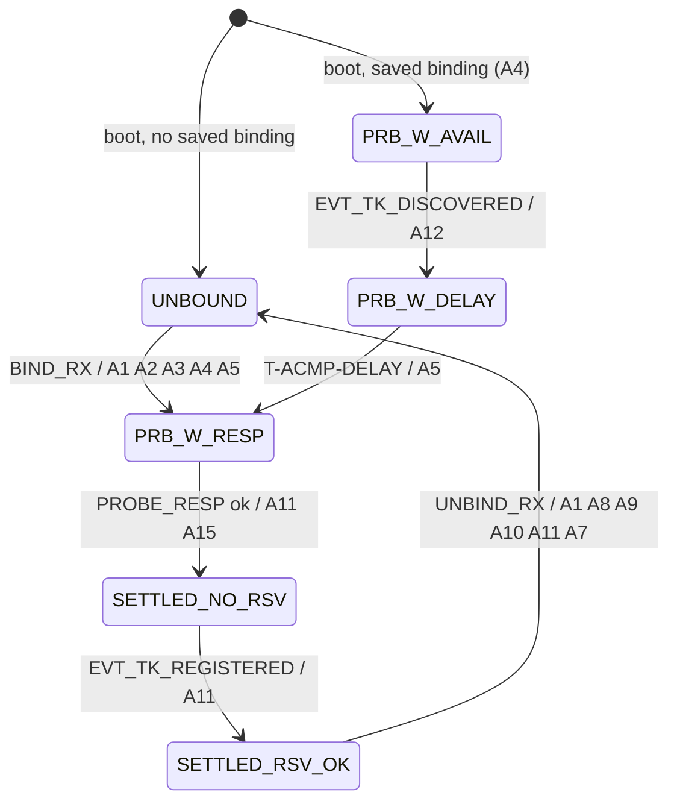

### 6.3 Authoritative transition matrix

<a id="fig-05-listener-matrix"></a>**F05.3 — Full matrix (Milan Table 5.30 + §5.5.3.5.1–.48).**
Cell = `next-state / actions`; `—` impossible; `ign` = ignored (no effect); `†` =
conditional (legend below). Column keys: UNB=UNBOUND · PWA=PRB_W_AVAIL ·
PWD=PRB_W_DELAY · PWR=PRB_W_RESP · PW2=PRB_W_RESP2 · PWT=PRB_W_RETRY ·
SNR=SETTLED_NO_RSV · SOK=SETTLED_RSV_OK.

| Event \ State | UNB | PWA | PWD | PWR | PW2 | PWT | SNR | SOK |
|---|---|---|---|---|---|---|---|---|
| `BIND_RX` same talker+source | — | PWA / A1 A6 A3 | PWD / A1 A6 A3 | PWR / A1 A6 A3 | PW2 / A1 A6 A3 | PWT / A1 A6 A3 | SNR / A1 A6 A3 | SOK / A1 A6 A3 |
| `BIND_RX` new/different source | PWR / A1 A2 A3 A4 A5 | PWR / A1 A11 A9 A2 A3 A4 A5 | PWR / A1 A11 A9 A2 A3 A4 A5 | PWR / A1 A11 A9 A2 A3 A4 A5 | PWR / A1 A11 A9 A2 A3 A4 A5 | PWR / A1 A11 A9 A2 A3 A4 A5 | PWR / A1 A11 A8 A9 A2 A3 A4 A5 | PWR / A1 A11 A8 A9 A2 A3 A4 A5 |
| `UNBIND_RX` | UNB / A1 A7 | UNB / A1 A11 A9 A10 A7 | UNB / A1 A11 A9 A10 A7 | UNB / A1 A11 A9 A10 A7 | UNB / A1 A11 A9 A10 A7 | UNB / A1 A11 A9 A10 A7 | UNB / A1 A11 A8 A9 A10 A7 | UNB / A1 A11 A8 A9 A10 A7 |
| `GET_RX_STATE` | UNB / A16 | PWA / A16 | PWD / A16 | PWR / A16 | PW2 / A16 | PWT / A16 | SNR / A16 | SOK / A16 |
| `PROBE_RESP` status = SUCCESS | ign | ign | ign | SNR / A11 A15 | SNR / A11 A15 | ign | ign | ign |
| `PROBE_RESP` status ≠ SUCCESS | ign | ign | ign | PWT / A11 A14(status) | PWT / A11 A14(status) | ign | ign | ign |
| `T-ACMP-DELAY` expiry | — | — | PWR / A5 | — | — | — | — | — |
| `T-ACMP-CMD` expiry | — | — | — | PW2 / A13 | PWT / A14(=7 LISTENER_TALKER_TIMEOUT) | — | — | — |
| `T-ACMP-RETRY` expiry | — | — | — | — | — | † tk? PWD / A12 : PWA / A17 | — | — |
| `T-ACMP-NOTK` expiry | — | — | — | — | — | — | † A8; tk? PWD / A12 : PWA / A17 | — |
| `EVT_TK_DISCOVERED` | — | PWD / A12 | ign (note) | ign (note) | ign (note) | ign (note) | ign (note) | ign (note) |
| `EVT_TK_DEPARTED` | — | — | PWA / A11 A17 | PWA / A11 A17 | PWA / A11 A17 | PWA / A11 A17 | SNR / note only | SOK / note only |
| `EVT_TK_REGISTERED` | — | — | — | — | — | — | SOK / A11 | — |
| `EVT_TK_UNREGISTERED` | — | — | — | — | — | — | — | † A8; tk? PWD / A12 : PWA / A17 |

**Action legend** (the ~16 hardwired primitives; every commit also enqueues the
notification triggers of [§11-x](#10-milan-deltas) via the global commit rule):

| A | Primitive |
|---|---|
| A1 | lock check: locked by another controller → respond `CONTROLLER_NOT_AUTHORIZED`, abort cell |
| A2 | store binding {controller EID, talker EID, talker unique_id, STREAMING_WAIT}; NVM mark |
| A3 | send BIND_RX_RESPONSE SUCCESS {connection_count=1, FAST_CONNECT=0, SW echoed, RF=0, stream fields 0} |
| A4 | arm discovery SM for this sink ([04 §6.2](04_adp_engine.md)); pbsta←PASSIVE |
| A5 | send PROBE_TX {FAST_CONNECT=1, SW=0, cc=0, stream fields 0} on the sink's interface; save `probe_seq`; arm `T-ACMP-CMD`; `retried`←0; pbsta←ACTIVE, acmpsta←0 |
| A6 | update `bind_controller_eid` + saved STREAMING_WAIT only (v1.2 re-bind short-circuit — nothing else changes) |
| A7 | send UNBIND_RX_RESPONSE SUCCESS |
| A8 | teardown SRP: `WITHDRAW_LISTENER`; `avtp.INPUT_DISABLE`; clear settled {stream_id, DA, VLAN}; talker_registered←0 |
| A9 | disarm discovery SM |
| A10 | clear binding; NVM clear; pbsta←DISABLED, acmpsta←0 |
| A11 | stop the active SM timer |
| A12 | arm `T-ACMP-DELAY`; pbsta←ACTIVE, acmpsta←0 |
| A13 | re-send **exact duplicate** probe (regenerated from record, same `probe_seq`); arm `T-ACMP-CMD`; `retried`←1 |
| A14(s) | arm `T-ACMP-RETRY`; acmpsta←s (received status, or 7 on double timeout) |
| A15 | latch {stream_id, dest MAC, VLAN} from response; `avtp.INPUT_CONFIGURE` + `INPUT_ENABLE`; start SRP listen (adapter declares Listener READY when a matching talker attribute registers — Milan §5.3.8.5); arm `T-ACMP-NOTK`; pbsta←COMPLETED, acmpsta←0 |
| A16 | respond GET_RX_STATE per [F05.14](#fig-05-getrxstate) |
| A17 | pbsta←PASSIVE, acmpsta←0 |

† conditional cells: `tk?` = talker currently discovered (per the sink's discovery SM).

Cell-level notes: `BIND_RX same` from UNB is impossible (nothing bound to equal).
`EVT_TK_DEPARTED` while settled is **note-only** — the reservation is kept; teardown
happens via `EVT_TK_UNREGISTERED` or `T-ACMP-NOTK` (Milan §5.5.3.5.41/.47).
A divergent talker attribute (params ≠ settled values) never generates
`EVT_TK_REGISTERED` — the `srp` adapter matches exactly {stream_id, DA, VLAN}
(Milan §5.3.8.9); loss of the previously matching attribute generates
`EVT_TK_UNREGISTERED`.

### 6.4 Probing sub-machine

<a id="fig-05-probing"></a>**F05.4 — Probing detail (matrix columns PWA/PWD/PWR/PW2/PWT)**

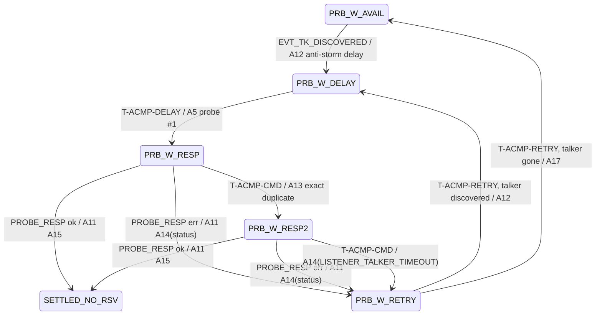

`acmpsta` is captured at A14 and is what GET_STREAM_INFO / GET_RX_STATE report while
probing continues — the error is *visible* but probing never gives up while bound.

### 6.5 Settled sub-machine

<a id="fig-05-settled"></a>**F05.5 — Settlement detail (matrix columns SNR/SOK)**

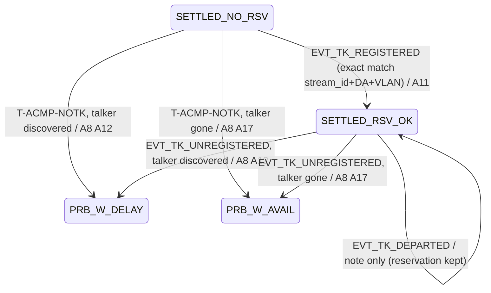

### 6.6 Teardown actions

<a id="fig-05-teardown"></a>**F05.6 — Teardown composition by cause**

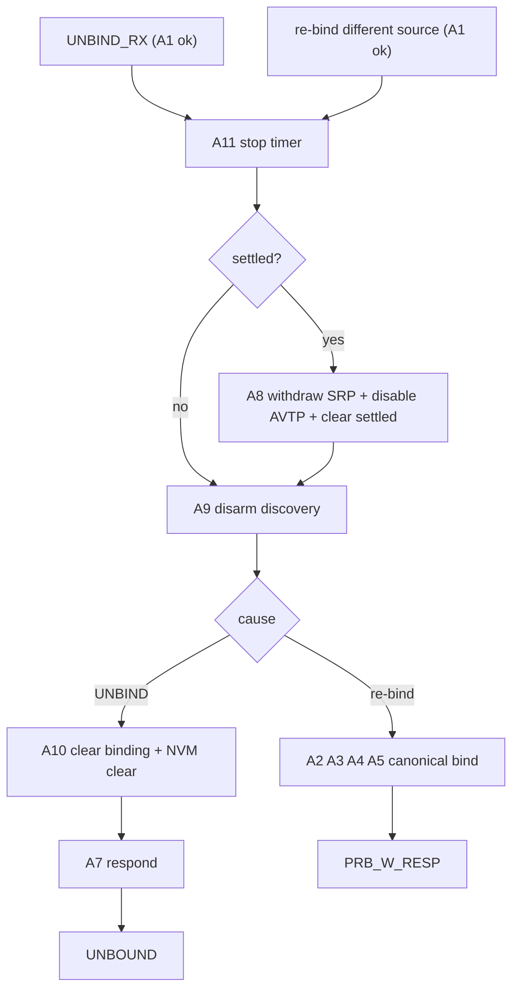

The talker is **never** told about an unbind via ACMP — it observes the withdrawn
Listener attribute through SRP and stops transmitting when no listeners remain
(Milan §5.5.2.5).

### 6.7 GET_RX_STATE response forms

<a id="fig-05-getrxstate"></a>**F05.14 — Always status SUCCESS; content by state**

| State | talker EID / unique_id | connection_count | FAST_CONNECT | STREAMING_WAIT | REGISTERING_FAILED | stream_id / DA / VLAN |
|---|---|---|---|---|---|---|
| UNBOUND | 0 / 0 | 0 | 0 | 0 | 0 | 0 |
| PRB_W_* (probing) | bound values | 1 | 1 | saved SW | 0 | **undefined** (sent 0) |
| SETTLED_NO_RSV | bound values | 1 | 1 | saved SW | 0 | settled SRP params |
| SETTLED_RSV_OK | bound values | 1 | 1 | saved SW | 1 iff registering matching Talker **Failed** | settled SRP params |

## 6bis. Talker side — stateless responder

<a id="fig-05-talker"></a>**F05.11 — PROBE_TX / DISCONNECT_TX / GET_TX_STATE decision tree**

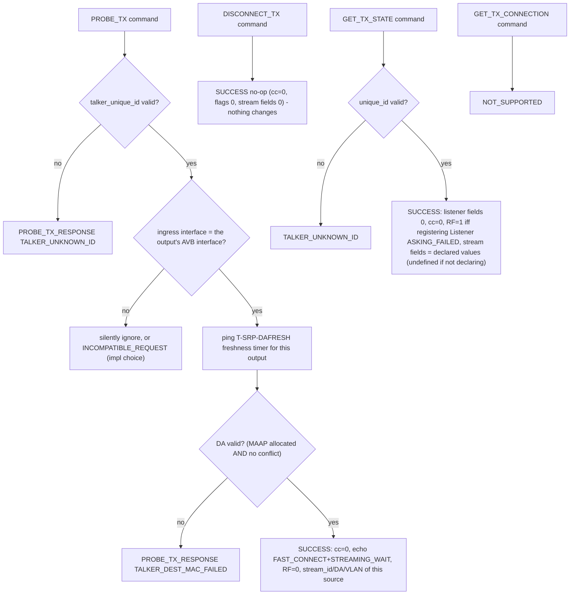

The talker **ignores STREAMING_WAIT and always streams while bandwidth is reserved**
(Δ14). It learns of interested listeners **only** through SRP Listener registrations —
never through ACMP (Milan §5.5.2.7).

<a id="fig-05-dagate"></a>**F05.12 — Per-source DA validity / SRP declaration gate (Milan §4.3.3.1, Table 5.3)**

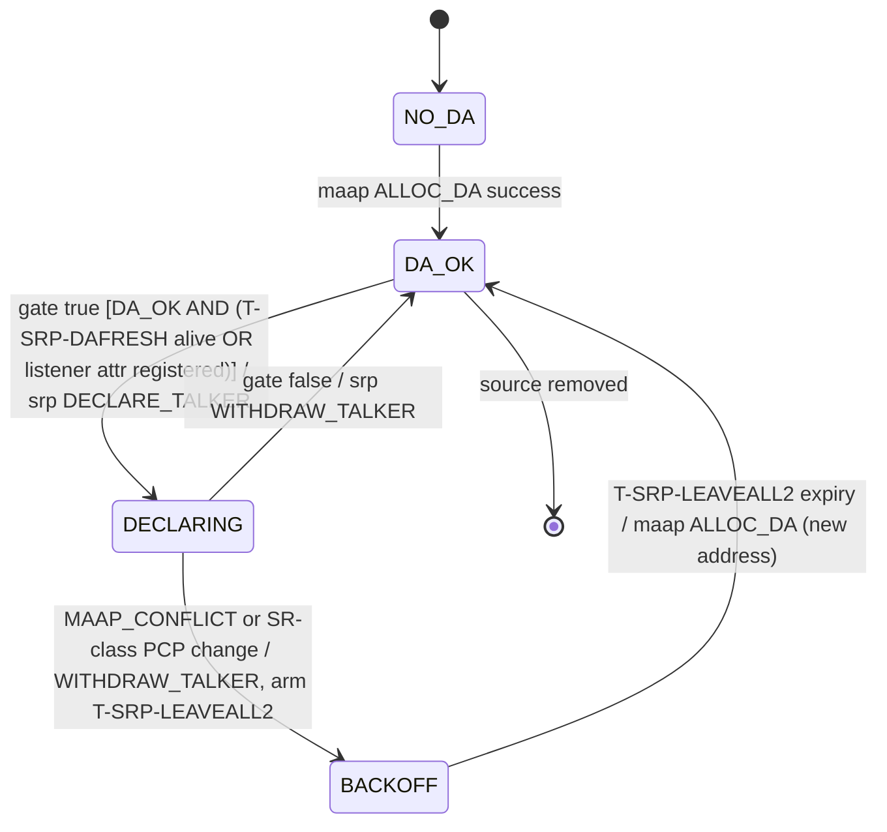

This is Milan's mechanism against advertising unwanted streams: a talker declares only
while someone probed it within `T-SRP-DAFRESH` **or** a listener is registered.

`NO_DA` is also where a source lands when the allocator fails it in either
direction — never accepting the request (`P-MAAP-ACCEPT-CYC`) or accepting it and
never answering (`P-MAAP-RSP-MS`). Both abandons degrade the source exactly as a
refused `ALLOC_DA` does, and a response arriving after an abandon is ignored
([02 §4.2](02_interfaces.md#42-maap-address-allocation)). The alternatives are
both silent: waiting forever on `ready` stalls the one event-serialized walker
that also answers PROBE_TX / DISCONNECT_TX / GET_TX_STATE for every source, and
waiting forever on the response strands the GLOBAL allocation tracker so that no
source anywhere reaches `DA_OK` — while the processor keeps answering every
command normally.

The `source removed` arc is the one that must not degrade the same way. It wipes
the record naming the address, so the `RELEASE_DA` it asks for is the only chance
that address ever gets to come back: it is booked per source and retried until the
face accepts it, ahead of any `ALLOC_DA`, while the withdraw and the timer cancel
land immediately ([02 §4.2](02_interfaces.md#42-maap-address-allocation) for the
IEEE Std 1722-2016 Annex B reading that permits the delay and forbids the loss).

## 7. µcode / dispatch

n/a — transition-ROM + hardwired action primitives (A1–A17). The ROM column is the
Milan/IEEE profile seam ([01 §7](01_overview.md)); the plain-IEEE column (optional,
`P-EN-PLAIN-IEEE-PROFILE`) restores IEEE §8.2.4 listener behavior, IEEE timeouts
([F08.1](08_timing.md#fig-08-constants) profile column) and an optional talker connection table — none of which exist
in Milan builds.

## 8. Canonical sequences

<a id="fig-05-seq-bind"></a>**F05.7 — Bind → probe → settle → SRP → stream**

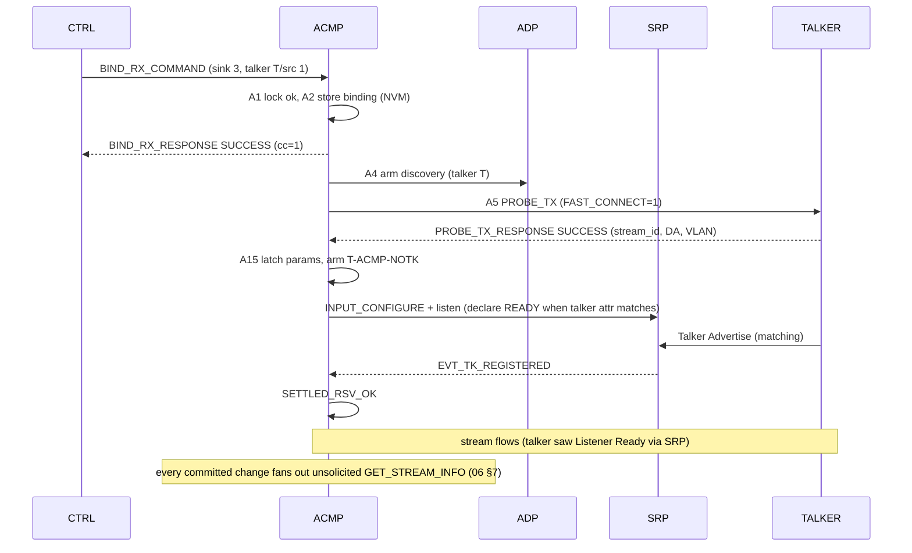

<a id="fig-05-seq-srpfail"></a>**F05.8 — SRP failure surfaces, probing errors back off**

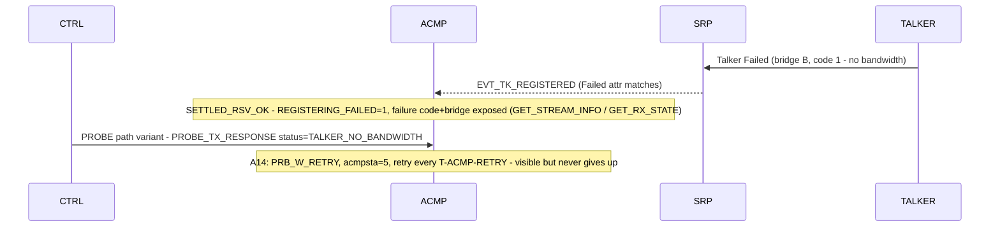

<a id="fig-05-seq-restart"></a>**F05.9 — Talker departure vs talker restart**

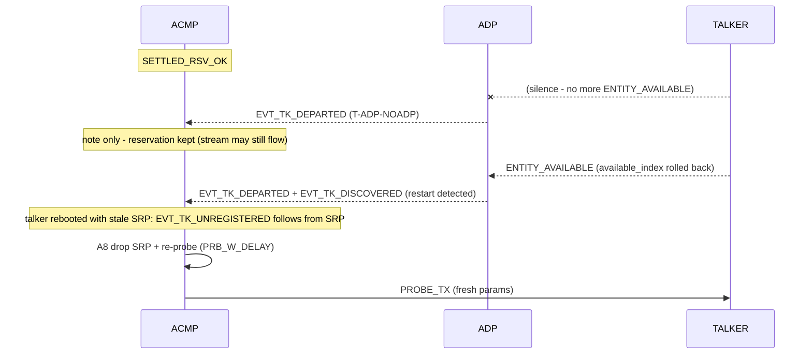

<a id="fig-05-seq-rebind"></a>**F05.10 — Unbind and the v1.2 re-bind short-circuit**

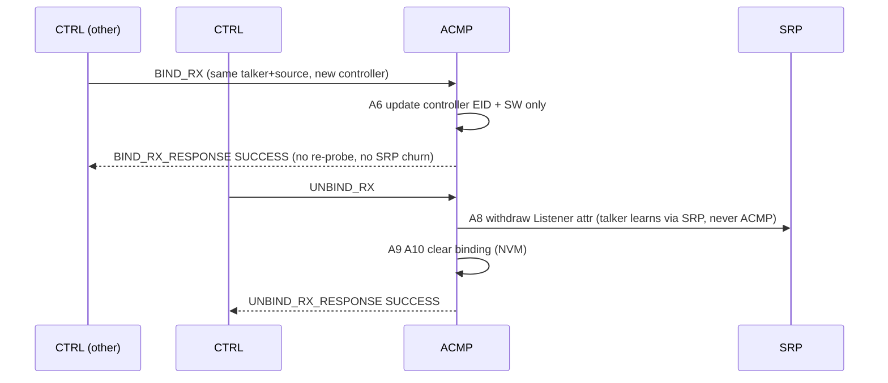

## 9. Timing

Owns `T-ACMP-CMD`, `T-ACMP-DELAY`, `T-ACMP-RETRY`, `T-ACMP-NOTK` (per sink, one SM
timer reused across states) and per-source `T-SRP-DAFRESH`, `T-SRP-LEAVEALL2` — values
in [F08.1](08_timing.md#fig-08-constants). Response budget: `T-BUDGET-ACMP-RESP`
([08 §4](08_timing.md)).

## 10. Milan deltas

Δ1 (renames) · Δ2 (56-B PDU) · Δ3 (uniform ACMP timeout) · Δ4 (stateless talker) ·
Δ14 (STREAMING_WAIT outputs) · Δ15 (listener SM + persistent binding) — master table
[F01.4](01_overview.md#fig-01-deltas).

## 11. Parameterization

`P-N-STREAM-IN` (sink records, discovery SMs), `P-N-STREAM-OUT` (DA gates),
`P-N-AVB-INTERFACES` (responder interface checks), `P-EN-PLAIN-IEEE-PROFILE`
(transition-ROM column).

## 12. Cross-references

Covers REQ-ACMP-001…023. State read by [06 §6.2](06_aecp_engine.md) (GET_STREAM_INFO
lineage F06.13); records in [07 §4](07_memory_maps.md); NVM flows
[07 §5](07_memory_maps.md); matrix walker [09 §3](09_verification.md).
