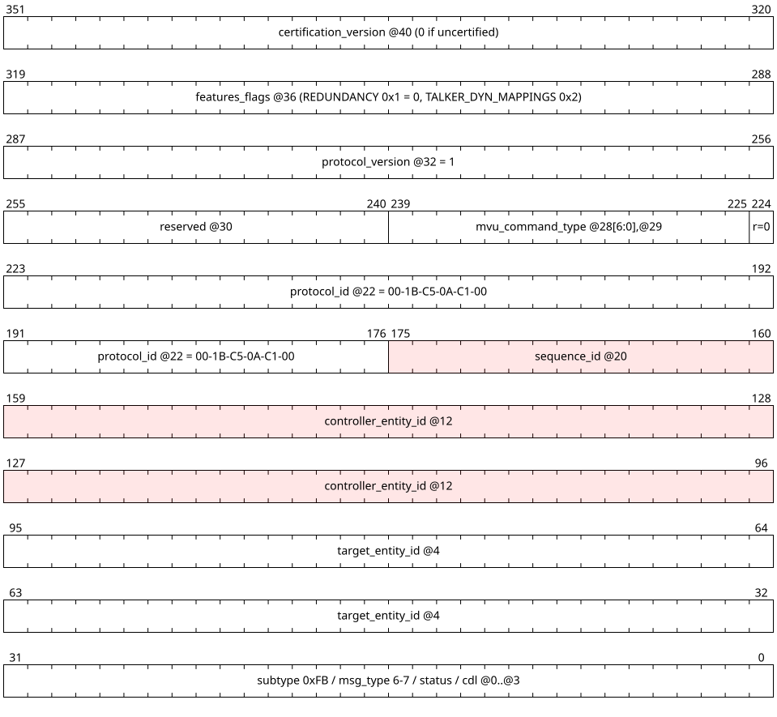
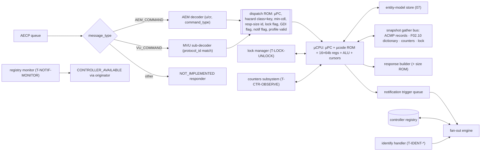
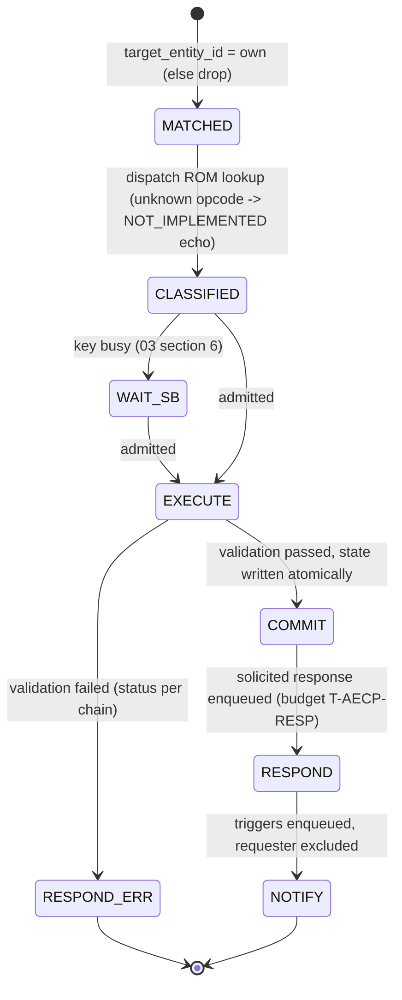
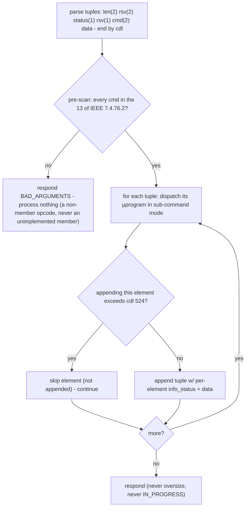
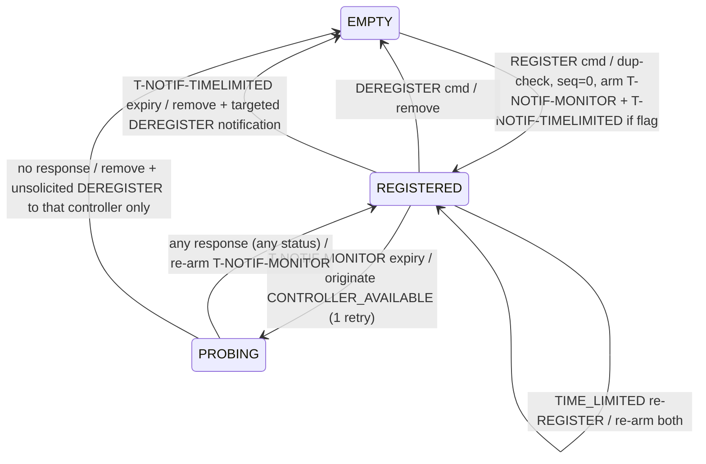
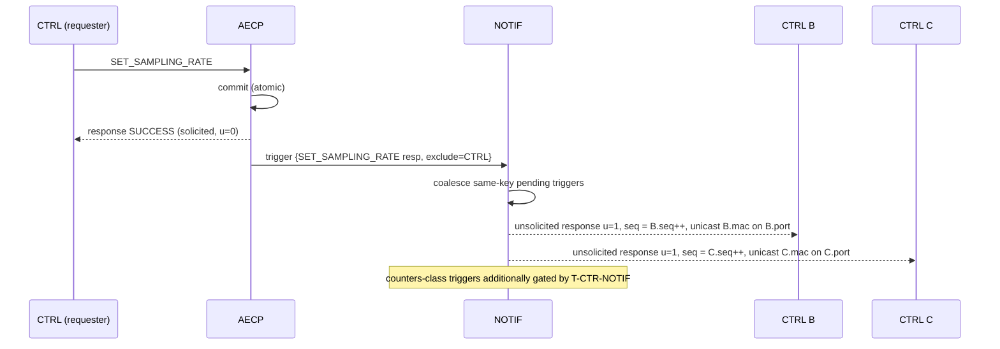
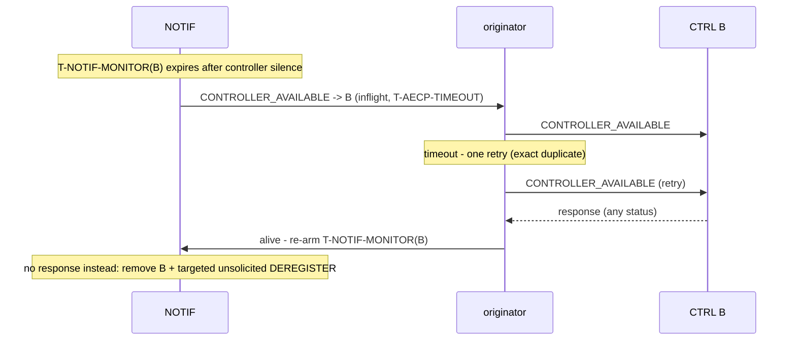
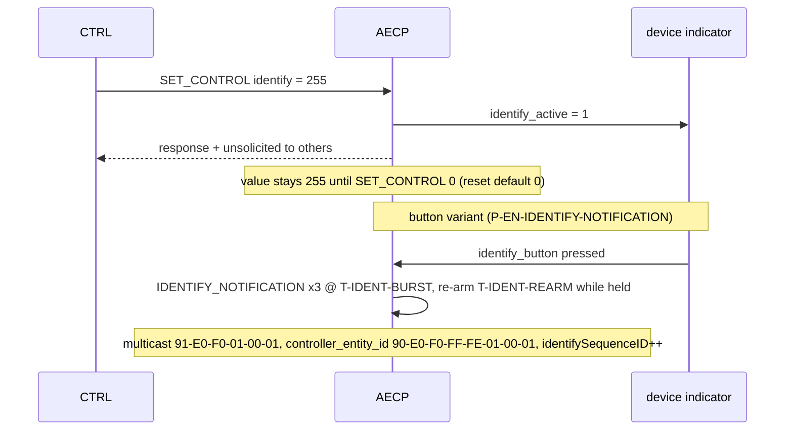

<!-- SPDX-License-Identifier: CERN-OHL-W-2.0 -->
# 06 — AECP Engine (AEM + Milan Vendor Unique)

## 1. Role and scope

Executes every AEM and MVU command, owns the controller registry + unsolicited
notification machinery, the lock manager, the counters service and the identify
handler. This is the microcoded part of the processor: ~24 mandatory commands with
per-command validation chains and variable-size responses justify a µsequencer over
per-command FSMs ([review §4](../00_MILAN_COMPLIANCE_REVIEW.md)).

## 2. External contract

Consumes: AECP queue (AEM_COMMAND, VENDOR_UNIQUE_COMMAND); MGMT-origin transactions
(front-panel-equivalent changes); timer expiries (`T-NOTIF-MONITOR`, `T-LOCK-UNLOCK`,
`T-NOTIF-TIMELIMITED`, `T-CTR-OBSERVE`, `T-IDENT-*`); events routed for notification
triggers; snapshot reads of ACMP sink records ([05 §5](05_acmp_engine.md)) and the
class-D dictionary ([F02.10](02_interfaces.md#fig-02-statusdict)). Produces: solicited
responses; unsolicited responses + CONTROLLER_AVAILABLE + IDENTIFY_NOTIFICATION via
the originator; entity-model overlay writes + NVM marks; `avtp`/`mclk`/`srp` class-B
ops for applied settings.

## 3. PDU handling

<a id="fig-06-aecpdu"></a>**F06.10 — AECPDU + AEM header** (`u` = 1 only on unsolicited
responses; `cr` = 1 implies `u` = 1 — entity-requests-controller, unused here; lanes
bottom→top = wire order, `@n` byte offsets authoritative)


<details>
<summary>WaveDrom source (editable)</summary>

```wavedrom
{"reg": [
  {"bits": 8,  "name": "subtype @0 = 0xFB"},
  {"bits": 1,  "name": "h=0"},
  {"bits": 3,  "name": "ver=0"},
  {"bits": 4,  "name": "message_type @1 (0 AEM_CMD, 1 AEM_RESP, 6 VU_CMD, 7 VU_RESP)"},
  {"bits": 5,  "name": "status @2"},
  {"bits": 11, "name": "control_data_length"},
  {"bits": 64, "name": "target_entity_id @4"},
  {"bits": 64, "name": "controller_entity_id @12"},
  {"bits": 16, "name": "sequence_id @20"},
  {"bits": 1,  "name": "u @22 (0x80)"},
  {"bits": 1,  "name": "cr (0x40)"},
  {"bits": 14, "name": "command_type @22[5:0],@23"}
], "config": {"bits": 192, "lanes": 6, "hspace": 950}}
```

</details>

<a id="fig-06-mvu"></a>**F06.11 — MVU header + GET_MILAN_INFO response** (MVU commands:
0x0000 GET_MILAN_INFO, 0x0001/2 SET/GET_SYSTEM_UNIQUE_ID, 0x0003/4
SET/GET_MEDIA_CLOCK_REFERENCE_INFO; padding never counted in cdl; lanes bottom→top =
wire order, `@n` byte offsets authoritative)



<details>
<summary>WaveDrom source (editable)</summary>

```wavedrom
{"reg": [
  {"bits": 32, "name": "subtype 0xFB / msg_type 6-7 / status / cdl @0..@3"},
  {"bits": 64, "name": "target_entity_id @4"},
  {"bits": 64, "name": "controller_entity_id @12", "type": 2},
  {"bits": 16, "name": "sequence_id @20", "type": 2},
  {"bits": 48, "name": "protocol_id @22 = 00-1B-C5-0A-C1-00"},
  {"bits": 1,  "name": "r=0"},
  {"bits": 15, "name": "mvu_command_type @28[6:0],@29"},
  {"bits": 16, "name": "reserved @30"},
  {"bits": 32, "name": "protocol_version @32 = 1"},
  {"bits": 32, "name": "features_flags @36 (REDUNDANCY 0x1 = 0, TALKER_DYN_MAPPINGS 0x2)"},
  {"bits": 32, "name": "certification_version @40 (0 if uncertified)"}
], "config": {"bits": 352, "lanes": 11, "hspace": 950}}
```

</details>

Oversize rule (Δ8): responses of READ_DESCRIPTOR, GET_AVB_INFO, GET_AS_PATH,
GET_AUDIO_MAP, ADD/REMOVE_AUDIO_MAPPINGS may exceed cdl 524 up to a full frame —
these serialize into the oversize TX slot ([03 §7](03_packet_engine.md)). Everything
else, including GET_DYNAMIC_INFO, is capped at cdl 524.

The exception is response-only. IEEE 1722.1-2021 9.2.2.6 still caps every
command at cdl 524. An ADD/REMOVE_AUDIO_MAPPINGS command uses 20 + 8N octets,
so N is at most 63; a 64-record command returns `BAD_ARGUMENTS` without a
store mutation.

## 4. Internal blocks

<a id="fig-06-blocks"></a>**F06.1 — AECP engine internals**



## 5. Command lifecycle

<a id="fig-06-lifecycle"></a>**F06.2 — Lifecycle with scoreboard**



Policies:

- **Never `IN_PROGRESS`** — every command completes within `T-AECP-RESP`; this
  is mandatory for GET_DYNAMIC_INFO coexistence (IEEE §7.4.76.2) and deletes the
  `T-AECP-INPROG` re-send machinery ([review §8](../00_MILAN_COMPLIANCE_REVIEW.md) item 7).
- Duplicate `sequence_id` from the same controller: commands are idempotently
  re-executed (safe: reads) or answered from the last-response cache for state-changing
  classes — one cached response per controller suffices with single-issue execution.
- Scoreboard classes/keys are assigned by the dispatch ROM; the table lives in
  [03 §6](03_packet_engine.md) (single source).

## 6. Command set

<a id="fig-06-cmdtable"></a>**F06.14 — Command master table** (Milan mandate; hazard
class per [03 §6](03_packet_engine.md); GDI = allowed inside GET_DYNAMIC_INFO;
n/i = not implemented → echo command, status `NOT_IMPLEMENTED` — the response-size
rule that satisfies IEEE §9.3.5.3.3 for **every** opcode 0x0000–0x0068).

This table records both the target contract and current realization. A row
marked **n/i today** is not dispatched by the current engine and returns the
`NOT_IMPLEMENTED` echo. Section 8.1 is the authoritative realized inventory.

| Opcode | Command | Mandate | Scope rule | Class | Lock-prot. | GDI | Oversize | Notif | Resp. size |
|---|---|---|---|---|---|---|---|---|---|
| 0x0000 | ACQUIRE_ENTITY | shall, **never succeeds** (Δ7) | any | — | — | — | — | — | 40 B echo, `NOT_SUPPORTED` |
| 0x0001 | LOCK_ENTITY | shall | ENTITY only (Δ10) | LOCK_OP | n/a | — | — | on lock/unlock/auto | 40 B |
| 0x0002 | ENTITY_AVAILABLE | shall | — | RO | — | — | — | — | 44 B (2021 form w/ flags + acquired/locked IDs) |
| 0x0003 | CONTROLLER_AVAILABLE | responder: n/i (not a controller); **originator**: §7 | — | — | — | — | — | — | 24 B echo |
| 0x0004 | READ_DESCRIPTOR | shall | allowed while locked | RO | no | — | **yes** | — | 28 + descriptor (4-B stub on failure) |
| 0x0006 | SET_CONFIGURATION | shall | STREAM_IS_RUNNING guard §6.4 | CFG_BARRIER *(architectural class; the current single AECP engine serializes AEM commands while the dispatch scoreboard remains unwired)* | yes | - | - | success with state change, requester excluded | 28 B |
| 0x0007 | GET_CONFIGURATION | shall | — | RO | — | yes | — | — | 28 B |
| 0x0008 | SET_STREAM_FORMAT | shall | per stream, both directions; §6.4 chain | STREAM_CFG | yes | - | - | success with state change, requester excluded | 36 B |
| 0x0009 | GET_STREAM_FORMAT | shall | - | RO | - | yes | - | - | 36 B |
| 0x000E | SET_STREAM_INFO | shall | **output only** (Δ11); §6.3 | STREAM_CFG | yes | - | - | success with state change, requester excluded | 108 B echo |
| 0x000F | GET_STREAM_INFO | shall | Milan 80-B form §6.2 | RO | — | yes | — | async triggers | 80 B |
| 0x0010 | SET_NAME | shall | every named descriptor; ENTITY indices 0 and 1, all others index 0 | NAME_WR | yes | - | - | naming trigger | cdl 84, current 64-B name |
| 0x0011 | GET_NAME | shall | every named descriptor; ENTITY indices 0 and 1, all others index 0 | RO | no | yes | - | - | cdl 84, current 64-B name |
| 0x0014 | SET_SAMPLING_RATE | shall | per AUDIO_UNIT; §6.4 | CLOCK_CFG | yes | — | — | yes | 36 B |
| 0x0015 | GET_SAMPLING_RATE | shall | — | RO | — | yes | — | — | 36 B |
| 0x0016 | SET_CLOCK_SOURCE | shall | per CLOCK_DOMAIN | CLOCK_CFG | yes | — | — | yes | 36 B |
| 0x0017 | GET_CLOCK_SOURCE | shall | — | RO | — | yes | — | — | 36 B |
| 0x0018 | SET_CONTROL | shall (identify) | value 0/255 | IDENTIFY | yes | — | — | yes | 28 + values |
| 0x0019 | GET_CONTROL | shall (identify) | — | RO | — | **no** (variable) | — | — | 28 + values |
| 0x0022 | START_STREAMING | shall | **input only** (Δ11); every other type `NOT_SUPPORTED` | STREAM_CFG | yes | — | — | yes (Table 5.22 started/stopped) | 28 B (`{type, index}`, cdl 16 on every arm) |
| 0x0023 | STOP_STREAMING | shall | **input only** (Δ11); every other type `NOT_SUPPORTED` | STREAM_CFG | yes | — | — | yes (Table 5.22 started/stopped) | 28 B (`{type, index}`, cdl 16 on every arm) |
| 0x0024 | REGISTER_UNSOLICITED_NOTIFICATION | shall | §7; accepts 2013 no-flags form | REGISTRY_OP | no | — | — | — | 28 B (w/ flags) |
| 0x0025 | DEREGISTER_UNSOLICITED_NOTIFICATION | shall | §7 | REGISTRY_OP | no | — | — | auto-deregister → targeted | 24 B |
| 0x0026 | IDENTIFY_NOTIFICATION | unsolicited-only | as command → `BAD_ARGUMENTS` (IEEE §7.4.39.2, the opcode-specific rule — it governs over §9.3.5.3.3's fallback) | — | — | — | — | is one | 28 B |
| 0x0027 | GET_AVB_INFO | shall | gather §6.2 | RO | — | **no** | **yes** | async triggers | 44 + msrp mappings |
| 0x0028 | GET_AS_PATH | shall | gather §6.2 | RO | — | **no** | **yes** | async trigger | 28 + 8·count |
| 0x0029 | GET_COUNTERS | shall | §6.6 | RO | — | yes | — | async (`T-CTR-NOTIF`) | 160 B |
| 0x002B | GET_AUDIO_MAP | shall (dynamic ports) | §6.5 | RO | — | **no** | **yes** | — | 32 + 8·N |
| 0x002C | ADD_AUDIO_MAPPINGS | shall (dynamic ports) | §6.5 | MAP_CFG | yes | - | **yes** | success with state change, requester excluded | mirrors request |
| 0x002D | REMOVE_AUDIO_MAPPINGS | shall (dynamic ports) | §6.5 | MAP_CFG | yes | - | **yes** | success with state change, requester excluded | mirrors request |
| 0x004B | GET_DYNAMIC_INFO | shall | two-pass iterator §6.7 | RO per record | - | exactly the 13 fixed getters | - | - | cdl at most 524 |
| MVU 0x0000 | GET_MILAN_INFO | shall | §6.9 | RO | — | — | — | — | 44 B |
| MVU 0x0001/0x0002 | SET/GET_SYSTEM_UNIQUE_ID | recommended, **n/i today** (`P-EN-MVU-SUID`) | target: §6.9 | n/i | - | - | - | - | echo, `NOT_IMPLEMENTED` |
| MVU 0x0003/0x0004 | SET/GET_MEDIA_CLOCK_REFERENCE_INFO | recommended, **n/i today** (`P-EN-MVU-MCR`) | target: §6.9 | n/i | - | - | - | - | echo, `NOT_IMPLEMENTED` |
| 0x000B | GET_VIDEO_FORMAT | n/i | — | RO | — | **yes** | — | — | echo, `NOT_IMPLEMENTED` standalone; per-element `NOT_SUPPORTED` inside GDI |
| 0x000D | GET_SENSOR_FORMAT | n/i | — | RO | — | **yes** | — | — | echo, `NOT_IMPLEMENTED` standalone; per-element `NOT_SUPPORTED` inside GDI |
| 0x0013 | GET_ASSOCIATION_ID | n/i | — | RO | — | **yes** | — | — | echo, `NOT_IMPLEMENTED` standalone; per-element `NOT_SUPPORTED` inside GDI |
| 0x001D | GET_SIGNAL_SELECTOR | n/i | — | RO | — | **yes** | — | — | echo, `NOT_IMPLEMENTED` standalone; per-element `NOT_SUPPORTED` inside GDI |
| 0x0048 | GET_MEMORY_OBJECT_LENGTH | n/i | — | RO | — | **yes** | — | — | echo, `NOT_IMPLEMENTED` standalone; per-element `NOT_SUPPORTED` inside GDI |
| 0x004A | GET_STREAM_BACKUP | n/i | — | RO | — | **yes** | — | — | echo, `NOT_IMPLEMENTED` standalone; per-element `NOT_SUPPORTED` inside GDI |
| all others 0x0005–0x0068, 0x3FFF | — | n/i | — | — | — | — | — | — | echo, `NOT_IMPLEMENTED` (GDI flag **clear**: any of these inside a batch ⇒ `BAD_ARGUMENTS`, §7.4.76.2) |

### 6.1 READ_DESCRIPTOR

Command: `configuration_index @24`, `descriptor_type @28`, `descriptor_index @30`.
Assembly from image + overlay by the model store ([07 §3](07_memory_maps.md)) — the
µprogram resolves the address via `DESC_ADDR`, streams via `COPY_BUFFER`. Failure →
status (`NO_SUCH_DESCRIPTOR` / `BAD_ARGUMENTS` for a bad config index) with the 4-byte
{type, index} stub (IEEE §7.4.5). Permitted while locked or acquired.

### 6.2 GET_STREAM_INFO — the Milan 80-byte response and its data lineage

**Realization status (2026-08-15, `E_GSTRI` + the `gsi_*` face)** — LANDED for
STREAM_INPUT and STREAM_OUTPUT: the Milan §5.4.2.10 80-byte response (cdl 68) with
flags_ex and the pbsta/acmpsta byte. Existence is the descriptor store's (a locate
miss answers NO_SUCH_DESCRIPTOR carrying the full, zero-flagged body); every VALUE
and VALIDITY FLAG rides the shared Milan-info gather face (`gsi_kind` 0, word
selectors 0..7 = flags / stream_format / stream_id / msrp_accumulated_latency /
{dest_mac, failure_code} / failure_bridge_id / {vlan, flags_ex} / {pbsta, acmpsta}),
because the truth lives in the integrator's binding view, SRP registrars, format
registers and probing state — an unwired face answers all-zero flags: every field
honestly absent. Selector 15 of the same kind is SET_STREAM_FORMAT's verdict word:
while that command is in flight the engine presents the PROPOSED format on
`gsi_prop_fmt`, and the integrator answers bit 0 = supported for the addressed
stream, bit 1 = every channel an existing audio mapping references survives it.
The integrator is also expected to FOLD the published settings face into its
selector 1 answers for both directions (a valid SEL_FMTIN/SEL_FMTOUT row is the
current format) and its selector 3 answer for the OUTPUT direction only (a valid
SEL_PTOFF row is the accumulated latency; an input's latency stays the SRP
registrars' fact and never folds), which is what keeps a GET after a SET reading
the value the SET stored. The verdict answer is read with CHECK_ARG at byte
width against the literal 3: the LOW BYTE must be exactly 0x03 to pass, so an
integrator must answer the two defined bits ALONE -- any other bit set in the
low byte refuses the command. The published rows -- every presentation offset
and both format directions, each value beside its valid bit -- are the
`aecp_pt_offset` / `aecp_fmt_in` / `aecp_fmt_out` port groups on
`protocol_processor_top`; `KL_aecp_dyn_state`'s banner is their authority. Non-stream targets refuse NOT_SUPPORTED with the command echoed;
short commands BAD_ARGUMENTS; a wedged face voids to ENTITY_MISBEHAVING. The Table
5.22 notification class is live for the events the fabric observes: sink bound /
settled / torn-down and registered-Talker-attribute changes, source declaration
open/close and registered-Listener changes. Started/stopped IS observed since
issue #78: `KL_pp_acmp_listener` raises `act_strt_chg_o` on a committed change
under a live binding, and `protocol_processor_top` ORs it into the per-sink
STREAM_INPUT event level. It is deliberately narrow — a repeat that changes
nothing pushes none, and a walk that re-binds pushes from its own discovery
term instead, so one event never yields two frames.

<a id="fig-06-streaminfo"></a>**F06.12 — Response payload @24..@79** (Milan Fig 5.1,
renames Δ6; legacy controllers ignore @72+, Milan controllers detect the extension via
`control_data_length`; lanes bottom→top = wire order, `@n` byte offsets authoritative)


<details>
<summary>WaveDrom source (editable)</summary>

```wavedrom
{"reg": [
  {"bits": 16, "name": "descriptor_type @24"},
  {"bits": 16, "name": "descriptor_index @26"},
  {"bits": 32, "name": "flags @28 (masks below)"},
  {"bits": 64, "name": "stream_format @32"},
  {"bits": 64, "name": "stream_id @40"},
  {"bits": 32, "name": "msrp_accumulated_latency @48"},
  {"bits": 48, "name": "stream_dest_mac @52"},
  {"bits": 8,  "name": "msrp_failure_code @58"},
  {"bits": 8,  "name": "reserved @59"},
  {"bits": 64, "name": "msrp_failure_bridge_id @60"},
  {"bits": 16, "name": "stream_vlan_id @68"},
  {"bits": 16, "name": "reserved @70"},
  {"bits": 32, "name": "flags_ex @72 (REGISTERING 0x00000001)"},
  {"bits": 3,  "name": "pbsta @76[7:5]"},
  {"bits": 5,  "name": "acmpsta @76[4:0]"},
  {"bits": 24, "name": "reserved @77"}
], "config": {"bits": 448, "lanes": 14, "hspace": 950}}
```

</details>

> ⚠ Bit tables in Milan and IEEE 1722.1 are **MSB-first** (bit 31 ⇔ mask `0x00000001`).
> The **hex mask column is authoritative**; never derive shifts from bit-number columns.

`flags` masks and validity — **Stream Input**: STREAM_FORMAT_VALID `0x80000000`
always · STREAM_ID_VALID `0x40000000`, STREAM_DEST_MAC_VALID `0x10000000`,
STREAM_VLAN_ID_VALID `0x02000000` **iff settled** · MSRP_ACC_LAT_VALID `0x20000000`
iff registering a matching talker attribute (= `flags_ex.REGISTERING`) ·
MSRP_FAILURE_VALID `0x08000000` = REGISTERING_FAILED `0x00000040` (registering
matching Talker **Failed**) · BOUND `0x04000000` · FAST_CONNECT `0x00000002` **= 1 iff
bound** (Milan-required legacy signal) · SAVED_STATE `0x00000004` recommended = bound ·
STREAMING_WAIT `0x00000008` = bound ∧ stopped. **Stream Output**: FAST_CONNECT /
SAVED_STATE / STREAMING_WAIT / BOUND always 0 · MSRP_ACC_LAT_VALID always 1
(field = presentation-time offset) · REGISTERING_FAILED = declaring ∧ registering
Listener **Asking Failed** · {REGISTERING=1 ∧ REGISTERING_FAILED=0 ∧
MSRP_FAILURE_VALID=0} ⇔ **streaming**.

<a id="fig-06-lineage"></a>**F06.13 — Field lineage (input rows; output analogous)**

| Field / flag | Owner record | Signal ([F02.10](02_interfaces.md#fig-02-statusdict)) | Update event | Async notif (Table 5.22) |
|---|---|---|---|---|
| stream_format | integrator face word 1, folding the published SET_STREAM_FORMAT row when valid | - | SET_STREAM_FORMAT | via command trigger |
| BOUND, pbsta, acmpsta, STREAMING_WAIT | ACMP sink record | — | listener-SM commits | yes (input) |
| stream_id / DA / VLAN + *_VALID | sink record (settled) | — | A15 / A8 | yes |
| msrp_accumulated_latency | srp | `acc_latency[sink]` + `P-INTERNAL-INGRESS-DELAY-NS` | talker-attr change | yes (input) |
| REGISTERING (flags_ex), REGISTERING_FAILED | srp | `tk_reg_state[sink]` | TK_ATTR events | yes |
| msrp_failure_code / bridge | srp | `msrp_fail_*` | TK_ATTR(Failed) | yes |

Atomicity: the µprogram issues one `GATHER_EXT` that snapshots sink record + dictionary
under the sink's STREAM_CFG key (scoreboard blocks writers during the latch) — a
response is never a torn mix of two states.

#### 6.2.1 GET_NAME and SET_NAME

Both responses carry the fixed IEEE Figures 7-39 and 7-40 body:
`descriptor_type`, `descriptor_index`, `name_index`, `configuration_index`, then
exactly 64 name octets. `GET_NAME` has an 8-byte command body and `SET_NAME` has a
72-byte command body. Both responses therefore use control_data_length 84.

The descriptor store translates the semantic selector through region `0xB`.
ENTITY exposes `entity_name` at index 0 and `group_name` at index 1. Every other
named descriptor exposes `object_name` at index 0. A missing descriptor returns
`NO_SUCH_DESCRIPTOR`; an unsupported semantic index or configuration returns
`BAD_ARGUMENTS` with the complete fixed response body.

`SET_NAME` checks the entity lock before changing any byte. A rejected locked
write returns `ENTITY_LOCKED` and the current name, not the rejected command
name. A successful change writes all eight 64-bit lanes, returns the new current
name, and emits the naming persistence and notification triggers. Repeating the
same value performs no write and emits no trigger. The persistence consumer is
tracked separately; the trigger alone does not make the update survive power loss.

The writable name table is also patched into the currently located descriptor
line. A later locate refreshes its line from the table after the image fetch.
Consequently `SET_NAME`, `GET_NAME`, and `READ_DESCRIPTOR` expose one value.

### 6.3 Direction asymmetries (Δ11)

| Command | Stream Input | Stream Output |
|---|---|---|
| SET_STREAM_INFO (**implemented**, Milan §5.4.2.9) | `NOT_SUPPORTED` whole, at the response's own length (params come from PROBE_TX_RESPONSE) | the shape is 1722.1-2021 Figure 7-40's COMPLETE 84-byte payload (cdl 96, the ip block included) - Milan v1.2 references the 2021 edition, so the 2013 60-byte command is a TRUNCATED command, refused `BAD_ARGUMENTS` at the full 2021 response length. The one supported sub-command is **MSRP_ACC_LAT_VALID alone**: writes the presentation-time offset to the dynamic store's SEL_PTOFF row (0..0x7FFFFFFF ns; bit 31 set answers `BAD_ARGUMENTS`); **any other flag combination, including none, refuses the whole command `NOT_SUPPORTED`**; a STREAMING output refuses `STREAM_IS_RUNNING` before the sub-command is examined; success answers the command echo, which is exactly §5.4.2.9's required body (same flag, same latency; the ip fields are echoed, never interpreted). Every narrowing is an engine dispatch route off registered walk fields; the µprogram is CHECK_LOCK, locate, WRITE_ST, NVM mark, echo |
| START/STOP_STREAMING | **implemented** (issues #78 and #97): a bound input changes state, while an unbound or repeated-state request is a confirmed no-op. The state lives only on the ACMP binding record. Success waits for the record write or no-op examination, and a bounded pending request fails safely if the record walker cannot start it | **implemented**: `NOT_SUPPORTED`, because a talker streams whenever reserved (Δ14) and Section 5.3.7.3 excludes stopping a Stream Output. Every non-input type takes the same arm |

### 6.4 Validation chains (order matters; first failure responds)

| Command | Chain |
|---|---|
| SET_CONFIGURATION | any input bound ∨ any output streaming ⇒ `STREAM_IS_RUNNING` (**at dispatch, so it outranks the lock** - see below) → lock → index valid ⇒ commit → NVM mark (review §8 item 1). **No scoreboard barrier is drained today**: the current top admits a new AEM transaction only when its single AECP engine is idle, which orders SET_CONFIGURATION against both configuration read views. A future parallel AEM execution path must select `PP_HZ_CFG_BARRIER` before it can preserve that property. |
| SET_STREAM_FORMAT (**implemented**, Milan §5.4.2.7) | length (cdl 24 and the walked payload) → type ∈ {STREAM_INPUT, STREAM_OUTPUT} → **per-descriptor running at dispatch** (bound input ∨ streaming output ⇒ `STREAM_IS_RUNNING`, outranking the lock like SET_CONFIGURATION's reduction and for the same reason) → lock → locate → the integrator's ONE-GATHER verdict on the proposed format (kind 0 selector 15 against `gsi_prop_fmt`): supported-for-this-stream AND every mapping-referenced channel survives, anything less ⇒ `BAD_ARGUMENTS` → WRITE_ST to SEL_FMTIN/SEL_FMTOUT + NVM mark → echo the format now in force. Every refusal after the length gate carries the CURRENT format read through GET_STREAM_FORMAT's own face word, so the two can never disagree. The supported set and the mapping reduction live integrator-side (the builder's always-live shapes; the map machinery that already validates every edit), not in a µcode walk over the image |
| SET_SAMPLING_RATE | lock → locate (no such AUDIO_UNIT ⇒ `NO_SUCH_DESCRIPTOR`) → rate ∈ AUDIO_UNIT list (`E_SSRATE` + `E_SSRWALK`; issue #51): the rate is compared, as the whole 32-bit word including the pull field, with entries 0..`sampling_rates_count`-1 of the located descriptor's list, read at `sampling_rates_offset` 144. **Precondition, part of the image contract** ([07 §3.1 L10](07_memory_maps.md#31-descriptor-tree)): offset 144 and at most 8 entries. A state-port address is an immediate, so any other offset refuses every rate and an entry past the eighth is never accepted; both fail closed. A rate the list does not hold ⇒ `BAD_ARGUMENTS` carrying the CURRENT rate (the value GET_SAMPLING_RATE reads), with nothing stored, marked or notified. `BAD_ARGUMENTS` rather than `NOT_SUPPORTED` because Table 7-141 keeps `NOT_SUPPORTED` for a target that is not supported (an AUDIO_UNIT that exists is supported; its argument is not), and review §8 item 3 reads Milan's "UNSUPPORTED" as `NOT_SUPPORTED` for the mapping clause below only → mappings whose stream rate ≠ new rate while port has neither SRC bit ⇒ may `NOT_SUPPORTED` (Milan §5.4.2.13 — "UNSUPPORTED" typo, review §8 item 3; this MAY is not implemented) → commit + NVM |
| SET_CLOCK_SOURCE | lock → locate (no such CLOCK_DOMAIN ⇒ `NO_SUCH_DESCRIPTOR`) → source ∈ CLOCK_DOMAIN list, tested as `clock_source_index` < the located domain's `clock_sources_count` (`E_SCLKS`; milan-fpga #389). **Precondition, part of the image contract**: the processor requires the domain's `clock_sources` list to be the identity permutation 0..count-1 ([07 §3.1 L6](07_memory_maps.md#31-descriptor-tree)); that is what makes the bound equal the membership test of IEEE §7.4.23.1. A sparse or permuted list would have unlisted indices accepted and listed ones refused. An index at or past the count ⇒ `BAD_ARGUMENTS` carrying the CURRENT index (the value GET_CLOCK_SOURCE reads), with nothing stored, marked or notified → `mclk.SET_CLOCK_SOURCE` → commit + NVM |
| SET_NAME | configuration valid, descriptor exists, semantic name index valid, lock, compare all 64 bytes, then commit and emit persistence plus notification triggers only when changed |

**Two notes on SET_CONFIGURATION, both decisions rather than accidents.**

*Precedence.* The `STREAM_IS_RUNNING` reduction is taken at **dispatch**, before
`E_SCFG` runs, so a foreign controller addressing a locked entity that also has
a running stream is answered `STREAM_IS_RUNNING` and never reaches the
program's `CHECK_LOCK`. Milan §5.4.2.5 and IEEE §7.4.7.2 each state their
refusal without ordering it against the other, so either answer conforms. The
order is pinned by a check (`tb/pp_top`, W17n) so it cannot drift silently.

*One current-configuration source.* The command **stores** the index, and both
`GET_CONFIGURATION` (§7.4.8) and `READ_DESCRIPTOR(ENTITY)` overlay that dynamic
value. This preserves §7.4.8.2 equivalence on multi-configuration images as well
as on the shipping one-configuration image. The descriptor image remains
read-only: `E_RDESCENT` copies the first 310 ENTITY bytes unchanged and appends
the dynamic `current_configuration` word. Before the first successful SET, the
word comes from the image. The W18 regression grades both a successful non-zero
SET and a rejected SET, including the GET and READ_DESCRIPTOR views.

### 6.5 Audio-map operations (Milan §5.4.2.26–.28)

**Realization status (2026-08-17).** GET_AUDIO_MAP serves both directions:
the STREAM_PORT_OUTPUT half re-dispatches to `E_GAMAPO` (a two-word stub swapping
the emitted type constant into `E_GAMAP`'s shared tail), and the integrator's
`amap_*` face routes on `amap_desc_type_o`. The render-side map RAM answers the
input direction, the capture-side readback (the 0x0017 round) the output
direction. Same paging law, same stubs, same existence authority (the image).
ADD/REMOVE_AUDIO_MAPPINGS stage every row, validate the whole command, recheck
at commit, and use the root transaction face to update the live map atomically.

- **A Stream Port Output that HAS AUDIO_MAP descriptor(s)** (`number_of_maps`
  > 0 in its STREAM_PORT_OUTPUT descriptor — a static map) **answers all three
  commands with `NOT_SUPPORTED`** (Milan §5.4.2.26/.27/.28). Every Stream Port
  Input, and every Stream Port Output with no Audio Map, shall implement all
  three — Milan §5.3.3.7 forbids AUDIO_MAPs on STREAM_PORT_INPUT precisely
  because inputs must support dynamic mapping, and IEEE §7.2.13's dynamic-map
  convention is `number_of_maps` = 0. The root integrator owns this decision at
  transaction phase 0. Its generated dynamic-port masks come from the same
  entity shape that emits each descriptor's `number_of_maps`, so the processor
  cannot accept an edit for a port that the model advertises as static. The
  processor's descriptor store is not the authority for this integration rule.
- Channel space of each **dynamically mapped** stream port is **partitioned at model-build time** into fixed
  subsets ≤ `P-MAP-SUBSET-CH-MAX`; `number_of_maps` always reports the partition
  count N regardless of dynamic content; `GET_AUDIO_MAP(map_index = P)` returns all and
  only the dynamic mappings of subset P.
- `ADD_AUDIO_MAPPINGS`: **all-or-nothing**. Any invalid mapping returns
  `BAD_ARGUMENTS` and adds nothing (`MAP_VALID` primitive). Invalid means it references a channel absent from
  the current format; or references a streaming output under the reference
  integrator's phase-4 validation law; input-port conflict rule: same cluster channel from two different
  stream channels in one command ⇒ `BAD_ARGUMENTS`; conflict with an *existing* mapping
  may be rejected the same way or accepted with an automatic REMOVE notification sent
  **before** the ADD response.
- `REMOVE_AUDIO_MAPPINGS`: ignores duplicate rows in one command, refuses an
  absent mapping, and applies the streaming-output restriction above.
- Input maps are changeable **any time, even while bound** (Milan §5.3.10.1).
- Every successful ADD or REMOVE that changes the mapping sends the same
  unsolicited response to every registered controller except the requester and
  marks the mapping persistence class dirty. A confirmed no-op succeeds without
  a notification or dirty mark. The current NVM backend does not retain the
  dirty class across reset; issue #70 tracks that remaining work.
- Phase 1 acceptance is the commit reservation and point of no return. The
  integrator must reserve every resource needed for the complete transaction
  before accepting it. Phase 5 record writes and phase 2 finish then complete
  without back-pressure; `amap_edit_wait_i` is ignored on those phases. This
  prevents a watchdog expiry between live writes from exposing a partial map.
- Every solicited response is rebuilt in Figure 7-71 form. Its reserved word is
  zero, its `number_of_mappings` names the complete records actually emitted,
  and even an `ENTITY_MISBEHAVING` timeout retains at least the eight-byte fixed
  body. A malformed command count is never reflected as though it described
  records that are absent from the response.

### 6.6 GET_COUNTERS and the counters subsystem

**Strictness upgrade (2026-08-15, the bench probe round)** — the SUCCESS-empty-mask
answer is now said only about a REAL object of a SUPPORTED type: `E_GCTRS` opens
with the store locate (the same RGN_LOCATE `E_GAMAP` opens with), so a
descriptor_index the image lacks refuses Table 7-141's NO_SUCH_DESCRIPTOR ("A
descriptor with the descriptor_type and descriptor_index specified does not exist")
carrying the fixed Figure 7-67 body all-zero, with the counters face never
consulted; and a descriptor_type outside the supported set {STREAM_INPUT,
STREAM_OUTPUT, AVB_INTERFACE, CLOCK_DOMAIN} refuses NOT_SUPPORTED ("the command is implemented
but the target of the command is not supported"), off the registered A_PLD-exit
re-dispatch. ENTITY (Table 7-150: nothing but ENTITY_SPECIFIC bits) lands on
that arm. The integrator's wrong-object guard on the face stays as the second line of
defense. §7.4.42 defines no separate error form, so every status carries the
fixed 160-byte response — **including NOT_SUPPORTED** (the r49a bench round): the
reference stack reflects ONLY NOT_IMPLEMENTED at command length ("If status is
NotImplemented, we expect a reflected message (using Command length)" —
la_avdecc protocolAemPayloads.cpp checkResponsePayload) and sizes every other
non-success answer against the response form, so the earlier command-sized
NOT_SUPPORTED echo here was exactly its "Incorrect payload size" complaint.
`E_GCTRSNS` sets the status and falls into the miss arm's zero-body emitter.
The NOT_IMPLEMENTED echo stays command-sized, as both texts want.

**Heal before answer (same round, silicon r49a/w3a).** The store used to answer
an invalid-image locate from the parked state and re-arm its header probe after,
so the first wire command after a late image load was always sacrificed (a first
READ_DESCRIPTOR answering BAD_ARGUMENTS through the parked configurations_count,
a first GET_COUNTERS answering NO_SUCH_DESCRIPTOR through the parked locate).
The order is now walk-then-answer for both entries — the locate AND the
RGN_NCFG pseudo-register read — with the µCPU stalled through the bounded walk;
an absent bridge still degrades to the fault answer inside the memory watchdog.
See KL_aecp_desc_store's banner.

Response: `descriptor_type @24`, `descriptor_index @26`, `counters_valid @28`,
32 × u32 block @32 (cdl 148). `counters_valid` bit N (MSB-first) ⇔ block offset 4·N.
Counters are 32-bit wrapping; interval-latched events sample at `T-CTR-OBSERVE`; adapters accumulate ticks so nothing is lost between observations.

<a id="fig-06-counters"></a>**F06.15 — Mandatory counter banks**

> ⚠ Masks authoritative (MSB-first tables). **Δ9**: the STREAM_OUTPUT masks below are
> Milan Table 5.17 and *differ from IEEE Tables 7-158/159* — the plain-IEEE profile
> swaps this one bank's mask ROM.

| Bank | Counter | Mask | Semantics / reset rule |
|---|---|---|---|
| AVB_INTERFACE | LINK_UP | 0x00000001 | link down→up; invariant UP = DOWN or DOWN+1 |
| | LINK_DOWN | 0x00000002 | |
| | GPTP_GM_CHANGED | 0x00000020 | GM changes since boot |
| | FRAMES_TX / FRAMES_RX / RX_CRC_ERROR | 0x04/0x08/0x10 | optional |
| CLOCK_DOMAIN | LOCKED / UNLOCKED | 0x01 / 0x02 | invariant LOCKED = UNLOCKED or +1 |
| STREAM_INPUT | MEDIA_LOCKED / MEDIA_UNLOCKED | 0x01 / 0x02 | invariant; **whole bank resets on not-bound→bound**, never on unbind |
| | STREAM_INTERRUPTED | 0x04 | any interruption except a controller unbind |
| | SEQ_NUM_MISMATCH / MEDIA_RESET / TIMESTAMP_UNCERTAIN | 0x08 / 0x10 / 0x20 | per observation interval |
| | UNSUPPORTED_FORMAT / LATE_TIMESTAMP / EARLY_TIMESTAMP / FRAMES_RX | 0x100 / 0x200 / 0x400 / 0x800 | per observation interval |
| STREAM_OUTPUT | STREAM_START / STREAM_STOP | 0x01 / 0x02 | invariant START = STOP or +1 |
| | MEDIA_RESET | **0x04** (Δ9) | resets on stream start |
| | TIMESTAMP_UNCERTAIN | **0x08** (Δ9) | resets on stream start |
| | FRAMES_TX | **0x10** (Δ9) | resets on stream start |

The integrator exposes per-descriptor counter-update pulses. Connecting those
pulses to the rate-limited `T-CTR-NOTIF` scheduler is tracked separately.

**Who decides the mask.** The masks above are what a *complete* PAAD-AE owes;
what a given build may claim is what its fabric measures, and the engine carries
whatever `counters_valid` the integrator's `ctr_*` face returns rather than a
constant of its own. The bar that matters for the Milan badge is
Milan v1.2 §5.3.8.10 with Table 5.16 (mask `0x00000F3F`: MEDIA_LOCKED,
MEDIA_UNLOCKED, STREAM_INTERRUPTED, SEQ_NUM_MISMATCH, MEDIA_RESET,
TIMESTAMP_UNCERTAIN, UNSUPPORTED_FORMAT, LATE_TIMESTAMP, EARLY_TIMESTAMP,
FRAMES_RX), served **for each Stream Input** of the current configuration with no
CRF exemption; la_avdecc's controller checks exactly that set
(`s_MilanMandatoryStreamInputCounters`) and drops the Milan compatibility flag
when a STREAM_INPUT answer misses one bit of it. TIMESTAMP_VALID and
TIMESTAMP_NOT_VALID (bits 6 and 7, block offsets 24 and 28) are **IEEE
1722.1-2021's**, not Milan's: they are Table 7-156 bits #25 and #24 at Table
7-157 offsets 24 and 28, and la_avdecc's Milan mandatory set — whose own
comment cites Milan 1.3 clause 5.3.8.10 — omits them. They are an IEEE counter
pair Milan declines to compel, so they sit outside that gate either way: a sink
that keeps them claims `0x00000FFF` and one that does not claims `0x00000F3F`,
two honest answers rather than one blanket one. (An earlier revision of this
paragraph called them "Milan 1.3's addition", which reads as though a later
Milan revision would make them mandatory. Nothing in Milan asks for them.)

### 6.7 GET_DYNAMIC_INFO iterator

<a id="fig-06-gdi"></a>**F06.7 — Two-pass execution (IEEE §7.4.76)**



GDI-allowed set is a dispatch-ROM flag carrying **exactly the 13 commands IEEE
1722.1-2021 §7.4.76.2 enumerates** — GET_CONFIGURATION, GET_STREAM_FORMAT,
GET_VIDEO_FORMAT, GET_SENSOR_FORMAT, GET_STREAM_INFO, GET_NAME,
GET_ASSOCIATION_ID, GET_SAMPLING_RATE, GET_CLOCK_SOURCE, GET_SIGNAL_SELECTOR,
GET_COUNTERS, GET_MEMORY_OBJECT_LENGTH, GET_STREAM_BACKUP — and **the gate is
list membership, not implementation**: a batch whose every command is in this
list is ACCEPTED even when some members are not implemented by this profile;
each unimplemented member is answered with a per-element `info_status` of
`NOT_SUPPORTED` (§7.4.76.1). Only a command **outside** the list (GET_CONTROL,
GET_AVB_INFO, GET_AS_PATH, GET_AUDIO_MAP and every other variable-size or
non-GET opcode) makes the whole batch `BAD_ARGUMENTS`.

**Realization status (2026-08-17): implemented.** `KL_aecp_engine` retains the
RX slot and performs the required full-list pre-scan before dispatching any
record. Implemented members run the same getter µprogram used by their
standalone command, with `KL_aecp_ucpu` starting at the aggregate response
cursor and suppressing its private header. Permitted but unimplemented members
copy their command-specific data with record status `NOT_SUPPORTED`. A result
that would take the aggregate cdl above 524 is omitted, and scanning continues
with the next input record. A command-side `info_status` other than `SUCCESS`
is a per-record `BAD_ARGUMENTS`; it is not a whole-list error because the field
does not prevent the next record from being parsed. The only whole-list
rejections are structural truncation, record overrun, an oversized command,
and a command type outside the fixed-get whitelist.

The response length selected by the batch decoder is checked against the
getter's actual response cursor before the record status is patched. A mismatch
voids the aggregate with `ENTITY_MISBEHAVING`, preventing a later getter edit
from shifting following records or exposing stale response memory. Four-byte
`COPY_BUF` operations write only their first word, so a sampling-rate image hit
cannot touch the next record header. The engine and µCPU share
`ucpu_pkg::RESP_CAP_C`, and elaboration fails if the configured response buffer
is smaller than that limit. The engine never emits `IN_PROGRESS`.

### 6.8 ACQUIRE / LOCK

**Realization status (2026-08-15)** — LANDED per the Milan rulings: ACQUIRE_ENTITY
answers NOT_SUPPORTED with the command echoed (Milan §5.4.2.1's systematic refusal;
the echo IS §7.4.1.1's response, since a command carries owner_id 0 and a
never-acquirable PAAD answers owner_id 0 — `E_NSUPPE`). LOCK_ENTITY is real
(`E_LOCKEN` + the lock half of `KL_aecp_notify`): one holder eid + held bit + one
shared-timer slot; UNLOCK flag (a query when free — SUCCESS/locked_id 0 — and
ENTITY_LOCKED naming the holder from anyone else, which is the same answer a foreign
LOCK gets); non-ENTITY targets refuse NOT_SUPPORTED off a walk-time all-zero check of
@36..@39 (the bytes live past the capture registers, so the walk keeps the comparison,
not the bytes); truncated commands refuse BAD_ARGUMENTS; the 60 s window re-arms on
the holder's re-lock and expiry auto-unlocks with the Table 5.22 notification. The
ACMP listener's 5.5.2.4 gate and the engine's CHECK_LOCK read the SAME published
lock state. State-change notifications (took/released/expired) go to registered
controllers except the requester, per-entry sequence_id incrementing.

- **ACQUIRE_ENTITY (Δ7)**: a 3-µop constant program — echo fields, `owner_id` = 0,
  status `NOT_SUPPORTED`. No acquire state, no CONTROLLER_AVAILABLE contention flow,
  no PERSISTENT handling. (`CONTROLLER_AVAILABLE` origination exists solely for the
  registry, §7.)
- **LOCK_ENTITY**:

```mermaid
stateDiagram-v2
    UNLOCKED --> LOCKED: LOCK(flags=0) desc=ENTITY / locked_id = controller, arm T-LOCK-UNLOCK
    LOCKED --> LOCKED: LOCK by owner / re-arm (keep-alive); respond locked_id
    LOCKED --> UNLOCKED: LOCK(UNLOCK 0x1) by owner / respond
    LOCKED --> LOCKED: LOCK by other / respond ENTITY_LOCKED + locked_id
    LOCKED --> UNLOCKED: T-LOCK-UNLOCK expiry / unsolicited LOCK_ENTITY notification (Table 5.22)
    UNLOCKED --> UNLOCKED: LOCK(UNLOCK) / respond (lock-state query idiom)
    LOCKED --> LOCKED: LOCK desc != ENTITY / NOT_SUPPORTED (Δ10)
```

<a id="fig-06-lock"></a>**F06.8 — Lock lifecycle**



<a id="fig-06-lockset"></a>**F06.9 — Lock-protected set** (checked via `CHECK_LOCK`; a
different controller receives `ENTITY_LOCKED` — Milan leaves the code unspecified,
review §8 item 2; ACMP uses `CONTROLLER_NOT_AUTHORIZED`): SET_CONFIGURATION,
SET_STREAM_FORMAT, SET_STREAM_INFO, SET_NAME, SET_SAMPLING_RATE, SET_CLOCK_SOURCE,
SET_CONTROL, START/STOP_STREAMING, ADD/REMOVE_AUDIO_MAPPINGS, MVU SETs, ACMP
BIND_RX/UNBIND_RX, and **MGMT-origin state changes** (front-panel equivalence,
Milan §5.4.2.x "in any other way").

### 6.9 MVU commands

| Command | Behavior |
|---|---|
| GET_MILAN_INFO (0x0000, shall) | respond F06.11: protocol_version 1; features = (`P-EN-TALKER-DYN-MAPPINGS-RUNNING` ? 0x2 : 0) — REDUNDANCY stays 0; certification_version register (0 = uncertified). Per-config compliance flag in model metadata implements the "no reply if active configuration non-compliant" recommendation |
| SET/GET_SYSTEM_UNIQUE_ID (0x0001/2, rec) | u64 @32; default 0; SET value must be ≠ 0 else `BAD_ARGUMENTS`; persisted (design decision, review §8 item 4) |
| SET/GET_MEDIA_CLOCK_REFERENCE_INFO (0x0003/4, rec) | `clock_domain_index @28`; `flags` (PRIO_VALID 0x1, NAME_VALID 0x2 — response reports the *supported* set); `default_mcr_prio` read-only from `mclk.GET_MCR_DEFAULTS`; `user_mcr_prio` default = default prio; 64-B UTF-8 domain name, default `"DEFAULT"`; persisted (design decision) |
| any other MVU type | VU response, MVU status 1 `NOT_IMPLEMENTED` |
| wrong `protocol_id` | VU response echoing the protocol_id, status `NOT_IMPLEMENTED` |

### 6.10 GET_AVB_INFO / GET_AS_PATH and the Milan-info face

**Realization status (2026-08-15, `E_GAVB`/`E_GASP` + the shared `gsi_*` face).**
The two gPTP read commands ride the SAME selector-coded gather face GET_STREAM_INFO
introduced (`gsi_kind` 1 and 2), because the answers are integrator truth: the
elected grandmaster, asCapable, the SRP class-A domain and the link state live in
the fabric, not in a command parser. Word tables (each one `BUILD_FLD` wide):

| kind | sel | word | lands at |
|---|---|---|---|
| 1 AVB | 0 | gptp_grandmaster_id (qword) | @28 |
| 1 AVB | 1 | {propagation_delay[31:0], domain[7:0], flags[7:0], msrp_mappings_count[15:0]} | @36..@43 |
| 1 AVB | 8 | msrp_mapping[`gsi_ord`] {traffic_class, priority, vlan_id} (dword) | @44 + 4k |
| 2 ASP | 0 | {48'0, path count} | @26 |
| 2 ASP | 8 | path_sequence[`gsi_ord`] ClockIdentity (qword) | @28 + 8k |

Selector bit 3 marks the record-class words; the engine's shared ordinal counter
(the audio-map record counter, reused) numbers them. Existence comes from the
descriptor store's AVB_INTERFACE locate — GET_AS_PATH's command carries only the
index (§7.4.41.1), so the engine packs the locate key with the AVB_INTERFACE
constant. Both emit count-many records: a zero-count face answers an EMPTY list
(cdl 32 / 16) — absent, never invented.

**Honesty contract** (what the processor accepts from an integrator): the engine
does not synthesize network state. The face supplies propagation_delay and a
counted path of up to eight ClockIdentity entries. A consumer may publish zero
when no propagation-delay measurement or grandmaster is available. The response
builder serves exactly those words. `gsi_avb_chg_i` reports a change in an
integrator-owned GET_AVB_INFO word, while `gsi_asp_chg_i` independently reports a
path change, including a tail change with an unchanged grandmaster. Connecting
the live measurements, the atomic PathTrace store, and both strobes is the
consumer integration's responsibility and is not implemented in this repository.

## 7. Registry, notifications, liveness, identify

**Realization status (2026-08-18, `hdl/aecp/KL_aecp_notify.sv`)**: the registry, the
ENTITY lock and the emission walk are landed as one block beside the engine: 16-row
LUTRAM table {EID, MAC, seq} + valid/TL flags, walked one row per cycle (single
comparator, never a bank); REGISTER refresh preserves the row's sequence_id (Milan
§5.4.2.21 initializes it "if a new entry is created"); overflow answers `NO_RESOURCES`
directly. The CONTROLLER_AVAILABLE **eviction probe of the same clause is a MAY and is
not attempted**. TIME_LIMITED expiry (300 s, timer-service slots `regmon + i`) removes
the row and emits the targeted DEREGISTER notification with u = 1 and the entry's own
sequence_id. The F06.5 arcs through PROBING are implemented: every valid command from
a registered tuple draws an independent 30 to 60 second interval; this includes
the six defined command message types for AEM, Address Access, AVC, MVU, HDCP APM,
and Extended, while reserved types do not re-arm it. Expiry originates
CONTROLLER_AVAILABLE through the shared inflight tracker; any matching response status
re-arms the monitor; and one failed retry removes the row and emits targeted
DEREGISTER. A valid command that arrives while a probe is active cancels that probe
and starts a fresh monitor interval. TIME_LIMITED expiry also cancels an active
probe before its row is cleared, preventing a late result from changing a new
controller that later reuses the row. Cancellation before issue releases any
partially built TX slot and unlocks the shared writer. Emission jobs run
through the engine one at a time (same µprograms, buffer and builder as solicited
answers; `LANE_AECP_UNS`). Successful state-changing commands retain their response
kind and requester exclusion in a bounded queue. GET_COUNTERS changes are coalesced
per served descriptor and cannot begin emission more than once per second. Identify
machinery remains absent.

Registry entry ([F07.7](07_memory_maps.md#fig-07-regrec)): {controller EID, MAC, port,
next unsolicited `sequence_id` (init 0), TIME_LIMITED deadline, monitor deadline,
probe state}. **No duplicate {EID, MAC, port} tuples; ≥ 16 entries per AVB interface;
volatile** (cleared by power cycle), Δ12.

<a id="fig-06-regsm"></a>**F06.5 — Registry-entry lifecycle**



Registration overflow (Milan §5.4.2.21): the probe sweep is optional. This
implementation does not run the sweep and returns the mandatory `NO_RESOURCES` result
when the table is full. It never evicts a controller that may still be responding.

<a id="fig-06-fanout"></a>**F06.4 — Unsolicited fan-out**



Trigger classes: (1) every successful state-changing command (regenerated as the
corresponding response, requester excluded); (2) MGMT/front-panel-equivalent changes
while unlocked — read-only objects use the GET_ form (IEEE §7.5.2); (3) async
Table 5.22 set: GET_STREAM_INFO field changes (input/output splits per F06.13),
GET_AVB_INFO (GM, prop delay, domain, asCapable, class-A prio/VID), GET_AS_PATH,
GET_COUNTERS (`T-CTR-NOTIF`-limited), LOCK_ENTITY auto-unlock, targeted DEREGISTER.
Coalescing merges same-key pending triggers (safe: notifications carry current full
state); LOCK/DEREGISTER events are never coalesced. Ordering: notification after
commit and after the solicited response ([03 §6](03_packet_engine.md) rule a).

<a id="fig-06-liveness"></a>**F06.6 — Liveness probe**



<a id="fig-06-identify"></a>**F06.16 — Identify flows**



## 8. µcode architecture

Dispatch ROM entry (per opcode), **48 bits** (`P-DISPATCH-ROM-W`, F01.5): {µPC
entry 11, hazard class 4 + key-extractor select 4, min-cdl 11, response-size id
7, lock flag 1, GDI flag 1, notif flag 1, per-profile valid 2, reserved 6}.
µCPU: µPC, µcode ROM (`P-UCODE-ROM-DEPTH` × `P-UCODE-ROM-W` = 2048 × **48 b**
— measured as 3 RAMB36; the datapath LUT count is re-measured per change and
lives in [`syn/ooc/README.md`](../../syn/ooc/README.md), not here),
16 × 64-bit operand registers, response/iteration cursors, 32-bit ALU / 64-bit
moves, status register. **FAIL_SAFE entry**: a fixed µPC holds the
forced-respond arm (`SET_STATUS` best-current → `BUILD_HEADER` →
`SEND_RESPONSE` → `END`); the deadline engine preempts a running µprogram by
redirecting the sequencer there, so a command retires with a response in every
outcome ([03 §6](03_packet_engine.md) rule (e), IEEE §9.3.2.6).

**µISA (29 operations)** — revised from the original document
([review §4](../00_MILAN_COMPLIANCE_REVIEW.md); dropped ops targeted objects that do
not exist in a Milan PAAD):

| Group | Ops | Notes |
|---|---|---|
| Flow | `NOP`, `BRANCH`, `BRANCH_IF_STATUS`, `END` | |
| Data | `MOVE`, `COMPARE`, `SET_MASKED` | flag-word assembly |
| Model | `DESC_ADDR`, `READ_STATE`, `WRITE_STATE`, `NAME_RD`, `NAME_WR`, `COPY_BUFFER` | image+overlay via [07 §3](07_memory_maps.md) |
| Checks | `CHECK_LOCK`, `CHECK_ARG`, `MAP_VALIDATE` | first failure sets status + branches |
| Gather | `GATHER_EXT`, `READ_COUNTERS` | atomic snapshots (§6.2, §6.6) |
| Iterate | `ITER_OPEN`, `ITER_NEXT`, `APPEND_RESP` | GDI + list responses; APPEND has skip-on-overflow semantics |
| Effects | `COMMIT`, `NVM_MARK`, `NOTIFY_ENQ` | commit is the atomicity point |
| Respond | `SET_STATUS`, `SET_LENGTH`, `BUILD_HEADER`, `BUILD_FIELD`, `SEND_RESPONSE` | |

Dropped from the original sketch: `ALLOCATE/RELEASE_CONNECTION`,
`UPDATE_ENTITY_TABLE`, `WRITE_DESCRIPTOR`, `CHECK_ACQUIRE` (no such objects/flows in
Milan). These are target exemplars; only commands listed as real in Section 8.1
are current µprograms:

```text
GET_SAMPLING_RATE:                    SET_SAMPLING_RATE:
  DESC_ADDR  AUDIO_UNIT[idx]            CHECK_LOCK
  BRANCH_IF_STATUS fail                 DESC_ADDR  AUDIO_UNIT[idx]
  READ_STATE r1 <- current_rate         CHECK_ARG  rate in sampling_rates[]
  SET_STATUS SUCCESS                    CHECK_ARG  SRC rule (may NOT_SUPPORTED)
  BUILD_HEADER; BUILD_FIELD r1          WRITE_STATE current_rate <- arg
  SEND_RESPONSE; END                    COMMIT; NVM_MARK sampling_rate
                                        SET_STATUS SUCCESS
ACQUIRE_ENTITY:                         BUILD_HEADER; BUILD_FIELD
  SET_STATUS NOT_SUPPORTED              SEND_RESPONSE
  BUILD_HEADER (echo, owner_id=0)       NOTIFY_ENQ  {resp, excl=requester}
  SEND_RESPONSE; END                    END

GET_DYNAMIC_INFO (as built):
  pre-scan every tuple        ; exact 13-command whitelist
  reject whole list           ; BAD_ARGUMENTS, no getter processed
  load one complete tuple     ; command data remains in the retained RX slot
  dispatch ordinary getter    ; aggregate cursor, private header suppressed
  patch per-record status     ; same status the standalone getter produced
  skip if result exceeds 524  ; continue with the following tuple
  seal one aggregate response ; never IN_PROGRESS
```

Sizing: ~35 programs × ~25 µops ⇒ `P-UCODE-ROM-DEPTH` = 2048 with ~2× margin, at `P-UCODE-ROM-W` = 48 b per µop (encoding: `hdl/aecp/ucpu_pkg.sv`).
The dispatch ROM + response-size ROM + µcode are the artifacts generated from the
single-source command model ([09 §1](09_verification.md)).

### 8.1 Realization status (`hdl/aecp/KL_aecp_engine.sv`)

`KL_aecp_engine` pops the AECP dispatch queue, runs `KL_aecp_ucpu` against
`KL_aecp_desc_store` ([07 §3.3](07_memory_maps.md)) and emits the response on TX lane
0. What it answers **today**:

| Opcode | Answer |
|---|---|
| 0x0000 ACQUIRE_ENTITY | Milan refusal: `NOT_SUPPORTED`, owner zero, and the full command response form |
| 0x0001 LOCK_ENTITY | real lock, unlock, owner query, keep-alive, and expiry behavior |
| 0x0002 ENTITY_AVAILABLE | real flags and current owner state |
| 0x0004 READ_DESCRIPTOR | real: SUCCESS + `configuration_index`/reserved/descriptor; `NO_SUCH_DESCRIPTOR` on a locate miss and `BAD_ARGUMENTS` on a bad configuration index, both with the §7.4.5 4-byte {type, index} stub |
| 0x0006 SET_CONFIGURATION | real lock-protected **store**, with `STREAM_IS_RUNNING` while any Stream Input is bound or Stream Output is streaming. The value is recorded and republished; it does not yet re-point the served descriptor set - see the note under §6.4 |
| 0x0007 GET_CONFIGURATION | real current configuration read |
| 0x0008 SET_STREAM_FORMAT | real lock-protected per-stream store for both directions, with the Milan §5.4.2.7 refusals: per-descriptor `STREAM_IS_RUNNING` (bound input / streaming output, judged at dispatch off the indexed vectors), and one integrator gather that rules on the proposed format (supported set + mapping-channel survival) answering `BAD_ARGUMENTS`; every refusal carries the CURRENT format through GET_STREAM_FORMAT's own face word. The value is stored, published on the settings face and folded into the served current format; it does not yet re-shape the wire framers - the SET_CONFIGURATION precedent |
| 0x0009 GET_STREAM_FORMAT | real current Stream Input or Stream Output format read |
| 0x000E SET_STREAM_INFO | real for Stream Outputs, Milan §5.4.2.9's single sub-command: MSRP_ACC_LAT_VALID alone writes the presentation-time offset (bit 31 `BAD_ARGUMENTS`), any other flags refuse whole `NOT_SUPPORTED`, a streaming output refuses `STREAM_IS_RUNNING`, a Stream Input refuses `NOT_SUPPORTED`, and success answers the command echo §5.4.2.9 requires. The offset is stored, published per row and folded into GET_STREAM_INFO's latency word |
| 0x000F GET_STREAM_INFO | real Milan Figure 5.1 response from the integrator state face |
| 0x0014 / 0x0015 SET/GET_SAMPLING_RATE | real lock-protected per-Audio Unit dynamic state; SET accepts only a rate the located AUDIO_UNIT's `sampling_rates` list holds and refuses any other `BAD_ARGUMENTS` carrying the current rate (§6.4) |
| 0x0016 / 0x0017 SET/GET_CLOCK_SOURCE | real lock-protected per-Clock Domain dynamic state |
| 0x0018 / 0x0019 SET/GET_CONTROL | real volatile Identify control with values 0 and 255 |
| 0x0022 / 0x0023 START/STOP_STREAMING | real started/stopped state on the ACMP binding record (`pp_acmp_pkg.sv`'s `f_started`), which clears on unbind and is projected by the NVM shadow. The dynamic store's selector 6 is RETIRED rather than reused, so there is no second copy. The write-only request region separates capture from completion: success follows the record write or a confirmed no-op, and a bounded request that cannot start reports `ENTITY_MISBEHAVING` without changing the record. The same `st_err` arm also surfaces a descriptor-store write timeout as `ENTITY_MISBEHAVING` for every WRITE_ST user, where it was previously silently ignored. A Stream Output, and every other descriptor type, answers `NOT_SUPPORTED` per Milan Section 5.4.2.19/.20. A state-changing success sends the opcode-specific unsolicited response to every registered controller except the requester; the generic Table 5.22 started-state event is suppressed for that same command so it does not duplicate the push. |
| 0x0024 / 0x0025 REGISTER/DEREGISTER_UNSOLICITED_NOTIFICATION | real bounded controller registry |
| 0x0027 GET_AVB_INFO | real AVB Interface response from the integrator state face |
| 0x0028 GET_AS_PATH | real gPTP path response from the integrator state face |
| 0x0029 GET_COUNTERS | real for STREAM_INPUT, STREAM_OUTPUT, AVB_INTERFACE and CLOCK_DOMAIN: SUCCESS + `descriptor_type`/`descriptor_index`/`counters_valid` + all 32 quadlets (payload 136, cdl 148), the values coming from the integrator's counter face; `BAD_ARGUMENTS` on a command short of §7.4.42.1's four bytes |
| 0x002B GET_AUDIO_MAP | real for both Stream Port directions: SUCCESS + the §7.4.44.2 fixed part + 8-byte records (payload 12 + 8·M, cdl 24 + 8·M), geometry and records from the integrator's audio-map face; `BAD_ARGUMENTS` on `map_index` ≥ `number_of_maps` (§7.4.44.1) or a command short of §7.4.44.1's eight bytes; `NO_SUCH_DESCRIPTOR` where the descriptor store misses the locate |
| 0x002C ADD_AUDIO_MAPPINGS | real atomic whole-command validation and commit for dynamic Stream Port Input and Output targets; static targets return `NOT_SUPPORTED`; every success emits the required unsolicited response |
| 0x002D REMOVE_AUDIO_MAPPINGS | real atomic whole-command validation and commit with duplicate-safe removal; static targets return `NOT_SUPPORTED`; every success emits the required unsolicited response |
| 0x004B GET_DYNAMIC_INFO | real two-pass batch execution: exact fixed-get whitelist, whole-command `BAD_ARGUMENTS` before processing on a forbidden member, ordinary getter results with per-record status, `NOT_SUPPORTED` plus copied command data for legal unimplemented members, and silent skip with continued processing when a result would exceed cdl 524 |
| 0x0026 IDENTIFY_NOTIFICATION | `BAD_ARGUMENTS`, using the opcode-specific §7.4.39.2 rule over §9.3.5.3.3 |
| MVU 0x0000 GET_MILAN_INFO | real: SUCCESS + the Figure 5.4 body, `protocol_version` 1, `features_flags` 0, `certification_version` 0 (§6.9 and the honesty note below); AECPDU 44 B, cdl 32 |
| everything else, all message types | `NOT_IMPLEMENTED` with the command **echoed** (F06.14 / §9.3.5.3.3) |

**GET_COUNTERS keeps no counters, and that is the design.** The events Milan
Table 5.6 counts happen in the integrator's stream datapath, so the engine owns
the §7.4.42.2 block layout and asks a `ctr_*` read face for one quadlet at a
time: `ctr_word_o` 0..31 is the block quadlet at block byte 4·n, and
`ctr_word_o` = 32 is `counters_valid` itself, so one face carries both the
values and the claim about them. The µprogram (`E_GCTRS`) is branch-free — 16
µops, no status arm — because §7.4.42.2 already gives the honest answer for an
object this build measures nothing for: `counters_valid` = 0 means "no quadlet
here", where a mask of ones over a block of zeros would be a lie. ENTITY is
that case by the standard itself (Table 7-150 has nothing but ENTITY_SPECIFIC
bits, none Milan-mandatory).

`ctr_wait_i` is asserted to **hold**, not to grant, so an unwired face answers 0
immediately and the response carries an empty mask rather than hanging. A face
that holds forever is bounded by `MEM_TIMEOUT_CYC_P` and voids the response
through the ENTITY_MISBEHAVING rebuild: the µCPU it would otherwise stall is the
same one READ_DESCRIPTOR runs on, and losing the descriptor path is worse than
losing a counter read.

Measured cost of the whole opcode inside `KL_aecp_engine`, yosys 0.66
`synth_xilinx -family xc7 -flatten`, against the commit it lands on:
**+174 LUT, +17 flip-flops**, with block RAM, distributed RAM and CARRY4
essentially unchanged — the 2048-word µcode ROM absorbed `E_GCTRS` in its fill,
so the 32-quadlet block costs no memory at all.

The flip-flop figure is exact and accounted for: a 13-bit timeout counter, its
sticky fault bit and the per-command "this is a counters command" bit are 15 of
the 17. Tying `ctr_wait_i` to a constant — an integrator whose counters answer
combinationally — folds the timeout counter away entirely; **measured**, the same
build drops to 1,799 flops.

The LUT figure deserves less confidence than that, and the reason is measured
rather than asserted: on the same instrument the preceding GET_MILAN_INFO change
measured **−32 LUT** (a functional addition that came out smaller), and this same
GET_COUNTERS change measured **+70** when applied to the tree before it. Read it
as "of order a hundred", not as a number. Vivado —
[`syn/ooc`](../../syn/ooc/README.md)'s instrument of record, which put
`KL_aecp_ucpu` at 1,070 LUT where yosys puts it at 1,122 — has not been run
against this change, and at the shipping build's occupancy a three-seed sweep is
the only thing that settles whether it fits.

**GET_AUDIO_MAP keeps no mappings, and that is the same design.** Milan §5.3.3.9
makes every Milan Stream Port Input dynamic ("The Stream Port Input of a
Configuration shall not contain any AUDIO_MAP descriptor"), so a controller can
ONLY see an input's mappings through 0x002B - a NOT_IMPLEMENTED there is "no
mappings at all" to a strict la_avdecc, which then fails enumeration of a
device whose STREAM_PORT_INPUTs carry `number_of_maps` = 0. The mappings
themselves live in the integrator's routing fabric (on the reference platform,
the render crossbar's map RAM), so the engine owns §7.4.44.2's layout and asks
an `amap_*` read face - the counters bargain again - one word at a time:
`amap_sel_o` 0 is the port's `number_of_maps`, 1 is
`{number_of_maps, number_of_mappings}` for the page `amap_map_index_o`, 2 is
mapping record `amap_rec_o` of that page as one big-endian §7.4.44.2.1 qword.
Both faces share ONE gather bus routed **by command** (`amap_r`), never by
selector value, so each owns the whole selector space while its command is in
flight.

The authority split is the honest part (`E_GAMAP`, 21 µops):

- **Existence is the descriptor store's.** The µprogram opens with a
  `DESC_ADDR` locate of `STREAM_PORT_INPUT[index]` in the same image
  READ_DESCRIPTOR serves, so GET_AUDIO_MAP answers `NO_SUCH_DESCRIPTOR` for
  exactly the indices READ_DESCRIPTOR answers it for - one authority, no
  drift between the image and the fabric's idea of its ports.
- **The page rule is the µprogram's.** §7.4.44.1: "If the map_index is beyond
  the range of available maps then it returns a BAD_ARGUMENT status" - one
  `CHECK_ARG map_index < number_of_maps`, the bound coming from the face.
- **The partition and the records are the integrator's.** Milan §5.4.2.26
  fixes the partition per Configuration ("disjoint subsets whose size does
  not exceed 176 ... This partitioning shall be fixed for a given
  Configuration") and demands "always return N in the number_of_maps field
  ... no matter the actual count of dynamic mappings" - the face serves N,
  each page's count, and each record; the µprogram's ITER/APPEND loop (0-trip
  safe: tested before the body) emits exactly `number_of_mappings` records.

There is ONE emit path for all three statuses, and the face's wrong-object
guard is what makes that possible: a page the store has no data for (unknown
port, out-of-range map_index) answers `number_of_mappings` = 0, so the
BAD_ARGUMENTS and NO_SUCH_DESCRIPTOR stubs carry the full 12-byte fixed part
over an empty page by the same wire the success path uses - a controller that
deserializes on every status gets a well-formed frame at every status. The
record ordinal (`amap_rec_o`) is an engine-side counter, one increment per
completed record gather, reset with the command, so the face stays a
stateless {port, page, ordinal} → record lookup.

`amap_wait_i` is the same HOLD `ctr_wait_i` is, bounded by the same (now
shared) watchdog with the same ENTITY_MISBEHAVING void on expiry, and an
unwired face is the same safe state: `number_of_maps` answers 0 and every
GET_AUDIO_MAP resolves against the descriptor image alone.

**Both Stream Port directions are served.** Milan §5.4.2.26 requires
GET_AUDIO_MAP on every Stream Port Input and Stream Port Output with no static
map. STREAM_PORT_INPUT enters `E_GAMAP` directly. The registered type gate
sends STREAM_PORT_OUTPUT through `E_GAMAPO`, which substitutes the output type
and joins the same response program. The integrator selects its mapping store
from `amap_desc_type_o`. Any other descriptor type keeps the NOT_IMPLEMENTED
echo. ADD_AUDIO_MAPPINGS (0x002C) and REMOVE_AUDIO_MAPPINGS (0x002D) reuse the
same descriptor type gate, then stage a full-page transaction through the
fabric's mapping acceptance law.

Measured cost of the whole opcode inside `KL_aecp_engine`, yosys 0.66
`synth_xilinx -family xc7 -flatten`, against the commit it lands on:
**+70 LUT, +9 flip-flops** (2,727 → 2,797 LUT; 1,813 → 1,822 FF), with block
RAM (5 RAMB36E1), distributed RAM (54 RAM32M) and the MUXF7/F8 counts
unchanged and CARRY4 moving 192 → 194 - the µcode ROM absorbed `E_GAMAP` in
its fill, so the 21-µop program costs no memory. The flop figure is exact and
accounted for: the 8-bit record ordinal plus the `amap_r` discriminator ARE
the 9; the shared watchdog reuses the counters timeout counter, so the wedge
guard costs nothing new. Read the LUT figure as "of order a hundred" for the
reasons the GET_COUNTERS paragraph above already measured; Vivado has not
been run against this change.

Delta 7 ACQUIRE_ENTITY is distinguished from the generic fallback. It returns
`NOT_SUPPORTED`, preserves the command form, and carries the required zero
`owner_id`. LOCK_ENTITY and ENTITY_AVAILABLE take their own registered paths.

**Dispatch decision (this section specifies a ROM; the tree ships none).** §4 names a
dispatch ROM and §8 fixes its 48-bit entry, but no ROM and no generator for it exist.
The engine therefore uses a two-stage direct decode. The timing-sensitive pop stage
selects READ_DESCRIPTOR, GET_COUNTERS, GET_AUDIO_MAP, and opcode-specific
BAD_ARGUMENTS paths. Registered discriminator bits select the remaining implemented
AEM programs at the payload-walk exit, after all operand bytes have settled. A ROM
becomes the right shape once the hazard class, minimum length, response-size id,
lock/GDI/notify flags and per-profile valid bits have consumers. When it lands it
replaces both decode stages and nothing else.

**The MVU sub-decode is a SECOND decode, and it has to be.** §4's block diagram draws
the MVU sub-decoder beside the AEM decoder, both feeding the dispatch ROM, which reads
as though one lookup at pop could serve both. It cannot. A Milan Vendor Unique command
carries no AEM `command_type`: Milan §5.4.3.2 puts a 48-bit `protocol_id` at @22..@27
and the MVU `command_type` at @28..@29, so the [03 §4](03_packet_engine.md) record's
`opcode` — which `KL_pp_rx_validator` fills from @22..@23 — holds the first two bytes of
that protocol_id and *nothing that identifies the command*. The bytes that do identify it
are read by the engine's payload walk, so the pop-time decode stands (an MVU command
starts out heading for the generic echo) and the walk's exit overrides it once
`protocol_id`, the r field and `command_type` are all settled. The match demands the
whole 48-bit id: the Avnu OUI-36 is shared with any future Avnu protocol, and only the
low 16 bits separate MVU's 0x100 from them.

**What it cost, measured.** The instrument of record for this project is Vivado
post-synthesis hierarchical utilization ([10 §2](../10_RESOURCE_AND_EFFORT.md)), and
this measurement is NOT it — it is yosys 0.66, `synth_xilinx -family xc7 -flatten`,
`KL_aecp_engine` out of context, taken on the same tree immediately before and after the
change. On that second instrument the whole feature — sub-decode, µPC entry and
µprogram — costs **+31 estimated logic cells (2,014 → 2,045), +7 flip-flops (1,789 →
1,796) and ZERO additional block RAM (5 RAMB36 before and after)**. Re-take it on
Vivado before quoting it in an area record.

Two of those seven flops are the design's own new state: the walk keeps the two byte
COMPARISONS of @26..@27 rather than the two bytes, and rebuilding the same tree with
`pid_lo_r` deleted moves the count by exactly 2. That choice is not only smaller — it is
what makes a walk that stops early *unable* to look like a match, where two stale bytes
could. The block-RAM zero is the reason the whole thing is affordable at 99.9 % slice
occupancy: the µprogram lands in the 2048 × 48 ROM that was already instantiated with
about 1,290 words unused, so a new command costs microcode, not memory.

The raw LUT counts moved in the OTHER direction (2,618 → 2,586 LUT cells alongside
119 → 116 MUXF7), and that is a mapping artefact, not a saving: adding two arms to the
payload walk's `unique case` re-balanced the whole decode between LUTs and the slice's
dedicated F7/F8 muxes. A variant built with `pid_lo_r` removed lands at 2,658 LUT cells
and 160 MUXF7 — higher than either. This is exactly why the logic-cell estimate is
quoted above and the LUT column is not.

**GET_MILAN_INFO's `features_flags` is 0 and that is a claim, not a default.**
Milan Table 5.20 defines exactly two bits. REDUNDANCY (0x00000001) asserts Milan §8
seamless redundancy, which needs a second AVB interface this PAAD does not have
(`P-N-AVB-INTERFACES` = 1, one AVB_INTERFACE descriptor).
TALKER_DYNAMIC_MAPPINGS_WHILE_RUNNING (0x00000002) asserts §5.3.9.1 map changes while a
Stream Output streams. This build keeps that flag clear and refuses ADD or REMOVE
against a running Stream Output. `certification_version` is 0
because §5.4.4.1 reserves it for a Milan certification actually passed. An overclaimed
flag sends a controller down a path the gateware cannot serve; the flag moves when
the root integrator's running-output policy changes, together with the
corresponding microcode feature constant. All three fields are microcode constants
today rather than §6.9's `certification_version` *register*: a register buys a runtime
write path for a value that changes when the bitstream does, and the profile parameters
that would drive `features_flags` are elaboration-time by the same rule the rest of the
shape follows.

**What GET_MILAN_INFO does NOT yet honour.** §6.9's per-configuration compliance gate
(§5.4.4.1's recommendation that a PAAD-AE whose active configuration is non-compliant
should not reply at all) is not implemented: this build always replies. The model
metadata that would carry the flag does not exist, and §5.4.4.1 marks the behaviour a
recommendation "in a future revision".

**Header ownership.** `BUILD_HEADER` writes a compact {target_eid, seq, status} record
into response bytes 0..11 and the cursor starts at 12; that record is *not* the 24-byte
AECPDU header. The engine synthesises the wire header from the [03 §4](03_packet_engine.md)
transaction plus `resp_status_o`, so response byte 12+k is AECPDU byte 24+k and
`resp_len - 12` is the payload length. `control_data_length` is 12 + payload — the
offset-from-@12 convention F06.14 uses throughout ("GET_COUNTERS 160 B, cdl 148").

**Response-buffer byte order** (unstated above, and it has to be stated): `rb_wdata`
carries a field value right-justified with a low-contiguous `rb_wstrb` giving its
width, and those bytes are placed **big-endian** at `rb_addr`, the 1722.1 wire order of
every AEM field. The rule must live in the buffer because the µISA has no byte-swap
operation.

**The response-buffer face is flow controlled**: `rb_ready` low HOLDS the E stage
with the same write still presented — operand registers, the beat counter `eseq`, the
cursor and the status all keep their value, and the beat counter in particular must
NOT advance, because it is what selects the write the buffer just declined. This is
what lets the buffer live anywhere, including the integrator's main memory
([03 §7.1](03_packet_engine.md)), where closing a lane costs a memory round trip. A
buffer that can always take a write ties `rb_ready` high and nothing about the
pipeline changes. Write addresses are **non-decreasing from byte 12** within one
response — `BUILD_HEADER` owns 0..11 and every `BUILD_FIELD`/`APPEND`/`COPY_BUFFER`
advances the cursor — and a memory-backed buffer relies on that to keep one open lane
instead of the whole 592 bytes.

### 8.2 How a NOT_IMPLEMENTED response is sized, and who decides

§9.3.5.3.3 says an unimplemented command "shall be responded to with a correctly sized
response", and never says which size. (§9.3.5.3.3 is `processCommand`, and its own
opening sentence scopes it to "an AEM Command other than ACQUIRE_ENTITY and
LOCK_ENTITY". It is cited throughout this section as the SIZING rule, which is what it
gives; it does not govern those two opcodes' behaviour, and nothing here should be read
as saying it does.)

**The mandatory core trio is answered.** ACQUIRE_ENTITY returns the Milan Delta 7
`NOT_SUPPORTED` response with zero `owner_id`. LOCK_ENTITY implements the ENTITY-only
lock, unlock, competing-controller refusal, and timeout behavior through
`KL_aecp_notify`. ENTITY_AVAILABLE builds the 2021 response form with flags plus the
acquired and locked controller IDs. The generic NOT_IMPLEMENTED sizing below applies
only to commands outside the served inventory. For those commands, two readings exist:
the length of the command being answered, or the length the standard gives that
opcode's own RESPONSE (§7.4.78.2's GET_MAX_TRANSIT_TIME response is 12 octets where
its command is 4).

**This engine reflects the command**, so `control_data_length` is 12 + the command's
payload, the payload is the command's own bytes read back out of its RX slot, and a
frame under the 60-octet Ethernet minimum is zero padded without touching the length
field. The reflected reading is the one the reference stack implements on BOTH sides:
la_avdecc answers an unhandled command by reflecting it verbatim (`localEntityImpl.ipp`,
"Reflect back the command, and return a NotImplemented error code"), and its controller
checks a NOT_IMPLEMENTED payload for EQUALITY with the command's length
(`protocolAemPayloads.cpp` `checkResponsePayload`). The response reading also fails on
its own terms: it would make a NOT_IMPLEMENTED GET_COUNTERS 136 octets, which that same
controller rejects, and it needs a per-opcode response-size table for opcodes the
engine by definition does not implement.

Measured on the AX7101 on 2026-08-14, 17 opcodes spanning command payloads of 0, 4, 8
and 16 octets: every answer carried exactly 12 + the command's payload, the command's
own bytes, and 60 octets on the wire. `tb/pp_top` A5b holds that (and is
mutation-proven against a self-consistent wrong length).

**Auditing this is a length sweep, not an opcode table.** The emitted length comes from
the received `control_data_length` trimmed by the committed RX slot, and never from the
opcode, so "is opcode X sized correctly" has one answer for all of them and the only
axis worth sweeping is length. §9.2.2.6 caps `control_data_length` at 524, so the
largest legal command payload is 512; the response-buffer ceiling here is 580 and the
RX-slot ceiling is 552 (`RX_SLOT_BYTES_P` 576 less the 24-octet AECPDU header), both
above it, so no legal command can be trimmed. Measured on the board: 72, 256 and 512
octet commands all came back reflected exactly (`control_data_length` 84, 268, 524), and
so did an over-legal 520. At the other end the arithmetic saturates rather than wraps:
a command whose `control_data_length` is 11, below the 12-octet AEM floor, is answered
with 12 and no payload (a length that low is malformed on arrival and a controller
rejects it on its own deserialization), and 0 or 4 never reach this block at all because
the validator drops them.

**Where a controller still complains, and why the wire does not move.** Hive 4.3.1
logged `Received an invalid non-success GET_MAX_TRANSIT_TIME AEM response (Incorrect
payload size)` against a correct 4-octet reflection. The cause is in the controller: for
GET_MAX_TRANSIT_TIME la_avdecc passes `AecpAemSetMaxTransitTimeCommandPayloadSize` (12)
where its own check wants the GET command's length (4, §7.4.78.1). It is a class and not
one opcode. The same substitution puts a SET command's length into the GET check for
GET_CONFIGURATION, GET_STREAM_FORMAT, GET_NAME, GET_SAMPLING_RATE, GET_CLOCK_SOURCE,
GET_MEMORY_OBJECT_LENGTH and GET_MAX_TRANSIT_TIME, and a MIN size is compared with `!=`
for GET_DYNAMIC_INFO, SET_CONTROL, ADD/REMOVE_AUDIO_MAPPINGS and START_OPERATION. Eight
of those were reproduced on the wire against this DUT. Hive only trips over
GET_MAX_TRANSIT_TIME while enumerating because it takes formats, names, rates and clock
sources from descriptors instead of commands, and it processes the answer anyway (its
build sets `IGNORE_INVALID_NON_SUCCESS_AEM_RESPONSES`). Emitting 12 octets for that one
opcode would please this controller, break the rule for the nine opcodes it currently
accepts, and cost a response-size table on a part with 17 free slices.

**The same question for a descriptor tail.** Hive also logged `Remaining bytes in buffer
for READ_AVB_INTERFACE_DESCRIPTOR RESPONSE: 4` against the 102-octet AVB_INTERFACE this
device serves. IEEE 1722.1-2021 Table 7-13 ends that descriptor at `base_control`, offset
100, length 2, so 102 is the 2021 length, and Milan v1.2 §5.3.3.5 requires exactly
"the format specified in [ATDECC, Clause 7.2.8]" with no length carve-out.
la_avdecc stops at `port_number`
(`AecpAemReadAvbInterfaceDescriptorResponsePayloadSize` = 8 + 94), which is the 2013
length, and the read still reports Success because the trailing 4 octets are surplus
rather than missing. We are right and the controller lags: the descriptor does not
change.

The AUDIO_CLUSTER descriptor is **not** a parallel case, and an earlier revision of
this paragraph got it backwards in a way worth recording, because the wrong version
turned an open defect into a correctness argument. 1722.1-2013 Table 7.27 ends
AUDIO_CLUSTER at `format`, offset 86 length 1, for 87 octets. 1722.1-2021 Table 7-27
**adds** `aes3_data_type_reference` (offset 87, length 1) and `aes3_data_type`
(offset 88, length 2), for **90**. 2021 made it LONGER. The board serves 87, which is
the 2013 length, and la_avdecc's constant agrees with 87 only because it is also
2013. So AVB_INTERFACE is a controller lagging the standard while AUDIO_CLUSTER is
this device lagging it: opposite directions, and only the first of them is
somebody else's to fix.

## 9. Timing

Owns `T-AECP-RESP`, `T-NOTIF-MONITOR`,
`T-NOTIF-TIMELIMITED`, `T-LOCK-UNLOCK`, `T-CTR-OBSERVE`, `T-CTR-NOTIF`,
`T-IDENT-BURST`, `T-IDENT-REARM`; the originator applies `T-AECP-TIMEOUT` to
CONTROLLER_AVAILABLE inflight. Values: [F08.1](08_timing.md#fig-08-constants);
budgets: [08 §4](08_timing.md).

## 10. Milan deltas

Δ6 (GET_STREAM_INFO), Δ7 (ACQUIRE), Δ8 (oversize), Δ9 (output counter masks),
Δ10 (lock scope), Δ11 (direction rules), Δ12 (registry tuple + per-controller seq) —
master table [F01.4](01_overview.md#fig-01-deltas).

## 11. Parameterization

`P-N-CONTROLLERS`, `P-CA-POOL`, `P-NOTIF-QUEUE-DEPTH`, `P-UCODE-ROM-DEPTH`,
`P-EN-MVU-SUID`, `P-EN-MVU-MCR`, `P-EN-TALKER-DYN-MAPPINGS-RUNNING`,
`P-EN-IDENTIFY-NOTIFICATION`, `P-MAP-SUBSET-CH-MAX`, `P-INTERNAL-INGRESS-DELAY-NS`.

## 12. Cross-references

Covers REQ-AEM-001…026, REQ-MVU-001…005, REQ-NOT-001…005 and the counter rows of
REQ-NET-004. Storage: [07 §3–§4](07_memory_maps.md); ACMP state consumed via
[05 §5](05_acmp_engine.md); verification categories DIR/RND/STORM/TOL
([09 §3](09_verification.md)).
