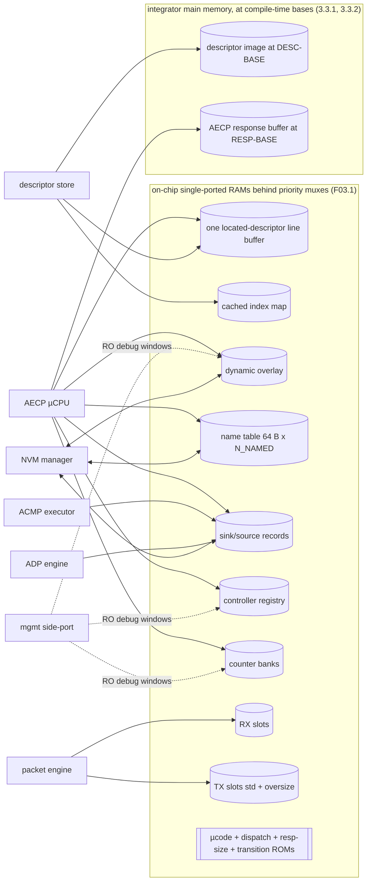
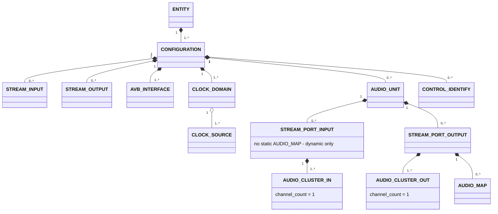

<!-- SPDX-License-Identifier: CERN-OHL-W-2.0 -->
# 07 — Memory Maps, Records, Persistence

## 1. Role

All storage: the entity model (static image + dynamic overlay + names), per-sink and
registry records, counter banks, buffers, the NVM layout and its commit/restore flows,
and the management side-port map. Other documents link here for every layout.

## 2. Memory system overview

<a id="fig-07-regions"></a>**F07.1 — Regions and port owners**



The two regions in main memory are reached over separate vendor-neutral masters and are
the integrator's to reserve — see the
[integrator guide](../guides/integrator.md#5-what-you-must-reserve-in-your-memory-map)
and [diagram 22](../diagrams/22-aecp-descriptor-fetch.svg).

Access-rights rule: exactly one writer class per region at runtime (µCPU for
overlay/names, ACMP executor for sink records, counters subsystem for banks); the
side-port is read-only everywhere after `entity_enable` except the control window.

## 3. Entity model

### 3.1 Descriptor tree

<a id="fig-07-tree"></a>**F07.2 — Milan descriptor tree (multiplicities per Milan §5.3.2/§5.3.3)**



Structural rules enforced by the **model lint** (build-time, part of the single-source
toolchain — [09 §1](09_verification.md)):

| # | Rule | Clause |
|---|---|---|
| L1 | Every descriptor except ENTITY/CONFIGURATION has exactly one parent; no cross-subtree sharing | Milan §5.3.2 |
| L2 | Indices dense, restart at 0 per configuration, IEEE ordering for multi-level types | IEEE §7.2 |
| L3 | ≥1 STREAM_INPUT or STREAM_OUTPUT per configuration; each with a Base format (talker §6.3 / listener §6.4 incl. rate-completeness + configuration-uniformity) | Milan §5.3.3.4, §6.3/§6.4 |
| L4 | STREAM_INPUT `buffer_length` ≥ 2 126 000 ns; CLASS_A flag set; CRF and AAF never mixed in one format list; `current_format` ∈ list; N formats ≤ 47 | Milan §5.3.3.4; IEEE 1722.1-2021 Table 7-8 (the N cap) |
| L5 | Same AVB_INTERFACE index for the same physical port in every configuration | Milan §5.3.3.5 |
| L6 | CLOCK_SOURCE construction: one INPUT_STREAM per CRF-capable input (or the single AAF input when no CRF input exists); ≥1 INTERNAL if any output; ≥1 CLOCK_SOURCE per CLOCK_DOMAIN; each CLOCK_DOMAIN's `clock_sources` list is the identity permutation 0..count-1 (dense, zero-based, in order): the processor's SET_CLOCK_SOURCE range check tests `clock_source_index` < `clock_sources_count` and relies on this list shape to be the IEEE §7.4.23.1 membership test ([06 §6.4](06_aecp_engine.md#64-validation-chains-order-matters-first-failure-responds)); gPTP-as-media-clock chain only in non-redundant single-interface models | Milan §5.3.3.6, §7.5; IEEE §7.4.23.1 |
| L7 | STREAM_PORT_INPUT owns no AUDIO_MAP; ≤1 static mapping per output stream channel; AUDIO_CLUSTER `channel_count` = 1 | Milan §5.3.3.7–.9 |
| L8 | Primary IDENTIFY CONTROL present in all configurations at the same index | Milan §5.3.3.10 |
| L9 | `entity_model_id` ≠ 0 / ≠ all-1s; changes whenever the static model changes | Milan §5.3.1 |
| L10 | AUDIO_UNIT `sampling_rates_offset` = 144 and `sampling_rates_count` ≤ 8, each entry the full sampling-rate word (pull field included): the processor's SET_SAMPLING_RATE reads the list at 144 and consults at most its first 8 entries ([06 §6.4](06_aecp_engine.md#64-validation-chains-order-matters-first-failure-responds)). Another offset refuses every rate, and a rate listed past the eighth entry is refused; neither can accept an unlisted rate | IEEE §7.2.3, §7.4.21.1; Milan §5.3.3.3 |

### 3.2 Descriptor sizing

<a id="fig-07-sizing"></a>**F07.3 — Fixed sizes + variable parts (IEEE Std 1722.1-2021 §7.2)**

| Descriptor | Type | Fixed B | Variable part |
|---|---|---|---|
| ENTITY | 0x0000 | 312 | — |
| CONFIGURATION | 0x0001 | 74 | + 4·descriptor_counts |
| AUDIO_UNIT | 0x0002 | 144 | + 4·sampling_rates |
| STREAM_INPUT / OUTPUT | 0x0005/6 | 138 | + 8·F formats (F ≤ 47, `formats_offset` = 138) + redundancy tail `redundant_offset` = 138+8F, **R = 0 emitted** (Table 7-8; see the Δ note) |
| AVB_INTERFACE | 0x0009 | 102 | — |
| CLOCK_SOURCE | 0x000A | 86 | — |
| STREAM_PORT_IN/OUT | 0x000E/F | 20 | — (no name field) |
| AUDIO_CLUSTER | 0x0014 | 90 | — |
| AUDIO_MAP | 0x0017 | 8 | + 8·mappings {stream_index, stream_channel, cluster_offset, cluster_channel} |
| CONTROL (identify) | 0x001A | 104 | + values (LINEAR_UINT8: 1×{min,max,step,default,current…}) |
| CLOCK_DOMAIN | 0x0024 | 76 | + 2·clock_sources |

> Δ note — two stream layouts exist; **IEEE Std 1722.1-2021 Table 7-8 is the one this
> design emits**. Table 7-8 (§7.2.6) places `redundant_offset` at 132,
> `number_of_redundant_streams` at 134, `timing` at 136 and `formats` at 138, for
> 138+8F+2R octets. Milan v1.2 §5.3.3.4 binds the descriptor to it: these descriptors
> "shall have the format specified in [ATDECC, Clause 7.2.6]". Milan v1.2 clause 2
> (References) defines [ATDECC] as IEEE Std 1722.1-2021.
>
> Milan v1.2 Annex C Table C.1 is a second normative layout: `formats` at 136, no
> `timing` field, 136+8F+2R octets. It is **optional here**. §5.3.3.4 says "A PAAD-AE
> may use the extension ... for any of its Streams and shall use it for the Streams
> that are part of the redundant pair". This design declares no redundant pair (R = 0),
> so the *shall* never fires and Table 7-8 governs unmodified. A previous revision of
> this note claimed Annex C "takes precedence for Milan builds". That read the **may**
> as a **shall**, and no shipping descriptor was ever assembled that way.
>
> One artifact still carries Annex C deliberately: the test vector
> [`hdl/aecp/desc/example_milan_8.json`](../../hdl/aecp/desc/example_milan_8.json),
> labelled as such in its own header. It disagrees with the shipping packer on purpose,
> because §3.3 below takes each descriptor's length from the index map and never reads a
> descriptor's interior. It is not a compliance reference and must not be copied into an
> entity model.

### 3.3 Static image

Read-only at runtime. Layout = concatenated descriptors in (configuration, type,
index) order + an **index map** per configuration (type → base pointer + count) used by
`DESC_ADDR`. READ_DESCRIPTOR assembles: image bytes, then overlay patches
(current values, names), then the Table 7-8 redundancy tail with R = 0.

Software loads it into the integrator's main memory at `DESC_BASE_P` before
`entity_enable` — **not** through the side-port window, and not as a synthesized ROM.
Both alternatives were priced and rejected in §3.3.1 below, and neither is what the RTL
does.

#### 3.3.1 Realization — the image lives in MAIN MEMORY, not on chip

`hdl/aecp/KL_aecp_desc_store.sv`. A ROM was priced and rejected: the reference
consumer's generated model is 22,561 B at the 8×8 shape (~5 RAMB36) *before* the
§3.4 overlay and the 64-B-per-descriptor name table, it grows with every stream,
descriptor and localized string, and the reference part (xc7a100t, 135 block-RAM
tiles) measured 131 tiles used. So the image sits in the integrator's main memory —
DDR3 on the reference board — behind a **vendor-neutral read-only master** on
`protocol_processor_top` (`desc_mem_*`: byte address + 64-bit beat count out, an
in-order response stream back). This repository does not know what that memory is.

Every address is an **elaboration parameter** (`DESC_BASE_P`), never a register and
never a CSR: the memory map is fixed when the bitstream is built, so a runtime base
would only buy a port and the flops behind it. The failure it removes ("base points
at nothing") is replaced by a likelier one — *software has not loaded the image yet*,
or loaded a truncated one — and uninitialised DRAM is not a recognisable zero. The
image therefore opens with a **magic + layout-version + checksum header** and nothing
is served until all three agree. While the image is invalid, an RGN_NCFG read reports
zero configurations, so `READ_DESCRIPTOR` returns `BAD_ARGUMENTS` before it locates.
A command that starts with a direct locate instead receives `st_err` and returns
`NO_SUCH_DESCRIPTOR`. Neither path can put descriptor bytes on the wire. A locate or
an RGN_NCFG read arriving while invalid TRIGGERS the header probe and stalls through
it, answering from the walk's
outcome (heal BEFORE answer, the r49a/w3a silicon round: the old
answer-then-re-arm order sacrificed the first wire command after every late
image load). A late load therefore heals with no reset and no lost command;
an absent bridge still degrades inside the memory watchdog.

Latency is the design problem (the reference SoC measures ~1424 ns on a miss to main
memory), so: the **index map is walked once into an on-chip table** — it is consulted
on every locate, and at 16 B per (configuration, type) caching it is cheap exactly
where caching the image is not — and a located descriptor is fetched **once, as a
single burst**, into a `LINE_BYTES_P` line buffer that every subsequent `READ_STATE` /
`COPY_BUFFER` beat reads on chip. One command pays one memory latency, not one per
byte. `LINE_BYTES_P` defaults to 576 = the largest descriptor §3.2 can produce, rounded
to the [03 §2](03_packet_engine.md) slot size. That worst case is a
STREAM_INPUT/OUTPUT at Table 7-8's caps of F ≤ 47 formats and R ≤ 8 redundant streams:
138 + 8·47 + 2·8 = 530 B. The Annex C layout of the Δ note is 2 B shorter at the same
caps (528 B), so 576 covers a model assembled either way. A descriptor longer than
the line is refused at load time (header `desc_max_len`) and at locate time, never
truncated.

The writable name table is loaded into its own on-chip overlay during the same
validation walk. A request can carry at most 511 beats, so the loader uses
504-beat chunks, the largest whole-name multiple that fits, until every 64-byte
entry is present. `NAME_ENTRIES_P` is the elaborated capacity and an image that
exceeds it is refused. The reference root derives that capacity from the same
generated entity shape that produces the image, including models whose table is
larger than one request.

#### 3.3.2 The other main-memory region — the AECP response buffer

The image is read-only and the store never writes it, but it is not the only region
this processor addresses. The AECP **response buffer** ([03 §7.1](03_packet_engine.md))
lives in main memory too, at its own compile-time `RESP_BASE_P`, behind a second
vendor-neutral master (`resp_mem_*`) that is READ **and** WRITE. The integrator
reserves `16 + LINE_BYTES_P` bytes there; unlike the image it is written by the
processor, so an overlap with `DESC_BASE_P` is silent corruption of the entity model
and neither base may be a register.

<a id="fig-07-image"></a>**F07.4 — flat image layout** (generator:
`hdl/aecp/desc/gen_desc_image.py`; all fields big-endian)

| Region | Field | Notes |
|---|---|---|
| header @0x00 (32 B) | `magic` u32 = `"AEMI"` · `layout_version` u16 = 1 · `n_config` u16 | |
| | `n_entries` u16 · `n_names` u16 · `index_off` u32 | |
| | `names_off` u32 · `image_bytes` u32 | |
| | `desc_max_len` u16 · reserved u16 · `checksum` u32 | the eight u32 words sum to `0xFFFFFFFF` |
| index map @`index_off` | `n_entries` × 16 B, sorted by (configuration, type): `config_index` u16 · `descriptor_type` u16 · `count` u16 · `elem_len` u16 · `elem_off` u32 · `name_base` u16 · `elem_stride` u16 | locate = `elem_off + index·elem_stride`, length `elem_len` |
| descriptors | concatenated in (configuration, type, index) order at `elem_stride` spacing | |
| name table @`names_off` | `n_names` × 64 B — the §3.4 overlay's initial content | |

Layout-version-1 constraints, enforced by the generator (it refuses an input that
violates them) and re-checked by the store at locate time: each index row is one
maximal run of equal `elem_len`, and `elem_stride` is `elem_len` rounded up to 8 so
index > 0 never starts mid-beat. Rows for one descriptor type remain contiguous.
The store accumulates the counts of earlier rows of that type before calculating
the run-relative index. This permits an AAF and CRF Stream Input to have the
different lengths their format lists require without adding a second indirection.

The µCPU's `st_*` face reaches all of this through a region nibble on `st_addr[19:16]`:
0x0 descriptor data, 0xB semantic `name_index` to writable-table byte address,
0xC the located descriptor's `name_base`, 0xD
`configurations_count` (so a µprogram can answer `BAD_ARGUMENTS` for a bad
configuration index per [06 §6.1](06_aecp_engine.md), not `NO_SUCH_DESCRIPTOR`), 0xE
its length, 0xF LOCATE with the 48-bit key on `st_wdata` — because a 20-bit address
cannot carry {configuration, type, index} and [06 §8](06_aecp_engine.md) leaves the
encoding open.

After every descriptor fetch, the store copies its named fields from the writable
table into the line buffer: ENTITY offsets 48 and 180, and offset 4 for every
other named descriptor. A name write to the currently located descriptor patches
the same line before accepting another state operation. Thus the table is the
single writable source while descriptor reads remain coherent with it.

### 3.4 Dynamic overlay

| Overlaid field | Width | NVM? |
|---|---|---|
| current configuration index | 16 | design decision — **yes** (review §8 item 1) |
| per AUDIO_UNIT `current_sampling_rate` | 32 | yes (§5.3.5.1) |
| per CLOCK_DOMAIN `clock_source_index` | 16 | yes (§5.3.11.1) |
| per stream `current_format` | 64 | yes (§5.3.7.1/§5.3.8.1) |
| per STREAM_OUTPUT presentation-time offset | 32 | yes (§5.3.7.6) |
| per port dynamic mapping tables | 64·M | yes (§5.3.9.1/§5.3.10.1) |
| name table: `entity_name`, `group_name`, `object_name` of every named descriptor | 64 B each | yes (§5.3.13) |
| identify value | 8 | no — reset to 0 |
| `system_unique_id` | 64 | design decision — yes |
| per CLOCK_DOMAIN `user_mcr_prio` + media-clock-domain name | 8 + 64 B | design decision — yes |

## 4. Dynamic state records

<a id="fig-07-sinkrec"></a>**F07.6 — ACMP sink record** (48 B core; fields defined in
[05 §5](05_acmp_engine.md); lanes bottom→top = record order)


<details>
<summary>WaveDrom source (editable)</summary>

```wavedrom
{"reg": [
  {"bits": 3,  "name": "sm_state"},
  {"bits": 3,  "name": "pbsta"},
  {"bits": 5,  "name": "acmpsta"},
  {"bits": 8,  "name": "flags: bound,started,sw,retried,srp_decl[1:0],tk_reg,tk_disc"},
  {"bits": 13, "name": "reserved"},
  {"bits": 64, "name": "talker_entity_id"},
  {"bits": 16, "name": "talker_unique_id"},
  {"bits": 16, "name": "probe_seq"},
  {"bits": 64, "name": "bind_controller_eid"},
  {"bits": 64, "name": "settled stream_id"},
  {"bits": 48, "name": "settled stream_dest_mac"},
  {"bits": 12, "name": "settled vlan_id"},
  {"bits": 4,  "name": "rsv"},
  {"bits": 32, "name": "last_available_index"},
  {"bits": 8,  "name": "saved interface_index"},
  {"bits": 8,  "name": "sm timer handle"},
  {"bits": 8,  "name": "noadp timer handle"},
  {"bits": 8,  "name": "rsv"}
], "config": {"bits": 384, "lanes": 12, "hspace": 950}}
```

</details>

Plus per sink: SRP failure registers {code 8, bridge_id 64} held in the `srp` adapter;
NVM shadow ≈ 20 B ({valid, talker EID, unique_id, controller EID, started}).

<a id="fig-07-regrec"></a>**F07.7 — Controller-registry entry** (28 B; Δ12 tuple; lanes
bottom→top = record order)


<details>
<summary>WaveDrom source (editable)</summary>

```wavedrom
{"reg": [
  {"bits": 64, "name": "controller_entity_id"},
  {"bits": 48, "name": "mac_address"},
  {"bits": 8,  "name": "port (AVB interface)"},
  {"bits": 8,  "name": "flags: valid, time_limited, probing"},
  {"bits": 16, "name": "next unsolicited sequence_id (init 0)"},
  {"bits": 16, "name": "reserved"},
  {"bits": 32, "name": "monitor deadline (T-NOTIF-MONITOR)"},
  {"bits": 32, "name": "time-limited deadline (T-NOTIF-TIMELIMITED)"}
], "config": {"bits": 224, "lanes": 7, "hspace": 950}}
```

</details>

<a id="fig-07-ctrmap"></a>**F07.10 — Counter banks** (full-bank form; compressed
option = only-implemented-offsets with an index ROM):

| Bank | Instances | Size | Reset domain |
|---|---|---|---|
| AVB_INTERFACE | P-N-AVB-INTERFACES | 4 (valid mask ROM) + 128 B | boot only |
| CLOCK_DOMAIN | P-N-CLOCK-DOMAINS | 128 B | boot only |
| STREAM_INPUT | P-N-STREAM-IN | 128 B | boot + **not-bound→bound** clear |
| STREAM_OUTPUT | P-N-STREAM-OUT | 128 B | boot; MEDIA_RESET/TS_UNCERTAIN/FRAMES_TX clear on stream start |

Event→address mapping and masks: [F06.15](06_aecp_engine.md#fig-06-counters).

## 5. Persistence

### 5.1 Persisted vs volatile (normative set — REQ-PER-001/002)

| Persisted (Milan clause) | Volatile (clause) |
|---|---|
| sampling rate (§5.3.5.1) · stream formats in/out (§5.3.7.1/§5.3.8.1) · presentation offset (§5.3.7.6) · bound state + binding params (§5.3.8.2/.3) · started/stopped (§5.3.8.7) · output + input mappings (§5.3.9.1/§5.3.10.1) · clock source (§5.3.11.1) · all user names (§5.3.13) | lock state (§5.3.4.1) · controller registry (§5.3.4.2) · identify value = 0 after reset (§5.3.12) |
| design decisions (review §8): current configuration index · system_unique_id · user_mcr_prio + MC domain name | |

### 5.2 NVM record layout

<a id="fig-07-nvmrec"></a>**F07.8 — Record framing** (device-agnostic; one record per
item group and index — a partial update never rewrites unrelated records; lanes
bottom→top = record order)


<details>
<summary>WaveDrom source (editable)</summary>

```wavedrom
{"reg": [
  {"bits": 16, "name": "magic 0x1722"},
  {"bits": 8,  "name": "layout_version"},
  {"bits": 8,  "name": "record_id"},
  {"bits": 16, "name": "payload_length"},
  {"bits": 16, "name": "crc16 (header+payload)"},
  {"bits": 32, "name": "payload ... record structs: RATE, FMT_IN/OUT[i], PT_OFS[i], BINDING[i]", "type": 3},
  {"bits": 32, "name": "... MAPS_IN/OUT[p], CLKSRC[d], NAMES[n], CFG_IDX, SUID, MCR[d]", "type": 3}
], "config": {"bits": 128, "lanes": 4, "hspace": 950}}
```

</details>

### 5.3 Commit / restore flows

```mermaid
flowchart TB
  subgraph runtime ["runtime commit"]
    chg["committed state change (COMMIT + NVM_MARK)"] --> dirty["set record dirty bit"]
    dirty --> deb["debounce T-NVM-DEBOUNCE (coalesce bursts)"]
    deb --> ser["serialize record + crc16"] --> port["class-F port write (F02.8)"]
    port --> ok{"done?"}
    ok -- err --> retry["bounded retry, then side-port alarm - responses were never blocked"]
    ok -- done --> clr["clear dirty"]
  end
  subgraph boot ["boot restore (before entity_enable)"]
    rd["read all records"] --> crc{"magic+version+crc ok?"}
    crc -- no --> defs["vendor defaults for that record"]
    crc -- yes --> apply["apply to overlay / sink shadows"]
    defs --> apply
    apply --> preload["saved binding present? preload listener SM to PRB_W_AVAIL (05)"]
    preload --> en["release entity_enable (ADP may start - Milan 5.6.1)"]
  end
```

<a id="fig-07-nvmflow"></a>**F07.9 — Runtime commit and boot restore**



### 5.4 Open decisions

Recorded in [review §8](../00_MILAN_COMPLIANCE_REVIEW.md): configuration-index,
system_unique_id and MCR persistence are design-affirmative (Milan silent); wear
management (write coalescing beyond `T-NVM-DEBOUNCE`) is device-dependent and out of
contract.

### 5.5 Side-port address map (detail of [02 §7](02_interfaces.md))

| Window (word addr) | Access | Contents | State in the landed top |
|---|---|---|---|
| 0x00000–0x0FFFF | W pre-enable | descriptor image, index maps, identity registers (entity_id, model_id, MACs, capabilities), profile select | reserved seam — reads 0; the image is loaded into main memory at `DESC_BASE_P` instead (§3.3.1 above) |
| 0x10000–0x1FFFF | RO | overlay + name table debug view | reserved seam — reads 0 |
| 0x20000–0x2FFFF | RO | registry entries, counter banks, sink records (snapshot) | **implemented** — the F02.10 class-D dictionary plus front-end counters |
| 0x30000–0x300FF | RW | control/status: entity_enable, boot state, NVM alarm, version/build id | word 0 scratch, word 1 boot state |
| 0x40000–0x4FFFF | RO | trace ring (class-A framing) | **implemented** |
| 0x50000–0x5FFFF | RW | firmware mailbox (`P-EN-FIRMWARE-ASSIST` only) | disabled — every access refused |

The **snapshot window at `0x20000`** is the observability surface. Its words 32–36 publish
the AECP engine, the descriptor store and the response buffer: command, response, drop and
locate-miss counters, the last response's status and length, the image-valid flag and its
fault code, and — words 35 and 36 — the count of responses voided by the response memory,
the lanes written to it and the last fault code on that master. The wire only ever shows
`ENTITY_MISBEHAVING` when that bridge fails; this window is where an integrator sees which
channel failed and how often.

The word-by-word map, with bit positions, is in the
[operator guide](../guides/operator.md#5-the-snapshot-window-word-by-word). Refused
accesses — a write to a read-only window, an image write after `entity_enable`, or any
unmapped address — answer with the error flag one cycle later and are never forwarded;
the enforcement lives in
[`KL_pp_side_port`](../../hdl/packet_engine/KL_pp_side_port.sv), not with the host.

## 6. Sizing roll-up (worked example)

Baseline: 1 configuration, 1 AVB interface, 2 in + 2 out streams, F = 6 formats each,
1 audio unit, 2 + 2 stream ports, 2 clusters/port, 1 output AUDIO_MAP (8 entries),
2 clock sources, 1 clock domain, identify control.

| Region | Formula | Bytes |
|---|---|---|
| Static image (**main memory**, not block RAM) | 312 + (74+4·10) + (144+4·3) + 4·(138+48) + 102 + 2·86 + 4·20 + 8·90 + (8+64) + (104+9) + (76+4) + index maps ≈ | **≈ 2.9 K** at this small baseline; the reference consumer's model at its shipping shape is an order of magnitude larger, which is why §3.3.1 moved it off chip |
| Overlay + names | ≈ 20 named × 64 + currents + maps | ≈ 1.6 K |
| Sink/source records | 2×48 + 2×16 (source DA gates) | 128 |
| Registry | 16 × 28 | 448 |
| Counters | (1+1+2+2) × 132 | 792 |
| RX + TX slots | 4×576 + 4×576 + 1600 | 6.2 K |
| NVM image | Σ records ≈ | ≈ 2.5 K |

Total block RAM well under 32 KB for the baseline — the architecture scales linearly
via the [F01.5](01_overview.md#fig-01-params) parameters. Note that the first and largest
row is **not** block RAM in the landed implementation: the static image and the AECP
response buffer both live in the integrator's main memory (§3.3.1, §3.3.2), which is what
makes the on-chip total fit at all on the reference part.

## 7. Cross-references

Covers REQ-MDL-001…011, REQ-PER-001…003 and storage referenced by
[04](04_adp_engine.md)/[05](05_acmp_engine.md)/[06](06_aecp_engine.md). NVM handshake:
[F02.8](02_interfaces.md#fig-02-nvmwave). Power-cut verification: NVM category
([09 §3](09_verification.md)).
