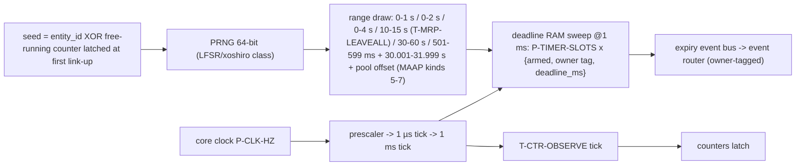
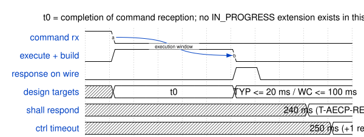

<!-- SPDX-License-Identifier: CERN-OHL-W-2.0 -->
# 08 — Timing, Timers, Deadlines

## 1. Role

Single source of truth for **every time constant** (T-IDs), the timer hardware that
implements them, and the response-latency budgets. No other document states a value.

## 2. Master constant table

<a id="fig-08-constants"></a>**F08.1 — All T-IDs** (profile column: value in a
plain-IEEE build where different; blank = same).

| T-ID | Value | Owner | Meaning | Clause | IEEE profile |
|---|---|---|---|---|---|
| T-ADP-ADV | 5 s fixed | ADP | re-advertise period (valid_time = 10 ⇒ 20 s validity) | Milan §5.6.2/.3 | valid_time/2 model |
| T-ADP-DELAY | random 0–4 s | ADP | pre-advertise anti-storm (LINK_UP, DISCOVER, TMR, GM_CHANGE) | Milan §5.6.3.5.3–.7 | randomDeviceDelay (ms-scale) |
| T-ADP-DELAY-START | random 0–2 s | ADP | startup-link-up variant — distinct constant | Milan §5.6.3.5.2 | — |
| T-ADP-NOADP | rx valid_time (20 s typ.) | ADP | bound-talker aging | Milan §5.6.4.5.1 | |
| T-ACMP-CMD | 200 ms | ACMP/originator | all five ACMP command timeouts, 2 attempts | Milan Table 5.26 | 2000/4500/500/200 ms |
| T-ACMP-DELAY | random 0–1 s | ACMP | listener pre-probe anti-storm | Milan Table 5.29 | — |
| T-ACMP-RETRY | 4 s | ACMP | probe backoff after failure/error | Milan §5.5.3.5.23 | — |
| T-ACMP-NOTK | 10 s | ACMP | settled: max wait for matching talker attribute | Milan §5.5.3.5.18 | — |
| T-AECP-RESP | 240 ms | AECP | hard respond budget (never IN_PROGRESS) | IEEE §9.3.2.6; Milan §5.4.3.4 | |
| T-AECP-TIMEOUT | 250 ms | originator | inflight timeout for originated AECP commands (+1 retry) | IEEE §9.3.2.6 | |
| T-AECP-INPROG | 120 ms | — | IN_PROGRESS cadence — **unused by policy** | IEEE §9.3.2.6 | |
| T-NOTIF-MONITOR | random 30–60 s | registry | per-controller departing detection | Milan §5.4.5.3 | — |
| T-NOTIF-TIMELIMITED | 300 s | registry | TIME_LIMITED registration expiry (controllers re-register at 100 s) | IEEE §7.4.37.2 | |
| T-LOCK-UNLOCK | 60 s | lock mgr | auto-unlock + notification | Milan §5.4.2.2 | |
| T-IDENT-BURST | 150 ms ×3 | identify | IDENTIFY_NOTIFICATION triple | IEEE §7.5.1.2.1 | |
| T-IDENT-REARM | 1 s | identify | re-arm while button held | IEEE §7.5.1.2.1 | |
| T-CTR-OBSERVE | ≤ 1 s tick | counters | observation-interval latch | Milan §5.3.8.10 | |
| T-CTR-NOTIF | 1 s | notif engine | ≥ 1 s between GET_COUNTERS notifications per descriptor | Milan Table 5.22 | |
| T-SRP-DAFRESH | 15 s | talker DA gate | PROBE_TX freshness window for DA validity | Milan §4.3.3.1 | — |
| T-SRP-LEAVEALL2 | 2 × T-MRP-LEAVEALL ≈ 20–30 s | talker DA gate | backoff after MAAP conflict / PCP change | Milan Table 5.3 | — |
| T-MAAP-PROBE | random, strictly 500 ms < T < 600 ms | MAAP engine (11) | probe_timer — a fresh draw at every start | 1722-2016 B.3.4.2, Table B.8 | |
| T-MAAP-ANNOUNCE | random, strictly 30 s < T < 32 s | MAAP engine (11) | announce_timer — a fresh draw at every start | 1722-2016 B.3.4.1, Table B.8 | |
| T-MRP-JOIN | 200 ms (180–240) | SRP engine (10) | MRP joinTime — join tx cadence + vector aggregation window | Milan Table 4.3 | |
| T-MRP-LEAVE | 5000 ms (4500–7500) | SRP engine (10) | MRP LeaveTime — registrar LV expiry during LeaveAll (Δ13 removes the rLv path) | Milan Table 4.3 | 600–1000 ms (802.1Q Table 10-7) — coupled to Δ13: change both or neither |
| T-MRP-LEAVEALL | random 10–15 s | SRP engine (10) | leavealltimer per participant | Milan Table 4.3 | |
| T-MRP-PERIODIC | 1000 ms (900–1500) | SRP engine (10) | periodictimer — periodic re-join transmissions | Milan Table 4.3 | |
| T-NVM-DEBOUNCE | ≈ 500 ms (design) | NVM mgr | commit coalescing | design | |
| T-TX-AGING | 10 ms (design) | TX arbiter | starvation promotion | design | |
| T-BUDGET-ACMP-RESP | ≤ 50 ms (design) | budgets | see §4 | design | |
| T-BUDGET-AECP-TYP / -WC | ≤ 20 ms / ≤ 100 ms (design) | budgets | see §4 | design | |

The original document's single 187.5 ms target is **superseded** by §4
([GAP-07](../00_MILAN_COMPLIANCE_REVIEW.md#gap-07)).

## 3. Timer hardware

<a id="fig-08-timerhw"></a>**F08.2 — Timebase, pools, PRNG**



- All protocol timers use 1 ms resolution (smallest constant 150 ms; randomized draws
  quantize to 1 ms). Deadlines are absolute ms timestamps compared on sweep — arming is
  O(1), expiry detection bounded by `P-TIMER-SLOTS` per ms.
- PRNG seeding follows IEEE §6.2.4.2.2 practice (MAC/EID + time source, sequence
  length ≥ 2³²−1); range reduction by rejection so draws are unbiased.
- Verification hook: a **time-compression factor** on the prescaler (sim-only) scales
  every constant uniformly ([09 §3](09_verification.md), TIM).

## 4. Deadline budgets

<a id="fig-08-budget"></a>**F08.3 — AECP/MVU response window (schematic, ms axis)**



<details>
<summary>WaveDrom source (editable)</summary>

```wavedrom
{"signal": [
  {"name": "command rx",      "wave": "10.........", "node": ".a........."},
  {"name": "execute + build", "wave": "01....0....", "node": "......b...."},
  {"name": "response on wire","wave": "0.....10...", "node": ""},
  {"name": "design targets",  "wave": "x=....=....", "data": ["t0", "TYP <= 20 ms / WC <= 100 ms"]},
  {"name": "shall respond",   "wave": "x........=.", "data": ["240 ms (T-AECP-RESP)"]},
  {"name": "ctrl timeout",    "wave": "x.........=", "data": ["250 ms (+1 retry)"]}
],
 "edge": ["a~>b execution window"],
 "head": {"text": "t0 = completion of command reception; no IN_PROGRESS extension exists in this design"}}
```

</details>

| Protocol | Hard limit | Design budget | Rationale |
|---|---|---|---|
| ACMP responses | initiator times out at `T-ACMP-CMD` (200 ms, 2 attempts) | **T-BUDGET-ACMP-RESP ≤ 50 ms** | leaves ≥ 150 ms network + initiator margin inside a single attempt |
| AECP/MVU responses | respond ≤ `T-AECP-RESP` (240 ms) | **≤ 20 ms typical; ≤ 100 ms worst-case** (oversize READ_DESCRIPTOR, full GET_DYNAMIC_INFO batch, 16-way fan-out contention) | 2.4× margin at worst case |
| ADP DISCOVER response | within the delay window | `T-ADP-DELAY` draw | anti-storm by design |
| Unsolicited fan-out | no protocol deadline | ≤ 1 frame-time gap injection | never starves solicited traffic ([03 §8](03_packet_engine.md)) |

## 5. Timer allocation and sizing

<a id="fig-08-alloc"></a>**F08.4 — Ownership × multiplicity → `P-TIMER-SLOTS`**

| T-ID | Instances | Count |
|---|---|---|
| T-ADP-ADV / T-ADP-DELAY(-START) | per interface (one shared slot — SM is in exactly one timed state) | 1 × IF |
| T-ADP-NOADP | per sink | 1 × SI |
| T-ACMP-{CMD, DELAY, RETRY, NOTK} | per sink (one shared SM slot — states are exclusive) | 1 × SI |
| T-SRP-DAFRESH / T-SRP-LEAVEALL2 | per source (shared slot) | 1 × SO |
| T-NOTIF-MONITOR + T-NOTIF-TIMELIMITED | per registry entry | 2 × CTRL × IF |
| T-AECP-TIMEOUT (CA inflight) | pool | P-CA-POOL |
| T-LOCK-UNLOCK, T-IDENT-BURST, T-IDENT-REARM, T-CTR-OBSERVE, T-NVM-DEBOUNCE | singletons | 5 |
| T-MAAP-PROBE + T-MAAP-ANNOUNCE | one SM per entity (one block claim, [11](11_maap_engine.md)) | 2 |
| T-MRP-{JOIN, LEAVEALL} × 2 participants + T-MRP-PERIODIC + registrar-leave pool (T-MRP-LEAVE, active only during LeaveAll: SI + SO stream registrars + the Domain and MVRP VID registrars) | per interface, when `P-EN-SRP-ENGINE` | (7 + SI + SO) × IF |

`P-TIMER-SLOTS = IF + SI + SI + SO + 2·CTRL·IF + P-CA-POOL + 5 + 2 [+ (7 + SI + SO)·IF with the SRP engine]`
(+`T-CTR-NOTIF` implemented as a per-descriptor last-sent timestamp, not a timer slot).
The MAAP pair was **appended after the singletons** so every earlier base — the ones
landed engines' default parameters already point at — stays put; only `base_end` and
the SRP block moved, by exactly 2. Baseline example (1 IF, 8 + 8 streams, 16
controllers, CA pool 4): `1 + 8 + 8 + 8 + 32 + 4 + 5 + 2 = 68`, plus the SRP
engine's `7 + 8 + 8 = 23` → **91** slots — one 91 × 40-bit deadline RAM (3,640 bits:
still the same single RAMB18 the 66-slot baseline used).

### 5.1 The map: order is the contract, spacing is the shape

The **row order** above is normative — engines are parameterized with a base slot
and index it as `base + instance`, so moving a group renumbers everything after it.
The **sizes** are not: each group's extent depends on `SI` / `SO` / `IF` / `CTRL`, so
every base is the running sum of the extents before it, computed once in
`pp_pkg::pp_timer_map()` and read from there by `protocol_processor_top`. Written as
literals the map is correct at exactly one shape: at `SI = SO = 9` the 8-stream
literals put ACMP listener sink 8 on the talker base and SRP talker 8 on the SRP
listener base. The first is a **lost** deadline (the ACMP engines filter expiries by
owner tag, and theirs differ); the second is a **misdelivered** one (ADP and SRP
filter by slot, with no owner discrimination). Neither raises an error or moves a
counter. The 02 §5 event-router source map has the same shape-dependence and the same
cure (`pp_pkg::pp_evr_map()`), with no owner tag at all to fall back on.

The expiry bus carries `{slot, owner}` in a **fixed** 8-bit owner space
(`pp_pkg PP_OWN_*`: listener `0x20`, SRP talker `0x40`, ACMP talker `0x50`, SRP
listener `0x60`, SRP cadence `0x80`, MAAP `0x90`; ADP publishes its slot *as* its
owner tag). That
space does not scale with the shape, so it is not re-spaced — it is **bounded**: an
elaboration guard in the top refuses to build a shape whose owner ranges would
overlap. The current allocation admits up to 16 sources and 31 sinks. Both maps and
the guard are graded by the `timer_map` suite ([09 §3](09_verification.md)).

## 6. Cross-references

Consumed by every engine (§9 sections of [04](04_adp_engine.md)/[05](05_acmp_engine.md)/
[06](06_aecp_engine.md)); CDC/tick generation contract in [02 §2](02_interfaces.md);
TIM verification category in [09 §3](09_verification.md). Covers REQ-ADP-001/008/014,
REQ-ACMP-003/015, REQ-AEM-024, REQ-MVU-005, REQ-NOT-004 timing aspects.
